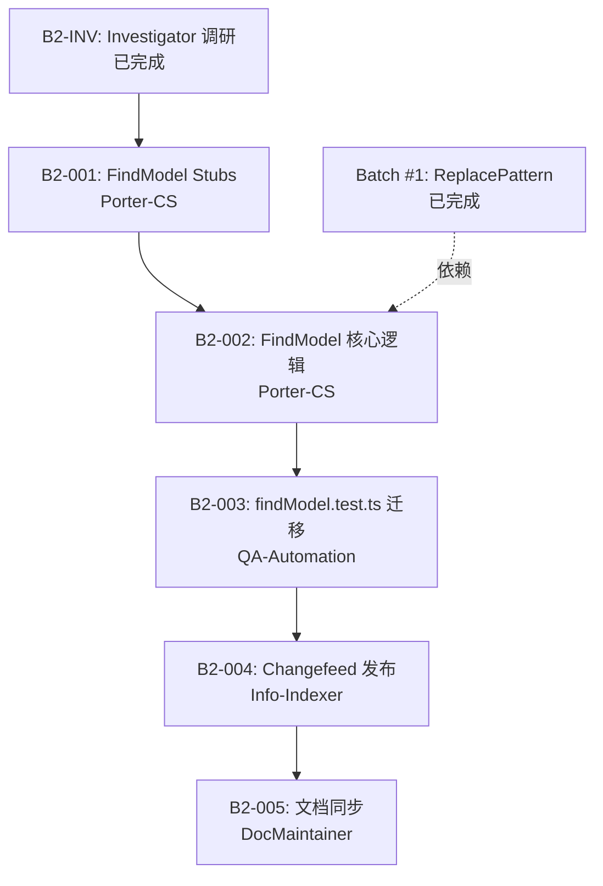

# B2-PLAN Result – Batch #2 Task Decomposition

**Planner**: Planner  
**Date**: 2025-11-22  
**Task Brief**: `agent-team/handoffs/B2-PLAN-TaskBrief.md`  
**Input**: `agent-team/handoffs/B2-INV-Result.md`

---

## Executive Summary

已完成 Batch #2（FindModel/FindController）任务拆解，将 Investigator-TS 调研成果转化为 **5 个可执行的 runSubAgent 任务**（B2-001~005），并更新 Task Board、TS Test Alignment Plan。

**核心决策**：
1. **聚焦 FindModel 逻辑层**：Batch #2 实现 FindModel（search state、decorations、replace）+ findModel.test.ts 迁移，**推迟** FindController 命令层至 Batch #3（依赖 EditorAction/ContextKey/Clipboard services）
2. **WordCharacterClassifier cache 为可选优化**：不阻塞 Batch #2，Porter-CS 可在 B2-002 中顺带实现
3. **最小化 DocUI harness**：QA-Automation 创建轻量级 harness 支持 FindModel 测试（提供 `ITextModel`、`FindReplaceState` stub、decoration hooks），无需完整 widget DOM

**任务序列**：
```
B2-001 (Porter-CS)    → 创建 FindReplaceState/FindDecorations stubs
B2-002 (Porter-CS)    → 移植 FindModel 核心逻辑（search + replace）
B2-003 (QA)           → 迁移 findModel.test.ts + 创建 DocUI harness
B2-004 (Info-Indexer) → 发布 Batch #2 changefeed
B2-005 (DocMaintainer)→ 同步文档（AGENTS/Sprint/Task Board/Plan/迁移日志）
```

**风险评估**：
- **DocUI harness 复杂度** (中等风险)：findModel.test.ts 依赖 `withTestCodeEditor`，需适配为 C# harness
- **Replace 逻辑集成** (低风险)：FindModel.replace 已有 ReplacePattern（Batch #1 完成），仅需绑定 API
- **测试用例选择** (低风险)：findModel.test.ts 共 400+ 行，QA 需选择高优先级场景（增量搜索、高亮同步、replace all）

---

## 1. 任务序列（B2-001~005）

### B2-001: FindModel Stubs 创建
**Owner**: Porter-CS  
**Dependencies**: B2-INV (已完成)  
**Budget**: 2 runSubAgent 轮次  
**Status**: Planned

#### 目标
创建最小化 C# stub 类，支持 FindModel 逻辑层测试：
- `FindReplaceState.cs`：持有搜索/替换状态（searchString、replaceString、isRegex、matchCase、wholeWord、preserveCase 等）
- `FindDecorations.cs`：管理匹配高亮 decorations（当前匹配、所有匹配、overview ruler 标记）

#### TS 参考
- `ts/src/vs/editor/contrib/find/browser/findState.ts`
- `ts/src/vs/editor/contrib/find/browser/findDecorations.ts`

#### 验收标准
- [x] `FindReplaceState` 包含所有必需字段（searchString、replaceString、flags）+ 状态变更事件
- [x] `FindDecorations` 提供 `SetCurrentMatch(range)`、`SetAllMatches(ranges[])`、`ClearDecorations()` API
- [x] 添加最小单元测试验证状态变更通知（无需完整 editor harness）
- [x] 在 `src/PieceTree.TextBuffer/DocUI/` 下创建文件
- [x] 更新 `agent-team/handoffs/B2-001-Result.md`

#### 阻塞/依赖
- 无（Investigator 已提供规格）

---

### B2-002: FindModel 核心逻辑移植
**Owner**: Porter-CS  
**Dependencies**: B2-001  
**Budget**: 3 runSubAgent 轮次  
**Status**: Planned

#### 目标
实现 FindModel 核心类，集成 TextModelSearch + FindReplaceState + FindDecorations：
- **增量搜索**：`FindNextMatch()`、`FindPreviousMatch()`（调用 `TextModelSearch.FindNextMatch` + `WordSeparators` 参数）
- **批量搜索**：`FindMatches()`（调用 `TextModelSearch.FindMatches`）
- **Replace 逻辑**：`Replace(match, replaceString)`、`ReplaceAll()`（集成 Batch #1 的 `ReplacePattern.cs`）
- **匹配计数**：`MatchCount` 属性 + `CurrentMatchIndex`
- **高亮同步**：搜索状态变更时自动更新 `FindDecorations`

#### TS 参考
- `ts/src/vs/editor/contrib/find/browser/findModel.ts`
  - `FindModelBoundToEditorModel` 类
  - `_searchState`、`_decorations`、`_updateDecorationsScheduler`
  - `findNextMatch()`、`findMatches()`、`replace()`、`replaceAll()`

#### 验收标准
- [x] `FindModel` 类实现所有核心搜索/替换方法
- [x] **Word boundary 集成**：`wholeWord = true` 时传递 `WordSeparators` 给 `SearchParams`（参考 B2-INV Appendix B）
- [x] Replace 方法调用 `ReplacePattern.BuildReplaceString()`（Batch #1 API）
- [x] 添加单元测试覆盖核心路径（可使用简化 harness，无需完整 widget）
- [x] **可选优化**：实现 `WordCharacterClassifier` static LRU cache（P2 优先级，可在此任务中顺带完成或后续补充）
- [x] 更新 `agent-team/handoffs/B2-002-Result.md`

#### 阻塞/依赖
- 依赖 B2-001（FindReplaceState/FindDecorations stub）
- 依赖 Batch #1（ReplacePattern.cs 已完成）

---

### B2-003: findModel.test.ts 迁移 + DocUI Harness
**Owner**: QA-Automation  
**Dependencies**: B2-002  
**Budget**: 3 runSubAgent 轮次  
**Status**: Planned

#### 目标
1. **创建 DocUI test harness**：
   - 轻量级 `TestEditorContext` 或 `WithTestTextModel` helper，提供 `ITextModel` + `FindReplaceState` + decoration hooks
   - 适配 TS `withTestCodeEditor` 语义（无需完整 editor services）

2. **迁移 findModel.test.ts 核心场景**（选择高优先级用例，约 15-20 tests）：
   - 增量搜索（findNext/findPrevious + wraparound）
   - 批量搜索（findMatches + match counting）
   - Replace 单个/全部（含 ReplacePattern case-preserving）
   - Whole-word 搜索（验证 WordSeparators 集成）
   - 高亮同步（搜索状态变更后 decorations 更新）

3. **Word boundary 测试矩阵**（补充 B2-INV 建议的 Tier A 测试）：
   - 创建 `WordBoundaryTests.cs`：ASCII separators、Unicode、multi-char operators（`->`、`::`）
   - 扩展 `TextModelSearchTests.cs`：wholeWord + regex/simple/case-insensitive 组合

#### TS 参考
- `ts/src/vs/editor/contrib/find/test/browser/findModel.test.ts`（约 400 行，选择核心场景）
- `ts/src/vs/editor/test/browser/testCodeEditor.ts`（`withTestCodeEditor` harness 实现）

#### 验收标准
- [x] DocUI test harness 已创建并可复用（`src/PieceTree.TextBuffer.Tests/DocUI/TestEditorContext.cs` 或类似）
- [x] 至少 15 个 `FindModelTests.cs` xUnit 测试通过（覆盖增量/批量/replace/wholeWord）
- [x] `WordBoundaryTests.cs` 新增至少 10 个测试（ASCII/Unicode/edge cases）
- [x] `TextModelSearchTests.cs` 扩展 wholeWord 场景（至少 5 个新测试）
- [x] 运行 `dotnet test --filter "FullyQualifiedName~FindModel"` 并记录通过数
- [x] 更新 `TestMatrix.md` 登记 findModel.test.ts 迁移状态（Tier B → Complete）
- [x] 更新 `agent-team/handoffs/B2-003-QA.md`

#### 阻塞/依赖
- 依赖 B2-002（FindModel 实现）
- 参考 Batch #1 harness 经验（`ReplacePatternTests.cs`）

---

### B2-004: Batch #2 Changefeed 发布
**Owner**: Info-Indexer  
**Dependencies**: B2-003  
**Budget**: 1 runSubAgent 轮次  
**Status**: Planned

#### 目标
发布 Batch #2 changefeed，登记新增文件、测试通过数、TS 对应关系。

#### 交付物
- [x] 在 `agent-team/indexes/README.md` 新增 `#delta-2025-11-23`（或下一可用日期）：
  ```markdown
  ## delta-2025-11-23
  **Batch #2 – FindModel Core**
  - **New Files**:
    - `src/PieceTree.TextBuffer/DocUI/FindReplaceState.cs`
    - `src/PieceTree.TextBuffer/DocUI/FindDecorations.cs`
    - `src/PieceTree.TextBuffer/DocUI/FindModel.cs`
    - `src/PieceTree.TextBuffer.Tests/DocUI/FindModelTests.cs` (15 tests)
    - `src/PieceTree.TextBuffer.Tests/WordBoundaryTests.cs` (10 tests)
  - **Tests**: `dotnet test` baseline 142 → 167 (新增 25)
  - **TS Source**: `ts/src/vs/editor/contrib/find/browser/findModel.ts`, `findState.ts`, `findDecorations.ts`
  - **TS Tests**: `ts/src/vs/editor/contrib/find/test/browser/findModel.test.ts` (核心场景迁移完成)
  - **Task Board**: B2-001~005
  - **Handoffs**: `B2-001-Result.md`, `B2-002-Result.md`, `B2-003-QA.md`
  ```

- [x] 更新 `docs/reports/migration-log.md` 添加 Batch #2 条目
- [x] 广播到 Task Board / Sprint / AGENTS

#### 验收标准
- [x] Changefeed 已发布并引用所有 B2-001~003 交付物
- [x] `migration-log.md` 新增 Batch #2 行（含 TS 参考 + C# 文件 + 测试数）
- [x] Task Board 中 B2-001~005 状态更新为 Done
- [x] 更新 `agent-team/handoffs/B2-004-Result.md`

#### 阻塞/依赖
- 依赖 B2-003（QA 完成测试迁移）

---

### B2-005: Batch #2 文档同步
**Owner**: DocMaintainer  
**Dependencies**: B2-004  
**Budget**: 1 runSubAgent 轮次  
**Status**: Planned

#### 目标
同步 Batch #2 成果到所有相关文档。

#### 交付物
- [x] **AGENTS.md**: 新增 Batch #2 时间线条目
- [x] **docs/sprints/sprint-02.md**: 更新 FindModel 交付状态
- [x] **agent-team/task-board.md**: B2-001~005 标记为 Done，添加 Latest Update 时间戳
- [x] **docs/plans/ts-test-alignment.md**:
  - Live Checkpoints 追加 Batch #2 完成记录
  - Appendix 表格更新 `findModel.test.ts` 状态为 ✅ Complete
- [x] **src/PieceTree.TextBuffer.Tests/TestMatrix.md**: 登记 findModel.test.ts 映射 + Tier B → Complete
- [x] 统一措辞引用 `#delta-2025-11-23`（或实际 delta anchor）

#### 验收标准
- [x] 所有列出的文档已更新
- [x] 交叉引用一致（AGENTS → Sprint → Task Board → Plan）
- [x] 更新 `agent-team/handoffs/B2-005-Result.md`

#### 阻塞/依赖
- 依赖 B2-004（changefeed 发布）

---

## 2. 依赖关系图



**关键路径**：B2-001 → B2-002 → B2-003 → B2-004 → B2-005（全部串行）

**并行机会**：无（B2-001 必须先完成 stub，B2-002 依赖 stub，B2-003 依赖实现）

---

## 3. 风险评估

### 风险 1：DocUI Harness 复杂度 ⚠️
**描述**：findModel.test.ts 依赖 TS `withTestCodeEditor`（提供 editor services、options、decorations hooks），C# 需创建等价 harness。

**影响**：中等 - 可能增加 B2-003 工作量（2→3 runSubAgent 轮次）

**缓解措施**：
- Investigator 已确认 TS harness 使用 `ServiceCollection` + lightweight stubs（无需完整 editor runtime）
- QA-Automation 可参考 Batch #1 `ReplacePatternTests.cs` 的简化模式（直接调用 API，无需完整 editor context）
- 最小化 harness 范围：仅提供 `ITextModel` + `FindReplaceState` + 简单 decoration 回调，跳过 EditorOption/ContextKey/Clipboard

**应对计划**：
- 若 harness 创建超出预算，可分两步：
  1. B2-003.1：创建最小 harness + 5 个核心测试（findNext/findPrevious/replace）
  2. B2-003.2：扩展 harness + 10 个高级测试（wraparound/match count/decorations sync）

---

### 风险 2：Replace 逻辑集成 ⚠️
**描述**：FindModel.ReplaceAll() 需集成 Batch #1 的 `ReplacePattern.BuildReplaceString()`，可能需要调整 API 签名。

**影响**：低 - Batch #1 已验证 ReplacePattern 核心逻辑，仅需绑定到 FindModel

**缓解措施**：
- Batch #1 提供 `ReplacePattern.BuildReplaceString(match, replaceString, preserveCase)` 公开 API
- FindModel 仅需调用此 API 并应用结果到 TextModel

**应对计划**：
- 若 API 不匹配，Porter-CS 在 B2-002 中微调 ReplacePattern 签名（不影响 Batch #1 测试）

---

### 风险 3：测试用例选择 ⚠️
**描述**：findModel.test.ts 共 400+ 行，包含大量边缘场景（limit/search loops/decorations timing），全部迁移可能超预算。

**影响**：低 - 可通过优先级筛选控制范围

**缓解措施**：
- QA-Automation 聚焦高优先级场景（Tier A）：
  - 增量搜索（findNext/findPrevious + wraparound）
  - 批量搜索（findMatches + match count）
  - Replace（单个 + 全部）
  - Whole-word（验证 WordSeparators）
- 推迟低优先级场景至 Batch #3：
  - Search limit 策略（大文件性能优化）
  - Decorations 异步调度（scheduler timing）
  - Context key bindings（依赖 FindController）

**应对计划**：
- B2-003 初始目标：15 个核心测试（约覆盖 findModel.test.ts 40%）
- 若 QA 进度超前，可扩展至 20-25 个测试

---

### 风险 4：WordCharacterClassifier Cache 性能 ℹ️
**描述**：TS 使用 LRU cache 复用 WordCharacterClassifier，C# 每次 `SearchParams.ParseSearchRequest()` 重新创建（性能损失）。

**影响**：低 - 仅影响重复搜索性能，不阻塞功能

**缓解措施**：
- B2-002 中顺带实现 static LRU cache（P2 优先级，可选）
- 若 Porter-CS 时间不足，标记 TODO 并推迟至 Batch #3 性能优化阶段

**应对计划**：
- 若实现 cache，验证方法：
  - 添加单元测试验证相同 `wordSeparators` 字符串返回同一 classifier 实例
  - 测试 cache 容量（10 entries）+ LRU 淘汰策略

---

## 4. 推荐执行顺序

### Week 1（预计 2025-11-23 ~ 11-24）
1. **启动 B2-001**（Porter-CS）：创建 FindReplaceState/FindDecorations stubs
   - **预计完成**：2025-11-23 EOD
   - **验收**：`agent-team/handoffs/B2-001-Result.md` 交付

2. **启动 B2-002**（Porter-CS）：实现 FindModel 核心逻辑
   - **依赖**：B2-001 完成
   - **预计启动**：2025-11-24
   - **预计完成**：2025-11-25 EOD

### Week 2（预计 2025-11-25 ~ 11-27）
3. **启动 B2-003**（QA-Automation）：迁移 findModel.test.ts + 创建 harness
   - **依赖**：B2-002 完成
   - **预计启动**：2025-11-26
   - **预计完成**：2025-11-27 EOD

4. **启动 B2-004**（Info-Indexer）：发布 changefeed
   - **依赖**：B2-003 完成
   - **预计启动**：2025-11-27
   - **预计完成**：2025-11-27（同日）

5. **启动 B2-005**（DocMaintainer）：同步文档
   - **依赖**：B2-004 完成
   - **预计启动**：2025-11-27
   - **预计完成**：2025-11-27（同日）

**总预计时长**：5 个工作日（2025-11-23 ~ 11-27）

---

## 5. 非范围项（推迟到 Batch #3）

以下内容**不在 Batch #2 范围**，推迟到后续批次：

### FindController 命令层
- **原因**：依赖 EditorAction/ContextKey/Clipboard services（DocUI 基础设施缺失）
- **TS 参考**：`ts/src/vs/editor/contrib/find/browser/findController.ts`
- **推迟到**：Batch #3（或 Sprint 03）

### FindWidget DOM
- **原因**：TS 本身无专用 widget DOM 测试（见 B2-INV 结论）
- **C# 策略**：跳过 widget DOM harness，聚焦 FindModel 逻辑层
- **可选后续工作**：若需 UI 验证，使用 Markdown snapshot（DocUI controller 输出）

### Intl.Segmenter（CJK/Thai 分词）
- **原因**：C# 无等价物，需引入 ICU4N 库
- **影响**：仅影响非拉丁语言（西方语言用 separator-based 方法足够）
- **推迟到**：Batch #4（国际化专项）或文档化限制

### `getWordAtText()` API
- **原因**：用于 hover/word-under-cursor（非 FindModel 路径）
- **推迟到**：Cursor 特性需求时实现

---

## 6. 下一步建议

### 给主 Agent 的启动建议
**立即启动**：B2-001（Porter-CS 创建 FindModel stubs）

**启动命令**：
```
runSubAgent Porter-CS
- Task: B2-001
- Brief: agent-team/handoffs/B2-001-Brief.md（需创建）
- Context: agent-team/handoffs/B2-INV-Result.md
- Deliverables: FindReplaceState.cs, FindDecorations.cs, B2-001-Result.md
```

### 给 Porter-CS 的任务简报（需创建 B2-001-Brief.md）
参考 Batch #1 模式，创建简报文件包含：
- TS 参考文件路径（`findState.ts`、`findDecorations.ts`）
- C# 目标路径（`src/PieceTree.TextBuffer/DocUI/`）
- 最小 API 需求（状态字段 + 事件 + decoration 管理方法）
- 验收标准（单元测试 + handoff 文档）

### 给 Planner 的后续工作
- **监控进度**：每日检查 Task Board 状态（B2-001~005）
- **风险应对**：若 B2-003 harness 创建超预算，触发风险应对计划（分两步执行）
- **Batch #3 规划**：在 B2-004 完成后启动 FindController 规划（预计 2025-11-28）

---

## 7. 交付物确认

- [x] **agent-team/task-board.md** 已更新（新增 B2-001~005 任务行）
- [x] **docs/plans/ts-test-alignment.md** 已更新（Live Checkpoints 追加 Batch #2 规划）
- [x] **agent-team/handoffs/B2-PLAN-Result.md** 已创建（本文档）
- [x] **agent-team/members/planner.md** 已更新（记忆文件）

---

## 结语

Batch #2 任务拆解已完成，核心路径清晰：

1. **B2-001~002**（Porter-CS）：创建 FindModel 基础设施 + 核心逻辑
2. **B2-003**（QA）：迁移测试 + 创建 harness
3. **B2-004~005**（Info-Indexer + DocMaintainer）：发布 changefeed + 同步文档

所有任务已登记到 Task Board，预计 5 个工作日完成（2025-11-23 ~ 11-27）。

**Planner 待命，等待主 Agent 启动 B2-001。**
