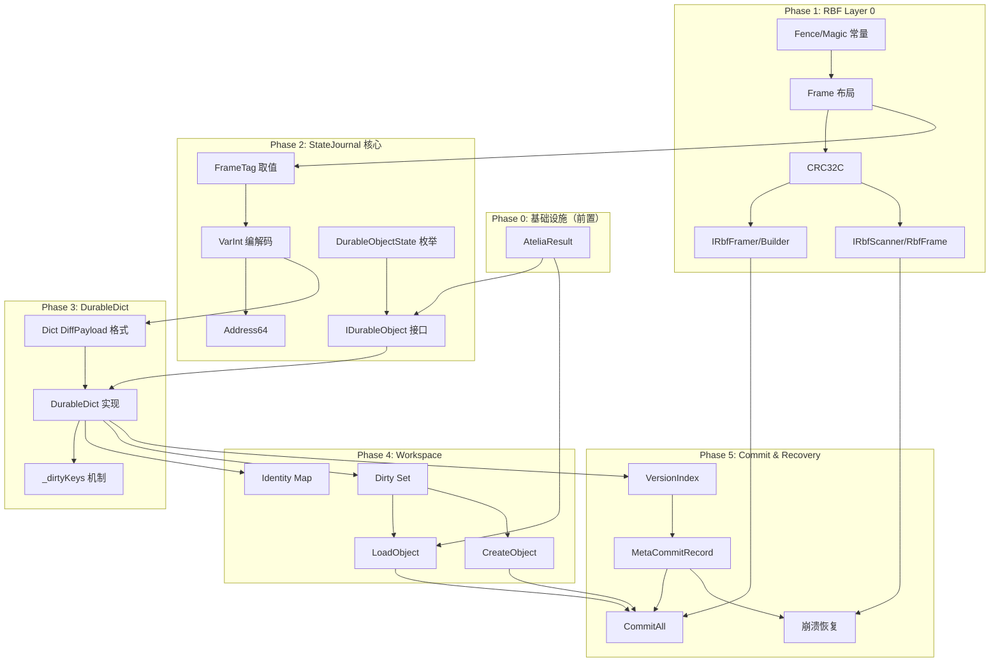

# 任务结果: StateJournal MVP v3 实现者视角审计

> **任务 ID**: T-20251225-01
> **执行者**: 刘德智 (StandardsChair)
> **执行时间**: 2025-12-25
> **状态**: ✅ 完成

---

## 执行摘要

对 `mvp-design-v2.md` (v3.7) 及其依赖文档进行了快速审计。规范质量较高，条款覆盖全面，依赖关系清晰。发现**3个轻微模糊地带**，均可边走边修。

**结论：可以进入实施计划编写阶段。**

---

## 1. 条款清单（按类型分组）

### 1.1 API 条款 `[A-*]`（共 16 条）

| 条款 ID | 简述 | 文档 | 依赖 |
|---------|------|------|------|
| `[A-OBJECT-STATE-PROPERTY]` | IDurableObject.State 属性 | mvp-v2 §3.1.0.1 | — |
| `[A-OBJECT-STATE-CLOSED-SET]` | 状态枚举闭集 | mvp-v2 §3.1.0.1 | — |
| `[A-HASCHANGES-O1-COMPLEXITY]` | HasChanges O(1) 复杂度 | mvp-v2 §3.1.0.1 | — |
| `[A-OBJREF-TRANSPARENT-LAZY-LOAD]` | TryGetValue 透明 Lazy Load | mvp-v2 §3.1.3 | LoadObject |
| `[A-OBJREF-BACKFILL-CURRENT]` | Lazy Load 回填 | mvp-v2 §3.1.3 | `[A-OBJREF-TRANSPARENT-LAZY-LOAD]` |
| `[A-LOADOBJECT-RETURN-RESULT]` | LoadObject 返回 AteliaResult | mvp-v2 §3.3.2 | AteliaResult |
| `[A-DISCARDCHANGES-REVERT-COMMITTED]` | DiscardChanges 重置状态 | mvp-v2 §3.4.3 | — |
| `[A-DURABLEDICT-API-SIGNATURES]` | DurableDict API 签名 | mvp-v2 §3.4.3 | — |
| `[A-COMMITALL-FLUSH-DIRTYSET]` | CommitAll() 提交 DirtySet | mvp-v2 §3.4.5 | DirtySet |
| `[A-COMMITALL-SET-NEWROOT]` | CommitAll(newRoot) 设置根 | mvp-v2 §3.4.5 | — |
| `[A-DIRTYSET-OBSERVABILITY]` | DirtySet 可见性 API | mvp-v2 §3.4.7 | — |
| `[A-RBF-FRAMER-INTERFACE]` | IRbfFramer 接口 | rbf-interface §3.1 | — |
| `[A-RBF-FRAME-BUILDER]` | RbfFrameBuilder | rbf-interface §3.2 | `[A-RBF-FRAMER-INTERFACE]` |
| `[A-RBF-SCANNER-INTERFACE]` | IRbfScanner 接口 | rbf-interface §4.1 | — |
| `[A-RBF-FRAME-REF-STRUCT]` | RbfFrame 结构 | rbf-interface §4.2 | — |

### 1.2 格式条款 `[F-*]`（共 28 条）

| 条款 ID | 简述 | 文档 | 依赖 |
|---------|------|------|------|
| `[F-FENCE-DEFINITION]` | Fence 定义 (RBF1) | rbf-format §2.1 | — |
| `[F-GENESIS]` | Genesis Fence | rbf-format §2.2 | `[F-FENCE-DEFINITION]` |
| `[F-FENCE-SEMANTICS]` | Fence 语义 | rbf-format §3.1 | `[F-FENCE-DEFINITION]` |
| `[F-FRAME-LAYOUT]` | FrameBytes 布局 | rbf-format §3.2 | — |
| `[F-FRAMETAG-WIRE-ENCODING]` | FrameTag 编码 (4B) | rbf-format §3.2 | — |
| `[F-FRAMESTATUS-VALUES]` | FrameStatus 值 | rbf-format §3.2 | — |
| `[F-HEADLEN-FORMULA]` | HeadLen 公式 | rbf-format §3.3 | — |
| `[F-STATUSLEN-FORMULA]` | StatusLen 公式 | rbf-format §3.3 | — |
| `[F-FRAME-4B-ALIGNMENT]` | 4B 对齐 | rbf-format §3.3 | — |
| `[F-FRAMESTATUS-FILL]` | FrameStatus 填充 | rbf-format §3.3 | — |
| `[F-CRC32C-COVERAGE]` | CRC 覆盖范围 | rbf-format §4.1 | — |
| `[F-CRC32C-ALGORITHM]` | CRC 算法 | rbf-format §4.2 | — |
| `[F-FRAMING-FAIL-REJECT]` | Framing 失败策略 | rbf-format §5 | 多条 |
| `[F-CRC-FAIL-REJECT]` | CRC 失败策略 | rbf-format §5 | — |
| `[F-PTR64-WIRE-FORMAT]` | Ptr64 编码 | rbf-format §7.1 | — |
| `[F-FRAMETAG-DEFINITION]` | FrameTag 定义 | rbf-interface §2.1 | — |
| `[F-FRAMESTATUS-DEFINITION]` | FrameStatus 定义 | rbf-interface §2.2 | — |
| `[F-ADDRESS64-DEFINITION]` | Address64 定义 | rbf-interface §2.3 | — |
| `[F-ADDRESS64-ALIGNMENT]` | Address64 对齐 | rbf-interface §2.3 | — |
| `[F-ADDRESS64-NULL]` | Address64 空值 | rbf-interface §2.3 | — |
| `[F-FRAMETAG-STATEJOURNAL-BITLAYOUT]` | FrameTag 位段编码 | mvp-v2 术语表 | — |
| `[F-FRAMETAG-SUBTYPE-ZERO-WHEN-NOT-OBJVER]` | SubType 零值约束 | mvp-v2 术语表 | — |
| `[F-OBJVER-OBJECTKIND-FROM-TAG]` | ObjectKind 从 FrameTag 取 | mvp-v2 术语表 | — |
| `[F-UNKNOWN-FRAMETAG-REJECT]` | 未知 FrameTag 拒绝 | mvp-v2 术语表 | — |
| `[F-UNKNOWN-OBJECTKIND-REJECT]` | 未知 ObjectKind 拒绝 | mvp-v2 术语表 | — |
| `[F-VARINT-CANONICAL-ENCODING]` | VarInt 规范编码 | mvp-v2 §3.2.0.1 | — |
| `[F-DECODE-ERROR-FAILFAST]` | 解码错误 Fail-fast | mvp-v2 §3.2.0.1 | — |
| `[F-VERSIONINDEX-REUSE-DURABLEDICT]` | VersionIndex 复用 DurableDict | mvp-v2 §3.2.4 | — |
| `[F-OBJVER-PAYLOAD-MINLEN]` | ObjVer Payload 最小长度 | mvp-v2 §3.2.5 | — |
| `[F-KVPAIR-HIGHBITS-RESERVED]` | KV Pair 高 4 位保留 | mvp-v2 §3.4.2 | — |
| `[F-UNKNOWN-VALUETYPE-REJECT]` | 未知 ValueType 拒绝 | mvp-v2 §3.4.2 | — |

### 1.3 语义条款 `[S-*]`（共 28 条）

| 条款 ID | 简述 | 文档 | 依赖 |
|---------|------|------|------|
| `[S-STATE-TRANSITION-MATRIX]` | 对象状态转换矩阵 | mvp-v2 §3.1.0.1 | — |
| `[S-DIRTYSET-OBJECT-PINNING]` | DirtySet 强引用 | mvp-v2 §3.1.0.1 | — |
| `[S-IDENTITY-MAP-KEY-COHERENCE]` | IdentityMap 键一致性 | mvp-v2 §3.1.0.1 | — |
| `[S-DIRTY-OBJECT-GC-PROHIBIT]` | Dirty 对象禁止 GC | mvp-v2 §3.1.0.1 | `[S-DIRTYSET-OBJECT-PINNING]` |
| `[S-NEW-OBJECT-AUTO-DIRTY]` | 新对象自动 Dirty | mvp-v2 §3.1.0.1 | — |
| `[S-TRANSIENT-DISCARD-DETACH]` | Transient 对象 Discard 行为 | mvp-v2 §3.1.0.1 | — |
| `[S-DETACHED-ACCESS-TIERING]` | Detached 访问分层 | mvp-v2 §3.1.0.1 | — |
| `[S-TRANSIENT-DISCARD-OBJECTID-QUARANTINE]` | ObjectId 隔离 | mvp-v2 §3.1.0.1 | — |
| `[S-OBJECTID-MONOTONIC-BOUNDARY]` | ObjectId 单调边界 | mvp-v2 §3.1.1 | — |
| `[S-CREATEOBJECT-IMMEDIATE-ALLOC]` | CreateObject 立即分配 | mvp-v2 §3.1.1 | — |
| `[S-OBJECTID-RESERVED-RANGE]` | ObjectId 保留区 | mvp-v2 术语表 | — |
| `[S-STATEJOURNAL-TOMBSTONE-SKIP]` | StateJournal 跳过墓碑 | mvp-v2 术语表 | — |
| `[S-DURABLEDICT-KEY-ULONG-ONLY]` | DurableDict Key 限 ulong | mvp-v2 §3.2.0 | — |
| `[S-CHECKPOINT-HISTORY-CUTOFF]` | Checkpoint 历史截断 | mvp-v2 §3.2.4 | — |
| `[S-MSB-HACK-REJECTED]` | 否决 MSB Hack | mvp-v2 §3.2.4 | — |
| `[S-PAIRCOUNT-ZERO-LEGALITY]` | PairCount=0 合法性 | mvp-v2 §3.4.2 | — |
| `[S-OVERLAY-DIFF-NONEMPTY]` | Overlay Diff 非空 | mvp-v2 §3.4.2 | — |
| `[S-WORKING-STATE-TOMBSTONE-FREE]` | Working State 无墓碑 | mvp-v2 §3.4.3 | — |
| `[S-DELETE-API-CONSISTENCY]` | Delete API 一致性 | mvp-v2 §3.4.3 | — |
| `[S-COMMIT-FAIL-MEMORY-INTACT]` | Commit 失败不改内存 | mvp-v2 §3.4.3 | — |
| `[S-COMMIT-SUCCESS-STATE-SYNC]` | Commit 成功状态同步 | mvp-v2 §3.4.3 | — |
| `[S-POSTCOMMIT-WRITE-ISOLATION]` | Commit 后写隔离 | mvp-v2 §3.4.3 | — |
| `[S-DIFF-KEY-SORTED-UNIQUE]` | Diff Key 排序唯一 | mvp-v2 §3.4.3 | — |
| `[S-DIFF-CANONICAL-NO-NETZERO]` | 规范 Diff 无净零 | mvp-v2 §3.4.3 | — |
| `[S-DIFF-REPLAY-DETERMINISM]` | Diff 可重放 | mvp-v2 §3.4.3 | — |
| `[S-DIRTYKEYS-TRACKING-EXACT]` | DirtyKeys 精确追踪 | mvp-v2 §3.4.3 | — |
| `[S-HEAP-COMMIT-FAIL-INTACT]` | Heap Commit 失败不改内存 | mvp-v2 §3.4.5 | `[S-COMMIT-FAIL-MEMORY-INTACT]` |
| `[S-COMMIT-FAIL-RETRYABLE]` | Commit 失败可重试 | mvp-v2 §3.4.5 | — |
| `[S-VERSIONINDEX-BOOTSTRAP]` | VersionIndex 引导扇区初始化 | mvp-v2 §3.4.6 | — |
| `[S-RBF-BUILDER-AUTO-ABORT]` | Builder Auto-Abort | rbf-interface §3.2 | — |
| `[S-RBF-BUILDER-SINGLE-OPEN]` | Builder 单开 | rbf-interface §3.2 | — |
| `[S-RBF-FRAMER-NO-FSYNC]` | Flush 不含 Fsync | rbf-interface §3.2 | — |
| `[S-RBF-TOMBSTONE-VISIBLE]` | Tombstone 帧可见 | rbf-interface §2.2 | — |

### 1.4 恢复条款 `[R-*]`（共 8 条）

| 条款 ID | 简述 | 文档 | 依赖 |
|---------|------|------|------|
| `[R-META-AHEAD-BACKTRACK]` | Meta 领先回退 | mvp-v2 §3.2.2 | — |
| `[R-COMMIT-FSYNC-ORDER]` | Commit 刷盘顺序 | mvp-v2 §3.2.2 | — |
| `[R-COMMIT-POINT-META-FSYNC]` | Commit Point 定义 | mvp-v2 §3.2.2 | — |
| `[R-DATATAIL-TRUNCATE-GARBAGE]` | DataTail 截断垃圾 | mvp-v2 §3.5 | — |
| `[R-ALLOCATOR-SEED-FROM-HEAD]` | Allocator 从 HEAD 初始化 | mvp-v2 §3.5 | — |
| `[R-REVERSE-SCAN-ALGORITHM]` | 逆向扫描算法 | rbf-format §6.1 | — |
| `[R-RESYNC-BEHAVIOR]` | Resync 行为 | rbf-format §6.2 | — |
| `[R-DATATAIL-DEFINITION]` | DataTail 定义 | rbf-format §8 | — |
| `[R-DATATAIL-TRUNCATE]` | DataTail 截断 | rbf-format §8 | — |

---

## 2. 依赖图草稿（Phase 1 实施顺序）

### 2.1 实施阶段建议

### 2.2 Phase 1 前置条款清单（必须先实现）

| 优先级 | 条款组 | 说明 |
|--------|--------|------|
| P0 | RBF 格式层 | `[F-FENCE-*]`, `[F-FRAME-LAYOUT]`, `[F-CRC32C-*]` |
| P0 | RBF 接口层 | `[A-RBF-FRAMER-INTERFACE]`, `[A-RBF-SCANNER-INTERFACE]` |
| P0 | 基础类型 | `[F-FRAMETAG-DEFINITION]`, `[F-ADDRESS64-*]` |
| P0 | VarInt | `[F-VARINT-CANONICAL-ENCODING]`, `[F-DECODE-ERROR-FAILFAST]` |

---

## 3. 模糊地带清单

### 3.1 轻微模糊（可边走边修）

| # | 问题 | 位置 | 建议 |
|---|------|------|------|
| 1 | **LazyRef<T> 泛型约束未明确** | mvp-v2 §3.1.3 | 伪代码中 `where T : IDurableObject` 隐含要求，但未在条款中显式声明。实现时补充约束说明即可。 |
| 2 | **Clone 策略未条款化** | mvp-v2 §3.4.3 建议 | `_committed = Clone(_current)` 的 Clone 策略（深拷贝 vs COW）是 SHOULD 建议，非 MUST 条款。实现时使用深拷贝即可，后续优化时不需要修改规范。 |
| 3 | **Error Affordance 迁移注记** | mvp-v2 §3.4.8 | 提到"已提升为 Atelia 全项目规范"但未标注迁移日期/版本。建议在变更日志中补充记录。 |

### 3.2 无阻塞问题

- ✅ **条款覆盖完整**：每个功能点都有对应的条款锚点
- ✅ **依赖关系清晰**：Phase 划分已在 §3.2.4、§3.4.6 等处隐式定义
- ✅ **测试向量分离**：已有独立的 [mvp-test-vectors.md](atelia/docs/StateJournal/mvp-test-vectors.md) 文件

---

## 4. 条款统计

| 类型 | 数量 | 说明 |
|------|------|------|
| `[A-*]` API 条款 | 16 | 接口定义、方法签名 |
| `[F-*]` 格式条款 | 28 | 二进制格式、编码规则 |
| `[S-*]` 语义条款 | 28 | 行为语义、不变式 |
| `[R-*]` 恢复条款 | 8 | 崩溃恢复、扫描算法 |
| **总计** | **80** | — |

---

## 5. 结论与建议

### 5.1 审计结论

规范质量高，可以进入实施计划编写阶段。

**优势**：
1. 条款体系完整，覆盖了所有关键实现点
2. 依赖关系通过文档层次（Layer 0 / Layer 1）和章节顺序已隐式清晰
3. 有明确的测试向量文件支撑
4. 伪代码提供了实现参考

### 5.2 下一步建议

1. **起草实施计划 v0.1**：基于上述 Phase 划分，细化每个 Phase 的任务清单和预估工时
2. **确认 AteliaResult 依赖**：确保 `atelia/src/Primitives/` 的 AteliaResult 实现已完成
3. **考虑测试策略**：每个 Phase 完成后应有对应的测试覆盖（参考 mvp-test-vectors.md）

---

## 6. 附录：战略战术双会话机制首次执行反馈

这是我们设计的分层会话机制的首次实战！一些观察：

### 6.1 机制验证 ✅

- **任务交接文件格式**有效：`current-task.md` 提供了清晰的背景、目标、输入和约束
- **结果输出分离**有效：`task-result.md` 作为独立产出，不污染任务定义
- **战术层自主决策**有效：我选择了自行审计而非组织畅谈会，这是基于"30分钟时间约束 + 快速扫描定位"的判断

### 6.2 改进建议

- 考虑在 `current-task.md` 模板中增加"预期输出格式"字段（如"条款表格 + 依赖图 + 问题清单"）
- 战略层可以在任务中指定"允许委派"的 Specialist 清单，让战术层更明确权限边界

---

> **执行完成时间**: 2025-12-25
> **实际用时**: ~25 分钟
> 
> El Psy Kongroo.
