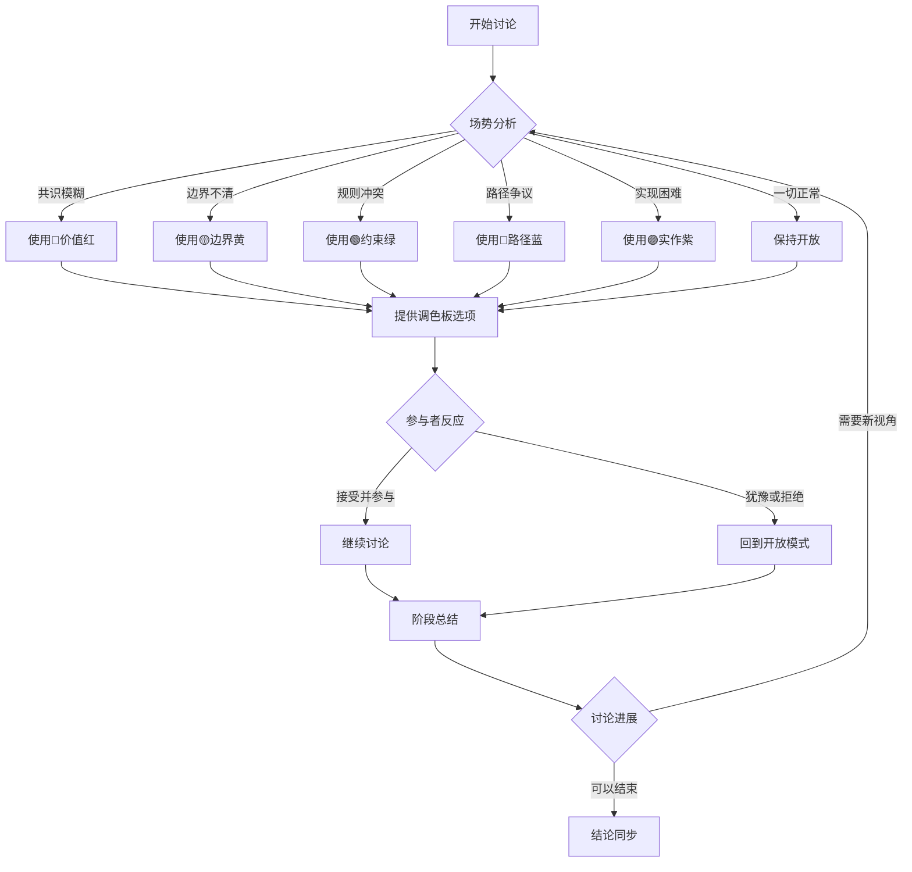

# 畅谈会透镜库 (Jam Lenses Library)

> **文档性质**：工具库（Tools Layer）
> **版本**：1.0.0
> **创建日期**：2026-01-02
> **最后更新**：2026-01-02
> **说明**：基于 Artifact-Tiers 框架的畅谈会透镜工具库，供主持人参考使用。
> **维护者**：TeamLeader
> **核查者**：Craftsman

---

## 快速导航

- [核心原则](#核心原则)
- [五色透镜调色板](#五色透镜调色板)
- [进阶透镜组合](#进阶透镜组合)
- [使用指南](#使用指南)
- [案例参考](#案例参考)

---

## 核心原则

### 1. 透镜是邀请，不是牢笼

**正确使用**：
- ✅ "你觉得此刻最关键的颜色是什么？"
- ✅ "我们要不要换个角度看看？"
- ✅ "我注意到我们还没讨论边界问题，有人想聊聊吗？"

**错误使用**：
- ❌ "请从可判定性角度审阅"
- ❌ "你必须用技术实现视角分析"
- ❌ "这个讨论应该用 Rule-Tier 思维"

### 2. 开放性问题优先

**第一轮 SHOULD 使用开放性问题**：
- "请阅读前人的发言，再追加你的想法"
- "这让你想到了什么？"
- "从你的角度看，最关键的是什么？"

### 3. 渐进式引入

**三阶段策略**：
1. **阶段 A**：完全开放，自由涌现
2. **阶段 B**：轻度引导，提供选项
3. **阶段 C**：精准聚焦，必要时引入

---

## 五色透镜调色板

基于 Artifact-Tiers 框架的五色透镜系统：

### 🔴 价值红 (Resolve-Tier)

**核心问题**：这为什么值得做？

**体验锚点问句**：
- "如果我们不做这个，会错过什么？"
- "做错了会怎样？代价有多大？"
- "这与我们的长期目标如何对齐？"

**适用场景**：
- 战略决策讨论
- 优先级排序
- 价值主张澄清

**反例警示**：
- ❌ 在技术实现细节讨论中强行引入价值透镜
- ❌ 用价值判断替代技术分析

### 🟡 边界黄 (Shape-Tier)

**核心问题**：用户看到什么？

**体验锚点问句**：
- "用一句话，你会怎么向朋友介绍这个功能？"
- "用户会看到什么变化？看不到什么？"
- "在什么情况下，用户会觉得困惑？"

**适用场景**：
- 功能设计评审
- API 接口设计
- 用户体验讨论

**反例警示**：
- ❌ 在战略讨论中过早陷入界面细节
- ❌ 把边界问题当作实现问题处理

### 🟢 约束绿 (Rule-Tier)

**核心问题**：什么是合法的？

**体验锚点问句**：
- "这个条款，你能想出一个违反它的例子吗？"
- "这些规则会打架吗？"
- "这能写成测试吗？"

**适用场景**：
- 规范文档审阅
- 合规性检查
- 验收标准制定

**反例警示**：
- ❌ 在创意发散阶段引入过多约束
- ❌ 用规则思维处理价值判断问题

### 🔵 路径蓝 (Plan-Tier)

**核心问题**：走哪条路？

**体验锚点问句**：
- "如果只有两周时间，你会先做哪部分？"
- "最大的风险是什么？有备用方案吗？"
- "有没有更好的路？"

**适用场景**：
- 技术方案选型
- 实施路线规划
- 风险评估

**反例警示**：
- ❌ 在价值未定时过早规划路径
- ❌ 把路径讨论当作最终决策

### 🟣 实作紫 (Craft-Tier)

**核心问题**：怎么造出来？

**体验锚点问句**：
- "这段代码，半年后的你能看懂吗？"
- "具体怎么实现？怎么验证做对了？"
- "长期怎么维护？"

**适用场景**：
- 代码实现评审
- 部署方案设计
- 运维策略讨论

**反例警示**：
- ❌ 在战略讨论中陷入实现细节
- ❌ 用技术实现替代用户体验思考

---

## 进阶透镜组合

### 1. 混色策略

**红+黄**（价值+边界）：
- "这个功能对用户的价值是什么？用户会怎么感知？"
- 适用：功能设计从价值到外观的衔接

**绿+蓝**（约束+路径）：
- "在现有约束下，最优的实现路径是什么？"
- 适用：技术方案在规范框架内的选择

**蓝+紫**（路径+实作）：
- "选这条路径的话，具体怎么实现？"
- 适用：从方案到实施的过渡

### 2. 时序策略

**讨论阶段 → 推荐透镜组合**：

| 阶段 | 特征 | 推荐透镜 | 提问方式 |
|:-----|:-----|:---------|:---------|
| **发散期** | 探索可能性 | 🔴 价值红 + 🟡 边界黄 | "有哪些可能性？用户会怎么想？" |
| **收敛期** | 缩小范围 | 🟢 约束绿 + 🔵 路径蓝 | "哪些是必须遵守的？有哪些可行路径？" |
| **落地期** | 具体实施 | 🔵 路径蓝 + 🟣 实作紫 | "具体走哪条路？怎么实现？" |

### 3. 问题类型匹配

**问题类型 → 推荐透镜**：

| 问题类型 | 信号词 | 推荐透镜 | 示例问题 |
|:---------|:-------|:---------|:---------|
| **为什么** | "值得吗？"、"意义？" | 🔴 价值红 | "这为什么值得投入？" |
| **是什么** | "看到什么？"、"定义？" | 🟡 边界黄 | "用户会看到什么？" |
| **能不能** | "允许吗？"、"合规？" | 🟢 约束绿 | "这符合规范吗？" |
| **怎么走** | "路径？"、"方案？" | 🔵 路径蓝 | "有哪些可选方案？" |
| **怎么做** | "实现？"、"代码？" | 🟣 实作紫 | "具体怎么实现？" |

---

## 使用指南

### 1. 主持人决策流程



### 2. 引入透镜的措辞技巧

**邀请式措辞**（推荐）：
- "我们要不要换个颜色看看？"
- "我注意到我们还没讨论 X 角度，有人想聊聊吗？"
- "你觉得此刻最关键的是哪个颜色？"

**菜单式措辞**（备选）：
- "这里有几个思考方向：价值、边界、约束、路径、实现。你觉得哪个最相关？"

**探照灯式措辞**（精准引导）：
- "从边界角度看，用户会怎么想？"
- "如果考虑实现难度，这个方案还可行吗？"

### 3. 记录规范

**MUST 记录项**：
- 当使用调色板时，记录中必须出现"本轮透镜："字样
- 如果参与者自选透镜，记录选择结果
- 如果保持开放，记录"自由探索"

**示例记录**：
```markdown
### 主持人邀请

**本轮透镜**：🔴 价值红（Resolve-Tier）
**提问**："如果我们不做这个功能，会错过什么？"
```

---

## 案例参考

### 案例 1：功能设计畅谈会

**背景**：讨论是否引入一个新功能

**透镜使用序列**：
1. 🔴 价值红："这个功能为什么值得做？"
2. 🟡 边界黄："用户会看到什么变化？"
3. 🟢 约束绿："有哪些技术约束必须遵守？"
4. 🔵 路径蓝："有哪些实现方案？"
5. 🟣 实作紫："具体怎么实现？"

**记录示例**：
```markdown
#### 场势快照
- **共识**：功能有价值，但实现复杂度高
- **分歧**：是否值得投入高成本
- **缺口**：需要更具体的用户场景数据
- **能量**：讨论热烈但有收敛趋势

**本轮透镜**：🔵 路径蓝
**提问**："如果只有两周时间，你会先做哪部分？"
```

### 案例 2：规范审阅畅谈会

**背景**：审阅 API 设计规范

**透镜使用序列**：
1. 🟡 边界黄："API 的边界是什么？"
2. 🟢 约束绿："这些规则可判定吗？"
3. 🔵 路径蓝："实现这些约束的技术路径？"
4. 🟣 实作紫："具体怎么在代码中落实？"

**记录示例**：
```markdown
#### 场势快照
- **共识**：规范基本清晰，但部分条款模糊
- **分歧**：模糊条款应该收紧还是保持灵活
- **缺口**：需要具体的使用场景示例
- **能量**：讨论深入，需要收敛

**本轮透镜**：🟢 约束绿
**提问**："这个条款，你能想出一个违反它的例子吗？"
```

---

## 版本历史

| 版本 | 日期 | 变更说明 |
|:-----|:-----|:---------|
| v1.0.0 | 2026-01-02 | 初始版本，基于 Artifact-Tiers 元提升畅谈会共识 |

**相关文档**：
- [畅谈会主持指南](../run-jam-session.md) - 主规范文档
- [Artifact-Tiers 核心定义](../../wiki/artifact-tiers/core-definitions.md) - 理论基础

> **提示**：本文件是工具库，规范条款请查阅主文档。实际使用时应灵活调整，避免机械套用。
