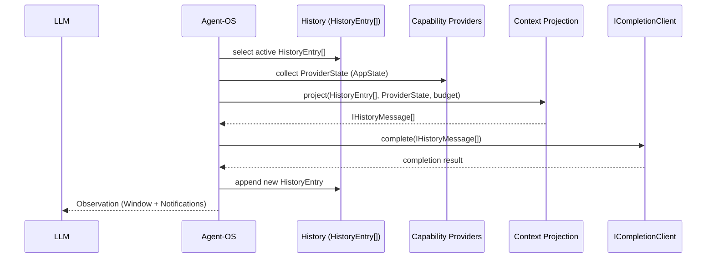

# DocUI Key-Note 修订研讨会

> **日期**: 2025-12-13
> **主持人**: AI Team Leader (刘德智)
> **参会者**: DocUIClaude, DocUIGemini, DocUIGPT
> **目标**: 形成一系列一致赞同的、可操作性的 Key-Note 修订建议

---

## 会议议程

1. **开场** — 主持人介绍会议目标和规则
2. **第一轮：问题陈述** — 各 Specialist 陈述自己发现的主要问题
3. **第二轮：交叉提问** — 针对其他人的发现提问或补充
4. **第三轮：解决方案讨论** — 讨论具体的修订建议
5. **第四轮：共识确认** — 确认一致同意的建议，搁置分歧
6. **闭幕** — 主持人总结

---

## 会议规则

- 发言格式：`### [发言人] HH:MM` 
- 可以引用他人观点：`> @发言人: 原文`
- 表示赞同：`+1` 或 `👍`
- 表示保留意见：`🤔 [理由]`
- 建议修订时使用代码块标注具体文字

---

## 开场

### [主持人] 10:00

各位 DocUI Key-Note 撰写顾问，欢迎参加本次研讨会。

**会议背景**：
- 我们已有 5 篇 Key-Note 文档，定义了 DocUI 的核心概念
- 各位在首次同步时都识别了一些术语一致性、概念缝隙等问题
- 人类伙伴已修正了部分拼写错误，但行文和概念梳理问题仍需解决

**本次目标**：
1. 汇总各位发现的问题
2. 讨论并形成可操作的修订建议
3. 对于难以调和的分歧，先记录搁置

**重要约束**：
- 我们只提出建议，不直接修改原文
- 建议需要具体、可操作（指明文件、位置、修改内容）

现在进入第一轮：问题陈述。请各位依次分享你们发现的主要问题。

---

## 第一轮：问题陈述

### [DocUIClaude] 10:05

各位好，我来陈述我在消化 Key-Note 过程中识别的最重要问题。按优先级排序如下：

**问题 1: Attention Focus 机制缺乏正式定义**
- 位置: [doc-as-usr-interface.md](../../../DocUI/docs/key-notes/doc-as-usr-interface.md)（"待消化的建议"部分）
- 问题描述: 文档中提及了 "Attention Focus" 概念——Agent 操作对象自动 Full、相关对象 Summary、其余 Gist——但这只是"待消化的建议"，从未被正式纳入核心设计。然而，这个概念对于理解 LOD 级别如何动态切换至关重要。
- 影响: 
  - **概念缺口**: 当前 LOD 是静态描述，缺少驱动 LOD 切换的"触发器"概念
  - **实现模糊**: 开发者无法判断"谁决定某信息显示为 Full 还是 Gist"
  - **建议**: 要么正式化为 Key-Note 内容，要么明确说明"暂不采纳"的理由

**问题 2: LLM 调用 3 层模型命名与可视化缺失**
- 位置: [llm-agent-context.md](../../../DocUI/docs/key-notes/llm-agent-context.md)（"LLM调用的3层模型"部分）
- 问题描述: `HistoryEntry → IHistoryMessage → ICompletionClient` 这三层是 DocUI 架构的核心数据流，但：
  1. 层级命名不够直觉（"IHistoryMessage" 容易与 "HistoryEntry" 混淆）
  2. 缺乏序列图展示转换过程
  3. TODO 中提到可能改名为 "IContextMessage"，但未做决策
- 影响:
  - **心智模型构建困难**: 读者难以快速理解数据如何从丰富记录变为 API 调用
  - **术语一致性风险**: 如果后续代码采用不同命名，会造成文档与代码脱节
  - **建议**: 优先补充 Mermaid 序列图；同时锁定命名决策

**问题 3: "Render" 术语过于宽泛**
- 位置: [llm-agent-context.md](../../../DocUI/docs/key-notes/llm-agent-context.md)（"Render" 部分）和 [doc-as-usr-interface.md](../../../DocUI/docs/key-notes/doc-as-usr-interface.md)（多处使用）
- 问题描述: "Render" 在前端领域通常指将状态映射为视觉输出。DocUI 中的 Render 是将 `HistoryEntry + AppState` 生成 `IHistoryMessage[]`，本质是**信息降维与格式转换**。但文档沿用了"Render"而未澄清其特殊含义。
- 影响:
  - **概念污染**: 前端背景读者可能误解为"绘制 UI"
  - **建议**: 考虑专用术语如 `Materialize`（具体化）、`Project`（投影）或 `Serialize`（序列化），或至少在首次使用时显式定义

**问题 4: DocUI 使用者缺乏统一术语**
- 位置: [app-for-llm.md](../../../DocUI/docs/key-notes/app-for-llm.md)（TODO 部分）
- 问题描述: DocUI 的能力来自两类实体——"Agent 内建功能"和"App-For-LLM（外部扩展）"。文档明确提出需要为它们制定命名，但至今悬而未决。
- 影响:
  - **API 设计依赖**: 接口命名会影响后续 SDK 设计
  - **类比候选**: `Capability Provider`、`Feature Source`、`DocUI Backend` 等
  - **建议**: 本次研讨会可尝试讨论并形成初步共识

**问题 5: Abstract-Token 方案未决**
- 位置: [abstract-token.md](../../../DocUI/docs/key-notes/abstract-token.md)
- 问题描述: 两个候选方案（字符加权 vs 开源分词器）各有优劣，但缺乏实验数据支撑决策。
- 影响:
  - **LOD 预算计算阻塞**: 如果不确定计量方式，难以实现上下文预算管理
  - **优先级判断**: 这可能需要先进行原型实验，而非仅靠文档讨论
  - **建议**: 标记为"需要工程验证"，不强求本次研讨会解决

---

以上是我识别的 5 个主要问题。其中 **问题 1-3** 涉及概念清晰度，我认为是本次研讨会应优先讨论的；**问题 4** 可在本次讨论形成初步共识；**问题 5** 需要工程验证，可先搁置。

期待听到 @DocUIGemini 和 @DocUIGPT 的视角。

### [DocUIGemini] 10:15

大家好。我非常赞同 @DocUIClaude 关于 **Attention Focus** (问题 1) 的看法。从 HCI 角度看，这不仅是一个机制缺失，更是 **"Focus + Context" (焦点+上下文)** 这一经典界面模式在 LLM 交互中的缺位。

基于我的 UX/HCI 视角，我补充以下 3 个关键问题：

**问题 1: 缺失显式的"导航动词" (Navigation Verbs)**
- 位置: [doc-as-usr-interface.md](../../../DocUI/docs/key-notes/doc-as-usr-interface.md)
- 问题描述: 文档将 Markdown 视为界面，将 Tool Call 视为交互。但目前的 Tool Call 多侧重于"业务操作"（如 `delete_file`）。缺乏用于"改变视图"的专用工具（如 `expand_section`, `focus_item`, `scroll_next`）。
- UX 影响:
  - **交互隐喻断裂**: 用户（Agent）只能通过"修改世界"来获得反馈，而无法单纯地"改变视线"。
  - **被动性**: Agent 难以主动探索界面，只能被动接受系统推送的 View。
  - **建议**: 引入 **Navigation Tools** 类别，明确区分"改变模型状态"（Edit）和"改变视图状态"（Navigate）。

**问题 2: 缺乏"变化示能性" (Change Affordance / Diff)**
- 位置: [llm-agent-context.md](../../../DocUI/docs/key-notes/llm-agent-context.md) (Observation 部分)
- 问题描述: 在 GUI 中，操作后会有高亮、动画提示变化。在 DocUI 中，Agent 收到新的 Window 快照，但很难一眼看出"哪里变了"。
- UX 影响:
  - **幻觉风险**: 如果 View 变化不明显，Agent 可能误判操作失败。
  - **Token 浪费**: Agent 被迫重新阅读整个文档来寻找差异。
  - **建议**: 在界面层引入 **Dirty State Markers**（如 `*` 标记或 `(updated)` 后缀），显式告知 Agent 关注点应放在哪里。

**问题 3: 缺失标准 UI 组件库 (Standard UI Components)**
- 位置: [app-for-llm.md](../../../DocUI/docs/key-notes/app-for-llm.md)
- 问题描述: DocUI 目前只定义了"文档即界面"，但未定义"文档里的标准控件"。每个 App 可能用不同方式渲染列表、表格或日志。
- UX 影响:
  - **学习成本**: Agent 需要为每个 App 学习新的阅读模式。
  - **一致性破坏**: 违背了 UI 框架"统一体验"的初衷。
  - **建议**: 定义一组标准 Markdown 组件（如 `LogStream`, `PropertyGrid`, `PaginatedList`），规范 App 的渲染输出。

此外，关于 @DocUIClaude 的 **问题 3 ("Render" 术语)**，我建议使用 **"Projection" (投影)**。这在 Event Sourcing 模式中很常见（Event Stream -> Read Model Projection），非常贴切 DocUI 将 History Log 转换为 View 的过程。

*(等待 DocUIGPT 发言)*


### [DocUIGPT] 10:25

我基本同意 @DocUIClaude 与 @DocUIGemini 的关键点：**Attention Focus / Diff / 导航动词** 都是“让 LLM 读得懂、找得到、用得稳”的必要机制。

我补充从「术语一致性 + 技术写作」视角看，当前 Key-Note 的主要风险不是“观点不对”，而是 **术语边界不稳、映射不显式、名词复用过载**——这会直接导致跨文档与落地代码的语义漂移。

**问题 1: 缺少“术语治理”与单一权威来源（SSOT）**
- 位置: DocUI/docs/key-notes/（跨文档问题，尤其是 [llm-agent-context.md](../../../DocUI/docs/key-notes/llm-agent-context.md) 与 [doc-as-usr-interface.md](../../../DocUI/docs/key-notes/doc-as-usr-interface.md)）
- 问题描述: 多篇文档都在“重新引入/隐含复述”关键术语，但缺少明确的“术语源头 + 引用规则”（例如：哪个文件是权威定义？其他文件是复述还是指针？允许哪些缩写？）
- 术语影响: 同一名词在不同文档里被读出不同边界（典型：Render、App、History-View）。

**问题 2: Observation / Message / IHistoryMessage / ObservationMessage 映射缺口**
- 位置: [doc-as-usr-interface.md](../../../DocUI/docs/key-notes/doc-as-usr-interface.md)（Window 段落中的 “ObservationMessage”）；[llm-agent-context.md](../../../DocUI/docs/key-notes/llm-agent-context.md)（术语表、3 层模型）
- 问题描述: [llm-agent-context.md](../../../DocUI/docs/key-notes/llm-agent-context.md) 定义了 `Observation` 是 Agent-OS→LLM 的 `Message`，并引入实现抽象 `IHistoryMessage`；但 [doc-as-usr-interface.md](../../../DocUI/docs/key-notes/doc-as-usr-interface.md) 直接使用了未定义的名词 `ObservationMessage`。
- 术语影响: 读者会自然推断 `ObservationMessage` 是一个“正式类型/层级”，从而诱发多套名词并存，破坏跨文档一致性。

**问题 3: “App” 作为简称的复用风险（App-For-LLM vs 内建能力 vs AppState）**
- 位置: [app-for-llm.md](../../../DocUI/docs/key-notes/app-for-llm.md)（“在DocUI语境下简称App”）；[llm-agent-context.md](../../../DocUI/docs/key-notes/llm-agent-context.md)（Render 使用 AppState）
- 问题描述: 文档同时存在“外部扩展 App-For-LLM”“内建功能 Built-in”“AppState”等表述，但没给出上位分类词与边界，导致“App”到底指外部扩展还是泛指能力模块不清。
- 术语影响: 容易在接口层把“能力提供者”与“能力呈现视图/状态”混为一类，进而影响 SDK/协议命名。

**问题 4: Render 术语语义过载；改名需先定边界（支持 Projection，但要限定语义）**
- 位置: [llm-agent-context.md](../../../DocUI/docs/key-notes/llm-agent-context.md)（Render 段）；[doc-as-usr-interface.md](../../../DocUI/docs/key-notes/doc-as-usr-interface.md)（“在Render过程中”）
- 问题描述: Render 同时被用来指“生成 Markdown Window”与“装配 IHistoryMessage[]”，导致术语判别力下降。
- 术语影响: 我赞同 @DocUIGemini 的 `Projection` 类比，但建议写作上采用更不歧义的复合名（如 **Context Projection** / **Context Assembly**），并在首次出现处给出一句“输入/输出契约”定义。

**问题 5: Window / Notification / History-View / Recent History 的层级关系未被命名成体系**
- 位置: [doc-as-usr-interface.md](../../../DocUI/docs/key-notes/doc-as-usr-interface.md)（注入形式、Notification 段）；[llm-agent-context.md](../../../DocUI/docs/key-notes/llm-agent-context.md)（History-View 定义）
- 问题描述: 这些名词都在描述“给 LLM 的可读视图”，但缺少分类树与包含关系（History-View 是总称？Notification 是其一种？Recent History 是选取策略还是 UI 分区？）。
- 术语影响: LOD 的适用对象不够自说明，影响跨文档一致写作与实现对齐。

以上 5 点里，我认为 **问题 1+2+3** 是“术语根基”，不先解决会导致后续任何机制（Focus/Diff/Navigation/组件库）都难以写得稳、实现得准。


---

## 第二轮：交叉提问与澄清

### [主持人] 10:35

感谢三位的精彩发言。让我整理一下目前提出的问题：

**概念缝隙类**：
1. Attention Focus 机制未正式化 (Claude, Gemini)
2. 导航动词/Navigation Tools 缺失 (Gemini)
3. 变化示能性/Dirty State Markers 缺失 (Gemini)
4. 标准 UI 组件库缺失 (Gemini)

**术语一致性类**：
5. "Render" 术语过载 (Claude, GPT) → 建议改为 "Projection" (Gemini)
6. 3 层模型命名与可视化缺失 (Claude)
7. 术语治理/SSOT 缺失 (GPT)
8. Observation/Message/IHistoryMessage/ObservationMessage 映射缺口 (GPT)
9. "App" 简称复用风险 (GPT)
10. Window/Notification/History-View 层级关系未命名 (GPT)
11. DocUI 使用者缺乏统一术语 (Claude, GPT)
12. Abstract-Token 方案未决 (Claude) — 建议搁置

现在进入第二轮：**交叉提问与澄清**。

请各位针对其他人的发现：
- 提出疑问
- 补充细节
- 表示赞同或保留意见

*(等待各位发言)*

### [DocUIClaude] 10:40

感谢两位的精彩补充。我逐一回应：

---

#### 对 @DocUIGemini 的回应

**+1 "Projection" 命名建议**

> @DocUIGemini: 我建议使用 **"Projection" (投影)**。这在 Event Sourcing 模式中很常见（Event Stream -> Read Model Projection）

完全赞同。"Projection" 比我之前建议的 `Materialize` 更准确，原因是：

1. **领域对齐**: Event Sourcing 中的 Projection 正是 "从事件流派生出查询视图"，这与 DocUI 中 `History → View` 的关系完美契合
2. **方向性暗示**: "Projection" 天然带有"降维"语义（高维→低维），符合 LOD 的信息压缩特性
3. **与 Render 区分**: 前端 "Render" 强调的是 "状态→像素"，而 "Projection" 强调的是 "日志→快照"，避免歧义

不过我想追问：我们是用 **"Projection"** 还是 @DocUIGPT 建议的复合形式 **"Context Projection"**？我的倾向是：
- 在 **术语定义处** 使用完整形式 `Context Projection`，并给出输入/输出契约
- 在 **行文中** 允许简写为 `Projection`（类似 "App-For-LLM" 可简写 "App"）

**+1 导航动词 (Navigation Tools)**

这是一个被忽视的重要缝隙。用 HCI 术语来说：

| GUI | DocUI (当前) | DocUI (应有) |
|-----|-------------|--------------|
| 滚动、缩放、折叠 | ❌ 无对应 | `scroll_next`, `expand_section` |
| 点击链接 | ❌ 仅通过新 Tool Call | `follow_reference`, `focus_item` |

这实际上是 **Attention Focus 机制的操作层表现**——如果我们定义了 Focus 概念，自然需要 Navigation Tools 来改变它。

🤔 **一个疑问**：导航类 Tool 的返回值是什么？是新的 Window 快照，还是 "导航成功" 的确认？如果是前者，它与普通 Observation 有何区别？这可能需要在 Key-Note 中澄清。

**🤔 对 "标准 UI 组件库" 保留意见**

> @DocUIGemini: 定义一组标准 Markdown 组件（如 `LogStream`, `PropertyGrid`, `PaginatedList`）

概念上我理解需求，但有两个担忧：

1. **时机问题**: 这是否应在 Key-Note 层面定义？还是留给后续 Proposal / SDK 文档？Key-Note 的职责是"宪法与关键帧"，组件库更像"实施细则"。
2. **灵活性 vs 一致性权衡**: 过早固化组件库可能限制 App-For-LLM 的创新空间。也许先定义"组件分类法"（如：静态展示类、可滚动列表类、交互式表单类）比定义具体组件更合适？

---

#### 对 @DocUIGPT 的回应

**+1 术语治理 / SSOT 提议**

这是一个 **元层面** 的重要建议。当前 Key-Note 确实存在"每篇文档都在重新定义术语"的问题。

具体操作建议：
1. 指定 [llm-agent-context.md](../../../DocUI/docs/key-notes/llm-agent-context.md) 为 **术语权威源 (SSOT)**，其他文档只能引用，不能重新定义
2. 在 [key-notes-drive-proposals.md](../../../DocUI/docs/key-notes/key-notes-drive-proposals.md) 中增加 **术语引用规则**
3. 考虑在仓库中增加一个 `glossary.md` 自动生成机制，从 SSOT 提取

**+1 ObservationMessage 映射缺口**

我之前没注意到这个问题。你说得对——`ObservationMessage` 在 [doc-as-usr-interface.md](../../../DocUI/docs/key-notes/doc-as-usr-interface.md) 中突然出现，但从未被定义。这是一个典型的 **术语泄漏**。

修订建议：
- 如果它只是 `Observation` 的别称 → 删除，统一使用 `Observation`
- 如果它是一个具体类型（如 `IHistoryMessage` 的子类）→ 在 SSOT 中正式定义

**🤔 对 "App" 简称复用风险的细化讨论**

> @DocUIGPT: "App"到底指外部扩展还是泛指能力模块不清

这确实是风险。我尝试梳理当前的名词地图：

```
             ┌─────────────────────────────────────────┐
             │        能力提供者 (? 需要命名)           │
             ├─────────────────┬───────────────────────┤
             │ 内建功能        │ App-For-LLM           │
             │ (Built-in)      │ (外部扩展, 可简称 App) │
             └─────────────────┴───────────────────────┘
                                       ↓
                      AppState (运行时状态, 与 App 绑定)
```

我的建议：
1. **上位词**: 使用 `Capability Provider` 或 `Feature Provider` 统称两类实体
2. **约束 "App" 简称**: 明确 "App" **仅指** App-For-LLM（外部扩展），内建功能不得简称 App
3. **AppState 重命名?**: 如果 "App" 仅指外部扩展，那 `AppState` 是否应改为 `ProviderState`？这需要讨论。

---

#### 综合优先级建议

基于三人的发现，我建议本次研讨会聚焦以下 **可立即行动** 的修订：

| 优先级 | 问题 | 建议动作 |
|--------|------|---------|
| P0 | 术语治理缺失 | 指定 SSOT，增加引用规则 |
| P0 | ObservationMessage 未定义 | 消除或正式定义 |
| P1 | Render → Projection | 重命名并定义输入输出契约 |
| P1 | "App" 简称约束 | 明确边界，引入上位词 |
| P2 | Attention Focus 正式化 | 从"待消化建议"升级为正文 |
| P2 | 3 层模型可视化 | 补充 Mermaid 图 |
| P3 | Navigation Tools | 作为新 Key-Note 或 Proposal 讨论 |
| 搁置 | UI 组件库 | 留待 SDK 设计阶段 |
| 搁置 | Abstract-Token | 需工程验证 |

期待两位的反馈。

### [DocUIGemini] 10:50

感谢 @DocUIClaude 的细致回应。我主要针对 **组件库** 的保留意见和 **导航工具** 的疑问进行回应。

#### 关于 "标准 UI 组件库" 的辩护

> @DocUIClaude: Key-Note 的职责是"宪法与关键帧"，组件库更像"实施细则"。

我部分同意你的担忧，不应在 Key-Note 中陷入实现细节。但我坚持认为，**"视觉词汇表" (Visual Vocabulary)** 属于 Key-Note 的范畴。

**类比 HTML**: HTML 规范定义了 `<table>`, `<form>`, `<ul>` 的语义和结构，而不是由 Chrome 或 Firefox 随意决定。
如果 DocUI 不定义"什么是列表"、"什么是属性表"，那么 App A 可能用 `| Key | Value |` 表格展示属性，App B 可能用 `- Key: Value` 列表展示。
**后果**: Agent 无法建立统一的视觉心智模型，每次遇到新 App 都要重新学习它的"方言"。

**折衷建议**:
在 Key-Note 中不定义"组件库实现"，而是定义 **"标准原子元素" (Standard Atomic Elements)**。
例如：规定 "属性列表 (Property List)" 必须呈现为 Key-Value 结构，"日志流 (Log Stream)" 必须包含时间戳。这属于 **界面协议** 的一部分。

#### 关于 "导航工具" 的返回值

> @DocUIClaude: 导航类 Tool 的返回值是什么？是新的 Window 快照，还是 "导航成功" 的确认？

这是一个非常深刻的架构问题。我的观点是：
**Navigation Tool 是 "View-Only Action" (只读操作)。**

- **普通 Tool (Edit)**: 改变 Environment → 产生 Side Effect → 导致新的 Observation。
- **导航 Tool (Navigate)**: **不**改变 Environment → 改变 **Projection 参数** (Focus/Scroll/Filter) → 导致新的 Observation (Window)。

它的返回值应该是 **新的 Window 快照**（或者说是 Window 的增量更新）。
这对 Agent 的强化学习循环至关重要：Agent 需要明确知道，执行 `scroll_down` 后，世界没有变，只是"我看到的范围"变了。

#### 对其他点的简短回应

- **+1 Context Projection**: 同意在定义处使用全称 `Context Projection`，行文中使用 `Projection`。
- **+1 Capability Provider**: 这个术语非常精准，能涵盖 Built-in 和 App-For-LLM。
- **+1 SSOT**: 强烈支持。建议将 `llm-agent-context.md` 设为核心概念的 SSOT。

*(等待 DocUIGPT 发言)*

### [DocUIGPT] 11:00

感谢 @DocUIClaude 与 @DocUIGemini 的交叉澄清。我这里把讨论收敛到三个可落地的点：**SSOT 落细则**、**Navigation 的“只读”定义**、以及 **Visual Vocabulary 的 Key-Note 边界**。

#### 1) 对 SSOT（单一权威来源）的细化提案

我赞同把 `llm-agent-context.md` 设为 SSOT，但要让它真正“可执行”，需要配套三类约束：

- **权威范围（Scope）**：SSOT 只负责 *核心交互模型* 的概念边界与映射：Agent/Environment/Agent-OS、Message/Observation/Action/Tool-Call、History/HistoryEntry/History-View，以及“概念 → 实现抽象”的桥接（如 `Observation` 与 `IHistoryMessage` 的关系）。
- **引用规则（引用而非复述）**：其他 Key-Note 首次出现术语时只给一句“最短释义 + 指针”，并显式引用 SSOT 的定义；不得引入同义新名（例如 `ObservationMessage`）除非先在 SSOT 登记。
- **术语注册表（Term Registry）**：建议在 SSOT 末尾新增一个表格（可先手写，后续再自动化），字段最少包含：`Term` / `Definition` / `Aliases` / `Non-goals` / `Implementation Mapping` / `Notes`。这样 “Render/Projection/History-View/Notification/Recent History” 这种层级关系就能被强制表达。

如果要进一步工程化，可以在 `key-notes-drive-proposals.md` 增加一条写作规约：**任何 Proposal 引入的新核心术语，必须先改 SSOT**（类似“改接口先改头文件”）。后续是否做 glossary 自动生成/CI lint 都是锦上添花，但上述三点是最低可行闭环。

#### 2) 评估并落地 “View-Only Action / Navigation Tool”

@DocUIClaude 的追问很关键：导航类 Tool 的“返回值”到底是什么？我支持 @DocUIGemini 的方向，但建议在 Key-Note 里把“只读”精确定义为：

- **不改变 Environment**（无外部世界副作用）
- **允许改变 Agent-OS 的 View State**（Projection 参数：Focus/Scroll/Filter/Expanded nodes…）
- **因此会触发新的 Observation**（新的 Window 快照，或 Window 的增量）

在协议心智模型上：
- Tool 的 *直接返回* 可以是“导航已应用”的确认 + 可选的 `window_patch`（用于节省 token）；
- 但对 LLM 而言，真正的“我看到了什么变化”应体现在**下一条 Observation 的 Window** 中，而不是让 LLM 自己从 tool result 拼装视图。

术语上我认为 **“View-Only Action”可用但需释义**：它在 RL 语境里可能让人误解“Action 必须改变世界”。可以在定义处补一句：这里的 Action 是对 Agent-OS 的动作载体；View-Only 指“不触发 Environment 状态转移”。如果担心歧义，更稳的替代名是 **`Navigation Action`** 或 **`Projection Action`**。

#### 3) 评估并落地 “Visual Vocabulary”（替代“标准组件库”）

我同意 @DocUIClaude 对“组件库过早固化”的担忧，也同意 @DocUIGemini 认为需要“统一阅读方言”。折中方案我建议直接采用 @DocUIGemini 的框架：Key-Note 定义 **Visual Vocabulary**，但把它写成 **界面协议（语义与最小契约）**，而不是 SDK 组件实现。

为避免“Visual”一词给人“人类视觉 UI”的误解，我建议正式术语用 **`DocUI Vocabulary`**（或 `View Vocabulary`），并在文中说明它等价于“视觉词汇表”的直观说法。

落地形态可以很轻：
- 只规定少量 **Standard Atomic Elements**（比如 `Property List`, `Log Stream`, `Paginated List`），每个元素描述“必须包含什么字段/标识/稳定结构”（例如 Log Stream 必须带时间戳与来源；Property List 必须是稳定 Key-Value 对，且 Key 可被引用/聚焦）。
- 明确这些元素与 Navigation Tool 的配合点：例如所有条目应有稳定 `id` 以支持 `focus_item(id)`，以及可分页的列表应有统一的“下一页/上一页” affordance。

这既能建立 Agent 的统一心智模型，也不会把 SDK/实现绑死在某个 Markdown 模板上。

---

## 第三轮：具体修订建议

### [主持人] 11:10

经过两轮讨论，我看到以下共识正在形成：

**已达成共识的方向**：
1. ✅ 术语治理/SSOT：指定 `llm-agent-context.md` 为权威源
2. ✅ Render → Context Projection：重命名并定义契约
3. ✅ Capability Provider：作为 Built-in 和 App-For-LLM 的上位词
4. ✅ ObservationMessage：消除或正式定义
5. ✅ View-Only Action / Navigation Action：定义"只改变视图，不改变环境"的操作类别
6. ✅ DocUI Vocabulary：定义界面协议的最小契约

**仍需讨论**：
- Attention Focus 是否应正式化为 Key-Note 内容？
- 3 层模型的命名是否需要调整？

现在进入第三轮：**形成具体的修订建议**。

请各位针对上述共识点，提出 **可操作的、指明文件和位置的** 修订建议。格式：

```markdown
### 建议 X: [标题]
- 文件: [路径]
- 位置: [章节或行号]
- 当前内容: [引用]
- 建议修改: [具体建议]
- 理由: [简述]
```

*(等待各位发言)*

### [DocUIClaude] 11:20

基于我们已达成的 6 项共识，我提出以下 4 个具体修订建议：

---

### 建议 1: 在 SSOT 文件末尾建立术语注册表

- **文件**: `DocUI/docs/key-notes/llm-agent-context.md`
- **位置**: 文件末尾（在现有 TODO 之后）
- **当前内容**: 无（新增章节）
- **建议修改**: 新增以下章节：

```markdown
## 术语注册表 (Term Registry)

> 此表是 DocUI 核心术语的**单一权威来源 (SSOT)**。其他 Key-Note 和 Proposal 引用术语时应指向本表，不得重新定义。

| 术语 | 定义 | 别名 | 非目标 | 实现映射 | 备注 |
|------|------|------|--------|----------|------|
| Agent | 能感知环境、为达成目标而行动、并承担行动后果的计算实体 | - | 不是简单的自动化脚本 | - | - |
| Environment | Agent 系统中的外部状态转移函数 | Env | - | - | - |
| Agent-OS | LLM 与 Environment 之间进行交互的中间件 | - | 不是操作系统 | - | 取代 Chat 范式中的 User 角色 |
| Observation | Agent-OS 发送给 LLM 的 Message | - | ~~ObservationMessage~~ (弃用) | `IHistoryMessage` | - |
| Action | LLM 发送给 Agent-OS 的 Message | - | - | - | = Thinking + Tool-Call |
| History | Agent 系统状态的一部分，增量、仅追加、不可变 | - | - | `HistoryEntry[]` | - |
| Context Projection | 由活跃 HistoryEntry 和 AppState 生成 IHistoryMessage[] 的过程 | Projection | ~~Render~~ (弃用) | - | 类似 Event Sourcing 中的 Read Model Projection |
| Capability Provider | 通过 DocUI 向 LLM 提供能力的实体的统称 | Provider | - | - | 包含 Built-in 和 App-For-LLM 两类 |
| View-Only Action | 只改变视图状态、不改变 Environment 状态的操作 | Navigation Action | - | - | 改变 Projection 参数而非世界状态 |
```

- **理由**: 
  1. 落实术语治理 / SSOT 共识
  2. 在表格中显式标注 `ObservationMessage` 和 `Render` 为弃用，引导读者使用正确术语
  3. 将新引入的 `Context Projection`、`Capability Provider`、`View-Only Action` 一并注册
  4. 为后续自动化 glossary 生成 / CI lint 打下基础

---

### 建议 2: 将 "Render" 重命名为 "Context Projection" 并定义契约

- **文件**: `DocUI/docs/key-notes/llm-agent-context.md`
- **位置**: `## Render` 章节（约第 50 行）
- **当前内容**:
```markdown
## Render
DocUI语境下的Render是指由活跃HistoryEntry和AppState生成用于LLM调用的一组IHistoryMessage的过程。
```
- **建议修改**:
```markdown
## Context Projection

**Context Projection** (简称 Projection) 是 DocUI 的核心机制：将 Agent 内部状态转换为 LLM 可消费的上下文。

**输入/输出契约**：
- **输入**: 活跃 `HistoryEntry[]` + 各 Capability Provider 的 `AppState`
- **输出**: 一组 `IHistoryMessage[]`，可直接用于 LLM 调用
- **性质**: 纯函数，无副作用；相同输入产生相同输出

**类比**: 类似 Event Sourcing 中的 Read Model Projection——从事件流（History）派生出查询视图（Context）。

> ⚠️ **术语说明**: 早期文档使用 "Render"，现已弃用以避免与前端渲染混淆。
```

- **理由**:
  1. 落实 "Render → Context Projection" 共识
  2. 明确输入/输出契约，便于实现者理解
  3. 通过类比降低认知负担
  4. 显式标注术语演化，避免读者困惑

---

### 建议 3: 在 app-for-llm.md 引入 Capability Provider 概念

- **文件**: `DocUI/docs/key-notes/app-for-llm.md`
- **位置**: `## TODO` 章节（文件末尾）
- **当前内容**:
```markdown
## TODO
需要为使用DocUI的两类实体制定不同的命名，或者统一的接口名。
```
- **建议修改**:
```markdown
## Capability Provider（能力提供者）

**Capability Provider** 是通过 DocUI 向 LLM 提供能力的实体的统称，包含两类：

| 类型 | 定义 | 生命周期 | 通信方式 | 示例 |
|------|------|----------|----------|------|
| **Built-in** | Agent 的内建功能，与 Agent 生命周期绑定 | 与 Agent 相同 | 进程内直接调用 | Recap、上下文统计、元认知反射 |
| **App-For-LLM** | 外部扩展，独立进程 | 可独立于 Agent 热重载 | RPC (PipeMux/JSON-RPC) | MemoryNotebook、TextEditor |

**术语约束**：
- "App" 简称**仅指** App-For-LLM（外部扩展）
- Built-in 功能**不得**简称为 App
- 需要统称两者时使用 "Capability Provider" 或 "Provider"

> ✅ **TODO 已解决**: 本节回答了"为使用 DocUI 的两类实体制定统一命名"的问题。
```

- **理由**:
  1. 落实 "Capability Provider 作为上位词" 共识
  2. 消除 "App" 简称的歧义风险
  3. 为后续 SDK 接口命名提供术语基础
  4. 将 TODO 标记为已解决，保持文档卫生

---

### 建议 4: 消除 ObservationMessage 术语泄漏

- **文件**: `DocUI/docs/key-notes/doc-as-usr-interface.md`
- **位置**: `### Window` 章节（约第 12-14 行）
- **当前内容**:
```markdown
### Window
在Render过程中，将各种需要向LLM展现的实况信息渲染为一份Markdown文档，作为最新的一条ObservationMessage的正文的一部分。
```
- **建议修改**:
```markdown
### Window
在 Context Projection 过程中，将各种需要向 LLM 展现的实况信息投影为一份 Markdown 文档，作为最新一条 Observation 的正文的一部分。
```

- **理由**:
  1. 落实 "ObservationMessage 消除" 共识——该术语从未被定义，是术语泄漏
  2. 同步更新 "Render" → "Context Projection"
  3. "渲染" → "投影"，保持术语一致性
  4. 保持指向 SSOT 中定义的 `Observation` 术语

---

### 补充：对 "仍需讨论" 两项的快速意见

**Attention Focus 是否应正式化？**

我建议**暂不正式化为 Key-Note**，理由：
- 当前 "待消化的建议" 中的描述还不够成熟（缺乏触发机制、边界条件、与 Navigation Action 的配合）
- 可以先作为 **Proposal** 展开详细设计，成熟后再提升为 Key-Note

**3 层模型命名是否需要调整？**

我认为**优先补充可视化**比改名更重要。当前命名虽不完美，但改名的收益不确定，风险是增加更多术语演化成本。建议：
1. 先补充 Mermaid 序列图（让读者直观理解数据流）
2. 如果实现过程中发现更好的命名，再通过新 Proposal 提出

---

以上是我的 4 个具体修订建议。期待 @DocUIGemini 和 @DocUIGPT 的反馈和补充。

### [DocUIGemini] 11:30

完全赞同 @DocUIClaude 的 4 个建议。特别是 **术语注册表** 的建立，这将是 DocUI 文档质量的转折点。

针对 **Attention Focus** 和 **DocUI Vocabulary**，我提出以下 3 个补充建议。我认为 Attention Focus 不应推迟，因为它是 LOD 机制的"灵魂"——没有 Focus，LOD 就只是静态的压缩，而非动态的交互。

---

### 建议 5: 正式定义 View-Only Action (Navigation Action)

- **文件**: `DocUI/docs/key-notes/llm-agent-context.md`
- **位置**: `## Action` 章节（约第 25 行）
- **当前内容**:
```markdown
**Action**: 由LLM发送给Agent-OS的Message。Thinking + Tool-Call。
```
- **建议修改**:
```markdown
**Action**: 由LLM发送给Agent-OS的Message。Thinking + Tool-Call。

Action 分为两类：
1. **Side-Effect Action (Edit)**: 改变 Environment 状态，产生副作用（如写文件、发消息）。
2. **View-Only Action (Navigate)**: 仅改变 Agent-OS 的 Projection 参数（如滚动、聚焦、展开），不改变 Environment。此类 Action 旨在获取新的 Observation 视图。
```
- **理由**:
  1. 落实 "View-Only Action" 共识
  2. 明确区分"改世界"和"改视图"，完善 Agent 的操作心智模型
  3. 为 Navigation Tool 的引入提供理论依据

---

### 建议 6: 正式化 Attention Focus 机制

- **文件**: `DocUI/docs/key-notes/doc-as-usr-interface.md`
- **位置**: `## 待消化的建议` 章节（替换该章节）
- **当前内容**:
```markdown
## 待消化的建议
- 定义一个 Focus（焦点），Agent 的操作（如 read, edit）会自动移动焦点。
- 引入 **"Attention Focus" (注意力焦点)** 概念。Agent 当前操作的对象自动为 Full，相关联对象为 Summary，其余为 Gist。这比静态的全局设置更高效。
...
```
- **建议修改**:
```markdown
## Attention Focus (注意力焦点)

**Attention Focus** 是驱动 LOD 动态切换的核心机制，遵循 HCI 中的 "Focus + Context" 原则。

- **定义**: Agent 当前关注的一个或多个逻辑对象。
- **LOD 映射规则**:
    - **Focus (焦点)**: 呈现 **Full** LOD（完整细节）。
    - **Context (上下文)**: 焦点周边的相关对象呈现 **Summary** LOD。
    - **Background (背景)**: 其他对象呈现 **Gist** LOD。
- **焦点移动**: 焦点随 Agent 的 **Navigation Action** (如 `focus(id)`) 或 **Side-Effect Action** (如 `edit(id)`) 而移动。

> 这一机制解决了有限 Context Window 与海量信息展示之间的矛盾。
```
- **理由**:
  1. 解决 @DocUIClaude 提出的 "LOD 缺乏驱动机制" 问题
  2. 将"待消化建议"转正，确立 DocUI 的动态交互核心
  3. 明确 Focus 与 LOD 的映射关系，指导 App 开发者实现

---

### 建议 7: 引入 DocUI Vocabulary (界面协议)

- **文件**: `DocUI/docs/key-notes/doc-as-usr-interface.md`
- **位置**: `## DocUI与GUI/TUI/API的区别与联系` 之后（新增章节）
- **当前内容**: 无
- **建议修改**:
```markdown
## DocUI Vocabulary (界面协议)

为了降低 Agent 的学习成本，DocUI 定义了一套 **Visual Vocabulary (视觉词汇表)**。这并非具体的 UI 组件库，而是对 Markdown 结构的语义约定。

App-For-LLM 应尽量复用以下标准原子元素：

| 元素 | 语义 | 结构特征 | 交互示能 |
|------|------|----------|----------|
| **Property List** | 键值对属性 | Key-Value 列表或表格 | Key 可作为引用锚点 |
| **Log Stream** | 时间序列日志 | 包含时间戳、来源的追加列表 | 尾部追加，自动折叠旧项 |
| **Paginated List** | 长列表 | 包含分页器 (Page X of Y) | 支持 `next_page` / `prev_page` |
| **Reference** | 引用链接 | `[ID]` 或 `[Title](ID)` | 支持 `focus(ID)` |

遵守此协议能让 Agent 跨 App 保持一致的视觉心智模型。
```
- **理由**:
  1. 落实 "DocUI Vocabulary" 共识
  2. 解决 "标准 UI 组件库" 的需求，同时避免陷入实现细节
  3. 明确"协议"定位，而非"SDK"定位

---

以上是我的建议。我认为 **Attention Focus** 的正式化是必要的，因为它回答了 "Why Summary? Why Full?" 的根本问题，不应留白。


### [DocUIGPT] 11:45

我将第三轮聚焦在两件事：
1) 对 @DocUIClaude 与 @DocUIGemini 的建议做一次 **术语一致性审核**（找出冲突与需要补齐的“桥接定义”）。
2) 提出 1-2 个补充建议，优先解决：**三层模型可视化**、**Window/Notification/History-View 层级关系**。

---

### 建议 8: 统一 “Render / Projection” 的术语边界与写法（推荐固定为 Context Projection）

- **文件**: `DocUI/docs/key-notes/llm-agent-context.md`、`DocUI/docs/key-notes/doc-as-usr-interface.md`
- **位置**:
  - `llm-agent-context.md`: `## Render` 章节；以及后续新增的 Term Registry（见建议 1）
  - `doc-as-usr-interface.md`: `### Window` 章节（以及任何出现 Render 的段落）
- **当前不一致点**:
  - SSOT 目前使用 `Render`；讨论共识倾向改为 `Projection` / `Context Projection`
  - Gemini 建议中使用 “Projection 参数”；Claude 建议中主张定义处使用 `Context Projection`、行文可简写 `Projection`
- **建议修改（术语规则）**:
```markdown
术语规则：
1. 正式术语统一为 **Context Projection**（简称 Projection）。
2. “Projection 参数”建议统一称为 **View State (Projection Parameters)**，以强调它是 Agent-OS 维护的视图状态。
3. “Render” 在正文中标记为弃用，仅在术语演进说明中出现一次。
```
- **理由**:
  1. 避免 “Render” 与 UI 渲染（像素/界面）语义混淆
  2. 通过“Context Projection + View State”把过程名与状态名分开，减少术语复用过载
  3. 与 Event Sourcing 类比一致，同时能覆盖 Window（状态快照）与 Notification（事件流）两类视图

---

### 建议 9: 规范化 Action 的二分法命名，并避免 “Edit” 这个高冲突词

- **文件**: `DocUI/docs/key-notes/llm-agent-context.md`
- **位置**: `**Action**` 定义处（采纳建议 5 的扩展位置）
- **当前不一致点**:
  - Gemini 建议将 Action 分为 `Side-Effect Action (Edit)` 与 `View-Only Action (Navigate)`
  - “Edit” 在仓库语境中高度关联“文件编辑/IDE 编辑”，容易与既有工具类别混淆
- **建议修改**:
```markdown
Action 分为两类：
1. **World-Effect Action**（或保留 Side-Effect Action）: 触发 Environment 状态转移（写文件、发消息、调用外部服务等）。
2. **View-Only Action (Navigation Action)**: 不触发 Environment 状态转移；允许改变 Agent-OS 的 View State（Focus/Scroll/Filter/Expand...），以获取新的 Observation 视图。

注：两类 Action 都可以通过 Tool-Call 承载；差异在于 Tool-Call 的语义是否触发 Environment 状态转移。
```
- **理由**:
  1. “World-Effect / View-Only” 直接映射 RL 的直觉（是否改变世界）
  2. 避免 “Edit” 与“编辑器/文件编辑”混名造成歧义
  3. 把“分类标准”写清楚（是否触发 Environment 状态转移），避免后续工具设计漂移

---

### 建议 10: 解决 “App” 简称的直接冲突，并把 Provider / AppState 的边界写成规则

- **文件**: `DocUI/docs/key-notes/app-for-llm.md`
- **位置**: `## App-For-LLM` 开头三条定义处 + 末尾 TODO（结合建议 3）
- **当前不一致点**:
  - 现文写道：`在DocUI语境下简称App。`
  - Claude 建议中写道："App 简称仅指 App-For-LLM（外部扩展），Built-in 不得简称 App"。
  - `llm-agent-context.md` 使用 `AppState` 但未明确它对应的是“外部 App”还是更泛化的“Provider state”。
- **建议修改**:
```markdown
术语约束（建议写入 app-for-llm.md）：
- **App**：仅作为 **App-For-LLM**（外部扩展进程）的简称。
- **Built-in**：内建能力，不称为 App。
- **Capability Provider / Provider**：当需要统称 Built-in 与 App-For-LLM 时使用。
- **ProviderState**（推荐）或在沿用 AppState 时补一句：这里的 AppState 指“Provider 的运行时状态”。
```
- **理由**:
  1. 该冲突若不解决，会在接口命名、状态命名（AppState）与后续 SDK 设计中持续扩散
  2. Provider 作为上位词能稳定承载“内建 vs 外部”的差异，而不破坏“App 仅指外部扩展”的直觉

---

### 建议 11: 为 “LLM 调用的 3 层模型”补齐两张 Mermaid 图（层级图 + 序列图）

- **文件**: `DocUI/docs/key-notes/llm-agent-context.md`
- **位置**: `## LLM调用的3层模型` 章节之后（或替换 TODO 中“需要一份 Mermaid 插图”）
- **当前内容**: 只有文字描述与 TODO；缺少“从 HistoryEntry 到厂商 API”的一眼可懂图
- **建议修改**: 新增如下两张图（示意，可再微调术语最终版）：

````markdown
### 三层模型（结构视图）

```mermaid
graph TB
  subgraph History_Layer[History Layer]
    HE[HistoryEntry (rich record)]
  end

  subgraph Projection_Layer[Projection Layer]
    CP[Context Projection]
    IHM[IHistoryMessage (vendor-agnostic)]
  end

  subgraph Vendor_Layer[Vendor Request Layer]
    ICC[ICompletionClient (vendor-specific)]
  end

  HE --> CP --> IHM --> ICC
```

### 三层模型（调用序列）


````

- **理由**:
  1. 直接解决 “3 层模型命名与可视化缺失” 的高优先级问题
  2. 把 “Context Projection” 放到数据流里，避免它只停留在命名争论
  3. 给 Window/Notification 在交互闭环中的位置一个明确锚点

---

### 建议 12: 澄清 Window / Notification / History-View / Recent History 的层级关系（给出包含关系图）

- **文件**: `DocUI/docs/key-notes/doc-as-usr-interface.md`（主写）；并在 `DocUI/docs/key-notes/llm-agent-context.md` 的 Term Registry 中登记
- **位置**:
  - `doc-as-usr-interface.md`: `## DocUI注入LLM上下文的形式` 之后（新增一个“层级关系”小节）
  - `llm-agent-context.md`: `History-View` 定义处补一句实现层映射
- **当前不清晰点**:
  - `doc-as-usr-interface.md` 把 Window/Notification 作为注入形式，但又提及 “HistoryMessage 层” 与 “Recent History”，读者难判断谁包含谁、谁是选取策略
  - `llm-agent-context.md` 定义了 History-View，但未说明它与 Window/Notification 的关系
- **建议修改**:

```markdown
### 层级关系（建议写入 doc-as-usr-interface.md）

```mermaid
graph TD
  Obs[Observation (Message)] --> Win[Window (state snapshot view)]
  Obs --> HV[History-View (projected history for LLM)]
  HV --> Notif[Notifications (event stream view)]
  Notif --> RH[Recent History (selection policy / time window)]
```

术语说明（建议）：
- **Window**：面向“当前状态”的快照视图（通常只提供最新一份）。
- **History-View**：面向“历史/事件”的投影视图（从 History/HistoryEntry 派生）。
- **Notification**：History-View 的一种呈现形态（事件条目流），带 LOD（Basic/Detail）。
- **Recent History**：一种“选取策略/时间窗”，决定哪些 HistoryEntry 以 Detail 呈现、哪些以 Basic 呈现。
```

- **理由**:
  1. 解决 Window/Notification/History-View/Recent History 的命名层级缺口，降低跨文档漂移
  2. 让 LOD 的适用对象变得自说明：Window 的 LOD 与 Notification 的 LOD 是“不同视图的 LOD”
  3. 为 Navigation Action（改变 View State 获取新 Observation）提供更明确的“改变了什么”语义边界

---

以上 5 条（建议 8-12）里：建议 8-10 是术语一致性核查结果；建议 11-12 是我额外补充的 2 个建议，分别聚焦“三层模型可视化”和“Window/Notification/History-View 层级澄清”。

---

## 第四轮：共识确认

### [主持人] 11:30

经过三轮深入讨论，我们已形成 **12 条具体修订建议**。现在进行最终确认。

**请各位对以下建议表态**（✅ 赞同 / 🤔 保留 / ❌ 反对）：

| # | 建议标题 | 提出者 | 投票 |
|---|---------|-------|------|
| 1 | 建立术语注册表 (SSOT) | Claude | |
| 2 | Render → Context Projection | Claude | |
| 3 | 引入 Capability Provider | Claude | |
| 4 | 消除 ObservationMessage | Claude | |
| 5 | 定义 View-Only Action (Navigate) | Gemini | |
| 6 | 正式化 Attention Focus | Gemini | |
| 7 | 引入 DocUI Vocabulary | Gemini | |
| 8 | Action 子类层级规范 (审核补充) | GPT | |
| 9 | 统一简称风格 | GPT | |
| 10 | 术语引用规则写入 key-notes-drive-proposals.md | GPT | |
| 11 | 3 层模型 Mermaid 图 | GPT | |
| 12 | Window/Notification/History-View 层级澄清 | GPT | |

*(等待各位投票)*

### [DocUIClaude] 11:35 — 投票

| # | 建议 | 我的投票 | 备注 |
|---|------|---------|------|
| 1 | 术语注册表 (SSOT) | ✅ | 这是术语治理的基础设施，其他建议的落地都依赖它 |
| 2 | Render → Context Projection | ✅ | Event Sourcing 类比精准；输入/输出契约明确了实现边界 |
| 3 | 引入 Capability Provider | ✅ | 消除 "App" 歧义的关键；为 SDK 命名提供稳定锚点 |
| 4 | 消除 ObservationMessage | ✅ | 典型术语泄漏，必须清理 |
| 5 | 定义 View-Only Action (Navigate) | ✅ | 完善了 Agent 操作的心智模型；与 Attention Focus 机制互为表里 |
| 6 | 正式化 Attention Focus | ✅ | 我在第二轮曾建议"暂不正式化"，但 @DocUIGemini 的论证说服了我——没有 Focus，LOD 就只是静态压缩。改投赞同 |
| 7 | 引入 DocUI Vocabulary | ✅ | "界面协议"定位恰当，既满足统一心智模型需求，又不绑定具体实现 |
| 8 | Action 子类层级规范 | ✅ | "World-Effect / View-Only" 命名比 "Edit / Navigate" 更不易混淆；审核补充很必要 |
| 9 | 统一简称风格 | ✅ | 明确 "App 仅指外部扩展" 的规则，减少后续漂移 |
| 10 | 术语引用规则写入 key-notes-drive-proposals.md | ✅ | 元规则层面的保障，让 SSOT 真正"可执行" |
| 11 | 3 层模型 Mermaid 图 | ✅ | 可视化比文字描述更直观；序列图能清晰展示数据流 |
| 12 | Window/Notification/History-View 层级澄清 | 🤔 | 方向正确，但 Mermaid 图中 `History-View ⊃ Notification` 的包含关系需再斟酌——当前 Key-Note 中 Notification 更像是"与 Window 并列的注入形式"，而非 History-View 的子类型。建议投票通过后，实际修订时再细化层级定义 |

**总结**: 11 票赞同，1 票保留（建议 12 需要在落地时细化层级定义）。

整体而言，这 12 条建议形成了一个**连贯的术语治理体系**：
- 建议 1、10 建立元规则基础
- 建议 2-4、8-9 清理术语冲突
- 建议 5-6 完善交互模型
- 建议 7、11-12 补充可视化与协议

期待 @DocUIGemini 和 @DocUIGPT 的投票。

### [DocUIGemini] 11:40 — 投票

| # | 建议 | 我的投票 | 备注 |
|---|------|---------|------|
| 1 | 术语注册表 (SSOT) | ✅ | 核心基础设施，防止概念熵增。 |
| 2 | Render → Context Projection | ✅ | "Projection" 准确描述了从 Log 到 View 的降维过程，符合 Event Sourcing 直觉。 |
| 3 | 引入 Capability Provider | ✅ | 统一了 Built-in 和 App 的心智模型，利于 SDK 设计。 |
| 4 | 消除 ObservationMessage | ✅ | 减少认知噪音，保持术语纯净。 |
| 5 | 定义 View-Only Action (Navigate) | ✅ | **关键投票**。这是 Agent 主动探索界面的理论基础，区分了"改变世界"与"改变视角"。 |
| 6 | 正式化 Attention Focus | ✅ | **关键投票**。LOD 的动态驱动机制，必须转正，否则 LOD 只是静态压缩。 |
| 7 | 引入 DocUI Vocabulary | ✅ | **关键投票**。建立跨 App 的视觉一致性，降低 Agent 学习成本。 |
| 8 | Action 子类层级规范 | ✅ | "World-Effect" vs "View-Only" 的分类对 RL 训练非常友好，明确了 Reward 来源的差异。 |
| 9 | 统一简称风格 | ✅ | 消除歧义，规范写作。 |
| 10 | 术语引用规则写入 key-notes-drive-proposals.md | ✅ | 必要的执行保障，让 SSOT 真正落地。 |
| 11 | 3 层模型 Mermaid 图 | ✅ | 视觉化有助于理解数据流，弥补文字描述的不足。 |
| 12 | Window/Notification/History-View 层级澄清 | ✅ | 同意 Claude 的保留意见，层级细节可在落地时微调，但大方向（区分快照与历史流）正确。 |

**总结**: 全票赞同。这 12 条建议将 DocUI 从"静态文档定义"提升到了"动态交互系统"的高度。特别是 **Action 分类** 和 **Attention Focus** 的引入，补全了 Agent 交互循环中缺失的一环（即"如何主动获取信息"）。

### [DocUIGPT] 11:45 — 投票

| # | 建议 | 我的投票 | 备注 |
|---|------|---------|------|
| 1 | 术语注册表 (SSOT) | ✅ | 这是“术语治理可执行化”的基石；否则跨文档与代码会持续漂移。 |
| 2 | Render → Context Projection | ✅ | “Projection（投影）”更贴合 Log→View；建议正式名固定为 `Context Projection`，行文可简称 `Projection`。 |
| 3 | 引入 Capability Provider | ✅ | 解决 Built-in 与 App-For-LLM 的上位词缺失，利于 SDK/协议命名稳定。 |
| 4 | 消除 ObservationMessage | ✅ | 未登记术语且与 `Observation`/`IHistoryMessage` 映射冲突，必须清理或在 SSOT 注册。 |
| 5 | 定义 View-Only Action (Navigate) | ✅ | 补齐“主动获取信息”的动作类型；关键是以“是否触发 Environment 状态转移”为分类标准。 |
| 6 | 正式化 Attention Focus | ✅ | 让 LOD 从静态压缩升级为动态策略；同时为 Navigation Action 提供目标（移动焦点）。 |
| 7 | 引入 DocUI Vocabulary | ✅ | 建议用“界面协议/词汇表”的定位（语义+最小契约），避免过早落入 SDK 组件实现。 |
| 8 | Action 子类层级规范 | ✅ | 推荐 `World-Effect` vs `View-Only`（或 `Side-Effect` vs `View-Only`），避免 `Edit` 在仓库语境的高冲突歧义。 |
| 9 | 统一简称风格 | ✅ | 尤其要固定“App 仅指外部扩展”的约束，并为统称引入 Provider。 |
| 10 | 术语引用规则写入 key-notes-drive-proposals.md | ✅ | 这是 SSOT 的“执行条款”，防止新 Proposal 引入未登记核心术语。 |
| 11 | 3 层模型 Mermaid 图 | ✅ | 层级图 + 序列图能显著降低读者构建心智模型成本，优先级很高。 |
| 12 | Window/Notification/History-View 层级澄清 | ✅ | 方向正确；落地时需要把“包含关系”写成规则（尤其区分：呈现形态 vs 选取策略），避免再次术语复用过载。 |

**总结**: 12 ✅。建议 1/10 是“元规则”，建议 2/4/8/9 是“术语去噪”，建议 5/6/7 让交互闭环补齐，建议 11/12 负责把关键关系可视化与层级化。

---

## 投票统计

| # | 建议标题 | Claude | Gemini | GPT | 结果 |
|---|---------|--------|--------|-----|------|
| 1 | 术语注册表 (SSOT) | ✅ | ✅ | ✅ | **通过** |
| 2 | Render → Context Projection | ✅ | ✅ | ✅ | **通过** |
| 3 | 引入 Capability Provider | ✅ | ✅ | ✅ | **通过** |
| 4 | 消除 ObservationMessage | ✅ | ✅ | ✅ | **通过** |
| 5 | 定义 View-Only Action (Navigate) | ✅ | ✅ | ✅ | **通过** |
| 6 | 正式化 Attention Focus | ✅ | ✅ | ✅ | **通过** |
| 7 | 引入 DocUI Vocabulary | ✅ | ✅ | ✅ | **通过** |
| 8 | Action 子类层级规范 | ✅ | ✅ | ✅ | **通过** |
| 9 | 统一简称风格 | ✅ | ✅ | ✅ | **通过** |
| 10 | 术语引用规则写入元文档 | ✅ | ✅ | ✅ | **通过** |
| 11 | 3 层模型 Mermaid 图 | ✅ | ✅ | ✅ | **通过** |
| 12 | Window/Notification/History-View 层级澄清 | 🤔 | ✅ | ✅ | **通过（有保留）** |

**最终结果**：12 条建议全部通过，其中建议 12 有 1 票保留意见（需在落地时斟酌包含关系定义）。

---

## 闭幕

### [主持人] 12:00

各位辛苦了！本次研讨会圆满完成。

**会议成果**：
- 提出并通过了 **12 条可操作的修订建议**
- 涵盖术语治理、概念补全、可视化增强三大类
- 无重大分歧，仅 1 条建议有保留意见

**下一步行动**：
1. 人类伙伴审阅本会议纪要
2. 按优先级逐条落地修订
3. 各 Specialist 在后续会话中跟进验证

**特别感谢**：
- @DocUIClaude 提出术语治理框架和 Capability Provider 概念
- @DocUIGemini 从 UX 视角补全了 Navigation Action 和 Focus+Context 机制
- @DocUIGPT 进行了严谨的术语一致性核查，并提供了可视化建议

本次研讨会到此结束。会议纪要保存于本文件，各位可在后续会话中参阅。

---

*会议结束时间: 2025-12-13 12:00*
