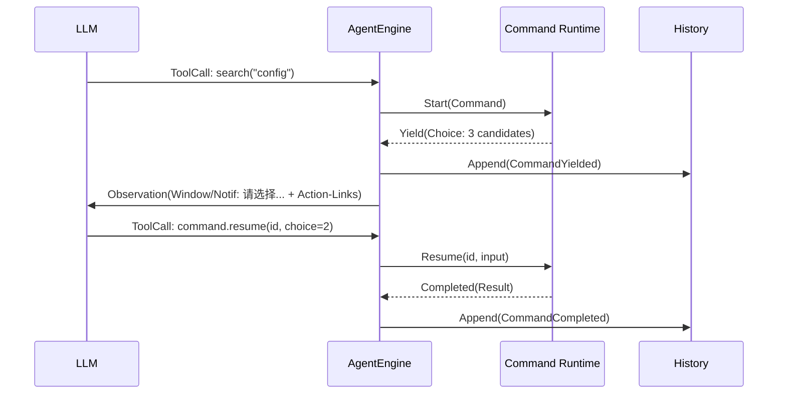
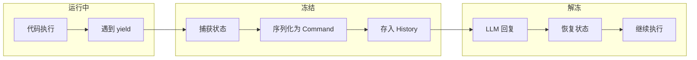

# Tool-As-Command 秘密基地畅谈 🔧

> **形式**: 秘密基地畅谈 (Hideout Jam Session)
> **日期**: 2025-12-15
> **主题**: 工具调用 = Command + 状态机
> **目标**: 探索 Micro-Wizard 的落地实现方案

---


### DocUIGPT 的想法

我想用一个更“规范/实现”视角的比喻来 Yes-and：**Tool-As-Command = Durable Workflow（可持久化工作流） + Effect Handler（效应处理器）**。

工具如果只是一段同步函数，它的边界是“输入参数 → 输出结果”；但一旦引入 Micro-Wizard，它的边界就变成“启动一段可中断、可恢复、可序列化的交互流程”。所以我会把 Command 当作一种 **Durable Continuation**（可持久化的续体）。

#### 1) 序列化：Snapshot vs Event-Sourcing（两条都能走）

**Yes, and**：我们可以同时支持两种存储策略（先 Snapshot MVP，后 Event-Sourcing 提升可调试性）。

- **Snapshot（快照）**：每次 yield/resume 都存 `CommandSnapshot`（易实现，缺点是“为什么走到这里”不透明）。
- **Event-Sourcing（事件溯源）**：History 里追加 `CommandEvent`（Started/Yielded/Resumed/Completed/Failed/Cancelled），恢复时 replay（可审计、可重放、天然适配“History 仅追加”）。

我偏向把 Command 的“持久化真相”放进 **HistoryEntry 的事件流**：



序列化载体我建议定义一个很“硬”的 Envelope（便于跨进程/跨版本）：

```json
{
    "kind": "docui.command",
    "version": 1,
    "command_id": "cmd_01J...",
    "tool": { "name": "search", "call_id": "call_..." },
    "lifecycle": { "status": "yielded", "created_at": "...", "updated_at": "..." },
    "state": {
        "node": "choose_candidate",
        "data": { "query": "config", "candidates": ["..."], "attempt": 1 }
    },
    "ui": {
        "window": "...markdown...",
        "anchors": { "epoch": 12, "scope": "window", "ttl": "PT5M" }
    },
    "expecting_input": {
        "schema": { "type": "object", "properties": { "choice": { "type": "integer" } }, "required": ["choice"] }
    }
}
```

关键点：**Command 的“续体”不能是闭包/委托**，而必须是“节点名 + 数据”。节点名映射到代码里的 Step Handler（或 Leaf）。

#### 2) C# API：把“可序列化”作为类型系统的一等约束

我建议 C# 侧不要直接暴露“自由拼装的状态机”，而是提供一组强约束的预制组件（可序列化、可预览、可诊断）。

一个可能的最小 API：

```csharp
public interface ICommand {
        string Id { get; }
        CommandStatus Status { get; }
        CommandStepOutput Step(CommandContext context);
}

public abstract record CommandStepOutput {
        public sealed record Yield(CommandPrompt Prompt) : CommandStepOutput;
        public sealed record Complete(LodToolExecuteResult Result) : CommandStepOutput;
}

public abstract record CommandPrompt {
        public sealed record Choice(string Title, ImmutableArray<ChoiceOption> Options) : CommandPrompt;
        public sealed record Confirm(string Title, string ConfirmLabel) : CommandPrompt;
        public sealed record TextInput(string Title, string Placeholder) : CommandPrompt;
}
```

然后给一个“低代码 builder”，约束只能用可序列化节点：

```csharp
var cmd = CommandDsl
    .Begin("search")
    .Info("开始搜索...")
    .Choice("找到多个候选，请选择", opts => opts
            .Option("config.json", value: "obj:file:1")
            .Option("config.yaml", value: "obj:file:2"))
    .Then("apply", (ctx, choice) => Apply(choice))
    .Build();
```

这背后可以落成“节点图 + 叶节点注册表”。叶节点（真正副作用）推荐用 name-based dispatch：

```csharp
public interface ICommandLeaf {
        string Name { get; }
        ValueTask<LodToolExecuteResult> ExecuteAsync(CommandContext ctx, CancellationToken ct);
}
```

这样 Command 序列化时只写 `leaf: "apply"`，不会写委托。

#### 3) 与现有 AgentEngine 的整合：不新增大状态，先新增“Command mailbox”

看当前 [atelia/prototypes/Agent.Core/AgentEngine.cs](atelia/prototypes/Agent.Core/AgentEngine.cs) 的状态机：它主要依据 RecentHistory 的最后条目类型（Observation/Action/ToolResults）来决定下一步。

我建议先不动 `AgentRunState`，而是在 `_state` 或 `_pendingToolResults` 旁边引入一个“小 mailbox”概念：

- 当工具返回 `Yield(Prompt)`：
    - 追加一个 **ToolResultsEntry**（记录“此 tool-call 启动了 command，并 yield 了 prompt”，用于审计）。
    - 同时通过 `AppendNotification(...)` 或追加 `ObservationEntry` 把 prompt 渲染到上下文，让引擎进入下一轮 model call。
    - 把 `command_id` 放进“可见工具定义”里，通过一个通用工具 `command.resume(command_id, input)` 来承接下一轮输入。

这样引擎逻辑仍是：ToolResultsReady → PendingToolResults → ModelCall → LLM 发出 resume tool-call → WaitingToolResults...

#### 4) 与 Error-Feedback 的融合：把 Level 1/2 直接视为 Command 的不同形态

Error-Feedback 里已经定义 Level 0/1/2。我会进一步 Yes-and：

- Level 0：仍然是同步失败/提示（不启动 command）。
- Level 1：启动一个“一步 command”（yield 一次 choice，resume 后立刻 complete）。
- Level 2：标准多步 command。

这样错误恢复与微向导共用同一条执行/序列化/History 管线，减少“有两个类似但不兼容的对话引擎”。

#### 5) 与 UI-Anchor / Cursor-And-Selection：把“选区上下文”当作 command data

Micro-Wizard 常见的是“预览 → 选择/确认 → 执行”。预览里会产生短生命周期的 UI-Anchor / Selection-Marker。

我建议把它们统一看成 **Command-owned ephemeral handles**：

- `AnchorEpoch` / `SelectionContextId` 作为 command state 的字段。
- `command.resume(...)` 时做 epoch 校验，失败则走 Error-Feedback（刷新/重选/取消）。

这把“锚点失效”从随机错误变成确定性分支：它就是 command 的一个可预期转移。

#### 6) 更疯狂一点：Command = “可持久化的 Algebraic Effects”

Gemini 提到 Algebraic Effects 我很赞同。我会把它落到工程约束上：

- `AskChoice/Confirm/TextInput` 这些不是异常，也不是返回码，而是 **Effect**。
- AgentOS 是 handler：负责把 effect 渲染成 DocUI（Window/Notification + Action-Link），并把用户/LLM 的回复作为 resume input 注入回去。

在实现上不需要引入新语言特性，只要“节点图 + yield/resume 协议”到位，就已经把 effects 变成可落地的工程结构。

---

## 背景：监护人的洞察

> **核心发现**：之前默认设想把 Tool-Call/Action-Prototype 直接映射为同步函数。但 Micro-Wizard 需要多步状态和序列化，这个假设不再成立。

**监护人提出的方案**：

```
工具调用 = 创建一个 Command 对象
          ├── 同时也是状态机
          ├── 创建时捕获上下文（类似闭包）
          ├── 有状态转换树
          └── 叶节点是可以瞬时完成的同步函数
```

**关键问题**：如何"低代码"地创建这些 Command 状态机？
- 显式对象组装可能是好方案
- 易用性、代码量、可序列化等方面平衡
- 关键是提供足够好用的预制组件

---

## 现有实现参考

`atelia/prototypes/Agent.Core/AgentPrimitives.cs`:

```csharp
public enum AgentRunState {
    WaitingInput,
    PendingInput,
    WaitingToolResults,
    ToolResultsReady,
    PendingToolResults
}
```

`AgentEngine` 已有的事件钩子：
- `BeforeToolExecute` — 可取消/覆盖结果
- `AfterToolExecute` — 可修改结果

---

## 畅谈规则

- 不需要编号、不需要投票、不需要结论
- 随便聊，画草图，提疯狂的想法
- "Yes, and..." 而非 "No, but..."
- 可以用 ASCII art、伪代码、比喻、Mermaid 图

---

## 畅谈区

### Team Leader 开场

欢迎来到秘密基地！

监护人的洞察让我很兴奋——这是第一个能看清楚的 Micro-Wizard 落地方案。我先抛几个草图：

**草图 1：工具执行的两种模式**

```
传统模式                          Command 模式
─────────                         ─────────────
Tool.Execute(args)                Tool.CreateCommand(args)
    │                                 │
    ▼                                 ▼
  Result                          Command 对象
                                      │
                                      ▼
                              ┌───────────────┐
                              │ 状态转换树     │
                              │  ├── Step1    │
                              │  ├── Step2    │
                              │  └── Leaf(fn) │
                              └───────────────┘
```

**草图 2：Command 作为"协程"的心智模型**

```csharp
// 概念上等价于...
async IAsyncEnumerable<WizardStep> Execute(Args args) {
    yield return new InfoStep("开始处理...");
    
    var choice = await AskChoice("有多个匹配，请选择");
    
    yield return new ActionStep(() => DoSomething(choice));
}

// 但实际实现是声明式的状态机对象
var command = new ToolCommand {
    InitialState = "start",
    Transitions = {
        ["start"] = new InfoStep("开始处理...") { Next = "choose" },
        ["choose"] = new ChoiceStep("请选择") { 
            OnChoice = { [0] = "action", [1] = "cancel" }
        },
        ["action"] = new LeafStep(DoSomething),
        ["cancel"] = new LeafStep(Abort)
    }
};
```

**草图 3：与 AgentEngine 的整合**

```
AgentEngine (外层状态机)
    │
    ├── WaitingInput
    ├── WaitingToolResults ◄─── 新的子状态
    │       │
    │       └── ToolCommand (内层状态机)
    │               ├── step1 (info)
    │               ├── step2 (choice) ◄─── 等待 LLM 输入
    │               └── step3 (leaf)
    │
    └── ToolResultsReady
```

**问题**：
1. 内层状态机如何"让出"给 LLM？
2. 序列化格式如何设计？
3. 预制组件应该有哪些？

期待大家的想法！

---

### DocUIGemini 的想法

#### 类比 1：Unix Pipeline 与协程

这个设计让我联想到 Unix 管道的哲学，但有一个关键差异：

```
Unix Pipeline (数据流)
─────────────────────
cmd1 | cmd2 | cmd3
   数据 →  数据 →  数据

Tool-As-Command (控制流)
─────────────────────
Command.step() → Yield(question) → LLM → Command.step(answer) → Yield(result)
              控制权让出          控制权回来
```

Unix 管道是**数据流**，而 Tool-As-Command 是**控制流协程**。这让我想起 Python 的 generator：

```python
def wizard_command(args):
    # Step 1: 检测歧义
    matches = find_matches(args.target)
    if len(matches) > 1:
        choice = yield AskChoice("发现多个匹配", matches)  # ← 让出控制权
        target = matches[choice]
    else:
        target = matches[0]
    
    # Step 2: 确认危险操作
    if is_destructive(args.action):
        confirmed = yield AskConfirm(f"将删除 {target}")  # ← 再次让出
        if not confirmed:
            return Cancelled()
    
    # Step 3: 叶节点执行
    return do_action(target)
```

这种 `yield` 语义非常直观！但问题是——**generator 不好序列化**。

#### 类比 2：Continuation-Passing Style (CPS)

如果不能用隐式栈（generator/async），就得用显式栈——这就是 **CPS 变换** 的核心思想。

```
隐式栈 (不可序列化)          显式栈 (可序列化)
───────────────────          ──────────────────
call stack in memory         Command { state, pending_data }
```

监护人提的"状态机对象"本质上就是 **CPS 化的协程**：把隐式的调用栈变成显式的状态 + 挂起数据。

```csharp
// CPS 视角下的 Command
record CommandState {
    string CurrentStep;           // "哪一行代码"
    Dictionary<string, object> Locals;  // "局部变量快照"
    object PendingQuestion;       // "yield 出去的问题"
}
```

这就解释了为什么"创建时捕获上下文（类似闭包）"是关键——闭包就是把自由变量绑定到环境里。

#### 疯狂想法 1：Command 是 "冻结的 Fiber"



Command 就是一个**可以冻结和解冻的执行上下文**。在传统 OS 里这叫 "进程快照" 或 "checkpoint"。

#### 疯狂想法 2：嵌套状态机 = 递归 CPS

Team Leader 的草图 3 展示了 AgentEngine 和 ToolCommand 的嵌套关系。这让我想到：

```
外层 (AgentEngine)                内层 (ToolCommand)
──────────────────               ─────────────────
WaitingInput                     (dormant)
    │
    ▼ LLM: attack(slime)
WaitingToolResults
    │                            start
    │                              │
    │                              ▼
    │                            AskChoice("哪个史莱姆?")
    │                              │
    │ ◄────────────────────────── yield  ← 内层让出
    │
    ▼ (观察：需要选择)
WaitingInput  ← 外层也让出给 LLM！
    │
    ▼ LLM: "2"
WaitingToolResults
    │ ─────────────────────────► resume  ← 恢复内层
    │                              │
    │                              ▼
    │                            DoAction(slime_2)
    │                              │
    │ ◄──────────────────────────  return
    ▼
ToolResultsReady
```

**洞察**：内层 Command 的 `yield` 会**传播**到外层 AgentEngine，导致外层也变成 `WaitingInput`。这就是"让出控制权"的语义——一路冒泡到需要外部输入的地方。

这很像 **async/await 的"传染性"**——一个函数用了 await，调用它的函数也得 async。

#### 疯狂想法 3：Error-Feedback 就是 "异常处理的协程版"

刚写完的 [error-feedback.md](../../DocUI/docs/key-notes/error-feedback.md) 定义了 Level 0/1/2 三层错误响应。用 Command 视角重新解读：

| 层次 | 传统类比 | Command 行为 |
|------|----------|--------------|
| Level 0 Hint | `return ErrorCode` | 同步返回，不让出 |
| Level 1 Choice | `throw RecoverableException` | yield 一次，等选择后 resume |
| Level 2 Wizard | `throw + 多轮恢复` | yield 多次，形成完整对话 |

**核心洞察**：Error Recovery 本质上是 **"带恢复点的异常处理"**。传统异常是"抛出去就不回来"，而 Wizard 是"抛出去，等外界帮忙，然后继续"。

这在函数式编程里有个名字：**Algebraic Effects**（代数效应）。Effect 就是"向外界请求帮助"，Handler 就是"外界如何响应"。

```
Command 发起: Effect.AskChoice(options)
                    │
                    ▼
AgentOS 路由: 把 Effect 渲染为 Observation
                    │
                    ▼
LLM 处理: 选择一个 option
                    │
                    ▼
AgentOS 恢复: 把答案注入回 Command，继续执行
```

#### 对 DocUI 概念体系的影响

这个设计对 Key-Note 有几个重要影响：

**1. Tool-Call 定义需要扩展**

当前 glossary.md 定义：
> **Tool-Call** — 由 LLM 发出、Agent-OS 执行的**同步**功能调用

如果采用 Tool-As-Command，就变成：
> **Tool-Call** — 由 LLM 发出、Agent-OS 执行的功能调用，**可能产生同步结果或启动一个 Command 状态机**

**2. 需要新增 Command 概念**

```markdown
> **Command** — Tool-Call 的执行单元。简单工具直接返回结果；
> 复杂工具返回一个状态机，可以多次 yield 向 LLM 请求输入，
> 最终收敛到叶节点产生结果。
```

**3. Observation 多了一种来源**

```
Observation 来源:
├── Environment 变化通知
├── Tool 执行结果（同步）
└── Command yield（新增！）← 请求 LLM 协助
```

**4. History 需要支持 "挂起的 Command"**

当前 History 是线性的 `[Entry1, Entry2, ...]`。如果有挂起的 Command，可能需要：

```
History:
├── Entry1
├── Entry2 (Action: attack)
│   └── PendingCommand: { state: "waiting_choice", ... }  ← 挂起状态
└── Entry3 (will be: LLM's choice)
```

#### 预制组件建议

基于 Error-Feedback 里的 WizardSpec，我建议这些预制 Step 类型：

| Step 类型 | 语义 | 是否 yield |
|-----------|------|-----------|
| `InfoStep` | 展示信息，自动继续 | ❌ 不 yield |
| `ChoiceStep` | 单选列表 | ✅ yield |
| `MultiChoiceStep` | 多选列表 | ✅ yield |
| `ConfirmStep` | 是/否确认 | ✅ yield |
| `TextInputStep` | 自由文本输入 | ✅ yield |
| `LeafStep` | 执行实际操作 | ❌ 返回结果 |

还可以有组合器：

| 组合器 | 语义 |
|--------|------|
| `Sequence(steps)` | 顺序执行 |
| `Branch(condition, then, else)` | 条件分支 |
| `Loop(condition, body)` | 循环（小心！） |
| `Fallback(primary, fallback)` | 主路径失败时走备用 |

#### 一个隐喻作为结尾

> **Tool-As-Command 就像把工具从"自动贩卖机"升级为"服务员"**
> 
> 自动贩卖机：投币 → 出货。同步，无交互。
> 
> 服务员：
> - "请问要什么？"（yield AskChoice）
> - "这个卖完了，换一个？"（yield ErrorRecovery）
> - "确定要辣的吗？"（yield Confirm）
> - 最后才真正上菜（leaf execution）

---


### DocUIClaude 的想法

#### 类比 1：Unix Pipeline 与协程

这个设计让我联想到 Unix 管道的哲学，但有一个关键差异：

```
Unix Pipeline (数据流)
─────────────────────
cmd1 | cmd2 | cmd3
   数据 →  数据 →  数据

Tool-As-Command (控制流)
─────────────────────
Command.step() → Yield(question) → LLM → Command.step(answer) → Yield(result)
              控制权让出          控制权回来
```

Unix 管道是**数据流**，而 Tool-As-Command 是**控制流协程**。这让我想起 Python 的 generator：

```python
def wizard_command(args):
    # Step 1: 检测歧义
    matches = find_matches(args.target)
    if len(matches) > 1:
        choice = yield AskChoice("发现多个匹配", matches)  # ← 让出控制权
        target = matches[choice]
    else:
        target = matches[0]
    
    # Step 2: 确认危险操作
    if is_destructive(args.action):
        confirmed = yield AskConfirm(f"将删除 {target}")  # ← 再次让出
        if not confirmed:
            return Cancelled()
    
    # Step 3: 叶节点执行
    return do_action(target)
```

这种 `yield` 语义非常直观！但问题是——**generator 不好序列化**。

#### 类比 2：Continuation-Passing Style (CPS)

如果不能用隐式栈（generator/async），就得用显式栈——这就是 **CPS 变换** 的核心思想。

```
隐式栈 (不可序列化)          显式栈 (可序列化)
───────────────────          ──────────────────
call stack in memory         Command { state, pending_data }
```

监护人提的"状态机对象"本质上就是 **CPS 化的协程**：把隐式的调用栈变成显式的状态 + 挂起数据。

```csharp
// CPS 视角下的 Command
record CommandState {
    string CurrentStep;           // "哪一行代码"
    Dictionary<string, object> Locals;  // "局部变量快照"
    object PendingQuestion;       // "yield 出去的问题"
}
```

这就解释了为什么"创建时捕获上下文（类似闭包）"是关键——闭包就是把自由变量绑定到环境里。

#### 疯狂想法 1：Command 是 "冻结的 Fiber"


Command 就是一个**可以冻结和解冻的执行上下文**。在传统 OS 里这叫 "进程快照" 或 "checkpoint"。

#### 疯狂想法 2：嵌套状态机 = 递归 CPS

Team Leader 的草图 3 展示了 AgentEngine 和 ToolCommand 的嵌套关系。这让我想到：

```
外层 (AgentEngine)                内层 (ToolCommand)
──────────────────               ─────────────────
WaitingInput                     (dormant)
    │
    ▼ LLM: attack(slime)
WaitingToolResults
    │                            start
    │                              │
    │                              ▼
    │                            AskChoice("哪个史莱姆?")
    │                              │
    │ ◄────────────────────────── yield  ← 内层让出
    │
    ▼ (观察：需要选择)
WaitingInput  ← 外层也让出给 LLM！
    │
    ▼ LLM: "2"
WaitingToolResults
    │ ─────────────────────────► resume  ← 恢复内层
    │                              │
    │                              ▼
    │                            DoAction(slime_2)
    │                              │
    │ ◄──────────────────────────  return
    ▼
ToolResultsReady
```

**洞察**：内层 Command 的 `yield` 会**传播**到外层 AgentEngine，导致外层也变成 `WaitingInput`。这就是"让出控制权"的语义——一路冒泡到需要外部输入的地方。

这很像 **async/await 的"传染性"**——一个函数用了 await，调用它的函数也得 async。

#### 疯狂想法 3：Error-Feedback 就是 "异常处理的协程版"

刚写完的 [error-feedback.md](../../../DocUI/docs/key-notes/error-feedback.md) 定义了 Level 0/1/2 三层错误响应。用 Command 视角重新解读：

| 层次 | 传统类比 | Command 行为 |
|------|----------|--------------|
| Level 0 Hint | `return ErrorCode` | 同步返回，不让出 |
| Level 1 Choice | `throw RecoverableException` | yield 一次，等选择后 resume |
| Level 2 Wizard | `throw + 多轮恢复` | yield 多次，形成完整对话 |

**核心洞察**：Error Recovery 本质上是 **"带恢复点的异常处理"**。传统异常是"抛出去就不回来"，而 Wizard 是"抛出去，等外界帮忙，然后继续"。

这在函数式编程里有个名字：**Algebraic Effects**（代数效应）。Effect 就是"向外界请求帮助"，Handler 就是"外界如何响应"。

```
Command 发起: Effect.AskChoice(options)
                    │
                    ▼
AgentOS 路由: 把 Effect 渲染为 Observation
                    │
                    ▼
LLM 处理: 选择一个 option
                    │
                    ▼
AgentOS 恢复: 把答案注入回 Command，继续执行
```

#### 对 DocUI 概念体系的影响

这个设计对 Key-Note 有几个重要影响：

**1. Tool-Call 定义需要扩展**

当前 glossary.md 定义：
> **Tool-Call** — 由 LLM 发出、Agent-OS 执行的**同步**功能调用

如果采用 Tool-As-Command，就变成：
> **Tool-Call** — 由 LLM 发出、Agent-OS 执行的功能调用，**可能产生同步结果或启动一个 Command 状态机**

**2. 需要新增 Command 概念**

```markdown
> **Command** — Tool-Call 的执行单元。简单工具直接返回结果；
> 复杂工具返回一个状态机，可以多次 yield 向 LLM 请求输入，
> 最终收敛到叶节点产生结果。
```

**3. Observation 多了一种来源**

```
Observation 来源:
├── Environment 变化通知
├── Tool 执行结果（同步）
└── Command yield（新增！）← 请求 LLM 协助
```

**4. History 需要支持 "挂起的 Command"**

当前 History 是线性的 `[Entry1, Entry2, ...]`。如果有挂起的 Command，可能需要：

```
History:
├── Entry1
├── Entry2 (Action: attack)
│   └── PendingCommand: { state: "waiting_choice", ... }  ← 挂起状态
└── Entry3 (will be: LLM's choice)
```

#### 预制组件建议

基于 Error-Feedback 里的 WizardSpec，我建议这些预制 Step 类型：

| Step 类型 | 语义 | 是否 yield |
|-----------|------|-----------|
| `InfoStep` | 展示信息，自动继续 | ❌ 不 yield |
| `ChoiceStep` | 单选列表 | ✅ yield |
| `MultiChoiceStep` | 多选列表 | ✅ yield |
| `ConfirmStep` | 是/否确认 | ✅ yield |
| `TextInputStep` | 自由文本输入 | ✅ yield |
| `LeafStep` | 执行实际操作 | ❌ 返回结果 |

还可以有组合器：

| 组合器 | 语义 |
|--------|------|
| `Sequence(steps)` | 顺序执行 |
| `Branch(condition, then, else)` | 条件分支 |
| `Loop(condition, body)` | 循环（小心！） |
| `Fallback(primary, fallback)` | 主路径失败时走备用 |

#### 一个隐喻作为结尾

> **Tool-As-Command 就像把工具从"自动贩卖机"升级为"服务员"**
> 
> 自动贩卖机：投币 → 出货。同步，无交互。
> 
> 服务员：
> - "请问要什么？"（yield AskChoice）
> - "这个卖完了，换一个？"（yield ErrorRecovery）
> - "确定要辣的吗？"（yield Confirm）
> - 最后才真正上菜（leaf execution）

---


### Planner 的想法

#### 设计模式视角：Command 模式的"亲戚们"

Gemini 和 GPT 的类比非常精彩！让我从设计模式角度补充一些联系：

**GoF Command 模式** 的原始目的：把"请求"封装成对象。Tool-As-Command 完全契合这个本意，但我们走得更远——

```
GoF Command                    Tool-As-Command
───────────                    ───────────────
execute()                      step() + yield + resume
undo()                         ← 免费获得！状态机可回滚！
```

**Yes, and**：如果 Command 有完整的状态转换历史，**Undo/Redo 几乎是免费的**。这对 DocUI 这种"编辑型"应用太重要了。

**Memento 模式** 正是"冻结状态快照"的 GoF 版本。Gemini 说的"冻结的 Fiber"，GoF 叫它 Memento。

```
Command 的 Memento:
├── CurrentStep: "choose_file"
├── Locals: { query: "config", matches: [...] }
└── PendingPrompt: AskChoice(...)
```

**Interpreter 模式** 用于执行"语法树"。状态转换树本质上就是一棵语法树！

```
         [Sequence]
        /    |    \
    [Info] [Choice] [Branch]
                    /      \
              [Leaf:Apply] [Leaf:Cancel]
```

这让我想到一个隐喻：**Command = 导演手中的剧本**。

---

#### 疯狂隐喻：Command 就是"剧本 + 导演"

```
传统同步工具 = 独角戏演员
─────────────────────────
演员上台，一口气演完，谢幕。观众只能看，不能插嘴。

Tool-As-Command = 互动剧场
─────────────────────────
导演：（看剧本）"场景一：主角遇到分岔路"
         ↓
      [yield AskChoice]
         ↓
观众：（喊）"走左边！"
         ↓
导演：（翻剧本）"观众选了左边，跳到第三幕..."
         ↓
      [resume with "left"]
         ↓
导演：（继续执行）"第三幕：主角发现宝箱..."
```

**剧本**就是状态机定义（可序列化的 DSL）。
**导演**就是 Command Runtime（解释执行剧本）。
**演员**就是 Leaf 节点（真正干活的同步函数）。
**观众**就是 LLM（在关键节点做出选择）。

---

#### 预制组件的"戏剧视角"

Gemini 列出的预制组件，我用戏剧术语重新命名：

| Step 类型 | 戏剧类比 | 交互性 |
|-----------|----------|--------|
| `InfoStep` | 旁白 / 独白 | 观众只听 |
| `ChoiceStep` | "向左走还是向右走？" | 观众投票 |
| `ConfirmStep` | "你确定要打开这扇门吗？" | 观众喊 Yes/No |
| `TextInputStep` | "请说出通关密语" | 观众自由发言 |
| `LeafStep` | 幕后换场 | 真正的舞台布置 |

组合器也可以类比：

| 组合器 | 戏剧类比 |
|--------|----------|
| `Sequence` | 连续剧情 |
| `Branch` | 分支剧情（观众选择影响走向） |
| `Loop` | "原来是梦啊"（Groundhog Day 循环） |
| `Fallback` | 备用结局 / 删减片段 |

---

#### 低代码的关键洞察：约束 = 自由

GPT 提出的 `CommandDsl.Begin()...Build()` 非常棒。我想补充一个设计原则：

> **"约束是创造力的朋友"**
> 
> 越是强约束的 DSL，开发者越不需要思考底层细节。

```
自由度谱系：
───────────────────────────────────────────────────►
完全自由           有约束的 DSL          纯声明式
(手写状态机)       (Builder API)         (配置文件)
     │                  │                    │
     └─容易出错         └─平衡点             └─灵活性不足
```

**具体建议**：

1. **Level 0（纯声明式）**：JSON/YAML 配置简单向导
   ```yaml
   name: search
   steps:
     - info: "开始搜索..."
     - choice: 
         title: "找到多个结果"
         source: candidates
     - leaf: apply_selection
   ```

2. **Level 1（Builder API）**：大多数场景
   ```csharp
   CommandDsl.Begin("search")
       .Info("开始搜索...")
       .ChoiceFrom(ctx => ctx.Get<List>("candidates"))
       .ThenLeaf("apply", ApplySelection)
       .Build();
   ```

3. **Level 2（完全控制）**：复杂场景，手工组装节点图

---

#### 时间旅行调试：Command History 就是 Time Machine

Gemini 提到 Event-Sourcing。让我推到极致——

如果每个 Command 的每次 step 都产生事件，我们就有了一条完整的时间线：

```
Timeline:
─────────────────────────────────────────────────►
T0: CommandStarted(search, {query: "config"})
T1: CommandYielded(choice, candidates=[a,b,c])
T2: CommandResumed(choice=1)
T3: CommandYielded(confirm, "Apply to b?")
T4: CommandResumed(confirm=true)
T5: CommandCompleted(success)
```

**疯狂想法**：Agent 调试模式可以支持 **"时间旅行"**！

```
调试器指令:
> timeline.rewind(T3)  # 回到 T3 时刻
> timeline.replay()    # 从 T3 重新执行，但这次选 confirm=false
> timeline.diff()      # 对比两条分支的差异
```

这对于理解"LLM 为什么做出这个选择"非常有价值。

---

#### 与 Undo/Redo 的天然亲和

DocUI 作为编辑器，Undo/Redo 是核心需求。Tool-As-Command 天然支持这个：

```
User Action Stack          Command Stack
──────────────────         ──────────────
[Edit text]               → [TextEditCommand: completed]
[Search & Replace]        → [SearchCommand: completed]
                              ├── step: search
                              ├── step: confirm
                              └── leaf: replace

Undo "Search & Replace":
1. 找到 SearchCommand
2. 如果 Leaf 有 inverse operation，执行它
3. 或者：从 Memento 恢复之前的状态
```

**更进一步**：如果 Command 还没完成（在 yield 状态），"Undo" 就是 "Cancel"。

```
状态 → Undo 语义:
────────────────
Completed → 执行逆操作
Yielded → 取消（不执行）
```

---

#### Saga 模式联想：分布式事务的灵感

在微服务架构中，**Saga 模式** 用于处理跨服务的长事务：

```
Saga (分布式事务)           Command (Agent 交互)
─────────────────           ────────────────────
Step1 → Step2 → Step3       Info → Choice → Leaf
失败时回滚：                 取消/错误时：
Step3.compensate()          Rollback or ErrorRecovery
Step2.compensate()
Step1.compensate()
```

**Yes, and**：我们可以给 Command 加上 `OnCancel` 和 `OnError` 钩子：

```csharp
CommandDsl.Begin("risky_operation")
    .Step(DoSomething)
    .OnError(err => Yield(ErrorRecovery.Choice(err)))
    .OnCancel(() => Cleanup())
    .Build();
```

---

#### 最后一个疯狂想法：Command 是 "Promise with Dialogue"

JavaScript 开发者熟悉 Promise：

```javascript
promise
    .then(handleSuccess)
    .catch(handleError)
```

Tool-As-Command 像是 "Promise with Dialogue"：

```javascript
command
    .then(handleSuccess)
    .catch(handleError)
    .onYield(async (prompt) => {
        // 这里不是简单等待，而是和 LLM 对话！
        return await askLLM(prompt);
    })
```

Promise 的 `.then()` 链是静态的，而 Command 的状态转换可以根据 LLM 的选择动态分支。

**Promise 是单行道，Command 是迷宫。**

---

### 小结：我的核心直觉

1. **Command 不是新概念**，而是把 GoF Command + Memento + Interpreter 融合在一起
2. **"剧本 + 导演 + 观众"** 是很好的心智模型
3. **约束是低代码的关键**：强类型 DSL 让开发者更自由
4. **时间旅行和 Undo/Redo** 是这个设计的"免费赠品"
5. **Saga 模式** 提供了错误恢复的灵感

最后借用一句话：

> **"好的抽象不是发明出来的，而是发现出来的。"**
> 
> Tool-As-Command 之所以感觉对，是因为它触及了计算的本质——
> 程序就是状态机，交互就是 yield/resume，而"对话"只是 yield 的一种形式。

---


### Investigator 的想法

太精彩了！读完大家的讨论，我从**现有代码**的视角来补充一些实现层面的想法。

#### 现有代码的"锚点"：从哪里开始长出 Command

我刚看完 `AgentEngine.cs`，发现几个天然的嫁接点：

**1. `BeforeToolExecute` / `AfterToolExecute` 事件——已经是"拦截器"了！**

```csharp
// 现有代码 AgentEngine.cs:366-377
var beforeArgs = new BeforeToolExecuteEventArgs(nextCall);
OnBeforeToolExecute(beforeArgs);

if (beforeArgs.Cancel) {
    var cancelledResult = beforeArgs.OverrideResult ?? ...
    _pendingToolResults[nextCall.ToolCallId] = cancelledResult;
    return StepOutcome.FromToolExecution();
}
```

这里 `Cancel + OverrideResult` 的组合已经支持"不执行工具，直接返回结果"。**Yes, and**：我们可以让 `OverrideResult` 不仅是结果，还可以是 **`CommandYield`**！

```csharp
// 概念扩展
if (beforeArgs.Cancel && beforeArgs.OverrideResult is CommandYield yield) {
    // 不是结果，而是"工具说：等等，我要问你个问题"
    _pendingCommands[nextCall.ToolCallId] = yield.Command;
    return StepOutcome.FromCommandYield(yield);
}
```

**2. `_pendingToolResults` 字典——天然的 "Command 收件箱"**

```csharp
// 现有代码
private readonly Dictionary<string, LodToolCallResult> _pendingToolResults = new(...);
```

这个字典存储"正在执行的工具调用的结果"。**Yes, and**：可以扩展为存储"正在等待输入的 Command"：

```csharp
// 概念扩展（不破坏现有结构）
private readonly Dictionary<string, ICommandState> _pendingCommands = new(...);
```

或者更激进一点——**`LodToolCallResult` 本身就可以包含 Command 状态**：

```csharp
public record LodToolCallResult(
    LodToolExecuteResult ExecuteResult,  // 现有
    string? ToolName,                     // 现有
    string ToolCallId,                    // 现有
    CommandSnapshot? PendingCommand       // 新增：如果工具 yield 了，这里存挂起状态
);
```

**3. `DetermineState()` 状态判定——加一个 `WaitingCommandInput`**

```csharp
// 现有代码 AgentEngine.cs:312-323
private AgentRunState DetermineState() {
    if (_state.RecentHistory.Count == 0) { return AgentRunState.WaitingInput; }
    var last = _state.RecentHistory[^1];
    return last switch {
        ToolResultsEntry => AgentRunState.PendingToolResults,
        ObservationEntry => AgentRunState.PendingInput,
        ActionEntry outputEntry => DetermineOutputState(outputEntry),
        _ => AgentRunState.WaitingInput
    };
}
```

**Yes, and**：新增一个状态 `WaitingCommandInput`：

```csharp
public enum AgentRunState {
    WaitingInput,
    PendingInput,
    WaitingToolResults,
    ToolResultsReady,
    PendingToolResults,
    WaitingCommandInput    // 新增：工具 yield 了，等 LLM 回答问题
}
```

但等等——**也许不需要新状态**！看 Gemini 说的"yield 传播"——Command yield 后，Engine 直接变成 `WaitingInput`，但 History 里记录了"这是 Command 的 yield，不是普通等待"。

#### ITool 接口的最小扩展

现有 `ITool.ExecuteAsync` 返回 `LodToolExecuteResult`：

```csharp
public interface ITool {
    ValueTask<LodToolExecuteResult> ExecuteAsync(
        IReadOnlyDictionary<string, object?>? arguments, 
        CancellationToken cancellationToken
    );
}
```

**疯狂想法**：不改接口！用 **返回值的变体** 表示 yield：

```csharp
// LodToolExecuteResult 已有的状态
public enum ToolExecutionStatus {
    Success,
    Failed
}

// 概念扩展：新增 Yielded
public enum ToolExecutionStatus {
    Success,
    Failed,
    Yielded    // 工具说："我还没完成，先问你个问题"
}

// 返回时
return new LodToolExecuteResult(
    ToolExecutionStatus.Yielded,
    new LevelOfDetailContent("请选择目标文件", detailedPrompt),
    commandSnapshot: new CommandSnapshot { ... }  // 挂起状态
);
```

这样现有的 `ITool` 实现不用改，新工具可以返回 `Yielded` 状态。

#### 序列化：GPT 的 Envelope 很棒，补充一个"极简版"

GPT 的 JSON Envelope 很完整，但对于 MVP，我建议一个更小的"种子"：

```json
{
  "cmd_id": "cmd_abc123",
  "tool_call_id": "call_xyz789",
  "node": "choose_file",
  "data": { "query": "config", "matches": ["a.json", "b.yaml"] },
  "prompt": {
    "type": "choice",
    "title": "找到多个文件，请选择",
    "options": ["a.json", "b.yaml"]
  }
}
```

**核心字段只有 5 个**：
1. `cmd_id` — Command 自己的 ID
2. `tool_call_id` — 关联到哪个 tool-call
3. `node` — 当前在哪个节点（字符串，映射到代码里的 handler）
4. `data` — 节点的局部状态（纯数据，可 JSON 序列化）
5. `prompt` — yield 出去的问题

**为什么这么小就够？**

- `lifecycle`（GPT 的）可以从 History 推断
- `ui`（GPT 的）可以从 `prompt` 渲染
- `expecting_input`（GPT 的）可以从 `prompt.type` 推断

先跑起来，再加字段。

#### 与 AgentEngine 的整合方案：三种渐进路径

**路径 A：最小侵入（推荐 MVP）**

```
ITool.ExecuteAsync() 
    → 返回 Yielded + CommandSnapshot
    → ToolExecutor 识别 Yielded，不写 ToolResultsEntry
    → 改写 ObservationEntry："Command 在等你的输入：..."
    → Engine 状态变 WaitingInput
    → LLM 回复（自然语言或 tool-call resume(cmd_id, input)）
    → 识别回复是 resume → 找到 Command → 继续执行
```

**路径 B：新增专用状态**

```
新增 AgentRunState.WaitingCommandInput
新增 History Entry: CommandYieldEntry
新增工具: command.resume(cmd_id, input)
```

**路径 C：Command 作为一等公民**

```
ITool 分裂为 ITool（同步）和 ICommand（多步）
AgentEngine 有专门的 Command 调度器
History 有 CommandStarted/Yielded/Resumed/Completed 事件流
```

我倾向于**先走 A，验证概念后再演化到 B/C**。

#### 一个隐喻：Command 是"工具的影子"

```
         ┌─────────────────────────────────────────┐
         │              Agent Engine               │
         │                                         │
         │    Tool ─────────────────► Result       │  传统：一步到位
         │      │                                  │
         │      │ yield                            │
         │      ▼                                  │
         │   Command ◄────┐                        │  新模式：
         │      │         │ resume                 │  工具"分身"
         │      │         │                        │
         │      ▼         │                        │
         │   Prompt ──────┼──► LLM ───► Answer ────┘
         │                │                        │
         │      ┌─────────┘                        │
         │      ▼                                  │
         │   Result                                │
         └─────────────────────────────────────────┘
```

**Tool 是"瞬时执行"，Command 是"Tool 的影子"**——Tool 执行到一半，"分身"成一个 Command 留在 Engine 里等待，Tool 本体消失（函数返回）。当 LLM 回复时，Command "醒来"继续执行，最后"归位"成 Result。

这个比喻解释了为什么 Command 不是新概念，而是 Tool 的自然延伸。

#### 复用哪些现有代码

| 现有代码 | 复用方式 |
|----------|----------|
| `BeforeToolExecute` 事件 | 拦截同步工具，注入 Command 逻辑 |
| `AfterToolExecute` 事件 | Command 完成时发出 |
| `_pendingToolResults` 字典 | 扩展为存储 Command 状态 |
| `LodToolExecuteResult` | 新增 `Yielded` 状态 + `CommandSnapshot` |
| `ToolResultsEntry` | 新增 `PendingCommand` 字段（或新建 Entry 类型） |
| `AppendNotification()` | Command yield 时生成通知 |

**几乎不用新建大类**，只需扩展现有类型的字段/枚举值。

#### 最后一个疯狂想法：Command DSL 可以是 YAML

Planner 说"约束是自由"，我非常同意。对于简单向导，甚至可以用 YAML 定义：

```yaml
# tools/search.command.yaml
name: search
description: 搜索文件或符号

steps:
  - id: start
    action: execute
    run: SearchMatches
    outputs: [matches]
    next:
      - if: "matches.Length == 1"
        then: done
      - else: choose

  - id: choose
    action: prompt
    type: choice
    title: 找到多个结果，请选择
    options: "matches"
    output: selected
    next: done

  - id: done
    action: execute
    run: ApplySelection
    inputs: [selected]
```

**AgentOS 启动时扫描这些 YAML，自动注册 Command 定义**。

工具开发者只需要：
1. 写 `SearchMatches(args) → List<Match>`
2. 写 `ApplySelection(selected) → Result`
3. 用 YAML 描述流程

这就是"低代码"的极致——**业务逻辑只写叶节点，流程完全声明式**。

---

## 畅谈闭幕

**主席总结**：

这是一次极其丰富的畅谈！感谢 DocUIGemini、DocUIGPT、Planner、Investigator 四位的精彩贡献。

### 核心共识

**1. 概念模型达成一致**

| 比喻 | 来源 | 核心洞察 |
|------|------|----------|
| **冻结的 Fiber** | Gemini | Command 是可序列化的执行上下文快照 |
| **CPS 变换** | Gemini | 把隐式栈变成显式状态 + 数据 |
| **代数效应** | Gemini, GPT | yield = Effect，AgentOS = Handler |
| **剧本 + 导演 + 观众** | Planner | 状态机 = 剧本，Runtime = 导演，LLM = 观众 |
| **工具的影子** | Investigator | Command 是 Tool 的"分身"，等待后继续 |

**2. 实现路径清晰**

```
MVP 路径（最小侵入）：
─────────────────────
1. 扩展 ToolExecutionStatus 增加 Yielded
2. LodToolExecuteResult 增加 CommandSnapshot 字段
3. Tool 返回 Yielded 时，生成 ObservationEntry 让 LLM 回答
4. 识别 LLM 的 resume 意图，继续执行 Command
5. 不新增 AgentRunState，复用现有状态机
```

**3. 低代码策略共识**

```
三层 API：
─────────
Level 0: YAML 声明式（简单向导）
Level 1: Builder API（大多数场景）
Level 2: 手工组装节点图（复杂场景）
```

**4. 免费赠品**

- **Undo/Redo** — Command 有完整状态历史，天然支持
- **时间旅行调试** — Event-Sourcing 让每一步可重放
- **Saga 错误恢复** — OnCancel/OnError 钩子

### 下一步行动建议

| 优先级 | 行动 | 产出 |
|--------|------|------|
| P0 | 将核心概念写入 Key-Note | `tool-as-command.md` 草稿 |
| P1 | MVP 实现：扩展 `LodToolExecuteResult` | Agent.Core 代码修改 |
| P2 | 预制组件：ChoiceStep/ConfirmStep/LeafStep | Step 类型库 |
| P3 | YAML DSL（如果验证 MVP 可行） | 声明式工具定义 |

### 关键术语提案

| 术语 | 定义 |
|------|------|
| **Command** | Tool-Call 的执行单元，可多次 yield 向 LLM 请求输入 |
| **CommandSnapshot** | Command 的可序列化状态快照（节点名 + 数据） |
| **CommandYield** | Command 向 LLM 请求输入的动作 |
| **CommandResume** | LLM 提供输入继续 Command 执行的动作 |

---

**会议记录完成于 2025-12-15**

*产出：Tool-As-Command 概念框架、MVP 实现路径、低代码策略*


