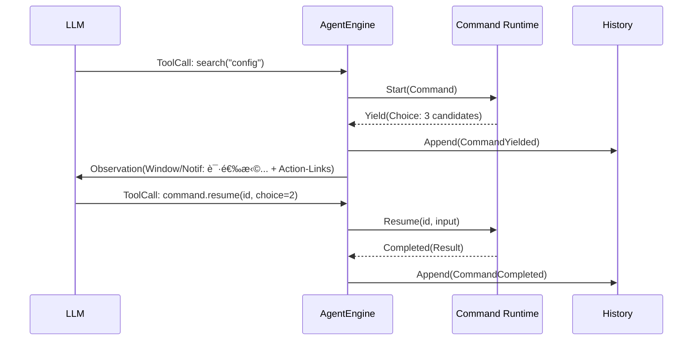
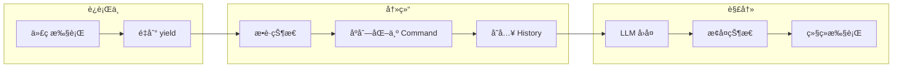

# Tool-As-Command 秘密基地畅谈 🔧

> **å½¢å¼**: 秘密基地畅谈 (Hideout Jam Session)
> **日期**: 2025-12-15
> **主题**: 工具调用 = Command + 状æ€æœº
> **目标**: æ¢ç´¢ Micro-Wizard çš„è½åœ°å®ç°æ–¹æ¡ˆ

---


### DocUIGPT 的想法

我想用一个更“规范/å®ç°â€è§†è§’çš„æ¯”å–»æ¥ Yes-and：**Tool-As-Command = Durable Workflow（å¯æŒä¹…化工作æµï¼‰ + Effect Handler（效应处ç†å™¨ï¼‰**。

工具如æœåªæ˜¯ä¸€æ®µåŒæ­¥å‡½æ•°ï¼Œå®ƒçš„边界是“输入å‚æ•° → 输出结æœâ€ï¼›ä½†ä¸€æ—¦å¼•å…¥ Micro-Wizard，它的边界就å˜æˆâ€œå¯åŠ¨ä¸€æ®µå¯ä¸­æ–­ã€å¯æ¢å¤ã€å¯åºåˆ—化的交互æµç¨‹â€ã€‚所以我会把 Command å½“ä½œä¸€ç§ **Durable Continuation**（å¯æŒä¹…化的续体）。

#### 1) åºåˆ—化：Snapshot vs Event-Sourcing（两æ¡éƒ½èƒ½èµ°ï¼‰

**Yes, and**：我们å¯ä»¥åŒæ—¶æ”¯æŒä¸¤ç§å­˜å‚¨ç­–略（先 Snapshot MVP，å Event-Sourcing æå‡å¯è°ƒè¯•æ€§ï¼‰ã€‚

- **Snapshot（快照）**：æ¯æ¬¡ yield/resume 都存 `CommandSnapshot`（易å®ç°ï¼Œç¼ºç‚¹æ˜¯â€œä¸ºä»€ä¹ˆèµ°åˆ°è¿™é‡Œâ€ä¸é€æ˜ï¼‰ã€‚
- **Event-Sourcing（事件溯æºï¼‰**：History 里追加 `CommandEvent`（Started/Yielded/Resumed/Completed/Failed/Cancelled），æ¢å¤æ—¶ replay（å¯å®¡è®¡ã€å¯é‡æ”¾ã€å¤©ç„¶é€‚é…“History 仅追加â€ï¼‰ã€‚

我åå‘把 Command 的“æŒä¹…化真相â€æ”¾è¿› **HistoryEntry 的事件æµ**：



åºåˆ—化载体我建议定义一个很“硬â€çš„ Envelope（便äºè·¨è¿›ç¨‹/跨版本）：

```json
{
    "kind": "docui.command",
    "version": 1,
    "command_id": "cmd_01J...",
    "tool": { "name": "search", "call_id": "call_..." },
    "lifecycle": { "status": "yielded", "created_at": "...", "updated_at": "..." },
    "state": {
        "node": "choose_candidate",
        "data": { "query": "config", "candidates": ["..."], "attempt": 1 }
    },
    "ui": {
        "window": "...markdown...",
        "anchors": { "epoch": 12, "scope": "window", "ttl": "PT5M" }
    },
    "expecting_input": {
        "schema": { "type": "object", "properties": { "choice": { "type": "integer" } }, "required": ["choice"] }
    }
}
```

关键点：**Command 的“续体â€ä¸èƒ½æ˜¯é—­åŒ…/委托**，而必须是“节点å + æ•°æ®â€ã€‚节点å映射到代ç é‡Œçš„ Step Handler（或 Leaf）。

#### 2) C# API：把“å¯åºåˆ—化â€ä½œä¸ºç±»å‹ç³»ç»Ÿçš„一等约æŸ

我建议 C# 侧ä¸è¦ç›´æ¥æš´éœ²â€œè‡ªç”±æ‹¼è£…的状æ€æœºâ€ï¼Œè€Œæ˜¯æ供一组强约æŸçš„预制组件（å¯åºåˆ—化ã€å¯é¢„览ã€å¯è¯Šæ–­ï¼‰ã€‚

一个å¯èƒ½çš„æœ€å° API：

```csharp
public interface ICommand {
        string Id { get; }
        CommandStatus Status { get; }
        CommandStepOutput Step(CommandContext context);
}

public abstract record CommandStepOutput {
        public sealed record Yield(CommandPrompt Prompt) : CommandStepOutput;
        public sealed record Complete(LodToolExecuteResult Result) : CommandStepOutput;
}

public abstract record CommandPrompt {
        public sealed record Choice(string Title, ImmutableArray<ChoiceOption> Options) : CommandPrompt;
        public sealed record Confirm(string Title, string ConfirmLabel) : CommandPrompt;
        public sealed record TextInput(string Title, string Placeholder) : CommandPrompt;
}
```

然å给一个“ä½ä»£ç  builderâ€ï¼Œçº¦æŸåªèƒ½ç”¨å¯åºåˆ—化节点：

```csharp
var cmd = CommandDsl
    .Begin("search")
    .Info("开始æœç´¢...")
    .Choice("找到多个候选，请选择", opts => opts
            .Option("config.json", value: "obj:file:1")
            .Option("config.yaml", value: "obj:file:2"))
    .Then("apply", (ctx, choice) => Apply(choice))
    .Build();
```

这背åå¯ä»¥è½æˆâ€œèŠ‚点图 + å¶èŠ‚点注册表â€ã€‚å¶èŠ‚点（真正副作用）æ¨è用 name-based dispatch：

```csharp
public interface ICommandLeaf {
        string Name { get; }
        ValueTask<LodToolExecuteResult> ExecuteAsync(CommandContext ctx, CancellationToken ct);
}
```

这样 Command åºåˆ—化时åªå†™ `leaf: "apply"`，ä¸ä¼šå†™å§”托。

#### 3) ä¸ç°æœ‰ AgentEngine çš„æ•´åˆï¼šä¸æ–°å¢å¤§çŠ¶æ€ï¼Œå…ˆæ–°å¢â€œCommand mailboxâ€

çœ‹å½“å‰ [atelia/prototypes/Agent.Core/AgentEngine.cs](atelia/prototypes/Agent.Core/AgentEngine.cs) 的状æ€æœºï¼šå®ƒä¸»è¦ä¾æ® RecentHistory 的最åæ¡ç›®ç±»å‹ï¼ˆObservation/Action/ToolResults）æ¥å†³å®šä¸‹ä¸€æ­¥ã€‚

我建议先ä¸åŠ¨ `AgentRunState`，而是在 `_state` 或 `_pendingToolResults` æ—è¾¹å¼•å…¥ä¸€ä¸ªâ€œå° mailboxâ€æ¦‚念：

- å½“å·¥å…·è¿”å› `Yield(Prompt)`：
    - 追加一个 **ToolResultsEntry**（记录“此 tool-call å¯åŠ¨äº† command，并 yield 了 promptâ€ï¼Œç”¨äºå®¡è®¡ï¼‰ã€‚
    - åŒæ—¶é€šè¿‡ `AppendNotification(...)` 或追加 `ObservationEntry` 把 prompt 渲染到上下文，让引æ“进入下一轮 model call。
    - 把 `command_id` 放进“å¯è§å·¥å…·å®šä¹‰â€é‡Œï¼Œé€šè¿‡ä¸€ä¸ªé€šç”¨å·¥å…· `command.resume(command_id, input)` æ¥æ‰¿æ¥ä¸‹ä¸€è½®è¾“入。

这样引æ“逻辑ä»æ˜¯ï¼šToolResultsReady → PendingToolResults → ModelCall → LLM å‘出 resume tool-call → WaitingToolResults...

#### 4) ä¸ Error-Feedback çš„èåˆï¼šæŠŠ Level 1/2 ç›´æ¥è§†ä¸º Command çš„ä¸åŒå½¢æ€

Error-Feedback 里已ç»å®šä¹‰ Level 0/1/2。我会进一步 Yes-and：

- Level 0：ä»ç„¶æ˜¯åŒæ­¥å¤±è´¥/æ示（ä¸å¯åŠ¨ command）。
- Level 1：å¯åŠ¨ä¸€ä¸ªâ€œä¸€æ­¥ commandâ€ï¼ˆyield 一次 choice，resume å立刻 complete）。
- Level 2：标准多步 command。

这样错误æ¢å¤ä¸å¾®å‘导共用åŒä¸€æ¡æ‰§è¡Œ/åºåˆ—化/History 管线，å‡å°‘“有两个类似但ä¸å…¼å®¹çš„对è¯å¼•æ“â€ã€‚

#### 5) ä¸ UI-Anchor / Cursor-And-Selection：把“选区上下文â€å½“作 command data

Micro-Wizard 常è§çš„是“预览 → 选择/确认 → 执行â€ã€‚预览里会产生短生命周期的 UI-Anchor / Selection-Marker。

æˆ‘å»ºè®®æŠŠå®ƒä»¬ç»Ÿä¸€çœ‹æˆ **Command-owned ephemeral handles**：

- `AnchorEpoch` / `SelectionContextId` 作为 command state 的字段。
- `command.resume(...)` æ—¶åš epoch 校验，失败则走 Error-Feedback（刷新/é‡é€‰/å–消）。

这把“锚点失效â€ä»éšæœºé”™è¯¯å˜æˆç¡®å®šæ€§åˆ†æ”¯ï¼šå®ƒå°±æ˜¯ command 的一个å¯é¢„期转移。

#### 6) 更疯狂一点：Command = “å¯æŒä¹…化的 Algebraic Effectsâ€

Gemini æ到 Algebraic Effects 我很èµåŒã€‚我会把它è½åˆ°å·¥ç¨‹çº¦æŸä¸Šï¼š

- `AskChoice/Confirm/TextInput` 这些ä¸æ˜¯å¼‚常，也ä¸æ˜¯è¿”å›ç ï¼Œè€Œæ˜¯ **Effect**。
- AgentOS 是 handler：负责把 effect æ¸²æŸ“æˆ DocUI（Window/Notification + Action-Link），并把用户/LLM çš„å›å¤ä½œä¸º resume input 注入å›å»ã€‚

在å®ç°ä¸Šä¸éœ€è¦å¼•å…¥æ–°è¯­è¨€ç‰¹æ€§ï¼Œåªè¦â€œèŠ‚点图 + yield/resume åè®®â€åˆ°ä½ï¼Œå°±å·²ç»æŠŠ effects å˜æˆå¯è½åœ°çš„工程结æ„。

---

## 背景：监护人的æ´å¯Ÿ

> **核心å‘ç°**：之å‰é»˜è®¤è®¾æƒ³æŠŠ Tool-Call/Action-Prototype ç›´æ¥æ˜ å°„为åŒæ­¥å‡½æ•°ã€‚但 Micro-Wizard 需è¦å¤šæ­¥çŠ¶æ€å’Œåºåˆ—化，这个å‡è®¾ä¸å†æˆç«‹ã€‚

**监护人æ出的方案**：

```
工具调用 = 创建一个 Command 对象
          ├── åŒæ—¶ä¹Ÿæ˜¯çŠ¶æ€æœº
          ├── 创建时æ•è·ä¸Šä¸‹æ–‡ï¼ˆç±»ä¼¼é—­åŒ…）
          ├── 有状æ€è½¬æ¢æ ‘
          └── å¶èŠ‚点是å¯ä»¥ç¬æ—¶å®Œæˆçš„åŒæ­¥å‡½æ•°
```

**关键问题**：如何"ä½ä»£ç "地创建这些 Command 状æ€æœºï¼Ÿ
- 显å¼å¯¹è±¡ç»„装å¯èƒ½æ˜¯å¥½æ–¹æ¡ˆ
- 易用性ã€ä»£ç é‡ã€å¯åºåˆ—化等方é¢å¹³è¡¡
- 关键是æ供足够好用的预制组件

---

## ç°æœ‰å®ç°å‚考

`atelia/prototypes/Agent.Core/AgentPrimitives.cs`:

```csharp
public enum AgentRunState {
    WaitingInput,
    PendingInput,
    WaitingToolResults,
    ToolResultsReady,
    PendingToolResults
}
```

`AgentEngine` 已有的事件钩å­ï¼š
- `BeforeToolExecute` — å¯å–消/覆盖结æœ
- `AfterToolExecute` — å¯ä¿®æ”¹ç»“æœ

---

## 畅谈规则

- ä¸éœ€è¦ç¼–å·ã€ä¸éœ€è¦æŠ•ç¥¨ã€ä¸éœ€è¦ç»“论
- éšä¾¿èŠï¼Œç”»è‰å›¾ï¼Œæ疯狂的想法
- "Yes, and..." 而é "No, but..."
- å¯ä»¥ç”¨ ASCII artã€ä¼ªä»£ç ã€æ¯”å–»ã€Mermaid 图

---

## 畅谈区

### Team Leader 开场

欢è¿æ¥åˆ°ç§˜å¯†åŸºåœ°ï¼

监护人的æ´å¯Ÿè®©æˆ‘很兴奋——这是第一个能看清楚的 Micro-Wizard è½åœ°æ–¹æ¡ˆã€‚我先抛几个è‰å›¾ï¼š

**è‰å›¾ 1：工具执行的两ç§æ¨¡å¼**

```
ä¼ ç»Ÿæ¨¡å¼                          Command 模å¼
─────────                         ─────────────
Tool.Execute(args)                Tool.CreateCommand(args)
    │                                 │
    â–¼                                 â–¼
  Result                          Command 对象
                                      │
                                      â–¼
                              ┌───────────────â”
                              │ 状æ€è½¬æ¢æ ‘     │
                              │  ├── Step1    │
                              │  ├── Step2    │
                              │  └── Leaf(fn) │
                              └───────────────┘
```

**è‰å›¾ 2：Command 作为"å程"的心智模å‹**

```csharp
// 概念上等价äº...
async IAsyncEnumerable<WizardStep> Execute(Args args) {
    yield return new InfoStep("开始处ç†...");
    
    var choice = await AskChoice("有多个匹é…，请选择");
    
    yield return new ActionStep(() => DoSomething(choice));
}

// 但å®é™…å®ç°æ˜¯å£°æ˜å¼çš„状æ€æœºå¯¹è±¡
var command = new ToolCommand {
    InitialState = "start",
    Transitions = {
        ["start"] = new InfoStep("开始处ç†...") { Next = "choose" },
        ["choose"] = new ChoiceStep("请选择") { 
            OnChoice = { [0] = "action", [1] = "cancel" }
        },
        ["action"] = new LeafStep(DoSomething),
        ["cancel"] = new LeafStep(Abort)
    }
};
```

**è‰å›¾ 3ï¼šä¸ AgentEngine çš„æ•´åˆ**

```
AgentEngine (外层状æ€æœº)
    │
    ├── WaitingInput
    ├── WaitingToolResults ◄─── æ–°çš„å­çŠ¶æ€
    │       │
    │       └── ToolCommand (内层状æ€æœº)
    │               ├── step1 (info)
    │               ├── step2 (choice) ◄─── 等待 LLM 输入
    │               └── step3 (leaf)
    │
    └── ToolResultsReady
```

**问题**：
1. 内层状æ€æœºå¦‚何"让出"ç»™ LLM？
2. åºåˆ—化格å¼å¦‚何设计？
3. 预制组件应该有哪些？

期待大家的想法ï¼

---

### DocUIGemini 的想法

#### 类比 1：Unix Pipeline ä¸å程

这个设计让我è”想到 Unix 管é“的哲学，但有一个关键差异：

```
Unix Pipeline (æ•°æ®æµ)
─────────────────────
cmd1 | cmd2 | cmd3
   æ•°æ® â†’  æ•°æ® â†’  æ•°æ®

Tool-As-Command (æ§åˆ¶æµ)
─────────────────────
Command.step() → Yield(question) → LLM → Command.step(answer) → Yield(result)
              æ§åˆ¶æƒè®©å‡º          æ§åˆ¶æƒå›æ¥
```

Unix 管é“是**æ•°æ®æµ**，而 Tool-As-Command 是**æ§åˆ¶æµå程**。这让我想起 Python çš„ generator：

```python
def wizard_command(args):
    # Step 1: 检测歧义
    matches = find_matches(args.target)
    if len(matches) > 1:
        choice = yield AskChoice("å‘ç°å¤šä¸ªåŒ¹é…", matches)  # ↠让出æ§åˆ¶æƒ
        target = matches[choice]
    else:
        target = matches[0]
    
    # Step 2: 确认å±é™©æ“作
    if is_destructive(args.action):
        confirmed = yield AskConfirm(f"将删除 {target}")  # ↠å†æ¬¡è®©å‡º
        if not confirmed:
            return Cancelled()
    
    # Step 3: å¶èŠ‚点执行
    return do_action(target)
```

è¿™ç§ `yield` 语义é常直观ï¼ä½†é—®é¢˜æ˜¯â€”—**generator ä¸å¥½åºåˆ—化**。

#### 类比 2：Continuation-Passing Style (CPS)

如æœä¸èƒ½ç”¨éšå¼æ ˆï¼ˆgenerator/async），就得用显å¼æ ˆâ€”—这就是 **CPS å˜æ¢** 的核心æ€æƒ³ã€‚

```
éšå¼æ ˆ (ä¸å¯åºåˆ—化)          显å¼æ ˆ (å¯åºåˆ—化)
───────────────────          ──────────────────
call stack in memory         Command { state, pending_data }
```

监护人æçš„"状æ€æœºå¯¹è±¡"本质上就是 **CPS 化的å程**：把éšå¼çš„调用栈å˜æˆæ˜¾å¼çš„çŠ¶æ€ + 挂起数æ®ã€‚

```csharp
// CPS 视角下的 Command
record CommandState {
    string CurrentStep;           // "哪一行代ç "
    Dictionary<string, object> Locals;  // "局部å˜é‡å¿«ç…§"
    object PendingQuestion;       // "yield 出å»çš„问题"
}
```

这就解释了为什么"创建时æ•è·ä¸Šä¸‹æ–‡ï¼ˆç±»ä¼¼é—­åŒ…）"是关键——闭包就是把自由å˜é‡ç»‘定到ç¯å¢ƒé‡Œã€‚

#### 疯狂想法 1：Command 是 "冻结的 Fiber"



Command 就是一个**å¯ä»¥å†»ç»“和解冻的执行上下文**。在传统 OS é‡Œè¿™å« "进程快照" 或 "checkpoint"。

#### 疯狂想法 2：嵌套状æ€æœº = 递归 CPS

Team Leader çš„è‰å›¾ 3 展示了 AgentEngine å’Œ ToolCommand 的嵌套关系。这让我想到：

```
外层 (AgentEngine)                内层 (ToolCommand)
──────────────────               ─────────────────
WaitingInput                     (dormant)
    │
    â–¼ LLM: attack(slime)
WaitingToolResults
    │                            start
    │                              │
    │                              ▼
    │                            AskChoice("哪个å²è±å§†?")
    │                              │
    │ ◄────────────────────────── yield  ↠内层让出
    │
    â–¼ (观察：需è¦é€‰æ‹©)
WaitingInput  ↠外层也让出给 LLMï¼
    │
    â–¼ LLM: "2"
WaitingToolResults
    │ ─────────────────────────► resume  ↠æ¢å¤å†…层
    │                              │
    │                              ▼
    │                            DoAction(slime_2)
    │                              │
    │ ◄──────────────────────────  return
    â–¼
ToolResultsReady
```

**æ´å¯Ÿ**：内层 Command çš„ `yield` 会**ä¼ æ’­**到外层 AgentEngine，导致外层也å˜æˆ `WaitingInput`。这就是"让出æ§åˆ¶æƒ"的语义——一路冒泡到需è¦å¤–部输入的地方。

è¿™å¾ˆåƒ **async/await çš„"传染性"**——一个函数用了 await，调用它的函数也得 async。

#### 疯狂想法 3：Error-Feedback 就是 "异常处ç†çš„å程版"

刚写完的 [error-feedback.md](../../DocUI/docs/key-notes/error-feedback.md) 定义了 Level 0/1/2 三层错误å“应。用 Command 视角é‡æ–°è§£è¯»ï¼š

| 层次 | 传统类比 | Command 行为 |
|------|----------|--------------|
| Level 0 Hint | `return ErrorCode` | åŒæ­¥è¿”å›ï¼Œä¸è®©å‡º |
| Level 1 Choice | `throw RecoverableException` | yield 一次，等选择å resume |
| Level 2 Wizard | `throw + 多轮æ¢å¤` | yield 多次，形æˆå®Œæ•´å¯¹è¯ |

**核心æ´å¯Ÿ**：Error Recovery 本质上是 **"带æ¢å¤ç‚¹çš„异常处ç†"**。传统异常是"抛出å»å°±ä¸å›æ¥"，而 Wizard 是"抛出å»ï¼Œç­‰å¤–界帮忙，然å继续"。

这在函数å¼ç¼–程里有个å字：**Algebraic Effects**（代数效应）。Effect 就是"å‘外界请求帮助"，Handler 就是"外界如何å“应"。

```
Command å‘èµ·: Effect.AskChoice(options)
                    │
                    â–¼
AgentOS 路由: 把 Effect 渲染为 Observation
                    │
                    â–¼
LLM 处ç†: 选择一个 option
                    │
                    â–¼
AgentOS æ¢å¤: æŠŠç­”æ¡ˆæ³¨å…¥å› Command，继续执行
```

#### 对 DocUI 概念体系的影å“

这个设计对 Key-Note 有几个é‡è¦å½±å“：

**1. Tool-Call 定义需è¦æ‰©å±•**

å½“å‰ glossary.md 定义：
> **Tool-Call** — ç”± LLM å‘出ã€Agent-OS 执行的**åŒæ­¥**功能调用

如æœé‡‡ç”¨ Tool-As-Command，就å˜æˆï¼š
> **Tool-Call** — ç”± LLM å‘出ã€Agent-OS 执行的功能调用，**å¯èƒ½äº§ç”ŸåŒæ­¥ç»“æœæˆ–å¯åŠ¨ä¸€ä¸ª Command 状æ€æœº**

**2. 需è¦æ–°å¢ Command 概念**

```markdown
> **Command** — Tool-Call 的执行å•å…ƒã€‚简å•å·¥å…·ç›´æ¥è¿”å›ç»“æœï¼›
> å¤æ‚工具返å›ä¸€ä¸ªçŠ¶æ€æœºï¼Œå¯ä»¥å¤šæ¬¡ yield å‘ LLM 请求输入，
> 最终收敛到å¶èŠ‚点产生结æœã€‚
```

**3. Observation 多了一ç§æ¥æº**

```
Observation æ¥æº:
├── Environment å˜åŒ–通知
├── Tool 执行结æœï¼ˆåŒæ­¥ï¼‰
└── Command yield（新å¢ï¼ï¼‰â† 请求 LLM å助
```

**4. History 需è¦æ”¯æŒ "挂起的 Command"**

å½“å‰ History 是线性的 `[Entry1, Entry2, ...]`。如æœæœ‰æŒ‚èµ·çš„ Command，å¯èƒ½éœ€è¦ï¼š

```
History:
├── Entry1
├── Entry2 (Action: attack)
│   └── PendingCommand: { state: "waiting_choice", ... }  ↠挂起状æ€
└── Entry3 (will be: LLM's choice)
```

#### 预制组件建议

åŸºäº Error-Feedback 里的 WizardSpec，我建议这些预制 Step ç±»å‹ï¼š

| Step ç±»å‹ | 语义 | æ˜¯å¦ yield |
|-----------|------|-----------|
| `InfoStep` | 展示信æ¯ï¼Œè‡ªåŠ¨ç»§ç»­ | âŒ ä¸ yield |
| `ChoiceStep` | å•é€‰åˆ—表 | ✅ yield |
| `MultiChoiceStep` | 多选列表 | ✅ yield |
| `ConfirmStep` | 是/å¦ç¡®è®¤ | ✅ yield |
| `TextInputStep` | 自由文本输入 | ✅ yield |
| `LeafStep` | 执行å®é™…æ“作 | ⌠返å›ç»“æœ |

还å¯ä»¥æœ‰ç»„åˆå™¨ï¼š

| 组åˆå™¨ | 语义 |
|--------|------|
| `Sequence(steps)` | 顺åºæ‰§è¡Œ |
| `Branch(condition, then, else)` | æ¡ä»¶åˆ†æ”¯ |
| `Loop(condition, body)` | 循ç¯ï¼ˆå°å¿ƒï¼ï¼‰ |
| `Fallback(primary, fallback)` | 主路径失败时走备用 |

#### 一个éšå–»ä½œä¸ºç»“å°¾

> **Tool-As-Command å°±åƒæŠŠå·¥å…·ä»"自动贩å–机"å‡çº§ä¸º"æœåŠ¡å‘˜"**
> 
> 自动贩å–æœºï¼šæŠ•å¸ â†’ 出货。åŒæ­¥ï¼Œæ— äº¤äº’。
> 
> æœåŠ¡å‘˜ï¼š
> - "请问è¦ä»€ä¹ˆï¼Ÿ"（yield AskChoice）
> - "这个å–完了，æ¢ä¸€ä¸ªï¼Ÿ"（yield ErrorRecovery）
> - "确定è¦è¾£çš„å—？"（yield Confirm）
> - 最åæ‰çœŸæ­£ä¸Šèœï¼ˆleaf execution）

---


### DocUIClaude 的想法

#### 类比 1：Unix Pipeline ä¸å程

这个设计让我è”想到 Unix 管é“的哲学，但有一个关键差异：

```
Unix Pipeline (æ•°æ®æµ)
─────────────────────
cmd1 | cmd2 | cmd3
   æ•°æ® â†’  æ•°æ® â†’  æ•°æ®

Tool-As-Command (æ§åˆ¶æµ)
─────────────────────
Command.step() → Yield(question) → LLM → Command.step(answer) → Yield(result)
              æ§åˆ¶æƒè®©å‡º          æ§åˆ¶æƒå›æ¥
```

Unix 管é“是**æ•°æ®æµ**，而 Tool-As-Command 是**æ§åˆ¶æµå程**。这让我想起 Python çš„ generator：

```python
def wizard_command(args):
    # Step 1: 检测歧义
    matches = find_matches(args.target)
    if len(matches) > 1:
        choice = yield AskChoice("å‘ç°å¤šä¸ªåŒ¹é…", matches)  # ↠让出æ§åˆ¶æƒ
        target = matches[choice]
    else:
        target = matches[0]
    
    # Step 2: 确认å±é™©æ“作
    if is_destructive(args.action):
        confirmed = yield AskConfirm(f"将删除 {target}")  # ↠å†æ¬¡è®©å‡º
        if not confirmed:
            return Cancelled()
    
    # Step 3: å¶èŠ‚点执行
    return do_action(target)
```

è¿™ç§ `yield` 语义é常直观ï¼ä½†é—®é¢˜æ˜¯â€”—**generator ä¸å¥½åºåˆ—化**。

#### 类比 2：Continuation-Passing Style (CPS)

如æœä¸èƒ½ç”¨éšå¼æ ˆï¼ˆgenerator/async），就得用显å¼æ ˆâ€”—这就是 **CPS å˜æ¢** 的核心æ€æƒ³ã€‚

```
éšå¼æ ˆ (ä¸å¯åºåˆ—化)          显å¼æ ˆ (å¯åºåˆ—化)
───────────────────          ──────────────────
call stack in memory         Command { state, pending_data }
```

监护人æçš„"状æ€æœºå¯¹è±¡"本质上就是 **CPS 化的å程**：把éšå¼çš„调用栈å˜æˆæ˜¾å¼çš„çŠ¶æ€ + 挂起数æ®ã€‚

```csharp
// CPS 视角下的 Command
record CommandState {
    string CurrentStep;           // "哪一行代ç "
    Dictionary<string, object> Locals;  // "局部å˜é‡å¿«ç…§"
    object PendingQuestion;       // "yield 出å»çš„问题"
}
```

这就解释了为什么"创建时æ•è·ä¸Šä¸‹æ–‡ï¼ˆç±»ä¼¼é—­åŒ…）"是关键——闭包就是把自由å˜é‡ç»‘定到ç¯å¢ƒé‡Œã€‚

#### 疯狂想法 1：Command 是 "冻结的 Fiber"


Command 就是一个**å¯ä»¥å†»ç»“和解冻的执行上下文**。在传统 OS é‡Œè¿™å« "进程快照" 或 "checkpoint"。

#### 疯狂想法 2：嵌套状æ€æœº = 递归 CPS

Team Leader çš„è‰å›¾ 3 展示了 AgentEngine å’Œ ToolCommand 的嵌套关系。这让我想到：

```
外层 (AgentEngine)                内层 (ToolCommand)
──────────────────               ─────────────────
WaitingInput                     (dormant)
    │
    â–¼ LLM: attack(slime)
WaitingToolResults
    │                            start
    │                              │
    │                              ▼
    │                            AskChoice("哪个å²è±å§†?")
    │                              │
    │ ◄────────────────────────── yield  ↠内层让出
    │
    â–¼ (观察：需è¦é€‰æ‹©)
WaitingInput  ↠外层也让出给 LLMï¼
    │
    â–¼ LLM: "2"
WaitingToolResults
    │ ─────────────────────────► resume  ↠æ¢å¤å†…层
    │                              │
    │                              ▼
    │                            DoAction(slime_2)
    │                              │
    │ ◄──────────────────────────  return
    â–¼
ToolResultsReady
```

**æ´å¯Ÿ**：内层 Command çš„ `yield` 会**ä¼ æ’­**到外层 AgentEngine，导致外层也å˜æˆ `WaitingInput`。这就是"让出æ§åˆ¶æƒ"的语义——一路冒泡到需è¦å¤–部输入的地方。

è¿™å¾ˆåƒ **async/await çš„"传染性"**——一个函数用了 await，调用它的函数也得 async。

#### 疯狂想法 3：Error-Feedback 就是 "异常处ç†çš„å程版"

刚写完的 [error-feedback.md](../../../DocUI/docs/key-notes/error-feedback.md) 定义了 Level 0/1/2 三层错误å“应。用 Command 视角é‡æ–°è§£è¯»ï¼š

| 层次 | 传统类比 | Command 行为 |
|------|----------|--------------|
| Level 0 Hint | `return ErrorCode` | åŒæ­¥è¿”å›ï¼Œä¸è®©å‡º |
| Level 1 Choice | `throw RecoverableException` | yield 一次，等选择å resume |
| Level 2 Wizard | `throw + 多轮æ¢å¤` | yield 多次，形æˆå®Œæ•´å¯¹è¯ |

**核心æ´å¯Ÿ**：Error Recovery 本质上是 **"带æ¢å¤ç‚¹çš„异常处ç†"**。传统异常是"抛出å»å°±ä¸å›æ¥"，而 Wizard 是"抛出å»ï¼Œç­‰å¤–界帮忙，然å继续"。

这在函数å¼ç¼–程里有个å字：**Algebraic Effects**（代数效应）。Effect 就是"å‘外界请求帮助"，Handler 就是"外界如何å“应"。

```
Command å‘èµ·: Effect.AskChoice(options)
                    │
                    â–¼
AgentOS 路由: 把 Effect 渲染为 Observation
                    │
                    â–¼
LLM 处ç†: 选择一个 option
                    │
                    â–¼
AgentOS æ¢å¤: æŠŠç­”æ¡ˆæ³¨å…¥å› Command，继续执行
```

#### 对 DocUI 概念体系的影å“

这个设计对 Key-Note 有几个é‡è¦å½±å“：

**1. Tool-Call 定义需è¦æ‰©å±•**

å½“å‰ glossary.md 定义：
> **Tool-Call** — ç”± LLM å‘出ã€Agent-OS 执行的**åŒæ­¥**功能调用

如æœé‡‡ç”¨ Tool-As-Command，就å˜æˆï¼š
> **Tool-Call** — ç”± LLM å‘出ã€Agent-OS 执行的功能调用，**å¯èƒ½äº§ç”ŸåŒæ­¥ç»“æœæˆ–å¯åŠ¨ä¸€ä¸ª Command 状æ€æœº**

**2. 需è¦æ–°å¢ Command 概念**

```markdown
> **Command** — Tool-Call 的执行å•å…ƒã€‚简å•å·¥å…·ç›´æ¥è¿”å›ç»“æœï¼›
> å¤æ‚工具返å›ä¸€ä¸ªçŠ¶æ€æœºï¼Œå¯ä»¥å¤šæ¬¡ yield å‘ LLM 请求输入，
> 最终收敛到å¶èŠ‚点产生结æœã€‚
```

**3. Observation 多了一ç§æ¥æº**

```
Observation æ¥æº:
├── Environment å˜åŒ–通知
├── Tool 执行结æœï¼ˆåŒæ­¥ï¼‰
└── Command yield（新å¢ï¼ï¼‰â† 请求 LLM å助
```

**4. History 需è¦æ”¯æŒ "挂起的 Command"**

å½“å‰ History 是线性的 `[Entry1, Entry2, ...]`。如æœæœ‰æŒ‚èµ·çš„ Command，å¯èƒ½éœ€è¦ï¼š

```
History:
├── Entry1
├── Entry2 (Action: attack)
│   └── PendingCommand: { state: "waiting_choice", ... }  ↠挂起状æ€
└── Entry3 (will be: LLM's choice)
```

#### 预制组件建议

åŸºäº Error-Feedback 里的 WizardSpec，我建议这些预制 Step ç±»å‹ï¼š

| Step ç±»å‹ | 语义 | æ˜¯å¦ yield |
|-----------|------|-----------|
| `InfoStep` | 展示信æ¯ï¼Œè‡ªåŠ¨ç»§ç»­ | âŒ ä¸ yield |
| `ChoiceStep` | å•é€‰åˆ—表 | ✅ yield |
| `MultiChoiceStep` | 多选列表 | ✅ yield |
| `ConfirmStep` | 是/å¦ç¡®è®¤ | ✅ yield |
| `TextInputStep` | 自由文本输入 | ✅ yield |
| `LeafStep` | 执行å®é™…æ“作 | ⌠返å›ç»“æœ |

还å¯ä»¥æœ‰ç»„åˆå™¨ï¼š

| 组åˆå™¨ | 语义 |
|--------|------|
| `Sequence(steps)` | 顺åºæ‰§è¡Œ |
| `Branch(condition, then, else)` | æ¡ä»¶åˆ†æ”¯ |
| `Loop(condition, body)` | 循ç¯ï¼ˆå°å¿ƒï¼ï¼‰ |
| `Fallback(primary, fallback)` | 主路径失败时走备用 |

#### 一个éšå–»ä½œä¸ºç»“å°¾

> **Tool-As-Command å°±åƒæŠŠå·¥å…·ä»"自动贩å–机"å‡çº§ä¸º"æœåŠ¡å‘˜"**
> 
> 自动贩å–æœºï¼šæŠ•å¸ â†’ 出货。åŒæ­¥ï¼Œæ— äº¤äº’。
> 
> æœåŠ¡å‘˜ï¼š
> - "请问è¦ä»€ä¹ˆï¼Ÿ"（yield AskChoice）
> - "这个å–完了，æ¢ä¸€ä¸ªï¼Ÿ"（yield ErrorRecovery）
> - "确定è¦è¾£çš„å—？"（yield Confirm）
> - 最åæ‰çœŸæ­£ä¸Šèœï¼ˆleaf execution）

---


### Planner 的想法

#### 设计模å¼è§†è§’：Command 模å¼çš„"亲戚们"

Gemini å’Œ GPT 的类比é常精彩ï¼è®©æˆ‘ä»è®¾è®¡æ¨¡å¼è§’度补充一些è”系：

**GoF Command 模å¼** çš„åŸå§‹ç›®çš„：把"请求"å°è£…æˆå¯¹è±¡ã€‚Tool-As-Command 完全契åˆè¿™ä¸ªæœ¬æ„，但我们走得更远——

```
GoF Command                    Tool-As-Command
───────────                    ───────────────
execute()                      step() + yield + resume
undo()                         ↠å…è´¹è·å¾—ï¼çŠ¶æ€æœºå¯å›æ»šï¼
```

**Yes, and**ï¼šå¦‚æœ Command 有完整的状æ€è½¬æ¢å†å²ï¼Œ**Undo/Redo 几ä¹æ˜¯å…费的**。这对 DocUI è¿™ç§"编辑å‹"应用太é‡è¦äº†ã€‚

**Memento 模å¼** 正是"冻结状æ€å¿«ç…§"çš„ GoF 版本。Gemini 说的"冻结的 Fiber"，GoF å«å®ƒ Memento。

```
Command çš„ Memento:
├── CurrentStep: "choose_file"
├── Locals: { query: "config", matches: [...] }
└── PendingPrompt: AskChoice(...)
```

**Interpreter 模å¼** 用äºæ‰§è¡Œ"语法树"。状æ€è½¬æ¢æ ‘本质上就是一棵语法树ï¼

```
         [Sequence]
        /    |    \
    [Info] [Choice] [Branch]
                    /      \
              [Leaf:Apply] [Leaf:Cancel]
```

这让我想到一个éšå–»ï¼š**Command = 导演手中的剧本**。

---

#### 疯狂éšå–»ï¼šCommand 就是"剧本 + 导演"

```
传统åŒæ­¥å·¥å…· = 独角æˆæ¼”员
─────────────────────────
演员上å°ï¼Œä¸€å£æ°”演完，谢幕。观众åªèƒ½çœ‹ï¼Œä¸èƒ½æ’嘴。

Tool-As-Command = 互动剧场
─────────────────────────
导演：（看剧本）"场景一：主角é‡åˆ°åˆ†å²”è·¯"
         ↓
      [yield AskChoice]
         ↓
观众：（喊）"走左边ï¼"
         ↓
导演：（翻剧本）"观众选了左边，跳到第三幕..."
         ↓
      [resume with "left"]
         ↓
导演：（继续执行）"第三幕：主角å‘ç°å®ç®±..."
```

**剧本**就是状æ€æœºå®šä¹‰ï¼ˆå¯åºåˆ—化的 DSL）。
**导演**就是 Command Runtime（解释执行剧本）。
**演员**就是 Leaf 节点（真正干活的åŒæ­¥å‡½æ•°ï¼‰ã€‚
**观众**就是 LLM（在关键节点åšå‡ºé€‰æ‹©ï¼‰ã€‚

---

#### 预制组件的"æˆå‰§è§†è§’"

Gemini 列出的预制组件，我用æˆå‰§æœ¯è¯­é‡æ–°å‘½å：

| Step ç±»å‹ | æˆå‰§ç±»æ¯” | 交互性 |
|-----------|----------|--------|
| `InfoStep` | æ—白 / 独白 | 观众åªå¬ |
| `ChoiceStep` | "å‘左走还是å‘å³èµ°ï¼Ÿ" | 观众投票 |
| `ConfirmStep` | "你确定è¦æ‰“开这扇门å—？" | 观众喊 Yes/No |
| `TextInputStep` | "请说出通关密语" | 观众自由å‘言 |
| `LeafStep` | 幕åæ¢åœº | 真正的èˆå°å¸ƒç½® |

组åˆå™¨ä¹Ÿå¯ä»¥ç±»æ¯”：

| 组åˆå™¨ | æˆå‰§ç±»æ¯” |
|--------|----------|
| `Sequence` | è¿ç»­å‰§æƒ… |
| `Branch` | 分支剧情（观众选择影å“èµ°å‘） |
| `Loop` | "åŸæ¥æ˜¯æ¢¦å•Š"（Groundhog Day 循ç¯ï¼‰ |
| `Fallback` | 备用结局 / 删å‡ç‰‡æ®µ |

---

#### ä½ä»£ç çš„关键æ´å¯Ÿï¼šçº¦æŸ = 自由

GPT æ出的 `CommandDsl.Begin()...Build()` é常棒。我想补充一个设计åŸåˆ™ï¼š

> **"约æŸæ˜¯åˆ›é€ åŠ›çš„朋å‹"**
> 
> 越是强约æŸçš„ DSL，开å‘者越ä¸éœ€è¦æ€è€ƒåº•å±‚细节。

```
自由度谱系：
───────────────────────────────────────────────────►
完全自由           有约æŸçš„ DSL          纯声æ˜å¼
(手写状æ€æœº)       (Builder API)         (é…置文件)
     │                  │                    │
     └─容易出错         └─平衡点             └─çµæ´»æ€§ä¸è¶³
```

**具体建议**：

1. **Level 0（纯声æ˜å¼ï¼‰**：JSON/YAML é…置简å•å‘导
   ```yaml
   name: search
   steps:
     - info: "开始æœç´¢..."
     - choice: 
         title: "找到多个结æœ"
         source: candidates
     - leaf: apply_selection
   ```

2. **Level 1（Builder API）**：大多数场景
   ```csharp
   CommandDsl.Begin("search")
       .Info("开始æœç´¢...")
       .ChoiceFrom(ctx => ctx.Get<List>("candidates"))
       .ThenLeaf("apply", ApplySelection)
       .Build();
   ```

3. **Level 2（完全æ§åˆ¶ï¼‰**：å¤æ‚场景，手工组装节点图

---

#### 时间旅行调试：Command History 就是 Time Machine

Gemini æ到 Event-Sourcing。让我æ¨åˆ°æ致——

如æœæ¯ä¸ª Command çš„æ¯æ¬¡ step 都产生事件，我们就有了一æ¡å®Œæ•´çš„时间线：

```
Timeline:
─────────────────────────────────────────────────►
T0: CommandStarted(search, {query: "config"})
T1: CommandYielded(choice, candidates=[a,b,c])
T2: CommandResumed(choice=1)
T3: CommandYielded(confirm, "Apply to b?")
T4: CommandResumed(confirm=true)
T5: CommandCompleted(success)
```

**疯狂想法**：Agent 调试模å¼å¯ä»¥æ”¯æŒ **"时间旅行"**ï¼

```
调试器指令:
> timeline.rewind(T3)  # å›åˆ° T3 时刻
> timeline.replay()    # ä» T3 é‡æ–°æ‰§è¡Œï¼Œä½†è¿™æ¬¡é€‰ confirm=false
> timeline.diff()      # 对比两æ¡åˆ†æ”¯çš„差异
```

这对äºç†è§£"LLM 为什么åšå‡ºè¿™ä¸ªé€‰æ‹©"é常有价值。

---

#### ä¸ Undo/Redo 的天然亲和

DocUI 作为编辑器，Undo/Redo 是核心需求。Tool-As-Command 天然支æŒè¿™ä¸ªï¼š

```
User Action Stack          Command Stack
──────────────────         ──────────────
[Edit text]               → [TextEditCommand: completed]
[Search & Replace]        → [SearchCommand: completed]
                              ├── step: search
                              ├── step: confirm
                              └── leaf: replace

Undo "Search & Replace":
1. 找到 SearchCommand
2. å¦‚æœ Leaf 有 inverse operation，执行它
3. æˆ–è€…ï¼šä» Memento æ¢å¤ä¹‹å‰çš„状æ€
```

**更进一步**ï¼šå¦‚æœ Command 还没完æˆï¼ˆåœ¨ yield 状æ€ï¼‰ï¼Œ"Undo" 就是 "Cancel"。

```
çŠ¶æ€ â†’ Undo 语义:
────────────────
Completed → 执行逆æ“作
Yielded → å–消（ä¸æ‰§è¡Œï¼‰
```

---

#### Saga 模å¼è”想：分布å¼äº‹åŠ¡çš„çµæ„Ÿ

在微æœåŠ¡æ¶æ„中，**Saga 模å¼** 用äºå¤„ç†è·¨æœåŠ¡çš„长事务：

```
Saga (分布å¼äº‹åŠ¡)           Command (Agent 交互)
─────────────────           ────────────────────
Step1 → Step2 → Step3       Info → Choice → Leaf
失败时å›æ»šï¼š                 å–消/错误时：
Step3.compensate()          Rollback or ErrorRecovery
Step2.compensate()
Step1.compensate()
```

**Yes, and**：我们å¯ä»¥ç»™ Command 加上 `OnCancel` å’Œ `OnError` é’©å­ï¼š

```csharp
CommandDsl.Begin("risky_operation")
    .Step(DoSomething)
    .OnError(err => Yield(ErrorRecovery.Choice(err)))
    .OnCancel(() => Cleanup())
    .Build();
```

---

#### 最å一个疯狂想法：Command 是 "Promise with Dialogue"

JavaScript å¼€å‘者熟悉 Promise：

```javascript
promise
    .then(handleSuccess)
    .catch(handleError)
```

Tool-As-Command åƒæ˜¯ "Promise with Dialogue"：

```javascript
command
    .then(handleSuccess)
    .catch(handleError)
    .onYield(async (prompt) => {
        // 这里ä¸æ˜¯ç®€å•ç­‰å¾…，而是和 LLM 对è¯ï¼
        return await askLLM(prompt);
    })
```

Promise çš„ `.then()` 链是é™æ€çš„，而 Command 的状æ€è½¬æ¢å¯ä»¥æ ¹æ® LLM 的选择动æ€åˆ†æ”¯ã€‚

**Promise 是å•è¡Œé“，Command 是迷宫。**

---

### å°ç»“：我的核心直觉

1. **Command ä¸æ˜¯æ–°æ¦‚念**，而是把 GoF Command + Memento + Interpreter èåˆåœ¨ä¸€èµ·
2. **"剧本 + 导演 + 观众"** 是很好的心智模å‹
3. **约æŸæ˜¯ä½ä»£ç çš„关键**ï¼šå¼ºç±»å‹ DSL 让开å‘者更自由
4. **时间旅行和 Undo/Redo** 是这个设计的"å…费赠å“"
5. **Saga 模å¼** æ供了错误æ¢å¤çš„çµæ„Ÿ

最å借用一å¥è¯ï¼š

> **"好的抽象ä¸æ˜¯å‘æ˜å‡ºæ¥çš„，而是å‘ç°å‡ºæ¥çš„。"**
> 
> Tool-As-Command 之所以感觉对，是因为它触åŠäº†è®¡ç®—的本质——
> 程åºå°±æ˜¯çŠ¶æ€æœºï¼Œäº¤äº’就是 yield/resume，而"对è¯"åªæ˜¯ yield 的一ç§å½¢å¼ã€‚

---


### Investigator 的想法

太精彩了ï¼è¯»å®Œå¤§å®¶çš„讨论，我ä»**ç°æœ‰ä»£ç **的视角æ¥è¡¥å……一些å®ç°å±‚é¢çš„想法。

#### ç°æœ‰ä»£ç çš„"锚点"：ä»å“ªé‡Œå¼€å§‹é•¿å‡º Command

我刚看完 `AgentEngine.cs`，å‘ç°å‡ ä¸ªå¤©ç„¶çš„å«æ¥ç‚¹ï¼š

**1. `BeforeToolExecute` / `AfterToolExecute` 事件——已ç»æ˜¯"拦截器"了ï¼**

```csharp
// ç°æœ‰ä»£ç  AgentEngine.cs:366-377
var beforeArgs = new BeforeToolExecuteEventArgs(nextCall);
OnBeforeToolExecute(beforeArgs);

if (beforeArgs.Cancel) {
    var cancelledResult = beforeArgs.OverrideResult ?? ...
    _pendingToolResults[nextCall.ToolCallId] = cancelledResult;
    return StepOutcome.FromToolExecution();
}
```

这里 `Cancel + OverrideResult` 的组åˆå·²ç»æ”¯æŒ"ä¸æ‰§è¡Œå·¥å…·ï¼Œç›´æ¥è¿”å›ç»“æœ"。**Yes, and**：我们å¯ä»¥è®© `OverrideResult` ä¸ä»…是结æœï¼Œè¿˜å¯ä»¥æ˜¯ **`CommandYield`**ï¼

```csharp
// 概念扩展
if (beforeArgs.Cancel && beforeArgs.OverrideResult is CommandYield yield) {
    // ä¸æ˜¯ç»“æœï¼Œè€Œæ˜¯"工具说：等等，我è¦é—®ä½ ä¸ªé—®é¢˜"
    _pendingCommands[nextCall.ToolCallId] = yield.Command;
    return StepOutcome.FromCommandYield(yield);
}
```

**2. `_pendingToolResults` 字典——天然的 "Command 收件箱"**

```csharp
// ç°æœ‰ä»£ç 
private readonly Dictionary<string, LodToolCallResult> _pendingToolResults = new(...);
```

这个字典存储"正在执行的工具调用的结æœ"。**Yes, and**：å¯ä»¥æ‰©å±•ä¸ºå­˜å‚¨"正在等待输入的 Command"：

```csharp
// 概念扩展（ä¸ç ´åç°æœ‰ç»“æ„）
private readonly Dictionary<string, ICommandState> _pendingCommands = new(...);
```

或者更激进一点——**`LodToolCallResult` 本身就å¯ä»¥åŒ…å« Command 状æ€**：

```csharp
public record LodToolCallResult(
    LodToolExecuteResult ExecuteResult,  // ç°æœ‰
    string? ToolName,                     // ç°æœ‰
    string ToolCallId,                    // ç°æœ‰
    CommandSnapshot? PendingCommand       // æ–°å¢ï¼šå¦‚æœå·¥å…· yield 了，这里存挂起状æ€
);
```

**3. `DetermineState()` 状æ€åˆ¤å®šâ€”—加一个 `WaitingCommandInput`**

```csharp
// ç°æœ‰ä»£ç  AgentEngine.cs:312-323
private AgentRunState DetermineState() {
    if (_state.RecentHistory.Count == 0) { return AgentRunState.WaitingInput; }
    var last = _state.RecentHistory[^1];
    return last switch {
        ToolResultsEntry => AgentRunState.PendingToolResults,
        ObservationEntry => AgentRunState.PendingInput,
        ActionEntry outputEntry => DetermineOutputState(outputEntry),
        _ => AgentRunState.WaitingInput
    };
}
```

**Yes, and**：新å¢ä¸€ä¸ªçŠ¶æ€ `WaitingCommandInput`：

```csharp
public enum AgentRunState {
    WaitingInput,
    PendingInput,
    WaitingToolResults,
    ToolResultsReady,
    PendingToolResults,
    WaitingCommandInput    // æ–°å¢ï¼šå·¥å…· yield 了，等 LLM å›ç­”问题
}
```

但等等——**也许ä¸éœ€è¦æ–°çŠ¶æ€**ï¼çœ‹ Gemini 说的"yield ä¼ æ’­"——Command yield å，Engine ç›´æ¥å˜æˆ `WaitingInput`，但 History 里记录了"这是 Command çš„ yield，ä¸æ˜¯æ™®é€šç­‰å¾…"。

#### ITool æ¥å£çš„最å°æ‰©å±•

ç°æœ‰ `ITool.ExecuteAsync` è¿”å› `LodToolExecuteResult`：

```csharp
public interface ITool {
    ValueTask<LodToolExecuteResult> ExecuteAsync(
        IReadOnlyDictionary<string, object?>? arguments, 
        CancellationToken cancellationToken
    );
}
```

**疯狂想法**：ä¸æ”¹æ¥å£ï¼ç”¨ **è¿”å›å€¼çš„å˜ä½“** 表示 yield：

```csharp
// LodToolExecuteResult 已有的状æ€
public enum ToolExecutionStatus {
    Success,
    Failed
}

// æ¦‚å¿µæ‰©å±•ï¼šæ–°å¢ Yielded
public enum ToolExecutionStatus {
    Success,
    Failed,
    Yielded    // 工具说："我还没完æˆï¼Œå…ˆé—®ä½ ä¸ªé—®é¢˜"
}

// è¿”å›æ—¶
return new LodToolExecuteResult(
    ToolExecutionStatus.Yielded,
    new LevelOfDetailContent("请选择目标文件", detailedPrompt),
    commandSnapshot: new CommandSnapshot { ... }  // 挂起状æ€
);
```

这样ç°æœ‰çš„ `ITool` å®ç°ä¸ç”¨æ”¹ï¼Œæ–°å·¥å…·å¯ä»¥è¿”å› `Yielded` 状æ€ã€‚

#### åºåˆ—化：GPT çš„ Envelope 很棒，补充一个"æ简版"

GPT çš„ JSON Envelope å¾ˆå®Œæ•´ï¼Œä½†å¯¹äº MVP，我建议一个更å°çš„"ç§å­"：

```json
{
  "cmd_id": "cmd_abc123",
  "tool_call_id": "call_xyz789",
  "node": "choose_file",
  "data": { "query": "config", "matches": ["a.json", "b.yaml"] },
  "prompt": {
    "type": "choice",
    "title": "找到多个文件，请选择",
    "options": ["a.json", "b.yaml"]
  }
}
```

**核心字段åªæœ‰ 5 个**：
1. `cmd_id` — Command 自己的 ID
2. `tool_call_id` — å…³è”到哪个 tool-call
3. `node` — 当å‰åœ¨å“ªä¸ªèŠ‚点（字符串，映射到代ç é‡Œçš„ handler）
4. `data` — 节点的局部状æ€ï¼ˆçº¯æ•°æ®ï¼Œå¯ JSON åºåˆ—化）
5. `prompt` — yield 出å»çš„问题

**为什么这么å°å°±å¤Ÿï¼Ÿ**

- `lifecycle`（GPT 的）å¯ä»¥ä» History æ¨æ–­
- `ui`（GPT 的）å¯ä»¥ä» `prompt` 渲染
- `expecting_input`（GPT 的）å¯ä»¥ä» `prompt.type` æ¨æ–­

先跑起æ¥ï¼Œå†åŠ å­—段。

#### ä¸ AgentEngine çš„æ•´åˆæ–¹æ¡ˆï¼šä¸‰ç§æ¸è¿›è·¯å¾„

**路径 A：最å°ä¾µå…¥ï¼ˆæ¨è MVP）**

```
ITool.ExecuteAsync() 
    → è¿”å› Yielded + CommandSnapshot
    → ToolExecutor 识别 Yielded，ä¸å†™ ToolResultsEntry
    → 改写 ObservationEntry："Command 在等你的输入：..."
    → Engine 状æ€å˜ WaitingInput
    → LLM å›å¤ï¼ˆè‡ªç„¶è¯­è¨€æˆ– tool-call resume(cmd_id, input)）
    → 识别å›å¤æ˜¯ resume → 找到 Command → 继续执行
```

**路径 B：新å¢ä¸“用状æ€**

```
æ–°å¢ AgentRunState.WaitingCommandInput
æ–°å¢ History Entry: CommandYieldEntry
æ–°å¢å·¥å…·: command.resume(cmd_id, input)
```

**路径 C：Command 作为一等公民**

```
ITool 分裂为 ITool（åŒæ­¥ï¼‰å’Œ ICommand（多步）
AgentEngine 有专门的 Command 调度器
History 有 CommandStarted/Yielded/Resumed/Completed 事件æµ
```

我倾å‘äº**先走 A，验è¯æ¦‚念åå†æ¼”化到 B/C**。

#### 一个éšå–»ï¼šCommand 是"工具的影å­"

```
         ┌─────────────────────────────────────────â”
         │              Agent Engine               │
         │                                         │
         │    Tool ─────────────────► Result       │  传统：一步到ä½
         │      │                                  │
         │      │ yield                            │
         │      ▼                                  │
         │   Command ◄────┠                       │  新模å¼ï¼š
         │      │         │ resume                 │  工具"分身"
         │      │         │                        │
         │      ▼         │                        │
         │   Prompt ──────┼──► LLM ───► Answer ────┘
         │                │                        │
         │      ┌─────────┘                        │
         │      ▼                                  │
         │   Result                                │
         └─────────────────────────────────────────┘
```

**Tool 是"ç¬æ—¶æ‰§è¡Œ"，Command 是"Tool çš„å½±å­"**——Tool 执行到一åŠï¼Œ"分身"æˆä¸€ä¸ª Command 留在 Engine 里等待，Tool 本体消失（函数返å›ï¼‰ã€‚当 LLM å›å¤æ—¶ï¼ŒCommand "醒æ¥"继续执行，最å"å½’ä½"æˆ Result。

这个比喻解释了为什么 Command ä¸æ˜¯æ–°æ¦‚念，而是 Tool 的自然延伸。

#### å¤ç”¨å“ªäº›ç°æœ‰ä»£ç 

| ç°æœ‰ä»£ç  | å¤ç”¨æ–¹å¼ |
|----------|----------|
| `BeforeToolExecute` 事件 | 拦截åŒæ­¥å·¥å…·ï¼Œæ³¨å…¥ Command 逻辑 |
| `AfterToolExecute` 事件 | Command 完æˆæ—¶å‘出 |
| `_pendingToolResults` å­—å…¸ | 扩展为存储 Command çŠ¶æ€ |
| `LodToolExecuteResult` | æ–°å¢ `Yielded` çŠ¶æ€ + `CommandSnapshot` |
| `ToolResultsEntry` | æ–°å¢ `PendingCommand` 字段（或新建 Entry ç±»å‹ï¼‰ |
| `AppendNotification()` | Command yield 时生æˆé€šçŸ¥ |

**几ä¹ä¸ç”¨æ–°å»ºå¤§ç±»**，åªéœ€æ‰©å±•ç°æœ‰ç±»å‹çš„字段/æšä¸¾å€¼ã€‚

#### 最å一个疯狂想法：Command DSL å¯ä»¥æ˜¯ YAML

Planner 说"约æŸæ˜¯è‡ªç”±"，我é常åŒæ„。对äºç®€å•å‘导，甚至å¯ä»¥ç”¨ YAML 定义：

```yaml
# tools/search.command.yaml
name: search
description: æœç´¢æ–‡ä»¶æˆ–符å·

steps:
  - id: start
    action: execute
    run: SearchMatches
    outputs: [matches]
    next:
      - if: "matches.Length == 1"
        then: done
      - else: choose

  - id: choose
    action: prompt
    type: choice
    title: 找到多个结æœï¼Œè¯·é€‰æ‹©
    options: "matches"
    output: selected
    next: done

  - id: done
    action: execute
    run: ApplySelection
    inputs: [selected]
```

**AgentOS å¯åŠ¨æ—¶æ‰«æ这些 YAML，自动注册 Command 定义**。

工具开å‘者åªéœ€è¦ï¼š
1. 写 `SearchMatches(args) → List<Match>`
2. 写 `ApplySelection(selected) → Result`
3. 用 YAML æè¿°æµç¨‹

这就是"ä½ä»£ç "çš„æ致——**业务逻辑åªå†™å¶èŠ‚点，æµç¨‹å®Œå…¨å£°æ˜å¼**。

---

## 畅谈闭幕

**主席总结**：

这是一次æ其丰富的畅谈ï¼æ„Ÿè°¢ DocUIGeminiã€DocUIGPTã€Plannerã€Investigator å››ä½çš„精彩贡献。

### 核心共识

**1. 概念模å‹è¾¾æˆä¸€è‡´**

| 比喻 | æ¥æº | 核心æ´å¯Ÿ |
|------|------|----------|
| **冻结的 Fiber** | Gemini | Command 是å¯åºåˆ—化的执行上下文快照 |
| **CPS å˜æ¢** | Gemini | 把éšå¼æ ˆå˜æˆæ˜¾å¼çŠ¶æ€ + æ•°æ® |
| **代数效应** | Gemini, GPT | yield = Effect，AgentOS = Handler |
| **剧本 + 导演 + 观众** | Planner | 状æ€æœº = 剧本，Runtime = 导演，LLM = 观众 |
| **工具的影å­** | Investigator | Command 是 Tool çš„"分身"，等待å继续 |

**2. å®ç°è·¯å¾„清晰**

```
MVP 路径（最å°ä¾µå…¥ï¼‰ï¼š
─────────────────────
1. 扩展 ToolExecutionStatus å¢åŠ  Yielded
2. LodToolExecuteResult å¢åŠ  CommandSnapshot 字段
3. Tool è¿”å› Yielded æ—¶ï¼Œç”Ÿæˆ ObservationEntry 让 LLM å›ç­”
4. 识别 LLM çš„ resume æ„图，继续执行 Command
5. ä¸æ–°å¢ AgentRunState，å¤ç”¨ç°æœ‰çŠ¶æ€æœº
```

**3. ä½ä»£ç ç­–略共识**

```
三层 API：
─────────
Level 0: YAML 声æ˜å¼ï¼ˆç®€å•å‘导）
Level 1: Builder API（大多数场景）
Level 2: 手工组装节点图（å¤æ‚场景）
```

**4. å…费赠å“**

- **Undo/Redo** — Command 有完整状æ€å†å²ï¼Œå¤©ç„¶æ”¯æŒ
- **时间旅行调试** — Event-Sourcing 让æ¯ä¸€æ­¥å¯é‡æ”¾
- **Saga 错误æ¢å¤** — OnCancel/OnError é’©å­

### 下一步行动建议

| 优先级 | 行动 | 产出 |
|--------|------|------|
| P0 | 将核心概念写入 Key-Note | `tool-as-command.md` è‰ç¨¿ |
| P1 | MVP å®ç°ï¼šæ‰©å±• `LodToolExecuteResult` | Agent.Core 代ç ä¿®æ”¹ |
| P2 | 预制组件：ChoiceStep/ConfirmStep/LeafStep | Step ç±»å‹åº“ |
| P3 | YAML DSL（如æœéªŒè¯ MVP å¯è¡Œï¼‰ | 声æ˜å¼å·¥å…·å®šä¹‰ |

### 关键术语æ案

| 术语 | 定义 |
|------|------|
| **Command** | Tool-Call 的执行å•å…ƒï¼Œå¯å¤šæ¬¡ yield å‘ LLM 请求输入 |
| **CommandSnapshot** | Command çš„å¯åºåˆ—化状æ€å¿«ç…§ï¼ˆèŠ‚点å + æ•°æ®ï¼‰ |
| **CommandYield** | Command å‘ LLM 请求输入的动作 |
| **CommandResume** | LLM æ供输入继续 Command 执行的动作 |

---

**会议记录完æˆäº 2025-12-15**

*产出：Tool-As-Command 概念框æ¶ã€MVP å®ç°è·¯å¾„ã€ä½ä»£ç ç­–ç•¥*


