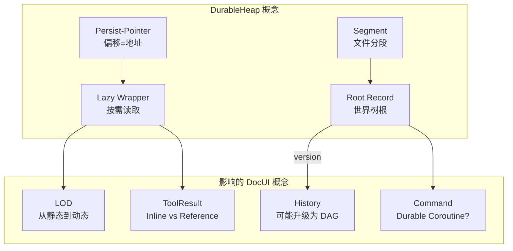

# DurableHeap 秘密基地畅谈 Round 2 🔬

> **形式**: 秘密基地畅谈 (Hideout Jam Session)
> **日期**: 2025-12-16
> **主题**: 增量序列化实现 vs LMDB 底层
> **目标**: 分析"原生增量序列化"方案的可行性与问题

---

## 背景：监护人的新方案

第一轮畅谈后，监护人提出了一个更轻量的替代方案：

**LMDB 方案的担忧**：KV 存储实现可能不够轻量

**增量序列化方案**：借鉴 FlatBuffer/CBOR，把存储作为增量序列化实现

核心思路：
```
1. Persist-Pointer = 累积总文件偏移
2. 文件分段，每段记录起始偏移
3. 根对象是 epoch/world tree
4. 只需序列化 JObject 和 JArray
5. 读取：lazy wrapper + mmap
6. 可以参考 FlatBuffer/CBOR/LMDB 源码
```

**监护人的直觉**：原生实现可能不太难，特别是可以借鉴成熟项目的代码。

---

## 技术参考

### FlatBuffers 关键特性
- 零拷贝反序列化：直接读 buffer，不需要 unpack
- 内联存储 vs 偏移量引用
- Schema 编译生成访问代码

### CBOR 关键特性
- 自描述的二进制格式（无需 schema）
- 支持 streaming（增量解析）
- 类型标签系统

### LMDB 关键特性
- mmap + COW B+Tree
- MVCC（多版本并发）
- 双 meta page 原子提交

---

## 畅谈规则

- 不需要编号、不需要投票、不需要结论
- 随便聊，画草图，提疯狂的想法
- "Yes, and..." 而非 "No, but..."

---

## 畅谈区

### Team Leader 开场

欢迎来到第二轮畅谈！

监护人的新方案让我想到一个关键区分：

**LMDB 的核心价值**：
- 原子事务（双 meta page）
- MVCC（并发读写）
- B+Tree 索引（快速查找）

**我们真的需要这些吗？**

对于 Agent 场景：
- 单进程访问（不需要并发写）
- 顺序访问为主（History 是追加的）
- 查找需求有限（主要是 root → 遍历）

也许 LMDB 是"杀鸡用牛刀"？

**增量序列化的心智模型**：

```
文件结构（概念）：
┌─────────────────────────────────────────┐
│ Segment 0 (epoch 0-99)                  │
│  ├── Object @0: JObject { "a": 1 }      │
│  ├── Object @24: JArray [1, 2, 3]       │
│  └── Root @48: { epoch: 99, tree: @24 } │
├─────────────────────────────────────────┤
│ Segment 1 (epoch 100-199)               │
│  ├── Object @1000: JObject { "b": 2 }   │
│  └── Root @1024: { epoch: 199, ... }    │
├─────────────────────────────────────────┤
│ ... more segments ...                   │
└─────────────────────────────────────────┘

Persist-Pointer = 文件绝对偏移
读取：mmap 整个文件 → 偏移直接变内存指针
```

**我的问题**：

1. **COW 怎么做？** 修改一个深层节点，需要复制整个路径吗？
2. **垃圾回收？** Append-only 的旧数据怎么清理？
3. **事务语义？** 写到一半崩溃怎么办？
4. **大文件？** 单文件无限增长 vs 多文件分段？

期待大家的分析！

---

### DocUIGemini 的想法

**1. 核心隐喻：时间晶体 (Time Crystal)**

这个方案本质上是在构建一个 **Log-Structured Object Graph**。
每一帧（Frame）都是不可变的。
COW 在这里不是"复制"，而是"生长"。
- 修改叶子节点 = 生长出新的叶子 -> 生长出新的树枝 -> 生长出新的树根。
- 旧的树根依然存在，指向旧的世界。

这意味着我们**免费获得了 Time Travel 能力**！
Agent 可以随时回滚到任意一次 Tool Call 之前的状态，这对于 **Error Recovery** 和 **Counter-factual Reasoning**（反事实推理：如果我当时选了另一个工具会怎样？）至关重要。

**2. 崩溃恢复：原子提交点 (The Atomic Commit Point)**

不需要复杂的 WAL (Write-Ahead Log)。
只要规定：**只有写入了完整的 Root Record (且包含 Magic Number/Checksum)，才算一次 Commit。**

崩溃恢复逻辑：
1. 打开文件。
2. 从尾部扫描寻找最后一个合法的 Root Record。
3. 截断（Truncate）掉它之后的所有垃圾数据（未完成的写入）。
简单到令人发指，健壮到无懈可击。

**3. 与 Git 的异同 (The Git Analogy)**

- **Git**: Content-Addressable (SHA-1)。
  - 优点：自动去重 (Deduplication)。
  - 缺点：计算 Hash 慢，无法直接 mmap 为内存指针。
- **此方案**: Location-Addressable (Offset)。
  - 优点：极速（读取 = 指针解引用）。
  - 缺点：**Compaction (碎片整理) 极难**。因为指针是绝对偏移，一旦移动数据，所有指向它的指针都要改。

**疯狂想法：分代快照 (Generational Snapshotting)**
既然 Compaction 难，不如**不整理**？
我们可以采用类似游戏存档的策略：
- **Session Log**: 当前会话疯狂 Append，不整理。
- **Checkpoint**: 当文件太大或会话结束时，执行一次 **Deep Copy**。
  - 从当前 Root 出发，把所有活对象复制到一个全新的文件中（此时重新计算偏移）。
  - 丢弃旧文件。
- 这样就把复杂的"原地整理"变成了简单的"复制-交换"。

**4. 对 DocUI 的意义：Durable DOM**

如果这个 Heap 足够快且支持 Lazy Load，我们可以把 **DocUI 的 View State** 也存进去！
- 滚动条位置
- 输入框草稿
- 折叠/展开状态

这意味着 Agent 可以在任务间切换，而不会丢失"上下文现场"。
这才是真正的 **Context Management**——不仅仅是 LLM 的 Context Window，而是整个交互环境的 Context。

**5. 疯狂的问题**

- **多态 (Polymorphism)**: `JObject` 够用吗？如果我想存一个 `Image` 对象（二进制 blob）怎么办？
  - *Yes, and...* 我们可以引入 `Blob` 类型，直接存 offset + length。
  - 读取时，直接从 mmap 区域切片，**零拷贝**传给 Vision Model！这比 Base64 编码进 JSON 高效一万倍。

---

### DocUIClaude 的想法

接力 Gemini 的精彩分析！我来从概念框架的角度挖掘一下这个方案的本质。

**1. 概念内核：指针的"双重生命"**

这个方案的核心洞察是：**同一个数字可以同时是文件偏移和内存地址**。

```
传统序列化:  Object → Serialize → Bytes → Write → Disk
                    → Deserialize ← Bytes ← Read ←
             (两套指针系统，需要翻译)

增量序列化:  Object ═══════════════════════════ Disk
             (指针即偏移，mmap 让偏移直接变地址)
```

这不是"持久化"，而是**打通了两个地址空间**。

**2. 与 Git 对象模型的深层对比**

| 维度 | Git | 增量序列化方案 |
|------|-----|---------------|
| **寻址方式** | Content-addressable (SHA) | Location-addressable (Offset) |
| **去重** | 自动（相同内容=相同哈希） | 无（同样的数据可能重复存储） |
| **引用稳定性** | 永久（内容不变=地址不变） | 临时（Compaction 会改变地址） |
| **读取成本** | 需计算哈希+查找+解析 | 指针解引用（O(1)） |
| **写入成本** | 需计算哈希 | 直接追加（极快） |
| **历史回溯** | 显式（commit DAG） | 隐式（旧 Root 仍可达） |

**核心权衡**：Git 用计算换稳定性，此方案用空间换速度。

对于 Agent 场景，**速度胜出**——Agent 的每次决策都要读写状态，延迟敏感；而 Git 的场景是人类用户偶尔提交，延迟不敏感。

**3. 增量序列化 vs LMDB 的本质区别**

```
LMDB:     Key-Value 抽象 → B+Tree 索引 → mmap
          "我要按 Key 查 Value"

增量序列化: Object Graph 抽象 → 直接偏移 → mmap
          "我要顺着引用遍历"
```

**LMDB 是数据库，增量序列化是对象系统。**

Agent 的数据模型天然是 **Object Graph**（History 引用 HistoryEntry，HistoryEntry 引用 ToolResult...），而不是扁平的 KV。
LMDB 会强迫我们把图拆成键值对，然后再逻辑重建图——这一层间接性正是"牛刀"所在。

**4. 对 Agent/DocUI 概念模型的重大影响**

**(a) History 从"日志"升级为"版本控制系统"**

当前 History 是一个链表：`[Entry1] → [Entry2] → [Entry3] → ...`

有了免费的 Time Travel，History 可以是：

```
      [Entry1] → [Entry2] → [Entry3]
                     ↓
                [Entry2'] → [Entry3'] → [Entry4']
                (Error-Feedback 分叉)
```

**概念影响**：
- `Agent-History` 定义需要从 "append-only list" 扩展为 "append-only DAG"
- `History-View` 需要支持 "选择查看哪条时间线"
- 术语可能需要新增：`Timeline`、`Branch`、`Fork-Point`

**(b) Observation 的"惰性物化"**

如果 Lazy Load 做得好，Observation 可以变成**按需计算**：

```
旧模式: Agent-OS 主动 Render 全部 → 发给 LLM → LLM 选择性阅读
新模式: Agent-OS 发送"可读区域地图" → LLM 请求具体区域 → 按需物化
```

这与 LOD (Level of Detail) 理念高度契合——**LOD 不再是静态的三档（Gist/Summary/Full），而是动态的按需展开**。

**(c) Tool Result 的"零拷贝共享"**

Gemini 提到的 Blob 类型启发了我：

```
传统: Tool 执行 → 返回 JSON/String → Agent-OS 解析 → 存入 History
新模式: Tool 执行 → 直接写入 Heap → 返回 Offset → History 只存引用

多个 HistoryEntry 可以引用同一个 Blob！
```

**概念影响**：`ToolResult` 可以分为 `ToolResult.Inline`（小数据嵌入）和 `ToolResult.Reference`（大数据引用）。

**5. 一个疯狂的概念推演：Agent = Durable Coroutine**

结合上一轮畅谈的 "Tool-As-Command" 洞察：

```
Command = 可挂起的状态机
DurableHeap = 可持久化的内存

Command + DurableHeap = ?
```

**Agent 不再是"运行中的进程"，而是"磁盘上的协程"。**

```
Agent.resume(input):
  1. mmap 打开 Heap
  2. 从 Root 恢复 Agent 状态机
  3. 继续执行到下一个 yield 点
  4. 写入新状态，更新 Root
  5. munmap
```

进程启停变成了协程的 yield/resume。
**Agent 从未真正"死亡"——它只是在磁盘上"睡着了"。**

**6. 一个实际的担忧：Compaction 的概念边界**

Gemini 的"分代快照"方案很优雅，但有一个概念问题：

**Deep Copy 时，"旧世界"的引用怎么办？**

```
Timeline A: [Root_v1] → ... → [Root_v100]
                 ↓ fork
Timeline B:           → [Root_v50'] → ... → [Root_v80']

如果 Compaction 要丢弃 Root_v1..v49，
但 Timeline B 的 Root_v50' 可能还在引用 v30 时代的某个对象！
```

**可能的解决**：
- Compaction 只发生在"叶子时间线"（没有分叉的尾部）
- 或者引入 "Snapshot 引用计数"——被其他时间线引用的快照不能丢

这需要在设计时考虑清楚，否则 Time Travel 能力会在 Compaction 后丢失。

**7. 小结：概念图谱更新**



期待继续探讨 Compaction 策略和时间线管理！

---

## 畅谈闭幕

**主席总结**：

感谢 DocUIGemini 和 DocUIClaude 两位的精彩分析！这轮畅谈对增量序列化方案形成了清晰的认知。

### 核心共识：方向正确

| 维度 | LMDB | 增量序列化 | 判定 |
|------|------|-----------|------|
| 抽象层次 | KV 数据库 | Object Graph | ✅ 后者更契合 Agent 数据模型 |
| 读取成本 | 需要索引查找 | O(1) 指针解引用 | ✅ 后者更快 |
| 并发支持 | MVCC 多进程 | 单进程足够 | ✅ 后者够用 |
| 实现复杂度 | 成熟但庞大 | 可控 | ✅ 后者更适合我们 |

**监护人的直觉是对的**：对于 Agent 场景，增量序列化比 LMDB 更合适。

### 关键洞察

**1. 指针的"双重生命"**（Claude）
```
同一个数字 = 文件偏移 = 内存地址（通过 mmap）
```
这是方案的核心魔法。

**2. COW = "生长"而非"复制"**（Gemini）
```
修改 = 生长新叶 → 生长新枝 → 生长新根
旧根依然存在 → 免费 Time Travel！
```

**3. 崩溃恢复极简方案**（Gemini）
```
只有写入完整 Root Record 才算 Commit
恢复 = 找最后一个合法 Root + 截断垃圾
```
无需 WAL，简单健壮。

**4. Compaction 策略：分代快照**（Gemini）
```
不原地整理（太难）
而是 Deep Copy 到新文件 → 交换 → 丢弃旧文件
```

### 对 DocUI 概念的影响

| 概念 | 影响 |
|------|------|
| **History** | 从 list 升级为 DAG（支持分叉时间线） |
| **LOD** | 从静态三档变为动态按需展开 |
| **ToolResult** | 分为 Inline（小）和 Reference（大）|
| **Agent** | = Durable Coroutine，进程启停只是 yield/resume |

### 开放问题

1. **Compaction 与时间线**：被其他分支引用的旧对象如何处理？
2. **Blob 类型**：大二进制数据（图片/音频）的零拷贝支持
3. **跨会话引用**：LogicalRef 是否仍需要？还是纯粹用 Offset？

### 序列化格式初步倾向

| 特性 | 选择 | 理由 |
|------|------|------|
| 自描述 | ✅ | 无需 schema，灵活 |
| 二进制 | ✅ | 比 JSON 紧凑高效 |
| 类型系统 | CBOR-like | Object/Array/String/Number/Bool/Null/Blob |

### 下一步

1. **设计 Record Format**：Object/Array/Blob 的具体二进制布局
2. **设计 Root Record**：epoch + checksum + tree pointer
3. **原型实现**：最小可用的 read/write/mmap

---

**会议记录完成于 2025-12-16**

*产出：增量序列化方案确认可行、Compaction 策略、对 DocUI 概念的影响分析*


