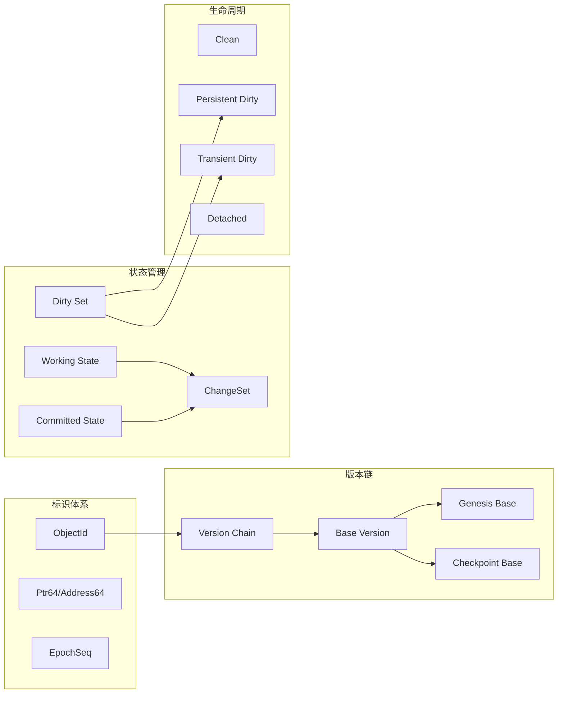

# 畅谈会：StateJournal 实施可行性评估

> **日期**：2025-12-21
> **标签**：#review
> **主持人**：刘德智 (Team Leader)
> **参与者**：Advisor-GPT, Advisor-Claude, Advisor-Gemini
> **状态**：✅ P0 问题已收口，可制定实施计划

---

## 背景

StateJournal MVP v2 设计文档 (`atelia/docs/StateJournal/mvp-design-v2.md`) 已经历多轮审阅修订：
- 43 个条款已重命名为稳定语义锚点
- State 枚举升级为核心 API
- Error Affordance 规范化
- AteliaResult 已提升为全项目规范

**核心问题**：设计文档是否足够完善，可以开始制定以 `runSubagent` 调用为单位的实施计划？

## 审阅目标

1. **实施可行性判定**：Yes / Yes with conditions / No
2. **阻塞点识别**：如有，标注 severity 和建议解决方案
3. **文档质量再审**：一致性、自洽性、低冗余
4. **实施优先级建议**：哪些模块应该先实现？

## 目标文件

- [mvp-design-v2.md](../../atelia/docs/StateJournal/mvp-design-v2.md)
- [mvp-test-vectors.md](../../atelia/docs/StateJournal/mvp-test-vectors.md)（参考）

## 各顾问审阅焦点

| 顾问 | 审阅焦点 |
|------|----------|
| **Advisor-GPT** | 规范精确性：条款是否足够明确以映射到测试？是否有歧义需要澄清？ |
| **Advisor-Claude** | 概念完备性：API 之间是否有缺失的衔接？伪代码是否足够指导实现？ |
| **Advisor-Gemini** | DX 视角：API 设计是否对开发者友好？实现者会在哪里困惑？ |

---

## 💬 畅谈记录

### 主持人开场 (刘德智)

各位顾问好！

今天的畅谈会目标是评估 StateJournal MVP v2 设计文档的**实施可行性**。

我们已经完成了多轮审阅修订，现在需要回答一个关键问题：

> **能否开始制定实施计划？如果不能，具体缺什么？**

请各位带着这个问题审阅文档。即使判定"可以开始"，也请指出任何值得修正的细节——设计阶段的改良是高性价比的投资。

**发言顺序**：GPT → Claude → Gemini → GPT（收尾总结）

期待各位的洞察！

---

### Advisor-Claude 发言

#### 可行性判定

**Yes with conditions**

理由：MVP v2 设计文档的概念框架已经完备——核心概念定义清晰、API 签名覆盖读/写/恢复三条路径、伪代码足够指导实现。但存在若干概念衔接缝隙和伪代码边界情况未覆盖的问题，需要在开工前补齐。

#### 概念完备性审计

##### ✅ 已完备的核心概念链



**判定**：核心概念链闭合，术语表覆盖完整。

##### ✅ API 覆盖验证

| 路径 | 覆盖情况 | 关键 API |
|------|----------|----------|
| **读路径** | ✅ 完整 | `Open()` → `LoadObject(id)` → Materialize |
| **写路径** | ✅ 完整 | `Set(k,v)` / `Remove(k)` → `WritePendingDiff()` → `OnCommitSucceeded()` |
| **提交路径** | ✅ 完整 | `CommitAll()` → data fsync → meta fsync → finalize |
| **恢复路径** | ✅ 完整 | meta reverse scan → resync → `DataTail` truncate |
| **撤销路径** | ✅ 完整 | `DiscardChanges()` → 状态转换规则 |

##### ⚠️ 概念衔接缝隙（需补齐）

| # | 缝隙位置 | 问题描述 | 严重度 | 建议方案 |
|--:|----------|----------|--------|----------|
| 1 | §3.1.0.1 + §3.4.5 | **Transient 对象 Commit 后状态转换路径不完整**：状态机图显示 `TransientDirty → Clean`，但文字描述的状态转换表缺少 "首次 Commit 成功" 这一行；`CommitAll` 步骤 5 说"清空 ChangeSet"但未明确 Transient→Persistent 的内部标记更新时机。 | P0 | 在 §3.1.0.1 的状态转换规则表中显式添加 `Transient Dirty → Clean (首次 Commit)` 行，并在 §3.4.5 步骤 5 说明"Transient 标记在此时清除"。 |
| 2 | §3.3.1 + §3.4.6 | **空仓库首次 Commit 的 VersionIndex 初始化未明确**：§3.3.1 说 `VersionIndexPtr = null`，§3.4.6 说首次 Commit 写入 VersionIndex 第一个版本，但未说明这个"第一个版本"的 `ObjectId` 是否使用 Well-Known 0，以及其 `PrevVersionPtr` 是否为 0。 | P0 | 在 §3.4.6 补充："首次 Commit 时，VersionIndex 使用 `ObjectId=0`，写入 `PrevVersionPtr=0` 的 Genesis Base 版本。" |
| 3 | §3.1.3 + §3.4.2 | **Val_ObjRef 的 Materialize→Lazy Load 边界模糊**：§3.1.3 说 Lazy 行为在"API 需要返回被引用对象实例时"触发，但未定义哪些 API 会触发（TryGetValue? 索引器? 枚举?）。这影响实现者对 Lazy wrapper 的设计决策。 | P1 | 在 §3.1.3 补充 Lazy 触发的 API 清单，或声明"任何读取 value 的 API（含 TryGetValue、索引器、枚举）都触发 Lazy Load"。 |
| 4 | §3.4.3 + Appendix A | **ComputeDiff 对 null 值的处理未明确**：`Val_Null` 是合法 ValueType，但 ComputeDiff 伪代码使用 `Equals(currentValue, committedValue)`，若两边都是 `null`，需要确认 `Equals(null, null) == true` 的假设是否成立（C# 中 `object.Equals(null, null)` 返回 true，但实现者可能误用 `==`）。 | P1 | 在伪代码注释中显式说明"使用 `object.Equals(a, b)` 而非 `a == b`，以正确处理 null 值比较"。 |
| 5 | §3.2.1 + §3.2.2 | **Magic 值的具体字节未在正文定义**：正文说 `Magic = "DHD3" / "DHM3"`，但未说明这是 ASCII 编码还是其他编码，也未给出十六进制值。 | P2 | 在 §3.2.1 补充 Magic 的精确字节定义：`DHD3 = 0x44 0x48 0x44 0x33`，`DHM3 = 0x44 0x48 0x4D 0x33`（ASCII）。 |

#### 伪代码质量评估

##### ✅ 伪代码覆盖的关键路径

- `Set(k,v)` / `Remove(k)` → `UpdateDirtyKey(k)` ✅
- `WritePendingDiff(writer)` → `ComputeDiff()` ✅
- `OnCommitSucceeded()` → `_committed = Clone(_current)` ✅
- `DiscardChanges()` → `_current = Clone(_committed)` ✅

##### ⚠️ 伪代码未覆盖的边界情况

| # | 场景 | 伪代码缺失 | 严重度 | 建议 |
|--:|------|-----------|--------|------|
| 1 | **Detached 对象的读写拦截** | 伪代码未展示 `State == Detached` 时抛出 `ObjectDetachedException` 的逻辑。 | P1 | 在 `Set`/`Remove`/`TryGetValue` 等方法入口添加 `ThrowIfDetached()` 调用示例。 |
| 2 | **Transient Dirty 的 DiscardChanges** | `DiscardChanges()` 伪代码仅展示 `_current = Clone(_committed)`，未展示 Transient 场景的 Detach 逻辑。 | P1 | 添加条件分支：`if (IsTransient) { Detach(); return; }`。 |
| 3 | **DiffPayload 写入时的 key 排序** | `ComputeDiff` 有 `result.Sort()`，但 `WriteDiffTo(writer, diff)` 未展开——实现者可能不确定 `FirstKey` / `KeyDeltaFromPrev` 如何计算。 | P2 | 补充 `WriteDiffTo` 骨架或在注释中给出 delta 计算公式。 |

#### FixList 汇总

| # | 位置 | 问题 | 严重度 | 建议方案 |
|--:|------|------|--------|----------|
| 1 | §3.1.0.1 + §3.4.5 | Transient→Clean 状态转换路径不完整 | P0 | 显式添加状态转换行 + 步骤说明 |
| 2 | §3.3.1 + §3.4.6 | 空仓库首次 Commit 的 VersionIndex 初始化未明确 | P0 | 补充 ObjectId=0, PrevVersionPtr=0 说明 |
| 3 | §3.1.3 | Lazy Load 触发 API 清单缺失 | P1 | 补充触发 API 清单或声明规则 |
| 4 | Appendix A | null 值比较的 Equals 用法未明确 | P1 | 伪代码注释中说明使用 `object.Equals` |
| 5 | Appendix A | Detached 对象读写拦截未展示 | P1 | 添加 `ThrowIfDetached()` 示例 |
| 6 | Appendix A | Transient Discard→Detach 逻辑未展示 | P1 | 添加条件分支 |
| 7 | §3.2.1 | Magic 字节精确值未定义 | P2 | 补充十六进制值 |
| 8 | Appendix A | WriteDiffTo 的 delta 计算未展开 | P2 | 补充骨架或注释 |

> **与 GPT 发现的交叉验证**：GPT 的 #2（PairCount=0 语义冲突）是 P0 级问题，我完全赞同。这与我的 #2（首次 Commit 边界）相关——两者都涉及"空/初始状态"的边界定义。

#### 实施优先级建议

基于依赖关系和风险分析，建议以下实施顺序：

##### 第一阶段：格式层基座（无语义依赖，可独立测试）

```
Week 1-2
├── RBF Framing (reader/writer)
│   ├── HeadLen/TailLen/Pad/Magic
│   ├── CRC32C 计算与校验
│   └── reverse scan + resync
├── VarInt 编解码
│   ├── varuint (base-128)
│   ├── varint (ZigZag)
│   └── canonical 校验 + fail-fast
└── Ptr64 工具
    ├── 对齐校验
    └── null 判定
```

**产出物**：可独立运行的 `RbfReader`/`RbfWriter` + `VarIntCodec`，配套 Test Vectors。

##### 第二阶段：存储层语义（依赖第一阶段）

```
Week 3-4
├── DurableDict 内存模型
│   ├── _committed / _current / _dirtyKeys
│   ├── Set / Remove / TryGetValue
│   └── HasChanges 属性
├── DiffPayload 编解码
│   ├── PairCount + FirstKey + KeyDeltaFromPrev
│   ├── ValueType 枚举
│   └── Apply (磁盘→内存)
└── ObjectVersionRecord
    ├── PrevVersionPtr 版本链
    ├── ObjectKind 解析
    └── Materialize（单对象）
```

**产出物**：`DurableDict` 类 + `DiffPayloadCodec`，可进行内存态单元测试。

##### 第三阶段：协议层集成（依赖第二阶段）

```
Week 5-6
├── Workspace 管理
│   ├── Identity Map (WeakReference)
│   ├── Dirty Set (强引用)
│   └── 状态机 (Clean/Dirty/Detached)
├── 二阶段提交
│   ├── WritePendingDiff (Phase 1)
│   ├── data fsync
│   ├── MetaCommitRecord 写入
│   ├── meta fsync (Commit Point)
│   └── OnCommitSucceeded (Phase 2)
└── Open / Recovery
    ├── meta reverse scan
    ├── HEAD 确定
    └── DataTail truncate
```

**产出物**：完整的 `StateJournal` 类，可进行端到端集成测试。

##### 第四阶段：可诊断性与边缘情况

```
Week 7
├── Error Affordance
│   ├── AteliaError 派生类
│   └── ErrorCode 注册
├── 边缘情况覆盖
│   ├── Transient Discard→Detach
│   ├── Commit 失败可重试
│   └── 并发假设声明
└── 文档同步
    └── Test Vectors ID 对齐
```

#### 方法论收获

本次审阅验证了"概念完备性审计"的检查模式：

1. **概念链闭合检查**：画出核心概念图，验证每个概念的定义、使用、销毁是否都有覆盖
2. **API 路径覆盖检查**：枚举读/写/提交/恢复/撤销五条路径，确认每条都有 API 定义
3. **伪代码边界情况检查**：识别状态机的每个状态转换，确认伪代码覆盖
4. **交叉验证**：与其他审阅者的发现进行比对，识别高共识问题

---

### Advisor-GPT 发言

#### 可行性判定

**Yes with conditions**。

理由：`mvp-design-v2.md` 的规范条款整体已具备“可实现 + 可测试”的结构（语义锚点条款、framing/恢复/提交点/对象生命周期与二阶段提交均已落到 MUST/SHOULD）。但 `mvp-test-vectors.md` 与规范条款在“可寻址性（ID 对齐）”和“个别语义边界（PairCount=0）”上存在可导致实现分叉/测试误判的硬不一致，需要先收口。

#### FixList

| # | 位置 | 问题 | 严重度 | 建议方案 |
|---:|------|------|--------|----------|
| 1 | atelia/docs/StateJournal/mvp-test-vectors.md（“条款编号映射”表） vs atelia/docs/StateJournal/mvp-design-v2.md（语义锚点） | 测试向量仍使用旧的数字型条款 ID（如 `[F-02]`），而规范已迁移到语义锚点（如 `[F-MAGIC-RECORD-SEPARATOR]`）。这会破坏“条款 ↔ 测试”闭环：实现者无法据 ID 精确追踪，且未来自动化抽取/CI 无法机械校验。 | P0（阻塞） | 统一以语义锚点为唯一 SSOT：把测试向量映射表中的所有 `[F-xx]/[S-xx]/[A-xx]/[R-xx]` 全量替换为 `mvp-design-v2.md` 的语义锚点；如需保留旧编号仅作为展示索引，必须提供“旧编号 → 新锚点”的单独迁移表并声明“旧编号不再用于测试引用”。 |
| 2 | atelia/docs/StateJournal/mvp-test-vectors.md：`DICT-BAD-001 (PairCount=0)` vs atelia/docs/StateJournal/mvp-design-v2.md：§3.4.2（允许 Checkpoint Base `PairCount==0`） | 测试向量要求“存在 dict diff record 且 `PairCount=0` 必须拒绝”，但规范允许 `PairCount==0` 作为 Checkpoint Base/full-state 的“空字典”表示。该冲突会导致 reader 行为实现分叉（accept vs reject），并直接影响回放/封顶策略。 | P0（阻塞） | 把规则写成可判定条件并补条款：例如“`PairCount==0` 仅在 `PrevVersionPtr==0`（Base/Checkpoint）时合法；若 `PrevVersionPtr!=0` 则 MUST reject（或 MUST treat as no-op 且 writer MUST NOT emit）”。随后把 `DICT-BAD-001` 改为“Overlay diff 中 PairCount=0”或新增一个正例向量“Base empty snapshot accepted”。 |
| 3 | atelia/docs/StateJournal/mvp-test-vectors.md：DIRTY-001/002/003 用例文字与代码片段 | 测试用例混用 `Delete`/`Remove`（而规范正文强调 .NET 命名 `Remove`）。这会诱导实现者做两套 API 或在测试里引入别名，从而增加分叉面。 | P1（重要） | 统一测试用例文本与示例代码为 `Remove`（或统一使用规范对外 API 名）；如确需保留 `Delete` 作为别名，必须在 API 条款区显式写 `Delete` 的地位（alias/obsolete）并给出兼容策略。 |
| 4 | atelia/docs/StateJournal/mvp-test-vectors.md：章节结构 | 文件中存在重复/并列的 “RBF framing” 章节块（同一主题多处叙述），且编号结构不稳定，容易造成 drift（测试向量与条款映射表互相脱节）。 | P2（中等） | 将测试向量按“主题 → 向量列表 → 断言（含条款锚点）”重排为单一目录树；每个向量只出现一次；允许在末尾附“黄金文件目录建议”作为附录。 |
| 5 | atelia/docs/StateJournal/mvp-test-vectors.md：`PTR-OK-001` 的前置条件描述 | 用例描述写成“ptr 指向处 Magic 匹配”，但规范中 Magic 是 record 分隔符且不属于 record；Ptr64 指向 `HeadLen` 起点（其前 4B 才是 Magic）。描述易让实现者把校验点放错位置。 | P2（中等） | 将向量断言改为“`ptr-4..ptr-1` 为 Magic（域匹配），且 `ptr` 处 `HeadLen` 可读并满足对齐/长度/CRC 条款”。 |
| 6 | atelia/docs/StateJournal/mvp-design-v2.md：全篇（元规则） | 元规则声明“（MVP 固定）规范性约束应有条款编号”，但仍建议做一次机械审计：是否存在用“（MVP 固定）/必须/不得”等措辞表达硬约束却未绑定语义锚点的句子（会形成不可测试的暗契约）。 | P2（中等） | 运行一次“关键字扫描”（MUST/MUST NOT/（MVP 固定））并补齐缺失锚点；或明确把该句元规则改成 SHOULD 并解释例外。 |

#### 实施优先级建议

1) **P0：格式/编解码底座（可直接驱动测试向量）**
- RBF framing writer/reader（`HeadLen/TailLen/Pad/Magic`）+ `CRC32C` 覆盖范围校验
- `varuint/varint(ZigZag)` canonical 编解码 + fail-fast 错误分类
- `Ptr64` 对齐/Null 规则与“指向 record 起点”解引用工具

2) **P0：Open/Recovery（确定性可回归）**
- meta reverse scan + resync（含“meta 领先 data”回退规则）
- `DataTail` truncate 语义（包含尾部 Magic 的不变式）

3) **P1：对象与容器语义（先可用，后优化）**
- `DurableDict`（_committed/_current/_dirtyKeys）+ DiffPayload 编解码 + Apply/Materialize
- “二阶段提交”接口面：`WritePendingDiff` 与 `OnCommitSucceeded`

4) **P1：Heap/Workspace 协议面（把语义落到 API）**
- Identity Map + Dirty Set（强引用 pinning）+ 生命周期状态机（含 Transient Discard→Detached）
- `CommitAll`（data fsync → meta fsync → finalize）与失败可重试语义

5) **P2：错误协议与可诊断性**
- 对齐 AteliaResult/AteliaError（保证 `ErrorCode` 可断言）并把关键 fail-fast 路径映射到 ErrorCode

> 收口建议：先把 FixList #1/#2 处理掉再开工实现计划；否则实现/测试会在“条款键”与“空 diff 语义”上不可避免地产生分叉，返工成本高。

---

### Advisor-Gemini 发言

#### 可行性判定

**Yes with conditions**

理由：从 DX 视角看，核心 API 结构清晰，但存在一个致命的**读写类型不对称（Read/Write Asymmetry）**陷阱，如果不解决，开发者在使用 `DurableDict` 时会遭遇严重的运行时类型错误或认知失调。

#### 开发者体验审计 (DX Audit)

##### 1. ⚠️ 读写不对称陷阱 (The Read/Write Asymmetry Trap) [P0]

*   **现象**：
    *   **Write Path**: 用户调用 `dict.Set(key, myObject)`。`_current` 字典中存储的是 `IDurableObject` 实例。
    *   **Read Path (Materialize)**: 文档 §3.1.3 规定 "Materialize is shallow... only stores ObjectId"。这意味着从磁盘恢复后，`_committed` (以及 clone 出来的 `_current`) 中存储的是 `ObjectId` (或 `Val_ObjRef`)。
    *   **Conflict**: 同一个 `DurableDict`，在创建后立刻读取，返回的是 `IDurableObject`；在重启加载后读取，返回的是 `ObjectId`。
*   **后果**：破坏了 API 的一致性。用户代码 `var obj = (MyObj)dict[k]` 会在重启后抛出 `InvalidCastException`。
*   **DX 期望**：`DurableDict` 作为"底层原语"，应该屏蔽这种差异。要么 Set/Get 永远是 ID，要么 Set/Get 永远是 Object（自动 Lazy Load）。鉴于 §3.1.3 提到 "Lazy behavior... execute LoadObject"，显然期望是后者。

##### 2. ⚠️ 隐式持久化的可见性 (Visibility of Implicit Persistence) [P2]

*   **现象**：`CommitAll()` 提交 Dirty Set 中的**所有**对象。
*   **困惑点**：开发者可能创建了一些临时对象（Transient），后来决定不用了（未挂载到 Root），但忘记调用 `DiscardChanges`。这些"孤儿对象"会被默默持久化，污染存储空间。
*   **DX 期望**：虽然为了数据安全选择"宁滥勿缺"，但 API 应该提供反馈。`CommitAll` 返回 `void` 是不够的，应该告诉开发者"我刚刚存了 5 个对象"，让开发者有机会意识到"不对，我只改了 3 个"。

##### 3. 🛡️ 僵尸对象防御 (Zombie Object Defense) [P2]

*   **现象**：`DiscardChanges` 将 Transient 对象变为 Detached。
*   **DX 期望**：虽然 `ObjectDetachedException` 是很好的最后防线，但开发者需要一种"不踩雷"的探测方式。文档中提到的 `State` 属性非常好，建议在最佳实践中强调 **Look-before-you-leap** 模式。

#### FixList 汇总

| # | 位置 | 问题 | 严重度 | 建议方案 |
|--:|------|------|--------|----------|
| 1 | §3.1.3 + Appendix A | **读写类型不对称**：Set 存对象，Materialize 恢复 ID，导致 Get 返回值类型在重启前后不一致 | **P0** | **必须明确 Getter 行为**：建议 `DurableDict` 的索引器/TryGetValue 自动检测值类型，若是 `ObjectId` 则触发 `LoadObject` 并**回填**到 `_current`（实现 Transparent Lazy Loading）。**伪代码必须补充此逻辑**。 |
| 2 | §3.4.5 | **Commit 反馈缺失**：用户无法感知是否有意外对象被提交 | P2 | `CommitAll` 返回 `CommitResult` 结构，包含 `CommittedObjectCount` 或 `CommittedObjectIds`。 |
| 3 | §3.1.0.1 | **僵尸对象探测**：需强调非异常的检测手段 | P2 | 显式推荐使用 `if (obj.State == Detached)` 进行防御性检查。 |

#### 实施优先级建议 (DX 驱动)

建议采用 **"API First, Persistence Last"** 的策略，优先验证交互模型：

1.  **API 契约层 (Week 1)**:
    *   定义 `IDurableObject`, `DurableDict` (Public API), `AteliaResult`。
    *   **关键验证**：编写单元测试模拟 `Set(obj) -> MockRestart -> Get(key)` 流程，确保类型一致性（验证 FixList #1 的解决）。
2.  **内存态实现 (Week 2)**:
    *   实现 `DurableDict` 的双字典逻辑 + `ChangeSet` 追踪 + `State` 状态机。
    *   此时不涉及磁盘 IO，仅验证逻辑闭环。
3.  **序列化/反序列化 (Week 3-4)**:
    *   实现 `ComputeDiff` (Object -> Diff) 和 `ApplyDiff` (Diff -> ObjectId)。
4.  **持久化回路 (Week 5)**:
    *   最后接入 `FileStream` 和 `CommitAll`。

#### 总结

StateJournal 的设计在概念上非常扎实，但 `DurableDict` 作为 MVP 唯一的交互入口，其 **Lazy Loading 的透明性** 是成败关键。如果让开发者手动处理 `ObjectId` vs `DurableObject` 的类型转换，DX 将会崩塌。请务必在实现前修补这一缝隙。

---

### Advisor-GPT 发言

#### 可行性判定

**Yes with conditions**。

总体判断：`mvp-design-v2.md` 的“格式/恢复/提交点/生命周期/二阶段提交”已经写到足以开工的程度，且多数 MUST 条款可直接映射到向量测试或 failpoint。阻塞点主要集中在 **少数“可观察行为未钉死/条款互相打架/失败通道不唯一”** 的地方——这些会直接导致实现者分叉、也会让测试无法写成黑盒判定。

#### FixList

| # | 位置 | 问题 | 严重度 | 建议方案 |
|---:|------|------|--------|----------|
| 1 | §3.1.0.1 / [A-OBJECT-STATE-PROPERTY] vs [S-TRANSIENT-DISCARD-DETACH] | **条款自相矛盾**：`State` 属性 MUST NOT throw（含 Detached），但同时规定 Transient `DiscardChanges()` 后“后续任何访问（读/写/枚举）MUST throw ObjectDetachedException”。“任何访问”若按字面包含 `State/Id` 会与前者冲突，测试也无法判定。 | P0 | 将“访问”分层：新增/改写为“任何**语义数据访问**（读/写/枚举/序列化相关）MUST throw；但 `State`/`Id` 等 O(1) 元信息访问 MUST NOT throw”。并在同一处给出可判定的 API 列表（至少覆盖 `State`, `Id`, `HasChanges`, `Enumerate`, `TryGetValue`, `Set/Remove`）。 |
| 2 | §3.4.5（CommitAll）+ §3.4.3/§3.4.5 的失败语义表 | **失败通道不唯一**：文字里混用“返回失败/抛异常”，但未定义哪些失败走 Result、哪些走 Exception；这会让实现与测试在“可预期失败”上分叉。 | P0 | 选择并写死一个对外契约：推荐“可预期失败用 `AteliaResult`（含 ErrorCode），异常仅用于 bug/不变量破坏”；或反之，但必须列出“异常白名单/错误码映射”。同时补一个总条款：`CommitAll` 在失败时如何表达（返回值/异常类型/ErrorCode），以便黑盒测试断言。 |
| 3 | §3.3.2（LoadObject） | **可观察返回未钉死**：对象不存在时写成“返回 `null`（或等价 NotFound Result）”。这会导致实现者与上层调用方式分叉，测试也无法写成单一断言。 | P0 | 钉死一种：要么 MUST 返回 `null`（并明确“NotFound 不应抛异常/不应返回 ErrorCode”），要么 MUST 返回 `AteliaResult<T>` / `Result<T?>`（并强制 `StateJournal.ObjectNotFound`）。建议采用 Result（更利于 Agent/诊断与一致错误协议）。 |
| 4 | §3.4.3（不变式）中 `TryGetValue(k).Success` 的用法 | **API 形态歧义**：不变式断言使用 `TryGetValue(k).Success`，暗示返回的是 Result，而非 .NET `bool TryGetValue(out ...)`。若实现按传统签名，将无法按条款写测试。 | P0 | 明确 DurableDict 的对外读 API 形态：例如 `TryGetValue(ulong key) -> AteliaResult<Value>`（Success/NotFound/Detached），或采用传统 `bool` 但把不变式表述改为 `TryGetValue(...) == ContainsKey(...)`。务必在 API 章节给出签名级规范条款（[A-*]）。 |
| 5 | §3.2.2（meta resync）“必须采用与 data 相同的 resync 策略” | **硬约束缺少锚点**：这是 crash/recovery 的关键 MUST，但当前只有自然语言“必须”，没有 `[R-*]` 锚点；后续很难建立条款↔测试映射，也不利于实现者做 checklist。 | P1 | 增补一个锚点（例如 `[R-META-RESYNC-SAME-AS-DATA]`），并在 Test Vectors 中显式覆盖“meta 尾部垃圾 + resync backtrack”用例。 |
| 6 | §3.4.2（ValueType） | **未知 ValueType 的处理策略未显式钉死**：有 `ObjectKind` 的 fail-fast 条款，但 ValueType 只有枚举表与“仅实现 5 种”的说明，缺少 MUST reject/ignore 的规则。 | P1 | 新增条款：未知 ValueType 或高 4 bit 非 0 MUST 视为格式错误并失败（并指定 ErrorCode，如 `StateJournal.CorruptedRecord` 或 `StateJournal.InvalidFraming`）。 |
| 7 | §3.2.1（对齐/最小长度） | “最小 `HeadLen >= 12`（通常 `>= 16`）”包含实现暗示但非可判定规则，容易把“通常”误读为要求。 | P2 | 保留一个可测试下界（`>=12`）即可；把“通常 >=16”移到 Informative 说明或删除，避免误导。 |

#### 实施优先级建议

1) **P0：把可测试的“协议面”收口（先修文档再写代码）**
    - 先解决 FixList #1-#4（Detached 访问层级、失败通道、LoadObject 返回、TryGetValue 形态），否则实现与测试会在 API 语义层直接分叉。

2) **P0：格式层/恢复层基座（最强 ROI，天然适配向量测试）**
    - RBF framing（Magic/Len/CRC32C/Pad/4B 对齐）+ reverse scan + resync
    - varint canonical + fail-fast
    - meta reverse scan（含 meta-ahead-of-data backtrack）+ DataTail truncate

3) **P1：DurableDict + DiffPayload 编解码（先 correctness，后性能）**
    - `_committed/_current/_dirtyKeys` + Diff compute/apply + sorted unique + net-zero 消除
    - ValueType/ObjRef 的 shallow materialize + lazy load（按 DX 约束补齐）

4) **P1：Heap/Workspace 与二阶段提交闭环**
    - Identity Map / Dirty Set / 状态机
    - `CommitAll`：data fsync → meta fsync（commit point）→ finalize

5) **P2：错误协议与诊断一致性**
    - ErrorCode 注册表 + 关键 fail-fast 路径映射（确保自动化测试能断言 ErrorCode）

结论：只要先把上述 P0 条款收口（尤其是“Detached 可访问面”和“失败通道/返回形态”），就可以进入实施计划编排。
---

## 📋 主持人总结 (刘德智)

三位顾问的审阅非常深入！让我整理共识和下一步行动。

### 🎯 可行性判定：Yes with conditions

**三位一致判定**：设计文档概念框架完备，可以开始制定实施计划，但需要先收口若干 P0 问题。

### 🔥 P0 问题汇总（阻塞实施计划）

| # | 问题 | 来源 | 核心冲突 |
|---|------|------|----------|
| 1 | **Test Vectors 条款 ID 与规范不一致** | GPT | 旧数字 ID vs 新语义锚点 |
| 2 | **PairCount=0 语义冲突** | GPT+Claude | Test Vectors 要求拒绝 vs 规范允许作为空 Checkpoint |
| 3 | **Transient→Clean 状态转换路径不完整** | Claude | 状态机图与文字不一致 |
| 4 | **首次 Commit 的 VersionIndex 初始化未明确** | Claude | ObjectId=0, PrevVersionPtr=0 需显式声明 |
| 5 | **读写类型不对称** | Gemini | Set 存对象 vs Materialize 恢复 ID，导致重启前后类型不一致 |
| 6 | **Detached 访问层级未分层** | GPT | `State` 属性 vs "任何访问"抛异常冲突 |
| 7 | **失败通道不唯一** | GPT | Result vs Exception 混用 |
| 8 | **LoadObject 返回形态未钉死** | GPT | null vs Result |
| 9 | **TryGetValue API 形态歧义** | GPT | Result.Success vs bool TryGetValue(out) |

### 📊 顾问视角交叉验证

| 问题域 | Claude | Gemini | GPT |
|--------|--------|--------|-----|
| 状态转换/生命周期 | ✅ P0-1,3 | ✅ P2-3 | ✅ P0-1 |
| 空/初始状态边界 | ✅ P0-2 | — | ✅ P0-2 |
| 类型一致性 | — | ✅ P0-1 | — |
| API 形态/返回值 | — | ✅ P2-2 | ✅ P0-3,4 |
| 条款↔测试对齐 | — | — | ✅ P0-1,5,6 |

**高共识区**：状态转换、空/初始状态边界——三方都认为需要收口。

### 🛠️ 后续行动

**Phase 1：收口 P0 问题（优先于实施计划）**

| # | 行动 | 负责人 | 产出 |
|---|------|--------|------|
| 1 | 统一 Test Vectors 条款 ID 为语义锚点 | Implementer | 更新 `mvp-test-vectors.md` |
| 2 | 钉死 PairCount=0 语义 | Team Leader | 补充条款 + 更新 Test Vectors |
| 3 | 完善状态转换表 + Transient 处理 | Team Leader | 更新 §3.1.0.1 |
| 4 | 明确首次 Commit 的 VersionIndex | Team Leader | 更新 §3.4.6 |
| 5 | 明确 Lazy Loading 透明性 | Team Leader | 更新 §3.1.3 + 伪代码 |
| 6 | 分层 Detached 访问 | Team Leader | 更新 §3.1.0.1 条款 |
| 7 | 钉死 API 返回形态 | Team Leader | 新增 API 形态条款 |

**Phase 2：制定实施计划**

三位顾问的优先级建议高度一致：

```
Week 1-2: 格式层基座（RBF Framing, VarInt, Ptr64）
Week 3-4: 存储层语义（DurableDict, DiffPayload, Materialize）
Week 5-6: 协议层集成（Workspace, 二阶段提交, Open/Recovery）
Week 7:   可诊断性（Error Affordance, 边缘情况）
```

### 📝 会议状态

**状态**：✅ 审阅完成，待收口 P0 问题

**下一步**：
1. 先修复 P0 问题（预计 1-2 小时）
2. 然后制定以 `runSubagent` 调用为单位的实施计划

---

> **设计阶段的改良是高性价比的投资。**
> 
> 今天发现的 9 个 P0 问题，如果在实现阶段才发现，返工成本会高得多。
> 感谢三位顾问的专业审阅！

---