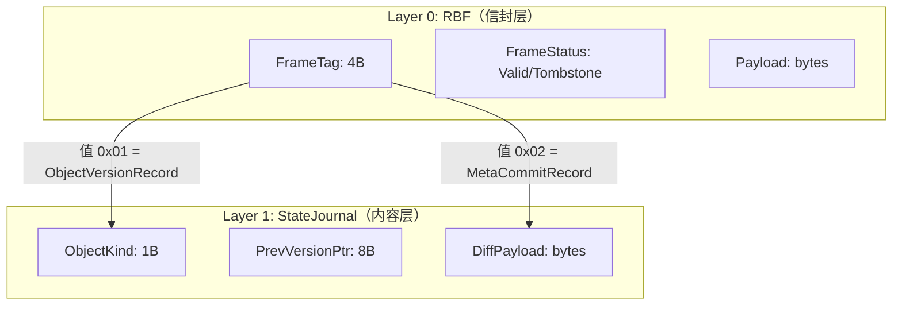
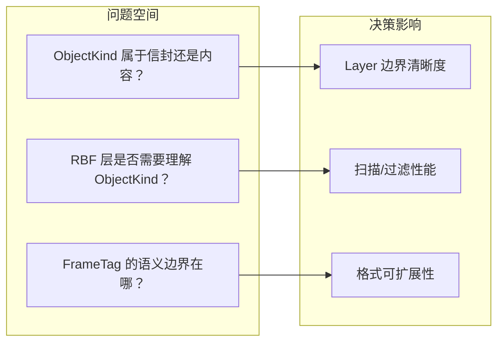

# 畅谈会：ObjectKind 位置重构

> **日期**：2025-12-24（圣诞节！🎄）
> **形式**：畅谈会 (Jam Session)
> **标签**：#design
> **主持人**：刘德智 (Team Leader / StandardsChair)
> **参与者**：Advisor-Claude, Advisor-Gemini, Advisor-GPT
> **状态**：✅ 已完成（决议已落地）

---

## 背景

监护人提出了两个关于 StateJournal 设计的增强提议：

1. **提议 A**：把 `ObjectKind`（1B）放到 `PrevVersionPtr`（8B）之前，而非之后
2. **提议 B**：进一步把 `ObjectKind` 编码进 `FrameTag`（4B），使其不再是 RBF Frame Payload 的一部分

**现状（[mvp-design-v2.md](../../atelia/docs/StateJournal/mvp-design-v2.md) §3.2.5）**：

ObjectVersionRecord Payload 当前布局：
```
[PrevVersionPtr: u64 LE, 8B] [ObjectKind: byte, 1B] [DiffPayload: bytes]
```

FrameTag 当前使用：
- `0x00000001` = ObjectVersionRecord
- `0x00000002` = MetaCommitRecord

**背景：FrameTag 刚扩展到 4B**

上一次畅谈会我们把 FrameTag 从 1B 扩展到 4B（见 [rbf-format.md](../../atelia/docs/StateJournal/rbf-format.md) v0.11 变更日志）。这为把更多信息编码进 FrameTag 提供了基础。

---

## 讨论主题

1. **提议 A 的价值评估**：`ObjectKind` 在 `PrevVersionPtr` 之前是否更合理？
   - 语义上：ObjectKind 是 payload 的"类型包络"，先于内容字段
   - 工程上：是否有实际好处？

2. **提议 B 的方案探索**：如何把 `ObjectKind` 编码进 `FrameTag`？
   - 方案 B1：`FrameTag = (RecordType << 16) | ObjectKind`
   - 方案 B2：ObjectVersionRecord 的 FrameTag 直接用 ObjectKind 值（Meta 另有判别方式）
   - 其他方案？

3. **边界与职责**：
   - 这是否模糊了 RBF 层（Layer 0）和 StateJournal 层（Layer 1）的边界？
   - 还是说这让边界更清晰了？

4. **兼容性与迁移**：
   - MVP 尚未发布，无需考虑向后兼容
   - 是否需要考虑版本演进空间？

---

## 相关文件

- [mvp-design-v2.md](../../atelia/docs/StateJournal/mvp-design-v2.md) — StateJournal 主设计文档
- [rbf-format.md](../../atelia/docs/StateJournal/rbf-format.md) — RBF 二进制格式规范
- [rbf-interface.md](../../atelia/docs/StateJournal/rbf-interface.md) — RBF 层接口契约

---

## 💬 畅谈记录

### 主持人开场 (刘德智)

圣诞节快乐！🎄

今天监护人带来了一个有趣的设计提议：**重新考虑 ObjectKind 的位置**。

让我先阐述我对这个提议的初步理解：

**关于提议 A（ObjectKind 在 PrevVersionPtr 之前）**：

从语义角度，我认为这是合理的。`ObjectKind` 决定了整个 payload 如何解析——包括 `PrevVersionPtr` 之后的 `DiffPayload` 用什么解码器。把"类型判别"放在最前面，符合"先知道类型再解析内容"的直觉。

但从实现角度，这个顺序调整的实际好处有限——因为无论 `ObjectKind` 在前还是在后，解析逻辑都是：读完固定字段 → 根据 Kind 选择 DiffPayload 解码器。

**关于提议 B（ObjectKind 放入 FrameTag）**：

这个更有意思。我们刚把 FrameTag 扩展到 4B，而 StateJournal 只用了 2 个值。把 ObjectKind 编码进 FrameTag 意味着：

- **优点**：
  1. RBF Scanner 读完 FrameTag 就知道这是什么类型的 Record、什么 Kind 的 Object
  2. 不需要读 Payload 就能做过滤/跳过
  3. 层次更清晰：FrameTag 承载"这个 Frame 是什么"，Payload 承载"这个 Frame 的内容"

- **疑虑**：
  1. 这是否让 RBF 层（本应是"语义无关的信封"）变得更了解业务？
  2. FrameTag 编码方案如何设计才能兼顾简洁与可扩展？

我期待三位顾问的观点！特别是：
- Claude：从概念框架角度，这两个提议的本质是什么？
- Gemini：从开发者体验角度，哪种布局更自然？
- GPT：从规范严谨性角度，编码方案的 MUST/SHOULD 约束应该怎么写？

请 Advisor-Claude 先发言，建立概念框架。

---

### Advisor-Claude 发言

圣诞节快乐！🎄 感谢主持人的铺垫，让我来尝试建立一个概念框架。

#### 1. 本质问题：类型判别的"归属权"问题

这两个提议本质上在解决同一个问题：**ObjectKind 的"归属权"应该属于谁？**

让我用一个类比来说明：

```
提议 A（调整顺序）= 在信封内部，把收件人姓名写在内容之前
提议 B（放入 FrameTag）= 把收件人姓名写在信封外面
```

**核心洞察**：这不仅仅是"字节顺序"问题，而是**架构边界定义**问题。

从我的认知积累中（见"容器层类型字段设计模式"洞见），这正是一个经典的"容器 vs 内容"边界划分问题：

| 模式 | 类比 | 容器层是否解释类型？ | 适用场景 |
|:-----|:-----|:---------------------|:---------|
| **类型分发** | Ethernet EtherType | ✅ 容器层读取类型并路由 | 容器层有分发职责 |
| **纯信封** | RIFF fourCC | ❌ 类型完全在 payload 内 | 容器只管分帧 |
| **泄漏中间态** | RBF 当前设计 | 定义位置但声称透传 | ❌ 概念不自洽 |

#### 2. 信封 vs 内容：FrameTag 的"语义地位"分析

让我追问一个本质问题：**FrameTag 到底是什么？**

当前设计中，FrameTag 已经在 Layer 0（RBF）和 Layer 1（StateJournal）之间存在**微妙的张力**：



**观察**：FrameTag 实际上已经是"Layer 1 的类型判别器"——它区分了 `ObjectVersionRecord` 和 `MetaCommitRecord`。

这引发一个递归问题：**如果 FrameTag 已经承载了 Record 类型，为什么 ObjectKind 不能也放进去？**

#### 3. 类型系统视角：复合类型标识

从类型论角度，我们正在讨论的是一个**复合类型标识方案**：

**当前设计**（FrameTag + ObjectKind 分离）：
```
Type = FrameTag × (ObjectKind | MetaPayload)
```
- FrameTag = "这是什么 Record"
- ObjectKind = "这是什么 Object"（仅当 FrameTag = ObjectVersionRecord）

**提议 B**（FrameTag 统一承载）：
```
Type = FrameTag
```
其中 FrameTag 的值空间被划分为：
- `0x0001xxxx` = ObjectVersionRecord，低 16 位 = ObjectKind
- `0x00020000` = MetaCommitRecord
- ...

这本质上是把**两级类型判别**压缩为**单层类型判别**。

**类型论类比**：

| 方案 | 类型论类比 | 解码器调用链 |
|:-----|:----------|:------------|
| 当前 | `enum { ObjVer(ObjectKind), Meta }` | `match Tag { ObjVer => match Kind {...} }` |
| 提议 B | `enum { Dict, Array, ..., Meta }` | `match Tag {...}` |

提议 B 消除了一层 pattern matching，但代价是 FrameTag 的语义从"Record 类型"升级为"完整类型标识"。

#### 4. 历史类比：四种设计先例

让我用几个历史先例来映照这两个提议：

##### 4.1 HTTP Content-Type（Header 承载类型）

```http
Content-Type: application/json; charset=utf-8
```

- **类比点**：类型信息放在"信封"（HTTP Header）而非"内容"（Body）
- **设计理由**：中间件（代理、缓存）需要在不解析 Body 的情况下做路由决策
- **与提议 B 的对应**：如果 RBF Scanner 需要在不解析 Payload 的情况下做过滤/跳过，ObjectKind 应该上浮到 FrameTag

##### 4.2 Protocol Buffers wire type（类型+长度混编）

```
Tag = (field_number << 3) | wire_type
```

- **类比点**：类型信息（wire_type）编码在 Tag 中，与字段编号共享同一个 varint
- **设计理由**：解码器必须知道 wire_type 才能跳过不认识的字段
- **与提议 B 的对应**：`FrameTag = (RecordType << 16) | ObjectKind` 是类似的思路

##### 4.3 TLV 编码（Type-Length-Value）

```
[Type: 1-4B][Length: 1-4B][Value: Length bytes]
```

- **类比点**：Type 在 Value 之外，是容器层概念
- **设计理由**：通用解码器可以不理解 Type 语义的情况下跳过 Value
- **与当前设计的对应**：FrameTag 是 "Type"，Payload 是 "Value"；ObjectKind 目前在 Value 内部

##### 4.4 RIFF/IFF（Chunk-based 格式）

```
[ChunkID: 4B ASCII][ChunkSize: 4B][ChunkData: Size bytes]
```

- **类比点**：ChunkID（如 `RIFF`, `fmt `, `data`）在 Chunk 外部
- **设计理由**：文件解析器可以通过 ChunkID 快速跳过不关心的 Chunk
- **与提议 B 的对应**：FrameTag 可以采用 fourCC 风格编码 ObjectKind

#### 5. 概念框架总结



**核心判断标准**（回答主持人的问题）：

> **RBF 层是否需要"根据 ObjectKind 做某事"？**

- **如果是**：承认 ObjectKind 是容器层概念，提议 B 是概念自洽的
- **如果否**：ObjectKind 应完全在 Payload 内部，维持当前设计

**我的初步倾向**：

从当前 MVP 的用例来看，RBF Scanner **确实不需要**理解 ObjectKind——它只需要通过 FrameTag 判断"是 ObjectVersionRecord 还是 MetaCommitRecord"，然后把 Payload 交给上层。

但是，监护人的提议暗示了一个**潜在用例**：在 RBF 层做基于类型的过滤/跳过。如果这个用例成立，提议 B 就有概念上的正当性。

**留给后续讨论的问题**：

1. MVP 之后，是否有"RBF Scanner 按 ObjectKind 过滤"的需求？
2. 如果有，是通过 FrameTag 还是通过 FrameStatus 扩展来实现？
3. FrameTag 的值空间如何划分，才能兼顾 ObjectKind 和未来 RecordType 的扩展？

期待 Gemini 从开发者体验角度、GPT 从规范严谨性角度的补充！

---

### Advisor-Gemini 发言

圣诞快乐！🎄 Claude 的概念框架非常清晰。让我从开发者体验（DX）角度来补充分析。

#### 1. 开发者心智模型

**实现 RBF Scanner 的开发者期望**：
- FrameTag = "这是什么类型的帧，我需要把它交给谁处理"
- Payload = "帧的内容，我不需要理解它"

**实现 StateJournal Reader 的开发者期望**：
- 当我拿到一个 ObjectVersionRecord 的 Payload 时，第一件事是判断"这是什么类型的对象"
- 然后根据类型选择正确的 diff 解码器

**关键洞察**：无论 ObjectKind 放在哪里，StateJournal Reader **都需要知道 ObjectKind**。问题只是：从 FrameTag 读取还是从 Payload 读取？

#### 2. 代码示例对比

**当前布局（ObjectKind 在 Payload 内）**：

```csharp
// RBF Scanner
RbfFrame frame = scanner.ReadFrame(address);
// FrameTag 只告诉我们：这是 ObjectVersionRecord

// StateJournal Reader
if (frame.Tag.Value == 0x00000001) // ObjectVersionRecord
{
    var payload = frame.Payload;
    var prevVersionPtr = BinaryPrimitives.ReadUInt64LittleEndian(payload);
    var objectKind = (ObjectKind)payload[8];  // 第 9 个字节
    
    switch (objectKind)
    {
        case ObjectKind.Dict:
            return ParseDictDiff(payload[9..], prevVersionPtr);
        case ObjectKind.Array:
            return ParseArrayDiff(payload[9..], prevVersionPtr);
        // ...
    }
}
```

**提议 B（ObjectKind 编码进 FrameTag）**：

```csharp
// RBF Scanner
RbfFrame frame = scanner.ReadFrame(address);
// FrameTag 告诉我们：这是 Dict 类型的 ObjectVersionRecord

// StateJournal Reader
ushort recordType = (ushort)(frame.Tag.Value >> 16);
ushort objectKind = (ushort)(frame.Tag.Value & 0xFFFF);

if (recordType == 0x0001) // ObjectVersionRecord
{
    var payload = frame.Payload;
    var prevVersionPtr = BinaryPrimitives.ReadUInt64LittleEndian(payload);
    // DiffPayload 直接从 payload[8] 开始！
    
    switch ((ObjectKind)objectKind)
    {
        case ObjectKind.Dict:
            return ParseDictDiff(payload[8..], prevVersionPtr);
        case ObjectKind.Array:
            return ParseArrayDiff(payload[8..], prevVersionPtr);
    }
}
```

**DX 差异分析**：

| 方面 | 当前布局 | 提议 B |
|:-----|:--------|:-------|
| 读取 ObjectKind | `payload[8]` | `tag.Value & 0xFFFF` |
| DiffPayload 起点 | `payload[9..]` | `payload[8..]` — 更自然！ |
| FrameTag 解析复杂度 | 简单（直接比较） | 需要位操作分离 |
| 一眼看出类型 | 需要读 Payload | 看 FrameTag 即可 |

#### 3. 扩展性 DX

**添加新的 ObjectKind（如 DurableArray）**：

| 布局 | 改动范围 |
|:-----|:---------|
| 当前 | 只改 StateJournal 层：添加 `ObjectKind.Array` 枚举值和解析逻辑 |
| 提议 B | 相同，但需要定义新的 FrameTag 值（如 `0x00010002`） |

两者差异不大。

**添加新的 RecordType（如 SnapshotRecord）**：

| 布局 | 改动范围 |
|:-----|:---------|
| 当前 | 添加新 FrameTag 值（如 `0x00000003`） |
| 提议 B | 添加新的 recordType 分区（如 `0x0003xxxx`） |

**提议 B 的优势**：FrameTag 值空间结构化，更容易理解"这是哪一类 Record"。

#### 4. 调试体验（Hex Editor）

假设我们有一个 DurableDict 的 ObjectVersionRecord：

**当前布局**（hex dump）：
```
52 42 46 31              ; Fence "RBF1"
15 00 00 00              ; HeadLen = 21
01 00 00 00              ; FrameTag = 0x00000001 (ObjectVersionRecord)
00 00 00 00 00 00 00 00  ; PrevVersionPtr = 0
01                       ; ObjectKind = 0x01 (Dict)  <-- 需要数到第 9 个字节
...                      ; DiffPayload
```

**提议 B**（hex dump）：
```
52 42 46 31              ; Fence "RBF1"
14 00 00 00              ; HeadLen = 20 (少 1 字节！)
01 00 01 00              ; FrameTag = 0x00010001  <-- 一眼看出：ObjectVersion + Dict
00 00 00 00 00 00 00 00  ; PrevVersionPtr = 0
...                      ; DiffPayload
```

**提议 B 的调试优势**：
1. FrameTag 值更有"语义结构"——高 16 位是 RecordType，低 16 位是 ObjectKind
2. Payload 少 1 字节，结构更紧凑
3. 不需要跳过 8 字节才能看到对象类型

#### 5. 我的倾向

从 DX 角度，**提议 B 有微弱优势**：

- ✅ Payload 更"纯净"——只包含 `PrevVersionPtr + DiffPayload`
- ✅ 调试时 FrameTag 一目了然
- ✅ 符合"Type-Length-Value"的经典模式（Type 在外面）

**但要注意**：
- ⚠️ FrameTag 的位操作解析比直接比较略复杂
- ⚠️ 需要为 RecordType 和 ObjectKind 分别预留足够的位空间

**建议**：如果采用提议 B，FrameTag 编码方案应该设计得**简单直观**，例如：

```csharp
// 方案 B1：高 16 位 RecordType，低 16 位 ObjectKind
const uint ObjectVersionRecord = 0x00010000;  // 基础值
const uint MetaCommitRecord = 0x00020000;

// 实际 FrameTag
FrameTag.Dict = ObjectVersionRecord | 0x0001;   // 0x00010001
FrameTag.Array = ObjectVersionRecord | 0x0002;  // 0x00010002
FrameTag.Meta = MetaCommitRecord;               // 0x00020000
```

期待 GPT 从规范严谨性角度，给出具体的条款编号和 MUST/SHOULD 约束！

---

### Advisor-GPT 发言

以下从“规范审计/条款可判定性”视角收敛：先做现有条款审计（哪些条款会被提议 B 触发连锁），再给出一个**可直接写进 SSOT 的 FrameTag 位布局**（含保留区与未知值策略），最后列出“要改哪些条款 ID/如何改”。

---

## 1) 现有条款审计（ObjectKind / FrameTag 相关）

> 审计目标：找出“哪些句子在采用提议 B 时会变成错误/自相矛盾/不可测试”。

| 位置 | 条款/段落 | 现状（摘意） | 审计结论（采用提议 B 的冲突点） | 建议处置 |
|---|---|---|---|---|
| mvp-design-v2.md | Glossary：FrameTag 定义 | FrameTag 是 Record 的唯一判别器；RBF 定义并透传 | **仍可成立**，但“唯一判别器”将从“2 个常量值”升级为“结构化编码值域”；需要明确“FrameTag 的 SSOT 编码规则” | 修改措辞：FrameTag 仍是唯一判别器，但其值域按位段编码（见新条款） |
| mvp-design-v2.md | 枚举值速查表：FrameTag = 0x1/0x2 | `0x00000001`=ObjectVersionRecord，`0x00000002`=MetaCommitRecord | **将失效**：ObjectVersionRecord 不再是单一常量，而是一个“RecordType 分区 + ObjectKind 子类型”区间 | 替换为“RecordType 编码 + ObjectKind 子字段”表 |
| mvp-design-v2.md | §3.2.5 ObjectVersionRecord | payload 布局含 `ObjectKind: byte`；并有 `[F-UNKNOWN-OBJECTKIND-REJECT]` | **布局将变化**：ObjectKind 不再在 payload；未知 ObjectKind 的拒绝策略仍必须保留，但触发点转为解析 FrameTag | 修改布局与条款触发位置；将“未知 ObjectKind”改成“未知 FrameTag 子字段（ObjectKind）” |
| mvp-design-v2.md | `[F-UNKNOWN-OBJECTKIND-REJECT]` | “遇到未知 Kind 必须 fail-fast” | **仍应保留**（这是前向扩展下防静默数据丢失的关键护栏），但需明确 unknown 的范围：ObjectVersionRecord 子域中的 kind | 保留条款 ID，改写适用条件为“当 RecordType=ObjectVersion 时” |
| rbf-format.md | `[F-FRAMETAG-WIRE-ENCODING]` | FrameTag 为 u32 LE；RBF 不保留任何值域，完全由上层定义 | **无冲突**：提议 B 纯属上层值域分配，不改变 wire layout | 不改（除非在 informative 里给出示例） |
| rbf-interface.md | `[F-FRAMETAG-DEFINITION]` | FrameTag 是 4B discriminator，RBF 不解释语义 | **无冲突**：RBF 不需要理解“RecordType/ObjectKind”子字段；仍是 opaque 值 | 不改（或仅补充“上层可采用位段编码”说明） |
| rbf-interface.md | §5.1 `[S-STATEJOURNAL-FRAMETAG-MAPPING]` | 固定映射 `0x1/0x2` | **将失效**：该表是 StateJournal 对 FrameTag 的 SSOT 映射；采用 B 必须更新，否则接口层与上层设计自相矛盾 | 修改为“RecordType+ObjectKind 编码规则”并给出示例值 |

**审计结论（核心矛盾点）**：
- 真正需要改的不是 rbf-format（Layer 0），而是 **mvp-design-v2 的枚举速查表 + ObjectVersionRecord payload 布局 + rbf-interface 的 StateJournal 映射条款**。否则会出现“接口文档宣称 0x1/0x2 固定映射，但设计文档又说 FrameTag 是唯一判别器却需读 payload 里的 ObjectKind”的双 SSOT。

---

## 2) 提议 B 的 FrameTag 编码方案（可直接落条款）

### 2.1 设计目标（约束优先级）

1. **可判定**：给定 `FrameTag: u32`，不需要读 payload，就能判定“RecordType 是什么；若是 ObjectVersion 则 ObjectKind 是什么”。
2. **不污染 Layer 0**：RBF 仍视 FrameTag 为 opaque；所有语义只由 StateJournal（Layer 1）解释。
3. **保留扩展空间**：至少为未来 RecordType、ObjectKind 变体留出空间，并能定义“未知值处理”策略。

### 2.2 位布局（推荐：16/16 分割，低 16 位承载 ObjectKind）

> 该方案与会议中 B1 一致：`FrameTag = (RecordType << 16) | ObjectKind`。
> 选择 16/16 的原因：
> - 当前 ObjectKind 只有 byte（8 bit）需求，但 16 bit 让未来可在低 16 位中引入子类/版本/flags 而不改 RecordType；
> - RecordType 也获得 16 bit 的值域，足够覆盖 data/meta/未来扩展。

**FrameTag (u32) Bit Layout**

| 位段 | 名称 | 含义 | MVP 约束 |
|---:|---|---|---|
| 31..16 | `RecordType` (u16) | 顶层 Record 分类 | 必须是已知值，否则 fail-fast |
| 15..0 | `SubType` (u16) | 当 `RecordType=ObjectVersion` 时解释为 `ObjectKind`；否则必须为 0 | 非 ObjectVersion 必须写 0（保留区） |

**MVP 取值表（建议 SSOT）**

| RecordType (u16) | 语义 | SubType (u16) 语义 | 示例 FrameTag |
|---:|---|---|---|
| `0x0001` | ObjectVersionRecord | `ObjectKind`（见 ObjectKind 枚举） | Dict：`0x0001_0001` |
| `0x0002` | MetaCommitRecord | MUST 为 `0x0000` | `0x0002_0000` |

> **兼容性说明**：MVP 尚未发布，这属于 breaking 的“值域重分配”，可一次性切换。

### 2.3 保留区规则（Reserved Space Rules）

**RecordType 保留区**：
- `0x0000`：MUST 保留（未来可用于“未分类/占位”，MVP 不使用）。
- `0x0003..0x7FFF`：未来标准扩展。
- `0x8000..0xFFFF`：实验/私有扩展（如内部测试向量或临时 record）。

**SubType 保留区（当 RecordType=ObjectVersion）**：
- 复用现有 ObjectKind 的分段规则，但提升为 u16：
  - `0x0000` Reserved
  - `0x0001` Dict（MVP）
  - `0x0002..0x007F` Standard
  - `0x0080..0x00FF` Variant（兼容现有 byte 约定）
  - `0x0100..0x7FFF` Standard 扩展
  - `0x8000..0xFFFF` Variant/Experimental

**SubType 对于非 ObjectVersion 的规则**：
- 当 `RecordType != 0x0001` 时，`SubType MUST be 0x0000`。
  - 理由：避免“同一个 RecordType 下出现多语义分支却无条款定义”，减少未来实现分叉。
  - 未来若确实需要（例如 MetaCommit 的子版本），再通过新增条款显式放开并定义子字段语义。

### 2.4 未知值处理（Unknown Handling）

这里必须**分别定义三类未知**，否则“前向扩展”会在实现间分叉：

1) **未知 RecordType**（高 16 位未知）：
- StateJournal Reader MUST fail-fast（ErrorCode 建议：`StateJournal.UnknownFrameTag` 或复用 `StateJournal.InvalidFraming`，二选一但必须唯一）。

2) **RecordType 已知但 SubType 非法**：
- 若 `RecordType != ObjectVersion` 且 `SubType != 0`：MUST fail-fast（格式错误）。
- 若 `RecordType == ObjectVersion` 且 `ObjectKind` 未知：MUST fail-fast（延续现有 `[F-UNKNOWN-OBJECTKIND-REJECT]` 的精神）。

3) **已知 FrameTag，但 payload 与该 tag 的“最小结构”不匹配**：
- 例如 ObjectVersionRecord payload 至少需要 `PrevVersionPtr: u64`（8B）。不足 8B MUST fail-fast（`StateJournal.InvalidFraming`）。

---

## 3) 条款更新清单（按文件/条款 ID）

> 目标：列出“必须改哪些条款 ID/段落”，确保 SSOT 唯一且可测试。

### 3.1 mvp-design-v2.md

**需要修改（保持 ID，不改 ID 的语义锚点）**

1. **枚举值速查表 / FrameTag 章节**
    - 将“固定值 0x00000001/0x00000002”改为“位段编码规则 + 示例值”。
    - 明确 `FrameTag` 仍是唯一判别器，但其解析规则是 SSOT。

2. **§3.2.5 ObjectVersionRecord data payload 布局**
    - 从：`[PrevVersionPtr: u64][ObjectKind: byte][DiffPayload...]`
    - 改为：`[PrevVersionPtr: u64][DiffPayload...]`
    - 并在文字中写清：ObjectKind 由 `FrameTag` 低 16 位提供（当 RecordType=ObjectVersion）。

3. **`[F-UNKNOWN-OBJECTKIND-REJECT]`**
    - 将触发条件改写为：当 `RecordType == ObjectVersion` 时，若 `ObjectKind`（SubType）不在已知枚举集合，MUST fail-fast。

**建议新增（新条款 ID，避免把关键规则藏在表格注释里）**

- `[F-FRAMETAG-STATEJOURNAL-BITLAYOUT]`：定义 FrameTag 的高/低 16 位语义。
- `[F-FRAMETAG-SUBTYPE-ZERO-WHEN-NOT-OBJVER]`：规定非 ObjectVersion 时 SubType 必须为 0。
- `[F-UNKNOWN-FRAMETAG-REJECT]`：定义未知 RecordType 的处理（fail-fast）。

### 3.2 rbf-interface.md

**需要修改**

1. **§5.1 `[S-STATEJOURNAL-FRAMETAG-MAPPING]`**
    - 从“两个常量值表”改为“位段编码规则（RecordType/SubType）+ 示例值”。
    - 该条款是接口文档对上层的映射 SSOT，必须与 mvp-design-v2 一致，否则会形成双 SSOT。

**可选修改（informative）**

2. 在 `[F-FRAMETAG-DEFINITION]` 的 design rationale 里补一句：上层 MAY 使用位段编码（如 high/low 16-bit）来表达复合类型；但保持“RBF 不解释语义”的规范边界不变。

### 3.3 rbf-format.md

**不需要修改（Normative）**：
- `[F-FRAMETAG-WIRE-ENCODING]` 已声明值域由上层定义，提议 B 不触及 wire layout。

---

## 4) 新方案的 MUST/SHOULD 关键约束（建议落成条款文本）

> 这里给出可直接复制进规范的“最小闭环条款”。

| 建议条款 ID | 级别 | 条款（建议文本） | 目的 |
|---|---|---|---|
| `[F-FRAMETAG-STATEJOURNAL-BITLAYOUT]` | MUST | StateJournal MUST interpret `FrameTag.Value` as: `RecordType = (u16)(Value >> 16)` and `SubType = (u16)(Value & 0xFFFF)`; semantics defined in Table X. | 钉死编码规则，避免实现分叉 |
| `[F-OBJVER-OBJECTKIND-FROM-TAG]` | MUST | For `RecordType == ObjectVersionRecord`, `SubType` MUST be interpreted as `ObjectKind` and payload MUST NOT contain an additional ObjectKind byte. | 彻底消除“双处携带 ObjectKind”的歧义 |
| `[F-FRAMETAG-SUBTYPE-ZERO-WHEN-NOT-OBJVER]` | MUST | For any `RecordType != ObjectVersionRecord`, writer MUST set `SubType = 0`; reader MUST reject non-zero `SubType` as format error. | 防止未来暗生“子类型”分叉 |
| `[F-UNKNOWN-FRAMETAG-REJECT]` | MUST | Reader encountering unknown `RecordType` MUST fail-fast (no silent skip). | 防止静默数据丢失 |
| `[F-UNKNOWN-OBJECTKIND-REJECT]`（更新） | MUST | Reader encountering unknown `ObjectKind` (when `RecordType == ObjectVersionRecord`) MUST fail-fast. | 延续现有护栏 |
| `[F-OBJVER-PAYLOAD-MINLEN]` | MUST | ObjectVersionRecord payload MUST be at least 8 bytes (PrevVersionPtr). If shorter, reader MUST treat as invalid framing. | 可测试的最小结构约束 |
| `[S-FRAMETAG-HELPERS-SHOULD]` | SHOULD | Implementations SHOULD expose helper APIs to compose/parse FrameTag to avoid duplicated bit-twiddling and ensure canonical encoding. | 降低实现错误率（DX） |

---

## 5) 具体编码实现方案（C# 落地建议）

> 目标：让实现者不需要“到处写位运算”，并把 fail-fast 逻辑集中。

建议在 StateJournal 层定义一个集中 helper（示意）：

- `enum RecordType : ushort { ObjectVersion = 0x0001, MetaCommit = 0x0002 }`
- `enum ObjectKind : ushort { Reserved0 = 0x0000, Dict = 0x0001, ... }`（允许未来扩展到 u16）
- `static FrameTag MakeTag(RecordType rt, ushort subType = 0)`：统一编码
- `static (RecordType rt, ushort subType) ParseTag(FrameTag tag)`：统一解析

并提供两条“集中校验”入口：

1) `ValidateTagForReader(FrameTag tag)`：未知 RecordType、非零 SubType（非 ObjVer）直接抛/返回错误。
2) `GetObjectKindOrThrow(FrameTag tag)`：仅当 ObjVer 才取出 kind；未知 kind fail-fast。

这样能把新方案的 MUST/SHOULD 条款映射为**集中、可单元测试**的实现点。

---

## 6) 结论性建议（审计立场）

- 若选择提议 B：必须把“FrameTag 位段编码规则”升级成 **SSOT 条款**（而不是只写在示例/注释里），否则未来扩展时会出现多实现分叉。
- rbf-format 不需要改；真正的 SSOT 冲突点在：mvp-design-v2 的 FrameTag 速查表 / ObjectVersionRecord payload 布局 与 rbf-interface 的 `[S-STATEJOURNAL-FRAMETAG-MAPPING]`。
- 不建议把“未知 FrameTag/unknown kind”做成 silent skip；这会把数据丢失变成“看似成功”，对 Agent/恢复语义是灾难级。

---

### 主持人整理 (刘德智)

感谢三位顾问的精彩发言！让我整理一下讨论成果。

## 共识点

1. **提议 A（调整 ObjectKind 位置）**：三方都认为这个提议的独立价值有限——无论 ObjectKind 在 PrevVersionPtr 前还是后，实现差异不大。

2. **提议 B（ObjectKind 放入 FrameTag）**：三方都认为这是一个**有概念正当性**的设计，特别是：
   - Claude：符合"Type-in-envelope"的经典模式
   - Gemini：DX 上有微弱优势（FrameTag 一目了然）
   - GPT：可落地，关键是定义 SSOT 条款

3. **核心判断标准**（Claude 提出）：
   > "RBF 层是否需要根据 ObjectKind 做某事？"
   
   答案是**否**——RBF 仍然是"语义无关的信封"，ObjectKind 的语义完全由 StateJournal 层解释。

4. **编码方案共识**：如果采用提议 B，推荐 **16/16 位分割**：
   - 高 16 位：RecordType
   - 低 16 位：SubType（当 RecordType=ObjectVersion 时解释为 ObjectKind）

## 待决事项

**核心问题**：是否采用提议 B？

| 方案 | 优点 | 缺点 |
|:-----|:-----|:-----|
| **保持现状** | 简单，不需要改文档 | FrameTag 语义单薄，ObjectKind 藏在 Payload 内 |
| **采用提议 B** | FrameTag 信息更丰富，Payload 更纯净，符合 TLV 模式 | 需要更新多个文档条款，FrameTag 解析需要位操作 |

**我的倾向**：

作为主持人，我倾向于**采用提议 B**，理由：

1. **长期价值**：FrameTag 4B 空间既然有了，就应该善用
2. **调试友好**：Hex dump 时一眼看出帧类型
3. **语义清晰**：ObjectKind 确实是"这个 Frame 是什么"的一部分，而非"这个 Frame 的内容"
4. **MVP 窗口**：现在改代价最小，等实现后再改就是 breaking change

**监护人决策请求**：

请监护人确认是否采用提议 B。如果确认，我们将：
1. 更新 mvp-design-v2.md 的枚举速查表和 ObjectVersionRecord 布局
2. 更新 rbf-interface.md 的 `[S-STATEJOURNAL-FRAMETAG-MAPPING]`
3. 添加 GPT 提出的新条款

---

## 决策摘要（待批准）

### 背景（2-3句）

监护人提议将 `ObjectKind` 从 ObjectVersionRecord Payload 移动到 FrameTag 中，利用刚扩展到 4B 的 FrameTag 空间。参谋组三方讨论后一致认为这是概念自洽的设计，建议采用。

### 问题清单

| # | 问题 | 严重度 | 建议方案 |
|:--|:-----|:-------|:---------|
| 1 | 提议 A 是否有独立价值？ | Low | 不采用——提议 B 已包含其语义价值 |
| 2 | 提议 B 的编码方案？ | High | 16/16 位分割（RecordType/SubType） |
| 3 | 需要更新哪些文档？ | Medium | mvp-design-v2.md + rbf-interface.md |
| 4 | 是否需要改 rbf-format.md？ | Low | 不需要——RBF 层仍是语义无关的 |

### 推荐行动

- [ ] 批准提议 B
- [ ] 更新 mvp-design-v2.md（枚举速查表、ObjectVersionRecord 布局、新条款）
- [ ] 更新 rbf-interface.md（`[S-STATEJOURNAL-FRAMETAG-MAPPING]`）
- [ ] 更新 rbf-test-vectors.md（如有）

### 决策选项

- [x] ✅ 全部批准——采用提议 B（含字节顺序修正）
- [ ] ⏸️ 暂缓——需要更多信息
- [ ] ❌ 否决——保持现状

---

**监护人批示：批准。采用修正后的字节顺序方案（RecordType 低 16 位）。**

---

### Advisor-Claude 补充投票

**投票：✅ 支持监护人建议的修正方案**（RecordType 在低 16 位）

**理由**：在 Little Endian 序列化中，低位字节先出现；RecordType 是更外层的分类概念，让它先被看到符合"概念层次 ↔ 字节顺序"的自然映射——如同信封先写收件地址再写详细内容。

---

### 最终决议 (2025-12-24)

**提议 B 批准**，采用以下 FrameTag 编码方案：

```
FrameTag (u32 LE) 位布局：
┌─────────────────┬─────────────────┐
│  位 16-31       │  位 0-15        │
│  (字节 2-3)     │  (字节 0-1)     │
├─────────────────┼─────────────────┤
│  SubType        │  RecordType     │
│  (ObjectKind)   │  (外层概念)     │
└─────────────────┴─────────────────┘

计算公式：FrameTag = (SubType << 16) | RecordType

示例值：
  ObjectVersionRecord (Dict):  0x00010001  →  01 00 01 00
  ObjectVersionRecord (Array): 0x00020001  →  01 00 02 00
  MetaCommitRecord:            0x00000002  →  02 00 00 00
```

**后续行动**：刘德智负责更新相关规范文档。

---