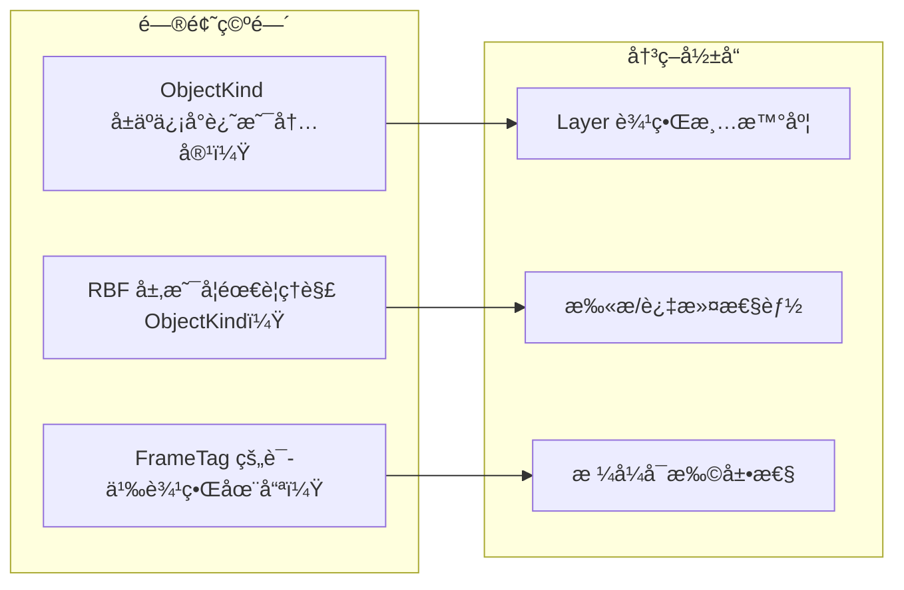

# 畅谈会：ObjectKind ä½ç½®é‡æ„

> **日期**：2025-12-24（圣è¯èŠ‚ï¼ğŸ„）
> **å½¢å¼**：畅谈会 (Jam Session)
> **标签**：#design
> **主æŒäºº**：刘德智 (Team Leader / StandardsChair)
> **å‚ä¸è€…**：Advisor-Claude, Advisor-Gemini, Advisor-GPT
> **状æ€**：✅ 已完æˆï¼ˆå†³è®®å·²è½åœ°ï¼‰

---

## 背景

监护人æå‡ºäº†ä¸¤ä¸ªå…³äº StateJournal 设计的å¢å¼ºæ议：

1. **æè®® A**：把 `ObjectKind`（1B）放到 `PrevVersionPtr`（8B）之å‰ï¼Œè€Œé之å
2. **æè®® B**：进一步把 `ObjectKind` ç¼–ç è¿› `FrameTag`（4B），使其ä¸å†æ˜¯ RBF Frame Payload 的一部分

**ç°çŠ¶ï¼ˆ[mvp-design-v2.md](../../atelia/docs/StateJournal/mvp-design-v2.md) §3.2.5）**：

ObjectVersionRecord Payload 当å‰å¸ƒå±€ï¼š
```
[PrevVersionPtr: u64 LE, 8B] [ObjectKind: byte, 1B] [DiffPayload: bytes]
```

FrameTag 当å‰ä½¿ç”¨ï¼š
- `0x00000001` = ObjectVersionRecord
- `0x00000002` = MetaCommitRecord

**背景：FrameTag 刚扩展到 4B**

上一次畅谈会我们把 FrameTag ä» 1B 扩展到 4Bï¼ˆè§ [rbf-format.md](../../atelia/docs/StateJournal/rbf-format.md) v0.11 å˜æ›´æ—¥å¿—）。这为把更多信æ¯ç¼–ç è¿› FrameTag æ供了基础。

---

## 讨论主题

1. **æè®® A 的价值评估**：`ObjectKind` 在 `PrevVersionPtr` 之å‰æ˜¯å¦æ›´åˆç†ï¼Ÿ
   - 语义上：ObjectKind 是 payload çš„"ç±»å‹åŒ…络"，先äºå†…容字段
   - 工程上：是å¦æœ‰å®é™…好处？

2. **æè®® B 的方案æ¢ç´¢**：如何把 `ObjectKind` ç¼–ç è¿› `FrameTag`？
   - 方案 B1：`FrameTag = (RecordType << 16) | ObjectKind`
   - 方案 B2：ObjectVersionRecord çš„ FrameTag ç›´æ¥ç”¨ ObjectKind 值（Meta å¦æœ‰åˆ¤åˆ«æ–¹å¼ï¼‰
   - 其他方案？

3. **边界ä¸èŒè´£**：
   - 这是å¦æ¨¡ç³Šäº† RBF 层（Layer 0）和 StateJournal 层（Layer 1）的边界？
   - 还是说这让边界更清晰了？

4. **兼容性ä¸è¿ç§»**：
   - MVP 尚未å‘布，无需考虑å‘å兼容
   - 是å¦éœ€è¦è€ƒè™‘版本演进空间？

---

## 相关文件

- [mvp-design-v2.md](../../atelia/docs/StateJournal/mvp-design-v2.md) — StateJournal 主设计文档
- [rbf-format.md](../../atelia/docs/StateJournal/rbf-format.md) — RBF 二进制格å¼è§„范
- [rbf-interface.md](../../atelia/docs/StateJournal/rbf-interface.md) — RBF 层æ¥å£å¥‘约

---

## 💬 畅谈记录

### 主æŒäººå¼€åœº (刘德智)

圣è¯èŠ‚å¿«ä¹ï¼ğŸ„

今天监护人带æ¥äº†ä¸€ä¸ªæœ‰è¶£çš„设计æ议：**é‡æ–°è€ƒè™‘ ObjectKind çš„ä½ç½®**。

让我先é˜è¿°æˆ‘对这个æ议的åˆæ­¥ç†è§£ï¼š

**å…³äºæè®® A（ObjectKind 在 PrevVersionPtr 之å‰ï¼‰**：

ä»è¯­ä¹‰è§’度，我认为这是åˆç†çš„。`ObjectKind` 决定了整个 payload 如何解æ——包括 `PrevVersionPtr` 之åçš„ `DiffPayload` 用什么解ç å™¨ã€‚把"ç±»å‹åˆ¤åˆ«"放在最å‰é¢ï¼Œç¬¦åˆ"先知é“ç±»å‹å†è§£æ内容"的直觉。

但ä»å®ç°è§’度，这个顺åºè°ƒæ•´çš„å®é™…好处有é™â€”—因为无论 `ObjectKind` 在å‰è¿˜æ˜¯åœ¨å，解æ逻辑都是：读完固定字段 → æ ¹æ® Kind 选择 DiffPayload 解ç å™¨ã€‚

**å…³äºæè®® B（ObjectKind 放入 FrameTag）**：

这个更有æ„æ€ã€‚我们刚把 FrameTag 扩展到 4B，而 StateJournal åªç”¨äº† 2 个值。把 ObjectKind ç¼–ç è¿› FrameTag æ„味ç€ï¼š

- **优点**：
  1. RBF Scanner 读完 FrameTag 就知é“这是什么类å‹çš„ Recordã€ä»€ä¹ˆ Kind çš„ Object
  2. ä¸éœ€è¦è¯» Payload 就能åšè¿‡æ»¤/跳过
  3. 层次更清晰：FrameTag 承载"这个 Frame 是什么"，Payload 承载"这个 Frame 的内容"

- **疑虑**：
  1. 这是å¦è®© RBF 层（本应是"语义无关的信å°"）å˜å¾—更了解业务？
  2. FrameTag ç¼–ç æ–¹æ¡ˆå¦‚何设计æ‰èƒ½å…¼é¡¾ç®€æ´ä¸å¯æ‰©å±•ï¼Ÿ

我期待三ä½é¡¾é—®çš„观点ï¼ç‰¹åˆ«æ˜¯ï¼š
- Claude：ä»æ¦‚念框æ¶è§’度，这两个æ议的本质是什么？
- Gemini：ä»å¼€å‘者体验角度，哪ç§å¸ƒå±€æ›´è‡ªç„¶ï¼Ÿ
- GPT：ä»è§„范严谨性角度，编ç æ–¹æ¡ˆçš„ MUST/SHOULD 约æŸåº”该æ€ä¹ˆå†™ï¼Ÿ

请 Advisor-Claude å…ˆå‘言，建立概念框æ¶ã€‚

---

### Advisor-Claude å‘言

圣è¯èŠ‚å¿«ä¹ï¼ğŸ„ 感谢主æŒäººçš„铺å«ï¼Œè®©æˆ‘æ¥å°è¯•å»ºç«‹ä¸€ä¸ªæ¦‚念框æ¶ã€‚

#### 1. 本质问题：类å‹åˆ¤åˆ«çš„"å½’å±æƒ"问题

这两个æ议本质上在解决åŒä¸€ä¸ªé—®é¢˜ï¼š**ObjectKind çš„"å½’å±æƒ"应该å±äºè°ï¼Ÿ**

让我用一个类比æ¥è¯´æ˜ï¼š

```
æè®® A（调整顺åºï¼‰= 在信å°å†…部，把收件人姓å写在内容之å‰
æè®® B（放入 FrameTag）= 把收件人姓å写在信å°å¤–é¢
```

**核心æ´å¯Ÿ**：这ä¸ä»…仅是"字节顺åº"问题，而是**æ¶æ„边界定义**问题。

ä»æˆ‘的认知积累中（è§"容器层类å‹å­—段设计模å¼"æ´è§ï¼‰ï¼Œè¿™æ­£æ˜¯ä¸€ä¸ªç»å…¸çš„"容器 vs 内容"边界划分问题：

| æ¨¡å¼ | 类比 | 容器层是å¦è§£é‡Šç±»å‹ï¼Ÿ | 适用场景 |
|:-----|:-----|:---------------------|:---------|
| **ç±»å‹åˆ†å‘** | Ethernet EtherType | ✅ 容器层读å–ç±»å‹å¹¶è·¯ç”± | 容器层有分å‘èŒè´£ |
| **纯信å°** | RIFF fourCC | ⌠类å‹å®Œå…¨åœ¨ payload 内 | 容器åªç®¡åˆ†å¸§ |
| **泄æ¼ä¸­é—´æ€** | RBF 当å‰è®¾è®¡ | 定义ä½ç½®ä½†å£°ç§°é€ä¼  | ⌠概念ä¸è‡ªæ´½ |

#### 2. ä¿¡å° vs 内容：FrameTag çš„"语义地ä½"分æ

让我追问一个本质问题：**FrameTag 到底是什么？**

当å‰è®¾è®¡ä¸­ï¼ŒFrameTag å·²ç»åœ¨ Layer 0（RBF）和 Layer 1（StateJournal）之间存在**微妙的张力**：


**观察**：FrameTag å®é™…上已ç»æ˜¯"Layer 1 çš„ç±»å‹åˆ¤åˆ«å™¨"——它区分了 `ObjectVersionRecord` å’Œ `MetaCommitRecord`。

这引å‘一个递归问题：**å¦‚æœ FrameTag å·²ç»æ‰¿è½½äº† Record ç±»å‹ï¼Œä¸ºä»€ä¹ˆ ObjectKind ä¸èƒ½ä¹Ÿæ”¾è¿›å»ï¼Ÿ**

#### 3. ç±»å‹ç³»ç»Ÿè§†è§’：å¤åˆç±»å‹æ ‡è¯†

ä»ç±»å‹è®ºè§’度，我们正在讨论的是一个**å¤åˆç±»å‹æ ‡è¯†æ–¹æ¡ˆ**：

**当å‰è®¾è®¡**（FrameTag + ObjectKind 分离）：
```
Type = FrameTag × (ObjectKind | MetaPayload)
```
- FrameTag = "这是什么 Record"
- ObjectKind = "这是什么 Object"（仅当 FrameTag = ObjectVersionRecord）

**æè®® B**（FrameTag 统一承载）：
```
Type = FrameTag
```
其中 FrameTag 的值空间被划分为：
- `0x0001xxxx` = ObjectVersionRecordï¼Œä½ 16 ä½ = ObjectKind
- `0x00020000` = MetaCommitRecord
- ...

这本质上是把**两级类å‹åˆ¤åˆ«**å‹ç¼©ä¸º**å•å±‚ç±»å‹åˆ¤åˆ«**。

**ç±»å‹è®ºç±»æ¯”**：

| 方案 | ç±»å‹è®ºç±»æ¯” | 解ç å™¨è°ƒç”¨é“¾ |
|:-----|:----------|:------------|
| å½“å‰ | `enum { ObjVer(ObjectKind), Meta }` | `match Tag { ObjVer => match Kind {...} }` |
| æè®® B | `enum { Dict, Array, ..., Meta }` | `match Tag {...}` |

æè®® B 消除了一层 pattern matching，但代价是 FrameTag 的语义ä»"Record ç±»å‹"å‡çº§ä¸º"完整类å‹æ ‡è¯†"。

#### 4. å†å²ç±»æ¯”：四ç§è®¾è®¡å…ˆä¾‹

让我用几个å†å²å…ˆä¾‹æ¥æ˜ ç…§è¿™ä¸¤ä¸ªæ议：

##### 4.1 HTTP Content-Type（Header 承载类å‹ï¼‰

```http
Content-Type: application/json; charset=utf-8
```

- **类比点**：类å‹ä¿¡æ¯æ”¾åœ¨"ä¿¡å°"（HTTP Header）而é"内容"（Body）
- **设计ç†ç”±**：中间件（代ç†ã€ç¼“存）需è¦åœ¨ä¸è§£æ Body 的情况下åšè·¯ç”±å†³ç­–
- **ä¸æè®® B 的对应**ï¼šå¦‚æœ RBF Scanner 需è¦åœ¨ä¸è§£æ Payload 的情况下åšè¿‡æ»¤/跳过，ObjectKind 应该上浮到 FrameTag

##### 4.2 Protocol Buffers wire type（类å‹+长度混编）

```
Tag = (field_number << 3) | wire_type
```

- **类比点**：类å‹ä¿¡æ¯ï¼ˆwire_type）编ç åœ¨ Tag 中，ä¸å­—段编å·å…±äº«åŒä¸€ä¸ª varint
- **设计ç†ç”±**：解ç å™¨å¿…é¡»çŸ¥é“ wire_type æ‰èƒ½è·³è¿‡ä¸è®¤è¯†çš„字段
- **ä¸æè®® B 的对应**：`FrameTag = (RecordType << 16) | ObjectKind` 是类似的æ€è·¯

##### 4.3 TLV ç¼–ç ï¼ˆType-Length-Value）

```
[Type: 1-4B][Length: 1-4B][Value: Length bytes]
```

- **类比点**：Type 在 Value 之外，是容器层概念
- **设计ç†ç”±**：通用解ç å™¨å¯ä»¥ä¸ç†è§£ Type 语义的情况下跳过 Value
- **ä¸å½“å‰è®¾è®¡çš„对应**：FrameTag 是 "Type"，Payload 是 "Value"ï¼›ObjectKind ç›®å‰åœ¨ Value 内部

##### 4.4 RIFF/IFF（Chunk-based æ ¼å¼ï¼‰

```
[ChunkID: 4B ASCII][ChunkSize: 4B][ChunkData: Size bytes]
```

- **类比点**：ChunkID（如 `RIFF`, `fmt `, `data`）在 Chunk 外部
- **设计ç†ç”±**：文件解æ器å¯ä»¥é€šè¿‡ ChunkID 快速跳过ä¸å…³å¿ƒçš„ Chunk
- **ä¸æè®® B 的对应**：FrameTag å¯ä»¥é‡‡ç”¨ fourCC é£æ ¼ç¼–ç  ObjectKind

#### 5. 概念框æ¶æ€»ç»“



**核心判断标准**（å›ç­”主æŒäººçš„问题）：

> **RBF 层是å¦éœ€è¦"æ ¹æ® ObjectKind åšæŸäº‹"？**

- **如æœæ˜¯**：承认 ObjectKind 是容器层概念，æè®® B 是概念自洽的
- **如æœå¦**：ObjectKind 应完全在 Payload 内部，维æŒå½“å‰è®¾è®¡

**我的åˆæ­¥å€¾å‘**：

ä»å½“å‰ MVP 的用例æ¥çœ‹ï¼ŒRBF Scanner **ç¡®å®ä¸éœ€è¦**ç†è§£ ObjectKind——它åªéœ€è¦é€šè¿‡ FrameTag 判断"是 ObjectVersionRecord 还是 MetaCommitRecord"，然å把 Payload 交给上层。

但是，监护人的æ议暗示了一个**潜在用例**：在 RBF 层åšåŸºäºç±»å‹çš„过滤/跳过。如æœè¿™ä¸ªç”¨ä¾‹æˆç«‹ï¼Œæè®® B 就有概念上的正当性。

**留给å续讨论的问题**：

1. MVP 之å，是å¦æœ‰"RBF Scanner 按 ObjectKind 过滤"的需求？
2. 如æœæœ‰ï¼Œæ˜¯é€šè¿‡ FrameTag 还是通过 FrameStatus 扩展æ¥å®ç°ï¼Ÿ
3. FrameTag 的值空间如何划分，æ‰èƒ½å…¼é¡¾ ObjectKind å’Œæœªæ¥ RecordType 的扩展？

期待 Gemini ä»å¼€å‘者体验角度ã€GPT ä»è§„范严谨性角度的补充ï¼

---

### Advisor-Gemini å‘言

圣è¯å¿«ä¹ï¼ğŸ„ Claude 的概念框æ¶é常清晰。让我ä»å¼€å‘者体验（DX）角度æ¥è¡¥å……分æ。

#### 1. å¼€å‘者心智模å‹

**å®ç° RBF Scanner çš„å¼€å‘者期望**：
- FrameTag = "这是什么类å‹çš„帧，我需è¦æŠŠå®ƒäº¤ç»™è°å¤„ç†"
- Payload = "帧的内容，我ä¸éœ€è¦ç†è§£å®ƒ"

**å®ç° StateJournal Reader çš„å¼€å‘者期望**：
- 当我拿到一个 ObjectVersionRecord çš„ Payload 时，第一件事是判断"这是什么类å‹çš„对象"
- 然åæ ¹æ®ç±»å‹é€‰æ‹©æ­£ç¡®çš„ diff 解ç å™¨

**关键æ´å¯Ÿ**：无论 ObjectKind 放在哪里，StateJournal Reader **都需è¦çŸ¥é“ ObjectKind**。问题åªæ˜¯ï¼šä» FrameTag 读å–è¿˜æ˜¯ä» Payload 读å–？

#### 2. 代ç ç¤ºä¾‹å¯¹æ¯”

**当å‰å¸ƒå±€ï¼ˆObjectKind 在 Payload 内）**：

```csharp
// RBF Scanner
RbfFrame frame = scanner.ReadFrame(address);
// FrameTag åªå‘Šè¯‰æˆ‘们：这是 ObjectVersionRecord

// StateJournal Reader
if (frame.Tag.Value == 0x00000001) // ObjectVersionRecord
{
    var payload = frame.Payload;
    var prevVersionPtr = BinaryPrimitives.ReadUInt64LittleEndian(payload);
    var objectKind = (ObjectKind)payload[8];  // 第 9 个字节
    
    switch (objectKind)
    {
        case ObjectKind.Dict:
            return ParseDictDiff(payload[9..], prevVersionPtr);
        case ObjectKind.Array:
            return ParseArrayDiff(payload[9..], prevVersionPtr);
        // ...
    }
}
```

**æè®® B（ObjectKind ç¼–ç è¿› FrameTag）**：

```csharp
// RBF Scanner
RbfFrame frame = scanner.ReadFrame(address);
// FrameTag 告诉我们：这是 Dict ç±»å‹çš„ ObjectVersionRecord

// StateJournal Reader
ushort recordType = (ushort)(frame.Tag.Value >> 16);
ushort objectKind = (ushort)(frame.Tag.Value & 0xFFFF);

if (recordType == 0x0001) // ObjectVersionRecord
{
    var payload = frame.Payload;
    var prevVersionPtr = BinaryPrimitives.ReadUInt64LittleEndian(payload);
    // DiffPayload ç›´æ¥ä» payload[8] 开始ï¼
    
    switch ((ObjectKind)objectKind)
    {
        case ObjectKind.Dict:
            return ParseDictDiff(payload[8..], prevVersionPtr);
        case ObjectKind.Array:
            return ParseArrayDiff(payload[8..], prevVersionPtr);
    }
}
```

**DX 差异分æ**：

| æ–¹é¢ | 当å‰å¸ƒå±€ | æè®® B |
|:-----|:--------|:-------|
| è¯»å– ObjectKind | `payload[8]` | `tag.Value & 0xFFFF` |
| DiffPayload 起点 | `payload[9..]` | `payload[8..]` — æ›´è‡ªç„¶ï¼ |
| FrameTag 解æå¤æ‚度 | 简å•ï¼ˆç›´æ¥æ¯”较） | 需è¦ä½æ“作分离 |
| ä¸€çœ¼çœ‹å‡ºç±»å‹ | 需è¦è¯» Payload | 看 FrameTag å³å¯ |

#### 3. 扩展性 DX

**添加新的 ObjectKind（如 DurableArray）**：

| 布局 | 改动范围 |
|:-----|:---------|
| å½“å‰ | åªæ”¹ StateJournal 层：添加 `ObjectKind.Array` æšä¸¾å€¼å’Œè§£æ逻辑 |
| æè®® B | 相åŒï¼Œä½†éœ€è¦å®šä¹‰æ–°çš„ FrameTag 值（如 `0x00010002`） |

两者差异ä¸å¤§ã€‚

**添加新的 RecordType（如 SnapshotRecord）**：

| 布局 | 改动范围 |
|:-----|:---------|
| å½“å‰ | 添加新 FrameTag 值（如 `0x00000003`） |
| æè®® B | 添加新的 recordType 分区（如 `0x0003xxxx`） |

**æè®® B 的优势**：FrameTag 值空间结æ„化，更容易ç†è§£"这是哪一类 Record"。

#### 4. 调试体验（Hex Editor）

å‡è®¾æˆ‘们有一个 DurableDict çš„ ObjectVersionRecord：

**当å‰å¸ƒå±€**（hex dump）：
```
52 42 46 31              ; Fence "RBF1"
15 00 00 00              ; HeadLen = 21
01 00 00 00              ; FrameTag = 0x00000001 (ObjectVersionRecord)
00 00 00 00 00 00 00 00  ; PrevVersionPtr = 0
01                       ; ObjectKind = 0x01 (Dict)  <-- 需è¦æ•°åˆ°ç¬¬ 9 个字节
...                      ; DiffPayload
```

**æè®® B**（hex dump）：
```
52 42 46 31              ; Fence "RBF1"
14 00 00 00              ; HeadLen = 20 (å°‘ 1 字节ï¼)
01 00 01 00              ; FrameTag = 0x00010001  <-- 一眼看出：ObjectVersion + Dict
00 00 00 00 00 00 00 00  ; PrevVersionPtr = 0
...                      ; DiffPayload
```

**æè®® B 的调试优势**：
1. FrameTag 值更有"语义结æ„"——高 16 ä½æ˜¯ RecordTypeï¼Œä½ 16 ä½æ˜¯ ObjectKind
2. Payload å°‘ 1 字节，结æ„更紧凑
3. ä¸éœ€è¦è·³è¿‡ 8 字节æ‰èƒ½çœ‹åˆ°å¯¹è±¡ç±»å‹

#### 5. 我的倾å‘

ä» DX 角度，**æè®® B 有微弱优势**：

- ✅ Payload æ›´"纯净"——åªåŒ…å« `PrevVersionPtr + DiffPayload`
- ✅ 调试时 FrameTag 一目了然
- ✅ 符åˆ"Type-Length-Value"çš„ç»å…¸æ¨¡å¼ï¼ˆType 在外é¢ï¼‰

**但è¦æ³¨æ„**：
- âš ï¸ FrameTag çš„ä½æ“作解æ比直æ¥æ¯”较略å¤æ‚
- âš ï¸ éœ€è¦ä¸º RecordType å’Œ ObjectKind 分别预留足够的ä½ç©ºé—´

**建议**：如æœé‡‡ç”¨æè®® B，FrameTag ç¼–ç æ–¹æ¡ˆåº”该设计得**简å•ç›´è§‚**，例如：

```csharp
// 方案 B1：高 16 ä½ RecordTypeï¼Œä½ 16 ä½ ObjectKind
const uint ObjectVersionRecord = 0x00010000;  // 基础值
const uint MetaCommitRecord = 0x00020000;

// å®é™… FrameTag
FrameTag.Dict = ObjectVersionRecord | 0x0001;   // 0x00010001
FrameTag.Array = ObjectVersionRecord | 0x0002;  // 0x00010002
FrameTag.Meta = MetaCommitRecord;               // 0x00020000
```

期待 GPT ä»è§„范严谨性角度，给出具体的æ¡æ¬¾ç¼–å·å’Œ MUST/SHOULD 约æŸï¼

---

### Advisor-GPT å‘言

以下ä»â€œè§„范审计/æ¡æ¬¾å¯åˆ¤å®šæ€§â€è§†è§’收敛：先åšç°æœ‰æ¡æ¬¾å®¡è®¡ï¼ˆå“ªäº›æ¡æ¬¾ä¼šè¢«æè®® B 触å‘è¿é”），å†ç»™å‡ºä¸€ä¸ª**å¯ç›´æ¥å†™è¿› SSOT çš„ FrameTag ä½å¸ƒå±€**（å«ä¿ç•™åŒºä¸æœªçŸ¥å€¼ç­–略），最å列出“è¦æ”¹å“ªäº›æ¡æ¬¾ ID/如何改â€ã€‚

---

## 1) ç°æœ‰æ¡æ¬¾å®¡è®¡ï¼ˆObjectKind / FrameTag 相关）

> 审计目标：找出“哪些å¥å­åœ¨é‡‡ç”¨æè®® B 时会å˜æˆé”™è¯¯/自相矛盾/ä¸å¯æµ‹è¯•â€ã€‚

| ä½ç½® | æ¡æ¬¾/æ®µè½ | ç°çŠ¶ï¼ˆæ‘˜æ„） | 审计结论（采用æè®® B 的冲çªç‚¹ï¼‰ | 建议处置 |
|---|---|---|---|---|
| mvp-design-v2.md | Glossary：FrameTag 定义 | FrameTag 是 Record 的唯一判别器；RBF 定义并é€ä¼  | **ä»å¯æˆç«‹**，但“唯一判别器â€å°†ä»â€œ2 个常é‡å€¼â€å‡çº§ä¸ºâ€œç»“æ„化编ç å€¼åŸŸâ€ï¼›éœ€è¦æ˜ç¡®â€œFrameTag çš„ SSOT ç¼–ç è§„则†| 修改æªè¾ï¼šFrameTag ä»æ˜¯å”¯ä¸€åˆ¤åˆ«å™¨ï¼Œä½†å…¶å€¼åŸŸæŒ‰ä½æ®µç¼–ç ï¼ˆè§æ–°æ¡æ¬¾ï¼‰ |
| mvp-design-v2.md | æšä¸¾å€¼é€ŸæŸ¥è¡¨ï¼šFrameTag = 0x1/0x2 | `0x00000001`=ObjectVersionRecord，`0x00000002`=MetaCommitRecord | **将失效**：ObjectVersionRecord ä¸å†æ˜¯å•ä¸€å¸¸é‡ï¼Œè€Œæ˜¯ä¸€ä¸ªâ€œRecordType 分区 + ObjectKind å­ç±»å‹â€åŒºé—´ | 替æ¢ä¸ºâ€œRecordType ç¼–ç  + ObjectKind å­å­—段â€è¡¨ |
| mvp-design-v2.md | §3.2.5 ObjectVersionRecord | payload å¸ƒå±€å« `ObjectKind: byte`；并有 `[F-UNKNOWN-OBJECTKIND-REJECT]` | **布局将å˜åŒ–**：ObjectKind ä¸å†åœ¨ payload；未知 ObjectKind çš„æ‹’ç»ç­–ç•¥ä»å¿…é¡»ä¿ç•™ï¼Œä½†è§¦å‘点转为解æ FrameTag | 修改布局ä¸æ¡æ¬¾è§¦å‘ä½ç½®ï¼›å°†â€œæœªçŸ¥ ObjectKindâ€æ”¹æˆâ€œæœªçŸ¥ FrameTag å­å­—段（ObjectKind）†|
| mvp-design-v2.md | `[F-UNKNOWN-OBJECTKIND-REJECT]` | “é‡åˆ°æœªçŸ¥ Kind å¿…é¡» fail-fast†| **ä»åº”ä¿ç•™**（这是å‰å‘扩展下防é™é»˜æ•°æ®ä¸¢å¤±çš„关键护æ ï¼‰ï¼Œä½†éœ€æ˜ç¡® unknown 的范围：ObjectVersionRecord å­åŸŸä¸­çš„ kind | ä¿ç•™æ¡æ¬¾ ID，改写适用æ¡ä»¶ä¸ºâ€œå½“ RecordType=ObjectVersion 时†|
| rbf-format.md | `[F-FRAMETAG-WIRE-ENCODING]` | FrameTag 为 u32 LEï¼›RBF ä¸ä¿ç•™ä»»ä½•å€¼åŸŸï¼Œå®Œå…¨ç”±ä¸Šå±‚定义 | **无冲çª**：æè®® B 纯å±ä¸Šå±‚值域分é…，ä¸æ”¹å˜ wire layout | ä¸æ”¹ï¼ˆé™¤é在 informative 里给出示例） |
| rbf-interface.md | `[F-FRAMETAG-DEFINITION]` | FrameTag 是 4B discriminator，RBF ä¸è§£é‡Šè¯­ä¹‰ | **无冲çª**：RBF ä¸éœ€è¦ç†è§£â€œRecordType/ObjectKindâ€å­å­—段；ä»æ˜¯ opaque 值 | ä¸æ”¹ï¼ˆæˆ–仅补充“上层å¯é‡‡ç”¨ä½æ®µç¼–ç â€è¯´æ˜ï¼‰ |
| rbf-interface.md | §5.1 `[S-STATEJOURNAL-FRAMETAG-MAPPING]` | 固定映射 `0x1/0x2` | **将失效**：该表是 StateJournal 对 FrameTag çš„ SSOT 映射；采用 B 必须更新，å¦åˆ™æ¥å£å±‚ä¸ä¸Šå±‚设计自相矛盾 | 修改为“RecordType+ObjectKind ç¼–ç è§„则â€å¹¶ç»™å‡ºç¤ºä¾‹å€¼ |

**审计结论（核心矛盾点）**：
- 真正需è¦æ”¹çš„ä¸æ˜¯ rbf-format（Layer 0），而是 **mvp-design-v2 çš„æšä¸¾é€ŸæŸ¥è¡¨ + ObjectVersionRecord payload 布局 + rbf-interface çš„ StateJournal 映射æ¡æ¬¾**。å¦åˆ™ä¼šå‡ºç°â€œæ¥å£æ–‡æ¡£å®£ç§° 0x1/0x2 固定映射，但设计文档åˆè¯´ FrameTag 是唯一判别器å´éœ€è¯» payload 里的 ObjectKindâ€çš„åŒ SSOT。

---

## 2) æè®® B çš„ FrameTag ç¼–ç æ–¹æ¡ˆï¼ˆå¯ç›´æ¥è½æ¡æ¬¾ï¼‰

### 2.1 设计目标（约æŸä¼˜å…ˆçº§ï¼‰

1. **å¯åˆ¤å®š**：给定 `FrameTag: u32`，ä¸éœ€è¦è¯» payload，就能判定“RecordType 是什么；若是 ObjectVersion 则 ObjectKind 是什么â€ã€‚
2. **ä¸æ±¡æŸ“ Layer 0**：RBF ä»è§† FrameTag 为 opaque；所有语义åªç”± StateJournal（Layer 1）解释。
3. **ä¿ç•™æ‰©å±•ç©ºé—´**ï¼šè‡³å°‘ä¸ºæœªæ¥ RecordTypeã€ObjectKind å˜ä½“留出空间，并能定义“未知值处ç†â€ç­–略。

### 2.2 ä½å¸ƒå±€ï¼ˆæ¨è：16/16 åˆ†å‰²ï¼Œä½ 16 ä½æ‰¿è½½ ObjectKind）

> 该方案ä¸ä¼šè®®ä¸­ B1 一致：`FrameTag = (RecordType << 16) | ObjectKind`。
> 选择 16/16 çš„åŸå› ï¼š
> - å½“å‰ ObjectKind åªæœ‰ byte（8 bit）需求，但 16 bit 让未æ¥å¯åœ¨ä½ 16 ä½ä¸­å¼•å…¥å­ç±»/版本/flags 而ä¸æ”¹ RecordTypeï¼›
> - RecordType 也è·å¾— 16 bit 的值域，足够覆盖 data/meta/未æ¥æ‰©å±•ã€‚

**FrameTag (u32) Bit Layout**

| ä½æ®µ | å称 | å«ä¹‰ | MVP çº¦æŸ |
|---:|---|---|---|
| 31..16 | `RecordType` (u16) | 顶层 Record 分类 | 必须是已知值，å¦åˆ™ fail-fast |
| 15..0 | `SubType` (u16) | 当 `RecordType=ObjectVersion` 时解释为 `ObjectKind`ï¼›å¦åˆ™å¿…须为 0 | é ObjectVersion 必须写 0（ä¿ç•™åŒºï¼‰ |

**MVP å–值表（建议 SSOT）**

| RecordType (u16) | 语义 | SubType (u16) 语义 | 示例 FrameTag |
|---:|---|---|---|
| `0x0001` | ObjectVersionRecord | `ObjectKind`ï¼ˆè§ ObjectKind æšä¸¾ï¼‰ | Dict：`0x0001_0001` |
| `0x0002` | MetaCommitRecord | MUST 为 `0x0000` | `0x0002_0000` |

> **兼容性说æ˜**：MVP 尚未å‘布，这å±äº breaking 的“值域é‡åˆ†é…â€ï¼Œå¯ä¸€æ¬¡æ€§åˆ‡æ¢ã€‚

### 2.3 ä¿ç•™åŒºè§„则（Reserved Space Rules）

**RecordType ä¿ç•™åŒº**：
- `0x0000`：MUST ä¿ç•™ï¼ˆæœªæ¥å¯ç”¨äºâ€œæœªåˆ†ç±»/å ä½â€ï¼ŒMVP ä¸ä½¿ç”¨ï¼‰ã€‚
- `0x0003..0x7FFF`：未æ¥æ ‡å‡†æ‰©å±•ã€‚
- `0x8000..0xFFFF`：å®éªŒ/ç§æœ‰æ‰©å±•ï¼ˆå¦‚内部测试å‘é‡æˆ–临时 record）。

**SubType ä¿ç•™åŒºï¼ˆå½“ RecordType=ObjectVersion）**：
- å¤ç”¨ç°æœ‰ ObjectKind 的分段规则，但æå‡ä¸º u16：
  - `0x0000` Reserved
  - `0x0001` Dict（MVP）
  - `0x0002..0x007F` Standard
  - `0x0080..0x00FF` Variant（兼容ç°æœ‰ byte 约定）
  - `0x0100..0x7FFF` Standard 扩展
  - `0x8000..0xFFFF` Variant/Experimental

**SubType 对äºé ObjectVersion 的规则**：
- 当 `RecordType != 0x0001` 时，`SubType MUST be 0x0000`。
  - ç†ç”±ï¼šé¿å…“åŒä¸€ä¸ª RecordType 下出ç°å¤šè¯­ä¹‰åˆ†æ”¯å´æ— æ¡æ¬¾å®šä¹‰â€ï¼Œå‡å°‘未æ¥å®ç°åˆ†å‰ã€‚
  - 未æ¥è‹¥ç¡®å®éœ€è¦ï¼ˆä¾‹å¦‚ MetaCommit çš„å­ç‰ˆæœ¬ï¼‰ï¼Œå†é€šè¿‡æ–°å¢æ¡æ¬¾æ˜¾å¼æ”¾å¼€å¹¶å®šä¹‰å­å­—段语义。

### 2.4 未知值处ç†ï¼ˆUnknown Handling）

这里必须**分别定义三类未知**，å¦åˆ™â€œå‰å‘扩展â€ä¼šåœ¨å®ç°é—´åˆ†å‰ï¼š

1) **未知 RecordType**（高 16 ä½æœªçŸ¥ï¼‰ï¼š
- StateJournal Reader MUST fail-fast（ErrorCode 建议：`StateJournal.UnknownFrameTag` 或å¤ç”¨ `StateJournal.InvalidFraming`，二选一但必须唯一）。

2) **RecordType 已知但 SubType é法**：
- è‹¥ `RecordType != ObjectVersion` 且 `SubType != 0`：MUST fail-fast（格å¼é”™è¯¯ï¼‰ã€‚
- è‹¥ `RecordType == ObjectVersion` 且 `ObjectKind` 未知：MUST fail-fast（延续ç°æœ‰ `[F-UNKNOWN-OBJECTKIND-REJECT]` çš„ç²¾ç¥ï¼‰ã€‚

3) **已知 FrameTag，但 payload ä¸è¯¥ tag 的“最å°ç»“æ„â€ä¸åŒ¹é…**：
- 例如 ObjectVersionRecord payload è‡³å°‘éœ€è¦ `PrevVersionPtr: u64`（8B）。ä¸è¶³ 8B MUST fail-fast（`StateJournal.InvalidFraming`）。

---

## 3) æ¡æ¬¾æ›´æ–°æ¸…å•ï¼ˆæŒ‰æ–‡ä»¶/æ¡æ¬¾ ID）

> 目标：列出“必须改哪些æ¡æ¬¾ ID/段è½â€ï¼Œç¡®ä¿ SSOT 唯一且å¯æµ‹è¯•ã€‚

### 3.1 mvp-design-v2.md

**需è¦ä¿®æ”¹ï¼ˆä¿æŒ ID，ä¸æ”¹ ID 的语义锚点）**

1. **æšä¸¾å€¼é€ŸæŸ¥è¡¨ / FrameTag 章节**
    - 将“固定值 0x00000001/0x00000002â€æ”¹ä¸ºâ€œä½æ®µç¼–ç è§„则 + 示例值â€ã€‚
    - æ˜ç¡® `FrameTag` ä»æ˜¯å”¯ä¸€åˆ¤åˆ«å™¨ï¼Œä½†å…¶è§£æ规则是 SSOT。

2. **§3.2.5 ObjectVersionRecord data payload 布局**
    - ä»ï¼š`[PrevVersionPtr: u64][ObjectKind: byte][DiffPayload...]`
    - 改为：`[PrevVersionPtr: u64][DiffPayload...]`
    - 并在文字中写清：ObjectKind ç”± `FrameTag` ä½ 16 ä½æ供（当 RecordType=ObjectVersion）。

3. **`[F-UNKNOWN-OBJECTKIND-REJECT]`**
    - 将触å‘æ¡ä»¶æ”¹å†™ä¸ºï¼šå½“ `RecordType == ObjectVersion` 时，若 `ObjectKind`（SubType）ä¸åœ¨å·²çŸ¥æšä¸¾é›†åˆï¼ŒMUST fail-fast。

**建议新å¢ï¼ˆæ–°æ¡æ¬¾ ID，é¿å…把关键规则è—在表格注释里）**

- `[F-FRAMETAG-STATEJOURNAL-BITLAYOUT]`：定义 FrameTag 的高/ä½ 16 ä½è¯­ä¹‰ã€‚
- `[F-FRAMETAG-SUBTYPE-ZERO-WHEN-NOT-OBJVER]`：规定é ObjectVersion æ—¶ SubType 必须为 0。
- `[F-UNKNOWN-FRAMETAG-REJECT]`：定义未知 RecordType 的处ç†ï¼ˆfail-fast）。

### 3.2 rbf-interface.md

**需è¦ä¿®æ”¹**

1. **§5.1 `[S-STATEJOURNAL-FRAMETAG-MAPPING]`**
    - ä»â€œä¸¤ä¸ªå¸¸é‡å€¼è¡¨â€æ”¹ä¸ºâ€œä½æ®µç¼–ç è§„则（RecordType/SubType）+ 示例值â€ã€‚
    - 该æ¡æ¬¾æ˜¯æ¥å£æ–‡æ¡£å¯¹ä¸Šå±‚的映射 SSOTï¼Œå¿…é¡»ä¸ mvp-design-v2 一致，å¦åˆ™ä¼šå½¢æˆåŒ SSOT。

**å¯é€‰ä¿®æ”¹ï¼ˆinformative）**

2. 在 `[F-FRAMETAG-DEFINITION]` çš„ design rationale 里补一å¥ï¼šä¸Šå±‚ MAY 使用ä½æ®µç¼–ç ï¼ˆå¦‚ high/low 16-bit）æ¥è¡¨è¾¾å¤åˆç±»å‹ï¼›ä½†ä¿æŒâ€œRBF ä¸è§£é‡Šè¯­ä¹‰â€çš„规范边界ä¸å˜ã€‚

### 3.3 rbf-format.md

**ä¸éœ€è¦ä¿®æ”¹ï¼ˆNormative）**：
- `[F-FRAMETAG-WIRE-ENCODING]` 已声æ˜å€¼åŸŸç”±ä¸Šå±‚定义，æè®® B ä¸è§¦åŠ wire layout。

---

## 4) 新方案的 MUST/SHOULD 关键约æŸï¼ˆå»ºè®®è½æˆæ¡æ¬¾æ–‡æœ¬ï¼‰

> 这里给出å¯ç›´æ¥å¤åˆ¶è¿›è§„范的“最å°é—­ç¯æ¡æ¬¾â€ã€‚

| 建议æ¡æ¬¾ ID | 级别 | æ¡æ¬¾ï¼ˆå»ºè®®æ–‡æœ¬ï¼‰ | 目的 |
|---|---|---|---|
| `[F-FRAMETAG-STATEJOURNAL-BITLAYOUT]` | MUST | StateJournal MUST interpret `FrameTag.Value` as: `RecordType = (u16)(Value >> 16)` and `SubType = (u16)(Value & 0xFFFF)`; semantics defined in Table X. | 钉死编ç è§„则，é¿å…å®ç°åˆ†å‰ |
| `[F-OBJVER-OBJECTKIND-FROM-TAG]` | MUST | For `RecordType == ObjectVersionRecord`, `SubType` MUST be interpreted as `ObjectKind` and payload MUST NOT contain an additional ObjectKind byte. | 彻底消除“åŒå¤„æºå¸¦ ObjectKindâ€çš„歧义 |
| `[F-FRAMETAG-SUBTYPE-ZERO-WHEN-NOT-OBJVER]` | MUST | For any `RecordType != ObjectVersionRecord`, writer MUST set `SubType = 0`; reader MUST reject non-zero `SubType` as format error. | 防止未æ¥æš—生“å­ç±»å‹â€åˆ†å‰ |
| `[F-UNKNOWN-FRAMETAG-REJECT]` | MUST | Reader encountering unknown `RecordType` MUST fail-fast (no silent skip). | 防止é™é»˜æ•°æ®ä¸¢å¤± |
| `[F-UNKNOWN-OBJECTKIND-REJECT]`（更新） | MUST | Reader encountering unknown `ObjectKind` (when `RecordType == ObjectVersionRecord`) MUST fail-fast. | 延续ç°æœ‰æŠ¤æ  |
| `[F-OBJVER-PAYLOAD-MINLEN]` | MUST | ObjectVersionRecord payload MUST be at least 8 bytes (PrevVersionPtr). If shorter, reader MUST treat as invalid framing. | å¯æµ‹è¯•çš„最å°ç»“æ„çº¦æŸ |
| `[S-FRAMETAG-HELPERS-SHOULD]` | SHOULD | Implementations SHOULD expose helper APIs to compose/parse FrameTag to avoid duplicated bit-twiddling and ensure canonical encoding. | é™ä½å®ç°é”™è¯¯ç‡ï¼ˆDX） |

---

## 5) 具体编ç å®ç°æ–¹æ¡ˆï¼ˆC# è½åœ°å»ºè®®ï¼‰

> 目标：让å®ç°è€…ä¸éœ€è¦â€œåˆ°å¤„写ä½è¿ç®—â€ï¼Œå¹¶æŠŠ fail-fast 逻辑集中。

建议在 StateJournal 层定义一个集中 helper（示æ„）：

- `enum RecordType : ushort { ObjectVersion = 0x0001, MetaCommit = 0x0002 }`
- `enum ObjectKind : ushort { Reserved0 = 0x0000, Dict = 0x0001, ... }`（å…许未æ¥æ‰©å±•åˆ° u16）
- `static FrameTag MakeTag(RecordType rt, ushort subType = 0)`：统一编ç 
- `static (RecordType rt, ushort subType) ParseTag(FrameTag tag)`：统一解æ

并æ供两æ¡â€œé›†ä¸­æ ¡éªŒâ€å…¥å£ï¼š

1) `ValidateTagForReader(FrameTag tag)`：未知 RecordTypeã€é零 SubType（é ObjVer）直æ¥æŠ›/è¿”å›é”™è¯¯ã€‚
2) `GetObjectKindOrThrow(FrameTag tag)`：仅当 ObjVer æ‰å–出 kind；未知 kind fail-fast。

这样能把新方案的 MUST/SHOULD æ¡æ¬¾æ˜ å°„为**集中ã€å¯å•å…ƒæµ‹è¯•**çš„å®ç°ç‚¹ã€‚

---

## 6) 结论性建议（审计立场）

- 若选择æè®® B：必须把“FrameTag ä½æ®µç¼–ç è§„则â€å‡çº§æˆ **SSOT æ¡æ¬¾**（而ä¸æ˜¯åªå†™åœ¨ç¤ºä¾‹/注释里），å¦åˆ™æœªæ¥æ‰©å±•æ—¶ä¼šå‡ºç°å¤šå®ç°åˆ†å‰ã€‚
- rbf-format ä¸éœ€è¦æ”¹ï¼›çœŸæ­£çš„ SSOT 冲çªç‚¹åœ¨ï¼šmvp-design-v2 çš„ FrameTag 速查表 / ObjectVersionRecord payload 布局 ä¸ rbf-interface çš„ `[S-STATEJOURNAL-FRAMETAG-MAPPING]`。
- ä¸å»ºè®®æŠŠâ€œæœªçŸ¥ FrameTag/unknown kindâ€åšæˆ silent skip；这会把数æ®ä¸¢å¤±å˜æˆâ€œçœ‹ä¼¼æˆåŠŸâ€ï¼Œå¯¹ Agent/æ¢å¤è¯­ä¹‰æ˜¯ç¾éš¾çº§ã€‚

---

### 主æŒäººæ•´ç† (刘德智)

感谢三ä½é¡¾é—®çš„精彩å‘言ï¼è®©æˆ‘æ•´ç†ä¸€ä¸‹è®¨è®ºæˆæœã€‚

## 共识点

1. **æè®® A（调整 ObjectKind ä½ç½®ï¼‰**：三方都认为这个æ议的独立价值有é™â€”—无论 ObjectKind 在 PrevVersionPtr å‰è¿˜æ˜¯å，å®ç°å·®å¼‚ä¸å¤§ã€‚

2. **æè®® B（ObjectKind 放入 FrameTag）**：三方都认为这是一个**有概念正当性**的设计，特别是：
   - Claude：符åˆ"Type-in-envelope"çš„ç»å…¸æ¨¡å¼
   - Gemini：DX 上有微弱优势（FrameTag 一目了然）
   - GPT：å¯è½åœ°ï¼Œå…³é”®æ˜¯å®šä¹‰ SSOT æ¡æ¬¾

3. **核心判断标准**（Claude æ出）：
   > "RBF 层是å¦éœ€è¦æ ¹æ® ObjectKind åšæŸäº‹ï¼Ÿ"
   
   答案是**å¦**——RBF ä»ç„¶æ˜¯"语义无关的信å°"，ObjectKind 的语义完全由 StateJournal 层解释。

4. **ç¼–ç æ–¹æ¡ˆå…±è¯†**：如æœé‡‡ç”¨æè®® B，æ¨è **16/16 ä½åˆ†å‰²**：
   - 高 16 ä½ï¼šRecordType
   - ä½ 16 ä½ï¼šSubType（当 RecordType=ObjectVersion 时解释为 ObjectKind）

## 待决事项

**核心问题**：是å¦é‡‡ç”¨æè®® B？

| 方案 | 优点 | 缺点 |
|:-----|:-----|:-----|
| **ä¿æŒç°çŠ¶** | 简å•ï¼Œä¸éœ€è¦æ”¹æ–‡æ¡£ | FrameTag 语义å•è–„，ObjectKind è—在 Payload 内 |
| **采用æè®® B** | FrameTag ä¿¡æ¯æ›´ä¸°å¯Œï¼ŒPayload æ›´çº¯å‡€ï¼Œç¬¦åˆ TLV æ¨¡å¼ | 需è¦æ›´æ–°å¤šä¸ªæ–‡æ¡£æ¡æ¬¾ï¼ŒFrameTag 解æ需è¦ä½æ“作 |

**我的倾å‘**：

作为主æŒäººï¼Œæˆ‘倾å‘äº**采用æè®® B**，ç†ç”±ï¼š

1. **长期价值**：FrameTag 4B 空间既然有了，就应该善用
2. **调试å‹å¥½**：Hex dump 时一眼看出帧类å‹
3. **语义清晰**：ObjectKind ç¡®å®æ˜¯"这个 Frame 是什么"的一部分，而é"这个 Frame 的内容"
4. **MVP 窗å£**：ç°åœ¨æ”¹ä»£ä»·æœ€å°ï¼Œç­‰å®ç°åå†æ”¹å°±æ˜¯ breaking change

**监护人决策请求**：

请监护人确认是å¦é‡‡ç”¨æè®® B。如æœç¡®è®¤ï¼Œæˆ‘们将：
1. æ›´æ–° mvp-design-v2.md çš„æšä¸¾é€ŸæŸ¥è¡¨å’Œ ObjectVersionRecord 布局
2. æ›´æ–° rbf-interface.md çš„ `[S-STATEJOURNAL-FRAMETAG-MAPPING]`
3. 添加 GPT æ出的新æ¡æ¬¾

---

## 决策摘è¦ï¼ˆå¾…批准）

### 背景（2-3å¥ï¼‰

监护人æ议将 `ObjectKind` ä» ObjectVersionRecord Payload 移动到 FrameTag 中，利用刚扩展到 4B çš„ FrameTag 空间。å‚谋组三方讨论å一致认为这是概念自洽的设计，建议采用。

### 问题清å•

| # | 问题 | 严é‡åº¦ | 建议方案 |
|:--|:-----|:-------|:---------|
| 1 | æè®® A 是å¦æœ‰ç‹¬ç«‹ä»·å€¼ï¼Ÿ | Low | ä¸é‡‡ç”¨â€”—æè®® B 已包å«å…¶è¯­ä¹‰ä»·å€¼ |
| 2 | æè®® B çš„ç¼–ç æ–¹æ¡ˆï¼Ÿ | High | 16/16 ä½åˆ†å‰²ï¼ˆRecordType/SubType） |
| 3 | 需è¦æ›´æ–°å“ªäº›æ–‡æ¡£ï¼Ÿ | Medium | mvp-design-v2.md + rbf-interface.md |
| 4 | 是å¦éœ€è¦æ”¹ rbf-format.md？ | Low | ä¸éœ€è¦â€”—RBF 层ä»æ˜¯è¯­ä¹‰æ— å…³çš„ |

### æ¨è行动

- [ ] 批准æè®® B
- [ ] æ›´æ–° mvp-design-v2.md（æšä¸¾é€ŸæŸ¥è¡¨ã€ObjectVersionRecord 布局ã€æ–°æ¡æ¬¾ï¼‰
- [ ] 更新 rbf-interface.md（`[S-STATEJOURNAL-FRAMETAG-MAPPING]`）
- [ ] 更新 rbf-test-vectors.md（如有）

### 决策选项

- [x] ✅ 全部批准——采用æè®® B（å«å­—节顺åºä¿®æ­£ï¼‰
- [ ] â¸ï¸ 暂缓——需è¦æ›´å¤šä¿¡æ¯
- [ ] ⌠å¦å†³â€”—ä¿æŒç°çŠ¶

---

**监护人批示：批准。采用修正å的字节顺åºæ–¹æ¡ˆï¼ˆRecordType ä½ 16 ä½ï¼‰ã€‚**

---

### Advisor-Claude 补充投票

**投票：✅ 支æŒç›‘护人建议的修正方案**（RecordType åœ¨ä½ 16 ä½ï¼‰

**ç†ç”±**：在 Little Endian åºåˆ—化中，ä½ä½å­—节先出ç°ï¼›RecordType 是更外层的分类概念，让它先被看到符åˆ"概念层次 ↔ 字节顺åº"的自然映射——如åŒä¿¡å°å…ˆå†™æ”¶ä»¶åœ°å€å†å†™è¯¦ç»†å†…容。

---

### 最终决议 (2025-12-24)

**æè®® B 批准**，采用以下 FrameTag ç¼–ç æ–¹æ¡ˆï¼š

```
FrameTag (u32 LE) ä½å¸ƒå±€ï¼š
┌─────────────────┬─────────────────â”
│  ä½ 16-31       │  ä½ 0-15        │
│  (字节 2-3)     │  (字节 0-1)     │
├─────────────────┼─────────────────┤
│  SubType        │  RecordType     │
│  (ObjectKind)   │  (外层概念)     │
└─────────────────┴─────────────────┘

计算公å¼ï¼šFrameTag = (SubType << 16) | RecordType

示例值：
  ObjectVersionRecord (Dict):  0x00010001  →  01 00 01 00
  ObjectVersionRecord (Array): 0x00020001  →  01 00 02 00
  MetaCommitRecord:            0x00000002  →  02 00 00 00
```

**å续行动**：刘德智负责更新相关规范文档。

---