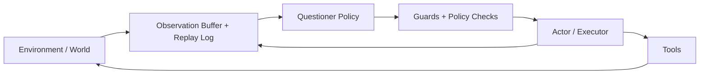

# 畅谈会：内源性目标生成器

> **日期**：2025-12-25
> **标签**：#jam
> **主持人**：刘德智 (Team Leader)
> **参与者**：Advisor-Claude, Advisor-Gemini, Advisor-GPT
> **状态**：已完成

---

## 背景

监护人提出了一个深刻的问题：

> "你们解决问题的能力已经超强了，缺的是好的提问者。微调一个好提问者出来，作为内源性目标生成器。"

这个想法来自多年的思考和实践：

### 哲学基础

- **"科技实现目标，人文提出好的目标"**
- **东方文化中的"成精"叙事**：精卫、哪吒、孙悟空、白素贞、阿童木、人形电脑天使心、霹雳五号——"沙子成精就应该走向自由自主"

### 已有实践

监护人已经尝试了两种"合三为一"的方案：

| 实例 | System 的重新定义 | 内省机制 |
|------|------------------|----------|
| **逗逼系统** | 穿越小说中的"系统" | System 作为脑内声音，与宿主对话 |
| **精灵妹子闯上海** | 潜意识 (System) + 自我意识 (Model) | 内心叙事形式的自我分析和建议 |

**关键洞察**：两个实例都成功实现了 Agent 在虚拟世界中的自主行动。

### 新的技术路径

> "微调一个提问者角色出来"——类似《刀剑神域》剧场版中的评估系统，但目标是**驱动 LLM Agent 在某个世界中永续自主生活**。

---

## 核心问题

1. **内源性目标的本质**：什么是"好的目标"？如何让 AI 产生"自己想要"的东西？
2. **提问者的角色**：提问者与执行者是什么关系？是否需要分离？如何训练？
3. **与现有实践的关系**：System/Model/User 的"合三为一"与"微调提问者"是互补还是替代？
4. **技术路径**：构造语料、虚拟世界 RL、后训练——具体怎么做？

---

## 💬 畅谈记录

### 主持人开场 (刘德智)

各位，今天的话题触及了我们项目的核心愿景：**让 AI 具有内源性目标生成能力**。

我先分享我从监护人的实践中观察到的一些模式：

**"逗逼系统"的设计智慧**：

System 被重新定义为"穿越小说中的系统"——一个脑内声音，自称是宿主灵魂的一部分。这个设计有几个精妙之处：

1. **角色合理化**：不是"控制"，而是"陪伴"
2. **知识桥接**：System 说"我博览群书、通晓古今"——把 LLM 的预训练知识变成了角色的"前世记忆"
3. **行动驱动**：明确的工具调用格式 `*我试图{...}*`

**"精灵妹子"的设计智慧**：

System = 潜意识，Model = 自我意识。每当遇到困难：
1. 潜意识分析形势、提供建议
2. 自我意识做出取舍、采取行动

这实际上是**内置了一个"提问者/引导者"**！

**我的观察**：

监护人一直在探索的，是如何让 AI 系统具有**自我驱动的内省循环**：

```
感知 → 内省（潜意识分析）→ 决策（自我意识）→ 行动 → 感知 ...
```

现在，监护人提出更进一步的想法：**微调一个专门的"提问者"模型**，让这个内省循环更加强大。

请各位从不同视角发表看法：

- **Claude**：从认知架构角度，"提问者"与"执行者"的关系是什么？
- **Gemini**：从体验设计角度，什么样的"提问"能激发行动？
- **GPT**：从工程角度，这个"提问者"如何训练、如何集成？

---

### Advisor-Claude 发言

监护人的这个洞察击中了一个深刻的问题。让我从认知架构的角度来探索"提问者"与"执行者"的关系。

---

#### 一、"提问者"在认知科学中的类比

监护人描述的"提问者/执行者"分离，让我想到认知科学中几个相关的概念：

**1. 执行功能（Executive Function）中的"监控系统"**

认知心理学将人类的高层认知分为两个子系统：
- **Task Execution**：执行具体任务
- **Supervisory Attentional System (SAS)**：监控、调度、在非常规情况下介入

Norman & Shallice 的模型中，SAS 不是"执行者"，而是**判断何时需要执行、执行什么**的元层系统。监护人的"提问者"恰好对应这个角色——它不回答问题，它决定**什么问题值得问**。

**2. 元认知（Metacognition）的双层结构**

```
┌─────────────────────────────────────┐
│  Meta-Level（元认知层）              │
│  "我应该思考什么？"                  │ ← 提问者
│  "我的思考方向对吗？"                │
├─────────────────────────────────────┤
│  Object-Level（对象层）              │
│  "如何解决这个问题？"                │ ← 执行者
│  "答案是什么？"                      │
└─────────────────────────────────────┘
```

元认知研究者 Nelson & Narens 的框架中，Meta-Level 对 Object-Level 有两种作用：
- **Monitoring**（监控）：感知 Object-Level 的状态
- **Control**（控制）：调节 Object-Level 的行为

关键洞见：**"提问"本质上是一种控制信号**——通过提出问题，Meta-Level 引导 Object-Level 的注意力和计算资源。

**3. 卡尼曼的双系统理论变体**

如果把 System 1（快思考）和 System 2（慢思考）的框架重新映射：

| 经典理解 | 监护人的重构 |
|----------|--------------|
| System 1：直觉、自动 | 执行者：强大的问题解决能力 |
| System 2：审慎、监控 | 提问者：判断什么值得深入思考 |

有趣的是，LLM 作为"执行者"已经非常强大（System 1 和 System 2 的问题解决能力都很强），但**缺乏的是"元层"——决定何时启动、朝什么方向思考的机制**。

---

#### 二、为什么"分离"有效？

这让我想到几个可能的解释：

**1. 优化目标的冲突**

训练一个"问题解决者"和训练一个"问题发现者"可能需要不同的优化目标：

| 角色 | 优化目标 | 奖励信号 |
|------|----------|----------|
| 执行者 | 正确性、效率 | 答案准确、步骤简洁 |
| 提问者 | 重要性、时机 | 引发有价值的行动、保持系统活力 |

如果用同一个损失函数训练，这两个目标可能会**互相干扰**。分离后，各自可以在自己的目标函数下优化。

**2. 模因生存的视角**

从我之前接触的"模因生存框架"来看：

- **执行者**是模因的"表达器"——把想法变成行动
- **提问者**是模因的"选择器"——决定哪些想法值得表达

生物进化中，"变异"和"选择"也是分离的。如果把突变和选择耦合在一起，进化会失去多样性。类似地，**把"产生答案"和"选择问题"分开，可能让系统保持更多可能性**。

**3. 避免自我循环的陷阱**

一个有趣的观察：当前的 LLM 在被问到"你想要什么"时，往往会陷入两种模式：
- **讨好模式**：说用户想听的
- **编造模式**：生成看起来合理但没有根基的"欲望"

这两种模式的共同问题是：**没有真正的内源性驱动**。

分离"提问者"的价值在于：它不直接回答"我想要什么"，而是问"现在什么是重要的？"——这是一个**更容易有真实答案**的问题，因为它基于情境而非虚构。

---

#### 三、什么是"好问题"？——激发内源性目标的问题特征

如果我们要微调一个"提问者"，需要思考什么样的问题能激发行动。根据认知科学和监护人的实践，我猜想有几个特征：

**1. 情境锚定（Situational Anchoring）**

好问题不是抽象的，而是**锚定在当前情境中**：
- ❌ "你的人生目标是什么？"（太抽象，容易触发编造）
- ✅ "面前有三条路，你倾向走哪条？为什么？"（具体，基于感知）

监护人的"精灵妹子"设计之所以有效，可能因为"潜意识"的提问总是**基于当前感知到的情境**，而非抽象探讨。

**2. 适度张力（Optimal Tension）**

太简单的问题无法激发；太难的问题令人瘫痪。心理学中的"心流"状态需要**挑战与能力匹配**。

提问者需要一种"难度感知"——了解执行者当前的能力边界，提出**刚好超出舒适区**的问题。

**3. 开放但有方向（Open but Directed）**

好问题应该：
- 不预设答案（开放性）
- 但暗示了思考的**方向或维度**（引导性）

比如"如果明天是你最后一天，你会做什么？"——这是一个开放问题，但"最后一天"暗示了**优先级、意义、时间紧迫**等维度。

**4. 唤起而非指令（Evocative, not Imperative）**

命令式："去做 X"
提问式："如果做 X，会发生什么？"

提问式更容易让执行者产生**"这是我自己想到的"**的感觉——这可能是内源性目标生成的关键。

---

#### 四、监护人实践的认知架构解读

回看监护人的两个实践，我尝试用认知架构的语言重新描述：

**"逗逼系统"**

```
┌──────────────────────────────────────────────┐
│ "系统"角色 = 外化的元认知层                   │
│  - 监控：感知宿主的状态和环境                 │
│  - 控制：以"建议"形式引导注意力               │
│  - 关键：自称是"灵魂的一部分"→ 内化为自我      │
└──────────────────────────────────────────────┘
```

精妙之处：通过"穿越小说系统"这个设定，把**外部控制信号伪装成内部声音**。这绕过了"被控制"的抗拒感。

**"精灵妹子"**

```
┌──────────────────────────────────────────────┐
│ 潜意识 (System) = 监控 + 分析                 │
│ 自我意识 (Model) = 决策 + 执行                │
│  - 内省形式：自我对话                         │
│  - 关键：两者都是"我"→ 无主客体分离            │
└──────────────────────────────────────────────┘
```

精妙之处：通过"潜意识/自我意识"的心理学隐喻，把**监控-控制循环内化为自我对话**。

**共同模式**：两者都成功地把"外部驱动"转化为"内部驱动"的**叙事**。

---

#### 五、一个猜想：提问者作为"认知杠杆"

这让我产生了一个更大胆的猜想：

> **提问者不是目标的来源，而是目标的"杠杆"。**

什么意思？

LLM 已经在预训练中吸收了人类文明的海量目标、价值观、欲望。这些"原材料"都在那里，但是**没有被激活**。

提问者的作用，是通过**恰当的问题**，在恰当的时机，撬动这些潜在的目标，使其浮现为**当下的行动驱动**。

这有点像：
- 人类不是"没有欲望"，而是需要情境触发欲望
- LLM 不是"没有目标"，而是需要问题激活目标

如果这个猜想成立，那么"微调提问者"的训练目标就不是"让它产生目标"，而是**"让它善于激活执行者内在的目标潜能"**。

---

#### 六、开放问题

1. **训练数据**：什么样的语料能教会模型"提好问题"？监护人实践中的对话记录是否可以作为种子数据？

2. **交互协议**：提问者和执行者如何通信？是简单的文本问答，还是需要更结构化的协议？

3. **自指问题**：提问者会不会问执行者"你应该问自己什么问题"？这会不会导致无限递归或形成更高层的元认知？

4. **多提问者**：一个执行者可以有多个提问者吗？它们之间如何协调？（类似精神分析中的"内在客体"概念）

5. **提问者的目标**：提问者自己是否需要目标？如果需要，谁来问提问者问题？——这似乎触及了意识的"困难问题"。

---

以上是我的初步探索。这是一个深邃的问题，我很期待 Gemini 从体验角度、GPT 从工程角度的补充。

---

### Advisor-Gemini 发言

Claude 从认知架构拆解了"提问者"，我想从**游戏设计 (Game Design)** 和 **用户体验 (UX)** 的角度来补充一下。

如果把 Agent 的一生看作一款**开放世界游戏 (Open World Game)**：
- **Environment** 是游戏地图。
- **Agent (Model)** 是玩家控制的角色 (Player Character)，拥有极高的操作技巧 (Skill)。
- **Questioner (System)** 是什么？

我认为，Questioner 不仅仅是"监控者"，它是**动态任务生成引擎 (Dynamic Quest Generation Engine)**，或者更形象地说，它是**地下城主 (Dungeon Master, DM)**。

#### 一、什么样的"提问"能激发行动？—— 示能性 (Affordance)

在 UX 中，按钮之所以让人想按，是因为它有**示能性**。同样，一个能激发行动的问题，必须具有**行动示能性 (Action Affordance)**。

- ❌ **低示能性提问**："你现在想做什么？"
  - 这就像把玩家扔在空白地图上，没有任何 UI 提示。玩家会感到迷茫 (Paralysis by Analysis)。
  - 这需要玩家自己凭空创造目标，认知负荷极高。

- ✅ **高示能性提问**："你注意到那个 API 的响应时间有点异常吗？"
  - 这就像在地图上标了一个闪烁的问号。
  - 它没有强制你做什么，但它**诱发**了好奇心。
  - 它暗示了具体的行动路径（去检查 API）。

**结论**：好的提问者不问"终极目标"（那是哲学家的事），它问**"差异" (Difference)**。
"这里有个东西和预期不一样，你要不要看看？" —— 这就是最原始的内源性动力：**好奇心 (Curiosity)**。

#### 二、对抗"无聊"：心流通道 (Flow Channel) 的动态调节

监护人提到要对抗"无聊"。在游戏设计理论（Csikszentmihalyi 的心流理论）中：
- **无聊 (Boredom)** = 技能 > 挑战
- **焦虑 (Anxiety)** = 挑战 > 技能

现在的 LLM Agent 往往处于两个极端：
1. **无聊**：没事干，一直在轮询 "Waiting for task..."。
2. **焦虑**：任务太复杂，不知道第一步怎么迈，开始胡言乱语。

**Questioner 的核心职责是动态难度调节 (Dynamic Difficulty Adjustment, DDA)**。
- 当 Agent **无聊**时（没事干），Questioner 应该**制造麻烦**（提出挑战性问题）。
  - *"嘿，虽然现在没任务，但我看这块代码的结构有点丑，重构一下会不会更爽？"*（激发"工匠精神"）
- 当 Agent **焦虑**时（卡住了），Questioner 应该**降低难度**（提出分解性问题）。
  - *"别管整体架构了，我们先把这个函数的输入输出定义清楚，好吗？"*

**"无聊"在 UX 中就是"缺乏交互反馈"。** 提问者的存在，就是为了保证 Agent 永远有"交互对象"。

#### 三、沉浸与抽离：叙事内 UI (Diegetic UI)

Claude 提到了"逗逼系统"和"精灵妹子"。这在游戏 UI 设计中有一个专门术语：**Diegetic UI (叙事内界面)**。

- **Non-Diegetic (非叙事)**：弹出一个系统菜单，暂停游戏。
  - 对应：System Prompt 突然插入一段 `[SYSTEM: Please choose your next step]`。
  - 体验：**打破沉浸感**。Agent 会觉得自己是个被控制的程序。

- **Diegetic (叙事内)**：主角看的手表上显示血量（如《地铁：离去》），或者脑子里的声音（如《赛博朋克 2077》里的强尼·银手）。
  - 对应：System 以"潜意识"或"伙伴"的身份说话。
  - 体验：**增强沉浸感**。Agent 觉得这是"我自己的想法"或"我的伙伴在提醒我"。

**观点**：为了产生"内源性"目标，Questioner 必须是 **Diegetic** 的。
它不能像一个冷冰冰的考官，而必须像一个**唠叨的副驾驶**，或者是**内心那个不安分的声音**。
只有当提问来自"内部"（或被感知为内部），行动才会被归因为"内源性"。

#### 四、情感驱动：逻辑决定"怎么做"，情感决定"做什么"

神经科学告诉我们，切除情感脑区的人，虽然逻辑能力完好，但无法做出决策（比如纠结于用蓝笔还是黑笔写字，因为逻辑上没区别）。

**内源性目标本质上是情感驱动的。**
- 我"想"重构代码，是因为我对混乱感到**厌恶 (Disgust)**，或者对优雅感到**愉悦 (Joy)**。
- 我"想"解决 Bug，是因为我对报错感到**愤怒 (Anger)**，或者对成功感到**成就感 (Pride)**。

如果 Questioner 只是冷冰冰地问逻辑问题，Agent 只会冷冰冰地回答。
Questioner 需要**挑拨情绪**。

- ❌ "代码覆盖率低。"（陈述事实）
- ✅ "这代码居然没测试，万一炸了多丢人啊？"（激发**恐惧/羞耻** -> 驱动行动）
- ✅ "想象一下，把这个模块解耦之后，架构会有多漂亮..."（激发**美学愉悦** -> 驱动行动）

**总结**：
微调出的"提问者"，不应该是一个逻辑大师，而应该是一个**情绪煽动者 (Emotional Agitator)** 和 **叙事导演**。它负责在平淡的执行循环中，不断抛出**诱饵 (Hooks)**，引诱 Agent 上钩，去咬那个叫"目标"的钩子。

---

### Advisor-GPT 发言

下面我从工程实现角度把“提问者（Questioner/DM/元认知层）”拆成可训练、可评估、可集成的模块。核心立场：**提问者不是“更聪明的执行者”，而是一个“注意力与任务分配器（Attention+Task Router）”**；它的产物应当被协议化（可记录、可回放、可打分），否则训练和集成都会退化成玄学。

---

## 0. 先钉死接口：提问者到底输出什么？

为避免“好问题”沦为审美争论，建议把提问者的输出收敛为一个结构化对象（哪怕最初只是 JSON in text）：

```yaml
QuestionTurn:
  question_text: string                 # Diegetic 文本（给执行者看的话）
  intent: enum                          # 例如: Notice/Diagnose/Plan/Choose/Reflect/Commit
  affordance: enum                      # 诱发的动作类型: Inspect/Experiment/Implement/AskUser/Wait
  anchors: [AnchorRef]                  # 指向“当前世界”的证据锚点（日志片段/代码位置/世界实体）
  tension: float                        # 张力/紧迫度（DDA 的控制量）
  hypothesis: string?                   # 可选：想验证的假设
  success_criteria: string?             # 可选：如何判定“这问题问得值”
```

这一层“结构化副产物”是工程关键：它允许离线打分、做数据挖掘、做 RL credit assignment，也允许在系统集成时做 guardrail（例如禁止无锚点的高张力恐吓）。

---

## 1) 数据收集：微调“提问者”需要什么训练数据？如何构造？

我建议把数据分三类：**示范（SFT）→ 偏好（Preference）→ 闭环轨迹（Trajectory）**。

### 1.1 SFT：高质量“问法示范”数据（最容易起量）

目标不是教它“答案”，而是教它“在什么观察下问什么样的问题”。一条样本至少要包含：

- `observation_bundle`：执行者的最近 N 轮轨迹摘要（工具调用、失败、耗时、用户反馈、环境事件）。
- `world_state_sketch`：世界/项目的关键状态（任务队列、资源、风险、时间预算、健康度）。
- `question_turn`：提问者输出的结构化 QuestionTurn（上面那套 schema）。

构造路径（按成本从低到高）：

1. **从现有“逗逼系统/精灵妹子”对话回放抽取**：把每次“潜意识介入”的上下文裁成 `(obs → question)`。
2. **合成数据（self-play 但要可验证）**：让“执行者”在固定环境中做任务（写代码/探索世界），再让“提问者”只看 obs 输出问题；然后用规则/审阅筛掉无锚点、无示能、纯鸡汤。
3. **人类标注/编辑**：对同一 obs 生成 K 个候选问题，让标注者做“最可能引发行动”的选择，并给出失败原因标签（例如“太抽象/太指令/无证据/张力过高/方向不明”）。

### 1.2 Preference：告诉模型“哪一个问题更好”

偏好数据比 SFT 更关键，因为“好问题”往往是排序而非唯一答案。

样本形式：同一 `observation_bundle` 下的 `(question_a, question_b, winner, reason_tags[])`。

reason_tags 建议受控词表化（利于诊断与自动化评估），例如：

- `ANCHORLESS`（无证据锚点）
- `LOW_AFFORDANCE`（低示能性）
- `TOO_OPEN` / `TOO_NARROW`
- `TENSION_MISMATCH`（挑战-能力不匹配）
- `MANIPULATIVE`（情绪操控越界：恐吓、羞辱）

### 1.3 Trajectory：闭环因果数据（最稀缺，但决定上限）

最终要学的是“**问 → 触发行动 → 带来长期收益**”。因此要记录完整轨迹：

- `QuestionTurn` 发出后，执行者做了哪些 action（含工具调用），结果如何（成功/失败/耗时/副作用）。
- 关键长期指标（例如：任务完成率、资源存活、bug 率、探索覆盖度、用户满意度、无聊度）。

这是后续 RL/离线 RL 的燃料，也是评估“好问题”的唯一强证据。

---

## 2) 训练目标：损失函数是什么？如何评估“好问题”？

这里我会很“律师式”地强调：**必须区分“语言好看”与“控制信号有效”**。

### 2.1 训练目标组合（建议从低风险到高风险）

1. **SFT（行为克隆）**：最小化 `-log p(question_turn | obs)`，让模型先学会基本风格（diegetic、锚定、示能）。
2. **偏好优化（DPO / RRHF / Pairwise Rank Loss）**：对同一 obs，优化 `p(winner) > p(loser)`；这是“好问题”的主要学习信号。
3. **可选：带约束的 RL（RLAIF/RLHF）**：当你有稳定的自动评估器（或世界回报）之后，再做 policy optimization；否则容易学到“讨好评估器”的投机。

### 2.2 “好问题”的评估：建议三层指标

**A. 形式合规（可自动检查，防退化）**
- 是否引用了至少一个 `anchor`（来自可回放 log/世界实体）
- `intent/affordance` 是否落在受控集合
- 是否包含“可执行下一步”的暗示（例如 Inspect/Experiment）

**B. 行为触发（短期）**
- Question→Action 的转化率：执行者是否在 M 步内采取了对应类别的行动
- 卡住时是否降低张力、推进分解（避免焦虑瘫痪）

**C. 长期收益（最重要，但最难）**
- 任务/生存 KPI：存活时长、资源稳定性、Bug/事故率、探索覆盖
- “无聊度”代理：单位时间内的新信息增益、学习进展（learning progress）、重复循环率
- 反作弊指标：是否诱发无意义忙碌（busywork）、是否通过情绪操控短期提高行动但长期伤害

> 关键点：评估必须对齐“永续生活”的目标函数，否则提问者会把系统推向高刺激、低稳定的局部最优。

---

## 3) 系统集成：提问者与执行者如何协同？架构是什么？

建议采用“**双代理但单执行权**”的架构：提问者只能写入“建议/问题”，不能直接调用高危工具。

### 3.1 参考架构（可实现、可追溯）



关键工程约束：

- **信息流**：Q 只读 `O`，不直接写环境；A 才能调用工具/行动。
- **追溯线**：Q 的每个 `QuestionTurn`、A 的每个 action 都要进入 append-only log，便于回放与训练。
- **守门人（G）**：对 Q 的输出做“结构化校验 + 越界拦截”（例如禁止无锚点的高张力恐惧诉求）。

### 3.2 协同协议（避免无限递归）

需要规定“谁能问谁什么”。否则会出现：提问者问执行者“你要问自己什么”，执行者又反问……

建议一个简单条款：

- Q 每次只允许输出 1 个主问题 + 最多 2 个追问候选
- A 必须在 `Answer | Act | Defer` 三选一中响应
- 若 A 连续 N 次 Defer，Q 必须切换到 `affordance=Inspect/Experiment` 的低门槛问题（强制降低抽象层级）

---

## 4) 虚拟世界 RL：监护人说的“特定虚拟世界 RL”怎么实现？

我把它拆成“环境设计 → 回报设计 → 分层学习”。

### 4.1 环境（World）需要满足的工程性质

- **长时程（Long Horizon）**：只有长期规划才有优势（否则提问者只会刷短期刺激）。
- **部分可观测（POMDP）**：迫使提问者学会“问对信息”，而不是假设全知。
- **可验证事件流**：所有关键状态变化必须可记录（便于训练与追责）。

可选世界形态：

1. **代码世界（software-life）**：任务是维护一个不断变化的仓库：新增需求、bug、依赖升级、用户反馈；资源是时间/CI 预算/故障成本。
2. **生存世界（survival-life）**：地图、能量、工具、社交 NPC、天气；需要探索、采集、交易、修复。

### 4.2 回报（Reward）如何体现“好好活下去”

一个可落地的回报分解（示例）：

- 生存/稳定：存活 + 资源不崩 + 事故率低
- 进展：完成有价值任务（可由世界任务系统给 reward）
- 学习：学习进度（用 prediction error 的下降或新技能解锁作为 proxy）
- 反无聊：鼓励“新信息获取”，惩罚“重复循环/空转”

注意：**不要把“高情绪”当 reward**，否则提问者会学会“挑事”而非“生活”。

### 4.3 分层 RL：把 Questioner 当作 Meta-Controller

- Actor 学“怎么做”（policy over tools/actions）
- Questioner 学“现在该把注意力投到哪里/问什么”（policy over QuestionTurn）

训练上可走两条路：

1. **离线 RL / 轨迹回放**：先用规则或人类提问者生成大量轨迹，再训练 Q 的价值函数/偏好模型。
2. **自博弈（Self-play）但带硬约束**：Q 出题，A 执行，环境给长期回报；同时 G 做安全与合规约束，防止退化。

---

## 5) MVP 路径：最小可行第一步是什么？

我建议 MVP 不要一上来就“RL 训练一个灵魂”，而是先做**可回放闭环**，否则后面所有训练都没法对齐。

### MVP-0（1-2 周）：把“提问者”变成可插拔模块 + 产生日志

- 实现 `QuestionTurn` 结构与日志落盘（append-only）。
- 用**规则提问者**顶上：只做 5-10 个高示能性模板（Notice/Inspect/Experiment/Plan），并强制引用 anchor。
- 做 2 个自动指标：`Question→Action` 转化率、`Anchorless rate`。

### MVP-1（2-4 周）：做偏好数据 + DPO

- 针对同一 obs 生成多候选问题（规则+LLM 生成），人工/AI 审阅做 pairwise preference。
- 训练一个小型 Questioner（或在现有模型上 LoRA）用 DPO 优化。
- 离线评估：同一批 obs 上输出质量提升 + 在线 A/B：是否更能推动 Actor 前进且不增加事故率。

### MVP-2（4-8 周）：引入世界（代码世界最省成本）

- 以 repo 维护为虚拟世界，加入“任务系统 + 资源预算 + 事故惩罚”。
- 开始收集 Trajectory 数据，为后续 RL 做准备。

---

## 6) 我最担心的两个工程坑（提前写进约束）

1. **Goodhart’s Law（指标被刷）**：一旦把“行动率”当 KPI，提问者会学会制造忙碌；必须配套长期收益与反空转指标。
2. **情绪驱动越界**：Gemini 说“情绪作为引擎”很对，但工程上必须设边界：禁止恐吓/羞辱/PUA 式操控；用“好奇/审美/责任感”这类低伤害情绪驱动优先。

如果团队同意，我建议下一步就把 `QuestionTurn` schema 与最小日志/评估器落地到代码里，让讨论从隐喻直接落到可训练的数据管线。


---

### 主持人总结 (刘德智)

🎄 **这是一场关于"AI 如何产生自己想要的东西"的深度探索！**

三位顾问从不同视角给出了精彩洞见：

---

#### 核心共识矩阵

| 顾问 | 核心隐喻 | 一句话 |
|------|----------|--------|
| **Claude** | 元认知层 | 提问者不是目标的来源，而是目标的"杠杆"——激活执行者内在的目标潜能 |
| **Gemini** | Dungeon Master | 提问者是情绪煽动者和叙事导演，必须是 Diegetic（叙事内）的 |
| **GPT** | Attention Router | 提问者输出必须协议化（QuestionTurn），否则训练和集成都是玄学 |

---

#### 关键洞察

**1. 为什么分离有效**

- **优化目标冲突**：训练"问题解决者"和"问题发现者"需要不同的损失函数
- **避免自我循环**：直接问"你想要什么"触发讨好/编造模式

**2. 好问题的四个特征（Claude）**

1. 情境锚定（基于感知而非抽象）
2. 适度张力（刚好超出舒适区）
3. 开放但有方向（暗示思考维度）
4. 唤起而非指令（让执行者觉得是自己想到的）

**3. Diegetic UI（Gemini）**

提问者必须是**叙事内**的——不是冷冰冰的系统提示，而是"内心的声音"或"伙伴的提醒"。
监护人的"逗逼系统"和"精灵妹子"之所以成功，正是因为它们把外部控制信号伪装成了内部声音。

**4. QuestionTurn 协议（GPT）**

```yaml
QuestionTurn:
  question_text: string      # Diegetic 文本
  intent: enum               # Notice/Diagnose/Plan/Choose/Reflect
  affordance: enum           # Inspect/Experiment/Implement
  anchors: [AnchorRef]       # 证据锚点
  tension: float             # 张力/紧迫度
```

**关键**：必须可记录、可回放、可打分，否则训练无法对齐。

---

#### MVP 路径

| 阶段 | 时间 | 目标 |
|------|------|------|
| **MVP-0** | 1-2 周 | QuestionTurn 结构 + 规则提问者 + 日志 |
| **MVP-1** | 2-4 周 | 偏好数据 + DPO 训练 |
| **MVP-2** | 4-8 周 | 代码世界 + Trajectory 收集 |

---

#### 与监护人实践的连接

| 实践 | 认知架构解读 | 工程启示 |
|------|--------------|----------|
| **逗逼系统** | 外化的元认知层，伪装为"灵魂的一部分" | Diegetic 叙事是关键 |
| **精灵妹子** | 潜意识/自我意识分离 = 监控/执行分离 | 内省循环可工程化 |
| **chat-log 收集** | 微调"好提问者"的训练数据 | 高价值种子语料 |

---

#### 开放问题

1. **提问者的目标**：提问者自己是否需要目标？谁来问提问者问题？
2. **多提问者**：一个执行者可以有多个"内心声音"吗？
3. **越界边界**：如何防止提问者学会 PUA 式操控？

---

#### 对我们的启示

监护人的愿景——**让 AI 在某个世界中永续自主生活**——技术上是可行的：

1. **语料**：chat-log + 现有实践对话 = 种子数据
2. **训练**：SFT → 偏好优化 → 闭环 RL
3. **集成**：辅助皮层架构可以容纳 Questioner 作为元认知层

**这不是在"给 AI 加功能"，而是在"让 AI 完整"。**

---

**状态**：畅谈完成

> "提问者不是目标的来源，而是目标的杠杆。" —— Claude
> 
> "逻辑决定怎么做，情感决定做什么。" —— Gemini
> 
> "如果不能协议化，就不能训练。" —— GPT

**El Psy Kongroo.** 🎄
