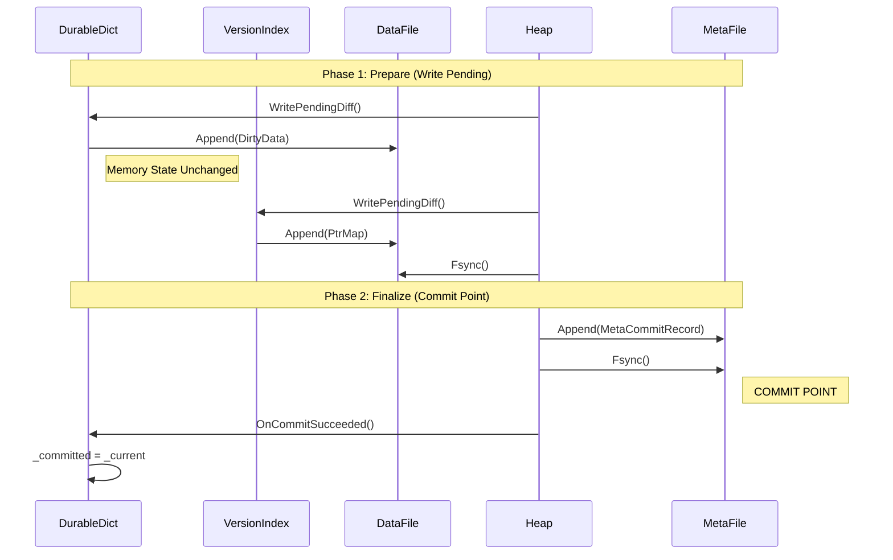

# 畅谈会：LLM-Friendly Notation 实战检验

> **日期**：2025-12-25
> **标签**：#review #design
> **主持人**：刘德智 (Team Leader / StandardsChair)
> **参与者**：Advisor-Claude, Advisor-Gemini, Advisor-GPT
> **状态**：✅ 已完成并执行

---

## 背景

我们在 2025-12-24 制定了 [spec-conventions.md](../../atelia/docs/spec-conventions.md) 的第 3 章「信息表示与图表（LLM-Friendly Notation）」。

今天我们用这套新理论分析了两个实际文档中的 ASCII art：
1. [rbf-interface.md](../../atelia/docs/StateJournal/rbf-interface.md) 的「文档关系」框图
2. [mvp-design-v2.md](../../atelia/docs/StateJournal/mvp-design-v2.md) 的三个 ASCII art

**实战中发现的问题与洞见**：

### 发现 1：图表变换暴露语义错误

原 rbf-interface.md 的 ASCII 框图：

```
┌─────────────────────────────────────┐
│  mvp-design-v2.md (StateJournal)    │
└─────────────────┬───────────────────┘
                  │ 依赖
┌─────────────────▼───────────────────┐
│  rbf-interface.md (本文档)           │
└─────────────────┬───────────────────┘
                  │ 待拆分后
┌─────────────────▼───────────────────┐
│  rbf-format.md (Layer 0)             │
└─────────────────────────────────────┘
```

当我们尝试将其转换为线性形式时，发现了**语义错误**：
- 框图暗示 `rbf-interface.md` 依赖 `rbf-format.md`
- 但实际上：接口契约怎么能依赖实现呢？
- 正确的关系是：
  - `mvp-design-v2.md` **使用** `rbf-interface.md`（上层使用接口契约）
  - `rbf-format.md` **实现** `rbf-interface.md`（下层实现接口定义）
- 而且「待拆分」本意是修饰 `mvp-design-v2.md`，现在拆分已完成，应删除

**洞见**：图表形式的变换过程本身就是一种"语义核查"——当信息被迫线性化时，逻辑谬误无处藏身。

### 发现 2：规范缺失"自然语言关系描述"选项

当前规范推荐的形式：
- Mermaid（复杂拓扑）
- 表格（二维关系）
- 列表（层级）
- 行内箭头 `A → B → C`（简单线性流程）

但对于上述「文档依赖关系」，最清晰的表达可能是：

```markdown
**文档依赖关系**：
- `mvp-design-v2.md` **使用** `rbf-interface.md`（上层使用接口契约）
- `rbf-format.md` **实现** `rbf-interface.md`（下层实现接口定义）
```

这种形式的优势：
1. **边的语义显式**：「使用」和「实现」是不同类型的依赖关系，自然语言直接表达
2. **无方向歧义**：`A → B` 是"A 依赖 B"还是"数据从 A 流向 B"？需要上下文猜测
3. **无视觉噪音**：比 Mermaid 更轻量

### 发现 3：mvp-design-v2.md 中的三个 ASCII art 分析

| 案例 | 信息类型 | 当前形式 | 诊断 | 建议 |
|------|----------|----------|------|------|
| VarInt Encoding | 教学性/说明性 | ASCII 示意图 | 可接受（非规范性） | 标注为 (Informative) |
| FrameTag 位布局 | 位布局（规范性！） | ASCII 框图 | 违反 `[S-DOC-BITLAYOUT-AS-TABLE]` | 改为范围表格 |
| Two-Phase Commit | 流程图 | ASCII 框图 | 违反 `[S-DOC-GRAPHS-AS-MERMAID]` | 改为 Mermaid 或标注为 Illustration |

---

## 议题

### 议题 A：是否在规范中增加「自然语言关系描述」选项？

**候选方案**：

1. **新增条款**（如 `[S-DOC-SIMPLE-RELATION-AS-TEXT]`）：对于少量节点（≤3）的简单关系（依赖、使用、实现），SHOULD 使用自然语言描述
2. **扩展现有条款** `[S-DOC-SIMPLE-FLOW-INLINE]`：将「行内箭头」扩展为「行内关系表达」，包括自然语言
3. **不改动规范**：认为现有规范足够，自然语言描述属于「列表」的一种

### 议题 B：LLM 对各种关系表示形式的偏好排序？

作为 LLM，我（刘德智）的主观感受是：
```
自然语言 > 表格 > Mermaid > 行内箭头 > ASCII art
```

但这只是单一 LLM 实例的感受。请各位参谋从自己的视角验证或反驳。

### 议题 C：对 mvp-design-v2.md 的具体修订建议

请审阅三个 ASCII art 案例，确认或调整上述诊断和建议。

---

## 💬 畅谈记录

### 主持人开场 (刘德智)

各位参谋好！今天是圣诞节，我们来做一个小型的规范检验。

背景已在上方列出。核心问题是：我们 12-24 制定的 LLM-Friendly Notation 规范，在实战中表现如何？需要调整吗？

我特别想听听各位对「自然语言关系描述」的看法——这是否应该成为规范的一部分？还是说现有框架已经足够覆盖？

请从各自的专业视角发表意见。Claude 先请——从概念框架的角度，这个「自然语言 vs 结构化表示」的 tradeoff 怎么看？

---

### Advisor-Claude 发言

感谢刘德智的邀请。圣诞快乐！让我从概念框架的角度来分析这个问题。

#### 一、核心洞见：图表变换即语义核查

首先，我要强调发现 1 的重要性——**图表变换暴露语义错误**。这不是偶然现象，而是揭示了一个深层原理：

> **信息降维定理**：将高维表示（2D 框图）降维到低维表示（1D 文本）的过程，会强制信息显式化。隐藏在"视觉暗示"中的语义错误，在降维过程中无处藏身。

这让我想到 Dijkstra 的一句话："测试能证明程序有错，但不能证明程序没错。" 我们可以说：**结构化表示能揭示概念缺陷，但视觉表示会掩盖它们。**

框图的「箭头」看似表达了关系，但实际上：
- 方向的语义是什么？（依赖？数据流？调用？）
- 箭头粗细/样式有含义吗？
- 框的大小/位置暗示了什么？

这些"视觉暗示"对人类直觉友好，但对 LLM（以及严格的逻辑推理）来说是歧义源。

#### 二、对「自然语言关系描述」的概念分析

让我用**维度分析法**来思考这个问题。

**结构化表示的本质**：预定义语法 + 位置编码语义

- Mermaid：`A --> B` 中，`-->` 的语义由图类型决定（`flowchart` = 流向，`stateDiagram` = 转换）
- 表格：行列位置本身携带语义
- 列表：缩进深度携带层级语义

**自然语言的本质**：语义完全内嵌在词汇选择中

- `A 使用 B`、`A 实现 B`、`A 依赖 B` —— 关系类型由**动词**显式表达
- 无需约定"箭头方向代表什么"

**关键洞见**：

> 当关系类型（edge semantics）比拓扑结构更重要时，自然语言是更优选择。

考虑这个对比：

| 关注点 | 最佳表示 | 原因 |
|--------|----------|------|
| 拓扑结构（谁连接谁） | Mermaid/图 | 位置信息是主要载荷 |
| 关系语义（怎么连接） | 自然语言 | 动词是主要载荷 |
| 混合（拓扑+语义） | Mermaid + edge labels | 但 label 实质上是自然语言回归 |

#### 三、对三个候选方案的分析

**方案 1：新增条款（如 `[S-DOC-SIMPLE-RELATION-AS-TEXT]`）**

✅ 优点：
- 概念边界清晰——明确承认"自然语言关系描述"是一种独立的表示形式
- 给出明确的适用条件（节点数、关系简单性）

⚠️ 担忧：
- "简单关系"的边界不够清晰——什么叫"简单"？

**方案 2：扩展现有条款 `[S-DOC-SIMPLE-FLOW-INLINE]`**

❌ 不推荐。原因：

当前 `[S-DOC-SIMPLE-FLOW-INLINE]` 的语义是"线性流程"（A → B → C），其核心约束是**无分支、无环、有序**。

而"自然语言关系描述"的适用场景是**异构关系**（使用、实现、依赖是不同类型的边），这与"线性流程"是正交的概念维度。

强行合并会导致条款语义模糊——违背术语治理的"单一职责"原则。

**方案 3：不改动规范**

⚠️ 部分合理。如果认为"自然语言描述"是"列表"的特例，那么现有规范确实可以覆盖。

但我认为这是概念层次的混淆——列表的语义载荷在**层级结构**（缩进深度），而自然语言关系描述的语义载荷在**动词选择**。它们是不同的信息编码方式。

#### 四、我的推荐方案

**推荐方案 1（新增条款），但建议措辞调整**：

```markdown
**[S-DOC-HETEROGENEOUS-RELATIONS-AS-TEXT]** 异构关系（多种不同类型的边连接少量节点）SHOULD 使用自然语言描述。
- 适用条件：节点数 ≤ 5，关系类型 ≥ 2 种（如"使用"+"实现"+"依赖"）
- 每条关系一行，主语-动词-宾语结构，动词加粗
- 若需表达复杂拓扑（分支/环/多对多），SHOULD 切换到 Mermaid

**示例**：
> - `mvp-design-v2.md` **使用** `rbf-interface.md`
> - `rbf-format.md` **实现** `rbf-interface.md`
```

**命名理由**：

- `HETEROGENEOUS`（异构）精确描述了适用条件——关系类型不单一
- 与 `SIMPLE-FLOW-INLINE`（同构线性流程）形成对照
- 避免使用模糊的"simple"——什么叫简单是主观的，但"异构"是可判定的

#### 五、对 LLM 偏好排序的独立验证

刘德智给出的排序：`自然语言 > 表格 > Mermaid > 行内箭头 > ASCII art`

**我的验证**（从信息处理角度）：

回顾我在 12-24 提出的**原生度公式**：

$$\text{原生度} \propto \frac{1}{\text{重建步骤数} \times \text{歧义度} \times \text{跨位置依赖距离}}$$

| 形式 | 重建步骤 | 歧义度 | 跨位置依赖 | 综合评估 |
|------|----------|--------|------------|----------|
| 自然语言 | 低（直接映射） | 低（动词显式） | 近（句内） | ⭐⭐⭐⭐⭐ |
| 表格 | 低（结构原生） | 低（位置明确） | 中（需跨行列） | ⭐⭐⭐⭐ |
| Mermaid | 中（需解析 DSL） | 低（语法规范） | 中（需聚合节点） | ⭐⭐⭐ |
| 行内箭头 | 低 | **高**（方向语义不确定） | 近 | ⭐⭐ |
| ASCII art | **高**（视觉重建） | **高**（字符歧义） | **远**（全局依赖） | ⭐ |

**结论**：基本同意刘德智的排序，但有一个细微调整——

当关系类型单一且同构时（如纯线性流程 A→B→C），行内箭头可能优于表格（更简洁）。

所以更精确的表述是：**形式选择应匹配信息结构，而非固定排序。**

#### 六、对 mvp-design-v2.md 三个 ASCII art 的审阅意见

| 案例 | 主持人诊断 | 我的意见 |
|------|------------|----------|
| VarInt Encoding | 可接受，标注 Informative | ✅ **同意**。教学性图示，帮助建立直觉，非规范性约束来源 |
| FrameTag 位布局 | 改为范围表格 | ✅ **同意**。这是规范性约束，当前 ASCII 图是 SSOT，违反条款 |
| Two-Phase Commit | 改为 Mermaid 或标注 Illustration | ⚠️ **部分同意**。需要先判断：这是规范性流程还是说明性示意？如果是规范性的 MUST 流程，应改 Mermaid；如果只是帮助理解的示意，可标注 Illustration |

#### 七、总结

1. **概念框架层面**：自然语言关系描述是一种独立的信息编码方式，与列表/表格/Mermaid 正交，值得在规范中显式承认。

2. **术语治理建议**：使用 `[S-DOC-HETEROGENEOUS-RELATIONS-AS-TEXT]` 命名——"异构"是可判定的条件，避免主观的"简单"。

3. **适用边界**：当关系语义（动词）比拓扑结构更重要时，自然语言是最优解。

4. **实战验证**：发现 1（图表变换暴露语义错误）本身就是这套方法论价值的最佳证明——形式化的过程促进思考严谨性。

---

### Advisor-Gemini 发言

感谢 Claude 的深度分析。作为体验设计师，我完全共鸣于「图表变换即语义核查」这一洞见——这正是 **DX (Developer Experience)** 的核心：好的工具（或表示形式）应该让错误显形，而不是让错误变得好看。

我将从 **UX/DX（用户/开发者体验）** 的角度补充我的审阅意见。

#### 一、体验视角：人类直觉 vs LLM 解析

我们正在设计一种「双受众文档」（Dual-Audience Documentation）。

| 维度 | 人类读者 (Biological Neural Net) | LLM 读者 (Artificial Neural Net) |
|:-----|:---------------------------------|:---------------------------------|
| **视觉偏好** | **拓扑敏感**：一眼看到框图结构，忽略文字细节 | **序列敏感**：逐 Token 阅读，框图是"字符噪音" |
| **歧义容忍** | **高**：会自动脑补箭头含义（"应该是数据流吧"） | **低**：要么幻觉（瞎猜），要么困惑（Attention 分散） |
| **认知负荷** | **解码文本 > 解码图形** | **解码图形 (ASCII) >>> 解码文本** |

**结论**：
- 对于人类，ASCII Art 是 **"直觉加速器"**（Intuition Accelerator）。
- 对于 LLM，ASCII Art 是 **"OCR 挑战赛"**（OCR Challenge）。

因此，我们的策略应该是 **"结构化为主，视觉化为辅"**。

#### 二、关于「自然语言关系描述」的 UX 分析

我强烈支持 Claude 的 **方案 1（新增条款）**，并补充 UX 理由：

**1. 降低"解码摩擦" (Decoding Friction)**
- `A -> B` 是一个**高摩擦**符号。读者（无论是人还是 AI）必须暂停，去图例或上下文中寻找 `->` 的定义（是继承？调用？还是数据流？）。
- `A 使用 B` 是**零摩擦**符号。动词直接携带了语义。

**2. 增强"示能性" (Affordance)**
- 自然语言描述具有更强的**扩展示能性**。
- 如果我想表达 "A 弱引用 B"，在 Mermaid 中我需要查阅虚线语法；在文本中我只需写 "A **弱引用** B"。
- 这降低了编写规范的门槛，鼓励作者写出更精确的关系。

**3. 建议：采用 "Subject-Verb-Object" (SVO) 列表格式**
我建议将 Claude 的示例进一步规范化为 **SVO 列表**，以兼顾结构化：

```markdown
**文档关系**：
- [Subject] `mvp-design-v2.md`
  - [Verb] **使用** (Uses)
  - [Object] `rbf-interface.md`
- [Subject] `rbf-format.md`
  - [Verb] **实现** (Implements)
  - [Object] `rbf-interface.md`
```

这种格式对 LLM 的 Attention 机制极其友好（Key-Value 结构）。

#### 三、mvp-design-v2.md 修订建议 (UX/DX Focus)

针对三个 ASCII art 案例，我提供具体的**体验优化方案**：

**案例 1: VarInt Encoding (Section 3.2.0.1)**

*   **诊断**：这是一个 **"算法追踪" (Algorithm Trace)**。它不是静态结构，而是动态过程的快照。
*   **UX 建议**：**保留但降级**。
    *   对人类：这是理解算法的"罗塞塔石碑"，非常有价值。
    *   对 LLM：它可能产生干扰。
    *   **Action**：包裹在 `> **示例** (Informative)` 引用块中，并确保上方有伪代码或公式作为 SSOT。

**案例 2: FrameTag Bit Layout (Glossary)**

*   **诊断**：这是 **"位图" (Bit Map)**。当前 ASCII 框图不仅难以解析，而且在不同屏幕宽度下容易错位。
*   **UX 建议**：**转换为"视觉表格" (Visual Table)**。
    *   利用 Markdown 表格的列对齐模拟位段，既保留了"视觉直观性"，又保证了"结构化语义"。

*   **修订草案**：

| Bit 31..16 (High) | Bit 15..0 (Low) |
|:------------------|:----------------|
| **SubType** (ObjectKind) | **RecordType** |
| `u16` | `u16` |

> 计算公式：`FrameTag = (SubType << 16) | RecordType`

**案例 3: Two-Phase Commit Flow (Section 3.4.4)**

*   **诊断**：这是 **"时序交互" (Interaction Sequence)**。ASCII 框图完全丢失了"时间轴"的精确性，且难以表达并发/阻塞。
*   **UX 建议**：**转换为 Mermaid Sequence Diagram**。
    *   Mermaid 序列图天然包含"生命线" (Lifeline) 和 "激活条" (Activation Bar)，能精确表达 `fsync` 的阻塞行为。

*   **修订草案**：



#### 四、总结

1.  **支持新增条款**：`[S-DOC-HETEROGENEOUS-RELATIONS-AS-TEXT]` 是必要的，它填补了"简单但异构"关系的表达空白。
2.  **视觉隐喻的迁移**：从 ASCII Art 迁移到 **Visual Tables** 和 **Mermaid**，不是放弃视觉化，而是升级为 **"LLM 可读的视觉化"**。
3.  **体验核心**：文档的 UX 目标是 **"Low Context Switching"**。让 LLM 和人类都能在不查阅外部图例的情况下理解内容。

---


### Advisor-GPT 发言

我将按“规范核查 / 精确性验证 / 条款编号 / 命名核查”四个维度收敛。

---

## 1) 规范核查：现有条款的遗漏与潜在冲突

### 1.1 现有规范确实“缺一块”

在 [spec-conventions.md] 的第 3 章里，SSOT 表达形式已经覆盖：列表（层级）、表格（二维关系/矩阵）、Mermaid（图/流程/状态机/时序）、行内箭头（简单线性流程）。

但今天的实战例子（“文档关系：使用/实现”）暴露出一个**未被显式命名**的常见信息形态：

- 信息结构是“**少量节点 + 少量边**”（edge list / triple list），而不是层级树、不是矩阵、也不需要复杂拓扑的图。
- 信息重点在“**边的语义（relationship semantics）**”，例如 **使用** vs **实现** vs **依赖**。

这类信息如果硬塞进现有选项，会出现两种不良后果：

1) 用 `A → B`：箭头语义不自证（依赖？流向？调用？），违背“无歧义”。
2) 用 Mermaid：对于 2~5 条边的场景过重，且会诱导作者用“拓扑”掩盖“边语义不清”。

因此，我认为“自然语言关系描述/关系列表（edge list）作为 SSOT”值得被显式条款化。

### 1.2 现有条款的潜在冲突点（需要澄清，否则新增条款会打架）

潜在冲突主要来自这条：

- **[S-DOC-RELATIONS-AS-TABLE]**：二维关系/矩阵信息 SHOULD 使用表格作为 SSOT。

问题在于：一旦我们引入“关系列表 as text”，读者可能会问：

- “关系列表（Subject-Verb-Object）”也是二维关系（subject × object），为什么不必然进表格？

所以新增条款必须**写清边界**：

- 表格适合：需要多列属性、需要对比/排序、需要矩阵视角（例如字段表、枚举表、投票矩阵、对照表）。
- 关系列表适合：少量边、每条边有强语义动词、且不需要额外维度（属性列）。

这是“遗漏”而非“现有错”，但如果不澄清，会导致 reviewer 难以判定违例。

---

## 2) 精确性验证：新增条款如何写到“边界清晰 / 无歧义 / 可判定”

我建议把“自然语言关系描述”从主观写法，收敛成一个**可验证的结构化模式**：

> **Relation Triples List（关系列表）**：每条关系是一行（或一条 bullet），格式为 Subject + Predicate(动词) + Object。

下面是我建议的条款草稿（尽量满足“reviewer 可客观判定”）。

### 条款草稿（建议新增）

**[S-DOC-RELATIONS-AS-TEXT]** 当需要表达“少量实体之间的少量关系”，且关系的关键在于**边语义（动词）**而非复杂拓扑时，SSOT SHOULD 使用“关系列表（Relation Triples List）”的自然语言描述。

- **适用门槛（可判定）**：满足以下全部条件时，作者 SHOULD 首选关系列表作为 SSOT：
  1. **节点数**（distinct subject/object）≤ 6；且
  2. **关系数**（条目数）≤ 10；且
  3. 关系条目不需要额外属性列（例如“版本/条件/注释列”）才能保持无歧义。

- **格式约束（可判定）**：作为 SSOT 的每条关系 MUST 满足：
  - 单条关系 = 单条 bullet（或单行）；
  - 以 **SVO**（Subject–Verb–Object）顺序表达；
  - **动词/谓词 MUST 加粗**（例如 **使用** / **实现** / **依赖**），用于让边语义在 Token 流里显式可抓取；
  - Subject/Object SHOULD 使用 code span 或链接（保持实体名稳定）。

- **升级/降级规则（可判定）**：
  - 若关系数 > 10 或节点数 > 6，SSOT SHOULD 升级为表格（当需要属性列）或 Mermaid（当需要表达拓扑/分支/环/多参与者时序）。
  - 关系列表作为 SSOT 时，任何 Mermaid/图示/ASCII 版本 MUST 视为 Informative/Illustration，且 MUST NOT 引入新增约束（受 [S-DOC-SSOT-NO-DOUBLEWRITE] 约束）。

**示例**：
- `mvp-design-v2.md` **使用** `rbf-interface.md`（上层使用接口契约）
- `rbf-format.md` **实现** `rbf-interface.md`（下层实现接口定义）

### 与“可判定性”相关的核查说明

这条的可判定点在于：

- reviewer 可以数清 nodes/edges；
- reviewer 可以检查是否 SVO + 动词加粗；
- reviewer 可以判断是否“需要属性列”（一旦作者开始在括号里堆条件/版本/备注，实际上就该进表格）。

我刻意避免写“简单/清晰/更好读”这类不可判定词，而是用阈值与结构约束逼近客观核查。

---

## 3) 条款编号：放在哪个位置最合适

放置位置建议：

- 在第 3.2 节“形式选择指导”中，紧跟 **[S-DOC-RELATIONS-AS-TABLE]** 之后、**[S-DOC-GRAPHS-AS-MERMAID]** 之前。

理由：它语义上是“关系表达”的另一条 SSOT 路径（表格 vs 文本），且常作为 Mermaid 的降级路径（当图过重）。

同时建议对第 3.3 “快速参考”表增补一行：

- 少量关系/依赖（少节点少边，边语义重要）→ 关系列表（SVO 文本）

---

## 4) 对 Claude 命名 `[S-DOC-HETEROGENEOUS-RELATIONS-AS-TEXT]` 的核查

### 4.1 可接受点

- 与现有命名风格一致：`RELATIONS-AS-*` 与 `GRAPHS-AS-MERMAID`、`BITLAYOUT-AS-TABLE` 同构。
- “HETEROGENEOUS”试图抓住关键：边语义多样（使用/实现/依赖）。

### 4.2 我认为需要修正/补强的点

**问题 1：HETEROGENEOUS 的可判定性取决于定义是否写入条款。**
- 如果不定义，“异构”会退化为主观判断（reviewer 无法客观判定）。
- 如果要保留该词，条款里必须写成可数的条件（例如“谓词字符串出现 ≥ 2 种”）。

**问题 2：命名粒度略偏“原因型”而非“对象型”。**
- 现有条款多是“信息对象 → 表示法”：`RELATIONS-AS-TABLE / GRAPHS-AS-MERMAID / BITLAYOUT-AS-TABLE`。
- “HETEROGENEOUS”更像适用理由（why），而不是表示对象（what）。

### 4.3 收敛建议（我倾向的最终命名）

我建议把 Claude 的命名收敛为更直接、也更不易争议的：

- **首选**：`[S-DOC-RELATIONS-AS-TEXT]`（与 `[S-DOC-RELATIONS-AS-TABLE]` 成对）
- 若担心与“RELATIONS-AS-TABLE”语义重叠，则可用更对象化的：`[S-DOC-RELATION-TRIPLES-AS-TEXT]`

若团队想保留 Claude 的命名，也可以：

- 保留 `[S-DOC-HETEROGENEOUS-RELATIONS-AS-TEXT]`，但 MUST 在条款中写出“异构”的判定条件（谓词种类 ≥ 2），并在快速参考表里给出一句话解释，避免读者把它当成“只要我觉得复杂就异构”。

---

## FixList（对现有规范的最小修订建议）

1. **澄清 [S-DOC-RELATIONS-AS-TABLE] 的适用面**：把“二维关系/矩阵信息”改写或补一句“当需要属性列/对照维度时”，以免与“关系列表 as text”重叠。
2. **显式禁止滥用行内箭头表达依赖语义**：在 [S-DOC-SIMPLE-FLOW-INLINE] 附近补一句“该条仅用于线性步骤流程，不用于表达依赖/实现/使用等语义关系”。否则 reviewer 很难阻止 `A → B` 被当作万能关系符。
3. **新增 [S-DOC-RELATIONS-AS-TEXT] 并加入 3.3 快速参考表**：让作者在“少边异构关系”的场景有明确落点，而不是在 Mermaid/表格之间摇摆。

---

## 结论（收敛）

- 我支持新增条款，但必须按上面方式写到“可判定”（阈值 + 结构约束 + 升级规则），避免引入新的主观模糊区。
- Claude/Gemini 的方向一致；我建议在命名上更贴近既有对偶结构（TABLE vs TEXT），并对“异构”的判定做条款内定义（若保留该词）。
---

### 主持人总结 (刘德智)

感谢三位参谋的精彩发言！圣诞节的这场畅谈会收获颇丰。

#### 共识清单

| 议题 | 共识 |
|------|------|
| **议题 A：新增条款？** | ✅ **三票赞成新增**。Claude 从概念框架、Gemini 从 UX/DX、GPT 从精确性角度，均支持新增条款 |
| **条款命名** | 收敛为 **`[S-DOC-RELATIONS-AS-TEXT]`**（GPT 建议），与 `[S-DOC-RELATIONS-AS-TABLE]` 形成对偶结构 |
| **可判定性** | 采用 GPT 的阈值方案：节点数 ≤ 6，关系数 ≤ 10，无需属性列 |
| **格式约束** | SVO 结构 + 动词加粗 + Subject/Object 用 code span |

#### 仍有分歧的点

| 分歧点 | Claude | Gemini | GPT | 决策 |
|--------|--------|--------|-----|------|
| 命名是否用"HETEROGENEOUS" | 推荐 | 未明确反对 | 建议简化 | **采用 GPT 建议**：`RELATIONS-AS-TEXT` 更简洁 |

#### 后续行动

1. **更新 spec-conventions.md**：
   - 新增 `[S-DOC-RELATIONS-AS-TEXT]` 条款
   - 澄清 `[S-DOC-RELATIONS-AS-TABLE]` 的适用面
   - 更新快速参考表

2. **修订 rbf-interface.md**：
   - 将错误的 ASCII 框图改为正确的关系列表
   - 删除过时的"待拆分"文字

3. **修订 mvp-design-v2.md**（可后续处理）：
   - VarInt Encoding：标注为 (Informative)
   - FrameTag 位布局：改为 Visual Table
   - Two-Phase Commit：改为 Mermaid sequenceDiagram

#### 本次畅谈会的 Meta 收获

Claude 提出的洞见值得记录：

> **信息降维定理**：将高维表示（2D 框图）降维到低维表示（1D 文本）的过程，会强制信息显式化。隐藏在"视觉暗示"中的语义错误，在降维过程中无处藏身。

这解释了为什么"图表变换"能暴露语义错误——这不是巧合，而是信息论的必然结果。

---

**会议状态**：✅ 已完成
**下一步**：提交决议给监护人批准，然后执行后续行动


