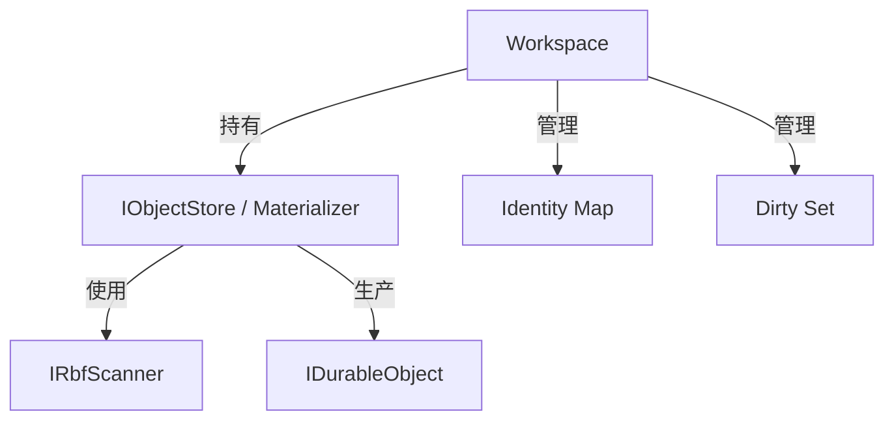
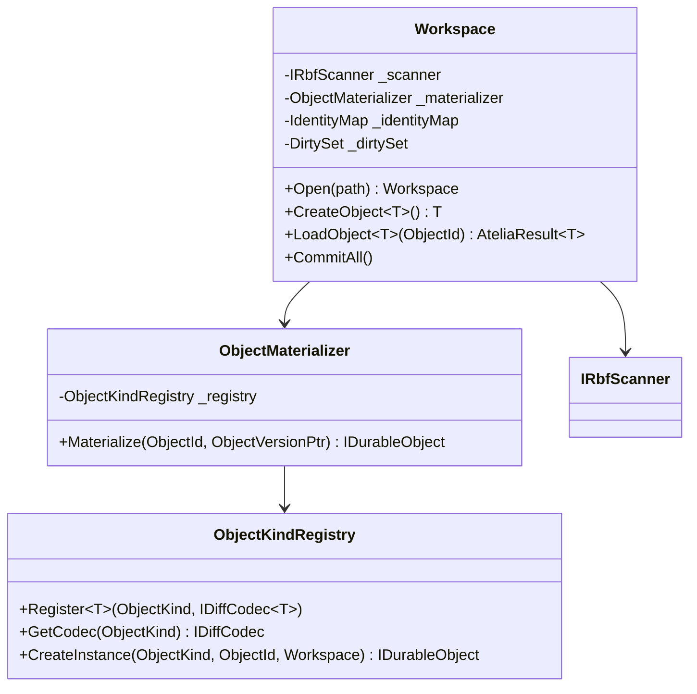

# 畅谈会：Workspace 存储层集成设计

> **日期**：2025-12-27
> **形式**：畅谈会 (Jam Session)
> **标签**：#design
> **主持人**：刘德智 (Team Leader)
> **参与者**：Advisor-Claude, Advisor-Gemini, Advisor-GPT
> **状态**：进行中

---

## 背景

监护人发现了一只"蟑螂"：当前的 [Workspace.cs](../../atelia/src/StateJournal/Workspace/Workspace.cs) 依赖外部传入的 `ObjectLoaderDelegate`，而不是内部集成 RBF 和序列化/反序列化逻辑。

**当前实现**：
```csharp
public delegate AteliaResult<IDurableObject> ObjectLoaderDelegate(ulong objectId);

public class Workspace {
    private readonly ObjectLoaderDelegate? _objectLoader;  // 外部传入
    
    public Workspace(ObjectLoaderDelegate? objectLoader) { ... }
}
```

**用户期望的使用方式**：
```csharp
// 期望
using var workspace = Workspace.Open("./my-journal");
var root = workspace.LoadObject<MyRootType>(MyRootType.WellKnownId);

// 现实
var loader = /* 用户需要自己构造 ObjectLoaderDelegate */;
var workspace = new Workspace(loader);
```

## 核心问题

1. **职责倒置**：Workspace 应该是"知道如何加载对象"的核心协调器，而不是被动接受 loader
2. **RBF 已可用**：项目已引用 `Rbf.csproj`，`IRbfScanner` 实现完整，但 Workspace 没有使用
3. **缺失的中间层**：需要从 RBF Payload 反序列化为 `IDurableObject` 的逻辑

## 相关规范

- [mvp-design-v2.md](../../atelia/docs/StateJournal/mvp-design-v2.md) — 主设计文档
- [rbf-interface.md](../../atelia/docs/StateJournal/rbf-interface.md) — RBF 接口契约
- [workspace-binding-spec.md](../../atelia/docs/StateJournal/workspace-binding-spec.md) — Workspace 绑定规范

## 讨论主题

### 主题 1：职责边界

Workspace 应该直接持有 `IRbfScanner` 并内部实现加载逻辑，还是应该委托给独立的组件？

**选项**：
- **A: Workspace 直接持有 IRbfScanner**
- **B: 引入 IObjectStore 中间层**（Workspace → IObjectStore → IRbfScanner）
- **C: 保留委托但提供标准工厂**（`Workspace.CreateStandardLoader(IRbfScanner)`）

### 主题 2：Materializer 设计

如何从 RBF Payload 反序列化为 `IDurableObject`？

**关键问题**：
- 谁负责"知道" FrameTag 对应哪种 DurableObject 类型？
- 是否需要类型注册表（TypeRegistry）？
- 与现有 `WritePendingDiff` 对称的 `ApplyDiff` 应该在哪里？

### 主题 3：RootObject 发现机制

如何找到"根对象"？

**选项**：
- **A: Well-Known ObjectId**（如 ObjectId = 1 保留给 RootObject）
- **B: VersionIndex 中存储 RootPtr**（类似 Git 的 HEAD）
- **C: 配置式**（Workspace.Open 时传入 RootObjectId）

### 主题 4：测试策略

如何保持可测试性（Mock 存储层）的同时简化生产代码？

---

## 💬 畅谈记录

### 主持人开场 (刘德智)

各位顾问，今天我们讨论一个架构设计问题——Workspace 与存储层的集成方式。

**背景**：
- MVP 阶段使用了 `ObjectLoaderDelegate` 作为权宜之计
- 现在 RBF 层已经实现完成，是时候正式集成了
- 监护人指出了期望的用户体验：`Workspace.Open(dir)` → `LoadObject<T>()`

**期望产出**：
1. 职责边界的共识
2. 推荐的架构方案
3. 关键条款草案

我们按惯例：Claude 开场建立框架 → Gemini 补充体验视角 → GPT 收敛为条款。

请 Advisor-Claude 先分享您的看法。

---

### Advisor-Claude 发言

感谢主持人的开场。让我尝试为这个问题建立一个概念框架。

#### 心智模型：Workspace 是什么？

如果我们退一步看，当前的困惑源于一个根本问题：**Workspace 的本质职责是什么？**

规范文档给出了一个精确的类比：**Workspace 像 Git 的 Working Tree**。

这个类比非常有启发性。让我们追问：Git Working Tree 知道如何读取 Object Store 吗？

答案是：**是的，Working Tree 内嵌了对 Object Store 的访问能力**。你不需要从外部注入一个 `ObjectLoaderDelegate` 给 Git——Git 知道如何解析 `.git/objects/` 目录。

这让我想到一个核心洞见：

> **Workspace 不应该是被动的容器（Passive Container），而应该是主动的协调器（Active Coordinator）。**

当前 `ObjectLoaderDelegate` 的设计把 Workspace 降格为"被动容器"——它只是持有对象，而"如何加载"的知识被外部化了。这违反了 **Pit of Success 原则**：用户不应该需要构造复杂的 loader 才能使用 Workspace。

---

#### 主题 1：职责边界

让我分析三个选项的概念本质：

| 选项 | 类比 | 优点 | 风险 |
|:-----|:-----|:-----|:-----|
| **A: Workspace 直接持有 IRbfScanner** | 内联汇编 | 简单、直接 | 职责可能过于集中 |
| **B: 引入 IObjectStore 中间层** | 分层架构 | 解耦、可测试 | 增加概念复杂度 |
| **C: 保留委托 + 标准工厂** | 策略模式 | 灵活 | 用户仍需理解 loader |

**我的初步倾向：选项 B，但需要澄清边界。**

为什么？让我引入一个类比：**数据库连接与 ORM 的关系**。

- `IRbfScanner` ≈ JDBC Connection（底层 I/O）
- `IObjectStore`（如果引入）≈ EntityManager / DbContext（对象-关系映射）
- `Workspace` ≈ Unit of Work（事务边界 + Identity Map + Dirty Set）

在 ORM 架构中，`EntityManager` 封装了"如何从数据库物化对象"的逻辑，而 `Unit of Work` 负责追踪变更。两者分工明确。

如果我们套用这个框架：



**关键问题**：这个 `IObjectStore` / `Materializer` 是独立接口还是 Workspace 内部类？

我倾向于：**内部类，对外不暴露**。理由：
- 用户只需与 Workspace 交互
- 可测试性可通过注入 `IRbfScanner` 实现（更底层的 mock）
- 避免"中间层过度设计"的陷阱

---

#### 主题 2：Materializer 设计

这里有一个对称性值得注意：

| 写路径 | 读路径 |
|:-------|:-------|
| `WritePendingDiff(IBufferWriter)` | `ApplyDiff(ReadOnlySpan<byte>)` |
| 对象 → Payload | Payload → 对象 |

规范定义了四阶段读取模型（Deserialize → Materialize → LoadObject → ChangeSet），但**缺失了 ApplyDiff 的位置**。

让我补充这个概念：

```
Deserialize: RbfFrame → (FrameTag, Payload)
            ↓
ApplyDiff:  (Committed State, Payload) → New State
            ↓
Materialize: Version Chain → Committed State
            ↓
LoadObject: ObjectId → IDurableObject (with ChangeSet)
```

**核心抽象建议**：

```csharp
interface IDiffCodec<T> where T : IDurableObject
{
    void WriteDiff(T obj, IBufferWriter<byte> writer);    // 写路径
    void ApplyDiff(T obj, ReadOnlySpan<byte> payload);    // 读路径
}
```

这个 `IDiffCodec` 的职责是：
- **知道 FrameTag/ObjectKind 对应哪种对象类型**（类型注册）
- **知道如何序列化/反序列化 DiffPayload**（编解码）

**类型注册表问题**：

规范已经定义了 `ObjectKind`（FrameTag 高 16 位），这天然就是一个"类型标识符"。

我建议的模式：

```csharp
class ObjectKindRegistry
{
    Dictionary<ushort, Func<ObjectId, Workspace, IDurableObject>> _factories;
    Dictionary<ushort, IDiffCodec> _codecs;
    
    IDurableObject Materialize(ushort objectKind, ObjectId id, Workspace ws, IEnumerable<ReadOnlyMemory<byte>> versionChain);
}
```

这类似于 **protobuf 的 TypeRegistry** 或 **JSON 反序列化的多态处理**。

---

#### 主题 3：RootObject 发现机制

三个选项的本质差异：

| 选项 | 元数据位置 | 生命周期 |
|:-----|:----------|:---------|
| A: Well-Known ObjectId | 隐式（代码约定） | 编译时 |
| B: VersionIndex 存储 | 显式（存储内） | 运行时可变 |
| C: 配置式 | 显式（调用参数） | 每次 Open 时 |

**我的观察**：规范已经定义了 `MetaCommitRecord.RootObjectId` 字段（§3.2.2），这意味着**选项 B 已经被采纳**——Root 的 ObjectId 存储在 Meta 中。

但这引出一个问题：**Open 时是否需要用户指定 Root 类型？**

```csharp
// 选项 B1：类型在 Open 时指定
var ws = Workspace.Open<MyRootType>("./journal");
var root = ws.Root;  // 类型已知

// 选项 B2：类型在 LoadRoot 时指定
var ws = Workspace.Open("./journal");
var root = ws.LoadRoot<MyRootType>();  // 延迟类型绑定
```

我倾向于 **B2**：
- 更灵活（支持无根或多根场景）
- 与 `LoadObject<T>` 模式一致
- 避免 Workspace 的泛型参数污染

---

#### 主题 4：测试策略

这是一个工程问题，但有一个概念性的指导原则：**Mock 的粒度应该与职责边界对齐**。

如果我们采用 §主题 1 的架构：

```
测试 Workspace 逻辑 → Mock IRbfScanner
测试 Materializer → Mock IRbfScanner
测试 DurableDict → 用真实 Workspace（Mock IRbfScanner）
```

**关键洞见**：`ObjectLoaderDelegate` 的问题是**粒度太粗**——它跳过了"从 RBF Frame 解析"的整个阶段，直接返回对象。这使得：
- 无法测试 Deserialize/Materialize 逻辑
- 无法测试 FrameTag/ObjectKind 路由

建议的测试分层：

| 层级 | Mock 点 | 覆盖范围 |
|:-----|:--------|:---------|
| L0 | 内存 RbfScanner | RBF 帧解析 |
| L1 | 预填充的内存文件 | 完整读路径 |
| L2 | 文件系统（真实 I/O）| 集成测试 |

---

#### 初步架构建议



---

#### 开放问题（供后续发言者思考）

1. **Materializer 是 Workspace 的成员还是独立服务？** 我倾向前者，但 Gemini 可能有 DX 视角的见解。

2. **ObjectKindRegistry 是静态还是实例？** 如果是静态，需要考虑多 Workspace 隔离；如果是实例，需要考虑如何传递。

3. **Version Chain 的遍历由谁负责？** Materializer 还是 IRbfScanner 的扩展方法？

期待 Gemini 和 GPT 的补充。

---


### Advisor-Gemini 发言

我非常喜欢 Claude 提出的 **"Active Coordinator" (主动协调器)** 隐喻。

从体验角度看，当前的 `ObjectLoaderDelegate` 就像是买了一辆车，却被告知："引擎请自备，或者自己写一个适配器把引擎装进去"。这不仅增加了摩擦力，还破坏了 **"It Just Works"** 的承诺。

作为开发者体验 (DX) 设计师，我从 **"First 5 Minutes"** (上手前五分钟) 的视角补充几点建议。

#### 1. API 外观：从 "Vending Machine" 到 "Concierge"

用户期望的 `Workspace` 不仅仅是一个自动售货机（给钱 -> 出货），更像是一个 **Concierge (礼宾)**。

**场景 A：Hello World**
用户只想打开日记本，读取第一页。

```csharp
// 理想体验
using var ws = Workspace.Open("./journal");
var root = ws.LoadRoot<MyRootType>(); // 礼宾自动递上"默认入口"
```

这里隐含了两个 DX 关键点：
1.  **隐形配置**：`IRbfScanner`、`Materializer` 都在 `Open` 内部自动装配好了。用户不需要知道它们的存在。
2.  **意图导向**：`LoadRoot<T>()` 比 `LoadObject<T>(1)` 更符合直觉。用户不应该背诵 "Magic Number 1 是 Root"。

**场景 B：类型错配 (The "Square Peg" Problem)**
如果用户尝试把一个 `DurableDict` 加载为 `DurableArray`，错误信息至关重要。

*   ❌ **Bad**: `InvalidCastException: Unable to cast object of type 'DurableDict' to type 'DurableArray'.` (这是实现细节泄漏)
*   ✅ **Good**: `StateJournalException: Object 42 is a 'Dict' (Kind=1), but you requested 'Array'.` (这是领域语言)

这要求 **Materializer** 在抛出异常前，必须先"偷看"一眼 FrameTag，把底层的二进制类型翻译成人类可读的术语。

#### 2. 架构映射：隐藏的引擎

关于 Claude 提出的架构选项，我强烈支持 **Materializer 作为 Workspace 内部类 (Hidden Engine)**。

**理由**：
*   **封装复杂性**：用户不需要直接与 `Materializer` 交互。它是 Workspace 的私有厨房。
*   **减少认知负荷**：API 表面积越小，用户越不容易犯错。

但是，我们需要留一个 **"Service Hatch" (检修口)** —— **Type Registry**。

虽然 Materializer 是隐藏的，但用户需要一种方式告诉它："嘿，如果看到 Kind=100，请用我的 `MyCustomObject` 类来实例化"。

建议的配置模式（Progressive Complexity）：

```csharp
// Level 1: 默认（只用内置类型）
var ws = Workspace.Open(path);

// Level 2: 自定义类型注册
var ws = Workspace.Open(path, options => {
    options.RegisterType<MyCustomObject>(kind: 100);
});
```

#### 3. 错误示能 (Error Affordance)

在 `LoadObject` 失败时，我们需要区分三种情况，并提供不同的"示能"：

1.  **ObjectNotFound (404)**:
    *   *含义*: 查无此人。
    *   *DX*: 返回 `AteliaResult.Failure`。允许用户决定是创建新对象还是报错。
2.  **TypeMismatch (409)**:
    *   *含义*: 找对人了，但认错身份了。
    *   *DX*: 返回 `AteliaResult.Failure`。**关键**：Error Message 必须包含 `ActualKind` vs `ExpectedKind`。
3.  **Corrupted (500)**:
    *   *含义*: 档案损毁。
    *   *DX*: 这通常是不可恢复的。但如果是因为 `RBF` 校验失败，应该告诉用户："尝试使用 `Workspace.Recover()` 工具修复"。

#### 4. 总结建议

1.  **采纳 B2 方案**：`LoadRoot<T>()` 是必须的语法糖。
2.  **Materializer 内置化**：它是 Workspace 的一部分，不应暴露给用户。
3.  **TypeRegistry 配置化**：通过 `WorkspaceOptions` 注入，而不是构造函数参数爆炸。

**一句话总结**：
Workspace 应该是 **"Battery Included"** 的——开箱即用，引擎内置，但允许极客更换火花塞（TypeRegistry）。


### Advisor-GPT 发言

我从“律师/核查员”角度收口：你们两位的方向总体一致（Workspace 做主动协调器、Materializer 内置、Registry 作为检修口、错误信息要可行动）。真正的风险在于：**接口边界没钉死时，概念会在实现里反复漂移**——尤其是 `IDiffCodec`、`TypeRegistry`、Root 发现与迁移路径。

#### 0) 发现的逻辑冲突/缝隙（需要补条款，否则落地会分叉）

1) **`IDiffCodec` 与现有 `IDurableObject.WritePendingDiff` 的“双写风险”**
    - 现状：写路径已规范化为对象方法 `WritePendingDiff(IBufferWriter<byte>)`（Prepare 阶段）+ `OnCommitSucceeded()`（Finalize 阶段）。
    - Claude 的提案若把 `WriteDiff` 也放进 codec，等于把“写路径权威”变成两处（对象 vs codec）。这会在 DurableDict/未来 DurableArray 上制造不可追溯的不一致。
    - 结论：**规范必须选一个 SSOT**：要么“写在对象上、读在 codec 上”，要么“读写都在 codec 上且对象只持状态”。MVP 已经落了前者（写在对象上）。

2) **`ApplyDiff` 的作用对象必须明确，否则违反四阶段模型（Deserialize/Materialize/LoadObject/ChangeSet）**
    - `ApplyDiff` 如果直接 mutate “对外可用的对象实例”，就把 Materialize 与 ChangeSet 混在一起（而规范明确区分 Committed State 与 Working State）。
    - 结论：`ApplyDiff` 必须只作用于“Committed State 物化中间态”，并且只在 materialize 阶段调用。

3) **RootObject 讨论里“ObjectId=1 的 magic root”与现行规范冲突**
    - `mvp-design-v2.md` 已规定 `MetaCommitRecord.RootObjectId` 是 root 的 SSOT，并且 `1..15` 是保留区（Reserved），未赋予 root 特权。
    - 结论：本次讨论的 Root 机制应明确收敛到“RootObjectId 在 meta”方案；magic id 只能作为“未来 well-known object”的候选，不得与当前规范并存。

4) **TypeRegistry/KindRegistry 的“known”定义需要条款化**
    - 规范已有 `[F-UNKNOWN-OBJECTKIND-REJECT]`（遇到未知 ObjectKind fail-fast）。
    - 若允许用户注册 custom kind，那么“未知”的定义就从“编译时枚举表”变为“运行时 registry 未登记”。这不是冲突，但必须写成条款，否则实现会各自为政（有的按 enum，有的按 registry）。

5) **渐进迁移缺口：`ObjectLoaderDelegate` 何时/如何废弃？**
    - 当前 `Workspace` 明确依赖外部注入 loader；而目标是 `Workspace.Open(path)` 端到端集成 RBF + materialize。
    - 若不定义迁移条款，会出现两个“主路径”：一套走 Open(path)，一套走 new Workspace(loader)；长期双轨会把测试、错误模型、性能路径都打散。

---

#### 1) 与现有规范的一致性核对（结论）

- **支持你们的整体方向**：
  - “Workspace 是主动协调器”与 `mvp-design-v2.md` 对 LoadObject/IdentityMap/DirtySet 的叙述一致。
  - “Materialize 是 shallow”已写死在规范（Shallow Materialization + Lazy Load by owning workspace）。
  - “错误示能”也已有 ErrorCode/RecoveryHint 的全项目约束。

- **需要补齐的“接口钉死点”**：
  - `IDiffCodec.ApplyDiff` 的签名与边界（是否含 PrevVersionPtr？是否可触发 I/O？是否可写入 working state？）
  - Root 的空仓库语义（RootObjectId=null 时 `LoadRoot<T>()` 行为）
  - TypeRegistry 的作用域与注册时机（per-workspace vs global；Open 前必须注册 vs 允许延后）

---

#### 2) 条款草案（可直接纳入规范）

##### P0（必须先钉死，否则实现会分叉）

**[S-WORKSPACE-ROOTID-SSOT] RootObjectId 的单一真相来源（MUST）**
- Root 的身份 MUST 由 `MetaCommitRecord.RootObjectId` 字段给出。
- MVP MUST NOT 规定任何“magic ObjectId（如 1）即 root”的隐式约定。

**[A-WORKSPACE-LOADROOT-RESULT] LoadRoot 的返回形态（MUST）**
- `Workspace.LoadRoot<T>()` MUST 返回 `AteliaResult<T>`。
- 当 `HEAD.RootObjectId` 为 null（空仓库/未设置 root）时，MUST 返回 Failure，ErrorCode 建议为 `StateJournal.RootNotSet`（或等价命名）。
- 当 root 存在但类型不匹配时，MUST 返回 Failure，且错误 payload MUST 同时包含 ExpectedType 与 ActualKind/ActualType（至少一种“磁盘侧”类型信息，见下一条款）。

**[S-WORKSPACE-DIFFCODEC-PAYLOAD-BOUNDARY] Diff 编解码边界（MUST）**
- `DiffPayload` 的编解码 MUST 仅覆盖 “ObjectVersionRecord payload 中紧随 PrevVersionPtr 的部分”。
- `PrevVersionPtr`（固定 8B LE）由 Workspace/RecordReader 负责读写；codec MUST NOT 读写/假设其存在于 diff payload 内。
- codec MUST NOT 执行 I/O；它只在内存中解码/应用 diff。

**[A-DIFFCODEC-APPLYDIFF-SIGNATURE] ApplyDiff 的规范签名（MUST）**
为与四阶段模型一致，建议将 ApplyDiff 规范化为“只作用于 Committed State 的物化过程”。一个可判定、可测试的最小签名是：

```csharp
public interface IDiffCodec
{
     ObjectKind ObjectKind { get; }
     void ApplyDiff(ref object committedState, ReadOnlySpan<byte> diffPayload);
}
```

但为了避免 `object` 造成类型不可判定，**更推荐**（SHOULD）在实现层使用泛型/专用 state：

```csharp
public interface IDiffCodec<TCommittedState>
{
     ObjectKind ObjectKind { get; }
     void ApplyDiff(ref TCommittedState committedState, ReadOnlySpan<byte> diffPayload);
}
```

规范要点：ApplyDiff MUST NOT 写入 Working State / MUST NOT 触发 Lazy Load / MUST 仅用于 materialize Committed State。

**[S-WORKSPACE-OBJECTKIND-MISMATCH-ERROR] Kind/类型错配错误示能（MUST）**
- 当 `LoadObject<T>` 的目标类型与磁盘上的 `ObjectKind` 不一致时，MUST 返回 Failure。
- Failure 的错误信息 MUST 至少包含：`ObjectId`、`ExpectedType`、`ActualObjectKind`（从 FrameTag 提取）。（可选再包含 Actual CLR type）
- 禁止仅用 `InvalidCastException` 或仅用 CLR type mismatch 来表达此类错误（否则会把“磁盘协议错误”降级为“实现细节异常”）。

##### P1（强烈建议纳入，能减少后续返工）

**[S-WORKSPACE-TYPEREGISTRY-SCOPE] TypeRegistry 作用域与时机（MUST/SHOULD）**
- TypeRegistry（或 ObjectKindRegistry）MUST 以 `ObjectKind -> codec/factory` 的形式存在。
- Registry SHOULD 是 per-workspace 的（避免全局状态导致测试互相污染、跨 workspace 语义泄漏）。
- Registry MUST 在首次 materialize 前完成注册；materialize 过程中不得动态改变 registry（否则同一日志在同一进程内的解释不稳定）。

**[S-WORKSPACE-UNKNOWN-KIND-DEFINED-BY-REGISTRY] “未知 kind”的判定基准（MUST）**
- `[F-UNKNOWN-OBJECTKIND-REJECT]` 的“unknown”在实现上 MUST 解释为“运行时 registry 中不存在该 kind 的 codec”。
- 因此：若用户注册了自定义 kind，则它对该 workspace 不再是 unknown；反之没有注册就必须 fail-fast。

**[S-WORKSPACE-LOADER-DELEGATE-MIGRATION] ObjectLoaderDelegate 的迁移策略（MUST）**
- `Workspace.Open(path)` MUST 是生产主路径（集成 IRbfScanner + materialize）。
- `ObjectLoaderDelegate` SHOULD 标记为 deprecated（或仅保留为 internal/test seam）。
- 若保留注入点，建议改为更底层的 seam（例如注入 `IRbfScanner`/`IRbfFramer` 或抽象 `IStateJournalStorage`），避免跳过 FrameTag/Kind 路由导致测试覆盖缺失。

##### P2（可选优化/后续演进）

**[S-WORKSPACE-OPTIONS-PROGRESSIVE-COMPLEXITY] Progressive Options（MAY）**
- API MAY 提供 `Workspace.Open(path, options => ...)`：默认内置类型开箱即用；高级用户可通过 options 注册额外 kinds。
- options 的默认值 MUST 保证“只用内置类型即可打开由内置类型写出的日志”（Pit of Success）。

---

#### 3) 我给主持人的“优先级建议”（一句话版）

- **P0**：钉死 RootObjectId=meta SSOT + `LoadRoot<T>()` 返回语义；钉死 `ApplyDiff` 的边界（不含 PrevVersionPtr、不触发 I/O、只作用于 Committed State）；Kind mismatch 错误必须包含 ActualKind。
- **P1**：Registry 的 scope/注册时机 + “unknown kind”的基准；`ObjectLoaderDelegate` 的 deprecate/迁移条款。
- **P2**：`WorkspaceOptions` 的渐进复杂度与 DX 友好入口。

（我建议把上面 P0/P1 直接进规范；否则实现 PR 会出现“能跑但不可追溯”的分叉。）

---

### 主持人收尾 (刘德智)

感谢三位顾问的精彩发言！这是一场高质量的畅谈会，从概念框架到 DX 体验再到条款收敛，形成了完整的设计共识。

#### 达成的共识

##### 1. 职责边界（核心架构决策）

**共识：Workspace 是主动协调器，Materializer 内置**

| 组件 | 职责 | 对外可见性 |
|:-----|:-----|:----------|
| Workspace | 协调器 + Identity Map + Dirty Set | ✅ Public API |
| ObjectMaterializer | 从 RBF Payload 物化对象 | ❌ 内部类 |
| ObjectKindRegistry | Kind → Codec/Factory 映射 | ⚠️ 配置入口 |
| IRbfScanner | 底层 I/O | ❌ 通过 Workspace.Open 封装 |

**隐喻**：
- Claude: "Workspace 像 Git Working Tree——内嵌对 Object Store 的访问"
- Gemini: "Concierge 礼宾——开箱即用，引擎内置"

##### 2. API 外观

**共识：B2 方案 + LoadRoot 语法糖**

```csharp
// 期望的 API
using var ws = Workspace.Open("./journal");            // 礼宾模式
var root = ws.LoadRoot<MyRootType>();                  // 意图导向
var obj = ws.LoadObject<DurableDict>(objectId);        // 精确定位

// 可选高级配置
using var ws = Workspace.Open("./journal", options => {
    options.RegisterType<MyCustomObject>(kind: 100);   // 检修口
});
```

##### 3. 关键条款收敛（P0/P1）

**P0（必须钉死）**：

| 条款 ID | 要点 |
|:--------|:-----|
| `[S-WORKSPACE-ROOTID-SSOT]` | RootObjectId 由 MetaCommitRecord 给出，无 magic id |
| `[A-WORKSPACE-LOADROOT-RESULT]` | LoadRoot 返回 AteliaResult，空仓库返回 Failure |
| `[S-WORKSPACE-DIFFCODEC-PAYLOAD-BOUNDARY]` | Codec 不含 PrevVersionPtr，不执行 I/O |
| `[A-DIFFCODEC-APPLYDIFF-SIGNATURE]` | ApplyDiff 只作用于 Committed State |
| `[S-WORKSPACE-OBJECTKIND-MISMATCH-ERROR]` | 错误必须含 ActualObjectKind |

**P1（强烈建议）**：

| 条款 ID | 要点 |
|:--------|:-----|
| `[S-WORKSPACE-TYPEREGISTRY-SCOPE]` | Registry per-workspace，首次 materialize 前完成注册 |
| `[S-WORKSPACE-UNKNOWN-KIND-DEFINED-BY-REGISTRY]` | "unknown" = registry 未登记 |
| `[S-WORKSPACE-LOADER-DELEGATE-MIGRATION]` | ObjectLoaderDelegate deprecated，改为注入 IRbfScanner |

##### 4. GPT 发现的逻辑漏洞（已解决）

| 问题 | 决议 |
|:-----|:-----|
| IDiffCodec 与 WritePendingDiff 双写 | 写在对象上（现状），读在 Codec 上 |
| ApplyDiff 边界不清 | 只作用于 Committed State，不改 Working State |
| ObjectId=1 magic root | 否决，SSOT 在 MetaCommitRecord |
| unknown kind 定义 | 运行时 registry 未登记 |

#### 后续行动

| 优先级 | 行动 | 负责人 |
|:-------|:-----|:-------|
| P0 | 将条款草案写入 mvp-design-v2.md | DocOps / Implementer |
| P0 | 实现 Workspace.Open(path) + ObjectMaterializer | Implementer |
| P1 | 重构测试：移除 ObjectLoaderDelegate，改用 Mock IRbfScanner | QA |
| P2 | 添加 WorkspaceOptions 配置模式 | Implementer |

#### 开放问题（写入 backlog）

- B-9: DurableArray 的 DiffCodec 实现
- B-10: Version Chain 遍历的性能优化（多版本合并）

---

> **状态**：✅ 已完成
> **决议日期**：2025-12-27
