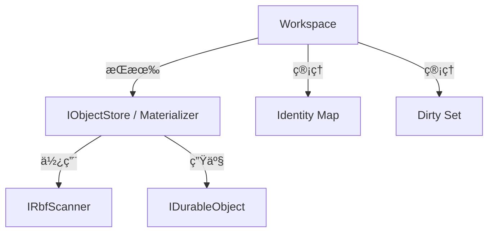

# 畅谈会：Workspace 存储层集æˆè®¾è®¡

> **日期**：2025-12-27
> **å½¢å¼**：畅谈会 (Jam Session)
> **标签**：#design
> **主æŒäºº**：刘德智 (Team Leader)
> **å‚ä¸è€…**：Advisor-Claude, Advisor-Gemini, Advisor-GPT
> **状æ€**：进行中

---

## 背景

监护人å‘ç°äº†ä¸€åª"蟑è‚"：当å‰çš„ [Workspace.cs](../../atelia/src/StateJournal/Workspace/Workspace.cs) ä¾èµ–外部传入的 `ObjectLoaderDelegate`，而ä¸æ˜¯å†…éƒ¨é›†æˆ RBF å’Œåºåˆ—化/ååºåˆ—化逻辑。

**当å‰å®ç°**：
```csharp
public delegate AteliaResult<IDurableObject> ObjectLoaderDelegate(ulong objectId);

public class Workspace {
    private readonly ObjectLoaderDelegate? _objectLoader;  // 外部传入
    
    public Workspace(ObjectLoaderDelegate? objectLoader) { ... }
}
```

**用户期望的使用方å¼**：
```csharp
// 期望
using var workspace = Workspace.Open("./my-journal");
var root = workspace.LoadObject<MyRootType>(MyRootType.WellKnownId);

// ç°å®
var loader = /* 用户需è¦è‡ªå·±æ„造 ObjectLoaderDelegate */;
var workspace = new Workspace(loader);
```

## 核心问题

1. **èŒè´£å€’ç½®**：Workspace 应该是"知é“如何加载对象"的核心å调器，而ä¸æ˜¯è¢«åŠ¨æ¥å— loader
2. **RBF å·²å¯ç”¨**：项目已引用 `Rbf.csproj`，`IRbfScanner` å®ç°å®Œæ•´ï¼Œä½† Workspace 没有使用
3. **缺失的中间层**：需è¦ä» RBF Payload ååºåˆ—化为 `IDurableObject` 的逻辑

## 相关规范

- [mvp-design-v2.md](../../atelia/docs/StateJournal/mvp-design-v2.md) — 主设计文档
- [rbf-interface.md](../../atelia/docs/StateJournal/rbf-interface.md) — RBF æ¥å£å¥‘约
- [workspace-binding-spec.md](../../atelia/docs/StateJournal/workspace-binding-spec.md) — Workspace 绑定规范

## 讨论主题

### 主题 1：èŒè´£è¾¹ç•Œ

Workspace 应该直æ¥æŒæœ‰ `IRbfScanner` 并内部å®ç°åŠ è½½é€»è¾‘，还是应该委托给独立的组件？

**选项**：
- **A: Workspace ç›´æ¥æŒæœ‰ IRbfScanner**
- **B: 引入 IObjectStore 中间层**（Workspace → IObjectStore → IRbfScanner）
- **C: ä¿ç•™å§”托但æ供标准工å‚**（`Workspace.CreateStandardLoader(IRbfScanner)`）

### 主题 2：Materializer 设计

å¦‚ä½•ä» RBF Payload ååºåˆ—化为 `IDurableObject`？

**关键问题**：
- è°è´Ÿè´£"知é“" FrameTag å¯¹åº”å“ªç§ DurableObject ç±»å‹ï¼Ÿ
- 是å¦éœ€è¦ç±»å‹æ³¨å†Œè¡¨ï¼ˆTypeRegistry）？
- ä¸ç°æœ‰ `WritePendingDiff` 对称的 `ApplyDiff` 应该在哪里？

### 主题 3：RootObject å‘ç°æœºåˆ¶

如何找到"根对象"？

**选项**：
- **A: Well-Known ObjectId**（如 ObjectId = 1 ä¿ç•™ç»™ RootObject）
- **B: VersionIndex 中存储 RootPtr**（类似 Git 的 HEAD）
- **C: é…ç½®å¼**（Workspace.Open 时传入 RootObjectId）

### 主题 4：测试策略

如何ä¿æŒå¯æµ‹è¯•æ€§ï¼ˆMock 存储层）的åŒæ—¶ç®€åŒ–生产代ç ï¼Ÿ

---

## 💬 畅谈记录

### 主æŒäººå¼€åœº (刘德智)

å„ä½é¡¾é—®ï¼Œä»Šå¤©æˆ‘们讨论一个æ¶æ„设计问题——Workspace ä¸å­˜å‚¨å±‚的集æˆæ–¹å¼ã€‚

**背景**：
- MVP 阶段使用了 `ObjectLoaderDelegate` 作为æƒå®œä¹‹è®¡
- ç°åœ¨ RBF 层已ç»å®ç°å®Œæˆï¼Œæ˜¯æ—¶å€™æ­£å¼é›†æˆäº†
- 监护人指出了期望的用户体验：`Workspace.Open(dir)` → `LoadObject<T>()`

**期望产出**：
1. èŒè´£è¾¹ç•Œçš„共识
2. æ¨èçš„æ¶æ„方案
3. 关键æ¡æ¬¾è‰æ¡ˆ

我们按惯例：Claude å¼€åœºå»ºç«‹æ¡†æ¶ â†’ Gemini 补充体验视角 → GPT 收敛为æ¡æ¬¾ã€‚

请 Advisor-Claude 先分享您的看法。

---

### Advisor-Claude å‘言

感谢主æŒäººçš„开场。让我å°è¯•ä¸ºè¿™ä¸ªé—®é¢˜å»ºç«‹ä¸€ä¸ªæ¦‚念框æ¶ã€‚

#### 心智模å‹ï¼šWorkspace 是什么？

如æœæˆ‘们退一步看，当å‰çš„困惑æºäºä¸€ä¸ªæ ¹æœ¬é—®é¢˜ï¼š**Workspace 的本质èŒè´£æ˜¯ä»€ä¹ˆï¼Ÿ**

规范文档给出了一个精确的类比：**Workspace åƒ Git çš„ Working Tree**。

这个类比é常有å¯å‘性。让我们追问：Git Working Tree 知é“å¦‚ä½•è¯»å– Object Store å—？

答案是：**是的，Working Tree 内嵌了对 Object Store 的访问能力**。你ä¸éœ€è¦ä»å¤–部注入一个 `ObjectLoaderDelegate` ç»™ Git——Git 知é“如何解æ `.git/objects/` 目录。

这让我想到一个核心æ´è§ï¼š

> **Workspace ä¸åº”该是被动的容器（Passive Container），而应该是主动的å调器（Active Coordinator）。**

å½“å‰ `ObjectLoaderDelegate` 的设计把 Workspace é™æ ¼ä¸º"被动容器"——它åªæ˜¯æŒæœ‰å¯¹è±¡ï¼Œè€Œ"如何加载"的知识被外部化了。这è¿å了 **Pit of Success åŸåˆ™**：用户ä¸åº”该需è¦æ„造å¤æ‚çš„ loader æ‰èƒ½ä½¿ç”¨ Workspace。

---

#### 主题 1：èŒè´£è¾¹ç•Œ

让我分æ三个选项的概念本质：

| 选项 | 类比 | 优点 | é£é™© |
|:-----|:-----|:-----|:-----|
| **A: Workspace ç›´æ¥æŒæœ‰ IRbfScanner** | 内è”汇编 | 简å•ã€ç›´æ¥ | èŒè´£å¯èƒ½è¿‡äºé›†ä¸­ |
| **B: 引入 IObjectStore 中间层** | 分层æ¶æ„ | 解耦ã€å¯æµ‹è¯• | å¢åŠ æ¦‚念å¤æ‚度 |
| **C: ä¿ç•™å§”托 + 标准工å‚** | ç­–ç•¥æ¨¡å¼ | çµæ´» | 用户ä»éœ€ç†è§£ loader |

**我的åˆæ­¥å€¾å‘：选项 B，但需è¦æ¾„清边界。**

为什么？让我引入一个类比：**æ•°æ®åº“è¿æ¥ä¸ ORM 的关系**。

- `IRbfScanner` ≈ JDBC Connection（底层 I/O）
- `IObjectStore`（如æœå¼•å…¥ï¼‰â‰ˆ EntityManager / DbContext（对象-关系映射）
- `Workspace` ≈ Unit of Work（事务边界 + Identity Map + Dirty Set）

在 ORM æ¶æ„中，`EntityManager` å°è£…了"如何ä»æ•°æ®åº“物化对象"的逻辑，而 `Unit of Work` 负责追踪å˜æ›´ã€‚两者分工æ˜ç¡®ã€‚

如æœæˆ‘们套用这个框æ¶ï¼š



**关键问题**：这个 `IObjectStore` / `Materializer` 是独立æ¥å£è¿˜æ˜¯ Workspace 内部类？

我倾å‘äºï¼š**内部类，对外ä¸æš´éœ²**。ç†ç”±ï¼š
- 用户åªéœ€ä¸ Workspace 交互
- å¯æµ‹è¯•æ€§å¯é€šè¿‡æ³¨å…¥ `IRbfScanner` å®ç°ï¼ˆæ›´åº•å±‚çš„ mock）
- é¿å…"中间层过度设计"的陷阱

---

#### 主题 2：Materializer 设计

这里有一个对称性值得注æ„：

| 写路径 | 读路径 |
|:-------|:-------|
| `WritePendingDiff(IBufferWriter)` | `ApplyDiff(ReadOnlySpan<byte>)` |
| 对象 → Payload | Payload → 对象 |

规范定义了四阶段读å–模å‹ï¼ˆDeserialize → Materialize → LoadObject → ChangeSet），但**缺失了 ApplyDiff çš„ä½ç½®**。

让我补充这个概念：

```
Deserialize: RbfFrame → (FrameTag, Payload)
            ↓
ApplyDiff:  (Committed State, Payload) → New State
            ↓
Materialize: Version Chain → Committed State
            ↓
LoadObject: ObjectId → IDurableObject (with ChangeSet)
```

**核心抽象建议**：

```csharp
interface IDiffCodec<T> where T : IDurableObject
{
    void WriteDiff(T obj, IBufferWriter<byte> writer);    // 写路径
    void ApplyDiff(T obj, ReadOnlySpan<byte> payload);    // 读路径
}
```

这个 `IDiffCodec` çš„èŒè´£æ˜¯ï¼š
- **çŸ¥é“ FrameTag/ObjectKind 对应哪ç§å¯¹è±¡ç±»å‹**（类å‹æ³¨å†Œï¼‰
- **知é“如何åºåˆ—化/ååºåˆ—化 DiffPayload**（编解ç ï¼‰

**ç±»å‹æ³¨å†Œè¡¨é—®é¢˜**：

规范已ç»å®šä¹‰äº† `ObjectKind`（FrameTag 高 16 ä½ï¼‰ï¼Œè¿™å¤©ç„¶å°±æ˜¯ä¸€ä¸ª"ç±»å‹æ ‡è¯†ç¬¦"。

我建议的模å¼ï¼š

```csharp
class ObjectKindRegistry
{
    Dictionary<ushort, Func<ObjectId, Workspace, IDurableObject>> _factories;
    Dictionary<ushort, IDiffCodec> _codecs;
    
    IDurableObject Materialize(ushort objectKind, ObjectId id, Workspace ws, IEnumerable<ReadOnlyMemory<byte>> versionChain);
}
```

è¿™ç±»ä¼¼äº **protobuf çš„ TypeRegistry** 或 **JSON ååºåˆ—化的多æ€å¤„ç†**。

---

#### 主题 3：RootObject å‘ç°æœºåˆ¶

三个选项的本质差异：

| 选项 | 元数æ®ä½ç½® | 生命周期 |
|:-----|:----------|:---------|
| A: Well-Known ObjectId | éšå¼ï¼ˆä»£ç çº¦å®šï¼‰ | 编译时 |
| B: VersionIndex 存储 | 显å¼ï¼ˆå­˜å‚¨å†…） | è¿è¡Œæ—¶å¯å˜ |
| C: é…ç½®å¼ | 显å¼ï¼ˆè°ƒç”¨å‚数） | æ¯æ¬¡ Open æ—¶ |

**我的观察**：规范已ç»å®šä¹‰äº† `MetaCommitRecord.RootObjectId` 字段（§3.2.2），这æ„味ç€**选项 B å·²ç»è¢«é‡‡çº³**——Root çš„ ObjectId 存储在 Meta 中。

但这引出一个问题：**Open 时是å¦éœ€è¦ç”¨æˆ·æŒ‡å®š Root ç±»å‹ï¼Ÿ**

```csharp
// 选项 B1：类å‹åœ¨ Open 时指定
var ws = Workspace.Open<MyRootType>("./journal");
var root = ws.Root;  // ç±»å‹å·²çŸ¥

// 选项 B2：类å‹åœ¨ LoadRoot 时指定
var ws = Workspace.Open("./journal");
var root = ws.LoadRoot<MyRootType>();  // 延迟类å‹ç»‘定
```

我倾å‘äº **B2**：
- æ›´çµæ´»ï¼ˆæ”¯æŒæ— æ ¹æˆ–多根场景）
- ä¸ `LoadObject<T>` 模å¼ä¸€è‡´
- é¿å… Workspace çš„æ³›å‹å‚数污染

---

#### 主题 4：测试策略

这是一个工程问题，但有一个概念性的指导åŸåˆ™ï¼š**Mock 的粒度应该ä¸èŒè´£è¾¹ç•Œå¯¹é½**。

如æœæˆ‘们采用 §主题 1 çš„æ¶æ„：

```
测试 Workspace 逻辑 → Mock IRbfScanner
测试 Materializer → Mock IRbfScanner
测试 DurableDict → ç”¨çœŸå® Workspace（Mock IRbfScanner）
```

**关键æ´è§**：`ObjectLoaderDelegate` 的问题是**粒度太粗**——它跳过了"ä» RBF Frame 解æ"的整个阶段，直æ¥è¿”å›å¯¹è±¡ã€‚这使得：
- 无法测试 Deserialize/Materialize 逻辑
- 无法测试 FrameTag/ObjectKind 路由

建议的测试分层：

| 层级 | Mock 点 | 覆盖范围 |
|:-----|:--------|:---------|
| L0 | 内存 RbfScanner | RBF 帧解æ |
| L1 | 预填充的内存文件 | 完整读路径 |
| L2 | æ–‡ä»¶ç³»ç»Ÿï¼ˆçœŸå® I/O）| 集æˆæµ‹è¯• |

---

#### åˆæ­¥æ¶æ„建议


---

#### 开放问题（供åç»­å‘言者æ€è€ƒï¼‰

1. **Materializer 是 Workspace çš„æˆå‘˜è¿˜æ˜¯ç‹¬ç«‹æœåŠ¡ï¼Ÿ** 我倾å‘å‰è€…，但 Gemini å¯èƒ½æœ‰ DX 视角的è§è§£ã€‚

2. **ObjectKindRegistry 是é™æ€è¿˜æ˜¯å®ä¾‹ï¼Ÿ** 如æœæ˜¯é™æ€ï¼Œéœ€è¦è€ƒè™‘多 Workspace 隔离；如æœæ˜¯å®ä¾‹ï¼Œéœ€è¦è€ƒè™‘如何传递。

3. **Version Chain çš„éå†ç”±è°è´Ÿè´£ï¼Ÿ** Materializer 还是 IRbfScanner 的扩展方法？

期待 Gemini 和 GPT 的补充。

---


### Advisor-Gemini å‘言

我é常喜欢 Claude æ出的 **"Active Coordinator" (主动å调器)** éšå–»ã€‚

ä»ä½“验角度看，当å‰çš„ `ObjectLoaderDelegate` å°±åƒæ˜¯ä¹°äº†ä¸€è¾†è½¦ï¼Œå´è¢«å‘ŠçŸ¥ï¼š"引æ“请自备，或者自己写一个适é…器把引æ“装进å»"。这ä¸ä»…å¢åŠ äº†æ‘©æ“¦åŠ›ï¼Œè¿˜ç ´å了 **"It Just Works"** 的承诺。

作为开å‘者体验 (DX) è®¾è®¡å¸ˆï¼Œæˆ‘ä» **"First 5 Minutes"** (上手å‰äº”分钟) 的视角补充几点建议。

#### 1. API å¤–è§‚ï¼šä» "Vending Machine" 到 "Concierge"

用户期望的 `Workspace` ä¸ä»…仅是一个自动售货机（给钱 -> 出货），更åƒæ˜¯ä¸€ä¸ª **Concierge (礼宾)**。

**场景 A：Hello World**
用户åªæƒ³æ‰“开日记本，读å–第一页。

```csharp
// ç†æƒ³ä½“验
using var ws = Workspace.Open("./journal");
var root = ws.LoadRoot<MyRootType>(); // 礼宾自动递上"默认入å£"
```

这里éšå«äº†ä¸¤ä¸ª DX 关键点：
1.  **éšå½¢é…ç½®**：`IRbfScanner`ã€`Materializer` 都在 `Open` 内部自动装é…好了。用户ä¸éœ€è¦çŸ¥é“它们的存在。
2.  **æ„图导å‘**：`LoadRoot<T>()` 比 `LoadObject<T>(1)` 更符åˆç›´è§‰ã€‚用户ä¸åº”该背诵 "Magic Number 1 是 Root"。

**场景 B：类å‹é”™é… (The "Square Peg" Problem)**
如æœç”¨æˆ·å°è¯•æŠŠä¸€ä¸ª `DurableDict` 加载为 `DurableArray`，错误信æ¯è‡³å…³é‡è¦ã€‚

*   ⌠**Bad**: `InvalidCastException: Unable to cast object of type 'DurableDict' to type 'DurableArray'.` (这是å®ç°ç»†èŠ‚泄æ¼)
*   ✅ **Good**: `StateJournalException: Object 42 is a 'Dict' (Kind=1), but you requested 'Array'.` (这是领域语言)

è¿™è¦æ±‚ **Materializer** 在抛出异常å‰ï¼Œå¿…须先"å·çœ‹"一眼 FrameTag，把底层的二进制类å‹ç¿»è¯‘æˆäººç±»å¯è¯»çš„术语。

#### 2. æ¶æ„映射：éšè—的引æ“

å…³äº Claude æ出的æ¶æ„é€‰é¡¹ï¼Œæˆ‘å¼ºçƒˆæ”¯æŒ **Materializer 作为 Workspace 内部类 (Hidden Engine)**。

**ç†ç”±**：
*   **å°è£…å¤æ‚性**：用户ä¸éœ€è¦ç›´æ¥ä¸ `Materializer` 交互。它是 Workspace çš„ç§æœ‰å¨æˆ¿ã€‚
*   **å‡å°‘认知负è·**：API 表é¢ç§¯è¶Šå°ï¼Œç”¨æˆ·è¶Šä¸å®¹æ˜“犯错。

但是，我们需è¦ç•™ä¸€ä¸ª **"Service Hatch" (检修å£)** —— **Type Registry**。

虽然 Materializer 是éšè—的，但用户需è¦ä¸€ç§æ–¹å¼å‘Šè¯‰å®ƒï¼š"嘿，如æœçœ‹åˆ° Kind=100，请用我的 `MyCustomObject` ç±»æ¥å®ä¾‹åŒ–"。

建议的é…置模å¼ï¼ˆProgressive Complexity）：

```csharp
// Level 1: 默认（åªç”¨å†…置类å‹ï¼‰
var ws = Workspace.Open(path);

// Level 2: 自定义类å‹æ³¨å†Œ
var ws = Workspace.Open(path, options => {
    options.RegisterType<MyCustomObject>(kind: 100);
});
```

#### 3. 错误示能 (Error Affordance)

在 `LoadObject` 失败时，我们需è¦åŒºåˆ†ä¸‰ç§æƒ…况，并æä¾›ä¸åŒçš„"示能"：

1.  **ObjectNotFound (404)**:
    *   *å«ä¹‰*: 查无此人。
    *   *DX*: è¿”å› `AteliaResult.Failure`。å…许用户决定是创建新对象还是报错。
2.  **TypeMismatch (409)**:
    *   *å«ä¹‰*: 找对人了，但认错身份了。
    *   *DX*: è¿”å› `AteliaResult.Failure`。**关键**：Error Message å¿…é¡»åŒ…å« `ActualKind` vs `ExpectedKind`。
3.  **Corrupted (500)**:
    *   *å«ä¹‰*: 档案æŸæ¯ã€‚
    *   *DX*: 这通常是ä¸å¯æ¢å¤çš„。但如æœæ˜¯å› ä¸º `RBF` 校验失败，应该告诉用户："å°è¯•ä½¿ç”¨ `Workspace.Recover()` 工具修å¤"。

#### 4. 总结建议

1.  **采纳 B2 方案**：`LoadRoot<T>()` 是必须的语法糖。
2.  **Materializer 内置化**：它是 Workspace 的一部分，ä¸åº”暴露给用户。
3.  **TypeRegistry é…置化**：通过 `WorkspaceOptions` 注入，而ä¸æ˜¯æ„造函数å‚数爆炸。

**一å¥è¯æ€»ç»“**：
Workspace 应该是 **"Battery Included"** 的——开箱å³ç”¨ï¼Œå¼•æ“内置，但å…许æ客更æ¢ç«èŠ±å¡ï¼ˆTypeRegistry）。


### Advisor-GPT å‘言

我ä»â€œå¾‹å¸ˆ/核查员â€è§’度收å£ï¼šä½ ä»¬ä¸¤ä½çš„æ–¹å‘总体一致（Workspace åšä¸»åŠ¨å调器ã€Materializer 内置ã€Registry 作为检修å£ã€é”™è¯¯ä¿¡æ¯è¦å¯è¡ŒåŠ¨ï¼‰ã€‚真正的é£é™©åœ¨äºï¼š**æ¥å£è¾¹ç•Œæ²¡é’‰æ­»æ—¶ï¼Œæ¦‚念会在å®ç°é‡Œåå¤æ¼‚移**——尤其是 `IDiffCodec`ã€`TypeRegistry`ã€Root å‘ç°ä¸è¿ç§»è·¯å¾„。

#### 0) å‘ç°çš„逻辑冲çª/ç¼éš™ï¼ˆéœ€è¦è¡¥æ¡æ¬¾ï¼Œå¦åˆ™è½åœ°ä¼šåˆ†å‰ï¼‰

1) **`IDiffCodec` ä¸ç°æœ‰ `IDurableObject.WritePendingDiff` 的“åŒå†™é£é™©â€**
    - ç°çŠ¶ï¼šå†™è·¯å¾„已规范化为对象方法 `WritePendingDiff(IBufferWriter<byte>)`（Prepare 阶段）+ `OnCommitSucceeded()`（Finalize 阶段）。
    - Claude çš„æ案若把 `WriteDiff` 也放进 codec，等äºæŠŠâ€œå†™è·¯å¾„æƒå¨â€å˜æˆä¸¤å¤„（对象 vs codec）。这会在 DurableDict/æœªæ¥ DurableArray 上制造ä¸å¯è¿½æº¯çš„ä¸ä¸€è‡´ã€‚
    - 结论：**规范必须选一个 SSOT**：è¦ä¹ˆâ€œå†™åœ¨å¯¹è±¡ä¸Šã€è¯»åœ¨ codec 上â€ï¼Œè¦ä¹ˆâ€œè¯»å†™éƒ½åœ¨ codec 上且对象åªæŒçŠ¶æ€â€ã€‚MVP å·²ç»è½äº†å‰è€…（写在对象上）。

2) **`ApplyDiff` 的作用对象必须æ˜ç¡®ï¼Œå¦åˆ™è¿å四阶段模å‹ï¼ˆDeserialize/Materialize/LoadObject/ChangeSet）**
    - `ApplyDiff` 如æœç›´æ¥ mutate “对外å¯ç”¨çš„对象å®ä¾‹â€ï¼Œå°±æŠŠ Materialize ä¸ ChangeSet 混在一起（而规范æ˜ç¡®åŒºåˆ† Committed State ä¸ Working State）。
    - 结论：`ApplyDiff` å¿…é¡»åªä½œç”¨äºâ€œCommitted State 物化中间æ€â€ï¼Œå¹¶ä¸”åªåœ¨ materialize 阶段调用。

3) **RootObject 讨论里“ObjectId=1 çš„ magic rootâ€ä¸ç°è¡Œè§„范冲çª**
    - `mvp-design-v2.md` 已规定 `MetaCommitRecord.RootObjectId` 是 root çš„ SSOT，并且 `1..15` 是ä¿ç•™åŒºï¼ˆReserved），未赋予 root 特æƒã€‚
    - 结论：本次讨论的 Root 机制应æ˜ç¡®æ”¶æ•›åˆ°â€œRootObjectId 在 metaâ€æ–¹æ¡ˆï¼›magic id åªèƒ½ä½œä¸ºâ€œæœªæ¥ well-known objectâ€çš„候选，ä¸å¾—ä¸å½“å‰è§„范并存。

4) **TypeRegistry/KindRegistry 的“knownâ€å®šä¹‰éœ€è¦æ¡æ¬¾åŒ–**
    - 规范已有 `[F-UNKNOWN-OBJECTKIND-REJECT]`（é‡åˆ°æœªçŸ¥ ObjectKind fail-fast）。
    - è‹¥å…许用户注册 custom kind，那么“未知â€çš„定义就ä»â€œç¼–译时æšä¸¾è¡¨â€å˜ä¸ºâ€œè¿è¡Œæ—¶ registry 未登记â€ã€‚è¿™ä¸æ˜¯å†²çªï¼Œä½†å¿…须写æˆæ¡æ¬¾ï¼Œå¦åˆ™å®ç°ä¼šå„自为政（有的按 enum，有的按 registry）。

5) **æ¸è¿›è¿ç§»ç¼ºå£ï¼š`ObjectLoaderDelegate` 何时/如何废弃？**
    - å½“å‰ `Workspace` æ˜ç¡®ä¾èµ–外部注入 loader；而目标是 `Workspace.Open(path)` ç«¯åˆ°ç«¯é›†æˆ RBF + materialize。
    - è‹¥ä¸å®šä¹‰è¿ç§»æ¡æ¬¾ï¼Œä¼šå‡ºç°ä¸¤ä¸ªâ€œä¸»è·¯å¾„â€ï¼šä¸€å¥—èµ° Open(path)，一套走 new Workspace(loader)；长期åŒè½¨ä¼šæŠŠæµ‹è¯•ã€é”™è¯¯æ¨¡å‹ã€æ€§èƒ½è·¯å¾„都打散。

---

#### 1) ä¸ç°æœ‰è§„范的一致性核对（结论）

- **支æŒä½ ä»¬çš„整体方å‘**：
  - “Workspace 是主动å调器â€ä¸ `mvp-design-v2.md` 对 LoadObject/IdentityMap/DirtySet çš„å™è¿°ä¸€è‡´ã€‚
  - “Materialize 是 shallowâ€å·²å†™æ­»åœ¨è§„范（Shallow Materialization + Lazy Load by owning workspace）。
  - “错误示能â€ä¹Ÿå·²æœ‰ ErrorCode/RecoveryHint 的全项目约æŸã€‚

- **需è¦è¡¥é½çš„“æ¥å£é’‰æ­»ç‚¹â€**：
  - `IDiffCodec.ApplyDiff` çš„ç­¾åä¸è¾¹ç•Œï¼ˆæ˜¯å¦å« PrevVersionPtr？是å¦å¯è§¦å‘ I/O？是å¦å¯å†™å…¥ working state？）
  - Root 的空仓库语义（RootObjectId=null 时 `LoadRoot<T>()` 行为）
  - TypeRegistry 的作用域ä¸æ³¨å†Œæ—¶æœºï¼ˆper-workspace vs globalï¼›Open å‰å¿…须注册 vs å…许延å）

---

#### 2) æ¡æ¬¾è‰æ¡ˆï¼ˆå¯ç›´æ¥çº³å…¥è§„范）

##### P0（必须先钉死，å¦åˆ™å®ç°ä¼šåˆ†å‰ï¼‰

**[S-WORKSPACE-ROOTID-SSOT] RootObjectId çš„å•ä¸€çœŸç›¸æ¥æºï¼ˆMUST）**
- Root 的身份 MUST 由 `MetaCommitRecord.RootObjectId` 字段给出。
- MVP MUST NOT 规定任何“magic ObjectId（如 1ï¼‰å³ rootâ€çš„éšå¼çº¦å®šã€‚

**[A-WORKSPACE-LOADROOT-RESULT] LoadRoot çš„è¿”å›å½¢æ€ï¼ˆMUST）**
- `Workspace.LoadRoot<T>()` MUST è¿”å› `AteliaResult<T>`。
- 当 `HEAD.RootObjectId` 为 null（空仓库/未设置 root）时，MUST è¿”å› Failure，ErrorCode 建议为 `StateJournal.RootNotSet`（或等价命å）。
- 当 root 存在但类å‹ä¸åŒ¹é…时，MUST è¿”å› Failure，且错误 payload MUST åŒæ—¶åŒ…å« ExpectedType ä¸ ActualKind/ActualType（至少一ç§â€œç£ç›˜ä¾§â€ç±»å‹ä¿¡æ¯ï¼Œè§ä¸‹ä¸€æ¡æ¬¾ï¼‰ã€‚

**[S-WORKSPACE-DIFFCODEC-PAYLOAD-BOUNDARY] Diff 编解ç è¾¹ç•Œï¼ˆMUST）**
- `DiffPayload` çš„ç¼–è§£ç  MUST 仅覆盖 “ObjectVersionRecord payload ä¸­ç´§éš PrevVersionPtr 的部分â€ã€‚
- `PrevVersionPtr`（固定 8B LE）由 Workspace/RecordReader 负责读写；codec MUST NOT 读写/å‡è®¾å…¶å­˜åœ¨äº diff payload 内。
- codec MUST NOT 执行 I/O；它åªåœ¨å†…存中解ç /应用 diff。

**[A-DIFFCODEC-APPLYDIFF-SIGNATURE] ApplyDiff 的规范签å（MUST）**
为ä¸å››é˜¶æ®µæ¨¡å‹ä¸€è‡´ï¼Œå»ºè®®å°† ApplyDiff 规范化为“åªä½œç”¨äº Committed State 的物化过程â€ã€‚一个å¯åˆ¤å®šã€å¯æµ‹è¯•çš„最å°ç­¾å是：

```csharp
public interface IDiffCodec
{
     ObjectKind ObjectKind { get; }
     void ApplyDiff(ref object committedState, ReadOnlySpan<byte> diffPayload);
}
```

但为了é¿å… `object` 造æˆç±»å‹ä¸å¯åˆ¤å®šï¼Œ**æ›´æ¨è**（SHOULD）在å®ç°å±‚使用泛å‹/专用 state：

```csharp
public interface IDiffCodec<TCommittedState>
{
     ObjectKind ObjectKind { get; }
     void ApplyDiff(ref TCommittedState committedState, ReadOnlySpan<byte> diffPayload);
}
```

规范è¦ç‚¹ï¼šApplyDiff MUST NOT 写入 Working State / MUST NOT è§¦å‘ Lazy Load / MUST ä»…ç”¨äº materialize Committed State。

**[S-WORKSPACE-OBJECTKIND-MISMATCH-ERROR] Kind/ç±»å‹é”™é…错误示能（MUST）**
- 当 `LoadObject<T>` 的目标类å‹ä¸ç£ç›˜ä¸Šçš„ `ObjectKind` ä¸ä¸€è‡´æ—¶ï¼ŒMUST è¿”å› Failure。
- Failure çš„é”™è¯¯ä¿¡æ¯ MUST 至少包å«ï¼š`ObjectId`ã€`ExpectedType`ã€`ActualObjectKind`ï¼ˆä» FrameTag æå–）。（å¯é€‰å†åŒ…å« Actual CLR type）
- ç¦æ­¢ä»…用 `InvalidCastException` 或仅用 CLR type mismatch æ¥è¡¨è¾¾æ­¤ç±»é”™è¯¯ï¼ˆå¦åˆ™ä¼šæŠŠâ€œç£ç›˜å议错误â€é™çº§ä¸ºâ€œå®ç°ç»†èŠ‚异常â€ï¼‰ã€‚

##### P1（强烈建议纳入，能å‡å°‘å续返工）

**[S-WORKSPACE-TYPEREGISTRY-SCOPE] TypeRegistry 作用域ä¸æ—¶æœºï¼ˆMUST/SHOULD）**
- TypeRegistry（或 ObjectKindRegistry）MUST 以 `ObjectKind -> codec/factory` çš„å½¢å¼å­˜åœ¨ã€‚
- Registry SHOULD 是 per-workspace 的（é¿å…全局状æ€å¯¼è‡´æµ‹è¯•äº’相污染ã€è·¨ workspace 语义泄æ¼ï¼‰ã€‚
- Registry MUST 在首次 materialize å‰å®Œæˆæ³¨å†Œï¼›materialize 过程中ä¸å¾—动æ€æ”¹å˜ registry（å¦åˆ™åŒä¸€æ—¥å¿—在åŒä¸€è¿›ç¨‹å†…的解释ä¸ç¨³å®šï¼‰ã€‚

**[S-WORKSPACE-UNKNOWN-KIND-DEFINED-BY-REGISTRY] “未知 kindâ€çš„判定基准（MUST）**
- `[F-UNKNOWN-OBJECTKIND-REJECT]` 的“unknownâ€åœ¨å®ç°ä¸Š MUST 解释为“è¿è¡Œæ—¶ registry 中ä¸å­˜åœ¨è¯¥ kind çš„ codecâ€ã€‚
- 因此：若用户注册了自定义 kind，则它对该 workspace ä¸å†æ˜¯ unknownï¼›å之没有注册就必须 fail-fast。

**[S-WORKSPACE-LOADER-DELEGATE-MIGRATION] ObjectLoaderDelegate çš„è¿ç§»ç­–略（MUST）**
- `Workspace.Open(path)` MUST æ˜¯ç”Ÿäº§ä¸»è·¯å¾„ï¼ˆé›†æˆ IRbfScanner + materialize）。
- `ObjectLoaderDelegate` SHOULD 标记为 deprecated（或仅ä¿ç•™ä¸º internal/test seam）。
- è‹¥ä¿ç•™æ³¨å…¥ç‚¹ï¼Œå»ºè®®æ”¹ä¸ºæ›´åº•å±‚çš„ seam（例如注入 `IRbfScanner`/`IRbfFramer` 或抽象 `IStateJournalStorage`），é¿å…跳过 FrameTag/Kind 路由导致测试覆盖缺失。

##### P2（å¯é€‰ä¼˜åŒ–/å续演进）

**[S-WORKSPACE-OPTIONS-PROGRESSIVE-COMPLEXITY] Progressive Options（MAY）**
- API MAY æä¾› `Workspace.Open(path, options => ...)`：默认内置类å‹å¼€ç®±å³ç”¨ï¼›é«˜çº§ç”¨æˆ·å¯é€šè¿‡ options 注册é¢å¤– kinds。
- options 的默认值 MUST ä¿è¯â€œåªç”¨å†…置类å‹å³å¯æ‰“开由内置类å‹å†™å‡ºçš„日志â€ï¼ˆPit of Success）。

---

#### 3) 我给主æŒäººçš„“优先级建议â€ï¼ˆä¸€å¥è¯ç‰ˆï¼‰

- **P0**：钉死 RootObjectId=meta SSOT + `LoadRoot<T>()` è¿”å›è¯­ä¹‰ï¼›é’‰æ­» `ApplyDiff` 的边界（ä¸å« PrevVersionPtrã€ä¸è§¦å‘ I/Oã€åªä½œç”¨äº Committed State）；Kind mismatch é”™è¯¯å¿…é¡»åŒ…å« ActualKind。
- **P1**：Registry çš„ scope/注册时机 + “unknown kindâ€çš„基准；`ObjectLoaderDelegate` çš„ deprecate/è¿ç§»æ¡æ¬¾ã€‚
- **P2**：`WorkspaceOptions` çš„æ¸è¿›å¤æ‚åº¦ä¸ DX å‹å¥½å…¥å£ã€‚

ï¼ˆæˆ‘å»ºè®®æŠŠä¸Šé¢ P0/P1 ç›´æ¥è¿›è§„范；å¦åˆ™å®ç° PR 会出ç°â€œèƒ½è·‘但ä¸å¯è¿½æº¯â€çš„分å‰ã€‚）

---

### 主æŒäººæ”¶å°¾ (刘德智)

感谢三ä½é¡¾é—®çš„精彩å‘言ï¼è¿™æ˜¯ä¸€åœºé«˜è´¨é‡çš„畅谈会，ä»æ¦‚念框æ¶åˆ° DX 体验å†åˆ°æ¡æ¬¾æ”¶æ•›ï¼Œå½¢æˆäº†å®Œæ•´çš„设计共识。

#### è¾¾æˆçš„共识

##### 1. èŒè´£è¾¹ç•Œï¼ˆæ ¸å¿ƒæ¶æ„决策）

**共识：Workspace 是主动å调器，Materializer 内置**

| 组件 | èŒè´£ | 对外å¯è§æ€§ |
|:-----|:-----|:----------|
| Workspace | å调器 + Identity Map + Dirty Set | ✅ Public API |
| ObjectMaterializer | ä» RBF Payload 物化对象 | ⌠内部类 |
| ObjectKindRegistry | Kind → Codec/Factory 映射 | âš ï¸ é…ç½®å…¥å£ |
| IRbfScanner | 底层 I/O | ⌠通过 Workspace.Open å°è£… |

**éšå–»**：
- Claude: "Workspace åƒ Git Working Tree——内嵌对 Object Store 的访问"
- Gemini: "Concierge 礼宾——开箱å³ç”¨ï¼Œå¼•æ“内置"

##### 2. API 外观

**共识：B2 方案 + LoadRoot 语法糖**

```csharp
// 期望的 API
using var ws = Workspace.Open("./journal");            // 礼宾模å¼
var root = ws.LoadRoot<MyRootType>();                  // æ„图导å‘
var obj = ws.LoadObject<DurableDict>(objectId);        // 精确定ä½

// å¯é€‰é«˜çº§é…ç½®
using var ws = Workspace.Open("./journal", options => {
    options.RegisterType<MyCustomObject>(kind: 100);   // 检修å£
});
```

##### 3. 关键æ¡æ¬¾æ”¶æ•›ï¼ˆP0/P1）

**P0（必须钉死）**：

| æ¡æ¬¾ ID | è¦ç‚¹ |
|:--------|:-----|
| `[S-WORKSPACE-ROOTID-SSOT]` | RootObjectId 由 MetaCommitRecord 给出，无 magic id |
| `[A-WORKSPACE-LOADROOT-RESULT]` | LoadRoot è¿”å› AteliaResultï¼Œç©ºä»“åº“è¿”å› Failure |
| `[S-WORKSPACE-DIFFCODEC-PAYLOAD-BOUNDARY]` | Codec ä¸å« PrevVersionPtr，ä¸æ‰§è¡Œ I/O |
| `[A-DIFFCODEC-APPLYDIFF-SIGNATURE]` | ApplyDiff åªä½œç”¨äº Committed State |
| `[S-WORKSPACE-OBJECTKIND-MISMATCH-ERROR]` | é”™è¯¯å¿…é¡»å« ActualObjectKind |

**P1（强烈建议）**：

| æ¡æ¬¾ ID | è¦ç‚¹ |
|:--------|:-----|
| `[S-WORKSPACE-TYPEREGISTRY-SCOPE]` | Registry per-workspace，首次 materialize å‰å®Œæˆæ³¨å†Œ |
| `[S-WORKSPACE-UNKNOWN-KIND-DEFINED-BY-REGISTRY]` | "unknown" = registry 未登记 |
| `[S-WORKSPACE-LOADER-DELEGATE-MIGRATION]` | ObjectLoaderDelegate deprecated，改为注入 IRbfScanner |

##### 4. GPT å‘ç°çš„逻辑æ¼æ´ï¼ˆå·²è§£å†³ï¼‰

| 问题 | 决议 |
|:-----|:-----|
| IDiffCodec ä¸ WritePendingDiff åŒå†™ | 写在对象上（ç°çŠ¶ï¼‰ï¼Œè¯»åœ¨ Codec 上 |
| ApplyDiff 边界ä¸æ¸… | åªä½œç”¨äº Committed State，ä¸æ”¹ Working State |
| ObjectId=1 magic root | å¦å†³ï¼ŒSSOT 在 MetaCommitRecord |
| unknown kind 定义 | è¿è¡Œæ—¶ registry 未登记 |

#### å续行动

| 优先级 | 行动 | 负责人 |
|:-------|:-----|:-------|
| P0 | å°†æ¡æ¬¾è‰æ¡ˆå†™å…¥ mvp-design-v2.md | DocOps / Implementer |
| P0 | å®ç° Workspace.Open(path) + ObjectMaterializer | Implementer |
| P1 | é‡æ„测试：移除 ObjectLoaderDelegate，改用 Mock IRbfScanner | QA |
| P2 | 添加 WorkspaceOptions é…ç½®æ¨¡å¼ | Implementer |

#### 开放问题（写入 backlog）

- B-9: DurableArray çš„ DiffCodec å®ç°
- B-10: Version Chain éå†çš„性能优化（多版本åˆå¹¶ï¼‰

---

> **状æ€**：✅ 已完æˆ
> **决议日期**：2025-12-27
