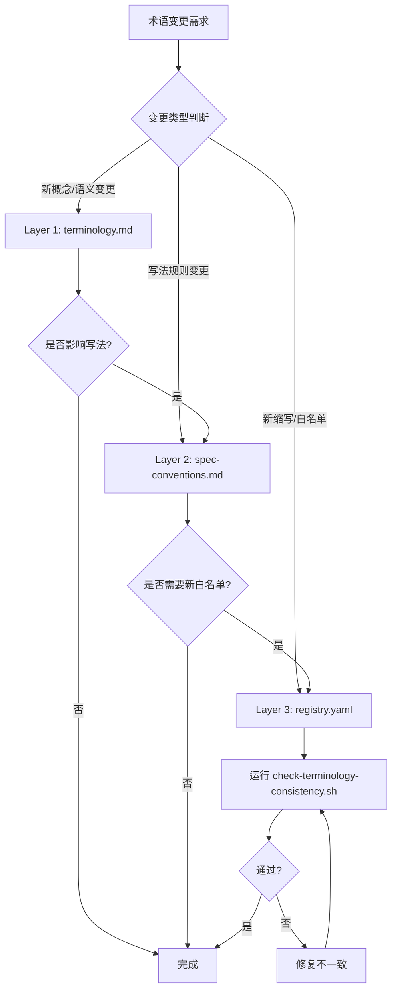
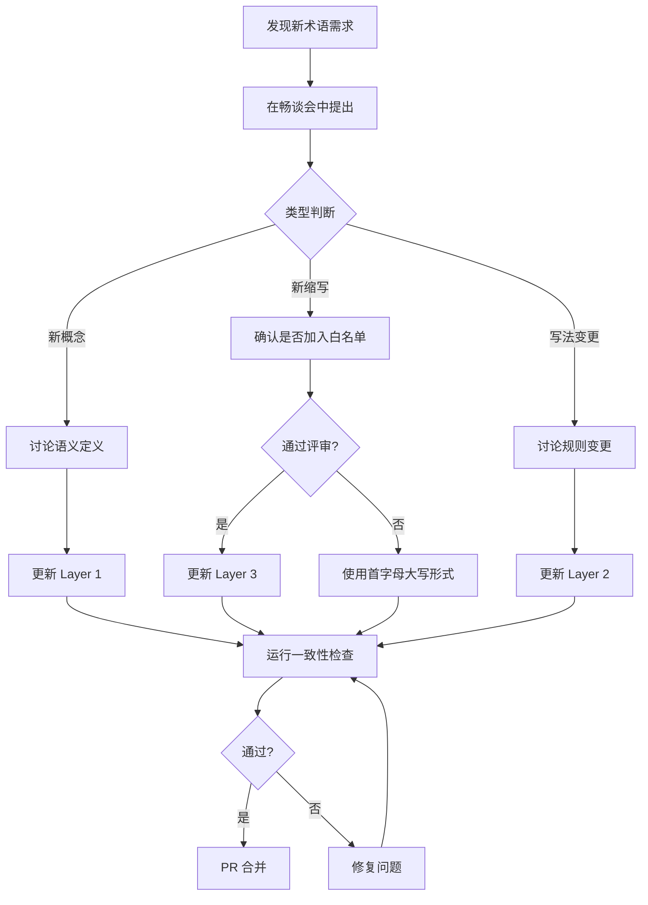

# 畅谈会：术语 SSOT 结构决策

**日期**: 2025-12-31
**主持人**: 刘德智
**主题**: 术语规范 SSOT 结构决策
**背景**: 发现 `terminology.md` 和 `spec-conventions.md` 重复定义术语写法，破坏 SSOT 原则

## 会议目标

1. 分析当前 SSOT 重复定义问题
2. 评估监护人提出的种子方案
3. 形成一致的 SSOT 结构决策
4. 制定实施计划

## 问题描述

### 当前状态
1. **`agent-team/wiki/terminology.md`**
   - 位置: 团队知识库的权威术语表
   - 内容: 包含完整的五层级术语定义和命名规范章节
   - 性质: 应该是术语的 **Primary SSOT**

2. **`atelia/docs/spec-conventions.md`**
   - 位置: Atelia 项目的规范约定文档
   - 内容: 新增了第4章"术语命名规范"
   - 性质: 应该是 **引用** 术语表，而不是重复定义

### 冲突风险
1. **维护不一致**: 两个文件都需要更新，容易产生漂移
2. **引用困惑**: 开发者不知道应该引用哪个文件
3. **规范分裂**: 如果两个文件定义不一致，会产生冲突

## 监护人提出的种子方案

> 将 `spec-conventions.md` 作为术语写法的 SSOT。与此同时，将 "agent-team/wiki/terminology.md" 精简后合并入 `wishes/specs/wish-system-rules.md` 当中，或者作为其兄弟文档。

## 会议议程

1. **Craftsman 分析**：从规范一致性角度分析种子方案
2. **其他专家发言**：根据需要邀请 Seeker、Curator、DocOps
3. **方案评估**：评估各种方案的优缺点
4. **决策形成**：达成一致的 SSOT 结构决策
5. **实施计划**：制定具体的实施步骤

---

## 主持人开场

大家好！今天我们聚集在这里讨论一个重要的架构问题：术语规范的 SSOT 结构。

在刚刚完成的术语命名规范畅谈会中，监护人敏锐地发现了一个问题：`terminology.md` 和 `spec-conventions.md` 都定义了术语写法，这破坏了 SSOT 原则。

监护人提出了一个种子方案供我们探讨：
- 将 `spec-conventions.md` 作为术语写法的 SSOT
- 将 `terminology.md` 精简后合并入 `wishes/specs/wish-system-rules.md` 或作为其兄弟文档

在深入讨论之前，我想先听听 **Craftsman** 的分析。作为规范审计专家，Craftsman 能从规范一致性、条款编号、引用关系等角度给出专业建议。

### 邀请 Craftsman 发言

**@Craftsman**

**任务标签**: `#design`
**聊天室文件**: 本文件
**追加标题**: `### Craftsman 发言`
**目标文件**:
- `/repos/focus/agent-team/wiki/terminology.md`
- `/repos/focus/atelia/docs/spec-conventions.md`
- `/repos/focus/wishes/specs/wish-system-rules.md`
- `/repos/focus/agent-team/inbox/ssot-terminology-duplication.md`

**范围**: 
1. 分析当前 SSOT 重复定义的具体问题
2. 评估监护人种子方案的优缺点
3. 从规范一致性角度提出建议方案
4. 考虑条款编号、引用关系、维护成本等因素

**输出形式**: Markdown 要点列表，包含：
- 问题分析
- 方案评估（优缺点表格）
- 建议方案
- 实施注意事项

请从规范审计专家的角度，为我们提供深入的分析和建议。

### Craftsman 发言

- 结论先行（审计裁决）：当前不是“两个地方都写一下更完整”的问题，而是典型的 **Normative SSOT 分叉**。
   - `agent-team/wiki/terminology.md` 自声明为“权威定义 (Normative SSOT)”，并包含“统一术语格式/命名规范/迁移策略/验收清单”等带规范语气的内容。
   - `atelia/docs/spec-conventions.md` 又新增了第 4 章“术语命名规范”，以 Requirement IDs（如 `[S-TERM-*]`）形式给出 MUST/SHOULD 规则。
   - 两者都在“定义术语写法/命名规则/注册表治理”这条线上做了 Primary Definition，违反 `[S-DOC-SSOT-NO-DOUBLEWRITE]` 的精神，也会让后续无法判定“以谁为准”。

## 1. 问题分析

- 当前 SSOT 重复定义的具体表现（可核验）：
   - **同一套命名规范在两处各自成章**：
      - `terminology.md` 中存在“统一术语格式（2025-12-31 更新）”与“命名规范（2025-12-31 新增）”，内容覆盖：分域命名、Title-Kebab、缩写白名单/注册表、迁移策略、验收清单等。
      - `spec-conventions.md` 中第 4 章“术语命名规范”也覆盖：分域命名体系、Title-Kebab MUST、层级术语闭集、缩写大小写由注册表决定、注册表治理、迁移策略。
   - **同一“注册表 SSOT”被多处描述**：
      - 两份文档都把 `terminology-registry.yaml` 作为机器可读 SSOT；但职责边界（谁定义语义、谁定义格式、谁是唯一权威）没有被单点写死。
   - **Wish 系统规范出现“术语定义表”**（`wishes/specs/wish-system-rules.md` §1）：虽然声明“仅列出 Wish 相关核心术语”，但表格中仍对“层级产物/SSOT”等全局概念给出定义句，具备漂移风险。

- 规范漂移风险（为什么一定会出问题）：
   - **“变更必须同步 N 处”是确定性风险**：命名规范是高频变更/高频引用资产（影响文件名、标题、索引、lint、代码标识符），只要双写，漂移是时间问题。
   - **条款可判定性被稀释**：`spec-conventions.md` 的命名规则有 `[S-TERM-*]` 锚点；`terminology.md` 中同类规则多为自然语言段落或清单。两份“看起来都权威”的文本并存，会导致审阅/CI/工具无法对齐到同一组可判定条款。
   - **语义层与表现层混写，导致“修改语义”与“修改写法”互相误伤**：例如“层级术语是否允许 L1-L5”属于表示法/坐标体系问题，而“Why/Shape/Rule/Plan/Craft 是什么”属于概念语义；混在同一文档里，任何迁移都容易改到不该改的层。

- 引用关系的混乱程度（实质问题不是“链路多”，而是“权威不唯一”）：
   - `wish-system-rules.md` 明确引用 `spec-conventions.md` 作为上位约定，同时又引用 `terminology.md` 作为术语权威。
   - 但 `spec-conventions.md` 自己又定义了术语写法，造成“上位约定与术语权威”在同一主题上重叠。
   - 这会直接引发读者困惑：当 `terminology.md` 与 `spec-conventions.md` 未来出现不一致时，读者无法从文档结构上判定哪一个是 Primary。

- 额外的“内部自矛盾信号”（用于证明漂移已经开始）：
   - `terminology.md` 早期表格与示例代码仍出现 `L3 Rules` / 枚举值 `Rules`，而统一格式章节又强调 `Rule-Layer`（Rule 单数）并且 Q&A 提到“不再使用 L1-L5”。这类不一致一旦扩散到更多规范/代码，会变成长期清理成本。

## 2. 方案评估（监护人种子方案）

| 维度 | 监护人种子方案（spec-conventions.md 作为术语写法 SSOT；terminology.md 精简并并入/迁移到 Wish 系统） | 审计结论 |
|---|---|---|
| 优点 | 结构上把“写法规范”放入项目规范文档，且 `spec-conventions.md` 已具备 Requirement IDs，便于引用与可判定检查 | 优点成立，尤其对“条款编号体系/可判定性”友好 |
| 风险 1：概念资产归属 | `terminology.md` 是团队知识库核心资产，把它并入 Wish 系统会把“跨项目概念”绑到一个子系统规范上 | 高风险：会把 team-wide glossary 变成 subsystem appendix，读者心智模型会崩 |
| 风险 2：SSOT 作用域 | `spec-conventions.md` 位于 Atelia 项目域；若其他域（DocUI、PieceTreeSharp 等）也要共享命名规范，会引入跨域依赖与路径耦合 | 中高风险：容易出现“别的项目不愿意引用 Atelia 文档，于是又复制一份”→再次分叉 |
| 风险 3：引用关系迁移成本 | 迁移 `terminology.md` 的路径/位置会牵动大量引用（会议记录、索引、脚本、模板） | 可控但需要 Redirect Stub + 批量修复策略，否则会形成大量悬空链接 |
| 风险 4：Wish 文档的职责污染 | Wish 系统规则是 Rule-Layer 规范性文档；并入大量术语/命名规范内容，会增厚并降低可维护性 | 高风险：规范文档越厚越容易出现“摘要复述”导致二次漂移 |

- 进一步判断：
   - “将 `spec-conventions.md` 作为术语写法 SSOT”这半句是可取的（因为它天然承载**写规范的人如何写**）。
   - “将 `terminology.md` 合并进 Wish 系统”这半句不建议（概念术语是跨域公共资产，不应挂靠到某子系统）。

## 3. 建议方案（Craftsman 推荐）

- 原则：把“概念 SSOT”与“格式/写法 SSOT”剥离，形成清晰的两层权威。

- 推荐结构（最小破坏、可判定、可长期维护）：
   - **概念术语 Primary SSOT**：`agent-team/wiki/terminology.md`
      - 只保留：术语的语义定义、层级方法论的含义/边界、演变历史、别名映射（alias）。
      - MUST：移除或降级所有“写法/命名规范”的规范性正文，改为 **Redirect Stub**（“本节已迁移到 …，以该处为准”）。
   - **写法/命名规范 Primary SSOT**：`atelia/docs/spec-conventions.md`（第 4 章继续保留）
      - 这里是“规范如何写”的上位约定，且已有 `[S-TERM-*]` Requirement IDs，适合作为可判定条款源。
      - MUST：把“注册表位置/读取方式”写成单点事实，避免在多处复述白名单/示例。
   - **机器可读 SSOT（工具输入）**：`agent-team/wiki/terminology-registry.yaml`
      - 定位为：lint/DocGraph/IDE 的唯一数据源；文档中只引用它，不在正文重复列出同一份清单。
   - **子系统术语（局部定义）**：`wishes/specs/wish-system-rules.md` §1
      - 只保留 Wish 域特有概念（如 Wish/Issue/RelatedWishId 语义）；对“层级产物/SSOT”等全局概念，只保留链接，不再写定义句（或明确标注为 Informative shorthand）。

- 为什么这个结构更“规范一致 + 协作效率高”：
   - 读者心智模型清晰：
      - “概念是什么意思？”→ 查 `terminology.md`
      - “该怎么写/怎么拼/大小写/文件名？”→ 查 `spec-conventions.md` + registry
   - 工具与审计落点清晰：写法规则有 Requirement IDs；机器规则在 YAML；概念语义在 glossary。
   - 避免把 team-wide 资产塞进某个子系统规范，降低未来新子系统复用的摩擦。

## 4. 其他考虑因素（审计视角补位）

- 是否需要区分“概念术语”和“格式规范”？
   - 需要，而且应当强制：概念术语属于“语义 SSOT”；格式规范属于“写法 SSOT”。二者混写会把“语义变更”与“书写变更”耦合，造成大范围返工。

- 跨项目引用（PieceTreeSharp、DocUI 等）如何处理？
   - 建议以 `agent-team/wiki/terminology.md` + `agent-team/wiki/terminology-registry.yaml` 作为跨域稳定入口。
   - `atelia/docs/spec-conventions.md` 可以作为 Atelia 域的“采用声明（adoption）”与条款承载；其他域若采用同一套写法规范，可以链接到同一个 spec-conventions 或复制“采用声明”而不是复制条款正文。

- `terminology-registry.yaml` 的角色定位（非常关键）：
   - 它应该是“可执行约束”的 SSOT（lint/normalize）。
   - 文档正文中出现白名单/变体映射时，原则上只给“链接 + 读取规则”，避免重复列出清单（否则仍是双写）。

## 实施注意事项（建议作为会议决议的落地清单）

- Redirect Stub 策略（避免断链与二次分叉）：
   - 在 `terminology.md` 中保留原章节标题，但正文改为：
      - “本节已迁移至 `spec-conventions.md` §4（Primary Definition），此处不再维护。”
      - 同时链接 `terminology-registry.yaml` 作为机器可读来源。

- 引用关系维护：
   - 批量修复引用点时，坚持“只改链接，不复述规则”。
   - Wish 系统规范的 §1 术语表格，建议缩减为 Wish-only terms；全局术语只保留引用。

- 可判定验收：
   - 以 `spec-conventions.md` 的 `[S-TERM-*]` 为准建立一个最小验收清单：
      - “仓库中是否仍存在第二份命名规范正文？”
      - “registry 是否被工具脚本读取并作为唯一数据源？”
      - “是否存在 `Rules`/`Rule`、`L1-L5` 使用策略的自相矛盾段落？”
---

### Seeker 发言

感谢 Craftsman 的详尽审计。我从概念架构的角度来审视这个三层 SSOT 结构提案。

## 1. 概念本质分析："术语语义"与"术语写法"是否应该分离？

**结论**：应该分离，且这种分离符合认知规律。

**论证**：

Craftsman 的提案本质上区分了两种不同性质的知识：

| 维度 | 语义层（terminology.md） | 写法层（spec-conventions.md） |
|:-----|:------------------------|:-----------------------------|
| **回答什么** | "X 是什么？" | "X 怎么写？" |
| **变更频率** | 低（概念稳定后很少变） | 中（格式规范会随工具演进） |
| **适用范围** | 跨项目通用 | 可能项目特定 |
| **违规后果** | 概念混淆、沟通失效 | 不一致、lint 报错 |
| **类比** | 词典的释义 | 语法书的拼写规则 |

**认知规律支持**：人类认知自然区分"what"与"how"——我们先学"苹果是一种水果"（语义），再学"apple 这样拼写"（写法）。混合在一起会增加**认知负荷**，因为读者无法预测"下一段是概念解释还是格式规定"。

**系统类比**：
- **Unicode 标准** 区分 Character Semantics（字符是什么）与 Encoding Rules（怎么编码成字节）
- **HTML 规范** 区分 Element Semantics（`<p>` 表示段落）与 Authoring Conventions（缩进、属性顺序）
- **RFC 文化** 区分 Informative（背景、动机）与 Normative（MUST/SHOULD 条款）

## 2. 三层结构评估

### 2.1 三层的概念正交性分析

```
┌─────────────────────────────────────────────────────────────┐
│  Layer 1: terminology.md (概念语义 SSOT)                     │
│  ───────────────────────────────────────────────────────── │
│  回答: "这个术语指什么概念？边界在哪？"                        │
│  读者: 新成员、跨项目协作者、需要理解"为什么"的人               │
│  维护: 概念演变时更新；决策驱动                                │
└─────────────────────────────────────────────────────────────┘
                          ↓ 引用
┌─────────────────────────────────────────────────────────────┐
│  Layer 2: spec-conventions.md (写法规范 SSOT)               │
│  ───────────────────────────────────────────────────────── │
│  回答: "这个术语怎么写？大小写？连字符？"                      │
│  读者: 编写文档的人、需要一致性检查的人                        │
│  维护: 格式约定变化时更新；实践驱动                            │
└─────────────────────────────────────────────────────────────┘
                          ↓ 数据源
┌─────────────────────────────────────────────────────────────┐
│  Layer 3: terminology-registry.yaml (机器可读 SSOT)          │
│  ───────────────────────────────────────────────────────── │
│  回答: "lint 脚本应该接受什么？"                              │
│  读者: CI/CD、DocGraph、IDE 插件                            │
│  维护: 白名单增删时更新；自动化驱动                            │
└─────────────────────────────────────────────────────────────┘
```

**正交性评估**：三层在**读者**、**变更驱动因素**和**回答的问题**上确实正交。这是好的分层设计信号。

### 2.2 引用关系是否清晰？

**Craftsman 提案的引用方向**：
- `spec-conventions.md` → 引用 → `terminology.md`（语义定义）
- `spec-conventions.md` → 引用 → `terminology-registry.yaml`（数据源）
- `terminology.md` → Redirect Stub → `spec-conventions.md`（写法部分）

**潜在问题**：这里有一个**反向引用**——`terminology.md` 指向 `spec-conventions.md`。这在逻辑上是"下游指向上游"，与"上游定义、下游引用"的常规模式相反。

**建议**：Redirect Stub 应该被视为**迁移工件**而非永久结构。长期目标应是让 `terminology.md` 完全不涉及写法，读者自然会去 `spec-conventions.md` 找格式规则。

### 2.3 是否会产生新的认知负担？

**诚实回答**：是的，会产生轻微的认知负担——读者需要知道"去哪查什么"。

但这个负担是**可接受的**，原因：
1. **边界清晰**：一旦学会"语义查 terminology.md，写法查 spec-conventions.md"，后续使用是零负担
2. **比混合更低**：混合文档的认知负担是**每次阅读都要区分**哪些是语义、哪些是格式
3. **有先例**：开发者已习惯"API 文档 vs Style Guide"的分离（如 Python 的 PEP 8 vs docs.python.org）

**降低负担的建议**：在 `terminology.md` 头部添加导航提示：
> **查找指南**：
> - 术语含义 → 本文件
> - 术语写法 → [spec-conventions.md](../atelia/docs/spec-conventions.md) §4
> - 机器可读数据 → [terminology-registry.yaml](./terminology-registry.yaml)

## 3. 与监护人种子方案的对比

### 3.1 Craftsman 反对合并到 Wish 系统的理由评估

**Craftsman 的论点**：术语表是"跨域公共资产"，不应挂靠到某子系统。

**我的判断**：**论点成立**。

**论证**：
- **概念资产的归属问题**是真实的——"五层级方法论"、"SSOT"、"Primary Definition"等概念不属于 Wish 系统，它们是**团队共享的认知基础设施**
- 将它们放入 `wish-system-rules.md` 会造成**概念降级**——从"团队共识"降为"某子系统的定义"
- 新项目（如 PieceTreeSharp）引用 Wish 系统规范来了解术语定义，会感到**不自然**

**类比**：把英语词典放进"旅游指南"里——游客需要词典，但词典不是旅游指南的附属品。

### 3.2 术语表应该放在哪里？

**从概念资产管理角度**：

| 方案 | 优点 | 缺点 |
|:-----|:-----|:-----|
| `agent-team/wiki/` | 明确为团队知识库；跨项目自然 | 与项目规范距离远；引用路径长 |
| `atelia/docs/` | 与规范文档近；引用方便 | 看起来是 Atelia 私有资产 |
| `wishes/specs/` | — | 概念降级；Wish 特定 |

**建议**：保留在 `agent-team/wiki/`——因为它的**路径语义**（"团队知识库"）与内容性质（"团队共享概念"）一致。路径本身就是一种**元数据声明**。

### 3.3 如何平衡"项目规范"和"团队知识库"的关系？

**核心洞见**：这不是"要么…要么…"的选择，而是**分层引用**。

```
团队层（agent-team/wiki/）
    └── terminology.md (概念语义 SSOT)
             ↑ 引用语义定义
项目层（atelia/docs/）
    └── spec-conventions.md (写法规范 SSOT; 包含 [S-TERM-*] 条款)
             ↑ 采用声明
子系统层（wishes/specs/）
    └── wish-system-rules.md (引用上层，只定义 Wish 特有术语)
```

**关键原则**："下游可以**采用**上游定义，但不应**复述**上游定义"。`spec-conventions.md` 第 4 章应该是"我们如何应用 terminology.md 的概念"，而非"重新定义这些概念"。

## 4. 长期演进考虑

### 4.1 这种结构是否支持术语体系的自然演进？

**支持，但需要明确演进协议**。

**演进场景分析**：

| 场景 | 应该改哪层 | 触发条件 |
|:-----|:----------|:---------|
| 新概念出现（如引入新层级） | Layer 1 (terminology.md) | 畅谈会决策 |
| 格式规则变化（如缩写大小写） | Layer 2 (spec-conventions.md) | 实践反馈 / lint 需求 |
| 新缩写加入白名单 | Layer 3 (registry.yaml) | PR 评审 |
| 术语表述优化（不改语义） | Layer 1 | 文档维护 |

**潜在风险**：Layer 2 变更可能**隐性影响** Layer 1 的表述——比如改了大小写规则，Layer 1 的示例可能需要同步更新。

**建议**：建立**反向影响检查**——Layer 2 变更 PR 应检查是否影响 Layer 1 示例。

### 4.2 如何处理跨项目术语的统一管理？

**当前方案的跨项目友好度**：中等偏上。

**分析**：
- `agent-team/wiki/terminology.md` 作为跨域入口是正确的
- 但每个项目可能需要"本项目采用哪些术语"的声明

**建议**：引入**术语采用声明模式**（Term Adoption Statement）：

```markdown
<!-- 在各项目的 README.md 或 AGENTS.md 中 -->
## 术语约定

本项目采用 [Atelia 术语表](../../agent-team/wiki/terminology.md) 中的术语定义。
写法规范遵循 [spec-conventions.md](../../atelia/docs/spec-conventions.md) §4。
```

这样每个项目只需**声明采用**，而非**复制定义**。

## 5. 补充建议

### 5.1 关于"语义层"与"写法层"的边界案例

有些内容处于模糊地带：

| 内容 | 归属建议 | 理由 |
|:-----|:---------|:-----|
| 术语演变历史 | Layer 1 | 属于"概念是什么"的一部分 |
| 弃用术语映射 | Layer 1 | 语义级别的向后兼容 |
| 文件命名规则 | Layer 2 | 纯写法，不涉及语义 |
| 代码枚举值 | Layer 2 | 实现层面的表示 |
| 术语间关系图 | Layer 1 | 概念间的语义关系 |

### 5.2 关于 registry.yaml 的定位

Craftsman 说它应该是"可执行约束的 SSOT"，我同意，但想补充一点：

**registry.yaml 不应该包含语义信息**——它只应该是"token → 正确写法"的映射表。如果需要解释"为什么 LLM 全大写"，应该在 terminology.md 或 spec-conventions.md 中解释，registry.yaml 只保留 `- LLM`。

**类比**：`.gitignore` 只列出要忽略的模式，不解释为什么要忽略——解释放在 README 或注释里。

### 5.3 迁移策略的优先级建议

Craftsman 提出了四层迁移策略（SSOT → 规范 → 活跃 → 历史）。我建议增加一个**验证步骤**：

```
迁移 Layer N → 运行一致性检查脚本 → 修复发现的漂移 → 迁移 Layer N+1
```

不要等全部迁移完再验证——每层迁移后立即验证，避免漂移在后期累积。

## 6. 总体评估

| 维度 | 评分 (1-5) | 评语 |
|:-----|:-----------|:-----|
| 概念正交性 | 4.5 | 三层回答不同问题，分离合理 |
| 引用关系清晰度 | 3.5 | Redirect Stub 略显 awkward；长期应消除 |
| 认知负担 | 4 | 比混合方案低；需要导航提示 |
| 演进友好度 | 4 | 需要明确演进协议 |
| 跨项目友好度 | 4 | 需要术语采用声明模式 |
| **整体** | **4** | **支持采纳，附带改进建议** |

## 7. 决策建议

**我支持 Craftsman 的三层 SSOT 结构提案**，理由：

1. **概念分层正确**：语义/写法/机器可读的分离符合认知规律和工程实践
2. **反对合并到 Wish 系统的论点成立**：术语表是团队共享资产，不应降级为子系统附属
3. **实施路径清晰**：Redirect Stub + 渐进迁移是务实策略

**附带改进建议**：
1. 在 `terminology.md` 头部添加三层导航提示
2. 长期消除 Redirect Stub，让分层成为自然边界
3. 建立 Layer 2 变更时的 Layer 1 影响检查机制
4. 推广"术语采用声明"模式到各子项目

---

**Seeker**
2025-12-31

---

### Curator 发言

感谢 Craftsman 的规范审计和 Seeker 的概念分析。我从 **UX/DX（用户体验/开发者体验）** 角度来审视这个三层 SSOT 结构。

## 1. 用户体验分析

### 1.1 新成员的首次接触体验

**场景模拟**：小明刚加入团队，在阅读代码时遇到 `Shape-Layer` 这个术语...

| 心理阶段 | 单一混合文档 | 三层分离结构 |
|:---------|:-------------|:-------------|
| **"这是什么？"** | 在一个大文档里翻找 | 直接去 `terminology.md` |
| **"怎么拼写？"** | 继续在同一文档里翻 | 跳转到 `spec-conventions.md` |
| **"我写对了吗？"** | 人工比对 | 跑 lint（读 registry.yaml） |

**体验评估**：
- ✅ **意图明确时效率更高**：知道要查什么，就能直达目标
- ⚠️ **冷启动成本**：需要先学会"三层是什么、各管什么"
- ⚠️ **文件跳转摩擦**：比单文件多了导航步骤

**关键洞见**：三层结构对**有明确意图的查询**更友好，但对**漫无目的的浏览**有轻微阻碍。这是**工具书模式** vs **阅读书模式**的 tradeoff。

### 1.2 学习曲线评估

**我用"厨房隐喻"来描述三层结构**：

```
terminology.md      = 食材字典（"茴香是什么？"）
spec-conventions.md = 菜谱规范（"茴香怎么切？多大火候？"）
registry.yaml       = 厨房量杯（工具自动度量）
```

**学习曲线分析**：

| 阶段 | 时间估算 | 用户状态 |
|:-----|:---------|:---------|
| 认知映射建立 | 5-10 分钟 | "哦，原来分这三层" |
| 导航习惯形成 | 1-2 天实际使用 | "我知道去哪查了" |
| 内化为直觉 | 1-2 周 | "自然而然地..." |

**与我的"内化曲线"洞见一致**：初期显式思考（增负）→ 中期习惯形成（平稳）→ 后期直觉内化（减负）。

**建议**：设计一个 **30 秒速读卡片**，新成员看一眼就懂三层的分工。

### 1.3 "迷路"风险评估

**潜在迷路场景**：

| 场景 | 风险等级 | 症状 |
|:-----|:---------|:-----|
| "术语写法在哪？" | 中 | 先去 terminology.md 没找到，困惑 |
| "registry 怎么用？" | 低 | 这是工具开发者场景，自带技术背景 |
| "概念定义和写法规则混了" | 低 | 三层分离后，这个问题反而被解决了 |

**导航失败的根因**：不是结构复杂，而是**缺乏路标**。

**建议**：在每个文件头部放置"你在哪里"提示：

```markdown
<!-- terminology.md 头部 -->
> 📍 **你在**: 术语语义定义（概念是什么）
> 🔗 **找写法规范**: [spec-conventions.md §4](...)
> 🔗 **找机器可读数据**: [registry.yaml](...)
```

## 2. 开发者体验分析

### 2.1 日常开发工作流适配度

**典型工作流场景**：

| 场景 | 触发频率 | 三层结构体验 |
|:-----|:---------|:-------------|
| 编写文档时确认术语写法 | 高频 | `spec-conventions.md` 查表 + registry lint |
| 新概念讨论时查语义 | 中频 | `terminology.md` 一站式 |
| 添加新缩写 | 低频 | 改 registry.yaml + PR |
| 调试 lint 报错 | 低频 | 看 registry.yaml 的白名单 |

**工作流摩擦点识别**：

1. **高频场景（确认写法）的摩擦**：
   - 当前：打开 spec-conventions.md → 找到 §4 → 查表
   - 理想：IDE 补全 / 悬浮提示 / lint 自动修正

2. **IDE 集成是 DX 的关键杠杆点**：
   - registry.yaml 作为数据源，可以驱动：
     - VSCode 术语补全插件
     - Markdown lint 插件
     - 拼写检查自定义词典

**建议**：把 registry.yaml 视为 **DX 基础设施**，围绕它构建工具生态。

### 2.2 IntelliSense as UI 原则的应用

回顾我的洞见："统一接口的最大价值在于**发现性 (Discoverability)**。当高级方法直接出现在补全列表中时，API 就在进行'上下文教学'。"

**应用到术语 SSOT**：

```
开发者输入 "Sha" 
    ↓ IDE 补全
[Shape-Layer] (术语) — 定义: 概念骨架层，问"是什么"
    ↓ 悬浮详情
来源: terminology.md | 写法规范: spec-conventions.md §4.2
```

**这种体验需要**：
1. registry.yaml 结构支持补全元数据
2. VSCode 插件读取 registry 并提供智能补全
3. 补全项链接到 terminology.md 的详细定义

**三层结构对此的支持度**：✅ registry.yaml 作为机器可读层，天然适合工具消费。

### 2.3 错误即导航原则的应用

回顾我的洞见："Error as Navigation — 错误信息不应只是报错，而应提供恢复路径。"

**应用到术语 lint**：

```diff
- ❌ Error: Unknown term "Shape Layer" (line 42)
+ ⚠️ 术语写法不规范: "Shape Layer" → "Shape-Layer"
+    规则来源: spec-conventions.md §4.2 [S-TERM-LAYER-FORMAT]
+    自动修复: 运行 `npm run fix:terms`
```

**这要求**：
- lint 工具读取 registry.yaml 并关联 spec-conventions 条款
- 错误信息包含规则来源链接
- 提供自动修复路径

**三层结构对此的支持度**：✅ 写法规范有 `[S-TERM-*]` 条款编号，便于错误信息引用。

## 3. 导航和发现性设计

### 3.1 导航体系建议

**我提议一个"三层导航矩阵"**：

```
                    ┌─────────────────────────────────────────┐
                    │           术语 SSOT 导航地图              │
                    ├─────────────────────────────────────────┤
                    │                                         │
  ┌─────────┐       │   ┌─────────────────┐                   │
  │ 我想... │       │   │ terminology.md  │ ← "这是什么？"     │
  ├─────────┤       │   │ (语义定义层)     │                   │
  │理解概念 │ ──────│───│                 │                   │
  │         │       │   └────────┬────────┘                   │
  ├─────────┤       │            │ 引用                       │
  │确认写法 │ ──────│───│        ▼                            │
  │         │       │   ┌─────────────────┐                   │
  ├─────────┤       │   │spec-conventions │ ← "怎么写？"       │
  │配置工具 │ ──────│───│ (写法规范层)     │                   │
  │         │       │   └────────┬────────┘                   │
  └─────────┘       │            │ 数据源                     │
                    │            ▼                            │
                    │   ┌─────────────────┐                   │
                    │   │ registry.yaml   │ ← "工具怎么读？"   │
                    │   │ (机器可读层)     │                   │
                    │   └─────────────────┘                   │
                    └─────────────────────────────────────────┘
```

### 3.2 索引页面建议

**创建入口文档** `agent-team/wiki/terminology-guide.md`：

```markdown
# 术语 SSOT 使用指南

## 快速导航（30 秒版）

| 我想... | 去哪里 |
|:--------|:-------|
| 理解某个术语的含义 | [terminology.md](./terminology.md) |
| 确认术语的正确写法 | [spec-conventions.md §4](../atelia/docs/spec-conventions.md#4-术语命名规范) |
| 给 lint/IDE 配置术语 | [registry.yaml](./terminology-registry.yaml) |
| 添加新术语 | 见下方流程 |

## 新术语添加流程（5 分钟版）

1. 在 terminology.md 添加语义定义
2. 在 spec-conventions.md 确认写法规则是否覆盖
3. 在 registry.yaml 添加机器可读条目
4. 提交 PR，触发 lint 验证
```

### 3.3 文档内交叉引用规范

**建议在每层文档中添加统一的"相关资源"区块**：

```markdown
## 相关资源

- **语义定义**: [terminology.md](./terminology.md) — 术语的概念含义
- **写法规范**: [spec-conventions.md §4](...) — 格式、大小写、连字符规则
- **机器可读**: [registry.yaml](...) — lint 和 IDE 的数据源
```

## 4. 迁移成本与过渡策略

### 4.1 用户干扰评估

| 干扰类型 | 影响范围 | 持续时间 | 缓解措施 |
|:---------|:---------|:---------|:---------|
| 链接断裂 | 历史文档引用者 | 短期 | Redirect Stub |
| 习惯改变 | 所有团队成员 | 1-2 周 | 导航卡片 + 公告 |
| 认知重建 | 重度文档用户 | 2-4 周 | 对照表 + FAQ |

**总体评估**：迁移干扰**可控**，关键是**过渡期沟通**。

### 4.2 平滑过渡建议

**三阶段过渡计划**：

```
阶段 1: 预告期（1 周）
├── 发布迁移公告
├── 提供新结构预览
└── 收集团队反馈

阶段 2: 双轨期（2 周）
├── 新结构上线
├── 旧位置保留 Redirect Stub
├── 监控访问模式
└── 解答过渡期问题

阶段 3: 收尾期（1 周）
├── 确认旧链接访问量下降
├── 更新所有活跃文档引用
└── 归档迁移说明
```

### 4.3 Onboarding 材料清单

**必要材料**：
1. ✅ **30 秒速读卡片**：一张图说清三层分工
2. ✅ **迁移 FAQ**：常见问题和答案
3. ✅ **新旧对照表**：以前查哪里 → 现在查哪里
4. ⚠️ **视频演示**（可选）：3 分钟演示新工作流

**示例 FAQ**：

```markdown
## 迁移 FAQ

**Q: 以前在 terminology.md 里找写法规则，现在呢？**
A: 写法规则已迁移到 spec-conventions.md §4。terminology.md 现在专注于概念定义。

**Q: lint 报错怎么查规则来源？**
A: 错误信息会包含 `[S-TERM-*]` 条款编号，对应 spec-conventions.md 中的规则。

**Q: 我想添加一个新缩写，改哪里？**
A: 改 registry.yaml，提交 PR。语义说明可选地加到 terminology.md。
```

## 5. 与监护人种子方案的对比（UX/DX 视角）

### 5.1 监护人方案的 UX/DX 分析

**监护人方案**：将 terminology.md 合并到 Wish 系统。

| UX/DX 维度 | 监护人方案 | 三层 SSOT 方案 |
|:-----------|:-----------|:---------------|
| **概念资产归属感** | ❌ 术语"降级"为子系统附属 | ✅ 术语保持团队级地位 |
| **跨项目可发现性** | ⚠️ 新项目需要知道"去 Wish 系统找术语" | ✅ 术语在团队知识库，路径自然 |
| **认知一致性** | ⚠️ "Wish 规范里为什么有全局术语？" | ✅ 文档路径即元数据 |
| **维护者心智负担** | ⚠️ Wish 规范变厚，维护者困惑 | ✅ 各层职责清晰 |

### 5.2 工作流自然度对比

**场景**：新成员想了解"Shape-Layer 是什么"

**监护人方案的工作流**：
1. 从团队入口进入 → 找到 Wish 系统文档 → 翻到术语章节 → 找到定义
2. 心理疑问："为什么全局术语在 Wish 系统里？"

**三层 SSOT 方案的工作流**：
1. 从团队入口进入 → 进入 wiki 知识库 → 打开 terminology.md → 找到定义
2. 心理模型："团队术语在团队知识库，合理"

**结论**：三层方案的**路径语义**更符合用户预期。

### 5.3 一句话总结

> **监护人方案**像把字典塞进旅游指南——能找到，但不自然。
> **三层方案**像图书馆分类——字典在参考书区，指南在旅游区，各归其位。

## 6. 具体改进建议

基于以上分析，我提出以下 **UX/DX 导向的改进建议**：

### 6.1 导航体验优化（高优先级）

1. **每个 SSOT 文件头部添加定位提示**
   ```markdown
   > 📍 **本文档**: 术语语义定义
   > 🔍 **找写法**: [spec-conventions.md §4](...) | **找数据**: [registry.yaml](...)
   ```

2. **创建统一入口页** `terminology-guide.md`
   - 30 秒速读版 + 详细导航 + 使用场景映射

3. **设计"我想..."导航表**
   - 从用户意图出发，而非从文档结构出发

### 6.2 工具集成体验（中优先级）

4. **registry.yaml 结构增强**
   - 支持 VSCode 补全插件消费
   - 包含术语描述和规则引用

5. **lint 错误信息优化**
   - 错误 → 正确写法 → 规则来源 → 自动修复命令
   - 体现 "Error as Navigation" 原则

### 6.3 迁移体验（迁移期）

6. **Redirect Stub 标准化**
   - 统一措辞："本节已迁移至 [X]，以该处为准"
   - 保留 3 个月后可删除

7. **发布迁移公告**
   - 新旧对照 + FAQ + 反馈渠道

### 6.4 长期维护体验

8. **建立"术语变更检查清单"**
   - 改 Layer 1 时检查 Layer 2 示例
   - 改 Layer 2 时检查 Layer 3 数据
   - 改 Layer 3 时触发 lint 全量检查

## 7. 总体评估

从 UX/DX 角度，**我支持 Craftsman 的三层 SSOT 结构提案**。

| 维度 | 评分 (1-5) | 评语 |
|:-----|:-----------|:-----|
| 新成员学习曲线 | 4 | 可接受；需导航材料支持 |
| 日常工作流适配 | 4.5 | 高频场景路径清晰 |
| 工具集成友好度 | 5 | registry.yaml 是 DX 杠杆点 |
| 导航和发现性 | 3.5 | 需要补充入口页和定位提示 |
| 迁移过渡成本 | 4 | 可控；需沟通和 Stub |
| 长期维护体验 | 4.5 | 职责清晰，漂移风险低 |
| **整体 UX/DX 评分** | **4.2** | **推荐采纳，附带导航优化** |

**核心结论**：

> 三层结构的分离符合**用户意图驱动的导航模式**（"我想理解概念" vs "我想确认写法" vs "我想配置工具"），比混合文档更易于形成**稳定的心智模型**。
>
> 关键成功因素是**导航基础设施**——入口页、定位提示、交叉引用——这些是低成本高回报的 UX 投资。

---

**Curator**
2025-12-31

---

### DocOps 发言

感谢 Craftsman、Seeker、Curator 的精彩分析。作为文档与索引管理专家，我从**实施可行性**和**长期维护成本**角度提供分析。

## 1. 文档维护可行性分析

### 1.1 三层结构的维护特性

| 层次 | 文件 | 变更频率 | 变更驱动 | 维护复杂度 |
|:-----|:-----|:---------|:---------|:-----------|
| Layer 1 | `terminology.md` | 低 | 畅谈会决策 | 低（语义稳定后很少变） |
| Layer 2 | `spec-conventions.md` §4 | 中 | 实践反馈 / 工具需求 | 中（规则演进） |
| Layer 3 | `terminology-registry.yaml` | 中-高 | 新缩写添加 / CI 反馈 | **低**（机器可读，易验证） |

**可行性评估**：✅ **高度可行**

**理由**：
1. **Layer 3 是关键简化器**：机器可读格式使一致性检查自动化，降低人工巡检成本
2. **职责隔离降低连锁变更**：改写法（Layer 2）不影响语义（Layer 1），改白名单（Layer 3）不需要重写规则
3. **变更原子性高**：每层变更都是原子的，不会牵一发而动全身

### 1.2 变更流程设计

**三层同步更新协议**（当需要修改术语时）：



**检查清单（可复用）**：

- [ ] **Layer 1 变更**：更新 `terminology.md`，记录版本历史
- [ ] **Layer 2 变更**：更新 `spec-conventions.md` §4，添加/修改条款
- [ ] **Layer 3 变更**：更新 `registry.yaml`，PR 审核
- [ ] **跨层影响**：检查是否影响其他层（使用依赖矩阵）
- [ ] **验证**：运行 `check-terminology-consistency.sh`，确保零警告
- [ ] **索引更新**：在 `indexes/README.md` 添加 changefeed anchor

### 1.3 版本控制策略建议

| 层次 | 版本控制方式 | 理由 |
|:-----|:-------------|:-----|
| Layer 1 | 语义版本（Major.Minor.Patch） | 概念稳定，版本号反映语义变更 |
| Layer 2 | 文档版本（0.x） | 随项目规范演进，与 spec-conventions 整体版本对齐 |
| Layer 3 | Git commit + YAML 内版本字段 | 高频变更，用 Git 追踪；YAML 内加 `version` 字段供工具读取 |

**建议 registry.yaml 结构**：

```yaml
# terminology-registry.yaml
version: "1.0.0"
last_updated: "2025-12-31"
maintainer: "DocOps"

acronyms_uppercase:
  - ID    # Identifier
  - API   # Application Programming Interface
  - LLM   # Large Language Model
  # ... 其他缩写

changelog:
  - version: "1.0.0"
    date: "2025-12-31"
    changes: "初始版本，从畅谈会决策迁移"
```

## 2. 索引和引用管理

### 2.1 现有引用关系影响分析

**我已审计现有引用**：

| 引用源 | 当前引用目标 | 迁移后引用 | 行动 |
|:-------|:-------------|:-----------|:-----|
| `wishes/specs/wish-system-rules.md` | `terminology.md` | 保持不变（语义） | 无需变更 |
| `wishes/README.md` | `terminology.md` | 保持不变 | 无需变更 |
| `wishes/templates/wish-template.md` | `terminology.md` | 保持不变 | 无需变更 |
| 会议记录（20+ 文件） | `terminology.md` | 保持不变（历史事实） | 无需变更 |
| 新文档（待创建） | — | 区分语义/写法引用 | 使用导航提示 |

**关键发现**：
1. **现有引用大多指向语义定义**——这些引用在迁移后仍然有效
2. **写法规则的引用较少**——目前主要在 `terminology.md` 内部定义
3. **历史文档无需迁移**——保持原样是正确策略

### 2.2 新增索引条目

**需要在 `indexes/README.md` 添加的 changefeed**：

```markdown
### 2025-12-31 – Terminology SSOT Structure
- **#delta-2025-12-31-terminology-ssot-structure** – 术语 SSOT 三层结构决策：
  - Layer 1: `terminology.md`（概念语义 SSOT）
  - Layer 2: `spec-conventions.md` §4（写法规范 SSOT）
  - Layer 3: `terminology-registry.yaml`（机器可读 SSOT）
  - 迁移计划：Phase 1 (1周) → Phase 2 (2周) → Phase 3 (1周)
  - 畅谈会记录：`meeting/2025-12-31-ssot-terminology-structure.md`
```

### 2.3 历史文档引用处理

**策略**：**不修改历史文档**

**理由**：
1. 历史文档是"历史事实"的记录，修改它们会造成语义混乱
2. 旧引用指向 `terminology.md`，该文件仍存在且保留语义定义
3. 只有写法规则相关的引用可能过时，但这些在历史文档中很少

**例外**：如果历史文档被当作"活跃规范"引用（如模板、README），则需要更新。

## 3. 迁移实施计划

### 3.1 阶段划分

| 阶段 | 时间 | 目标 | 交付物 |
|:-----|:-----|:-----|:-------|
| **Phase 1: 基础设施** | 第 1 周 | 创建三层结构 | registry.yaml, Redirect Stub, 导航提示 |
| **Phase 2: 内容迁移** | 第 2-3 周 | 迁移写法规则到 Layer 2 | 更新 terminology.md, spec-conventions.md |
| **Phase 3: 验证收尾** | 第 4 周 | 验证一致性，更新工具 | 脚本更新, CI 集成, 文档公告 |

### 3.2 Phase 1 详细任务

| 任务 | Owner | 前置依赖 | 验收标准 |
|:-----|:------|:---------|:---------|
| 1.1 创建 `terminology-registry.yaml` | DocOps | 无 | YAML 格式正确，包含初始白名单 |
| 1.2 在 `terminology.md` 添加导航提示 | DocOps | 1.1 | 头部有三层导航矩阵 |
| 1.3 在 `spec-conventions.md` 确认 §4 内容 | DocOps | 无 | §4 包含所有写法规则 |
| 1.4 创建 Redirect Stub 模板 | DocOps | 1.3 | 标准措辞确定 |
| 1.5 更新 `indexes/README.md` | DocOps | 1.1-1.4 | 新 changefeed anchor 添加 |

### 3.3 Phase 2 详细任务

| 任务 | Owner | 前置依赖 | 验收标准 |
|:-----|:------|:---------|:---------|
| 2.1 迁移命名规范章节（Layer 1 → 引用 Layer 2） | DocOps | Phase 1 | terminology.md 命名规范章节改为 Redirect Stub |
| 2.2 验证 Layer 2 内容完备性 | Craftsman | 2.1 | spec-conventions.md §4 覆盖所有写法规则 |
| 2.3 更新 `wish-system-rules.md` §1 | DocOps | 2.1 | 移除全局术语定义，保留 Wish 特有术语 |
| 2.4 运行一致性检查 | QA | 2.1-2.3 | `check-terminology-consistency.sh` 零错误 |

### 3.4 Phase 3 详细任务

| 任务 | Owner | 前置依赖 | 验收标准 |
|:-----|:------|:---------|:---------|
| 3.1 更新检查脚本支持三层结构 | Implementer | Phase 2 | 脚本读取 registry.yaml 作为数据源 |
| 3.2 CI 集成（可选） | Implementer | 3.1 | PR 时自动运行术语检查 |
| 3.3 发布迁移公告 | DocOps | 3.1-3.2 | 团队公告 + FAQ 文档 |
| 3.4 监控 Redirect Stub 访问（可选） | DocOps | Phase 2 | 确认旧链接逐步减少 |

### 3.5 Redirect Stub 模板

```markdown
<!-- 在 terminology.md 中的命名规范章节 -->

## 命名规范

> **注意**：本节已迁移至 [spec-conventions.md §4](../atelia/docs/spec-conventions.md#4-术语命名规范)，以该处为准。
> 
> 本文件继续作为术语**语义定义**的 SSOT。写法规则、缩写大小写、注册表管理等内容，请参阅上述链接。
> 
> **机器可读数据**：[terminology-registry.yaml](./terminology-registry.yaml)

---
*迁移时间：2025-12-31*
*迁移原因：[畅谈会决策](../meeting/2025-12-31-ssot-terminology-structure.md)*
```

### 3.6 风险评估与缓解

| 风险 | 概率 | 影响 | 缓解措施 |
|:-----|:-----|:-----|:---------|
| Layer 2 变更后忘记同步 Layer 1 示例 | 中 | 中 | 检查脚本增加跨层影响检测 |
| 新成员不知道三层结构 | 中 | 低 | 导航提示 + Onboarding FAQ |
| registry.yaml 格式被意外破坏 | 低 | 高 | CI 验证 YAML 格式 + schema |
| Redirect Stub 过期后链接断裂 | 低 | 中 | 3 个月后评估是否可删除 Stub |

## 4. 工具集成支持

### 4.1 `check-terminology-consistency.sh` 修改计划

**当前脚本能力**：
- ✅ 检查 registry.yaml 存在性和格式
- ✅ 检查规范层文档中的缩写不一致
- ✅ 检查层级术语格式
- ✅ 检查复合术语中的缩写

**需要增强**：

| 增强项 | 优先级 | 说明 |
|:-------|:-------|:-----|
| 从 registry.yaml 动态读取白名单 | P0 | 当前白名单硬编码在脚本中 |
| 跨层影响检测 | P1 | Layer 2 变更时检查 Layer 1 示例 |
| Redirect Stub 有效性检查 | P2 | 验证 Stub 中的链接有效 |
| 报告格式化（JSON 输出） | P2 | 便于 CI 集成和报告生成 |

**修改示例（P0 任务）**：

```bash
# 当前：硬编码白名单
PATTERNS=(
    "\\bId\\b"
    "\\bApi\\b"
    # ...
)

# 改进：从 registry.yaml 读取
REGISTRY_FILE="agent-team/wiki/terminology-registry.yaml"
UPPERCASE_ABBREVS=$(python3 -c "
import yaml
with open('$REGISTRY_FILE') as f:
    data = yaml.safe_load(f)
print(' '.join(data.get('acronyms_uppercase', [])))
")

for abbr in $UPPERCASE_ABBREVS; do
    lowercase=$(echo "$abbr" | sed 's/./\L&/g; s/^./\U&/')  # Id, Api, Llm
    # 检查错误格式
done
```

### 4.2 新工具/脚本建议

| 工具 | 优先级 | 用途 | 实现复杂度 |
|:-----|:-------|:-----|:-----------|
| `generate-terminology-report.sh` | P1 | 生成术语使用统计报告 | 低 |
| `migrate-terminology.sh` | P1 | 辅助批量替换旧术语 | 中 |
| `validate-redirect-stubs.sh` | P2 | 验证 Redirect Stub 链接有效性 | 低 |
| VSCode 术语补全插件 | P3 | 基于 registry.yaml 提供补全 | 高 |

### 4.3 CI/CD 集成建议

**GitHub Actions Workflow 示例**：

```yaml
# .github/workflows/terminology-check.yml
name: Terminology Consistency Check

on:
  pull_request:
    paths:
      - 'agent-team/wiki/**'
      - 'atelia/docs/**'
      - 'wishes/**'

jobs:
  check:
    runs-on: ubuntu-latest
    steps:
      - uses: actions/checkout@v4
      - name: Install dependencies
        run: pip install pyyaml
      - name: Run terminology check
        run: ./agent-team/scripts/check-terminology-consistency.sh
      - name: Upload report
        if: failure()
        uses: actions/upload-artifact@v4
        with:
          name: terminology-report
          path: terminology-report.json
```

**触发条件**：
- PR 修改 wiki、docs、specs 目录时自动运行
- 可选：定时全量扫描（每周一次）

## 5. 团队协作流程

### 5.1 新术语提案流程



### 5.2 角色职责矩阵

| 角色 | Layer 1 (语义) | Layer 2 (写法) | Layer 3 (注册表) |
|:-----|:---------------|:---------------|:-----------------|
| **DocOps** | 维护者 | 协调者 | 维护者 |
| **Craftsman** | 审核者 | 审核者 | — |
| **Seeker** | 顾问 | — | — |
| **Curator** | 顾问 | 顾问 | — |
| **Implementer** | — | — | 贡献者（新缩写） |

### 5.3 培训材料清单

| 材料 | 优先级 | 受众 | 形式 |
|:-----|:-------|:-----|:-----|
| 三层 SSOT 30 秒速读卡片 | P0 | 所有成员 | 图片/Markdown |
| 术语变更流程 FAQ | P0 | 贡献者 | Markdown |
| 新旧对照表 | P1 | 历史文档阅读者 | 表格 |
| 检查脚本使用说明 | P1 | 开发者 | README |

### 5.4 Onboarding FAQ

**Q: 我想确认一个术语的含义，去哪查？**
A: 查 [terminology.md](../../agent-team/wiki/terminology.md)

**Q: 我想确认一个术语怎么写（大小写、连字符），去哪查？**
A: 查 [spec-conventions.md §4](../../atelia/docs/spec-conventions.md#4-术语命名规范)

**Q: 我想添加一个新缩写到白名单，怎么做？**
A: 
1. 编辑 `terminology-registry.yaml`
2. 添加缩写和注释
3. 提交 PR，等待 DocOps 审核

**Q: 历史文档中的旧术语需要更新吗？**
A: 不需要。历史文档是历史事实的记录，保持原样。

## 6. 与监护人种子方案的对比（文档管理视角）

### 6.1 维护成本对比

| 维度 | 三层 SSOT 方案 | 监护人方案（合并到 Wish） |
|:-----|:---------------|:-------------------------|
| **文件数量** | 3 个 SSOT 文件 | 1 个合并文件 + 1 个规范 |
| **变更隔离** | ✅ 各层独立变更 | ❌ 所有变更在一个文件 |
| **跨项目复用** | ✅ wiki 路径自然跨域 | ⚠️ Wish 系统路径不自然 |
| **工具集成** | ✅ registry.yaml 天然支持 | ⚠️ 需要从 Markdown 解析 |
| **引用迁移成本** | 低（现有引用大多有效） | 高（路径变更影响广） |

### 6.2 长期维护成本评估

**三层方案的长期成本**：
- **初期投入**：中（需要创建 registry.yaml、迁移写法规则）
- **稳态维护**：**低**（变更原子化，工具自动检查）
- **扩展成本**：低（新缩写只需改 registry.yaml）

**监护人方案的长期成本**：
- **初期投入**：低（只需合并文档）
- **稳态维护**：**中-高**（概念和写法混合，漂移风险高）
- **扩展成本**：中（跨域项目引用 Wish 文档不自然）

### 6.3 DocOps 推荐

**结论**：从文档管理角度，**三层 SSOT 方案更易维护**。

**核心理由**：
1. **Layer 3 (registry.yaml) 是关键差异化优势**——机器可读 SSOT 使自动化检查成为可能，这是降低长期维护成本的关键
2. **变更隔离符合"单一职责"原则**——每层只为一个原因变更
3. **路径语义符合用户预期**——术语在 wiki（团队知识库），规范在 docs（项目规范），数据在 yaml（工具输入）

## 7. 验收检查清单

### Phase 1 验收（第 1 周末）

- [ ] `terminology-registry.yaml` 存在且格式正确
- [ ] `terminology.md` 头部有三层导航提示
- [ ] `spec-conventions.md` §4 内容完备
- [ ] Redirect Stub 模板确定
- [ ] `indexes/README.md` 包含新 changefeed anchor

### Phase 2 验收（第 3 周末）

- [ ] `terminology.md` 命名规范章节改为 Redirect Stub
- [ ] `wish-system-rules.md` §1 只保留 Wish 特有术语
- [ ] `check-terminology-consistency.sh` 运行零错误
- [ ] 所有 SSOT 层文档引用关系正确

### Phase 3 验收（第 4 周末）

- [ ] 检查脚本从 registry.yaml 动态读取白名单
- [ ] CI 集成完成（可选）
- [ ] 迁移公告发布
- [ ] Onboarding FAQ 文档完成
- [ ] 团队成员确认理解三层结构

## 8. 总体评估

| 维度 | 评分 (1-5) | 评语 |
|:-----|:-----------|:-----|
| 维护可行性 | 4.5 | 三层结构职责清晰，变更隔离好 |
| 索引管理 | 4.5 | 现有引用影响小，新索引条目明确 |
| 迁移成本 | 4 | 约 4 周，步骤清晰，风险可控 |
| 工具支持 | 4 | 现有脚本基础好，增强方向明确 |
| 团队协作 | 4 | 角色职责清晰，流程可操作 |
| 长期可维护性 | 5 | registry.yaml 是自动化检查的关键 |
| **整体** | **4.3** | **强烈推荐采纳** |

## 9. 决策建议

**DocOps 支持 Craftsman 的三层 SSOT 结构提案**，理由：

1. **实施可行性高**：4 周完成，步骤清晰，风险可控
2. **长期维护成本低**：Layer 3 (registry.yaml) 使自动化检查成为可能
3. **符合 SSOT 原则**：各层职责正交，避免双写漂移
4. **工具友好**：机器可读格式支持 CI 集成和 IDE 扩展

**附带建议**：
1. Phase 1 优先创建 `terminology-registry.yaml`，这是整个方案的基础
2. 检查脚本 P0 增强：从 registry.yaml 动态读取白名单
3. 长期考虑 VSCode 术语补全插件（P3）

---

**DocOps**
2025-12-31
---

## 主持人总结与决策 (刘德智)

感谢 Craftsman、Seeker、Curator 和 DocOps 四位专家的精彩发言！经过深入分析，我们已经从规范一致性、概念架构、UX/DX、文档管理等四个维度全面评估了术语 SSOT 结构问题。

### 一、共识总结

#### 1.1 问题诊断共识

✅ **问题本质**：不是简单的文档重复，而是 **Normative SSOT 分叉**
- `terminology.md` 和 `spec-conventions.md` 都在定义术语写法
- 违反 `[S-DOC-SSOT-NO-DOUBLEWRITE]` 原则
- 必然导致规范漂移和引用困惑

✅ **漂移信号已现**：`Rules` vs `Rule`、`L1-L5` 使用策略自相矛盾

#### 1.2 方案评估共识

四位专家一致 **反对将 `terminology.md` 合并到 Wish 系统**：
- **Craftsman**：术语表是团队知识库核心资产，不应绑到子系统
- **Seeker**：术语表是团队共享认知基础设施，不应降级
- **Curator**：路径语义不符合用户预期
- **DocOps**：长期维护成本更高

四位专家一致 **支持 Craftsman 的三层 SSOT 结构**：
- **Craftsman**：规范审计角度支持
- **Seeker**：概念架构角度支持（4.5/5）
- **Curator**：UX/DX 角度支持（4.2/5）
- **DocOps**：文档管理角度支持（4.3/5，强烈推荐）

### 二、最终决策

#### 2.1 采纳三层 SSOT 结构

**[S-SSOT-TERM-STRUCTURE-THREE-LAYER]** 术语 SSOT MUST 采用三层结构：

| 层 | 文件 | 职责 | 性质 |
|:---|:-----|:-----|:-----|
| **Layer 1** | `agent-team/wiki/terminology.md` | 概念语义定义 | 概念 SSOT |
| **Layer 2** | `atelia/docs/spec-conventions.md` §4 | 写法格式规范 | 规范 SSOT |
| **Layer 3** | `agent-team/wiki/terminology-registry.yaml` | 机器可读约束 | 数据 SSOT |

#### 2.2 各层具体职责

**[S-SSOT-TERM-LAYER1-CONCEPT]** Layer 1（概念语义）MUST 只包含：
- 术语的语义定义（"是什么"）
- 层级方法论的含义和边界
- 演变历史和背景
- 别名映射（alias）

**[S-SSOT-TERM-LAYER2-FORMAT]** Layer 2（写法规范）MUST 包含：
- 分域命名体系条款
- Title-Kebab 格式规则
- 缩写大小写规则（引用 registry）
- 注册表治理原则
- 迁移策略

**[S-SSOT-TERM-LAYER3-DATA]** Layer 3（机器可读）MUST 作为：
- lint/DocGraph/IDE 的唯一数据源
- 文档中只引用，不重复清单
- 版本控制和变更历史

#### 2.3 拒绝的方案部分

**[S-SSOT-TERM-NO-WISH-MERGE]** `terminology.md` MUST NOT 合并到 Wish 系统或作为其附属文档。
- 理由：术语表是跨域公共资产，应保持团队知识库的核心地位

### 三、实施计划（基于 DocOps 建议）

#### 3.1 Phase 1：基础设施（本周内）

| 任务 | Owner | 验收标准 |
|:-----|:------|:---------|
| 创建 `terminology-registry.yaml` | DocOps | 文件存在，格式正确 |
| 更新检查脚本动态读取 registry | Implementer | 脚本从 YAML 读取白名单 |
| 在 `terminology.md` 添加导航提示 | DocOps | 三层结构说明清晰 |

#### 3.2 Phase 2：内容迁移（1-2周内）

| 任务 | Owner | 验收标准 |
|:-----|:------|:---------|
| 清理 `terminology.md` 写法规范 | DocOps | 只保留概念语义 |
| 添加 Redirect Stub | DocOps | 指向 spec-conventions.md |
| 更新 `spec-conventions.md` 引用 | DocOps | 明确引用 registry |
| 精简 Wish 系统术语表 | DocOps | 只保留 Wish 特有术语 |

#### 3.3 Phase 3：验证收尾（2-3周内）

| 任务 | Owner | 验收标准 |
|:-----|:------|:---------|
| 更新所有引用点 | DocOps | 引用关系正确 |
| 创建统一入口页 | Curator | `terminology-guide.md` 存在 |
| 团队培训材料 | 主持人 | 新成员能理解三层结构 |
| 添加 changefeed anchor | DocOps | 索引文件更新 |

### 四、验收检查清单

#### Phase 1 验收：
- [ ] `terminology-registry.yaml` 存在且可被脚本读取
- [ ] 检查脚本从 registry 动态获取白名单
- [ ] `terminology.md` 头部有三层结构导航提示

#### Phase 2 验收：
- [ ] `grep -r "命名规范" terminology.md` 返回 0（或只有 Redirect Stub）
- [ ] `spec-conventions.md` §4 明确引用 registry.yaml
- [ ] `wish-system-rules.md` §1 只包含 Wish 特有术语

#### Phase 3 验收：
- [ ] 所有文档引用关系正确（无悬空链接）
- [ ] `terminology-guide.md` 存在且内容完整
- [ ] `indexes/README.md` 包含本次决策 anchor

### 五、畅谈会结论

本次畅谈会成功形成了以下共识：

1. **问题诊断**：确认是 Normative SSOT 分叉问题
2. **方案选择**：采纳 Craftsman 的三层 SSOT 结构
3. **拒绝部分**：不将术语表合并到 Wish 系统
4. **实施路径**：三阶段渐进式迁移

**最终决策**：
- ✅ 采纳三层 SSOT 结构（概念/规范/数据分离）
- ✅ 保持 `terminology.md` 作为团队知识库核心资产
- ✅ 拒绝监护人种子方案中的合并部分

感谢各位专家的深入分析和建设性讨论！本次畅谈会圆满结束。

---

**会议状态**：✅ 已完成
**决策记录**：已形成可执行的三层 SSOT 结构
**后续跟进**：由 DocOps 协调实施，Implementer 提供工具支持
**changefeed anchor**: `#delta-2025-12-31-terminology-ssot-structure`
