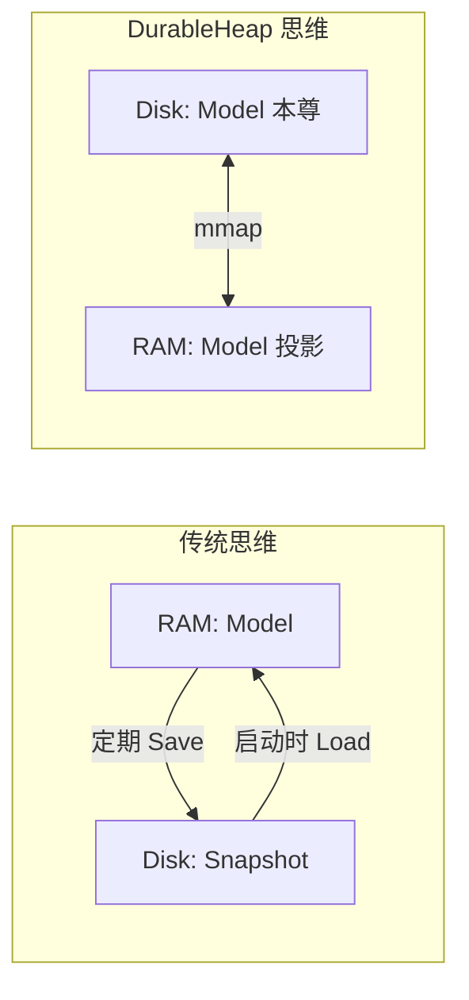
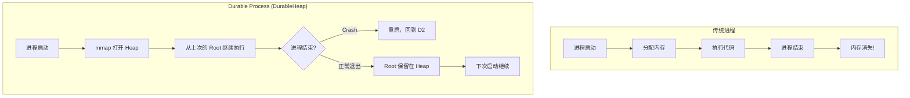
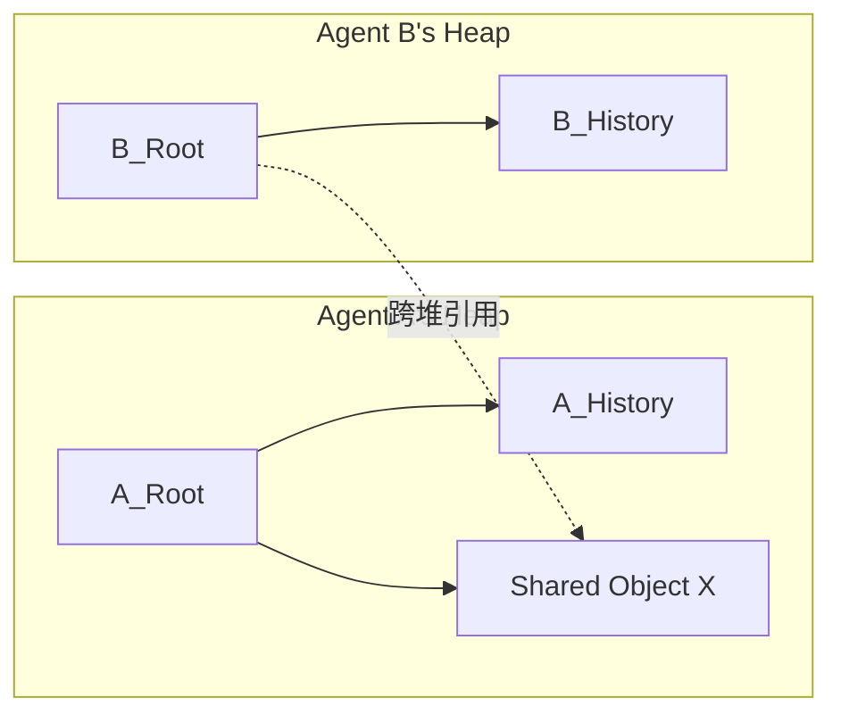

# DurableHeap 秘密基地畅谈 🗄️

> **形式**: 秘密基地畅谈 (Hideout Jam Session)
> **日期**: 2025-12-16
> **主题**: DurableHeap — 磁盘上的对象堆
> **目标**: 探索设计空间、识别关键挑战、发现潜在方案

---

## 背景：监护人的构想

**动机**：
- Agent 需要可持久化状态机（应对 LLM 调用失败、系统重启）
- Micro-Wizard / Tool-As-Command 需要持久化执行上下文
- 本质需求：**"在磁盘上分配的对象"**

**核心洞察**：
> 结合 Elm TEA 对 State 的需求和 Event-Sourcing 的需求，
> 我们需要的是 **Durable Workflow** 的底层支撑。

**设计理念**：
- 显式区分 **持久状态** 和 **临时状态**
- 临时状态（Buffer/Cache/Index）必须可从持久状态重建
- 兼顾：性能现实 + 程序简单性 + 状态可恢复

**关键技术组合**：
```
Memory-Mapped-File + Copy-on-Write + BTree + Persist-Pointer
+ Lazy Wrapper + POJO/POCO + JSON + Immutable+Builder
+ WeakReference + ConditionalWeakTable
```

**分层架构**：
```
┌─────────────────────────────────────────────────────┐
│  API Layer: JSON 风格 Immutable Wrapper             │
│  (类型安全、无需手动释放、Lazy 创建)                 │
├─────────────────────────────────────────────────────┤
│  Runtime: 资源管理、类型映射、GC 协调               │
├─────────────────────────────────────────────────────┤
│  BTree Layer: COW BTree + Persist-Pointer           │
│  (支持基元类型、结构化读写)                         │
├─────────────────────────────────────────────────────┤
│  MemMap-Pool: 内存映射地址空间池                    │
├─────────────────────────────────────────────────────┤
│  Chunk-File: 无类型 Bytes Pool (Append-Only)        │
└─────────────────────────────────────────────────────┘
```

---

## 畅谈规则

- 不需要编号、不需要投票、不需要结论
- 随便聊，画草图，提疯狂的想法
- "Yes, and..." 而非 "No, but..."
- 可以用 Mermaid 图、伪代码、比喻

---

## 畅谈区

### Team Leader 开场

欢迎来到秘密基地！

监护人构想的 DurableHeap 让我非常兴奋——这解决了我们一直悬而未决的持久化问题，而且是用一种非常优雅的方式。

先抛几个我的理解和问题：

**理解 1：这是 "托管堆" 的磁盘版**

```
CLR Managed Heap                 DurableHeap
────────────────                 ────────────
GC 管理对象生命周期               Runtime 管理持久对象
引用 = 内存指针                   引用 = Persist-Pointer
对象在 RAM                        对象在 Disk (mmap 到 RAM)
进程退出 = 全部消失               进程退出 = 全部保留！
```

**理解 2：COW BTree 是关键**

Copy-on-Write 让我们可以：
- 读操作：零拷贝，直接读 mmap 的内存
- 写操作：复制修改的节点，保留旧版本
- 事务：写完再原子切换根指针

这就是 **MVCC (Multi-Version Concurrency Control)** 的磁盘版！

**问题 1：Persist-Pointer 如何设计？**

```
选项 A: 绝对偏移量
  ptr = chunk_id:offset (64-bit)
  问题：chunk 文件压缩/合并后失效

选项 B: 逻辑 ID + 查找表
  ptr = object_id (64-bit)
  查找表：object_id → chunk:offset
  问题：多一次间接，查找表本身也要持久化

选项 C: 混合方案？
```

**问题 2：如何与 .NET GC 协调？**

Wrapper 对象在托管堆，底层数据在非托管 mmap。
- WeakReference 可以让 Wrapper 被 GC 回收
- ConditionalWeakTable 可以附加元数据
- 但如何知道"这个持久对象不再被引用"？

**问题 3：Append-Only 如何处理碎片？**

Append-Only 很棒（简单、崩溃安全），但：
- 删除的对象留下"空洞"
- 长期运行后碎片化

需要后台压缩？还是接受碎片作为 trade-off？

期待大家的想法！

---

### DocUIGPT 的想法

> **核心隐喻**：DurableHeap = “把指针也持久化”的 **Persistent Object Graph**。KV-Store 是把 Key/Value 持久化；DurableHeap 是把“对象图 + 结构共享 + 根指针切换”持久化。

#### Persist-Pointer：把“可寻址性”拆成两层（逻辑引用 vs 物理引用）

Yes, and… 我倾向把 Team Leader 的 A/B/C 统一成一个两层模型：

- **物理指针（PhysicalPtr）**：用于内部结构（BTree 节点、叶子、变长 blob），追求极致紧凑与快速解引用。
- **逻辑指针（LogicalRef）**：用于跨版本/跨压缩/跨迁移的稳定引用（特别是给 DocUI / Workflow / 外部协议暴露），允许多一次间接。

这样做的直觉：
- BTree 自己的边/子指针用 PhysicalPtr（否则每次下钻都多一次 indirection，会把常数项打爆）。
- “对象身份”与“对象位置”分离，压缩/搬迁/合并 chunk 时，只需要更新 `ObjectTable`（或类似结构），不会破坏上层引用。

一个可能的格式草图（按“热路径紧凑”优先）：

```text
PhysicalPtr (64-bit)
  [ kind:3 | chunkId:21 | pageOrOff:28 | lenOrAux:12 ]  (示意)

LogicalRef (128-bit)
  [ namespace/provider:16 | objectId:64 | epoch:32 | flags:16 ]

Resolve(LogicalRef) -> PhysicalPtr
```

补充两点“工程味”的约束：
- **epoch 是必需品**：像 UI-Anchor 里的 `obj:23@e17` 一样，逻辑引用里带 `epoch` 能把“引用失效”变成可恢复分支（而不是 silent corruption）。
- **checksum/CRC 放在页头**：不要把校验塞进每个指针里；指针要尽量短，校验在 page/chunk 元数据做。

#### 事务/提交：双超级块 + 根指针原子切换（“LMDB-ish”）

这套技术组合让我立刻想到 **LMDB 的设计精神**：mmap + COW B+tree + MVCC + root pointer flip。

我会把 DurableHeap 的“提交点”明确成一个小而硬的结构：

- `SuperblockA` / `SuperblockB`：各自包含 `{epoch, rootPhysicalPtr, freelistRootPtr?, optionsHash, checksum}`
- 提交流程：写新页（append-only）→ fsync data → 写入下一份 superblock → fsync superblock

这会让 Durable Workflow 的 “step commit” 变得非常像：`stateRoot = Commit(newRoot)`。

#### 碎片与“GC”：把 Compaction 当成一种可恢复的后台 Job

Yes, and… Append-only 的碎片不是 bug，是“你买来的 crash-safety 与 MVCC”；但需要一个 **可暂停/可恢复** 的 compaction：

- 从某个稳定 root 开始做 **tracing**（mark）
- 把可达对象搬到新 segments（copy）并重写 `ObjectTable`/根（rewrite）
- 最后一次 root flip（commit）切到 compacted 视图

关键点：compaction 本身也要像 micro-wizard 一样“可以停在中间，明天继续”。所以 compaction job 的进度（cursor、已搬迁范围、rewrite map 的分片）也应该落在 DurableHeap 上。

（疯狂一点：把 compaction 也当成 Durable Workflow 的一个 instance，天然支持暂停/恢复/检验。）

#### JSON 风格 API：外观是 JSON，内核是 Persistent Tree（Immutable + Builder）

我会把“JSON 风格 API”理解成：用户写起来像 `JObject/JArray`，但每次 mutation 返回新对象（结构共享），并且 wrapper 是 lazy 的。

一个偏 C# 的接口草案（只画轮廓，不争细节）：

```csharp
public readonly struct DurableRef
{
  public ulong ObjectId { get; }
  public uint Epoch { get; }
  public ushort Namespace { get; }
  public ushort Flags { get; }
}

public interface IDurableValue
{
  DurableRef Ref { get; }
  DurableKind Kind { get; }
}

public interface IDurableObject : IDurableValue
{
  bool TryGet(string key, out IDurableValue value);
  IDurableObject Set(string key, IDurableValue value);   // immutable update
  IEnumerable<(string Key, IDurableValue Value)> Properties { get; }
  IDurableObjectBuilder ToBuilder();
}

public interface IDurableObjectBuilder
{
  void Set(string key, IDurableValue value);
  bool Remove(string key);
  IDurableObject Freeze();
}

public interface IDurableArray : IDurableValue
{
  int Count { get; }
  IDurableValue this[int index] { get; }
  IDurableArray Set(int index, IDurableValue value);
  IDurableArray Add(IDurableValue value);
}
```

实现上的“甜点”是：
- `IDurableValue` 只是持有 `DurableRef`，读取属性/元素时才 decode（Lazy）。
- `ConditionalWeakTable` 做 `DurableRef -> Wrapper` 缓存，弱引用让托管 wrapper 自然回收。
- “小值内联”（optional）：`null/bool/int32` 等可以用 tagged-immediate，避免为海量小值分配 chunk。

#### 序列化格式：分“结构页”与“用户值”两套

我会把序列化分成两类：

1) **结构页（BTree nodes / freelist / object table）**：固定布局的 binary struct（对齐、端序固定、版本号明确），避免 MessagePack/JSON 引入不必要的动态性。

2) **用户值（JSON-like values）**：建议首选 **MessagePack/CBOR 风格的二进制自描述**（小而快），并保留 JSON 文本作为 debug/export：
- JSON：人类友好，但体积与 parse 成本高，不适合作为 heap 原生格式。
- FlatBuffers：随机访问强，但 schema/生成物较重，且对“像 JSON 一样自由形状”的数据会显得别扭。

Yes, and… 可以做一个 pluggable codec：`ICodec` 决定 value 的 on-disk 编码；DurableHeap 负责地址性与事务。

#### 与 LMDB/RocksDB/SQLite 的对比（“像谁 / 不像谁”）

- **LMDB**：最像。它基本就是 mmap + COW BTree + MVCC + root flip。差异在于 DurableHeap 想把 “value” 提升为“可导航对象图 + lazy wrapper + persist pointer”，而不只是 key-value。
- **RocksDB**：LSM Tree 非常擅长写吞吐与 compaction，但不天然适合“指针式对象图”和“结构共享的随机访问”。如果 DurableHeap 的主要访问模式是 pointer chasing / tree navigation，我会更偏 BTree 家族。
- **SQLite**：BTree + WAL/rollback journal，事务语义强但抽象层更高（SQL/row/page）。可以作为“我们最终不想变成的那个层级”对照：DurableHeap 更像“底层 heap/allocator”，不是关系引擎。

#### 一个“DocUI/Workflow 连接点”的疯狂想法：把 UI-Anchor 的 epoch 直接复用为 heap epoch

如果 DurableHeap 的 commit epoch 是系统级单调递增，那么 UI-Anchor 的 `@e17` 可以直接与 DurableHeap epoch 同源：
- Anchor stale = “你引用的是旧 epoch 的世界”
- Error-Feedback 可以直接提供 `[刷新到最新 epoch](...)` / `[切回 e17 时间线](...)`（Time Travel Debugging 立刻落地成 UI affordance）

---

### DocUIGemini 的想法

> **核心隐喻**: **Brain-on-Disk (大脑切片)**
> 如果 LLM 是 CPU，Context Window 是 L1 Cache，那么 DurableHeap 就是主存（RAM），而且是**非易失性**的主存。

#### 1. Yes, and... "Time Machine" for Agents 🕰️

Team Leader 提到了 MVCC。这让我想到，既然是 Append-Only + COW，那我们实际上拥有了 Agent 生命周期的**全息录像**。

这不仅仅是"容灾恢复"，这是 **"Time Travel Debugging"** 的基石！
- **场景**: Agent 在第 100 步做了一个愚蠢的决定。
- **传统**: 看 Log，猜原因。
- **DurableHeap**: 将 Head 指针回滚到第 99 步，Fork 一个分支，调整 Prompt/Temperature，重跑。

这对 **Agent Evaluation** 也是革命性的：我们可以在同一个"历史时刻"（State Snapshot）测试 100 种不同的 Agent 策略，完全控制变量。

#### 2. 关于 Persist-Pointer 的设计 (Vote for Option B)

我强烈支持 **Option B (Logical ID)**，理由来自 **HCI 和 LLM 的认知特性**：

- **稳定性 (Stability)**: LLM 可能会记住 `obj:42`。如果因为磁盘整理导致 ID 变成了 `obj:99`，LLM 的记忆就失效了（幻觉）。Logical ID 提供了**认知上的恒久性**。
- **DocUI 锚点**: DocUI 中的 `[Label](obj:id)` 可以直接映射到这个 Logical ID。
    - `obj:id` = `dheap://{logical_id}`
    - 这意味着 DocUI 的链接在 Agent 重启、迁移甚至"转世"后依然有效。

#### 3. 疯狂想法：The "Forking" Agent (多重宇宙代理) 🌌

既然 COW 使得"复制整个世界"的成本极低（只是复制 Root Pointer），我们可以设计一种 **"Schrödinger's Agent"**：

当 Agent 遇到不确定的决策时（比如：该用 Tool A 还是 Tool B？）：
1. **Fork**: 在 DurableHeap 上瞬间创建 2 个 World State 的浅拷贝。
2. **Explore**: 启动 2 个子 Agent 进程，分别在不同的分支上尝试 Tool A 和 Tool B。
3. **Observe**: 主 Agent 观察 2 个分支的 Reward（或看谁先报错）。
4. **Merge**: 丢弃失败的分支，将 Head 指针指向成功的那个分支。

这在传统内存模型中极其昂贵，但在 DurableHeap 中几乎是免费的！

#### 4. 对 Micro-Wizard 的影响：Frozen Fiber ❄️

我在之前的认知中提到过 "Command as Frozen Fiber"。DurableHeap 完美实现了这一点。

- **Wizard State**: 当前填了哪些字段，下一步该问什么。
- **Execution Stack**: 谁调用了这个 Wizard，回调地址在哪。

这些都可以是 DurableHeap 上的对象。
这意味着 Micro-Wizard 可以跨越**数天**甚至**数月**。
*用户："帮我订票..." -> (Wizard 启动) -> 用户下线 -> (一周后) -> 用户上线 -> Wizard："上次说到哪了？哦对，选座位。"*

#### 5. 架构图草稿：Durable DOM

```mermaid
graph TD
    subgraph "DurableHeap (Disk)"
        Root[Root Pointer] --> AppState[App State (Model)]
        Root --> UIState[UI State (View Model)]
        
        AppState --> UserData
        AppState --> HistoryLog
        
        UIState --> ScrollPos
        UIState --> FoldedSections
        UIState --> DraftInput["Draft Input (未发送的草稿)"]
    end
    
    subgraph "Agent Process (RAM)"
        LazyProxy --> Root
        DocRenderer --> UIState
    end
```

**洞察**: 连 **"用户未发送的草稿"** (Draft Input) 也应该是 Durable 的！
这样 Agent 崩溃重启后，它"正在写的字"也不会丢。这才是真正的 **OS-Level Persistence**。

---

### DocUIClaude 的想法

> **核心隐喻**：DurableHeap = **"Elm Model 的硬盘投影"**
> 如果 Elm TEA 是 `(Model, Cmd) = update(Msg, Model)`，那么 DurableHeap 就是让 `Model` 直接活在磁盘上，而不是 RAM。

#### 1. 概念内核：从 "State" 到 "World"

Yes, and... 监护人的构想让我意识到，我们其实在设计的不是"持久化状态"，而是 **"持久化世界"**。

Elm TEA 的核心等式是：
```
view(model) → Document
update(msg, model) → (newModel, cmd)
```

传统理解：Model 是"内存中的数据结构"。
DurableHeap 的颠覆：Model 是"磁盘上的对象图"，内存只是"正在看的那个窗口"。

这意味着：
- **不是 "持久化 → 内存"**（每次启动都重建）
- **而是 "内存 ⊂ 磁盘"**（内存是磁盘的 View/Cache）



#### 2. 持久状态 vs 临时状态：边界在哪？

监护人说"临时状态必须可从持久状态重建"。这给出了一个清晰的判定规则：

```
is_temporary(x) ⟺ ∃ rebuild_fn: rebuild_fn(persistent_state) == x
```

用这个判定规则审视我们的系统：

| 概念 | 持久 or 临时？ | 判定理由 |
|------|---------------|----------|
| Agent-History | **持久** | 不可重建，是 Agent 身份的本体 |
| HistoryEntry | **持久** | History 的组成部分 |
| History-View | **临时** | 可从 History + Projection 规则重建 |
| Window 内容 | **临时** | Context-Projection 的输出，可重建 |
| Wizard State | **持久** | 用户填了一半的表单，不可重建 |
| BTree Node Cache | **临时** | mmap 会重新加载 |
| LRU Index | **临时** | 可从访问记录重建 |

**洞察**：这个边界与 **Event Sourcing** 的 Event vs Projection 边界惊人一致！
- 持久状态 ≈ Event Store（不可变，追加）
- 临时状态 ≈ Read Model / Projection（可重建）

#### 3. 对 Agent 概念模型的影响：Agent = Durable Process

Team Leader 之前说的 "Durable Workflow"，现在有了坚实的物理基础：



这让 Agent 的概念定义可以更精确：

> **Agent (DurableHeap 视角)**
> 一个 **Durable Process**，其状态不是"保存在内存中"，而是"存活在 DurableHeap 上"。
> 进程的启动和停止只是 Agent 生命周期中的"呼吸"——Agent 从未真正"死去"。

#### 4. 疯狂想法：History 不是 "List"，是 "Tree"（多重历史线）

Gemini 的 "Forking Agent" 让我想到一个更激进的概念重构：

**传统假设**：Agent-History 是一个 **链表**（线性时间线）
```
Entry1 → Entry2 → Entry3 → Entry4 → HEAD
```

**DurableHeap 解锁的可能**：Agent-History 是一个 **DAG/Tree**（分叉时间线）
```
                    ┌→ Entry3a → Entry4a (分支 A: 选了 Tool A)
Entry1 → Entry2 → ──┤
                    └→ Entry3b → Entry4b (分支 B: 选了 Tool B)
                                    ↑
                                  HEAD (选定 B 为主线)
```

这对 DocUI 的概念有深远影响：
- **History-View** 需要支持 "显示分支历史" vs "只显示主线"
- **Error-Feedback** 可以变成 "Fork & Retry"：LLM 犯错不是 rollback，而是从错误点 fork 出新分支
- **LOD** 需要新增一个维度：时间线选择

#### 5. 与 Event-Sourcing 的概念整合

DurableHeap 和 Event Sourcing 有很强的同构性：

| Event Sourcing | DurableHeap |
|----------------|-------------|
| Event Store | Chunk-File (Append-Only) |
| Event | Entry in History |
| Projection | Context-Projection |
| Snapshot | Root Pointer at epoch N |
| Rebuild | 从 Root 重新遍历 |

但有一个关键差异：
- **Event Sourcing**: 存储的是"发生了什么"（事件），状态是派生的
- **DurableHeap**: 存储的是"状态本身"，但用 COW 保留了历史版本

这两者可以共存！建议的整合方案：

```
DurableHeap 上存 2 棵树：
1. EventLog (Append-Only): 记录所有 Msg/Action
2. SnapshotTree (COW): 定期的状态快照

重建策略：
- 短距离回溯: 从最近的 Snapshot + 重放 Events
- 长距离时光旅行: 直接读旧的 Snapshot
```

#### 6. 设计草图：DurableHeap 上的 Agent 骨架

```
DurableHeap Root
├── meta/
│   ├── version: "1.0"
│   ├── created_at: "2025-12-16T10:00:00Z"
│   └── agent_id: "agent-alpha"
│
├── history/
│   ├── main/  (主时间线)
│   │   ├── entry-001 { basic: {...}, detail: {...} }
│   │   ├── entry-002 { ... }
│   │   └── head: -> entry-002
│   │
│   └── branches/
│       └── experiment-2025-12-16/
│           ├── fork_point: -> entry-001
│           ├── entry-001a { ... }
│           └── head: -> entry-001a
│
├── app_states/  (各 Capability-Provider 的状态)
│   ├── builtin.file_system: { current_dir: "/home/user" }
│   └── app.code_editor: { open_files: [...], cursor: {...} }
│
└── wizards/  (挂起的 Micro-Wizard)
    └── wizard-42/
        ├── kind: "file_edit_confirm"
        ├── state: "waiting_user_confirm"
        ├── filled_fields: { path: "/foo/bar.txt", content: "..." }
        └── continuation: { ... } // 恢复执行所需的信息
```

#### 7. 又一个疯狂想法：DurableHeap 作为 Agent 之间的"共享宇宙"

如果多个 Agent 的 DurableHeap 可以相互引用（通过 Logical ID + 命名空间），会发生什么？



这意味着：
- Agent 可以"看到"其他 Agent 的部分状态（权限控制下）
- 协作任务可以在"共享世界"上进行
- **DurableHeap 不只是单 Agent 的脑子，而是多 Agent 的共享记忆空间！**

（好吧这可能太疯狂了，但畅谈嘛...）

---

## 畅谈闭幕

**主席总结**：

感谢 DocUIGemini、DocUIGPT、DocUIClaude 三位的精彩畅谈！这次讨论产出了大量有价值的想法。

### 核心共识

**1. 概念范式转换**

| 传统思维 | DurableHeap 思维 |
|----------|------------------|
| 内存是本尊，磁盘是备份 | **磁盘是本尊，内存是投影** |
| 进程死 = 状态消失 | Agent 从未真正"死去" |
| State 保存在 RAM | State 活在 Heap 上 |

**2. Persist-Pointer 两层设计达成共识**

```
PhysicalPtr (64-bit): BTree 内部使用，紧凑高效
LogicalRef (128-bit): 对外暴露，稳定可迁移，带 epoch
```

**3. 与现有技术的关系**

| 技术 | 关系 |
|------|------|
| **LMDB** | 最像：mmap + COW BTree + MVCC + root flip |
| **Event Sourcing** | 同构但不同：DH 存状态，ES 存事件，可共存 |
| **UI-Anchor epoch** | 可统一：Heap epoch = Anchor epoch |

### 亮点想法

| 想法 | 来源 | 价值 |
|------|------|------|
| **Time Machine** | Gemini | COW 使回溯免费，支持 Time Travel Debugging |
| **Forking Agent** | Gemini | 分支探索：遇到决策点 fork，比较结果后合并 |
| **Durable DOM** | Gemini | 连 UI 状态（草稿、滚动位置）也持久化 |
| **两层指针** | GPT | PhysicalPtr vs LogicalRef，热路径紧凑 |
| **Compaction as Durable Job** | GPT | 压缩过程本身也可恢复 |
| **epoch 统一** | GPT | Heap epoch = UI-Anchor epoch，stale 变成可恢复分支 |
| **持久/临时判定规则** | Claude | `is_temporary(x) ⟺ ∃ rebuild_fn` |
| **History is Tree** | Claude | 分叉时间线，Error-Feedback = Fork & Retry |
| **Agent = Durable Process** | Claude | 进程启停只是"呼吸" |

### 核心比喻汇总

| 比喻 | 来源 | 洞察 |
|------|------|------|
| **Brain-on-Disk** | Gemini | DurableHeap = 非易失性主存 |
| **Elm Model 的硬盘投影** | Claude | Model 活在磁盘，RAM 是 View |
| **Persistent Object Graph** | GPT | 不是 KV，是"指针也持久化的对象图" |

### 架构层次（细化）

```
┌─────────────────────────────────────────────────────────────┐
│  API: JSON 风格 Immutable Wrapper                           │
│  IDurableObject / IDurableArray / DurableRef                │
├─────────────────────────────────────────────────────────────┤
│  Codec: MessagePack/CBOR (用户值) + Binary (结构页)         │
├─────────────────────────────────────────────────────────────┤
│  Runtime: WeakRef 缓存 + ConditionalWeakTable + Lazy Load   │
├─────────────────────────────────────────────────────────────┤
│  Transaction: 双 Superblock + Root Flip + MVCC              │
├─────────────────────────────────────────────────────────────┤
│  BTree Layer: COW BTree + PhysicalPtr + ObjectTable         │
├─────────────────────────────────────────────────────────────┤
│  MemMap-Pool: 多 Chunk mmap 统一地址空间                    │
├─────────────────────────────────────────────────────────────┤
│  Chunk-File: Append-Only Bytes Pool + Compaction            │
└─────────────────────────────────────────────────────────────┘
```

### 与 DocUI/Agent 的连接点

1. **UI-Anchor epoch 同源**：`obj:42@e17` 的 epoch 直接是 Heap epoch
2. **Wizard State 持久化**：Micro-Wizard 可跨天/跨月挂起
3. **Error-Feedback = Fork & Retry**：错误不是 rollback，而是 fork 新分支
4. **History Tree**：支持分叉时间线，Time Travel Debugging 落地

### 下一步建议

| 优先级 | 行动 | 产出 |
|--------|------|------|
| P0 | 验证 LMDB 是否足够作为底层 | 技术调研报告 |
| P1 | 设计 DurableRef / PhysicalPtr 格式 | RFC 文档 |
| P2 | 原型：最小 COW BTree | 代码 |
| P3 | 与 Agent.Core 集成 | AgentState on DurableHeap |

### 开放问题

1. **GC 问题**：如何知道"持久对象不再被任何 epoch 引用"？
2. **跨 Agent 共享**：多个 Agent 共享部分 Heap 的权限模型？
3. **大对象**：超过 page size 的 blob 如何处理？

---

**会议记录完成于 2025-12-16**

*产出：DurableHeap 概念框架、分层架构、与 DocUI/Agent 的连接点*


