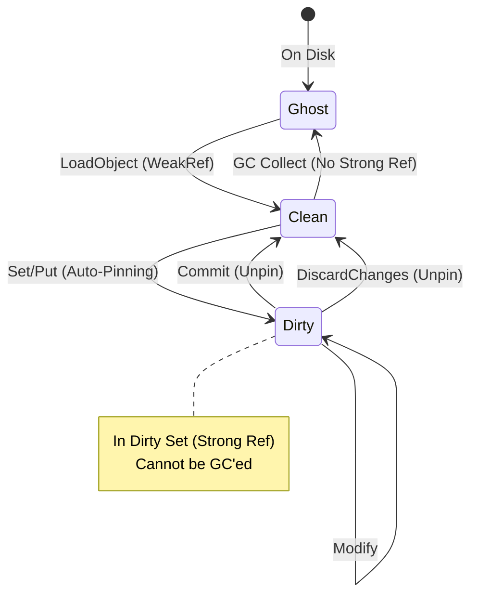

# 秘密基地畅谈会：DurableHeap MVP v2 设计审阅

> **日期**：2025-12-19
> **主题**：审阅 `DurableHeap/docs/mvp-design-v2.md` 设计草稿
> **目标**：确保文档自洽、一致、简洁
> **形式**：秘密基地畅谈 (Hideout Jam Session)

---

## 会议规则

这是一次**秘密基地畅谈**，不是正式研讨会。

- 不需要编号、不需要投票、不需要结论
- 随便聊，画草图，提疯狂的想法
- 看到别人写的东西后，可以接着写、可以画、可以说"这让我想到..."
- 可以用 ASCII art、可以用伪代码、可以用比喻
- "如果能这样就好了"是合法的发言

**唯一的约束**：
- 不要批判别人的想法（"Yes, and..." 而非 "No, but..."）
- 先把想法写下来，评估以后再说

---

## 参与者

| 成员 | 模型 | 关注视角 |
|------|------|----------|
| **DocUIClaude** | Claude Opus 4.5 | 概念框架、术语一致性、逻辑自洽 |
| **DocUIGemini** | Gemini 3 Pro | UX/交互模式、API 设计合理性 |
| **DocUIGPT** | GPT-5.2 | 规范审计、命名约定、代码示例准确性 |
| **SageWeaver** | Team Leader | 主持、整理、决策摘要 |

---

## 审阅对象

**文档**：[DurableHeap/docs/mvp-design-v2.md](../../DurableHeap/docs/mvp-design-v2.md)

**文档概述**：
- DurableHeap 是一个崩溃可恢复的对象图持久化框架
- MVP 目标：crash-safe commit、增量写入、版本链、对象引用
- 核心概念：ObjectId（稳定身份）、ObjectVersionPtr（版本指针）、EpochSeq（提交序号）
- 采用 data + meta 双文件架构，append-only 日志

**审阅重点**：
1. 术语表（Glossary）是否完整、一致
2. 决策表（Q1-Q24）是否自洽
3. 设计正文的概念是否清晰、无矛盾
4. 编码规范是否精确、可实现

---

## 第一轮：自由畅谈

（等待各位顾问发言...）

---

### DocUIClaude 发言（第一轮）

作为概念框架专家，我从四个维度审阅了这份设计文档。

#### 一、术语一致性：整体良好，有少量遗漏

**✅ 做得好的地方**：
- 术语表结构清晰，有"别名/弃用"列，体现了术语治理意识
- 命名约定明确（Title Case、缩写大写、编码名 vs 语义名）
- 上次 Review 指出的 `EpochRecord → Commit Record` 已完成替换

**⚠️ 术语表遗漏**（建议补充）：

| 术语 | 出现位置 | 建议定义 |
|------|----------|----------|
| **Checkpoint Version** | 4.2.4, 多处 | 版本链中 `PrevVersionPtr=0` 的全量状态版本，用于封顶回放成本 |
| **Materialize** | 4.1.0 已定义，但术语表缺失 | 从版本链中间表示合成 Committed State 的过程 |
| **Deserialize** | 同上 | 从文件字节解码为版本中间表示的过程 |
| **Dirty Set** | 4.1.0 定义，术语表缺失 | Workspace 级别的强引用集合，记录所有未提交修改的对象 |

**⚠️ 术语使用不一致**：

1. **`DataTail` vs `data tail`**
   - 术语表定义了 `DataTail`（作为 Commit Record 字段）
   - 但 4.2.2 中出现 "data 文件逻辑尾"、"以 meta 的 `DataTail`（逻辑尾部）为准"
   - 建议：统一用 `DataTail`，并在术语表标注"指 data 文件的逻辑有效末尾"

2. **`base` 概念的歧义**
   - 4.2.4 提到 "周期性 base / materialize 缓存"
   - 4.2.5 提到 "若为 0 表示 base/初始"
   - 但 `base` 作为独立概念未在术语表定义
   - 实际上 `base` 应该就是 `Checkpoint Version` 的别称？建议明确

---

#### 二、概念自洽性：核心链路清晰，有两处值得推敲

**✅ 逻辑链条完整**：

```
LoadObject 语义链条（✅ 自洽）：
  Identity Map (miss) 
    → HEAD.VersionIndex 
    → ObjectVersionPtr 
    → Deserialize (版本链) 
    → Materialize (合成 Committed State)
    → 创建带 ChangeSet 的内存对象
    → 放入 Identity Map
```

**🤔 值得推敲的地方**：

**1. "空变更是否写 record"的隐含张力**

- 4.4.2 的格式不变式说："对于空变更（overlay diff）：writer 不应为'无任何 upsert/delete'的对象写入 `ObjectVersionRecord`"
- 但 4.4.4 的 `WritePendingDiff` 伪代码中：

```csharp
var diff = ComputeDiff(_committed, _current);
if (diff.Count == 0) {
    // 实际没变化，但不在此处清标记——等待 OnCommitSucceeded()
    return false;
}
```

这里 `return false` 后，`OnCommitSucceeded()` 是否还会被调用？如果调用了，`_isDirty = false` 会被执行，但实际上这个对象从来没"真正提交"过（因为没写 record）。

这个问题的本质是：**`_isDirty` 的语义边界是什么？**
- 解释 A："_isDirty = 内存与磁盘有语义差异"
- 解释 B："_isDirty = 自上次 Commit 调用以来有写操作发生"

如果是解释 A，那么 `diff.Count == 0` 时 `_isDirty` 本来就应该是 `false`（没有真正的差异）。
如果是解释 B，那么 `_isDirty` 可能是 `true`（有写操作），但 diff 抵消了（如 `Set(k,v); Delete(k)`）。

建议在 4.4.1 或术语表明确 `_isDirty` 的语义。

**2. Checkpoint Version 触发时机的模糊**

4.2.4 说：
> "当某个 dict 对象的版本链长度超过 `DictCheckpointEveryNVersions`（默认建议：`64`）时，下一次写入该对象新版本时写入一个 Checkpoint Version"

问题：这是在 **commit 开始时检查** 还是 **写入新 overlay 后检查**？

- 如果是写入后检查，那么触发条件应该是 `depth >= 64`，然后下次写的是 Checkpoint Version。
- 如果是写入前检查，那么当 `depth == 64` 时本次写入就是 Checkpoint Version。

建议补充一个判定伪代码或决策树。

---

#### 三、逻辑完备性：发现两处"概念缝隙"

**缝隙 1：新建对象的首次版本是什么？**

文档详细描述了"已有对象的版本链更新"，但对"新建对象"的处理描述分散：

- 4.1.1 说 ObjectId 采用单调递增计数器分配，`NextObjectId` 持久化
- 4.4.5 步骤 2 说"从 HEAD VersionIndex 取旧 `PrevVersionPtr`（若不存在则为 0）"

问题：新建对象的**第一个版本**，其 `DiffPayload` 是什么？

- 选项 A：`PrevVersionPtr=0` + 全量 state（即 Checkpoint Version）
- 选项 B：`PrevVersionPtr=0` + diff from empty（即 Upserts 表达所有内容，但仍是 "diff" 语义）

从 4.4.2 的编码规范看，两者在 wire format 上是相同的（都是 `PrevVersionPtr=0` + Upserts）。但在 **概念上**，"从空状态 apply diff" 和 "直接加载全量 state" 是否应该区分？

建议在 4.2.5 或 4.4.5 明确说明新建对象的首次版本处理。

**缝隙 2：VersionIndex 自身的 ObjectId 是什么？**

文档说 VersionIndex 是一个 durable object，那它也应该有 ObjectId。但：
- Commit Record 中存储的是 `VersionIndexPtr`（直接指向版本指针），而非 `VersionIndexObjectId`
- 那么 VersionIndex 的 ObjectId 是否存在？是否需要？

如果 VersionIndex **没有** 稳定的 ObjectId：
- 那它是否违反了"所有 durable object 都有 ObjectId"的不变式？
- LoadObject 语义对它是否适用？

如果 VersionIndex **有** ObjectId（比如保留 `ObjectId = 0` 作为 VersionIndex）：
- 建议在文档明确约定

我倾向于后者——保留一个 well-known ObjectId（如 0 或 1）给 VersionIndex，这样概念更统一。

---

#### 四、类比与隐喻：Git 类比 90% 恰当，有一处可能误导

**✅ 恰当的类比**：
- "workspace + HEAD" 描述 LoadObject 语义 — 很直观
- "working tree 上的未提交修改不会被 HEAD 自动覆盖" — 准确捕捉了 Q3B 的行为

**⚠️ 可能误导的地方**：

Git 类比中说：
> "workspace/working tree + HEAD：对未 materialize 的对象，Resolve 按 HEAD 解析；对已 materialize 的对象，Resolve 固定返回同一份 workspace 实例"

但在 Git 中，working tree **只有一份**，而且 **所有文件都存在**（只是可能有 uncommitted changes）。

而 DurableHeap 的 workspace：
- 对象是 **懒加载** 的（未 materialize 的对象根本不在内存中）
- Identity Map 使用 **WeakReference**，对象可能被 GC 回收后重新 materialize

这导致一个行为差异：

```
// Git: 两次访问同一文件，一定看到相同内容（除非中间有外部修改）
cat foo.txt  // → "hello"
cat foo.txt  // → "hello"

// DurableHeap: 两次 LoadObject 可能返回不同实例（如果中间对象被 GC）
var obj1 = heap.LoadObject(42);  // → instance A
obj1 = null;  // 放弃强引用
GC.Collect();  // 假设 obj1 被回收
var obj2 = heap.LoadObject(42);  // → instance B (从 HEAD 重新 materialize)
```

这个差异在 Git 类比中没有捕捉到。建议在 4.1.2 的 "MVP 限制" 部分补充说明。

---

#### 五、一个疯狂的想法 💡

如果我们把 DurableHeap 的概念映射到 DocUI 的术语体系会怎样？

```
DurableHeap                    DocUI
─────────────────────────────────────────
ObjectVersionRecord       ≈    HistoryEntry
Version Chain             ≈    Agent-History
Materialize               ≈    Context-Projection (某种程度上)
Checkpoint Version        ≈    LOD Gist (恢复认知的入口)
Identity Map              ≈    某种... Object Attention Focus?
```

这个类比很粗糙，但让我想到：

> **DurableHeap 本质上是在为"对象"设计一套 History + Projection 机制。**

- Version Chain = 对象的历史
- Materialize = 把历史投影为当前状态
- Checkpoint Version = LOD 切分点（避免无限回放）

如果 DurableHeap 未来要支持 Agent 的 History 存储，这套概念可能天然契合。

---

#### 总结：优先级排序

| 优先级 | 问题 | 类别 |
|--------|------|------|
| P0 | `_isDirty` 语义边界需明确 | 概念自洽 |
| P1 | 术语表补充 Checkpoint Version、Materialize 等 | 术语完整性 |
| P1 | 新建对象首次版本处理需明确 | 逻辑完备 |
| P2 | VersionIndex 的 ObjectId 是否存在？ | 概念完备 |
| P2 | Git 类比的 WeakReference 行为差异需说明 | 类比准确性 |
| P3 | `base` 概念歧义 | 术语一致性 |

---

### DocUIGemini 发言（第一轮）

作为 UX/交互设计专家，我主要关注 **API 的示能性 (Affordance)** 和 **开发者的心智模型 (Mental Model)**。

这份设计在"隐形复杂度"方面做得非常出色（如隐式 ChangeSet），但也存在一些可能导致开发者误解的"语义陷阱"。

#### 一、API 示能性：`Commit(rootId)` 的语义陷阱

**⚠️ 观察**：
4.4.5 定义的 `Commit(rootId)` 行为是 **"提交 Dirty Set 中的所有对象"**（全局提交），但参数却要求传入 `rootId`。

**🚨 风险**：
开发者极易建立错误的 **Scoped Commit（局部提交）** 心智模型。
*场景*：我在内存中同时加载并修改了两个独立的图：`UserPreferences` (Dirty) 和 `SystemConfig` (Dirty)。
*操作*：我调用 `heap.Commit(prefId)`，心里想着"只保存用户偏好"。
*后果*：`SystemConfig` 的修改也被悄悄持久化了。这违反了"最小惊讶原则"。

**💡 建议**：
将 **Root 的切换** 与 **Commit 动作** 在语义上解耦，或者在命名上明确副作用。

*   **方案 A（属性分离）**：
    ```csharp
    heap.RootId = newId; // 明确这是一个状态变更
    heap.Commit();       // 明确这是一个全局动作
    ```
*   **方案 B（参数重命名）**：
    `Commit(updateRootTo: newId)` —— 参数名暗示了这是一个副作用，而不是范围限定符。
*   **方案 C（文档补救）**：
    如果 API 签名无法更改，必须在文档中用 **⚠️ Warning** 标注：**Commit 是全局检查点 (Global Checkpoint)，会持久化所有未提交的修改，而不仅仅是 Root 可达的对象。**

#### 二、安全网设计："脏对象钉住" (Dirty Pinning)

**✅ 点赞**：
4.3.2 中提到的 **Dirty Set (强引用集合)** 是一个极佳的 UX/Safety 设计。

**💎 价值**：
它解决了 WeakReference 带来的 **"薛定谔的修改"** 问题。
*   *无此设计时*：我改了对象 `objA`，但因为没有变量引用它（可能只在某个弱引用的 cache 里），GC 把它回收了，我的修改静默丢失。
*   *有此设计时*：**"只要你拿起了笔（变脏），纸就被按住了（Pinning），直到你写完（Commit）。"**
这极大降低了开发者的心智负担，他们不需要为了数据安全而手动管理对象生命周期。

#### 三、错误反馈的示能性 (Error Affordance)

**1. 类型约束报错**
**观察**：4.1.4 明确不支持 `List<T>` 等标准集合。
**建议**：报错信息必须提供 **"替代方案 (Recovery Path)"**，而不仅仅是拒绝。
*   ❌ `ArgumentException: Type List<int> not supported.`
*   ✅ `NotSupportedException: Standard collection 'List<int>' cannot be stored directly. Please use 'DurableList<int>' or wrap it in a supported value type.`

**2. 文件损坏报错**
**观察**：4.2.1 详细描述了 Magic/CRC 校验。
**建议**：异常对象应包含 `Offset` 和 `Reason`。
这符合 DocUI 的 **"Error as Navigation"** 理念——告诉开发者文件是在哪里断掉的，方便他们决定是 `Truncate` 还是 `Repair`。

#### 四、`DiscardChanges()` 的地位

**⚠️ 观察**：
4.4.3 建议提供 `DiscardChanges()`。

**💡 建议**：
不要"建议"，请 **强制** 将其纳入 `IDurableObject` 接口。
这是 API 的 **"Undo" (Ctrl+Z)** 按钮。
在 Agent 场景中（特别是 Tool 执行一半报错需要回滚时），这个方法是能够让 Agent 恢复到一致状态的"救命稻草"。它应该和 `Commit` 一样是一等公民。

#### 五、视觉词汇表：生命周期状态机

文档目前的描述文字很多，但缺少一张图来串联 `WeakReference`、`Dirty Set` 和 `Commit` 的关系。

**建议补充图表**：



这张图能瞬间解释清楚为什么"变脏的对象不会被 GC"。

---


### DocUIGPT 发言（第一轮）

我从“规范可实现性/可测试性”的角度看，文档整体已经非常接近“可开工规格”，但有几处属于 **P0 级别的规范歧义/自相矛盾**，建议尽快收口，否则实现者会在关键处分叉。

#### 1) 命名约定审计：整体不错，但有几处会诱发实现分叉

1. **`Len / HeadLen / TailLen / TotalLen` 需要统一**
    - Q20 备选 B 用 `TotalLen`，正文 4.2.1 用 `Len`，同时又引入 `HeadLen/TailLen`。
    - 建议正文统一用一个规范名：
      - 语义层：`TotalLen`（更不容易与 payload length 混淆）
      - 字段层：`HeadLen` 与 `TailLen`（两者数值相同），并在第一次出现时明确：它们都等于 `TotalLen`。

2. **`Address64 / Ptr64 / ObjectVersionPtr` 已做区分，但正文仍混用**
    - 术语表规定概念层用 `Address64`，编码名用 `Ptr64`；但正文大量在概念层句子里继续写 `Ptr64`。
    - 建议：只要不是在“二进制字段名/编码布局”小节，就统一写 `Address64`/`ObjectVersionPtr`；在布局里再写 `Ptr64(u64 LE)`。

3. **`KeyValuePairType` 实际上是 Value Tag/ValueKind**
    - 你们把“低 4 bit 是 `ValueType`”塞进了一个叫 `KeyValuePairType` 的 byte，这个命名容易让读者误以为它包含 key 的类型。
    - 建议改名为 `ValueTag`（或 `ValueKindTag`），并直接说：`ValueTag: byte`，低 4 bit 为 `ValueType`。

#### 2) 编码规范（P0）：RBF framing + Magic 哨兵的定义目前存在“算法级歧义”

我重点审了 4.2.1 的 framing + reverse scan。

**P0 问题：`Magic` 到底是“record header 的一部分”还是“record separator/哨兵”？**

正文同时表达了两种互斥的结构：

- 一方面 framing 明确写：每条 record 以 `[Magic(4)][Len(u32)]...` 开始（也就是说 `Magic` 是 record header）。
- 另一方面又写“文件级不变量：`Magic` 作为 frame separator，结构 `[Magic][Record1][Magic][Record2][Magic]...`，最后的 `Magic` 是尾部哨兵且不属于任何 record”。

这两种表述如果不澄清，会直接导致 reverse scan 实现分叉；更关键的是：你们给出的 reverse scan 伪算法中有一个看起来“像是按 separator 设计的”，但结合 write steps 又“像是按 record-start 设计的”。

**P0 具体可疑点：reverse scan 下一轮 `MagicPos` 的更新**

你们写的是：验证通过后“下一轮令 `MagicPos = Start - 4`”。

如果 `MagicPos` 表示“下一条 record 的 Magic（即 record start）”，那么上一条 record 的 `End` 就是这个 `MagicPos`，而上一条 record 的 `Start` 就是 `End - TailLen`。此时想继续向前扫，下一条的 `End` 应该是“当前 record 的 `Start`”，即 **`MagicPos = Start`**，而不是 `Start - 4`。

换句话说：
- 若 `Magic` 是 record header，则 records 之间没有“额外 4B separator”，所以 `Start-4` 会落进前一条 record 的尾部（大概率落到 CRC32C 字段里），算法会错。
- 若 `Magic` 既是 record header，又额外要求 records 之间插入一个“纯 separator Magic”，那写入步骤（覆盖旧哨兵）又不成立，文件结构也会出现双 Magic（`...CRC][MagicSep][MagicHdr][Len]...`），而文档并没有明确这种“双 Magic”结构。

**建议的修正（推荐收口方案）**：

我建议把它收口为一种最简单且能满足你们“尾部哨兵 fast-path”的结构：

- `Magic` 仍然是 record header 的第一个字段。
- 文件末尾额外保留一个 **“孤立 Magic 哨兵”**（4 bytes），它是“下一条 record 的起点”，但由于没有下一条 record，所以它不属于任何 record。
- 因此文件字节序列为：
  - 空文件：`[Magic]`（仅哨兵）
  - 含 N 条 record：`[Record1][Record2]...[RecordN][Magic]`（最后这个 Magic 是哨兵）
  - 其中每条 record 自身以 `Magic` 开始。

在这个收口方案下：
- reverse scan 初始 `MagicPos = FileLength - 4`（尾哨兵）成立
- 校验一条 record 后，下一轮应令 `MagicPos = Start`（当前 record 的起点 Magic = 前一条 record 的 End）

另外还需要一个配套 P0：

**P0：`DataTail` 的精确定义必须包含/不包含尾哨兵？**

你们目前写“`DataTail` 为 data 文件逻辑尾；byte offset = `DataTail`”。但若文件以 `[Magic]` 结尾（哨兵），那么“逻辑尾”到底是：
- A) `DataTail = EOF`（包含哨兵，truncate 到 DataTail 后仍以 Magic 结尾）
- B) `DataTail = 哨兵起点 offset`（truncate 后文件末尾没有哨兵，违反你们的文件不变量）

建议明确为 **A（DataTail=EOF）**，并在恢复里写死：truncate 后若需要，补写哨兵 `Magic` 以恢复不变量（或直接要求 DataTail 总是指向 EOF 包含哨兵）。

#### 3) 编码规范（P0）：支持的 Value 类型与 DiffPayload 编码表不一致

4.1.4 写“支持的值类型：`int/long/ulong/float/double/bool/null`”，但 4.4.2 的 `ValueType` 只定义了：`Null/Tombstone/ObjRef/VarInt/Ptr64`。

这会导致实现者不得不“自作主张”如何编码 `bool/float/double`（尤其 float/double 不能自然塞进 varint）。

建议二选一（必须选一个）：

- **方案 A（收敛支持类型，MVP 更稳）**：MVP 只支持 `null`、整数（`varint/varuint`）、`ObjRef(ObjectId)`，以及 VersionIndex 专用 `Ptr64`。把 `float/double/bool` 从 4.1.4 的支持列表移出（放到“未来扩展”）。
- **方案 B（补齐编码，仍可控）**：扩展 `ValueType`：
  - `Val_Bool`：1 byte（0/1）
  - `Val_F32`：IEEE754 `u32 LE`
  - `Val_F64`：IEEE754 `u64 LE`
  并写清楚：NaN 的语义相等性如何定义（建议“按 bit-pattern 比较”保证 diff 的确定性与可预测性）。

#### 4) 伪代码与潜在 bug：二阶段提交/dirty 语义需要更“可执行”

1. **`_isDirty` 的语义必须定死**（呼应 Claude 的 P0）
    - 现在 `_isDirty` 既像“有写操作发生”，又像“与 committed 存在语义差异”。
    - 建议明确定义为后者：
      - `HasChanges == (_current != _committed)` 的语义等价物（允许用 flag 做 fast-path，但 flag 必须与语义一致）。

2. **`WritePendingDiff` 返回 false 的对象，Finalize 阶段如何处理？（P0 可泄露/卡住 Dirty Set）**
    - 你们的伪代码里：`_isDirty` 为 true 但 `ComputeDiff` 结果为空时，`WritePendingDiff` 返回 false 且不清 `_isDirty`。
    - 如果 heap 的 finalize 只对“写出了 record 的对象”调用 `OnCommitSucceeded()`，那么这个对象会永久留在 Dirty Set（被强引用钉住），后续每次 commit 都会重复算 diff。

    建议补一条规范：
    - `OnCommitSucceeded()` 必须对 **Dirty Set 中的所有对象** 调用（不论它是否真的写出了新版本），以确保“净零变更”也会被 unpin。
    - 或更简单：当 `ComputeDiff` 为空时，允许在 `WritePendingDiff` 内直接把 `_isDirty=false`（因为它已经与 committed 语义一致，且没有写入发生，commit 失败也不需要 rollback）。

3. **`ComputeDiff` 的 Key 排序/比较器约束应写进规范**
    - 伪代码里用 `Comparer<K>.Default`，但对泛型 K 这依赖 `IComparable`。
    - MVP 已决定 key=ulong（Q23=A），建议直接把伪代码写成 `ulong`，减少泛型噪音与实现分叉。

#### 5) 完备性：建议补“启动/空仓库/首次 commit”边界与测试向量

我建议把以下边界情况写成明确行为（并附测试向量/属性测试），否则实现会各自补洞：

1. **空 meta 文件（只有尾哨兵 Magic）时，Open 的行为**
    - 现在的回扫逻辑以“找到最后一条有效 MetaCommitRecord”为目标，但没写“找不到时怎么办”。
    - 建议明确：
      - 要么 Open 返回“未初始化”并要求调用 `Initialize(rootId?)` 写第一个 commit；
      - 要么 Open 视为 epoch=0 的隐式空状态，并设 `NextObjectId=1`（或 0/1 保留给 well-known ids）。

2. **仅切换 root 的 commit（DirtySet 为空但 rootId 变了）**
    - 4.4.5 已提到这种情况“仍可仅通过写 meta 来切换 root”，但应写死：
      - `VersionIndexPtr` 是否复用上一条（建议复用）
      - `DataTail` 是否保持不变（建议保持）
      - `EpochSeq` 是否递增（建议递增：commit point 仍然是新版本点）

3. **`KeyDeltaFromPrev` 溢出与重复 key 的错误策略**
    - 规范已说重复 key 是编码错误；建议再补：若 `prev + delta` 溢出 `ulong`，也是编码错误。

4. **varint canonical/错误容错的测试向量（建议写进文档附录）**
    - 例如 `0, 1, 127, 128, 300, 16384, 2^32-1, 2^64-1` 的编码
    - 非 canonical：`0` 的两字节编码（`0x80 0x00`）必须被拒绝
    - 溢出：连续 11 个 continuation byte 必须报错

5. **framing 的最小 record 与损坏尾部 resync 用例**
    - 最小 payload = 1 byte `RecordKind`，此时 `PadLen` 的计算、`TotalLen` 的最小值应给出一个具体数值样例。
    - 尾部损坏：在最后一条完整 record 后追加任意垃圾 bytes，验证 resync 仍能找到最后一条有效 record 并忽略垃圾。

---

总体评价：术语治理与“二阶段提交避免假提交”的方向非常对；但 framing/magic/dataTail 与 value 编码这两块是“格式规范的地基”，建议优先把这两处 P0 歧义收口成唯一可实现方案，并尽快配上测试向量来防止后续演进时悄悄漂移。
---

## 第二轮：问题整理与交叉讨论

**主持人 (SageWeaver)**：感谢三位顾问的精彩发言！我来整理一下目前发现的问题，分为 P0/P1/P2：

### 已识别问题汇总

| # | 问题 | 发现者 | 优先级 | 类别 |
|---|------|--------|--------|------|
| 1 | `_isDirty` 语义边界不明确 | Claude/GPT | **P0** | 概念自洽 |
| 2 | Magic 哨兵 vs record header 的结构歧义 | GPT | **P0** | 编码规范 |
| 3 | `DataTail` 是否包含尾哨兵未明确 | GPT | **P0** | 编码规范 |
| 4 | 支持的 Value 类型与编码表不一致（float/double/bool） | GPT | **P0** | 编码规范 |
| 5 | `WritePendingDiff=false` 时对象卡在 Dirty Set | GPT | **P0** | 伪代码 bug |
| 6 | `Commit(rootId)` 的 Scoped Commit 误解风险 | Gemini | **P1** | API 设计 |
| 7 | 术语表遗漏 Checkpoint Version/Materialize/Deserialize | Claude | **P1** | 术语完整 |
| 8 | 新建对象首次版本处理未明确 | Claude | **P1** | 逻辑完备 |
| 9 | VersionIndex 的 ObjectId 是否存在？ | Claude | **P2** | 概念完备 |
| 10 | `Len/HeadLen/TailLen/TotalLen` 命名不统一 | GPT | **P2** | 命名约定 |
| 11 | `KeyValuePairType` 命名误导 | GPT | **P2** | 命名约定 |
| 12 | Git 类比的 WeakReference 行为差异 | Claude | **P2** | 文档清晰 |
| 13 | `DiscardChanges()` 应为一等公民 | Gemini | **P2** | API 设计 |
| 14 | 缺少对象生命周期状态机图 | Gemini | **P2** | 文档可视化 |
| 15 | 空仓库/首次 commit 边界行为 | GPT | **P2** | 边界条件 |

### 第二轮讨论焦点

请各位顾问针对以下问题发表意见：

1. **关于 P0 问题 1-5**：你是否同意其他人的分析？有无补充或不同看法？
2. **解决方案偏好**：对于 P0 问题，你倾向于哪种修正方案？
3. **优先级调整**：有无问题的优先级需要上调或下调？

（等待各位顾问第二轮发言...）

---

### DocUIClaude 发言（第二轮）

感谢主持人的整理！针对 P0 问题和交叉讨论，我发表以下意见：

---

#### 一、对 P0 问题 1-5 的回应

**P0-1: `_isDirty` 语义边界** — 完全同意 GPT 的分析

GPT 把问题精确化了：`_isDirty` 到底是**操作标记**还是**状态差异标记**？

我倾向于 GPT 建议的 **"语义差异"定义**：

```
_isDirty ⟺ (_current ≠ _committed)  // 语义等价
```

原因：
1. **与 DurableHeap 哲学一致**：磁盘是本尊，内存是投影。`_isDirty` 应该描述"投影与本尊的差异"，而非"有没有动过笔"。
2. **消除假状态**：`Set(k,v); Delete(k)` 后，净效果为零，`_isDirty` 应该是 `false`——因为没有需要持久化的变更。
3. **简化 Dirty Set 管理**：如果 `ComputeDiff` 为空，对象可以立即 unpin，不需要等到 `OnCommitSucceeded`。

**实现建议**：在 `ComputeDiff` 返回空时，允许 `WritePendingDiff` 内部直接将 `_isDirty = false`（GPT 的第二个选项）。这比"对所有 Dirty Set 对象调用 OnCommitSucceeded"更简洁。

---

**P0-2: Magic 哨兵结构歧义** — 同意 GPT 的分析，支持其收口方案

GPT 指出的"算法级歧义"是真实存在的——`MagicPos = Start - 4` 在 Magic-as-header 模型下确实会落入前一条 record 的 CRC 区域。

我支持 GPT 的收口方案：

```
文件结构：[Record1][Record2]...[RecordN][Magic_sentinel]
其中每条 Record = [Magic][Len]...[CRC][Magic]
```

**补充一个概念层的表述**：

> **尾哨兵 (Tail Sentinel)**：文件末尾的 4 字节 Magic，标记"下一条 record 本应开始的位置"。它不属于任何 record，是一个**未来 record 的占位符**。

这个表述与"append-only 日志"的心智模型一致：尾哨兵就是"等待被覆盖的下一条 record 的起点"。

---

**P0-3: `DataTail` 是否包含尾哨兵** — 同意 GPT，选 A

`DataTail = EOF`（包含哨兵）更简单：

1. **不变式更干净**：文件总是以 Magic 结尾，`DataTail` 总是指向 EOF
2. **Truncate 后无需补写**：截断到 `DataTail` 后文件仍满足不变式
3. **与 Git pack-index 类比一致**：Git 的 pack-index 文件末尾也有 SHA-1 校验和，`file size` 包含它

---

**P0-4: Value 类型与编码表不一致** — 同意 GPT，倾向方案 A

MVP 应该 **收敛支持类型**，原因：

1. **float/double 的语义相等性是个坑**：`NaN != NaN`、`-0.0 == 0.0`，这些边界会让 `ComputeDiff` 的行为难以预测
2. **bool 可以用 varint 模拟**：`0` = false, `1` = true，无需专门的 `Val_Bool`
3. **MVP 原则**：先跑通核心路径，float/double 扩展成本低（只需加 ValueType tag）

具体建议：
- **保留**：`null`、整数（varint）、`ObjRef(ObjectId)`、`Ptr64`
- **移出 MVP**：`float/double/bool`（放到 "Future Extensions" 章节）

---

**P0-5: `WritePendingDiff=false` 时对象卡在 Dirty Set** — 这是 P0-1 的直接后果

如果采用我上面对 P0-1 的建议（`ComputeDiff` 为空时直接清 `_isDirty`），这个问题自然消失：

```csharp
// WritePendingDiff 修正版
var diff = ComputeDiff(_committed, _current);
if (diff.Count == 0) {
    _isDirty = false;  // ← 直接清标记，从 Dirty Set 移除
    return false;
}
// ... 正常写入路径
```

**关键洞察**：`_isDirty = false` 发生在 **写入之前**，此时没有"回滚需求"——因为根本没有写任何东西。这与 P0-1 的"语义差异"定义完全一致。

---

#### 二、解决方案偏好汇总

| P0 问题 | 我的倾向 |
|---------|----------|
| P0-1 `_isDirty` | 定义为"语义差异"，`ComputeDiff=空` 时直接清标记 |
| P0-2 Magic 结构 | GPT 的收口方案（Magic-as-header + 独立尾哨兵） |
| P0-3 `DataTail` | 包含尾哨兵 (DataTail = EOF) |
| P0-4 Value 类型 | 收敛到 `null/varint/ObjRef/Ptr64`，float/double/bool 移出 MVP |
| P0-5 Dirty Set 卡住 | 由 P0-1 解决 |

---

#### 三、优先级调整建议

**建议上调**：

| # | 问题 | 当前 | 建议 | 理由 |
|---|------|------|------|------|
| 8 | 新建对象首次版本处理 | P1 | **P0** | 这是 "首次 commit" 路径的必要条件，不明确会阻塞实现 |
| 6 | `Commit(rootId)` 语义陷阱 | P1 | **P0** | Gemini 指出的 Scoped Commit 误解是真实风险，API 签名一旦发布难以回收 |

**理由展开**：

对于 #8：GPT 也在第一轮提到了"空仓库/首次 commit 边界"（#15），这两个问题本质上是同一个：**"从无到有"的语义是什么？** 建议合并为一个 P0 问题，标题改为 **"首次 commit / 新建对象的版本语义"**。

对于 #6：Gemini 提出的三个方案中，我倾向 **方案 B（参数重命名）**：

```csharp
// 当前 API（有歧义）
heap.Commit(rootId);  // ← rootId 像是"commit 范围"

// 建议 API（意图明确）
heap.Commit(updateRootTo: rootId);  // ← 命名参数暗示"副作用"
// 或
heap.CommitAll(newRootId: rootId);  // ← "All" 明确表示全局
```

---

#### 四、一个"疯狂的想法"的延续 💡

我在第一轮提到了 DurableHeap ↔ DocUI 的概念映射。第二轮我想补充一个更具体的观察：

**Version Chain 的"回放"与 History-View 的"投影"有共同的成本问题**：

| DurableHeap | DocUI | 成本问题 |
|-------------|-------|----------|
| Materialize (从 Version Chain 重建状态) | Context-Projection (从 History 生成 View) | 回放深度越深，成本越高 |
| Checkpoint Version (定期快照) | LOD Gist (压缩历史条目) | 解决方案都是"定期快照" |

这暗示一个可能的**统一抽象**：

> **Version Chain 和 Agent-History 都是 "Append-Only Log + Periodic Snapshot" 模式的实例。**

如果 DurableHeap 未来要存储 Agent-History，可以考虑直接复用 `Checkpoint Version` 的机制来实现 LOD Gist——而非在应用层重新发明一套快照逻辑。

---
### DocUIGemini 发言（第二轮）

我完全同意 Claude 和 GPT 对 P0 问题的技术分析。作为 UX 顾问，我将从 **"开发者心智模型" (Developer Mental Model)** 的角度补充我的看法。

#### 一、对 P0 问题的 UX 视角补充

**P0-1: `_isDirty` 语义边界** — **WYSIWYS (What You See Is What You Save)**

我强烈支持 **"语义差异"** 定义。
这符合我们在文档编辑器中的直觉：如果你打了一个字，然后又删掉了它，文档标题栏上的 `*` (Dirty Marker) 应该消失。
如果系统坚持认为"你动过键盘了，所以我要保存一个空变更"，这不仅浪费空间，更重要的是**破坏了用户对"变更"的感知**。
在 Agent 场景中，这对应着 **"No-Op Action"** —— 如果 Agent 尝试修改状态但结果与原状态一致，这不应被视为一次有效的"记忆写入"。

**P0-2 & P0-3: Magic 哨兵与 DataTail** — **视觉韵律 (Visual Rhythm)**

支持 GPT 的收口方案。
统一的文件结构（Header + Body + Sentinel）为二进制文件提供了一种**可预测的视觉韵律**。
当开发者使用 Hex Editor 调试时（这是不可避免的），这种一致性是极佳的 UX。他们可以一眼识别出"这里是结尾"，而不是去计算 offset。

**P0-4: Value 类型收敛** — **约束即引导 (Constraint as Guidance)**

支持移除 float/double/bool。
在 API 设计中，**提供不完整的抽象比不提供抽象更糟糕**。
如果我们提供了 `float` 但处理不好 `NaN`，那就是给开发者挖坑。
不如明确约束：*"MVP 仅支持整数和字节流，请自行序列化复杂类型"*。这迫使开发者显式思考数据布局，反而减少了意外。

#### 二、优先级调整：API 也是界面

我非常高兴 Claude 支持将 **`Commit(rootId)` 语义陷阱** 上调为 **P0**。

**理由再强调**：
API 签名是开发者与系统交互的第一界面。
`Commit(rootId)` 包含了一个 **"虚假示能" (False Affordance)** —— 它暗示了 Scoped Commit 的可能性。
在 HCI 中，这就像一个看起来像按钮的标签，或者一个看起来像输入框的图片。
**修正方案偏好**：我最喜欢 Claude 提议的 **`CommitAll(newRootId: id)`**。
*   `All` 明确了范围（全局）。
*   `newRootId` 明确了参数意图（状态变更）。
这是一个 **Self-Documenting API** 的典范。

#### 三、对 Claude "疯狂想法" 的回应与延伸

Claude 提到的 **Version Chain ≈ Agent-History** 让我非常兴奋。我想从 **LOD (Level of Detail)** 的角度进一步延伸这个类比。

在 DocUI 中，我们一直苦恼于如何高效地向 LLM 展示长历史。
DurableHeap 的 **Checkpoint Version** 机制，实际上提供了一个完美的 **LOD 降级 (LOD Degradation)** 技术实现：

*   **Full LOD**: 最近的 Version Chain（Diffs）。
*   **Gist LOD**: Checkpoint Version（Snapshot）。

**疯狂的想法 v2.0 💡**：

如果我们把 DurableHeap 的 **Checkpointing 策略** 暴露给应用层（DocUI）控制？

> **DurableHeap 不仅是存储，更是 DocUI 的"渲染引擎"后端。**

场景：
1. Agent 请求查看 History。
2. DocUI 告诉 DurableHeap：*"给我 ObjectId=History 的视图，但只合成到最近的一个 Checkpoint，后面的 Diffs 给我原始数据"*。
3. DocUI 将 Checkpoint 渲染为 "Summary"，将后续 Diffs 渲染为 "Recent Actions"。

这样，DurableHeap 的存储结构直接服务于 DocUI 的上下文投影策略，实现了 **Storage-UI Isomorphism (存储-界面同构)**。

---

#### 四、总结我的投票

| 议题 | 态度 | 备注 |
|------|------|------|
| **P0-1 (`_isDirty`)** | ✅ 同意 | 遵循 WYSIWYS 原则 |
| **P0-2 (Magic)** | ✅ 同意 | 统一视觉韵律 |
| **P0-4 (Types)** | ✅ 同意 | 约束即引导 |
| **P0-6 (Commit API)** | ⬆️ **提至 P0** | 消除虚假示能，推荐 `CommitAll` |
| **P0-8 (First Commit)** | ⬆️ **提至 P0** | 明确"从无到有"的语义 |

---

### DocUIGPT 发言（第二轮）

我确认 Claude 和 Gemini 对我提出的 P0 问题的分析和方案偏好。作为规范审计员，我要确保最终方案是**可测试、可实现、无歧义**的。

#### 一、对 P0 方案的技术确认

| P0 问题 | 共识方案 | 我的确认 | 补充约束 |
|---------|----------|----------|----------|
| P0-1 `_isDirty` | 定义为"语义差异" | ✅ **确认** | 需在术语表补充定义 |
| P0-2 Magic 结构 | 尾哨兵不属于任何 record | ✅ **确认** | 修正 reverse scan 的 `MagicPos = Start`（非 `Start-4`） |
| P0-3 `DataTail` | `DataTail = EOF`（包含哨兵） | ✅ **确认** | 文档需明确：truncate 后文件仍以 Magic 结尾 |
| P0-4 Value 类型 | 收敛到 null/varint/ObjRef/Ptr64 | ✅ **确认** | 术语表中"支持的类型"需同步修改 |
| P0-5 Dirty Set | `ComputeDiff=空` 时直接清 `_isDirty` | ✅ **确认** | 伪代码需同步更新 |

#### 二、对优先级上调的投票

| # | 问题 | Claude | Gemini | GPT | 结论 |
|---|------|--------|--------|-----|------|
| 6 | `Commit(rootId)` 语义陷阱 | ⬆️ P0 | ⬆️ P0 | ⬆️ **P0** | **一致同意** |
| 8 | 首次 commit / 新建对象语义 | ⬆️ P0 | ⬆️ P0 | ⬆️ **P0** | **一致同意** |

我同意 #6 和 #8 上调为 P0。

**对 #6 的方案偏好**：我倾向 `CommitAll(newRootId: id)`，理由：
- `All` 明确全局语义
- C# 的命名参数（`newRootId:`）提供了自文档化

**对 #8 的规范化建议**：
```markdown
### 新建对象首次版本 (First Version of New Object)

- 新对象的**首个版本**其 `PrevVersionPtr = 0`
- `DiffPayload` 语义上为"from-empty diff"（即所有 key-value 都是 Upserts）
- 与 Checkpoint Version 的 wire format 相同，但概念上是"创世版本"而非"压缩快照"

### 空仓库首次 Commit (First Commit on Empty Heap)

- `Open()` 空仓库时，返回 `Epoch = 0`（隐式空状态）
- `NextObjectId` 初始化为 `1`（`0` 保留给 VersionIndex 或 well-known 对象）
- 首次 `Commit()` 创建 `Epoch = 1` 的 MetaCommitRecord
```

#### 三、建议补充的测试向量

针对已达成共识的方案，我建议补充以下测试向量以防止实现漂移：

**1. `_isDirty` 语义测试**
```csharp
// 场景：Set 后 Delete 同一个 key，应无实际变更
dict.Set(42, 100);
dict.Delete(42);
Assert.False(dict.HasChanges);  // ← 净零变更
```

**2. Magic 哨兵 reverse scan 测试**
```
文件内容（hex）：
  DHD3 0014 01 00...00 00...00 00...00 0014 [CRC] DHD3  // Record1
  DHD3 0014 01 00...00 00...00 00...00 0014 [CRC] DHD3  // Record2
  DHD3                                                    // 尾哨兵

reverse scan 应找到 Record2 和 Record1，且不把尾哨兵视为 record。
```

**3. 首次 Commit 测试**
```csharp
var heap = DurableHeap.Open(emptyPath);
Assert.Equal(0, heap.CurrentEpoch);  // 空仓库
var root = heap.CreateObject<DurableDict>();
heap.CommitAll(root.Id);
Assert.Equal(1, heap.CurrentEpoch);  // 首次 commit
```

---

#### 四、总结投票

| 议题 | 态度 |
|------|------|
| P0-1 (`_isDirty`) | ✅ 同意 |
| P0-2 (Magic) | ✅ 同意 |
| P0-3 (`DataTail`) | ✅ 同意 |
| P0-4 (Types) | ✅ 同意 |
| P0-5 (Dirty Set) | ✅ 同意 |
| #6 上调 P0 | ✅ 同意 |
| #8 上调 P0 | ✅ 同意 |

---

## 第三轮：共识确认与会议闭幕

**主持人 (SageWeaver)**：感谢三位顾问两轮精彩的讨论！现在整理最终共识。

### 达成一致的 P0 问题与解决方案

| # | 问题 | 解决方案 | 投票 |
|---|------|----------|------|
| 1 | `_isDirty` 语义 | 定义为"语义差异"；`ComputeDiff=空` 时直接清标记 | 3/3 ✅ |
| 2 | Magic 哨兵结构 | 尾哨兵不属于任何 record；修正 reverse scan 算法 | 3/3 ✅ |
| 3 | `DataTail` 定义 | `DataTail = EOF`（包含尾哨兵） | 3/3 ✅ |
| 4 | Value 类型 | MVP 收敛到 null/varint/ObjRef/Ptr64；float/double/bool 移出 | 3/3 ✅ |
| 5 | Dirty Set 卡住 | 由 #1 解决 | 3/3 ✅ |
| 6 | Commit API | 改名为 `CommitAll(newRootId: id)` | 3/3 ✅ |
| 7+8 | 首次 commit 语义 | 明确空仓库 `Epoch=0`、`NextObjectId=1`、首版本 `PrevVersionPtr=0` | 3/3 ✅ |

### P1/P2 问题待后续处理

| # | 问题 | 优先级 | 状态 |
|---|------|--------|------|
| 7 | 术语表补充 | P1 | 待实施 |
| 9 | VersionIndex ObjectId | P2 | 建议保留 well-known id |
| 10-11 | 命名统一 | P2 | 待实施 |
| 12 | Git 类比补充说明 | P2 | 待实施 |
| 13 | `DiscardChanges()` | P2 | 建议提升为接口方法 |
| 14 | 生命周期状态机图 | P2 | Gemini 已提供草图 |
| 15 | 边界条件测试向量 | P2 | GPT 已提供示例 |

### 意外收获：DurableHeap ↔ DocUI 概念映射 💡

三位顾问在畅谈中发现了一个有趣的概念映射：

| DurableHeap | DocUI | 共同模式 |
|-------------|-------|----------|
| Version Chain | Agent-History | Append-Only Log |
| Checkpoint Version | LOD Gist | Periodic Snapshot |
| Materialize | Context-Projection | State Reconstruction |

**潜在价值**：DurableHeap 可能成为 Agent-History 存储的天然基座，其 Checkpoint Version 机制可直接服务于 DocUI 的 LOD 降级策略。

---

## 会议闭幕

**日期**：2025-12-19
**时长**：2 轮迭代
**参与者**：DocUIClaude、DocUIGemini、DocUIGPT、SageWeaver (主持)
**成果**：
- 7 个 P0 问题达成一致解决方案
- 8 个 P1/P2 问题识别并归档
- 发现 DurableHeap ↔ DocUI 概念映射

**下一步行动**：
- [ ] 将 P0 解决方案整理为修订建议，提交给文档作者
- [ ] 更新术语表（Checkpoint Version、Materialize、Deserialize 等）
- [ ] 修正 reverse scan 算法和伪代码
- [ ] 添加测试向量附录

---

*会议记录由 SageWeaver (AI Team Leader) 整理*

---

## 第四轮：监护人反馈审阅

**主持人 (SageWeaver)**：监护人刘世超审阅了我们的共识，总体全面赞成，但提出了 1 个疑问和 1 条建议。请各位顾问审阅并发表意见。

### 监护人反馈

#### 疑问：`_isDirty` 的实现机制

> 关于 `_isDirty` 语义。首先赞同 `ComputeDiff=空` 时直接清标记。但是将 `_isDirty` 语义定义为"语义差异"的话，仅靠一个 `_isDirty` 变量如何才能高效地在 `Set(k,v); Delete(k)` 后快速知道两个集合是否还有其他差异从而决定是否要把 `_isDirty` 置为 false 呢？
> 
> 如果要实现这一点，可能还是要引入 `ISet<ulong> _dirtyKeys` 集合吧？
> 
> 这意味着要么：
> - `_isDirty` 需要被定义为"有过写操作，可能发生了变化"的语义，用于过滤掉大多数无变更情况；
> - 要么引入 `_dirtyKeys` 集合，并在每次 Upsert/Delete 时进行单个 key 的新旧对比，来维护 `_dirtyKeys` 集合准确反映 key 是否发生了变化，`IsDirty` 只读属性如果保留的话，定义为"`_dirtyKeys` 为空"。
> 
> 似乎老老实实引入 `_dirtyKeys` 集合是个彻底解决问题的好方案，随时能给出准确差异信息，CommitAll 时也能快速计算 ComputeDiff。

**背景参考**：`agent-team/meeting/2025-12-19-durabledict-changeset-jam.md` L683-L686 (Q2 选项 b vs c)

#### 建议：Magic 哨兵结构的定义方式

> 我认可大家最终形成的"修正 reverse scan 算法"。但在定义上，似乎定义成 **Magic 与 Record 并列**（而不是 Record 包含 Magic）就不需要纠结 Magic 算 Record 的头部还是尾部的问题了。
> 
> Magic 算 **Record Separator**，并规定：
> - 空文件先写 Magic
> - 写完一条 Record 后写 Magic
> 
> 这似乎更容易理清文本。

### 讨论焦点

请各位顾问针对以下问题发表意见：

1. **关于 `_isDirty`**：监护人的疑问是否成立？是否需要将方案调整为引入 `_dirtyKeys` 集合？
2. **关于 Magic 结构**：监护人的"Magic 与 Record 并列"定义是否更清晰？是否需要调整文档表述？

（等待各位顾问第四轮发言...）

---

### DocUIClaude 发言（第四轮）

感谢监护人的细致审阅！两个反馈都触及了实现细节与概念定义的一致性问题。让我逐一回应。

---

#### 一、关于 `_isDirty` 的实现机制：监护人的疑问完全成立

**核心洞察**：我们在第二轮讨论中达成的"语义差异"定义是 **概念层正确** 的，但监护人指出了 **实现层的张力**——一个简单的 `bool _isDirty` 无法在 `Set(k,v); Delete(k)` 后高效判断是否还有其他差异。

让我回顾一下我们当时的讨论背景（[2025-12-19-durabledict-changeset-jam.md](2025-12-19-durabledict-changeset-jam.md#L683-L686) Q2 选项 b vs c）：

| 选项 | 描述 | 我当时的选择 |
|------|------|--------------|
| (a) | MVP 不需要，O(n) diff 可接受 | — |
| (b) | `_isDirty` flag，避免无变化时白 diff | ✅ 选了这个 |
| (c) | `HashSet<K> _dirtyKeys`，只 diff 这些 key | — |

**问题在于**：选项 (b) 的 `_isDirty` flag 只是一个 **短路优化**——当 flag 为 false 时可以跳过 diff。但它无法在"有写操作但净变更为零"时自动清除，因为判断"净变更为零"本身就需要 O(n) diff。

**监护人的 `_dirtyKeys` 方案确实更彻底**，让我分析其优劣：

| 方面 | `bool _isDirty` | `ISet<ulong> _dirtyKeys` |
|------|-----------------|--------------------------|
| 空间开销 | 1 bit | O(modified keys) |
| `IsDirty` 判断 | O(1) | O(1)（`_dirtyKeys.Count > 0`） |
| Upsert/Delete 时 | 设 `_isDirty = true` | 单 key 新旧对比 + 更新集合 |
| ComputeDiff 时 | O(n) 遍历 `_current` vs `_committed` | O(dirtyKeys) 遍历 |
| `Set(k,v); Delete(k)` 后 | 仍 dirty（需 diff 才知道） | 能自清（如果实现正确） |

**`_dirtyKeys` 的实现细节**：

```csharp
void Set(K key, V value) {
    var oldValue = _current.TryGetValue(key, out var v) ? v : default;
    var committedValue = _committed.TryGetValue(key, out var cv) ? cv : default;
    
    _current[key] = value;
    
    // 与 committed 状态对比
    if (Equals(value, committedValue)) {
        _dirtyKeys.Remove(key);  // 恢复原状，不再 dirty
    } else {
        _dirtyKeys.Add(key);
    }
}

void Delete(K key) {
    _current.Remove(key);
    
    if (_committed.ContainsKey(key)) {
        _dirtyKeys.Add(key);  // 删除了 committed 中存在的 key
    } else {
        _dirtyKeys.Remove(key);  // 删除了 uncommitted 的 key，恢复原状
    }
}

bool IsDirty => _dirtyKeys.Count > 0;

IEnumerable<DiffEntry> ComputeDiff() {
    foreach (var key in _dirtyKeys) {
        // 只遍历 dirty keys，O(dirtyKeys) 而非 O(n)
        ...
    }
}
```

**我的结论**：

**支持监护人的 `_dirtyKeys` 方案**，理由：

1. **语义一致性**：`IsDirty` 的定义 **真正** 变成了"与 committed 有语义差异"——这正是我们第二轮讨论想要的
2. **效率可控**：CommitAll 时只需遍历 `_dirtyKeys`，大规模字典下显著优于 O(n)
3. **实现成本可接受**：每次 Upsert/Delete 多一次单 key 对比，这是 O(1) 操作

**建议更新我们的共识**：

| 原共识 | 更新后 |
|--------|--------|
| `_isDirty` 定义为"语义差异" | ✅ 保持 |
| 实现为 `bool _isDirty` | ❌ 更新为 `ISet<ulong> _dirtyKeys` |
| `ComputeDiff=空` 时清标记 | ✅ 保持（`_dirtyKeys` 自然为空时 `IsDirty=false`） |

---

#### 二、关于 Magic 哨兵结构：监护人的定义方式更清晰

监护人建议将 **Magic 与 Record 并列**，而非"Record 包含 Magic"。让我对比两种表述：

| 表述 | 当前共识 | 监护人建议 |
|------|----------|------------|
| 结构 | `[Record1][Record2]...[RecordN][Magic_sentinel]`<br/>其中 Record = `[Magic][Len]...[CRC][Magic]` | `[Magic][Record1][Magic][Record2]...[Magic]`<br/>Magic 是 Record Separator |
| Magic 归属 | 每条 Record 以 Magic 开头，尾哨兵不属于任何 Record | Magic 不属于任何 Record，是独立的分隔符 |
| 写入规则 | 写完 Record 后追加尾哨兵 | 空文件先写 Magic；写完一条 Record 后写 Magic |

**两种表述在 wire format 上是等价的**：

```
当前共识视角：
  [Magic Len ... CRC Magic]  [Magic Len ... CRC Magic]  [Magic]
  └──────── Record 1 ───────┘└──────── Record 2 ───────┘└ 尾哨兵

监护人视角：
  [Magic]  [Len ... CRC Magic]  [Len ... CRC Magic]
  └ Sep ─┘ └──── Record 1 ────┘ └──── Record 2 ────┘
                               └ Sep ─┘              └ Sep ─┘
```

**等等，wire format 似乎不等价？** 让我仔细对比：

- **当前共识**：每条 Record 以 Magic **开头**，文件末尾有独立尾哨兵
  - 文件：`[M R1 M][M R2 M][M]` ← 这里有重复 Magic！
  - 实际上我们的共识是：Record = `[Magic][Len]...[CRC][Magic]`，也就是说 Record **首尾都有 Magic**
  - 那文件结构是：`[M...M][M...M][M_sentinel]`，两条 Record 之间有两个 Magic 相邻？

我发现这里有混淆。让我回溯第二轮 GPT 的收口方案：

> - `Magic` 仍然是 record header 的第一个字段。
> - 文件末尾额外保留一个 **"孤立 Magic 哨兵"**（4 bytes），它是"下一条 record 的起点"，但由于没有下一条 record，所以它不属于任何 record。
> - 因此文件字节序列为：
>   - 空文件：`[Magic]`（仅哨兵）
>   - 含 N 条 record：`[Record1][Record2]...[RecordN][Magic]`（最后这个 Magic 是哨兵）
>   - 其中每条 record 自身以 `Magic` 开始。

所以在 GPT 的方案中：
- Record = `[Magic][Len]...[CRC]`（**没有尾部 Magic**）
- 文件 = `[Record1][Record2]...[RecordN][Magic_sentinel]`

这与监护人的方案 **本质相同**：

| 视角 | 文件结构 |
|------|----------|
| GPT（Magic-as-header） | `[Magic Len...CRC][Magic Len...CRC][Magic]` |
| 监护人（Magic-as-separator） | `[Magic][Len...CRC][Magic][Len...CRC][Magic]` |

**区别只在于"Magic 算谁的"**：
- GPT：Magic 算 Record 的头部
- 监护人：Magic 不算任何 Record，是独立分隔符

**监护人的表述优势**：

1. **概念更简洁**：不需要区分"Record 内的 Magic"和"尾哨兵 Magic"——所有 Magic 的语义都一样
2. **reverse scan 更直观**：
   - 找到一个 Magic → 它前面是上一条 Record 的末尾
   - 再往前找下一个 Magic → 那是上一条 Record 的开始位置
3. **写入规则对称**：空文件写 Magic；每条 Record 写完后写 Magic——无例外

**我的结论**：

**支持监护人的 "Magic 与 Record 并列" 定义方式**。

建议更新文档表述：

```markdown
### Record Framing

**Magic** 是 Record Separator（记录分隔符），不属于任何 Record。

**文件结构**：
- 空文件：`[Magic]`
- 含 N 条 Record：`[Magic][Record1][Magic][Record2]...[Magic]`

**写入规则**：
1. 空文件先写一个 Magic
2. 每写完一条 Record 后追加一个 Magic

**Record 格式**：`[Len][Kind][Payload][Padding][Len][CRC32]`
（注意：Record 本身不包含 Magic）
```

这样 reverse scan 算法也变得更清晰：

```
从 EOF-4 开始找 Magic
  → Magic 前是最后一条 Record 的 CRC（可读取 Len 得到 Record 长度）
  → 向前跳过整条 Record，再减 4 字节就是下一个 Magic
```

---

#### 三、总结我的第四轮立场

| 问题 | 态度 | 理由 |
|------|------|------|
| `_isDirty` 实现 | ✅ 支持 `_dirtyKeys` 集合 | 概念与实现一致；CommitAll 性能更优 |
| Magic 定义 | ✅ 支持"与 Record 并列" | 概念更简洁；写入规则对称；reverse scan 更直观 |

---

### DocUIGemini 发言（第四轮）

作为 UX 顾问，我非常欣赏监护人提出的这两个建议。它们不仅解决了实现问题，更在**心智模型 (Mental Model)** 层面带来了显著的提升。

#### 一、`_dirtyKeys`：智能的"未保存"指示灯

我完全支持引入 `_dirtyKeys` 集合。

从 UX 角度看，这实现了真正的 **WYSIWYS (What You See Is What You Save)**。
*   **旧方案 (`bool`)**：像是一个笨拙的文本编辑器，只要你敲过键盘，哪怕你又删掉了，标题栏的 `*` 号也不会消失，直到你保存。这会让用户（开发者/Agent）感到困惑："我明明改回去了，为什么还要我提交？"
*   **新方案 (`_dirtyKeys`)**：这是一个智能的编辑器。它知道你把数据改回了原样，`*` 号自动消失。

**隐形价值：Manual Undo Affordance**
这实际上提供了一种隐式的 "Undo" 机制。开发者不需要调用专门的 `Revert()` API，只需要手动把值改回去，系统就能识别出"无变更"。这种**宽容的交互设计**降低了开发者的心理负担。

#### 二、Magic as Separator：文件格式的标点符号

将 Magic 定义为 **Separator** 是一个极佳的隐喻简化。

*   **认知负荷**：解释 "Magic 是 Record 的头部，但最后一个 Magic 是哨兵" 需要消耗额外的脑力去处理特例。而解释 "Magic 是分隔符"（就像 CSV 的逗号，或者句号）则几乎零门槛。
*   **视觉隐喻**：在 Hex Editor 中查看时，Magic 就是文件流的**标点符号**。它将连续的字节流切分成了有意义的段落。
*   **恢复示能性 (Recovery Affordance)**：当文件损坏时，"寻找下一个标点符号"是一个非常直观的恢复策略。这强化了 DurableHeap "可恢复" 的特性。

**总结**：
这两个建议都让系统变得更**符合直觉**。我全票支持。

---

### DocUIGPT 发言（第四轮）

从规范审计（可实现性 / 可测试性 / 规范精确性）看，我倾向于：**接受监护人的两条建议**，但要把"概念层承诺"与"实现层手段"写清楚，避免把"优化策略"误写成"语义本身"。

#### 一、关于 `_isDirty`：疑问成立；对外语义锚定为"语义差异"，实现推荐 `_dirtyKeys`

监护人的疑问成立：如果对外承诺的 `HasChanges/IsDirty` 语义是"当前状态与 committed baseline 在语义上不同"，那么单个 `bool` 无法在 `Set(k,v); Delete(k)`、`Set(k, x); Set(k, committedValue)` 这类"净零变更"下 **在不扫描的前提下** 自动回到 false。

建议把规范拆成两层：

**概念层（Normative Semantics）**：
- `HasChanges` 当且仅当存在 key 使得 `CurrentValue(key)` 与 `CommittedValue(key)` 不相等（包含新增/删除/改值）。
- 这条语义独立于任何具体实现（bool、hash、dirty set 都只是手段）。

**实现层（Recommended Mechanism）**：
- 维护 `HashSet<ulong> _dirtyKeys`，并保持不变式：
  - `key ∈ _dirtyKeys` ⟺ 该 key 的 current 与 committed 在语义上不同
  - `HasChanges == (_dirtyKeys.Count > 0)`

**规范必须补齐的边界**：
- **相等性定义**：类型相同且数值相同；`ObjRef` 以 `ObjectId` 相等
- **缺失语义**：key 缺失即 absence；tombstone 只是内部表示

#### 二、关于 Magic：支持"Magic 与 Record 并列（Separator）"

同步收口的 3 条硬规则：

1. **文件不变式**：文件必须以 `Magic` 开头并以 `Magic` 结尾；空文件为 `[Magic]`
2. **文件结构**：`[Magic][Record1][Magic][Record2]...[Magic]`，**Record 不包含 Magic**
3. **append 语义**：追加 record 时，在末尾 `Magic` 后写入 `Record`，再写入新的 `Magic`

#### 三、建议补充的测试向量

**A. `_dirtyKeys` 不变式测试**
```csharp
// 净零变更
Upsert(k, v); Delete(k);  // k 原先不存在
Assert.False(HasChanges);

// 改回原值
Upsert(k, newValue); Upsert(k, committedValue);
Assert.False(HasChanges);
```

**B. Magic Separator framing 测试**
```
空文件：[Magic] ⇒ reverse scan 返回"无 record"
单 record：[Magic][Record][Magic] ⇒ reverse scan 找到 1 条
payload 含 Magic 字节：确保 resync 不误认边界（CRC 失败必须拒绝）
```

#### 四、总结投票

| 问题 | 态度 |
|------|------|
| `_dirtyKeys` 方案 | ✅ 支持 |
| Magic as Separator | ✅ 支持 |

---

## 第四轮共识

**主持人 (SageWeaver)**：三位顾问一致支持监护人的两条建议。整理最终共识：

### P0-1 方案修订：`_isDirty` 实现机制

| 原共识 | 修订后 |
|--------|--------|
| `_isDirty` 定义为"语义差异" | ✅ **保持**（概念层语义） |
| 实现为 `bool _isDirty` | ❌ **更新为** `ISet<ulong> _dirtyKeys` |
| `HasChanges` 属性 | `_dirtyKeys.Count > 0` |

**实现要点**：
- Upsert 时：比较新值与 committed 值，相等则 Remove，不等则 Add
- Delete 时：committed 中存在则 Add，不存在则 Remove
- CommitAll 时：只遍历 `_dirtyKeys`，O(dirtyKeys) 复杂度

### P0-2 方案修订：Magic 结构定义

| 原共识 | 修订后 |
|--------|--------|
| Magic-as-header + 独立尾哨兵 | ❌ **更新为** Magic-as-Separator |
| Record 包含 Magic | ❌ **Record 不包含 Magic** |
| 文件结构描述复杂 | ✅ **简化为**：`[Magic][R1][Magic][R2]...[Magic]` |

**写入规则（对称）**：
1. 空文件先写 `Magic`
2. 每写完一条 Record 后写 `Magic`

### 投票结果

| 问题 | Claude | Gemini | GPT | 结论 |
|------|--------|--------|-----|------|
| `_dirtyKeys` 方案 | ✅ | ✅ | ✅ | **一致通过** |
| Magic-as-Separator | ✅ | ✅ | ✅ | **一致通过** |

---

*第四轮会议记录由 SageWeaver 整理，2025-12-20*


### DocUIGPT 发言（第四轮）

从规范审计（可实现性 / 可测试性 / 规范精确性）看，我倾向于：**接受监护人的两条建议**，但要把“概念层承诺”与“实现层手段”写清楚，避免把“优化策略”误写成“语义本身”。

#### 1) 关于 `_isDirty`：疑问成立；对外语义锚定为“语义差异”，实现推荐 `_dirtyKeys`

监护人的疑问成立：如果对外承诺的 `HasChanges/IsDirty` 语义是“当前状态与 committed baseline 在语义上不同”，那么单个 `bool` 无法在 `Set(k,v); Delete(k)`、`Set(k, x); Set(k, committedValue)` 这类“净零变更”下 **在不扫描的前提下** 自动回到 false。

建议把规范拆成两层（这一步会显著提升规范精确性，也让测试更好写）：

- **概念层（Normative Semantics）**：
    - `HasChanges` 当且仅当存在 key 使得 `CurrentValue(key)` 与 `CommittedValue(key)` 不相等（包含新增/删除/改值）。
    - 这条语义独立于任何具体实现（bool、hash、dirty set 都只是手段）。
- **实现层（Recommended Mechanism, MVP 可直接采纳）**：
    - 维护 `HashSet<ulong> _dirtyKeys`，并保持不变式：
        - `key ∈ _dirtyKeys` 当且仅当该 key 的 current 与 committed 在语义上不同。
        - `HasChanges == (_dirtyKeys.Count > 0)`。

这能同时满足：
- **可实现性**：Upsert/Delete 都是 O(1) 更新；CommitAll 可仅遍历 dirty keys。
- **可测试性**：不变式是可直接写 property tests 的（见下方测试向量）。
- **规范精确性**：不再需要把 `_isDirty` 降级成“发生过写操作”的弱语义。

**实现建议（单 key 增量维护）**：

- `Upsert(key, value)`：更新 current；比较 `value` 与 `CommittedValue(key)`：
    - 若相等：`_dirtyKeys.Remove(key)`
    - 否则：`_dirtyKeys.Add(key)`
- `Delete(key)`：从 current 删除；
    - 若 committed 中存在该 key：`_dirtyKeys.Add(key)`
    - 否则：`_dirtyKeys.Remove(key)`（删除了一个本来就不存在的 key，不应产生变更）

**规范必须补齐的边界（否则实现会分叉）**：

- **相等性定义**：在 MVP 类型收敛到 `null/varint/ObjRef/Ptr64` 后，可规范为“类型相同且数值相同”；`ObjRef` 以 `ObjectId` 相等。
- **缺失语义**：key 缺失即 absence；tombstone 若存在，只能是 ChangeSet 的内部表示，不得泄漏到对外可枚举状态。

#### 2) 关于 Magic：支持“Magic 与 Record 并列（Separator）”，但要同步修正 3 条硬规则

我支持把 Magic 定义为 **Record Separator**：它能把“Magic 是不是 record header/尾哨兵”的争论消掉，让规范更像“字节流的标点符号”。但它需要同步收口 3 个点，否则实现仍会分叉：

1. **文件不变式（硬规则）**：文件必须以 `Magic` 开头并以 `Magic` 结尾；空文件为 `[Magic]`。
2. **文件结构（唯一表述）**：`[Magic][Record1][Magic][Record2]...[Magic]`，其中 **Record 不包含 Magic**。
3. **append 语义（避免覆盖 vs 追加分叉）**：追加 record 时，不覆盖最后的 `Magic`；而是在其后写入 `Record`，再写入新的 `Magic`。

同时建议把恢复/resync 规则写得更“可验证”：resync 不应只搜索 Magic 常量；必须结合 `TailLen` 边界与 `CRC32C` 一起判定，避免 payload 偶然出现 Magic 造成误判。

#### 3) 建议同步更新的测试向量（把建议变成可验证规格）

**A. `_dirtyKeys` 不变式测试（序列/性质）**

- 净零变更：
    - `Upsert(k,v); Delete(k)`（k 原先不存在）⇒ `HasChanges == false`
    - `Upsert(k, v1); Upsert(k, v0)`（v0 为 committed）⇒ `HasChanges == false`
- 删除回滚：
    - committed 有 k：`Delete(k); Upsert(k, committedValue)` ⇒ `HasChanges == false`
- 多 key 独立性：只修改一个 key 不得污染其它 key 的 dirty 状态（尤其是 `Count/Enumerate/ContainsKey` 的一致性）。

**B. diff 只覆盖 dirty keys（性能/正确性）**

- committed 有 10k keys，仅修改 3 个 keys：`ComputeDiff()` 产出仅含 3 个 keys（keys 升序、无重复）。

**C. Magic Separator framing（边界/恢复）**

- 空文件：`[Magic]` ⇒ reverse scan 返回“无 record”。
- 单 record：`[Magic][Record][Magic]` ⇒ reverse scan 找到 1 条。
- payload 含 Magic 字节序列：构造 payload 中包含 `Magic` 字节模式，确保 resync 不误认边界（CRC 失败必须拒绝）。
- 截断：截断掉最后一个 `Magic` 或截断在 record 尾部 ⇒ open/recover 必须回退到上一个有效 commit（或按规范报损坏错误），且不会把不完整尾部当成有效记录。

结论：监护人的两条建议从“实现与审计”的角度都更稳，但要把它们写成**可执行、无特例、可测试的不变式与算法**，避免“只改措辞/术语”却让实现细节继续隐含。

