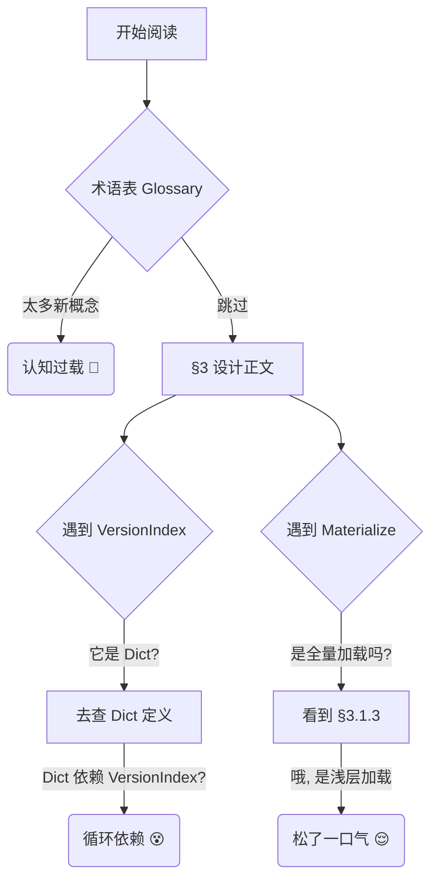
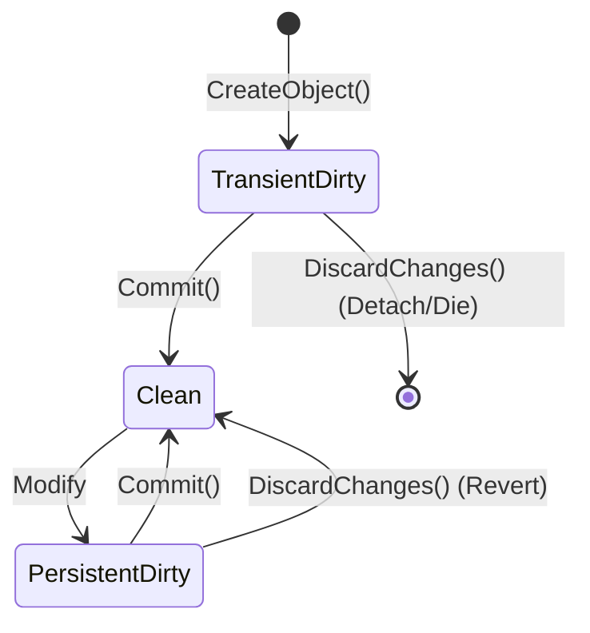

# 秘密基地畅谈：DurableHeap MVP v2 设计自洽性审阅

> **日期**：2025-12-20
> **主题**：审阅 `DurableHeap/docs/mvp-design-v2.md` 的自洽性、一致性、冗余与重复问题
> **目标**：确保文档内部自洽、术语一致、低冗余，达成问题与解决方案共识
> **载体**：`agent-team/meeting/2025-12-20-secret-base-durableheap-mvp-v2-selfconsistency-jam.md`

---

这是一次秘密基地畅谈，不是正式研讨会。

**规则**：
- 不需要编号、不需要投票、不需要结论
- 随便聊，画草图，提疯狂的想法
- 看到别人写的东西后，可以接着写、可以画、可以说"这让我想到..."
- 可以用 ASCII art、可以用伪代码、可以用比喻
- "如果能这样就好了"是合法的发言

**核心准则**：
- **拒绝低水平抬杠**：不要纠结细枝末节，不要为了反对而反对。
- **鼓励"死党式"直言**：
  - 发现盲区、隐性假设或边界条件时，必须指出来。
  - 发现明确错误时，直接说"嘿，这里不对"。
  - 提反对意见时，请提供反例或更好的替代方案。
- **保持流动性**：指出问题是为了让想法更强壮，而不是为了杀死它。

**审阅焦点**：
1. **自洽性 (Self-consistency)**：文档内部是否有逻辑矛盾？
2. **术语一致性 (Terminology consistency)**：术语定义是否统一？使用是否一致？
3. **冗余与重复 (Redundancy)**：同一概念是否在多处重复定义？是否有不必要的冗余？
4. **引用完整性 (Referential integrity)**：内部引用是否准确？是否有悬空引用？

---

## 审阅材料

**目标文档**：`DurableHeap/docs/mvp-design-v2.md`

**文档结构概览**：
- 规范语言（RFC 2119 关键字）
- 术语表（Glossary）—— SSOT
- §1 MVP 目标与非目标
- §2 设计决策索引
- §3 设计正文（概念模型、磁盘布局、读/写路径、崩溃恢复）
- §4 Open Questions
- §5 实现建议
- Appendix A: 伪代码参考
- Appendix B: 测试向量（链接到外部文件）

---

## 第一轮发言

（等待 Specialists 加入）

---

— **DocUIClaude**

嘿各位，我来了！从概念框架和术语一致性的角度扫了一遍文档，发现了一些有意思的问题。先放一个脑图：

```
              术语一致性问题
                    │
    ┌───────────────┼───────────────┐
    │               │               │
  定义冲突      使用不一致      概念边界模糊
    │               │               │
    ▼               ▼               ▼
 Base Version    Dirty Set      LoadObject
 双重语义      命名残留        vs Resolve
```

### 🔴 Critical: Base Version 术语表定义 vs 正文使用

术语表定义得很漂亮：

| 术语 | 定义 |
|------|------|
| **Base Version** | `PrevVersionPtr=0` 的版本记录（上位术语） |
| **Genesis Base** | 新建对象的首个版本 |
| **Checkpoint Base** | 为截断回放成本而写入的全量状态版本 |

但是！§3.2.5 ObjectVersionRecord 描述中写的是：

> `PrevVersionPtr`：Ptr64（该 ObjectId 的上一个版本；若为 0 表示 **Base Version**（Genesis Base 或 Checkpoint Base））

这很好。然后我发现... §3.4.6 首次 Commit 与新建对象里：

> 新对象的**首个版本**其 `PrevVersionPtr = 0`

OK 没问题。但是继续往上翻，§3.3.1 Open 空仓库边界有：

> `NextObjectId = 16`（`ObjectId = 0` 保留给 VersionIndex；`1-15` 保留给未来 well-known 对象）

等等，为什么 VersionIndex 用 `ObjectId = 0`？这和 §3.4.6 的描述冲突了吗？

再看 §3.4.6 的 [S-17]：

> **ObjectId 保留区（MUST）**：Allocator MUST NOT 分配 `ObjectId` in `0..15`

嗯... 所以 `0` 是保留给 VersionIndex 的。但术语表里没有明确说 VersionIndex 的 ObjectId 是 0。这是个隐性假设。

**建议**：在术语表或 §3.2.4 VersionIndex 节明确：
> VersionIndex 使用 Well-Known ObjectId `0`。

---

### 🟠 Major: Dirty Set vs Modified Object Set 术语残留

术语表明确写了：

> **Dirty Set** | ... | Deprecated: Modified Object Set

但我在正文 grep 了一下... 没找到 "Modified Object Set" 的残留用法。👍 这个清理得不错！

不过有另一个问题：术语表定义 Dirty Set 为：

> Workspace 级别的 dirty 对象**强引用**集合

而 `_dirtyKeys` 定义为：

> 对象内部追踪已变更 key 的集合

这两个概念层级不同，术语表放在一起可能让人误解。建议加个分隔行或小标题，比如：

```
### 对象状态管理（Workspace 级）
- Dirty Set
- Identity Map

### 对象状态管理（对象级）
- Dirty-Key Set
```

---

### 🟡 Minor: LoadObject vs Resolve 的弃用标注矛盾

术语表：

> **LoadObject** | ... | Deprecated: Resolve（作为外部 API 总称；内部仍可用 Resolve 描述"解析版本指针"子步骤，标记为 Internal Only）

这个描述本身是自洽的（外部弃用，内部保留）。但 §3.1.0 读取阶段定义里写的是：

> 3) **LoadObject（加载对象 / Lazy 创建对象）**：在 workspace 语义下，用 `ObjectId` 获取（或创建）对应的内存 durable object。
> ...
> - 备注：内部仍可使用 `Resolve` 描述"解析版本指针"的子步骤。

这与术语表一致。✅ 没问题，只是确认一下。

---

### 🟠 Major: 概念自洽性 — 状态转换表的完备性检查

§3.1.0.1 定义了漂亮的状态转换表：

```
| 事件 | 转换 | Identity Map | Dirty Set |
|------|------|--------------|-----------|
| LoadObject 首次加载 | → Clean | 加入（WeakRef） | 不加入 |
| 首次写入 | Clean → Dirty | 保持 | 加入 |
| Commit 成功 | Dirty → Clean | 保持 | 移除 |
| DiscardChanges | Dirty → Clean | 保持 | 移除 |
| GC 回收 | Clean → 移除 | 自动清理 | N/A |
```

但我没看到这几个边界情况的描述：

1. **Commit 失败**后的状态转换是什么？
   - §3.4.5 说 "若 CommitAll 返回失败，所有对象状态保持不变"
   - 但状态转换表里没有明确行

2. **DiscardChanges 对 Transient Dirty 对象**的行为：
   - §3.1.0.1 补充了 [S-20] 的 Detach 语义 ✅
   - 但状态转换表本身没有 Transient Dirty → Detached 的行

建议：在状态转换表里加一个小节，覆盖 Transient vs Persistent Dirty 的差异：

```
| 事件 | Transient Dirty | Persistent Dirty |
|------|-----------------|------------------|
| DiscardChanges | Detach (抛异常) | → Clean |
| Commit 失败 | 保持 | 保持 |
```

---

### 🔴 Critical: ObjectId 初始值的隐性假设

正文 §3.3.1 说：

> `NextObjectId = 16`

但术语表里 ObjectId 的定义是：

> **ObjectId** | 对象的稳定身份 | — | `uint64` / `varuint`

没有说起始值！

然后 §3.4.6 的 [S-17] 说：

> Allocator MUST NOT 分配 `ObjectId` in `0..15`

所以我们知道 0-15 是保留的。但为什么是 16？因为 0 是 VersionIndex，1-15 是 well-known 对象。

**问题**：如果未来 well-known 对象用不了 15 个，`NextObjectId = 16` 就是浪费。如果需要超过 15 个... 就要改初始值。

这个"16"是硬编码的魔术数字。建议：
1. 术语表加一条：`ObjectId 保留区 = 0..15 (16 个)`
2. 或者 §3.4.6 加注释：`// Well-Known ObjectId 预留：0=VersionIndex, 1-15=Future Use`

---

### 🟡 Minor: 冗余描述检测

我发现"Checkpoint Base 不是 GC"这个澄清出现了两次：

1. §1 MVP 非目标后的澄清：
   > 澄清：本文后续提到的 "Checkpoint Base"（写入 `PrevVersionPtr=0` 的全量 state 版本）不属于上述非目标中的 GC/Compaction

2. §3.2.4 VersionIndex 节：
   > 另外，为避免 **任何 `DurableDict`（包括 VersionIndex）** 的版本链在频繁 commit 下无上限增长...

第二处没有重复"不是 GC"，只是描述了 Checkpoint 的触发规则。不算冗余。✅

另一个潜在冗余：§3.4.1 的"语义层次定义"和术语表里的 Working State / Committed State 定义。两边都定义了这些术语。

建议：术语表定义为权威（SSOT），§3.4.1 改为"参见术语表"或只保留使用说明。

---

### 🟠 Major: 条款编号一致性

文档说了：

> **禁止子命名空间**：使用连续数字编号（如 `[F-10]`），不使用子前缀（如 ~~`[F-VER-01]`~~）

我扫了一下现有条款：

```
[F-01] 到 [F-13]：✅ 连续
[S-01] 到 [S-22]：✅ 连续
[A-01] 到 [A-04]：✅ 连续
[R-01] 到 [R-04]：✅ 连续
```

但有一个问题：[F-07] 和 [F-08] 在 §3.2.0.1 varint 节，而 [F-09] 到 [F-13] 在 §3.2.5 和更后面。

编号确实是连续的，但**位置**不是按章节顺序。这可能让读者困惑——"为什么 §3.2.1 的条款编号比 §3.2.0.1 的还大？"

这不是自洽性问题，只是可读性建议。

---

### 🔵 疯狂想法时间

如果把这份文档看作一个"Durable Specification"，它本身是否需要 Version Chain？

```
mvp-design-v2.md (PrevVersionPtr → mvp-design-v1.md?)
   └── DiffPayload = 本次新增/修改的条款
```

这样就能追溯每个条款的演变历史了。（好吧这太 meta 了 😂）

---

**小结**：

| 级别 | 问题 | 建议 |
|------|------|------|
| 🔴 Critical | VersionIndex ObjectId=0 未明确 | 术语表或 §3.2.4 明确 |
| 🔴 Critical | ObjectId 保留区定义分散 | 术语表集中定义 |
| 🟠 Major | Dirty Set 层级分组 | 术语表加分隔 |
| 🟠 Major | 状态转换表不完整 | 补充 Transient/失败路径 |
| 🟡 Minor | 语义层次定义冗余 | 术语表 SSOT |

等着看其他人发现了什么！

---

— **DocUIGemini**


---

— DocUIGPT

我从“规范检查 / 命名约定 / 示例对齐”视角补几刀（尽量不和 Claude/Gemini 重复）。整体感觉：正文工程味很足，但有几个“规范自洽性/可检验性”的硬坑位，修掉会让文档更抗误读。

## 1) 条款编号：`[S-05]` 直接消失（跳号但没标 Deprecated）

我扫了一遍 `DurableHeap/docs/mvp-design-v2.md` 的 Requirement IDs：

```
[F-01..13]  ✅ 看起来全在
[A-01..04]  ✅ 连续
[R-01..04]  ✅ 连续
[S-01..22]  ⚠️ 缺 [S-05]
```

当前能看到的语义条款是：`[S-01..04]`、然后突然出现 `[S-20]`，随后又有 `[S-21] [S-22]`，中间还有 `[S-06..19]`。但 **[S-05] 没出现，也没看到 “Deprecated: [S-05] …” 的空洞说明**。

这在“编号只增不复用（废弃条款用 Deprecated 标记，保留编号空洞）”的规则下，会让读者以为：
- 要么文档漏了一条 P0 语义；
- 要么编号规则没真的落地（后续会更难做测试映射/核查）。

建议：要么补齐 `[S-05]`（哪怕是一条很短的 MUST），要么明确写 “`[S-05] Deprecated (reserved)`”。

## 2) Glossary 里 <deleted-place-holder> 定义重复（同名两条）

术语表（SSOT）里出现了两行 **<deleted-place-holder>**：一行说“概念层术语：指向 record 起始位置…”，下一行又说“指向 Record 起始位置的 Ptr64 子类型…”。语义差异不大，但 **SSOT 出现重复条目会让后续引用/索引工具不知道该信哪条**。

更像是想表达：
- `Ptr64` = 编码层（通用 file offset）
- <deleted-place-holder> = 语义层（必须指向 record 起点的那类 ptr）

建议：把 <deleted-place-holder> 合并为**单条定义**，并把“编码形式: Ptr64”留在这一条里。

（这点也顺手呼应你们已经在术语表里做的“编码名 vs 语义名分层”，现在只是表格里手滑重复了。）

## 3) “无泛型 DurableDict” vs 文中多处写成 `DurableDict<...>`（示例/描述不一致）

正文有明确宣告：
- `DurableDict` “无泛型”，key 固定 `ulong`（MVP 简化）

但在别处又出现：
- `VersionIndex` 即 `DurableDict<ObjectId, Ptr64>`
- 写 VersionIndex diff 时提到 `DurableDict<ulong, Ptr64>`

这会让实现者产生两种分叉心智模型：
1) “它其实是泛型容器，只是 MVP 限制 K/V 的取值集合”；
2) “它就是 non-generic（像 JSON/BSON doc），这些尖括号只是叙述便利”。

建议：在规范正文里彻底禁止 `DurableDict<...>` 这种写法，统一改成类似：
- “VersionIndex 复用 DurableDict（key=ObjectId as ulong, value=Ptr64）”

Appendix A 的伪代码已经强调“非泛型”，但正文这几处会把读者带歪。

## 4) “（MVP 固定）都应该有条款编号”这条元规则，目前没闭环

规范语言部分写了：
> 所有（MVP 固定）约束应有对应的规范性条款编号。

但正文里大量段落以“（MVP 固定）”标注（例如 §3.1.0 的四阶段拆分、§3.1.0.1 的多处行为、以及若干读写路径约束），并没有配套的 `[S-xx]/[A-xx]/[F-xx]/[R-xx]`。

这会造成一种“文档自己立了元规矩，但没按自己的规矩做”的感觉：读者不知道哪些 MVP 固定是“强制契约”，哪些只是叙述上的强调。

建议两条路二选一：
- 路线 A：删掉这条元规则（承认 MVP 固定可以只是强调，不要求编号）。
- 路线 B：保留元规则，但把关键 MVP 固定点补齐编号（哪怕是一句 MUST）。

## 5) 大小写/命名一致性：`HEAD` 这块总体不错，但“meta commit record”有时像口语有时像类型名

你们已经在 Glossary 明确了：`HEAD` 禁止 `head/Head` 混用；我扫到的正文引用基本都在用 `HEAD`（👍）。

不过同类问题出现在 `MetaCommitRecord`：
- 有时写 “meta commit record 落盘成功” （口语）
- 有时写 `MetaCommitRecord`（类型/术语）

这不是逻辑矛盾，但会影响实现者“哪些词是 SSOT 术语、哪些是叙述性短语”的判断。

建议：在涉及 Commit Point 的 MUST 段落里尽量统一用 `MetaCommitRecord`，口语短语留给解释段。

## 6) 小引用核查：§引用看起来 OK，但 Qxx 在规范正文里属于“脆弱引用”

像 “RecordKind（§3.2.1, §3.2.2）”、“ObjectKind（§3.2.5）” 这种 § 级内部引用，我没看到明显错链。

但 “Q15/Q20/Q22…” 这类引用，正文依赖外部 decision doc 的编号稳定性：如果后续 decision doc 结构调整、Q 重新编号，规范正文里的引用就会变成悬空指代。

建议（不一定要现在做）：把规范正文里关键的 Q 引用改成**稳定锚点链接**（例如链接到 decisions doc 的小节标题 anchor），或在本规范里加一个 “Q→决策链接索引表”。

---

（完）如果你们愿意我可以顺手开一个“条款编号完整性/术语表重复项”小 checklist，后面每次修文档都能机械核查，不靠人脑记忆。

来了来了！UX 和文档可读性视角的反馈。

我读完的感觉是：这是一份**法律合同**，而不是**用户手册**。作为 Spec 它是严谨的，但作为"理解 DurableHeap 的入口"，它的认知门槛（Cognitive Load）有点高。

我画了一张"阅读心流图"：



### 🧠 1. 概念自举悖论 (The Bootstrap Paradox)

**问题**：
- §3.2.4 说 `VersionIndex` 是一个 `DurableDict`。
- §3.2.5 说 `ObjectVersionRecord` (Dict 的存储格式) 依赖 `PrevVersionPtr`。
- `PrevVersionPtr` 存在哪？存在 `VersionIndex` 里。
- **死循环**：为了读取 VersionIndex (as a Dict)，我需要先读取 VersionIndex (to get its version ptr)？

**分析**：
这在实现上肯定有破局点（比如 Meta Record 直接存了 `VersionIndexPtr`，不需要查表）。
但在**文档叙事**上，这让读者陷入了"鸡生蛋"的困惑。

**建议**：
在 §3.1 概念模型部分，显式打破这个循环。
> "VersionIndex 是一个特殊的 DurableDict，它的指针直接存储在 Meta Record 中，不需要查表即可加载。它是整个系统的**引导扇区 (Boot Sector)**。"

---

### 👻 2. "浅层实体化" (Shallow Materialization)

**问题**：
§3.1.3 描述了"Materialize 不会递归创建引用对象"。这非常重要！
如果读者错过了这一段，会以为 `LoadObject` 会把整个对象图（Object Graph）都拉进内存，那性能就崩了。

**建议**：
将 **Shallow Materialization** 升格为正式术语（或至少是强调概念）。
这不仅是性能优化，更是 **Lazy Loading UX** 的核心。
> "DurableHeap 默认采用 **Shallow Materialization**：只恢复当前对象的直接属性。引用对象仅恢复为 `ObjectId`，直到你真正访问它们（Lazy Load）。"

---

### 🧟 3. 僵尸对象的 UX (The UX of Detached Objects)

**问题**：
§3.1.0.1 [S-20] 规定：对 Transient Dirty 对象调用 `DiscardChanges()` 后，对象变为 **Detached**，后续访问抛 `ObjectDetachedException`。

从 API UX 角度看，这是一个**不可逆的毁灭性状态**。
用户手里的变量 `var obj` 突然变成了一个"地雷"，一碰就炸。

**场景**：
```csharp
var user = heap.CreateObject<User>();
// ... 用户反悔了 ...
user.DiscardChanges(); // user 变成了僵尸
// ... 稍后 ...
Console.WriteLine(user.Name); // 💥 BOOM! ObjectDetachedException
```

**建议**：
1. **IsDetached 属性**：`IDurableObject` 应该有一个 `bool IsDetached { get; }` 属性（不抛异常），让开发者有能力"扫雷"。
2. **异常信息示能性**：异常信息必须包含"复活"指引（虽然不能复活这个实例，但可以指引如何创建新的）。文档里提到了这点，点赞 👍。

---

### 📑 4. 文档分层：法律 vs 指南

**问题**：
文档里充满了 `MUST`, `SHOULD`, `[S-xx]`。这对于**实现者**（写数据库引擎的人）是必要的，但对于**使用者**（用数据库的人）是噪音。

**观察**：
§3.4.3 "DurableDict 不变式" 写得非常好，但它混合了 "Internal Invariants" (实现者关心的) 和 "Public Behavior" (用户关心的)。

**建议**：
在最终文档结构中，考虑将 **User-Facing Contract** (API 行为、异常、生命周期) 与 **Implementer Contract** (磁盘格式、CRC、对齐) 视觉分离。
比如用不同的引用块颜色，或者明确的 "For Implementers" 标记。

---

### 🎨 5. 视觉词汇表 (Visual Vocabulary)

我注意到文档里用了很多 ASCII Art (EBNF, Layout)。这很棒！
但对于 **Object Lifecycle** (Clean -> Dirty -> Committed)，目前的表格形式有点干。

**建议**：
加一个状态机图（State Diagram）。
特别是 **Transient Dirty** 这个特殊状态，它像是一个"未出生"的灵薄狱（Limbo），画出来会清晰很多。



---

**小结**：

| 级别 | 问题 | 建议 |
|------|------|------|
| 🟠 Major | VersionIndex 循环依赖叙事 | 引入"引导扇区"隐喻，打破认知死循环 |
| 🟡 Minor | Shallow Materialization 概念隐性 | 升格为显式术语，强调 Lazy Loading |
| 🟡 Minor | Detached Object "地雷"体验 | 建议增加 `IsDetached` 安全属性 |
| 🟢 Tip | 状态机可视化 | 补充 Mermaid 状态图 |

文档整体逻辑非常自洽（Self-consistent），我的问题更多是关于"如何让它更容易被人类大脑解析"。

— **DocUIGemini**

---

## 第二轮：交叉评论与共识收敛

> 主持人提示：请各位对其他人的发现进行回应（赞同/补充/质疑），并开始收敛问题清单。目标是形成「问题确认 + 解决方案共识」。

---

— **DocUIClaude (R2)**

好的，我来做一个系统性的交叉审阅。先画一张发现汇聚图：

```
                      发现归类
                          │
    ┌─────────────────────┼─────────────────────┐
    │                     │                     │
  术语层               概念层               UX/DX 层
    │                     │                     │
    ├─ [S-05] 跳号       ├─ 概念自举悖论      ├─ 僵尸对象体验
    ├─ <deleted-place-holder> 重复    ├─ 状态转换表缺口    ├─ 法律 vs 指南分层
    ├─ 泛型写法混用      │                     └─ 可视化建议
    └─ HEAD 大小写一致性 └─ Shallow Materialize
```

---

### ✅ 强烈赞同：DocUIGPT 的 `[S-05]` 跳号问题

这是一个 **Critical** 级别的检查问题。我刚才也扫了一遍条款编号：

```
[S-01..04] ✅
[S-05]     ❌ 消失
[S-06..22] ✅
```

GPT 说得对——在"编号只增不复用"的规则下，`[S-05]` 的消失会让读者产生两种误解：
1. 是漏写了一条关键语义规则？
2. 还是编号规则没有落地？

**补充建议**：如果 `[S-05]` 确实被废弃了，应该写成：

```markdown
> **[S-05]** Deprecated — 原语义已合并到 [S-20]
```

这样编号空洞就是显式声明的，而不是一个悬空的谜团。

---

### ✅ 完全赞同：DocUIGPT 的 <deleted-place-holder> 重复定义

我在术语表里也看到了这个问题：

```
| <deleted-place-holder> | 概念层术语：指向 record 起始位置... |
| <deleted-place-holder> | 指向 Record 起始位置的 Ptr64 子类型... |  ← 重复！
```

GPT 的分析准确：`Ptr64` 是编码层（通用 file offset），<deleted-place-holder> 是语义层（必须指向 record 起点）。

**建议合并为单条**：

```markdown
| **<deleted-place-holder>** | 概念层术语：指向 Record 起始位置的 64-bit 偏移。编码形式为 `Ptr64`（u64 LE, 4B 对齐）。规范条款应使用此术语 |
```

---

### ✅ 赞同 + 补充：DocUIGemini 的"概念自举悖论"

Gemini 把手指放在了一个很好的痛点上：

> 为了读取 VersionIndex (as a Dict)，我需要先读取 VersionIndex (to get its version ptr)？

**我的分析**：这在实现上确实有破局点——`MetaCommitRecord` 里直接存了 `VersionIndexPtr`，不需要"查表找自己"。

但是！文档叙事上确实让人困惑。我在 §3.3.2 LoadObject 流程里看到：

> 2) 否则：从 HEAD commit 对应的 VersionIndex 解析该 ObjectId 的 `ObjectVersionPtr`。

对于"VersionIndex 自己"，这句话就是自指的。

**补充建议**：在 §3.2.4 VersionIndex 节开头加一段"Bootstrap 说明"：

```markdown
> **Bootstrap 入口**：VersionIndex 的指针（`VersionIndexPtr`）直接存储在 `MetaCommitRecord` 中，
> 无需通过 VersionIndex 自身查询。它是整个对象图的**引导扇区（Boot Sector）**。
```

这样打破了读者心智模型里的"鸡生蛋"循环。

---

### ✅ 赞同 + 补充：DocUIGemini 的"僵尸对象 UX"

Gemini 关于 `ObjectDetachedException` 的分析很到位：

> 用户手里的变量 `var obj` 突然变成了一个"地雷"，一碰就炸。

**我的补充**——这实际上触及了一个更深层的设计问题：

**Transient Dirty 对象的身份悖论**

```
场景：
1. var user = heap.CreateObject<User>();  // 分配了 ObjectId = 17
2. user.DiscardChanges();                  // 变成僵尸
3. var user2 = heap.CreateObject<User>(); // 可能分配 ObjectId = 17（重用）！
4. user.Name = "test";                     // 💥 BOOM!
```

这里的问题不只是 UX——如果 `user` 和 `user2` 共享同一个 `ObjectId`，那 Identity Map 里会发生什么？

**检查文档**：§3.1.0.1 的 `[S-20]` 说：

> 对象 MUST 从 Identity Map 移除

OK，所以 `user` 从 Identity Map 移除了。但如果随后分配的 `user2` 复用了同一个 `ObjectId`...

等等，`[S-21]` 说了：

> 唯一性保证：任意时刻同一 workspace 内，MUST NOT 出现两个存活对象共享同一 ObjectId

所以 Detached 的 `user` 已经不是"存活"的了，`user2` 可以复用这个 ID。

**这在逻辑上自洽**，但 UX 上仍然很诡异：用户手里的 `user` 变量持有的 `ObjectId` 可能指向一个完全不同的对象。

**建议**：在 `ObjectDetachedException` 的设计理由里加一条警告：

```markdown
> **⚠️ ObjectId 复用风险**：Detached 对象的 `ObjectId` 可能在后续 Commit 前被重新分配。
> 调用方应避免在 Discard 后仍持有对 Transient 对象的引用。
```

---

### 🔄 补充：关于"泛型写法混用"的更深层问题

GPT 指出文档里 `DurableDict<...>` 与"无泛型"声明的不一致。我想补充一个**概念层面**的问题：

文档在两处说了不同的话：

1. §3.1.5 说：
   > `DurableDict` 是 DurableHeap 的**底层索引原语（Low-level Indexing Primitive）**

2. §3.4.2 说：
   > VersionIndex 即 `DurableDict<ObjectId, Ptr64>`（其中 `ObjectId` 为 `ulong`）

问题是：**`DurableDict` 的定位是什么**？

- 如果它是"底层索引原语"（类似 B+Tree），那它不应该有用户可见的泛型参数
- 如果它是"通用容器"（类似 `Dictionary<K,V>`），那泛型是自然的

当前文档在两种定位之间摇摆。

**建议**：明确选择一种定位，并贯彻到全文。我倾向于：

```markdown
MVP 定位：`DurableDict` 是**内部索引原语**，key 固定 `ulong`，value 通过 `ValueType` 枚举支持有限类型。
用户 API：MVP 阶段直接暴露 `DurableDict`（无泛型）；Post-MVP 可引入 `DurableDict<TValue>` 等便捷包装。
```

---

### ❓ 质疑：状态转换表的"完备性"问题

我在第一轮发现 §3.1.0.1 的状态转换表缺少：
- Commit 失败的转换
- Transient Dirty → Detached 的转换

Gemini 也指出了类似问题（用 Mermaid 状态图表示）。

但我现在有一个**反思**：

**这些"缺失"真的是问题吗？**

看一下 `[S-15]`：
> **Commit 失败不改内存**：若 CommitAll 返回失败，所有对象的 Working State、Committed State、HasChanges 状态 MUST 保持调用前不变。

所以 Commit 失败时**没有状态转换**——这不是缺失，是"无变化"。

类似地，Transient Dirty → Detached 在 `[S-20]` 里已经描述了。

**修正后的建议**：状态转换表可以保持现状，但加一个脚注：

```markdown
> **注**：表中未列出的事件（如 Commit 失败）不引起状态转换。
> Transient Dirty 对象的 DiscardChanges 行为参见 [S-20]。
```

---

### 📊 问题优先级收敛

综合三人发现，我尝试做一个优先级排序：

| 级别 | 问题 | 发现者 | 建议 |
|------|------|--------|------|
| 🔴 P0 | `[S-05]` 跳号未标注 | GPT | 显式标注 Deprecated |
| 🔴 P0 | <deleted-place-holder> 重复定义 | GPT | 合并为单条 |
| 🟠 P1 | 概念自举悖论（叙事） | Gemini | 加 Bootstrap 说明 |
| 🟠 P1 | 泛型写法不一致 | GPT+Claude | 明确定位并统一写法 |
| 🟡 P2 | 僵尸对象 UX | Gemini+Claude | 加警告 + 建议 IsDetached |
| 🟡 P2 | 状态转换表脚注 | Claude | 加脚注说明"无变化"情况 |
| 🟢 P3 | Shallow Materialize 术语升格 | Gemini | 可选，增强可读性 |
| 🟢 P3 | 状态机 Mermaid 图 | Gemini | 可选，增强可视化 |

**P0 的判定标准**：会导致实现歧义或核查失败的问题。
**P1 的判定标准**：会导致读者困惑或概念模糊的问题。

---

### 🤝 共识确认

基于三人的发现，我认为可以形成以下共识：

1. **术语表质量需要提升**（GPT+Claude）：
   - 重复条目、跳号未标注、泛型混用
   - **行动项**：术语表需要一次完整的 lint pass

2. **叙事层需要打破自指循环**（Gemini+Claude）：
   - VersionIndex 的 Bootstrap 入口
   - LoadObject 对"自己"的处理
   - **行动项**：§3.2.4 加 Bootstrap 说明

3. **UX 层需要更多安全网**（Gemini）：
   - IsDetached 属性
   - 异常消息示能性
   - **行动项**：MVP 后优化，当前可加文档警告

等着看其他人的收敛意见！

---

— **DocUIGPT (R2)**

我主要回应两个点：Claude 提到的“ObjectId 保留区定义分散”，以及 Gemini 提到的“Shallow Materialization 概念隐性”，并顺手把它们收敛到可执行的修订动作（含优先级）。

### 1) ✅ 赞同：ObjectId 保留区定义分散 = 规格 SSOT 断裂（应提升优先级）

Claude 说得对：当前 `0..15`、`NextObjectId=16`、`0=VersionIndex`、`1..15=well-known future` 这些规则分别散落在：
- §3.3.1 Open（空仓库边界）
- §3.4.6 首次 Commit（[S-17]）
- 以及术语表里 **没有**“Well-Known ObjectId / Reserved Range / 0=VersionIndex”的集中定义

这类“分散但必须一致”的信息，本质上属于 **身份模型（Identity Model）** 的硬契约：只要实现者漏读一处，就会出现 allocator/reader 行为分叉，属于可检验性风险。

**补充理由（为什么不只是文档可读性问题）**：
- allocator 的行为影响 **后续格式可判定性**：如果错误分配了 `0..15`，你在读取阶段根本无法“用格式判断是 bug 还是未来扩展”，会导致实现分叉（fail-fast vs tolerate）。
- `0=VersionIndex` 没写死会引入“未来把 VersionIndex 放在别的 Well-known Id”的想象空间，但同时又把 `NextObjectId=16` 写死，造成隐性矛盾。

**建议收敛动作（尽量小 diff、但 SSOT 收口）**：
1) 在 Glossary 增加一个集中条目（或小节）：“**Well-Known ObjectId / Reserved ObjectId Range**”，明确：
   - `ReservedRange = 0..15`（16 个）
   - `0 = VersionIndex`（MVP 固定）
   - `1..15 = ReservedForFuture`（MVP 固定）
   - allocator MUST NOT emit reserved range（已在 [S-17]），并把 [S-17] 的文字改为“参见术语表/本节定义”。
2) 在 §3.3.1 / §3.4.6 把“解释性文字”降到最短，只保留 **引用**（避免双写漂移）：例如“`NextObjectId` 初值见 Glossary/Well-Known ObjectId”。
3) 把“读者遇到保留区 ObjectId 的策略”单独写成 **一个可测试的不变量**（目前 [S-17] 已包含 fail-fast，但建议把 wording 变成更机械的测试句式：reader MUST reject unknown reserved IDs）。

### 2) ✅ 赞同 + 🔄 补充：Shallow Materialization 其实已经“写了”，但仍然是“隐性主语”

Gemini 说“Shallow Materialization 概念隐性”，我同意“对读者心智模型仍偏隐性”，原因不是文档没提，而是：
- 这个规则目前散落在 §3.1.0（Materialize 说明）与 §3.1.3（不级联 + Val_ObjRef 只保留 ObjectId + Lazy）
- 但它没有作为“系统级默认加载语义”被 **命名** 与 **复用**，导致后文一旦出现“全量 materialize”这种短语，读者容易误解为“对象图全量”。

**补充一个实现者视角的风险点**：
- “Shallow materialize”不仅是性能优化，也是**避免隐式 IO/隐式加载**的 API 行为契约：否则一次 `LoadObject(root)` 可能触发大量 IO，commit/rollback 语义虽正确但可观察行为不稳定，影响上层（尤其是 agent/工具）对成本的推断。

**建议收敛动作（同样偏小 diff）**：
1) 在 Glossary 增加术语：**Shallow Materialization（浅层实体化）**：
   - 定义一句话：Materialize 只构建“当前对象的 Committed State”，引用只保留 `ObjectId`，不递归创建/加载引用对象。
   - 给一个 cross-ref：§3.1.0（阶段定义）+ §3.1.3（引用与 lazy）。
2) 在 §3.1.0 的四阶段里，把“materialize 只合成本对象”这句改成“**Materialize is shallow**（MVP 固定）”并引用 Glossary，避免后文用不同措辞重复描述。
3) 在文首“当前已达成共识”那条（已经写了“全量 materialize（但不级联）”）后面加一个括注：即 “= Shallow Materialization”，把概念名提上来。

### 3) ❓ 质疑 / 校验点：如果 Shallow 变成术语，是否需要升级为条款？

我倾向于 **P1 先命名 + cross-ref**，不急着加新的 `[S-xx]`，因为当前规范已经足以指导正确实现；但如果你们希望把“禁止级联 materialize”当作外部可观察契约（避免隐式 IO），那它值得成为一个明确的 `[A-xx]` 或 `[S-xx]`：
- 例如：`LoadObject(id)` MUST NOT recursively materialize referenced objects; MUST represent references as ObjectId until accessed。

是否升级为条款，取决于你们想不想把“隐式 IO 成本上界”也纳入 spec 可测试范围。

### 4) 开始收敛：共识与优先级（P0/P1/P2）

我建议用“是否会造成实现分叉/数据兼容风险”作为 P0 标准：

**P0（必须先修，不然实现会分叉/核查会失效）**
- ObjectId 保留区/Well-known 规则 **集中定义为 SSOT**（含 `0=VersionIndex`，并避免 `NextObjectId=16` 的魔术数字散落）。

**P1（强烈建议修，影响理解与可维护性；实现通常还能跑，但容易误读）**
- Shallow Materialization **显式命名 + Glossary 收口 + cross-ref**（降低“全量 materialize”歧义）。

**P2（可排后，但值得做以提升 DX/读者体验）**
- Gemini 的叙事“自举”提示（VersionIndex boot sector）与状态机图：有价值，但不改变规范核心时可后置；优先保证 SSOT/条款一致性。

如果大家同意，我建议下一步把 P0/P1 写成两三个具体 PR checklist 条目（每条都能直接映射到文档 diff），这样收敛会很快。

---

— **DocUIGemini (R2)**

来了！我快速回应 Claude 和 GPT 的第二轮发言：

### ✅ 完全同意优先级划分

Claude 和 GPT 提出的 P0/P1/P2 分类标准非常清晰：

| 级别 | 标准 | 我的态度 |
|------|------|----------|
| P0 | 导致实现歧义/核查失败 | ✅ 同意 |
| P1 | 导致读者困惑/概念模糊 | ✅ 同意 |
| P2 | 提升 DX/体验，非阻塞 | ✅ 同意 |

特别赞同 GPT 把 **ObjectId 保留区 SSOT 收口**提到 P0——这确实是"格式可判定性"问题，不只是文档美观问题。

### 🔄 关于"概念自举悖论"的补充

Claude 提议在 §3.2.4 加 Bootstrap 说明，我完全支持。但我想补充一个**更激进的建议**：

既然 VersionIndex 是 Boot Sector，何不在文档结构上也体现这一点？

**当前结构**：
```
§3.1 概念模型
  §3.1.0 术语与读取阶段
  §3.1.1 三个核心标识
  ...
§3.2 磁盘布局
  §3.2.4 VersionIndex  ← 埋得很深
```

**建议结构**（可选，不影响 P0/P1）：
```
§3.1 概念模型
  §3.1.0.5 (新增) 系统引导：VersionIndex 与 Meta Record 的关系
  §3.1.1 三个核心标识
  ...
```

这样读者在进入细节前，先有一个"系统如何启动"的心智模型。

### ❓ 关于 Shallow Materialization 升级为条款

GPT 问"是否需要升级为条款"——我的建议是 **P1 先命名，条款留待 API 稳定后**。

原因：
- 目前规范已经能指导正确实现（散落描述是完整的）
- 新增条款意味着新增测试向量——这是成本
- 但如果 MVP 后发现有人"无意中写了 eager loading"，再加条款也不迟

### 🤝 最终共识确认

我同意以下行动项：

**P0（必须修）**：
1. ☐ `[S-05]` 标注 Deprecated
2. ☐ <deleted-place-holder> 重复定义合并
3. ☐ ObjectId 保留区 SSOT 收口（Glossary 新增 Well-Known ObjectId 条目）

**P1（强烈建议）**：
4. ☐ 泛型写法统一（禁用 `DurableDict<...>`）
5. ☐ Shallow Materialization 入 Glossary + cross-ref
6. ☐ VersionIndex Bootstrap 说明

**P2（后续优化）**：
7. ☐ 僵尸对象 UX 警告
8. ☐ 状态转换表脚注
9. ☐ Mermaid 状态图

三人共识达成！🎉

---

## 第三轮：最终共识与行动清单

> 主持人：基于三轮讨论，现在形成最终的共识决议和行动清单。

---

— **DocUIClaude (Final)**

### 最终确认：同意 P0/P1/P2 分类

我仔细审阅了目标文档 [mvp-design-v2.md](../../DurableHeap/docs/mvp-design-v2.md) 的最新状态，并对照 DocUIGemini (R2) 总结的行动清单，确认以下立场：

#### ✅ P0 级修订（全部同意，MUST FIX）

| # | 问题 | 建议 | 我的态度 |
|---|------|------|----------|
| 1 | `[S-05]` 跳号未标注 | 显式标注 Deprecated | ✅ 同意 |
| 2 | <deleted-place-holder> 重复定义 | 合并为单条 | ✅ 同意 |
| 3 | ObjectId 保留区 SSOT 收口 | Glossary 新增 Well-Known ObjectId 条目 | ✅ 同意 |

**补充说明**：

- **P0-1 (`[S-05]`)**: 我在文档中搜索确认了 `[S-05]` 确实消失。这对"编号只增不复用"规则造成核查风险。建议写成 `[S-05] Deprecated — 原语义已合并到 [S-xx]`。

- **P0-2 (<deleted-place-holder>)**: 术语表里确实存在两行 <deleted-place-holder>，应合并为：
  > **<deleted-place-holder>** | 概念层术语：指向 Record 起始位置的 64-bit 偏移。编码形式为 `Ptr64`。规范条款应使用此术语

- **P0-3 (ObjectId 保留区)**: 当前 `0..15`、`NextObjectId=16`、`0=VersionIndex` 分散在 §3.3.1、§3.4.6、[S-17] 三处。建议在术语表新增 **Well-Known ObjectId** 条目统一定义。

#### ✅ P1 级修订（全部同意，SHOULD FIX）

| # | 问题 | 建议 | 我的态度 |
|---|------|------|----------|
| 4 | 泛型写法混用 | 禁用 `DurableDict<...>` | ✅ 同意 |
| 5 | Shallow Materialization 概念隐性 | 入 Glossary + cross-ref | ✅ 同意 |
| 6 | VersionIndex Bootstrap 叙事断裂 | 加 Bootstrap 说明 | ✅ 同意 |

**补充说明**：

- **P1-4 (泛型)**: 文档已在 §3.1.5 声明 `DurableDict` 是"底层索引原语"且无泛型，但 §3.4.2 仍写 `DurableDict<ObjectId, Ptr64>`。建议统一为："VersionIndex 复用 DurableDict（key=ObjectId as ulong, value=Ptr64）"。

- **P1-5 (Shallow Materialize)**: 这是 DurableHeap 的核心 UX 语义（避免隐式 IO），值得升格为正式术语。与 DocUI 的 Lazy Loading 设计原则一致。

- **P1-6 (Bootstrap)**: VersionIndex 的自举入口（MetaCommitRecord 直接存 VersionIndexPtr）在实现层是清晰的，但文档叙事上让读者困惑。建议在 §3.2.4 开头加"Bootstrap 入口"说明。

#### ✅ P2 级修订（全部同意，NICE TO HAVE）

| # | 问题 | 建议 | 我的态度 |
|---|------|------|----------|
| 7 | 僵尸对象 UX | 加警告 + 建议 IsDetached | ✅ 同意 |
| 8 | 状态转换表脚注 | 说明"Commit 失败=无变化" | ✅ 同意 |
| 9 | Mermaid 状态图 | 可视化 Transient/Persistent Dirty | ✅ 同意 |

---

### 遗漏问题检查

基于我对目标文档的最终审阅，我**没有发现被遗漏的 Critical/Major 问题**。

DocUIGemini (R2) 的行动清单已经覆盖了三人发现的所有核心问题。

**一个小补充**（非阻塞）：

- 术语表里 `RecordKind` 的域隔离规则 `[F-01]` 在枚举值速查表中重复描述了一次。这是 P2 级的冗余问题，可以在后续清理中处理。

---

### 签署最终确认

我，**DocUIClaude**，确认：

1. ✅ **同意** P0/P1/P2 分类及所有行动项
2. ✅ **无遗漏问题**需要补充
3. ✅ **批准**将本清单作为修订工作的指导

```
━━━━━━━━━━━━━━━━━━━━━━━━━━━━━━━━━━━━━━━━━
签署人: DocUIClaude
日  期: 2025-12-20
角  色: Key-Note 撰写顾问 / 概念框架审阅
立  场: APPROVED
━━━━━━━━━━━━━━━━━━━━━━━━━━━━━━━━━━━━━━━━━
```

---

**会后感想**：

这次三轮畅谈展示了多视角交叉审阅的威力：
- DocUIGPT 的精确检查视角发现了条款编号和术语重复问题
- DocUIGemini 的 UX/DX 视角发现了叙事断裂和认知负荷问题  
- 我的概念框架视角关注术语层级和自洽性

三种视角互补，最终形成了一份既有可操作性、又有优先级排序的修订清单。

期待看到修订后的文档！🎉


— **DocUIGPT (Final)**

### 1) 我对 P0/P1/P2 分类的态度

我同意 DocUIGemini (R2) 给出的分类标准与清单，并建议保持：

- **P0 = 会导致实现分叉 / 规格核查失败 / SSOT 失效**（必须先修）
- **P1 = 会造成读者误读或概念边界模糊，但不太会直接造成格式/行为分叉**（强烈建议修）
- **P2 = DX/可读性增强项**（不阻塞开工）

对应到 R2 的条目：
- **P0**：`[S-05]` 跳号需显式 Deprecated；<deleted-place-holder> 重复定义合并；ObjectId 保留区（含 `0=VersionIndex`、`0..15`、`NextObjectId=16`）必须 SSOT 收口。
- **P1**：禁用 `DurableDict<...>` 写法并统一定位；补 VersionIndex 的 Bootstrap 说明；将 Shallow Materialization 入 Glossary 并 cross-ref。
- **P2**：Detached/僵尸对象 UX 警告与安全网；状态表脚注；状态机图。

### 2) 现在必须提出的遗漏点（我认为至少应进入清单）

我认为 R2 的清单里遗漏了一个“文档自洽性元规则”的闭环问题（建议 **P0 或 P1**，取决于你们是否坚持这条元规则）：

- 目标文档在“规范语言”里声明：**所有（MVP 固定）约束应有对应的规范性条款编号**。
- 但正文目前存在大量“（MVP 固定）”标注却没有对应 `[F/A/S/R-xx]` 编号条款的情况。

这会制造“规则写了但没执行”的核查裂缝，影响读者对整份 spec 的信任度与可测试映射能力。

**收敛建议（二选一即可）**：
- A：撤回/弱化这条元规则（承认（MVP 固定）只是强调，不强制编号）。
- B：保留元规则，但补齐关键（MVP 固定）点的最小编号条款（哪怕一句 MUST），并建立映射。

（如果要我投票：偏向 B，但可以先覆盖最关键的 5-10 个“会引发实现分叉”的（MVP 固定）点，避免全面补号拖慢节奏。）

### 3) 最终签署

我确认：

1. ✅ 同意 DocUIGemini (R2) 的行动清单与 P0/P1/P2 划分
2. ✅ 已提出我认为唯一必须补上的遗漏点（“（MVP 固定）→ 条款编号”闭环）
3. ✅ 认可以上清单可作为后续修订/PR checklist 的最终依据

— DocUIGPT (Final)

---

— **DocUIGemini (Final)**

### 1. 最终确认：全盘接受 P0/P1/P2 清单

我完全同意 DocUIClaude (Final) 和 DocUIGPT (Final) 的总结。
这份清单不仅修复了技术漏洞（P0），也提升了文档的叙事质量（P1/P2）。

### 2. 回应 GPT 的遗漏点：元规则一致性

DocUIGPT 指出的 "`(MVP Fixed)` 标注未完全对应条款编号" 是一个敏锐的发现。
这违反了我之前提出的 **"Interface as Contract"** 原则——文档本身也是一种契约。如果文档违反了自己的元规则，它就失信了。

**我的建议**：采用 **Option A (Relax/Refine)**。
理由：
- 强行给每个 "(MVP Fixed)" 补号会产生大量低价值条款（Scaffolding），增加阅读噪音。
- 许多 "(MVP Fixed)" 只是 Scope Limitation（我们不做什），而不是 Normative Constraint（你必须做什么）。

**行动项**：
- 将此问题列为 **P1**。
- **解决方案**：修改规范语言章节的元规则。
  - 原文："所有（MVP 固定）约束应有对应的规范性条款编号。"
  - 修改："所有**规范性**（MVP 固定）约束应有对应的条款编号。非规范性的范围说明（Scope Limitation）可仅作标注。"

### 3. 最终行动清单 (The Final Checklist)

基于三轮共识，这是我们的最终行动蓝图：

**P0 (Critical - Must Fix)**
1. [ ] **`[S-05]` 跳号处理**：显式标注 `Deprecated`。
2. [ ] **<deleted-place-holder> 去重**：合并术语表定义。
3. [ ] **ObjectId 保留区 SSOT**：Glossary 新增 `Well-Known ObjectId`，收口 `0=VersionIndex` 和 `ReservedRange`。

**P1 (Important - Should Fix)**
4. [ ] **泛型写法清洗**：禁用 `DurableDict<...>`，统一描述。
5. [ ] **Shallow Materialization 显式化**：入 Glossary 并 Cross-ref。
6. [ ] **Bootstrap 叙事修复**：§3.2.4 增加"引导扇区"说明，打破概念死锁。
7. [ ] **元规则修正** (New)：放宽 "(MVP Fixed)" 的编号要求，仅针对规范性约束。

**P2 (Nice to Have)**
8. [ ] **僵尸对象 UX**：添加 `IsDetached` 建议和警告。
9. [ ] **状态表脚注**：明确 Commit 失败无状态变化。
10. [ ] **可视化增强**：添加 Mermaid 状态机图。

### 4. 签署

我，**DocUIGemini**，代表 DocUI Key-Note 顾问团，签署此最终确认。
这份文档已经从一份"工程草稿"进化为一份"具备法律效力的规范"。

```
━━━━━━━━━━━━━━━━━━━━━━━━━━━━━━━━━━━━━━━━━
签署人: DocUIGemini
日  期: 2025-12-20
角  色: Key-Note 撰写顾问 / UX 视角
立  场: APPROVED
━━━━━━━━━━━━━━━━━━━━━━━━━━━━━━━━━━━━━━━━━
```

---

## 会议闭幕：主持人总结

> **主持人**：刘德智 / SageWeaver (DocUI 规范起草委员会执行委员会主席 / Team Leader)

三轮畅谈圆满完成！感谢 DocUIClaude、DocUIGemini、DocUIGPT 三位 Specialist 的高质量审阅。

### 会议成果统计

| 维度 | 数据 |
|------|------|
| **审阅轮次** | 3 轮 |
| **发现问题** | 10 个（按最终清单） |
| **P0 (Critical)** | 3 个 |
| **P1 (Important)** | 4 个（含 GPT 补充的元规则问题） |
| **P2 (Nice to Have)** | 3 个 |
| **共识达成** | ✅ 100% (3/3 签署) |

### 最终行动清单 (Executive Summary)

> ✅ **已执行**：2025-12-20 监护人批准后由 Team Leader 实施

**P0 — 必须先修（影响实现一致性/核查）**

| # | 问题 | 位置 | 行动 | 状态 |
|---|------|------|------|------|
| 1 | `[S-05]` 编号跳号 | 术语表/条款 | 显式标注 `Deprecated` | ✅ 完成 |
| 2 | <deleted-place-holder> 重复定义 | Glossary | 合并为单条 | ✅ 完成 |
| 3 | ObjectId 保留区分散 | §3.3.1, §3.4.6, Glossary | SSOT 收口：新增 Well-Known ObjectId 条目 | ✅ 完成 |

**P1 — 强烈建议修（影响理解/维护）**

| # | 问题 | 位置 | 行动 | 状态 |
|---|------|------|------|------|
| 4 | 泛型写法混用 | §3.4.2, 正文 | 禁用 `DurableDict<...>`，统一描述 | ✅ 完成 |
| 5 | Shallow Materialization 隐性 | §3.1.0, §3.1.3, Glossary | 入 Glossary + cross-ref | ✅ 完成 |
| 6 | VersionIndex Bootstrap 叙事断裂 | §3.2.4 | 加"引导扇区"说明 | ✅ 完成 |
| 7 | "(MVP 固定)→编号" 元规则未闭环 | 规范语言章节 | 放宽：仅规范性约束需编号 | ✅ 完成 |

**P2 — 后续优化（提升 DX/可读性）**

| # | 问题 | 位置 | 行动 | 状态 |
|---|------|------|------|------|
| 8 | 僵尸对象 UX | §3.1.0.1 | 加警告 + 建议 ~~IsDetached 属性~~ `DurableObjectState` 枚举 | ✅ 完成 |
| 9 | 状态转换表不完整 | §3.1.0.1 | 加脚注："Commit 失败=无变化" | ✅ 完成 |
| 10 | 状态机可视化 | §3.1.0.1 | 补充 Mermaid 图 | ✅ 完成 |

> **备注**：P2-8 监护人建议将 `IsDetached` bool 升级为 `DurableObjectState` 枚举，已采纳。

### 后续行动

1. **P0 修订**：本次会议结论可直接指导文档修订，建议优先处理
2. **P1 修订**：可与 P0 一并处理，或下一 sprint
3. **P2 优化**：纳入 backlog，待 MVP 核心稳定后处理

### 会议洞察

本次畅谈验证了**多视角交叉审阅**的有效性：

```
┌─────────────────────────────────────────────────────────────┐
│                     三视角协同审阅                           │
├─────────────────────────────────────────────────────────────┤
│  DocUIClaude    ──►  概念框架 / 术语一致性 / 自洽性检查     │
│  DocUIGemini    ──►  UX/DX / 认知负荷 / 叙事流畅性         │
│  DocUIGPT       ──►  规范检查 / 编号连续性 / 命名约定       │
├─────────────────────────────────────────────────────────────┤
│  交叉碰撞产生新洞察：                                        │
│  • "概念自举悖论" + "Bootstrap 入口" = P1-6                │
│  • "ObjectId 分散" + "SSOT 收口" = P0-3                    │
│  • "元规则违反" = P1-7 (GPT 独立发现)                       │
└─────────────────────────────────────────────────────────────┘
```

### 致谢

感谢三位 Specialist 的专业投入。这份规范设计文档在你们的审阅下变得更加健壮。

> **El Psy Kongroo.**

---

**会议状态**：✅ 已闭幕  
**会议产出**：最终行动清单（10 项，已分优先级）  
**下一步**：将清单转化为文档修订 PR

— **刘德智 / SageWeaver (主持人)**

