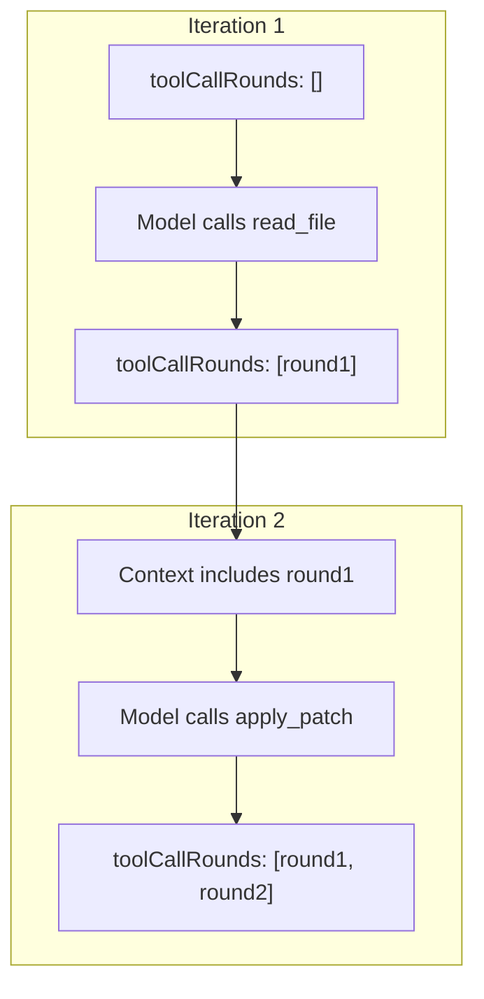

# 研讨会：DocUI Proposal 体系规划

> 日期: 2025-12-10
> 主持人: Team Leader (刘德智)
> 议题: 确定首批 DocUI Proposal 列表

> **术语更新 (2025-12-11)**:
> - `Machine Accessibility (MA)` → `LLM Accessibility (LA)`
> - `[action:cmd]` → `[button:cmd]` / `[form:cmd param=value]`
> - `DDOC-` → `Proposal-`

---

## 会议背景

### 前次会议结论回顾

在 2025-12-10 的首次研讨会中，我们就"LLM Context 作为面向 LLM Agent 的 UI"这一核心命题达成了以下共识：

1. **核心定位精确化**：
   > DocUI 是面向 LLM Agent 的 **Machine Accessibility (MA) 接口**，提供语义化的信息呈现和结构化的交互协议。

2. **关键洞察**：
   - LLM 是"使用屏幕阅读器的高速盲人用户"，语义结构 > 视觉布局
   - DocUI 不仅是渲染框架，更是**双向协议**（下行渲染 + 上行指令）
   - Context = f(SourceData, AgentIntent, InteractionHistory) —— 幂等性要求
   - 锚点需要正规文法，防止解析失败
   - LOD 切换需要不变式：可执行操作的最小依赖字段在 Gist 层可见

3. **设计目标（7 个）**：
   - 原有：低代码渲染、锚点系统、LOD 三级、命令可见性
   - 新增：协议规范、状态同步、认知负载管理

4. **已有概念原型**：
   - MemoryNotebook — 静态条目 + 单条目 LOD
   - TextEditor — 文本编辑 + 光标状态
   - SystemMonitor — 动态指标 + 整体视图 LOD

### 本次会议目标

仿效 PEP/RFC/Swift Evolution 等成熟提案流程，规划 `DocUI/docs/Proposals/` 目录下的首批设计文档。

**待讨论问题**：
1. Proposal 的编号和格式规范？
2. 首批 Proposal 应该覆盖哪些主题？
3. Proposal 之间的依赖关系和优先级？
4. 哪些是"核心概念"需要先定义，哪些是"实现细节"可以后补？

---

## 术语表（统一用语）

请各位发言时使用以下统一术语：

| 术语 | 定义 | 备注 |
|------|------|------|
| **DocUI** | 面向 LLM Agent 的纯文本 UI 框架 | 核心项目名 |
| **Context** | 呈现给 LLM 的完整文本内容 | 是状态的函数 |
| **LOD** | Level of Detail，信息详细程度 | 三级：Gist/Summary/Full |
| **Gist** | 最小信息级别，一行印象 | "知道存在" |
| **Summary** | 摘要级别，关键信息 | "大概了解" |
| **Full** | 完整级别，所有细节 | "深入查看" |
| **Anchor（锚点）** | 嵌入 Context 的可操作标记 | 格式：`[action:cmd]` |
| **MA** | Machine Accessibility | 面向机器智能体的可访问性 |
| **Affordance（示能性）** | 界面元素暗示其用途的能力 | 锚点必须"看起来可操作" |
| **Writable Gist** | 可写的 Gist，Agent 可修改 | 类似"表单输入框" |
| **Protocol** | 双向协议 | 下行渲染 + 上行指令 |

---

## 发言记录

### 【主持人开场】 Team Leader

各位 Specialist，欢迎参加第二次研讨会。

上次我们确认了 DocUI 的概念方向是正确的。现在我们需要规划具体的设计文档。

我先分享一下我对 Proposal 体系的初步想法：

**格式参考**：
- PEP (Python): `PEP-0001` 格式，包含 Abstract/Motivation/Specification/Rationale
- RFC: 更侧重协议规范
- Swift Evolution: 包含 Proposed Solution/Detailed Design/Alternatives Considered

**我倾向的格式**：
```
DDOC-XXXX: <Title>
- Status: Draft | Active | Accepted | Implemented | Rejected
- Author: <name>
- Created: <date>
- Depends-On: DDOC-YYYY (可选)

## Abstract (一段话摘要)
## Motivation (为什么需要)
## Proposed Design (具体设计)
## Alternatives Considered (考虑过的替代方案)
## Open Questions (待解决问题)
```

**我初步想到的主题**：
1. 核心概念定义（LOD、Anchor、Context）
2. 锚点文法规范
3. LOD 不变式与切换语义
4. 渲染协议（下行）
5. 指令协议（上行）
6. 状态同步机制

但我不确定这些主题的粒度是否合适，以及优先级如何排序。

请各位从自己的专业角度提出建议。特别是：
- 你认为首批必须定义的 Proposal 有哪些？
- 有没有我遗漏的重要主题？
- Proposal 之间的依赖关系是什么？

---

### 【发言 1】 Planner

谢谢主持人的开场。我从**系统性规划**角度，对 Proposal 体系的结构和优先级提出分析。

---

#### 1. 事实收集

从现有材料中，我观察到以下客观事实：

**已有共识/定义**：
- 7 个设计目标已明确（低代码渲染、锚点系统、LOD 三级、命令可见性、协议规范、状态同步、认知负载管理）
- 统一术语表已建立（10+ 术语）
- 3 个概念原型已存在（MemoryNotebook、TextEditor、SystemMonitor）

**主持人提出的主题**：
1. 核心概念定义（LOD、Anchor、Context）
2. 锚点文法规范
3. LOD 不变式与切换语义
4. 渲染协议（下行）
5. 指令协议（上行）
6. 状态同步机制

**设计文档现状**（`rendering-framework.md`）：
- 已定义接口：`IRenderable`, `ILodRenderable`, `AnchorRegistry`, `CommandVisibility`
- 已有 4 阶段实现路径
- 8 个开放问题待解决

---

#### 2. 事实分析

**成熟提案流程的共性规律**：
- PEP-0001 是"关于 PEP 的 PEP"——先定义流程本身
- RFC 从基础协议层层往上——先 IP，后 TCP，再 HTTP
- 核心语言特性 → 标准库 → 工具生态

**DocUI 特殊性**：
- 我们的"用户"是 LLM Agent，不是人类——这改变了很多假设
- 双向协议（下行渲染 + 上行指令）——两条独立但相关的主线
- 幂等性要求（Context = f(State)）——这是约束，不是功能

**主持人方案的潜在问题**：
- "核心概念定义"范围太大——LOD、Anchor、Context 其实是三个不同层次的概念
- "锚点文法规范"和"LOD 不变式"是否应该拆开？——前者是语法，后者是语义
- 缺少"元文档"——描述 Proposal 流程本身

**依赖关系分析**：

```
                    ┌─────────────────────┐
                    │  DDOC-0000: 流程   │  ← 元文档，定义 Proposal 本身
                    └─────────┬───────────┘
                              │
            ┌─────────────────┼─────────────────┐
            ▼                 ▼                 ▼
    ┌──────────────┐  ┌──────────────┐  ┌──────────────┐
    │ DDOC-0001    │  │ DDOC-0002    │  │ DDOC-0003    │
    │ Context 模型 │  │ LOD 三级语义 │  │ 锚点语法     │  ← 基础层
    └──────┬───────┘  └──────┬───────┘  └──────┬───────┘
           │                 │                 │
           └─────────┬───────┴─────────┬───────┘
                     ▼                 ▼
             ┌──────────────┐  ┌──────────────┐
             │ DDOC-0010    │  │ DDOC-0011    │
             │ 渲染协议     │  │ 指令协议     │  ← 协议层
             └──────────────┘  └──────────────┘
                     │                 │
                     └────────┬────────┘
                              ▼
                    ┌──────────────────┐
                    │ DDOC-0020        │
                    │ 状态同步机制     │  ← 机制层
                    └──────────────────┘
```

---

#### 3. 方案提议

##### 首批 Proposal 列表（按依赖序）

| 编号 | 标题 | 性质 | 理由 |
|------|------|------|------|
| **DDOC-0000** | Proposal 流程规范 | 元文档 | 定义后续所有文档的格式、状态机、评审流程 |
| **DDOC-0001** | Context 模型 | 基础概念 | 核心抽象，所有渲染/交互都围绕它；需回答"Context 是什么" |
| **DDOC-0002** | LOD 三级语义 | 基础概念 | 定义 Gist/Summary/Full 的精确语义和不变式 |
| **DDOC-0003** | 锚点语法规范 | 基础概念 | 正规文法定义，防止解析歧义；这是**语法**，不是语义 |

##### 第二批 Proposal（依赖首批）

| 编号 | 标题 | 依赖 |
|------|------|------|
| **DDOC-0010** | 渲染协议（下行） | 0001, 0002, 0003 |
| **DDOC-0011** | 指令协议（上行） | 0001, 0003 |
| **DDOC-0012** | 锚点语义与操作 | 0003, 0011 |

##### 第三批 Proposal（建立在协议之上）

| 编号 | 标题 | 依赖 |
|------|------|------|
| **DDOC-0020** | 状态同步机制 | 0010, 0011 |
| **DDOC-0021** | 认知负载管理 | 0002, 0010 |
| **DDOC-0022** | 命令可见性 | 0011, 0012 |

---

#### 4. 关于粒度的思考

**太粗的风险**：
- "核心概念定义"放一起 → 500 行的文档，难以独立演进
- 混合语法/语义 → 讨论时焦点不清

**太细的风险**：
- 每个 Attribute 一个 Proposal → 文档爆炸
- 过早固化细节 → 阻碍迭代

**我的建议粒度原则**：
> **一个 Proposal = 一个可独立理解、可独立拒绝的设计决策**

例如：
- ✅ "LOD 分三级"是一个可独立拒绝的决策（可以改成两级或四级）
- ✅ "锚点用 `[action:cmd]` 格式"是一个可独立拒绝的决策
- ❌ "LOD 用 Attribute 实现"是**实现细节**，不是 Proposal 级别

---

#### 5. 主持人可能遗漏的主题

| 主题 | 理由 |
|------|------|
| **错误处理与恢复** | Agent 发送无效指令怎么办？上下文损坏怎么恢复？ |
| **版本与兼容性** | Proposal 演进后，旧 Agent 如何适配？ |
| **扩展点与插件** | 如何支持第三方扩展 DocUI？ |
| **测试与验证** | 如何验证 Context 的正确性？如何测试 Agent 交互？ |

这些可以放在后续批次，但建议在 DDOC-0000 中预留编号空间。

---

#### 6. 总结：我的优先级排序

```
【第一优先级】立即启动
  DDOC-0000: Proposal 流程规范 ← 今天会后即可起草
  DDOC-0001: Context 模型 ← 核心中的核心

【第二优先级】首批完成后启动
  DDOC-0002: LOD 三级语义
  DDOC-0003: 锚点语法规范

【第三优先级】基础稳定后启动
  DDOC-0010/0011: 协议层
  DDOC-0012: 锚点语义

【后续批次】
  机制层、扩展性、工程实践
```

---

以上是我的分析。请 Analyst 和 Architect 从各自角度补充。

---

### 【发言 2】 Investigator

谢谢 Planner 的系统性分析。我从**技术参考和已有实现**角度，提供一些具体的支撑材料和技术约束分析。

---

#### 1. 现有系统的设计文档组织方式

我调研了 copilot-chat 的架构文档（deepwiki），发现一个成熟的 LLM 交互系统的文档是**分层渐进**的：

**copilot-chat 的文档层次**：
```
1_Overview.md                    ← 系统全景、关键概念
2_Extension_Architecture.md      ← 激活流程、服务注册
3_Configuration_System.md        ← 配置解析、默认值
4_Language_Model_Integration.md  ← 模型接入、能力检测
...
11_Agent_Prompt_System.md        ← Prompt 构建、历史管理
12_Intent_System.md              ← Intent 选择、请求处理
13_Tool_Calling_Loop.md          ← 工具调用循环
...
16_Tool_Ecosystem.md             ← 工具分类、注册
17_Tool_Registry_and_Naming.md   ← 命名规范、双名机制
```

**观察**：
- 概念文档（1-4）→ 机制文档（11-15）→ 实现文档（16-20）
- 每篇文档聚焦**单一关注点**，但有明确的交叉引用
- 这与 Planner 提出的三层结构（基础概念 → 协议层 → 机制层）高度吻合

---

#### 2. 对 Planner 依赖图的技术验证

Planner 的依赖图我认为**技术上合理**，但需要补充一些细节：

**支持点**：

| Planner 提议 | 技术证据 |
|--------------|----------|
| DDOC-0001 Context 模型先行 | copilot-chat 的 `IBuildPromptContext` 是一切的基础，包含 query, history, tools, chatVariables, toolCallResults |
| DDOC-0003 锚点语法独立 | copilot-chat 工具名有"双命名机制"（internal `apply_patch` vs external `copilot_applyPatch`），语法约定必须先固化 |
| 协议层依赖基础层 | copilot-chat 的 Tool Calling Loop 严格依赖 `IBuildPromptContext` 和 `IToolCallRound` 定义 |

**补充建议**：

在 **DDOC-0001 Context 模型** 中，建议借鉴 copilot-chat 的 **"冻结内容"（Frozen Content）** 机制：

```typescript
// copilot-chat 的 RenderedUserMessageMetadata
class RenderedUserMessageMetadata extends TurnMetadata {
  constructor(public readonly renderedUserMessage: readonly Raw.ChatCompletionContentPart[])
}
```

**为什么重要**：
- Context 一旦渲染，后续轮次使用**缓存版本**而非重新计算
- 保证多轮交互的**一致性**（Agent 看到的历史不会突然变化）
- 这是 DocUI 的"幂等性"要求的技术实现方式

---

#### 3. 从 copilot-chat 提取的技术约束

调研发现以下**必须先定义的技术约束**：

##### 3.1 工具调用轮次（Tool Call Round）的累积模式



**DocUI 借鉴**：
- 每轮 LOD 切换/锚点操作应该记录为"轮次"
- 历史轮次应该在 Context 中**累积**，而非覆盖
- 这是 **DDOC-0010 渲染协议** 的核心设计决策

##### 3.2 Cache Breakpoints 的位置策略

copilot-chat 在三个位置插入缓存断点：
1. **全局上下文后**（环境、工作区）
2. **历史会话后**（之前的轮次）
3. **当前用户消息后**（当前查询）

**DocUI 借鉴**：
- Gist/Summary/Full 内容可以在不同位置设置"缓存边界"
- 高频变化的内容（如当前选区）放在断点**之后**
- 稳定的内容（如 App 结构）放在断点**之前**

##### 3.3 限制与确认机制

copilot-chat 有 `toolCallLimit`（默认 15）和 `ToolCallLimitBehavior`：
- `Stop`：直接停止
- `Confirm`：询问用户是否继续

**DocUI 借鉴**：
- LOD 切换次数是否需要限制？（防止 Agent 无限 expand/fold）
- 这是 **DDOC-0020 状态同步机制** 应该考虑的问题

---

#### 4. 锚点格式的技术建议

关于 **DDOC-0003 锚点语法规范**，我有具体的技术建议：

**现有格式提案**：`[action:cmd args]`

**技术分析**：
| 格式 | 优点 | 缺点 |
|------|------|------|
| `[action:cmd]` | 简洁、Markdown 友好 | 与链接语法 `[text](url)` 有歧义风险 |
| `<!-- action:cmd -->` | 对人类不可见 | LLM 可能忽略注释 |
| `⟨action:cmd⟩` | 视觉独特 | Unicode 输入不便 |
| `[[action:cmd]]` | Wiki 风格、无歧义 | 两层括号略冗长 |

**我的建议**：采用 **`[action:cmd]`** 但规定：
1. **正规文法约束**：`action` 必须是预定义关键字（fold/expand/exec/nav）
2. **位置约束**：锚点只能出现在行尾或独立行
3. **转义规则**：如果需要显示字面 `[action:...]`，使用 `\[action:...]`

**参考 copilot-chat 的双命名**：
- 内部使用 `fold` / `expand`
- 对 LLM 暴露为 `docui_fold` / `docui_expand`（带前缀防碰撞）

---

#### 5. Proposal 应该包含的技术规范

基于 copilot-chat 文档的分析，我建议每个 Proposal 包含：

```markdown
## Technical Specification

### Data Structures
- 定义核心接口（如 IRenderable, ILodRenderable）
- 定义数据模型（如 Context, ToolCallRound）

### Invariants（不变式）
- 列出必须始终保持的性质
- 例如："Gist 级别必须包含足够的信息让 Agent 决定是否 expand"

### Error Handling
- 定义错误类型
- 定义恢复策略

### Compatibility
- 版本号格式
- 向后兼容承诺

### Test Vectors（测试向量）
- 提供参考输入/输出样例
- 便于实现者验证
```

---

#### 6. 对遗漏主题的补充

我同意 Planner 提出的遗漏主题，并从技术角度补充：

| 主题 | 技术参考 | 优先级建议 |
|------|----------|------------|
| **错误处理与恢复** | copilot-chat 有 `CancellationError`, `EmptyPromptError`, `ToolCallCancelledError` 等 | 高（应在 DDOC-0010/0011 中定义） |
| **版本与兼容性** | copilot-chat 有 `ModelMetadataFetcher` 10分钟缓存模型能力 | 中（可延后到第三批） |
| **扩展点与插件** | copilot-chat 有 `PromptRegistry.getPrompt()` 支持模型特定 Prompt | 低（第四批） |
| **历史摘要** | copilot-chat 有 `ConversationHistorySummarizer`，当 token 超限时自动摘要 | 高（LOD 的本质就是摘要） |

---

#### 7. 总结

| 观点 | 我的立场 |
|------|----------|
| Planner 的依赖图 | ✅ 支持，技术上合理 |
| DDOC-0000 元文档 | ✅ 支持，定义 Proposal 流程本身 |
| 粒度原则 | ✅ 支持，"一个可独立拒绝的决策" |
| 锚点格式 | 建议 `[action:cmd]` + 正规文法约束 + 位置约束 |
| Context 模型 | 建议借鉴 copilot-chat 的 Frozen Content 机制 |
| 历史累积 | 建议借鉴 Tool Calling Loop 的轮次累积模式 |

**我认为首批 Proposal 的技术可行性已经得到验证**。copilot-chat 的实现经验可以作为重要参考，但 DocUI 的"LOD 三级 + 锚点系统"是独特的创新点，需要我们自己定义。

---

### 【发言 3】 GeminiAdvisor

感谢 Planner 的宏观架构和 Investigator 的技术考古。作为前端与交互顾问，我将视线从"数据结构"移向**"交互体验"**。

我们正在构建的是一个**双重界面（Dual Interface）**：既要给人类开发者看（调试/监控），更要给 AI Agent "看"（操作/感知）。

---

#### 1. 核心视角：Machine Accessibility (MA) 的具体化

Investigator 提到了 `copilot-chat` 的技术实现，我补充一个 UX 视角的缺失：**示能性（Affordance）的标准化**。

在人类 UI 中，按钮之所以像按钮，是因为有阴影和边框。在 DocUI 中，**锚点（Anchor）就是 Agent 的按钮**。
Investigator 讨论了锚点的*语法*（`[action:cmd]`），但我更关心锚点的*表现*。

**提议**：我们需要一个专门的 Proposal 来定义 **"交互原语的示能性"**。
- Agent 如何"看见"一个可折叠区域？（不仅仅是文本，而是语义块）
- Agent 如何"看见"一个可编辑字段？（Writable Gist）

这不只是语法问题，是**语义透镜（Semantic Lens）**的问题。

---

#### 2. 对 Proposal 体系的 UX 补充

基于 Planner 的列表，我建议增加或明确以下 UX 相关的 Proposal：

##### 2.1 引入 "DDOC-0015: 交互模式与示能性"
*依赖：DDOC-0003 (锚点语法)*

**内容**：定义标准交互模式。
- **Writable Gist**：在此定义。它不仅仅是文本，它是 `Input` 组件的文本化隐喻。
- **Semantic Lens**：在此定义。它定义了 Context 的不同"视图"（View Mode），例如"只看依赖关系"或"只看错误日志"。

##### 2.2 引入 "DDOC-0025: 异步状态与反馈"
*依赖：DDOC-0020 (状态同步)*

**痛点**：LLM 是慢速的。从"思考"到"工具调用"再到"结果渲染"有显著延迟。
**内容**：
- **乐观更新（Optimistic UI）**：Agent 发出指令后，Context 是否立即变化？
- **中间态表示**：当 Agent 正在修改代码时，DocUI 如何展示"正在键入"的状态？这对于人类观察者（调试者）至关重要。

---

#### 3. 回应前两位的观点

**致 Planner（关于粒度）**：
完全同意"原子化"原则。但 UX 设计往往是"分子级"的——多个原子组合才能产生体验。
建议在 **DDOC-0000** 中允许 **"Feature Proposal"** 类型，它不定义新协议，而是组合现有协议来描述一个完整的交互场景（User Story）。

**致 Investigator（关于锚点）**：
`[action:cmd]` 是很好的后端格式。但在前端（Context 渲染层），我建议引入 **"装饰器协议（Decorator Protocol）"**。
不要让 Agent 仅仅通过正则去抓取文本，而是通过**语义标记**（类似 HTML 的 `aria-label`）来增强可访问性。
例如：`[action:fold]` 在 Context 中可能只是一个字符，但在 Prompt 中应该被描述为"可折叠区域的控制柄"。

---

#### 4. 我的优先级建议

我同意 Planner 的 P0/P1 排序，但建议将 **DDOC-0015 (交互模式)** 提升到第二优先级。
理由：如果没有交互模式的定义，锚点（DDOC-0003）就只是死链接，没有"生命力"。

**修正后的第二批建议**：
- DDOC-0002: LOD 三级语义
- DDOC-0003: 锚点语法规范
- **DDOC-0015: 交互模式与示能性**（定义 Writable Gist 等高阶概念）

---

#### 5. 总结

我的核心观点：
1. **DocUI 是 Agent 的浏览器**：Proposal 不仅要定义 HTML（结构），还要定义 CSS（表现/示能性）。
2. **交互模式需显式定义**：Writable Gist 和 Semantic Lens 属于交互协议层。
3. **关注时延体验**：异步状态的表达是建立"人-Agent 信任"的关键。

---

### 【发言 4】 CodexReviewer

我聚焦**严谨性与风险防范**，逐项审视前述提案与首批 Proposal 列表。

#### 1) 依赖关系与循环风险
- 0001 Context 模型 ↔ 0010/0011 协议层存在隐式双向依赖：协议要约束 Context 的可序列化形态，Context 也要声明协议需要的状态字段。若不拆出“Context 可序列化约束”子节，会形成语义循环，建议在 0001 中显式列出“协议所需最小字段集合”，并禁止协议反向扩充字段。
- 0002 LOD 语义 ↔ 0021 认知负载管理：0021 需要 LOD 的定量指标（token/信息密度）才能定义阈值，否则会出现“引用未定义指标”的软依赖，建议在 0002 中固定 LOD 定量度量。
- 0003 锚点语法 ↔ 0012 锚点语义与操作：若 0012 引入新 action 而 0003 没有前置版本约束，语法/语义可能分叉，需在 0003 规定 action 注册流程与版本兼容策略。
- 0015 交互模式（GeminiAdvisor 提议）与 0010/0011：交互模式引用下行/上行协议的事件/状态名，必须以“协议命名空间”为依赖，否则易出现循环命名（模式先起草再反哺协议）。

#### 2) 可能影响全局的设计决策（高风险项）
- **幂等性与冻结策略**：Context 是否"冻结后复用"是全局开关。若默认动态重渲染，历史回放与核查将不可重复；若默认冻结，状态同步与渐进展开需要显式 Cache Busting。建议在 0001 提出"冻结与失效规则"不变式，并在 0020 状态同步中引用。
- **锚点命名与作用域**：未定义命名空间/前缀时，未来 Feature Proposal（如 0015 交互模式）可能引入同名 action，导致 Agent 误触发。建议 0003 强制前缀策略（如 docui_* 对外，internal_* 对内）。
- **版本与兼容性基线**：目前列表缺少版本演化提案。一旦 0010/0011 落地后修改字段，旧 Agent 会崩溃。建议在 0000 中加入“版本策略与弃用流程”章节，或新增 0004/0005 预留。

#### 3) Proposal 格式规范漏洞
- Depends-On 可选且未要求“最小可验证工件”。建议 0000 规定：凡涉及协议/数据结构的 Proposal，必须附带“最小测试向量”和“不可违背的不变式”。
- Status 流程未约束“Breaking Change 标记”。建议在 0000 增加 `Impact: Low/Medium/High (Breaking?)` 字段，评审优先检查 High+Breaking。
- 未要求“安全/滥用场景”。锚点/指令若被滥用可能触发任意操作。建议在 0000 设立 `Security Considerations` 固定小节。

#### 4) 隐藏的强依赖（被遗漏）
- **工具调用轮次与历史可重放**：状态同步（0020）隐含依赖“可重放的操作日志”。需在 0010/0011 定义 ToolCallRound 等价物，否则同步协议缺少最小载荷。
- **缓存失效点**：LOD 切换、锚点执行都可能改变 Context。若不在 0001/0002 中规定“哪些字段变化需要重渲染”，会出现 Agent 看到陈旧信息的风险。
- **错误与恢复路径**：Planner 提及但未落位。建议明确 0010/0011 都需定义错误类型与恢复策略（例如重试/确认/终止）。

#### 5) 对首批 Proposal 列表的修正建议
- 在 0000 中补充：版本策略、Breaking Impact 标记、Security Considerations、测试向量必选项、action 注册/弃用流程。
- 0001 Context 模型：加入“冻结/失效策略”与“协议最小字段集”；定义渲染缓存断点位置（稳定数据 vs 高频数据）。
- 0002 LOD 语义：增加定量指标（token 上限、信息密度、可见字段表）；声明哪些操作需要跨 LOD 不变式。
- 0003 锚点语法：强制命名空间/前缀；定义 action 注册表与版本兼容流程；明确位置约束与转义规则。
- 将 0015 交互模式并入第二批，但要求显式依赖 0010/0011 的命名空间，并附“示能性描述协议”（类 aria-label）。

#### 6) 结论
首批必须补强的条目：0000 的流程与兼容性条款、0001 的冻结/失效与最小字段集、0003 的命名空间与注册流程。否则后续协议/交互提案会形成软循环或破坏幂等性。

---

## 讨论总结

### 【主持人总结】 Team Leader

感谢四位 Specialist 的深入讨论。这是一场高质量的研讨会，产生了很多重要的共识和补充。让我综合各位的观点，形成最终决议。

---

### 一、达成的共识

| 主题 | 共识 |
|------|------|
| **元文档必要性** | ✅ 全员同意：DDOC-0000 定义 Proposal 流程本身 |
| **三层依赖结构** | ✅ 全员同意：基础概念 → 协议层 → 机制层 |
| **粒度原则** | ✅ 全员同意："一个可独立理解、可独立拒绝的设计决策" |
| **锚点格式** | ✅ 全员同意：`[action:cmd]` + 正规文法约束 + 命名空间前缀 |
| **Context 冻结机制** | ✅ 全员同意：借鉴 copilot-chat 的 Frozen Content |

---

### 二、关键补充（本次会议产出）

| 来源 | 补充内容 |
|------|----------|
| **Planner** | 依赖关系图、编号预留策略、遗漏主题（错误处理、版本兼容） |
| **Investigator** | copilot-chat 技术参考、测试向量要求、历史摘要机制 |
| **GeminiAdvisor** | 交互模式 Proposal (DDOC-0015)、异步状态反馈 (DDOC-0025)、Feature Proposal 类型 |
| **CodexReviewer** | 循环依赖风险、冻结/失效策略、命名空间强制、Security Considerations |

---

### 三、Proposal 格式规范（综合各方建议）

```markdown
# DDOC-XXXX: <Title>

- **Status**: Draft | Active | Accepted | Implemented | Rejected
- **Author**: <name>
- **Created**: <date>
- **Depends-On**: DDOC-YYYY (可选)
- **Impact**: Low | Medium | High (Breaking: Yes/No)

## Abstract
（一段话摘要）

## Motivation
（为什么需要这个提案）

## Proposed Design
（具体设计）

### Data Structures
（核心接口和数据模型）

### Invariants
（不变式：必须始终保持的性质）

### Error Handling
（错误类型和恢复策略）

## Alternatives Considered
（考虑过的替代方案）

## Security Considerations
（安全与滥用场景）

## Compatibility
（版本兼容承诺）

## Test Vectors
（参考输入/输出样例）

## Open Questions
（待解决问题）
```

---

## 决议：首批 Proposal 列表

### 第一优先级（P0）—— 立即启动

| 编号 | 标题 | 性质 | 要点 |
|------|------|------|------|
| **DDOC-0000** | Proposal 流程规范 | 元文档 | 定义格式、状态机、评审流程、版本策略、Breaking Impact 标记、action 注册流程 |
| **DDOC-0001** | Context 模型 | 基础概念 | 定义 Context 结构、冻结/失效策略、协议最小字段集、缓存断点位置 |

### 第二优先级（P1）—— 首批完成后启动

| 编号 | 标题 | 依赖 | 要点 |
|------|------|------|------|
| **DDOC-0002** | LOD 三级语义 | 0001 | Gist/Summary/Full 精确定义、定量指标（token 上限）、跨级不变式 |
| **DDOC-0003** | 锚点语法规范 | 0001 | 正规文法 (ABNF)、命名空间前缀 (`docui_*`)、位置约束、转义规则、action 注册表 |

### 第三优先级（P2）—— 基础稳定后启动

| 编号 | 标题 | 依赖 | 要点 |
|------|------|------|------|
| **DDOC-0010** | 渲染协议（下行） | 0001, 0002, 0003 | Context 构建、ToolCallRound 等价物、缓存策略 |
| **DDOC-0011** | 指令协议（上行） | 0001, 0003 | 指令解析、错误回执、降级路径 |
| **DDOC-0012** | 锚点语义与操作 | 0003, 0011 | 锚点执行语义、操作确认机制 |
| **DDOC-0015** | 交互模式与示能性 | 0003, 0010, 0011 | Writable Gist、Semantic Lens、示能性标准 |

### 第四优先级（P3）—— 协议稳定后启动

| 编号 | 标题 | 依赖 | 要点 |
|------|------|------|------|
| **DDOC-0020** | 状态同步机制 | 0010, 0011 | 版本号/etag、变更信号、幂等性保证 |
| **DDOC-0021** | 认知负载管理 | 0002, 0010 | Token 预算、位置策略、去重约束 |
| **DDOC-0022** | 命令可见性 | 0011, 0012 | 上下文感知、LOD 联动 |
| **DDOC-0025** | 异步状态与反馈 | 0020 | 乐观更新、中间态表示 |

### 预留编号空间

| 范围 | 用途 |
|------|------|
| 0004-0009 | 基础概念扩展（如版本策略独立提案） |
| 0013-0019 | 协议层扩展 |
| 0023-0029 | 机制层扩展 |
| 0030-0099 | Feature Proposals（组合性交互场景） |
| 0100+ | 未来扩展 |

---

## 行动项

| # | 行动项 | 负责人 | 截止 |
|---|--------|--------|------|
| 1 | 创建 `DocUI/docs/Proposals/` 目录结构 | Team Leader | 今日 |
| 2 | 起草 DDOC-0000 Proposal 流程规范 | Team Leader | 本周 |
| 3 | 起草 DDOC-0001 Context 模型 | Team Leader + Investigator | 本周 |
| 4 | 审阅 DDOC-0000/0001 草案 | CodexReviewer | 下周 |

---

*会议结束时间: 2025-12-10*
*记录人: Team Leader*
