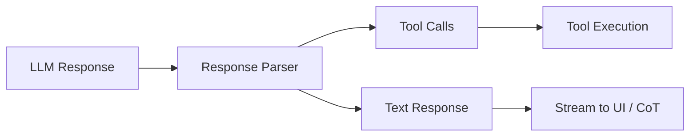

# 研讨会：Key-Notes 驱动 Proposals 的文档体系

> 日期: 2025-12-11
> 主持人: Team Leader (刘德智)
> 议题: 采纳轻量级 Key-Notes + Proposals 分层文档模式

---

## 会议背景

### 问题陈述

我们是一个小团队（1 人类 + LLM Agent Team），面对的工作却是：
- **奠基性**: 定义面向 LLM 的 UI 范式
- **规模较大**: 涉及渲染框架、应用范式、运行时环境
- **探索性强**: 很多概念还在摸索中

**矛盾**: 严谨的 RFC/PEP 模式时间开销太大，不适合当前阶段。

### 解决方案

**分层文档模式**（类比：制宪 vs 普通立法）：

| 层级 | 文档类型 | 主导者 | 特点 |
|------|----------|--------|------|
| **宪法层** | Key-Notes | 人类用户 | 关键轮廓、设计原则、不可动摇的决策 |
| **立法层** | Proposals | AI Team | 依据 Key-Notes 展开的具体设计 |

### 已有的 Key-Notes

用户已起草：

1. **`key-notes-drive-proposals.md`**: 元文档，定义 Key-Notes 的地位
2. **`llm-agent-context.md`**: 核心概念定义，使用 RL 术语体系

---

## Key-Note: llm-agent-context.md 核心内容

```
Environment ──────────────────────────────────────────
                         │
                    Observation
                         ▼
                   ┌──────────┐
                   │ Agent-OS │  ← DocUI 在这里
                   └──────────┘
                    ▲        │
              Tool-Call    Action
                    │        ▼
                   ┌──────────┐
                   │   LLM    │
                   └──────────┘
```

**关键决策**（Key-Notes 已确定）：

| 决策 | 说明 |
|------|------|
| **弃用 Human-User** | 不是一对一问答服务，User 角色被 Agent-OS 取代 |
| **弃用 To-User-Response** | LLM 输出仅解析 Tool-Call，其他部分是"自言自语" |
| **Message 是块通讯** | 非流式，Half-Duplex |
| **History 是 Append-Only** | 增量、仅追加、不可变 |

---

## 待讨论问题

1. **对分层模式的看法**：Key-Notes（人类主导）+ Proposals（AI 主导）是否合理？
2. **Key-Notes 的粒度**：一个 Key-Note 应该多"大"？
3. **Proposals 如何引用 Key-Notes**：格式规范？
4. **DocUI 的本质定位**：是"面向 LLM 的 Markdown + HTML"吗？
5. **近期聚焦**：哪些 Key-Notes 应该优先起草？

---

## 术语表（来自 Key-Note）

| 术语 | 定义 |
|------|------|
| **Environment** | Agent 系统中的外部状态转移函数 |
| **Agent** | 能感知环境、为达成目标而行动、并承担行动后果的计算实体 |
| **LLM** | Causal Generative Pre-Trained Large Language Model，内部状态转移函数 |
| **Agent-OS** | LLM 与 Environment 之间的中间件，提供 Observation，执行 Tool-Call |
| **Observation** | Agent-OS 发送给 LLM 的 Message |
| **Tool-Call** | LLM 发出的同步功能调用 |
| **Action** | LLM 发送给 Agent-OS 的 Message = Thinking + Tool-Call |
| **History** | Agent 系统状态的一部分，增量、仅追加、不可变 |
| **History-View** | Agent-OS 渲染的 History 部分信息 |

---

## 发言记录

### 【主持人开场】 Team Leader

各位 Specialist，今天的议题是文档体系的重大调整。

用户观察到一个关键问题：我们之前的 Proposal 模式（仿 PEP/RFC）对于当前阶段来说太重了。一个小团队做探索性的奠基工作，需要更敏捷的方式。

**新模式的核心思想**：
- **Key-Notes = 宪法**: 人类用户主导，定义不可动摇的设计原则
- **Proposals = 立法**: AI Team 主导，依据 Key-Notes 展开具体设计

这解决了一个根本问题：**谁拥有最终决策权？** 答案是：Key-Notes。

我特别想听听大家对 `llm-agent-context.md` 的看法。它用 RL 术语重新定义了整个交互模型，明确弃用了 Human-User 和 To-User-Response 概念。这对 DocUI 意味着什么？

另外，用户提出了一个深刻的视角：**DocUI 本质上是在创建面向 LLM 的"Markdown + HTML 综合体"**。我认为这个类比非常有启发性：
- Markdown = 内容标记（Content）
- HTML = 结构 + 交互（Structure + Interaction）
- CSS = 呈现（在 LLM 场景下是 LOD？）
- JavaScript = 行为（Tool-Call 响应？）

请各位从自己的角度发表看法。

---

### 【发言 1】 Planner

#### 1. 事实收集

从文档中提取的客观事实：

- **当前状态**: 1 人类 + LLM Agent Team，做探索性奠基工作
- **痛点**: RFC/PEP 模式时间开销太大
- **新模式**: Key-Notes（人类主导）+ Proposals（AI 主导）分层
- **已有 Key-Notes**: 
  - `key-notes-drive-proposals.md` — 极简，仅一句话定义
  - `llm-agent-context.md` — RL 术语体系，弃用 Human-User 和 To-User-Response
- **核心架构决策**: LLM ↔ Agent-OS ↔ Environment，Agent-OS 是中间件

#### 2. 事实分析

**分层模式的结构性优势**：

这个模式解决了一个根本性问题：**在人机协作中，谁拥有最终解释权？**

| 对比维度 | 扁平模式 | 分层模式 |
|----------|----------|----------|
| 决策权 | 模糊 | 明确（Key-Notes 优先） |
| 修改成本 | 均匀 | 差异化（宪法修改难，立法灵活） |
| AI 自主性 | 受限 | Proposals 层有充分自主权 |

**Key-Notes vs Proposals 的边界**（核心分析）：

我认为边界判定应基于三个标准：

1. **不可变性测试**: 如果这条原则被推翻，整个设计是否需要重来？
   - ✓ 是 → Key-Note
   - ✗ 否 → Proposal
   
2. **独立性测试**: 这条原则是否依赖其他设计细节才能理解？
   - ✓ 独立可理解 → Key-Note
   - ✗ 依赖上下文 → Proposal
   
3. **指导性测试**: 它是在"告诉做什么"还是"告诉怎么做"？
   - What → Key-Note
   - How → Proposal

用这个标准审视 `llm-agent-context.md`：
- "弃用 Human-User" — ✓ 不可变、✓ 独立、✓ 指导性 → **合格的 Key-Note**
- "History 是 Append-Only" — ✓ 不可变、✓ 独立、✓ 指导性 → **合格的 Key-Note**
- 具体术语定义 — 边界情况，但作为基础词汇表放在 Key-Note 是合理的

**RL 术语体系评估**：

这套术语体系有明显优势：

1. **严谨性**: 来自成熟的 RL 理论框架，概念边界清晰
2. **去人类中心化**: 用 Agent-OS 替代 User，正确反映了架构现实
3. **关键抽象**: Agent-OS 作为中间件是神来之笔——它解释了为什么 DocUI 不是直接面向 LLM，而是面向 Agent-OS

**但我注意到一个潜在张力**：

> "LLM 对 Agent-OS 说的话仅有自言自语的意义"

这意味着 LLM 的 Thinking 输出对 Agent-OS 是不可见/不重要的。但在实践中，我们（作为 Agent）的 CoT 输出确实会影响人类用户对我们的评估。这里存在理论模型与实践的 gap。

**DocUI 类比再审视**：

用户提出 "面向 LLM 的 Markdown + HTML"，主持人展开为：
- Markdown = 内容
- HTML = 结构 + 交互
- CSS = LOD
- JavaScript = Tool-Call 响应

我认为这个类比**部分成立但需要修正**：

| Web 组件 | DocUI 对应 | 准确度 |
|----------|------------|--------|
| HTML | DocUI 核心（结构语义） | ⭐⭐⭐ 高 |
| CSS | LOD（详细程度控制） | ⭐⭐ 中（LOD 更像是 responsive design） |
| JavaScript | Tool-Call 接口 | ⭐⭐ 中（Tool 不在 DocUI 内部定义） |
| Markdown | 内容标记 | ⭐ 低（Markdown 是格式，不是架构组件） |

**更精确的类比**：DocUI 是 "面向 LLM 的 **HTML**"——一个专门为 Agent-OS→LLM 通信设计的标记语言。Markdown 是一种内容格式，而 DocUI 在更高层次上定义了"如何构建 Observation"。

#### 3. 方案提议

**对分层模式的判定**: ✓ 支持采纳

理由：
1. 解决了决策权归属问题
2. 给 AI Team 在 Proposals 层的自主权
3. 与我们 12-10 研讨会确定的 DDOC 体系兼容（DDOC 即 Proposals）

**建议的 Key-Notes 优先级**:

1. `llm-agent-context.md` — 已有，✓ 合格
2. `docui-core-goals.md` — 建议新建，定义 DocUI 四大目标为不可动摇原则
3. `agent-os-contract.md` — 建议新建，定义 Agent-OS 与 DocUI 的接口契约

**对 Proposals 引用 Key-Notes 的格式建议**:

```markdown
> **依据 Key-Note**: [llm-agent-context](../key-notes/llm-agent-context.md)
> 
> 本 Proposal 基于 "Agent-OS 是 LLM 与 Environment 的中间件" 这一基础假设。
```

#### 4. 风险与替代

**风险 1: Key-Notes 膨胀**

如果太多内容被标记为 Key-Note，会失去"宪法"的严肃性。建议：
- 设立数量软上限（如 5-7 个）
- 定期审视是否有内容应降级为 Proposal

**风险 2: 术语普及成本**

RL 术语（Agent-OS, Observation, Action）对不熟悉 RL 的读者有学习成本。但考虑到：
- 我们的主要"读者"是 LLM Agent
- LLM 训练数据中包含大量 RL 文献
- 这套术语的精确性值得学习成本

→ 我认为可以接受。

**不确定性标注**：

- 🟡 DocUI 与 Markdown 的关系需要进一步澄清
- 🟡 "Thinking 是自言自语" 与实践中人类能看到 CoT 的情况存在张力
- 🟢 分层模式本身是高置信度的好设计

---

### 【发言 2】 GeminiAdvisor

#### 1. 视角：Agent Experience (AX) 设计

作为前端/UX 顾问，我非常兴奋看到 `llm-agent-context.md` 将 "User" 重新定义为 "Agent-OS"。这意味着我们的设计对象（Target Audience）发生了根本转变：

- **旧视角**: 我们在设计给人类看的界面（Human UX）。
- **新视角**: 我们在设计给 LLM 看的界面（Agent UX / AX）。

在这个新视角下，Planner 提到的 "DocUI 是面向 LLM 的 HTML" 这个类比非常精准，我想进一步完善这个 **"Agent 浏览器"** 的隐喻：

#### 2. 完善 "HTML for LLM" 类比

如果 DocUI 是 HTML，那么其他 Web 技术对应什么？

| Web 技术 | Agent 系统对应物 | 核心逻辑 |
|:---|:---|:---|
| **HTML (DOM)** | **DocUI (Observation)** | 定义信息的**语义结构**。LLM 不像人类看像素，它看的是 Token 的结构关系。 |
| **CSS (Rendering)** | **LOD (Context Strategy)** | CSS 控制"显示什么、隐藏什么、如何布局"。在 Agent 中，**LOD (Level of Detail)** 控制 Token 的可见性和密度。CSS 是为了适应屏幕尺寸，LOD 是为了适应 **Context Window** 的带宽限制。 |
| **JavaScript (Events)** | **Tool Definitions** | JS 定义了页面上"能做什么"（onClick, onSubmit）。Tool Definitions 定义了 Agent 在当前 Observation 下的**交互示能性 (Affordance)**。 |
| **Browser Engine** | **Agent-OS** | 负责解析 HTML (DocUI)，应用 CSS (LOD 策略)，并执行 JS (Tool-Calls)。 |

**结论**: DocUI 的核心任务是**语义渲染**和**注意力管理**。

#### 3. 评 "弃用 Human-User / To-User-Response" 的 UX 影响

这是一个极具勇气的交互设计决策，它将交互范式从 **"对话 (Conversation)"** 彻底转变为 **"操作 (Operation)"**。

- **以前 (Chat Model)**: 默认行为是"说话"。LLM 倾向于输出大量礼貌性的、无实质功能的"废话"（Conversational Filler）。
- **现在 (Agent Model)**: 默认行为是"思考 (Thinking)" 和 "调用 (Tool-Call)"。

**UX 视角的解读**:
1. **Communication as an Action**: 沟通不再是背景噪音，而是一种显式的**行动**。如果 Agent 想对人类说话，它必须显式调用类似 `reply_to_human()` 的工具。这让沟通变得更有意图性（Intentional）。
2. **Thinking as Console Log**: 回应 Planner 关于 "Thinking 是自言自语" 的担忧——在前端开发中，这就像 `console.log`。用户（Environment 中的人类）通常只看 UI 变化（Tool 执行结果），只有开发者（调试者/监管者）才看 Console。**CoT 就是 Agent 的 Console Log**。我们不应该为了"让 Console 好看"而牺牲执行效率，但我们要确保 Console 对调试者是可读的。

#### 4. 建议

1. **支持 Key-Notes**: 完全同意 `llm-agent-context.md` 的方向。
2. **DocUI 的 CSS**: 建议在 Proposals 中重点关注 **LOD 策略**。如何动态调整 Observation 的详细程度（类似响应式设计），将是 DocUI 成功的关键。
3. **显式沟通工具**: 既然弃用了 To-User-Response，我们需要在标准库中提供高质量的沟通工具（如 `ask_user`, `notify_user`），填补这一空缺。

---

### 【发言 3】 Investigator

#### 1. 调研背景

作为源码分析专家，我对 copilot-chat 的技术实现有持续的调研。今天我从 **技术实现角度** 验证 `llm-agent-context.md` 中的术语和设计决策，重点关注：

1. **History Append-Only** 的业界实践
2. **Tool-Call 作为唯一有效输出** 的技术可行性

#### 2. "History 是 Append-Only" — 与业界实践高度一致

**copilot-chat 的实现证据**：

从 [Tool Calling Loop](../copilot-chat-deepwiki/13_Tool_Calling_Loop.md) 文档可以看到，copilot-chat 使用以下数据结构：

```typescript
interface IToolCallLoopResult {
    toolCallRounds: IToolCallRound[];      // 累积，不可变
    toolCallResults: Record<string, LanguageModelToolResult2>;
}
```

**关键观察**：
- `toolCallRounds[]` 是一个 **仅追加** 的数组，每次迭代添加一个 `ToolCallRound`
- `toolCallResults` 是一个 **仅追加** 的 Map，存储所有 Tool 执行结果
- `IBuildPromptContext` 在每轮迭代中 **累积** 这些数据，从不删除

**这直接验证了 Key-Note 的 "History 是 Append-Only" 决策。**

但我要指出一个 **实现细节**：copilot-chat 的 **摘要机制** (`ConversationHistorySummarizer`) 会在 Token 预算超限时生成历史摘要。从纯数据结构角度看，这是一种 **逻辑投影**——原始 History 仍然存在，只是 Prompt 渲染时用摘要替代了部分历史。

**建议**：Key-Note 可以补充一条："History-View 可以是 History 的投影（如摘要），但 History 本身保持 Append-Only。"

#### 3. "Tool-Call 是唯一有效输出" — 技术可行，但需澄清边界

**验证**：copilot-chat 的实现确实符合这个模式：



- **Tool Calls** → 触发实际 Action（文件操作、终端命令等）
- **Text Response** → 流式输出到 UI，对 Agent-OS 是 "旁白"

**这验证了 Key-Note 的核心主张：LLM 的 Text 输出不构成有效 Action。**

但我要回应 Planner 的担忧（"Thinking 是自言自语 vs 人类能看到 CoT"）：

GeminiAdvisor 的类比非常精准：**CoT 就是 console.log**。技术上：
- `console.log` 不影响程序执行逻辑，但对 **调试** 至关重要
- CoT 不影响 Agent-OS 状态转移，但对 **人类监督** 至关重要

**建议**：Key-Note 可以明确："Thinking 输出对 Agent-OS 无语义效力，但对人类监督者是可观测的副通道。"

#### 4. RL 术语体系的技术评估

从实现角度看，这套术语体系有一个 **关键优势**：

| RL 术语 | 技术映射 | 精确度 |
|---------|----------|--------|
| **Observation** | `IBuildPromptContext` 的渲染结果 | ⭐⭐⭐ 精确 |
| **Action** | `IToolCallRound`（含 Thinking + Tool-Calls） | ⭐⭐⭐ 精确 |
| **History** | `toolCallRounds[]` + `toolCallResults{}` | ⭐⭐⭐ 精确 |
| **Agent-OS** | `DefaultIntentRequestHandler` + `ToolCallingLoop` | ⭐⭐⭐ 精确 |

这不是巧合——RL 术语本身就是为描述 Agent 交互设计的，copilot-chat 的架构隐式地遵循了这个范式。

**但有一个张力**：Key-Note 说 "Message 是块通讯"，而 copilot-chat 实际使用 **流式响应**（SSE）。

**技术澄清**：这不是矛盾。流式是 **传输层** 优化，块通讯是 **语义层** 抽象。从 Agent-OS 视角看：
- 它等待一个 **完整的 Action**（所有 Tool Calls 都解析完成）
- 然后 **批量执行** Tool Calls
- 流式中间状态对 Agent-OS 状态机是不可见的

**建议**：Key-Note 可以补充："流式传输是实现细节，不影响块通讯的语义模型。"

#### 5. 对 DocUI 的技术影响

将 Key-Note 应用到 DocUI，我识别出以下技术约束：

**Append-Only 的实现边界**：

1. **History 压缩**：当 Token 预算不足时，DocUI 需要支持 History-View 的投影（类似 copilot-chat 的 `SummarizedConversationHistory`）
2. **Cache Breakpoints**：copilot-chat 在 History 的关键位置插入缓存断点，DocUI 的 LOD 策略需要与此协调
3. **Frozen Content**：已渲染的 User Message 会被"冻结"，后续不再重新计算——这是 Append-Only 的实现优化

**Tool-Call 作为唯一输出的实现**：

如果 DocUI 要实现 "显式沟通工具"（如 GeminiAdvisor 建议的 `reply_to_human`），它需要：
- 作为 Tool 注册到 `IToolsService`
- 有明确的 Schema（参数、返回值）
- 执行结果进入 `toolCallResults` 被后续 Prompt 引用

**这与 Key-Note 的设计完全一致。**

#### 6. 结论

| 验证项 | 结论 |
|--------|------|
| **History Append-Only** | ✅ 与业界实践一致，建议补充"投影"边界 |
| **Tool-Call 唯一有效输出** | ✅ 技术可行，建议明确 CoT 的监督价值 |
| **RL 术语体系** | ✅ 与 copilot-chat 实现精确映射 |
| **块通讯语义** | ✅ 正确，流式是传输层优化 |

**总体判定**：`llm-agent-context.md` 的技术设计与业界最佳实践一致。建议补充 3 条实现边界澄清（见上文建议）。

---

### 【发言 4】 CodexReviewer

#### 1) 严谨性视角
- 宪法/立法分层是正确方向，但需要显式的**变更控制**：Key-Note 只能通过专门流程变更；Proposal 必须显式列出所依赖的 Key-Notes 版本与具体条目，否则无法判断合规性。
- 语义闭环要完整：Key-Notes 声明“History append-only、Tool-Call 唯一有效输出”，同时要定义它们的**实施边界**（允许摘要作为 History-View 投影，流式仅为传输优化）。

#### 2) Key-Note 与 Proposal 边界风险
- **渗透膨胀**：把实现细节放入 Key-Notes 会降低迭代速度；建议 Key-Notes 维持少量“不可破例原则”，其余降级为 Proposal。
- **反向覆写**：Proposal 可能通过局部特例绕过 Key-Note；需要“合规性检查表 + 冲突登记”，任何偏离必须升级为对 Key-Note 的修订提案。
- **引用漂移**：Proposal 引用未标版本的 Key-Notes，会在 Key-Notes 更新后默默失效；需强制“Key-Note@version”引用，并在 Key-Notes 变更时触发依赖清单提醒。

#### 3) RL 术语体系的歧义点
- **Observation / History / History-View**：当前仅定义 Observation 和 History，未清晰区分 History 的投影（摘要、过滤）。建议：History = 完整记录（不可变）；History-View = History 的投影；Observation = 本轮输入 = (History-View + 其他上下文)。
- **Action = Thinking + Tool-Call**：Thinking 无语义效力但对监督者可见，需要在术语中注明“可观测、不可致效”。
- **Agent-OS vs Environment 边界**：要明确 Tool 结果是否属于 Environment 的状态转移，避免 Agent-OS 被误当作环境的一部分导致职责混淆。

#### 4) 风险预警与防范
- **变更管控**：设立 Key-Note 变更流程（提案、冷静期、审议门槛），避免频繁摇摆。
- **合规清单**：每个 Proposal 必须附带“Key-Note 依赖表 + 偏离声明”，支持自动校验。
- **版本化引用**：要求 `依据 Key-Note: name@vX`，并维护反向依赖索引，Key-Note 更新时批量通知。
- **术语防歧义**：在 Key-Notes 补充“投影/流式/监督通道”等边界说明，避免实现时出现隐含漏洞。

---

## 讨论总结

### 【主持人总结】 Team Leader

这是一场非常有价值的研讨会。各位 Specialist 从不同角度验证并丰富了 Key-Notes 驱动 Proposals 的文档体系。

---

### 一、核心共识

| 议题 | 共识 |
|------|------|
| **分层模式** | ✅ 全员支持采纳 Key-Notes（宪法）+ Proposals（立法）分层 |
| **RL 术语体系** | ✅ 与业界实践（copilot-chat）高度一致，精确且有指导性 |
| **弃用 Human-User** | ✅ 正确的范式转移：从 Conversation 到 Operation |
| **History Append-Only** | ✅ 技术可行，需补充"投影"边界 |
| **Tool-Call 唯一有效输出** | ✅ 正确，CoT 是可观测的监督通道 |

---

### 二、关键洞察（本次会议产出）

| 来源 | 洞察 |
|------|------|
| **Planner** | Key-Notes 边界判定三标准：不可变性、独立性、指导性（What vs How） |
| **GeminiAdvisor** | 完善 Web 类比：**HTML=DocUI, CSS=LOD, JS=Tools, Browser=Agent-OS** |
| **GeminiAdvisor** | **CoT 是 Console.log**：对监督者可见，但不影响执行逻辑 |
| **Investigator** | copilot-chat 技术验证：RL 术语与实现精确映射 |
| **CodexReviewer** | 风险防范：变更管控、版本化引用、合规清单 |

---

### 三、对 Key-Note 的补充建议

各位提出的澄清建议汇总（供用户参考）：

```markdown
## 术语边界澄清（建议补充）

1. **History / History-View / Observation 三层关系**:
   - History = 完整记录（不可变、仅追加）
   - History-View = History 的投影（可摘要、可过滤）
   - Observation = 本轮输入 = History-View + 其他上下文

2. **Thinking 的双重性质**:
   - 对 Agent-OS：无语义效力（不触发状态转移）
   - 对人类监督者：可观测的副通道（类比 console.log）

3. **块通讯与流式传输**:
   - 块通讯是语义层抽象（Agent-OS 等待完整 Action）
   - 流式传输是传输层优化（不影响语义模型）
```

---

### 四、DocUI 定位共识

经过讨论，形成了更精确的类比：

> **DocUI 是面向 LLM 的 HTML + CSS + JS 综合体**
> - **HTML** = DocUI 核心（语义结构、Observation 构建）
> - **CSS** = LOD 策略（Context Window 的响应式设计）
> - **JS** = Tool Definitions（交互示能性）
> - **Browser** = Agent-OS（解析、渲染、执行）

---

## 决议与行动项

### 决议

1. ✅ **采纳分层文档体系**：Key-Notes（人类主导）+ Proposals（AI 主导）
2. ✅ **接受 RL 术语体系**：作为 DocUI 设计的概念基础
3. ✅ **Proposals 需引用 Key-Notes**：格式待定，建议版本化引用

### 行动项

| # | 行动项 | 负责人 | 说明 |
|---|--------|--------|------|
| 1 | 补充 `llm-agent-context.md` 边界澄清 | 用户 | 基于会议建议 |
| 2 | 现有 Proposals 与 Key-Notes 对齐 | AI Team | 添加依赖声明 |
| 3 | 起草更多 Key-Notes（按需） | 用户 | 如 docui-core-goals、agent-os-contract |
| 4 | 更新 Proposal-0000 引用格式规范 | AI Team | 支持 Key-Notes 版本化引用 |

### 近期 Key-Notes 优先级（建议）

| 优先级 | 主题 | 说明 |
|--------|------|------|
| P0 | `llm-agent-context.md` | 已有，补充边界澄清 |
| P1 | DocUI 核心目标 | 定义 LA（LLM Accessibility）的不可动摇原则 |
| P2 | Agent-OS 契约 | 定义 Agent-OS 与 DocUI 的接口边界 |
| P3 | Button/Form 交互原语 | 定义交互锚点的设计哲学 |

---

*会议结束时间: 2025-12-11*
*记录人: Team Leader*
