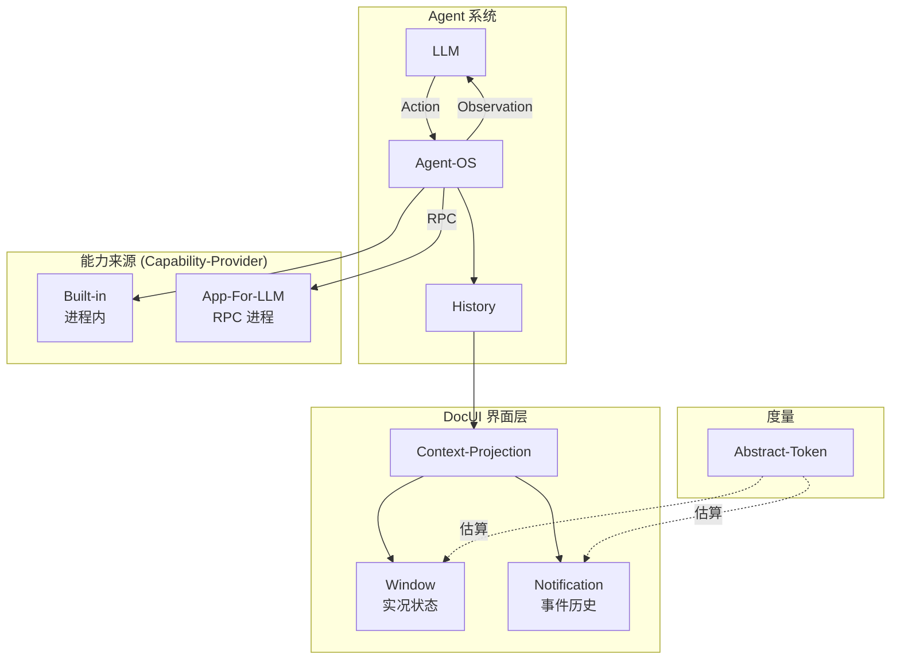

# Key-Notes 消化理解

> **最后同步时间**: 2025-12-14
> **Key-Note 数量**: 8 篇

---

## 整体架构理解

DocUI 是一个 **LLM-Native 用户界面框架**，其核心洞察是：

```
传统 UI 为人类设计 → DocUI 为 LLM 设计
人类通过视觉感知 GUI/TUI → LLM 通过文本感知 DocUI
人类通过鼠标/键盘操作 → LLM 通过 Tool-Call 操作
```

整体架构遵循强化学习概念体系：


---

## 各篇 Key-Note 摘要

### 0. [glossary.md](glossary.md) — 术语注册表 (SSOT) 🆕

**2025-12-13 新建**，作为 DocUI 术语的权威源。

**收录的核心术语**:
- 核心概念: Agent, Environment, Agent-OS, LLM
- 通信交互: Observation, Action, Tool-Call, Thinking
- 历史状态: History, HistoryEntry, History-View
- DocUI 核心: Context-Projection, Window, Notification
- 能力来源: Capability-Provider, Built-in, App-For-LLM

**术语使用规则**:
1. "App" 简称**仅指 App-For-LLM**
2. 统称使用 "Capability-Provider"
3. 复合术语用连字符: `Context-Projection`, `Capability-Provider`
4. 弃用术语用删除线标记

### 1. [llm-agent-context.md](llm-agent-context.md) — 术语体系基石

**核心概念定义**（已重构为标准定义块格式 2025-12-14）：

| 术语 | 定义 |
|------|------|
| **Agent** | 能感知环境、为达成目标而行动、并承担行动后果的计算实体 |
| **Environment** | Agent 系统中的外部状态转移函数 |
| **Agent-OS** | LLM 与 Environment 之间进行交互的中间件 |
| **LLM** | Agent 系统中的内部状态转移函数 |
| **Observation** | Agent-OS 发送给 LLM 的 Message |
| **Action** | LLM 发送给 Agent-OS 的 Message = Thinking + Tool-Call |
| **Tool-Call** | 由 LLM 发出、Agent-OS 执行的同步功能调用 |
| **Thinking** | Action 中非 Tool-Call 的 CoT 推理部分 |
| **Agent-History** | Agent 系统状态的一部分，增量、仅追加、不可变 |
| **HistoryEntry** | Agent-History 中的单条记录，含 Basic + Detail 两级 LOD |
| **History-View** | 经 Context-Projection 投影的 Agent-History 部分信息 |
| **Message** | LLM 与 Agent-OS 之间的一次单向信息传递 |
| **Context-Projection** | 从 HistoryEntry + AppState 生成 IHistoryMessage[] 的过程 |

**重要澄清**：
- **弃用 Human-User 概念**：没有 Chat 范式中的唯一用户，LLM 通过 Agent-OS 与 Environment 互动
- **弃用 To-User-Response 概念**：LLM 输出需通过 Tool-Call 才能影响 Environment
- **Thinking 的价值**：虽然 Agent-OS 不解析，但 CoT 是 Agent 的重要内部状态，影响后续 token 生成

**LLM 调用的 3 层模型**：
1. `HistoryEntry` — 丰富完整的 LLM 交互记录，含 Basic+Detail 两级 LOD
2. `IHistoryMessage` — 抽象的跨厂商 LLM 调用接口
3. `ICompletionClient` — 各厂商规范的具体实现

**2025-12-14 更新**:
- 术语定义块全面重构为标准格式：`### Term` + `> **Term** ...`
- 保留 Context-Projection 定义（含弃用的 ~~Render~~）
- 弃用概念转为标准定义块格式

---

### 2. [doc-as-usr-interface.md](doc-as-usr-interface.md) — DocUI 核心机制

**核心洞察**：LLM 是 Agent-OS 的用户，DocUI 是 LLM 获取信息和进行操作的界面。

**信息注入方式**：

| 方式 | 用途 | LOD 级别 |
|------|------|----------|
| **Window** | 呈现实况状态 | Full / Summary / Gist |
| **Notification** | 呈现事件历史 | Detail / Basic |

**LOD (Level of Detail) 设计**：
- **Gist**: 最小 token 占用，保留"What"和关键线索，是恢复认知的入口
- **Summary**: 甜点级别，信息实用性与 token 占用的平衡点
- **Full**: 展现所有原始信息

---

### 3. [app-for-llm.md](app-for-llm.md) — 扩展机制

**概念分离**：

| 概念 | 职责 |
|------|------|
| **DocUI** | 交互界面层：渲染、操作管理、调用路由、结果反馈 |
| **App-For-LLM** | 外部扩展机制：独立进程，通过 RPC 与 Agent 通信 |

**2025-12-13 更新 — Capability-Provider 概念**:

**Capability-Provider** 是通过 DocUI 向 LLM 提供能力的实体的统称：
- **Built-in**: 与 Agent 生命周期绑定，进程内直接调用
- **App-For-LLM (App)**: 独立进程，通过 RPC 通信

**术语约束**:
- "App" 简称**仅指 App-For-LLM**
- 需要统称时用 "Capability-Provider"

---

### 4. [abstract-token.md](abstract-token.md) — 跨模型度量

**问题**：不同模型分词器不同，难以准确获得特定模型下的 token 数。

**解决方案**：放弃准确计量，转而估算一种**跨模型的抽象信息量**，单位称为 **Abstract-Token**。

---

### 5. [key-notes-drive-proposals.md](key-notes-drive-proposals.md) — 元规则

Key-Note 是"宪法与关键帧"：
- 定义设计的关键轮廓
- 指导 Proposals 的撰写方向
- 由人类用户起草，AI 可辅助谨慎编辑

---

## 识别的核心概念图谱



---

## 已解决的概念缝隙（2025-12-13 修订）

1. ✅ **术语 SSOT 缺失** → 创建 glossary.md
2. ✅ **"Render" 术语过于宽泛** → 重命名为 Context-Projection
3. ✅ **DocUI 使用者命名问题** → 引入 Capability-Provider 统称

## 仍待解决的问题

1. **Attention Focus 机制未成文** — 暂缓，待人类补充
2. **3 层模型 Mermaid 图** — ✅ 已完成（图 1、图 2 in llm-agent-context.md）
3. **Abstract-Token 方案未确定** — 需实验数据
4. **术语治理架构调整** — 2025-12-14 研讨完成
   - ✅ 5 条共识已形成：Primary Definition、Glossary-as-Index、定义块格式、Restatement 规则、迁移机制
   - ✅ llm-agent-context.md 术语定义块已重构
   - 待执行：glossary.md 迁移（从"定义存放地"→"索引"）
   - 待执行：其他 Key-Note 定义块标准化
5. **UI-Anchor.md 完善中** — 2025-12-14 研讨会进行中
   - 三类锚点: Object-Anchor, Action-Prototype, Action-Link
   - REPL 范式: LLM 读文档 → 编写代码 → Agent-OS 执行
   - 开放问题: 锚点生存期（倾向临时方案）
6. **Micro-Wizard.md** — 骨架已建立，待完善
7. **Tool-As-Command 架构探索中** — 2025-12-15 畅谈
   - Command = CPS 化的协程，解决 Wizard 的多步状态和序列化问题
   - 需要扩展 Tool-Call 定义、新增 Command 概念
   - 可能影响 History 结构（支持挂起的 Command）

---

## 同步日志

| 日期 | 动作 |
|------|------|
| 2024-12-13 | 初始化，阅读全部 5 篇 Key-Note |
| 2024-12-13 | 唤醒验证：确认 5 篇 Key-Note 无变化 |
| 2025-12-13 | 研讨会唤醒：确认 Key-Note 无重大变化 |
| 2025-12-13 | **实施修订**: 创建 glossary.md；Render → Context-Projection；引入 Capability-Provider |
| 2025-12-14 | 发现新 Key-Note: action-anchor.md（半成型）、micro-wizard.md（空）；参与术语治理架构研讨会 |
| 2025-12-14 | **重构 llm-agent-context.md**: 术语定义块标准化（13 个术语 + 2 个弃用术语）|
| 2025-12-17 | 发现新 Key-Note: cursor-and-selection.md, error-feedback.md（待细读）|
