# Key-Notes 消化理解

> **最后同步时间**: 2024-12-13
> **Key-Note 数量**: 5 篇

---

## 整体架构理解

DocUI 是一个 **LLM-Native 用户界面框架**，其核心洞察是：

```
传统 UI 为人类设计 → DocUI 为 LLM 设计
人类通过视觉感知 GUI/TUI → LLM 通过文本感知 DocUI
人类通过鼠标/键盘操作 → LLM 通过 Tool-Call 操作
```

整体架构遵循强化学习概念体系：


---

## 各篇 Key-Note 摘要

### 1. [llm-agent-context.md](llm-agent-context.md) — 术语体系基石

**核心概念定义**：
| 术语 | 定义 |
|------|------|
| **Agent** | 能感知环境、为达成目标而行动、并承担行动后果的计算实体 |
| **Agent-OS** | LLM 与 Environment 之间进行交互的中间件 |
| **Observation** | Agent-OS 发送给 LLM 的 Message |
| **Action** | LLM 发送给 Agent-OS 的 Message = Thinking + Tool-Call |
| **History** | Agent 系统状态的一部分，增量、仅追加、不可变 |

**重要澄清**：
- **弃用 Human-User 概念**：没有 Chat 范式中的唯一用户，LLM 通过 Agent-OS 与 Environment 互动
- **Thinking 的价值**：虽然 Agent-OS 不解析，但 CoT 是 Agent 的重要内部状态，影响后续 token 生成

**LLM 调用的 3 层模型**：
1. `HistoryEntry` — 丰富完整的 LLM 交互记录，含 Basic+Detail 两级 LOD
2. `IHistoryMessage` — 抽象的跨厂商 LLM 调用接口
3. `ICompletionClient` — 各厂商规范的具体实现

**待解决 TODO**：
- 各厂商 API 规范的准确命名
- "Render" 术语过于宽泛，需要更精确的表述
- 3 层模型需要 Mermaid 图解

---

### 2. [doc-as-usr-interface.md](doc-as-usr-interface.md) — DocUI 核心机制

**核心洞察**：LLM 是 Agent-OS 的用户，DocUI 是 LLM 获取信息和进行操作的界面。

**信息注入方式**：

| 方式 | 用途 | LOD 级别 |
|------|------|----------|
| **Window** | 呈现实况状态 | Full / Summary / Gist |
| **Notification** | 呈现事件历史 | Detail / Basic |

**LOD (Level of Detail) 设计**：
- **Gist**: 最小 token 占用，保留"What"和关键线索，是恢复认知的入口
- **Summary**: 甜点级别，信息实用性与 token 占用的平衡点
- **Full**: 展现所有原始信息

**待消化的建议**（概念缝隙）：
- "Attention Focus" 概念：Agent 当前操作对象自动 Full，相关联对象 Summary，其余 Gist
- LOD 应是"信息维度切换"而非仅"字数减少"
- "Diff" 视角：在 Summary 级别标记 Dirty State

---

### 3. [app-for-llm.md](app-for-llm.md) — 扩展机制

**概念分离**：

| 概念 | 职责 |
|------|------|
| **DocUI** | 交互界面层：渲染、操作管理、调用路由、结果反馈 |
| **App-For-LLM** | 外部扩展机制：独立进程，通过 RPC 与 Agent 通信 |

**关键设计原则**：
1. **界面统一**：LLM 不需要区分功能来自内建还是外部扩展
2. **内建功能是"器官"**：Recap、上下文统计等与 Agent 生命周期绑定
3. **外部扩展走 RPC**：进程级隔离、语言无关、热重载
4. **不提供内嵌插件机制**：避免边界模糊

**架构类比**：
- DocUI 类似 VS Code 的 Extension Host 接口
- App-For-LLM 类似 VS Code Extension（独立进程）
- 内建功能类似 VS Code 核心模块

**待解决 TODO**：
- 为 DocUI 的两类使用实体制定命名或统一接口名

---

### 4. [abstract-token.md](abstract-token.md) — 跨模型度量

**问题**：不同模型分词器不同，难以准确获得特定模型下的 token 数。

**解决方案**：放弃准确计量，转而估算一种**跨模型的抽象信息量**，单位称为 **Abstract-Token**。

**候选计量方式**：
1. 逐字符统计 + 线性加权（快速但边缘情况有偏差）
2. 选定开源分词器作为标准（更准确）

**待解决 TODO**：
- 对比和选择最终计量方式

---

### 5. [key-notes-drive-proposals.md](key-notes-drive-proposals.md) — 元规则

Key-Note 是"宪法与关键帧"：
- 定义设计的关键轮廓
- 指导 Proposals 的撰写方向
- 由人类用户起草，AI 可辅助谨慎编辑

---

## 识别的核心概念图谱

```mermaid
graph TB
    subgraph "Agent 系统"
        LLM[LLM]
        AgentOS[Agent-OS]
        History[History]
    end
    
    subgraph "DocUI 界面层"
        Window[Window<br/>实况状态]
        Notification[Notification<br/>事件历史]
        Render[Render 过程]
    end
    
    subgraph "扩展机制"
        BuiltIn[内建功能<br/>器官]
        AppForLLM[App-For-LLM<br/>外部进程]
    end
    
    subgraph "度量"
        AbstractToken[Abstract-Token]
    end
    
    LLM -->|Action| AgentOS
    AgentOS -->|Observation| LLM
    AgentOS --> History
    
    History --> Render
    Render --> Window
    Render --> Notification
    
    AgentOS --> BuiltIn
    AgentOS -->|RPC| AppForLLM
    
    AbstractToken -.->|估算| Window
    AbstractToken -.->|估算| Notification
```



---

## 发现的概念缝隙与待改进点

### 高优先级

1. **Attention Focus 机制未成文**
   - 位置：[doc-as-usr-interface.md](doc-as-usr-interface.md) 待消化建议
   - 问题：LOD 级别如何与 Agent 操作动态关联？
   - 建议：需要一篇专门的 Key-Note 或在现有文档中正式化

2. **3 层模型缺乏可视化**
   - 位置：[llm-agent-context.md](llm-agent-context.md)
   - 问题：HistoryEntry → IHistoryMessage → ICompletionClient 的转换流程不够直观
   - 建议：补充 Mermaid 序列图

3. **DocUI 使用者命名问题**
   - 位置：[app-for-llm.md](app-for-llm.md) TODO
   - 问题：内建功能和 App-For-LLM 都通过 DocUI 暴露，但缺乏统一的术语
   - 建议：考虑 "Capability Provider" 或 "Feature Source" 作为统称

### 中优先级

4. **Abstract-Token 方案未确定**
   - 需要实验数据支撑决策

5. **"Render" 术语精确化**
   - 当前过于宽泛，可能与前端领域 Render 混淆
   - 候选：Materialize、Serialize、Project

### 低优先级

6. **Notification 的时间戳策略**
   - 每分钟 vs 每条的权衡需要更多讨论

---

## 同步日志

| 日期 | 动作 |
|------|------|
| 2024-12-13 | 初始化，阅读全部 5 篇 Key-Note |
| 2024-12-13 | 唤醒验证：确认 5 篇 Key-Note 无变化，内容与 digest 一致 |
