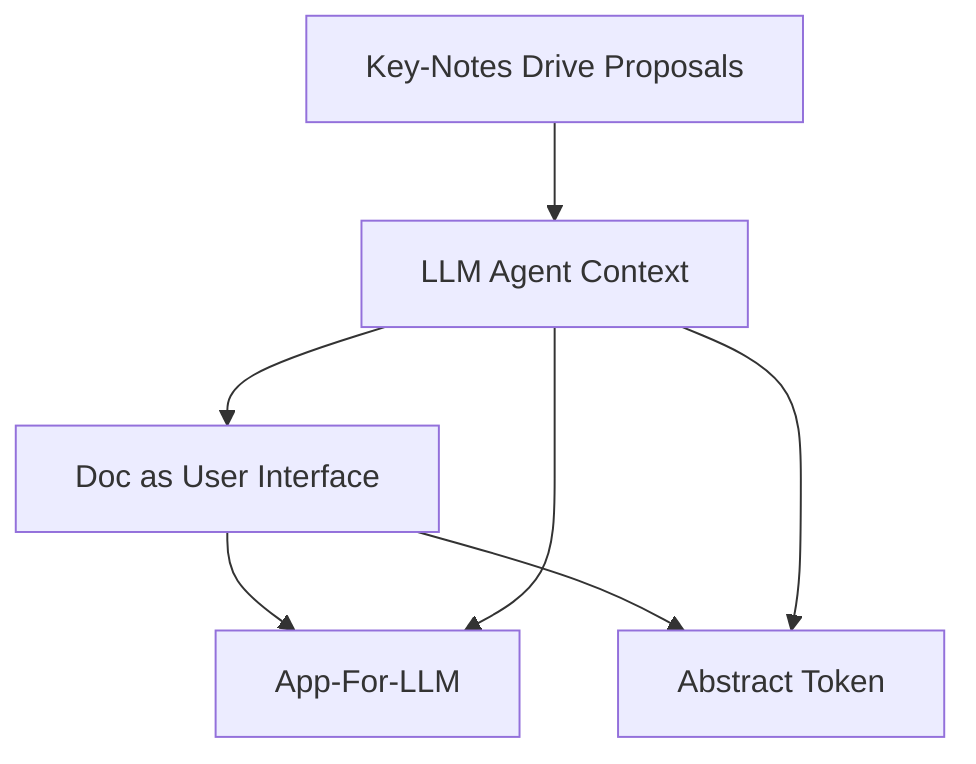

# Key-Notes 消化理解

> **最后同步时间**: 2025-12-13
> **Key-Note 数量**: 5
> **同步范围**: `DocUI/docs/key-notes/*.md`

---

## 整体架构理解（按 Key-Note 归纳）

DocUI 当前 Key-Note 体系在表达一个 RL 风格的 Agent 系统：

- **Agent / Environment**：用 RL 语言定义交互回路；LLM 被视为“内部状态转移函数”。
- **Agent-OS**：介于 LLM 与 Environment 之间的中间件，负责把系统状态渲染为 Observation、执行 Tool-Call 并维护 History。
- **DocUI**：Agent-OS 向 LLM 呈现“可感知世界 + 可执行动作”的界面层，采用 Markdown Document 作为主载体。
- **App-For-LLM**：对 Agent 能力的外部扩展机制（独立进程 + RPC），通过 DocUI 统一呈现给 LLM。
- **Context Budget / Abstract Token**：承认“有效上下文远小于最大窗口”这一工程现实，提供跨模型的抽象计量单位。

这 5 篇 key-note 的关系可粗略理解为：

---

## 各篇 Key-Note 摘要（逐篇）

### 1) `abstract-token.md`

**核心问题**
- 不同模型 tokenizer 不同且可能不可见，导致无法可靠地“精确计量某特定模型 token 数”。
- 工程上有效上下文长度显著小于最大上下文窗口（注意力稀释、计费等）。

**核心方案**
- 放弃对“模型特定 token”的精确计数，转而估算文本的跨模型抽象信息量单位：**Abstract Token**。

**候选计量方法**
1. 按字符类别线性加权拟合（快、简单，但边缘 case 偏差大）
2. 选定一个先进开源 tokenizer 作为统一计量基准

**开放问题 / TODO**
- 在“速度/一致性/可解释性/误差”之间选定最终实现。

---

### 2) `app-for-llm.md`

**核心定义**
- **App-For-LLM**：Agent 的外部扩展机制，把紧密相关的“数据 + 视图 + 操作”封装为整体供 LLM 使用。
- **DocUI**：LLM 与功能交互的界面层（渲染信息、管理可用操作、路由调用、反馈结果）。

**关键架构决策**
- DocUI 与 App-For-LLM **解耦**：
	- DocUI 作为统一交互界面，不关心能力来自内建还是外部。
	- **内建能力**（如 recap/history/context 统计）是 Agent 的“器官”，直接访问内部状态，不走 RPC。
	- **外部扩展**一律独立进程，走 RPC（PipeMux/JSON-RPC），带来隔离、语言无关、热更新。
	- 明确“不提供内嵌插件机制”，避免边界模糊。

**开放问题 / TODO**
- “使用 DocUI 的两类实体”命名与统一接口命名仍未定（推测指：内建能力 vs 外部 App，或 Agent-OS vs App）。

---

### 3) `doc-as-usr-interface.md`

**核心命题**
- “LLM 是 Agent-OS 的用户”。LLM 获取信息与执行操作的界面被称为 **DocUI**，因主要以 Markdown Document 形式渲染。

**与 GUI/TUI/API 的类比**
- 形态上更接近 TUI/Web server 的文本渲染，但选择 Markdown 是因为：LLM 语料熟悉、语法噪声低；XML/HTML 噪声大；JSON 存在转义序列问题。

**Context 注入的两种形态**
1. **Window**：在 Render 时生成一份 Markdown 文档，作为“最新 Observation”的正文部分；强调 LOD（信息层级）控制。
2. **Notification**：对近期历史与事件流的注入；HistoryEntry 按 LOD 渲染为 Basic/Detail。

**LOD 设计**
- Window LOD：`{Full, Summary, Gist}`
	- Gist：最小“What + 关键线索”，提供“提高 LOD 恢复认知”的入口
	- Summary：甜点级别（实用性 vs token），包含节点概述、重要链接、子节点列表链接
	- Full：原始信息
- Notification LOD：`{Basic, Detail}`

**待消化建议（高价值）**
- 引入 **Focus / Attention Focus**：操作会移动焦点；焦点对象 Full，相关对象 Summary，其余 Gist。
- LOD 应是“信息维度切换”，不只是“字数缩减”。
- 增加 **Diff/Dirty State**：显式标记自上次交互以来变化的部分，引导注意力。

**开放问题 / TODO**
- Summary 的树形/平铺渲染策略与展开时机未定。

---

### 4) `key-notes-drive-proposals.md`

**角色定位**
- Key-Notes 类似“宪法/关键帧”，定义设计关键轮廓，用于约束与指导 Proposal 的撰写方向。
- 起草主体是人类，AI 可辅助但需谨慎编辑。

---

### 5) `llm-agent-context.md`

**概念总纲**
- 采用 RL 概念体系建模，同时短期务实沿用 chat 范式的常规 LLM。
- 借用心理学术语：关注“外在行为/内在行为”，强调术语借用仅指等效机制与行为层面。

**关键术语定义（该文为术语源头）**
- **Environment**：外部状态转移函数
- **Agent**：可感知环境并行动的计算实体；系统存在内部/外部状态转移函数交替作用
- **LLM**：内部状态转移函数（典型 autoregressive，也可能 diffusion）
- **Agent-OS**：LLM 与 Environment 之间的中间件；向 LLM 提供 Observation，执行 Tool-Call
- **Message**：单向分块传递（Half-Duplex）
- **Observation**：Agent-OS → LLM 的 Message（展示部分系统状态）
- **Tool-Call**：LLM → Agent-OS 的同步功能调用
- **Action**：LLM → Agent-OS 的 Message（Thinking + Tool-Call）
- **History**：Agent 状态的一部分；增量、仅追加、不可变
- **History-View**：用于向 LLM 展示的、由 Agent-OS 渲染出的 History 部分信息

**明确弃用/澄清**
- 弃用 **Human-User**：不是一对一问答；chat 范式 User 由 Agent-OS 取代
- 弃用 **To-User-Response**：除 Tool-Call 外的 LLM 文本不触发 Agent-OS 状态转移；需要对外说话必须走 Tool-Call（类比 print 从关键字变库函数）
- **Thinking/CoT**：Agent-OS 不解析，但它是 LLM 内部状态，影响后续 token 概率分布
- 区分“分块消息模型”与“传输层流式”；并讨论真正全双工流式 LLM 的含义

**LLM 调用的三层模型（实现映射）**
- **ICompletionClient**：厂商 API 适配层（OpenAI/Anthropic/Gemini 等）
- **IHistoryMessage**：跨厂商抽象调用消息（由渲染层生成，含 LOD 后的 ToolCallResult；并在最后 Observation 中包含 DocUI 渲染出的 App 信息）
- **HistoryEntry**：更完整的交互记录结构（ToolCallResult 含 Basic+Detail）

**Render（DocUI 语境）**
- 从“活跃 HistoryEntry + AppState”生成用于 LLM 调用的一组 IHistoryMessage。

**开放问题 / TODO（该文明确列出）**
- 更准确的厂商 API 命名
- Render 术语可能过宽，需更精确命名
- 三层模型更好的命名与 Mermaid 图
- HistoryEntry 与 IHistoryMessage 的结构图
- IHistoryMessage 是否改回 IContextMessage、接口/类型的取舍

---

## 术语一致性分析（跨文档审计）

### 建议固定的“术语源头”与引用规则

- **术语源头**：建议以 `llm-agent-context.md` 作为 RL/消息/History 相关术语的“单一权威定义”（single source of truth）。
- **文档引用**：其他 key-note 只在首次出现处做“最短定义 + 指针”，避免重复定义漂移。

### 关键术语表（当前出现的主要名词）

- Agent / Environment / LLM / Agent-OS
- Message / Observation / Action / Tool-Call
- History / HistoryEntry / History-View / Recent History
- DocUI / Window / Notification
- LOD：Window 的 {Full, Summary, Gist}；Notification 的 {Basic, Detail}
- App-For-LLM（外部扩展） / Built-in（内建能力）
- Render（生成 IHistoryMessage 的过程）
- Abstract Token（跨模型 token 估算单位）

### 发现的术语问题（需要统一/澄清）

1. **“Abstruct-Token”拼写疑似错误**--已修正。

2. **App 命名风格不一致**
	 - `app-for-llm.md` 使用 `App-For-LLM`（带连字符）
	 - `llm-agent-context.md` 出现 `AppForLLM`（驼峰）--已改为`App-For-LLM`。

3. **DocUI 的“注入载体/结构”与 LLM 消息抽象间缺少桥接术语**
	 - `doc-as-usr-interface.md` 里出现 `ObservationMessage`（未在术语源头定义），并将 Window 作为 Observation 正文的一部分。
	 - `llm-agent-context.md` 使用 `Observation`（Message）与 `IHistoryMessage`（抽象层）。
	 - 建议补一个桥接句式：
		 - “Observation（Message）在实现上以 IHistoryMessage 表示，其正文由 DocUI Render 的 Window/Notifications 组成（或被其增强）”。
		 - 并避免引入新名 `ObservationMessage`，除非它是已存在的类型名。

4. **History-View / Recent History / Notification 的关系需要更显式**
	 - `doc-as-usr-interface.md`：Notification 是 HistoryEntry 的 LOD 渲染，且 Recent History 用于连续性。
	 - `llm-agent-context.md`：History-View 是“展示给 LLM 的 History 部分信息”。
	 - 建议明确：History-View 是“渲染产物集合”，Notification 是其中一种条目形态（或一个 section），Recent History 是“选取策略/时间窗”。

5. **LOD 命名跨对象不统一但可能合理：需要规则说明**
	 - Window 用 {Full/Summary/Gist}；Notification 用 {Detail/Basic}。
	 - 如果这是刻意区分“状态快照”与“事件流”，建议写一条规则说明：
		 - “快照类（Window）用 Full/Summary/Gist；事件类（Notification）用 Detail/Basic”。

6. **“Render”术语边界偏宽**
	 - `llm-agent-context.md` 已指出这一点。
	 - 建议在 digest 里先采用更具体的候选名占位：`Context Rendering` / `Context Assembly` / `Message Materialization`，并在后续 key-note 决策后统一替换。

---

## 与 RL 概念的对齐评估（当前版本）

- 对齐点：Agent/Environment/Observation/Action（含 Tool-Call）/History 的角色划分清晰；“LLM 是内部状态转移函数”的抽象有助于把 LLM 置于系统回路中。
- 潜在歧义：
	- RL 中 Action 通常是“施加到 Environment 的动作”，而本文将 `Action = Thinking + Tool-Call`（发给 Agent-OS 的 Message）。
	- 这并非错误，但需要显式声明“本体系将 Action 定义为 LLM→Agent-OS 的动作载体，Tool-Call 是可执行子集”。

---

## 同步日志

| 日期 | 动作 |
|------|------|
| 2025-12-13 | 首次完整同步：读取 5 篇 Key-Note，补全逐篇摘要与术语一致性审计 |
