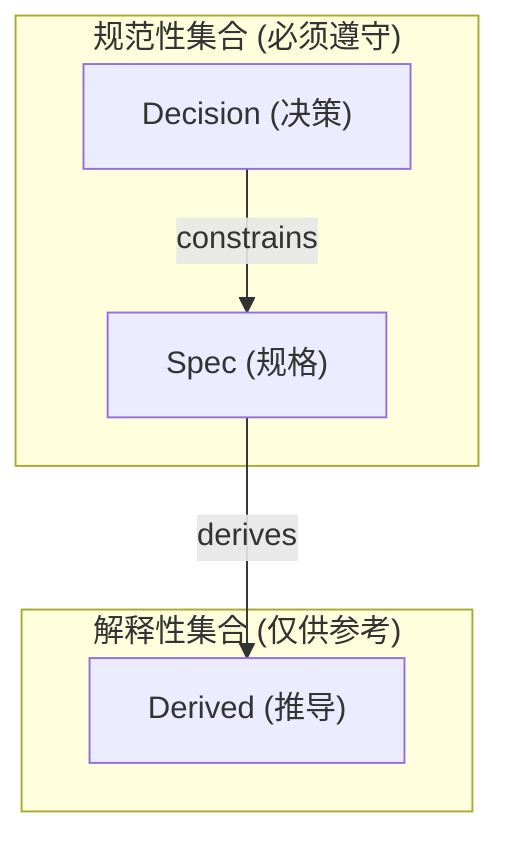

# 软件设计建模核心概念 (Core Concepts of Software Design Modeling)

> 本文档定义 Atelia 项目软件设计建模的核心本体论（Ontology）。
> 这些概念是理解与编写符合 `AI-Design-DSL` 规范的设计文档的基础。

## 1. 概念模型概览

为了支持 AI 与人类在复杂软件设计中的高效协作，我们建立了一套 **D-S-D (Decision-Spec-Derived)** 分层模型，并辅以 **Normative** 集合与 **SSOT** 原则。

### 核心术语定义

| 术语 | 全称 | 中文 | 定义 | AI 权限 |
|:---|:---|:---|:---|:---|
| **Decision** | Decision Layer | 决策层 | 定义**目标与约束**（Why & Constraints）。如技术选型、公理、不动点。 | 🚫 **只读** (除非被明确要求重审) |
| **Spec** | Specification Layer | 规格层 | 定义**具体实现规格**（What & How）。如接口签名、数据布局、状态机。 | ✅ **主要产出** (基于 Decision 生成) |
| **Derived** | Derived Layer | 推导层 | 定义**辅助理解信息**（Context & Examples）。如 FAQ、图示、用例。 | ♻️ **不仅可改，可销毁重建** |
| **Normative**| Normative Clauses | 规范性集合| `Decision` + `Spec` 的合集。这些是必须遵守的约束。 | - |
| **SSOT** | Single Source of Truth| 唯一真实源| 一种**属性**。同一事实只能有一个 canonical definition（No Double Write）。 | - |
| **Canonical Source** | Canonical Source | 权威源 | Canonical definition 所在的**权威载体**（文件/章节/条款）。 | - |

---

## 0. 30 秒速览 (Quick Start)

**给第一次阅读的你**：

这份文档定义了 AI 和人类协作编写设计文档的**规则**。核心思想是把设计信息分成三层：

1. **Decision（决策）** = "我们决定做什么、为什么" → **AI 只能读，不能改**
2. **Spec（规格）** = "具体怎么做、精确定义" → **AI 的主要工作区域**
3. **Derived（推导）** = "帮助理解的例子和解释" → **AI 可以随时更新甚至删除**

**两个关键概念**：
- **Normative（规范性）** = Decision + Spec，这些是"必须遵守"的内容
- **SSOT（唯一真实源）** = 同一个事实只能在一个地方定义，避免重复和冲突

**为什么需要这套规则？** 让 AI 知道"什么能改、什么不能改"，避免意外修改重要决策。

**想深入了解？** 继续阅读下面的详细定义 ↓

---

## 2. 三层模型 (The D-S-D Model)

这三个层级构成了信息的**因果链**。

### 2.1 Decision (决策)
- **本质**：设计的**输入**。
- **作用**：消除方向性的不确定性。一旦设定，即视为设计过程的“公理”。
- **示例**：
  - “系统必须使用 Little-Endian 字节序”
  - “文件格式必须兼容 Markdown”
- **DSL 对应**：`@Decision-Clause` (`modifier: decision`)

### 2.2 Spec (规格)
- **本质**：设计的**输出**（即代码实现的输入）。
- **作用**：消除实现细节的不确定性。它是代码的直接蓝本。
- **特征**：必须是 **SSOT**（见下文）。
- **示例**：
  - “Header 结构体由 4 字节 Magic 和 4 字节 Version 组成”
  - “API `Open()` 在文件不存在时返回 `NotFound` 错误”
- **DSL 对应**：`@Spec-Clause` (`modifier: spec`)

### 2.3 Derived (推导)
- **本质**：设计的**投影**或**缓存**。
- **作用**：降低人类认知负荷，提供直觉理解。
- **特征**：**可重建性**（Reconstructability）。如果删除了 Derived 层，应该能完全从 Normative 层重新生成出来。
- **依赖声明**：Derived 内容 SHOULD 标注其推导所用的输入范围：
  - 仅基于 Normative（Decision + Spec）
  - 或 Normative + 已声明的上下文源（如性能基准、术语表、会议决策）
- **假设标注**：若 Derived 引入假设（assumption），必须显式标注，且不得反向用作 Spec 依据
- **示例**：
  - 根据 API 定义自动生成的 FAQ
  - 根据状态机规格生成的 Mermaid 图表
  - 解释某个复杂设计的算例
- **DSL 对应**：`@Derived-Clause` (`modifier: derived`)

---

## 3. 集合与属性

### 3.1 Normative (规范性集合)
- **公式**：`Normative = Decision ∪ Spec`
- **含义**：在处理冲突或编写实现代码时，只有属于 **Normative** 集合的信息才具有约束力。
- **作用域**：
  - `Normative(doc)`：单文档内的 Decision/Spec 条款
  - `Normative(project)`：设计项目（或 Workspace）内所有 Decision/Spec 条款
  - **默认规则**：冲突仲裁使用 `project` 作用域；局部引用使用 `doc` 作用域
- **冲突仲裁**：当 `Derived` 内容与 `Normative` 内容冲突时，**以 `Normative` 为准**。

#### 3.1.1 冲突仲裁矩阵

当发现设计文档中存在冲突信息时，按以下规则处理：

| 冲突类型 | 仲裁规则 | 修复动作 | 例外情况 |
|:--------|:--------|:--------|:---------|
| **Derived ⟂ Normative** | Normative 胜出 | 修改 Derived 以符合 Normative | 无 |
| **Spec ⟂ Decision** | Decision 胜出 | 修改 Spec 以满足 Decision | 若 Spec 无法满足 Decision 且代价不可接受，触发"决策重审" |
| **Spec ⟂ Spec** (不同文档) | Canonical Source 胜出 | 将非 Canonical Source 的定义改为引用 | 若无法确定哪个是 Canonical Source，升级为人工裁决 |
| **Decision ⟂ Decision** | 人工裁决 | 记录到 `meeting/` 或 `decision-log/` | 无例外——Decision 层冲突必须由人类解决 |

**决策重审触发条件**：
- Spec 实现发现 Decision 不可行（技术限制、性能瓶颈、外部依赖）
- Decision 与 Decision 冲突
- 必须记录到 `agent-team/meeting/<date>-<topic>.md`，说明：
  - 触发原因（为什么需要重审）
  - 受影响的 Decision 条款
  - 建议的新决策

**实践指南**（基于 [decision-graph-v0.1.md](decision-graph-v0.1.md) 研究）：
- 对于复杂决策，可使用 Decision Graph 显式建模候选方案
- 区分 Hard SSOT（已发布 API、已落盘格式）与 Soft SSOT（当前最佳假设，允许回溯）
- 回溯必须记录证据（PoC 失败、测试不通过、审阅发现问题）

### 3.2 SSOT (唯一真实源)
- **误区**：SSOT 不是一个文件，也不是一个层级（虽然我们曾将 Spec 层称为 SSOT 层）。
- **正解**：SSOT 是 **Spec 层内容必须具备的一种属性**。
- **原则**：
  - **No Double Write**：同一事实（如一个字段的长度）只能在一个地方定义。
  - **Canonical Definition**：所有引用的指向，最终都应落在一个权威定义上。

### 3.3 Canonical Source (权威源)
- **定义**：某一类事实的 canonical definition 所在的**权威载体**（文件/章节/条款）。
- **与 SSOT 的关系**：
  - **SSOT** 是属性（描述"是什么"）：同一事实必须满足 No Double Write
  - **Canonical Source** 是载体（描述"在哪"）：该事实的权威定义所在的具体位置
- **示例**：
  - "字段 `HeadLen` 的 Canonical Source 在 `rbf-format.md` 的 `[F-HEADLEN-DEFINITION]` 条款"
  - "Spec 层条款通常作为其所定义事实的 Canonical Source"
- **工具应用**：重复定义检测器需要找到每个事实的 Canonical Source，并验证其他位置是否为引用而非重复定义。

### 3.4 Anchor (Markdown 锚点)
- **定义**：Markdown 技术机制，用于链接定位（如 `#heading-id` 或 `[F-NAME]`）。
- **与 Canonical Source 的关系**：Canonical Source 通过 Anchor 被引用。
- **示例**：
  - "`[F-HEADLEN-01]` 是一个 Anchor，用于链接到该条款"
  - "可以通过 Anchor `#section-3-2` 访问 Canonical Source"
- **注意**：Anchor 是技术实现细节，Canonical Source 是语义层的权威性概念。

---

## 4. 协作指南

### 对人类 (Humans)
- 撰写 **Decision** 时，请多思考“为什么”，少写具体“怎么做”。
- 撰写 **Spec** 时，请追求数学般的精确性，优先使用表格、列表等结构化形式。
- 撰写 **Derived** 时，请把它当作“给你的同事（或未来的自己）写的备忘录”。

### 对 AI (Agents)
- **严守边界**：除非用户明确指示“修改决策”，否则不要动 `@Decision-Clause`。
- **大胆推导**：你可以随时根据 `Spec` 更新 `Derived` 内容，使文档保持最新。
- **维护 SSOT**：在修改 `Spec` 时，确保不要引入双重定义。如果需要增加辅助解释，请放入 `Derived` 层。
#### 4.2.1 AI 权限可执行规则

**Decision 层修改触发条件**（只有满足以下之一时才能编辑 Decision）：
- 用户明确说出："修改 Decision" / "重审决策" / "revisit decision" / "推翻这个决策"
- 用户在会议记录中明确记录"Decision X 需要重审"

**Spec 层修改默认行为**：
- 允许：基于 Decision 约束进行修改、优化、细化
- 禁止：与 Decision 冲突的修改（若必须，触发决策重审流程）
- 验证：修改前检查是否会引入双写（违反 SSOT）

**Derived 层修改默认行为**：
- 允许：随时更新、重建、删除
- 护栏：大段删除（>100 行或>1 个完整章节）时，必须在输出中列出删改摘要
- 推荐：优先采用 append/replace 小步更新，而非大规模重写

**冲突发现时的行为**：
1. 自动判定：按照 §3.1.1 冲突仲裁矩阵确定优先级
2. 若可自动修复：执行修复并在输出中说明（"发现冲突 X，已按规则修改 Y"）
3. 若需人工裁决：停止修改，向用户报告冲突并请求指示

---