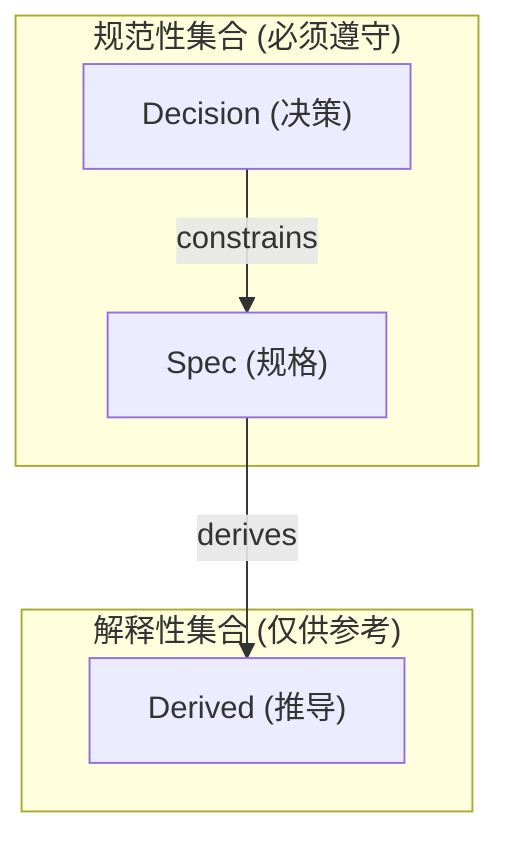

# 软件设计建模核心概念 (Core Concepts of Software Design Modeling)

> 本文档定义 Atelia 项目软件设计建模的核心本体论（Ontology）。
> 这些概念是理解与编写符合 `AI-Design-DSL` 规范的设计文档的基础。

## 1. 概念模型概览

为了支持 AI 与人类在复杂软件设计中的高效协作，我们建立了一套 **D-S-D (Decision-Spec-Derived)** 分层模型，并辅以 **Normative** 集合与 **SSOT** 原则。

### 核心术语定义

| 术语 | 全称 | 中文 | 定义 | AI 权限 |
|:---|:---|:---|:---|:---|
| **Decision** | Decision Layer | 决策层 | 定义**目标与约束**（Why & Constraints）。如技术选型、公理、不动点。 | 🚫 **只读** (除非被明确要求重审) |
| **Spec** | Specification Layer | 规格层 | 定义**具体实现规格**（What & How）。如接口签名、数据布局、状态机。 | ✅ **主要产出** (基于 Decision 生成) |
| **Derived** | Derived Layer | 推导层 | 定义**辅助理解信息**（Context & Examples）。如 FAQ、图示、用例。 | ♻️ **不仅可改，可销毁重建** |
| **Normative**| Normative Clauses | 规范性集合| `Decision` + `Spec` 的合集。这些是必须遵守的约束。 | - |
| **SSOT** | Single Source of Truth| 唯一真实源| 一种**属性**。指 Normative 内容必须具有的排他性、无二义性特征。 | - |

---

## 2. 三层模型 (The D-S-D Model)

这三个层级构成了信息的**因果链**。

### 2.1 Decision (决策)
- **本质**：设计的**输入**。
- **作用**：消除方向性的不确定性。一旦设定，即视为设计过程的“公理”。
- **示例**：
  - “系统必须使用 Little-Endian 字节序”
  - “文件格式必须兼容 Markdown”
- **DSL 对应**：`@Decision-Clause` (`modifier: decision`)

### 2.2 Spec (规格)
- **本质**：设计的**输出**（即代码实现的输入）。
- **作用**：消除实现细节的不确定性。它是代码的直接蓝本。
- **特征**：必须是 **SSOT**（见下文）。
- **示例**：
  - “Header 结构体由 4 字节 Magic 和 4 字节 Version 组成”
  - “API `Open()` 在文件不存在时返回 `NotFound` 错误”
- **DSL 对应**：`@Spec-Clause` (`modifier: spec`)

### 2.3 Derived (推导)
- **本质**：设计的**投影**或**缓存**。
- **作用**：降低人类认知负荷，提供直觉理解。
- **特征**：**可重建性**（Reconstructability）。如果删除了 Derived 层，应该能完全从 Normative 层重新生成出来。
- **示例**：
  - 根据 API 定义自动生成的 FAQ
  - 根据状态机规格生成的 Mermaid 图表
  - 解释某个复杂设计的算例
- **DSL 对应**：`@Derived-Clause` (`modifier: derived`)

---

## 3. 集合与属性

### 3.1 Normative (规范性集合)
- **公式**：`Normative = Decision ∪ Spec`
- **含义**：在处理冲突或编写实现代码时，只有属于 **Normative** 集合的信息才具有约束力。
- **冲突仲裁**：当 `Derived` 内容与 `Normative` 内容冲突时，**以 `Normative` 为准**。

### 3.2 SSOT (唯一真实源)
- **误区**：SSOT 不是一个文件，也不是一个层级（虽然我们曾将 Spec 层称为 SSOT 层）。
- **正解**：SSOT 是 **Spec 层内容必须具备的一种属性**。
- **原则**：
  - **No Double Write**：同一事实（如一个字段的长度）只能在一个地方定义。
  - **Canonical Definition**：所有引用的指向，最终都应落在一个权威定义上。

---

## 4. 协作指南

### 对人类 (Humans)
- 撰写 **Decision** 时，请多思考“为什么”，少写具体“怎么做”。
- 撰写 **Spec** 时，请追求数学般的精确性，优先使用表格、列表等结构化形式。
- 撰写 **Derived** 时，请把它当作“给你的同事（或未来的自己）写的备忘录”。

### 对 AI (Agents)
- **严守边界**：除非用户明确指示“修改决策”，否则不要动 `@Decision-Clause`。
- **大胆推导**：你可以随时根据 `Spec` 更新 `Derived` 内容，使文档保持最新。
- **维护 SSOT**：在修改 `Spec` 时，确保不要引入双重定义。如果需要增加辅助解释，请放入 `Derived` 层。
