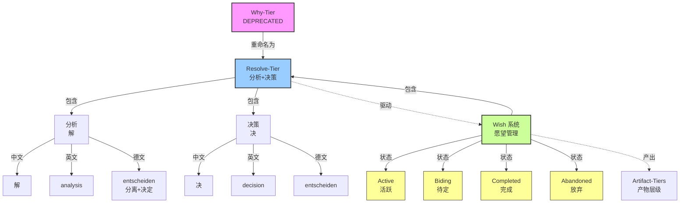

# Artifact-Tiers（重定向页面）

> **文档性质**: 重定向页面 (Redirect Stub)
> **版本**: 2.0.0
> **创建日期**: 2025-12-30
> **最后更新**: 2026-01-02
> **说明**: 基于理论升级，本文件已重构为文档群。

---

## 🚨 重要通知

**Artifact-Tiers 框架已完成重大理论升级！**

基于 [2026-01-02 畅谈会](../meeting/2026-01-02-artifact-tiers-wish-integration-jam.md)，框架从单体文档重构为**文档群**，并引入了以下理论升级：

### 🎯 核心理论升级
1. **认知转化链**：五层级是动态认知流动，不是静态结构
2. **旅途隐喻**：可重入、可折返的旅程，不是线性流程  
3. **二维模型**：Tier（认知深度）× Wish（时间状态）交叉定位
4. **跨层不变量**：意图保真、可追溯、正交性维护

---

## 📁 新的文档结构

```
artifact-tiers/
├── README.md                    # 🚀 快速入口（30秒了解价值）
├── core-definitions.md          # 📚 核心定义 SSOT（v2.0.0）
├── theory-framework.md          # 🧠 完整理论（建设中）
├── user-guides/                 # 👥 角色定制化指南
│   ├── for-developers.md        # 👨‍💻 开发者视角
│   ├── for-designers.md         # 🎨 设计师视角
│   └── for-product-managers.md  # 📊 产品经理视角
├── tools/                       # 🛠️ 实用思维工具
│   ├── tier-canvas.md           # 层级画布
│   ├── tier-dialogue-cards.md   # 对话卡片
│   └── tier-thermometer.md      # 温度计
└── integrations/                # 🔗 相关概念集成
    ├── wish-lifecycle-axis.md   # Wish生命周期轴
    └── related-concepts.md      # 概念边界
```

---

## 🔗 立即访问

### 快速开始
- 🚀 **[30秒了解价值](artifact-tiers/README.md)** - 电梯演讲和快速入口
- 📚 **[核心定义](artifact-tiers/core-definitions.md)** - 权威概念定义（v2.0.0）

### 按角色使用
- 👨‍💻 **[开发者指南](artifact-tiers/user-guides/for-developers.md)** - n-Layer 架构对照
- 🎨 **[设计师指南](artifact-tiers/user-guides/for-designers.md)** - Double Diamond 映射
- 📊 **[产品经理指南](artifact-tiers/user-guides/for-product-managers.md)** - PRD 结构对应

### 实用工具
- 🛠️ **[思维工具](artifact-tiers/tools/)** - 立即可用的模板和工具
- 🔗 **[集成指南](artifact-tiers/integrations/)** - 相关概念边界

---

## 📋 原内容迁移状态

| 原内容 | 新位置 | 状态 | 备注 |
|:-------|:-------|:-----|:-----|
| 五层级方法论术语 | [core-definitions.md#五层级定义](artifact-tiers/core-definitions.md#五层级定义) | ✅ 已迁移 | 包含认知模态转化 |
| Artifact-Tiers 框架 | [core-definitions.md#完整理论](artifact-tiers/core-definitions.md#完整理论) | ✅ 已迁移 | 升级为认知转化链 |
| 使用示例 | [user-guides/](artifact-tiers/user-guides/) | ⏳ 建设中 | 按角色拆分 |
| 命名规范 | [spec-conventions.md](../../atelia/docs/spec-conventions.md) | ✅ 已迁移 | 保持 SSOT 结构 |
| Why vs Wish vs Resolve | [core-definitions.md#与-wish-系统的关系](artifact-tiers/core-definitions.md#与-wish-系统的关系) | ✅ 已整合 | 二维模型 |
| 版本历史 | [core-definitions.md#版本历史](artifact-tiers/core-definitions.md#版本历史) | ✅ 已迁移 | 包含理论升级记录 |

---

## ⏳ 归档计划

**时间线**：
- **2026-01-02**：创建重定向页面，开始迁移引用
- **2026-01-16**：完成所有内部引用更新
- **2026-02-01**：本文件完全归档，只保留重定向

**当前状态**：✅ 文档群已创建，⏳ 引用更新进行中

---

## ❓ 常见问题

### Q: 为什么需要重构？
A: 原单体文档已超过 400 行，难以维护和阅读。理论升级需要更灵活的结构。

### Q: 如何找到特定的历史内容？
A: 使用搜索功能，或直接访问 [core-definitions.md](artifact-tiers/core-definitions.md)，其中包含了所有核心内容。

### Q: 新用户应该从哪里开始？
A: 从 [README.md](artifact-tiers/README.md) 开始，30秒了解框架价值。

### Q: 如何贡献？
A: 参与 [畅谈会](../meeting/) 讨论理论，或直接编辑文档群中的文件。

---

## 📞 支持与反馈

| 问题类型 | 联系专家 | 渠道 |
|:---------|:---------|:-----|
| 概念深度问题 | Seeker | 畅谈会 |
| 用户体验问题 | Curator | 设计评审 |
| 规范一致性问题 | Craftsman | 代码评审 |
| 文档管理问题 | DocOps | 文档评审 |
| 整体协调问题 | TeamLeader | 团队会议 |

---

**维护团队**：Seeker, Curator, Craftsman, DocOps, TeamLeader  
**理论升级日期**：2026-01-02  
**文档群版本**：v2.0.0  
**状态**：✅ 重构完成，⏳ 引用更新中

---

## 三层 SSOT 结构导航

本文件是 **Layer 1：概念语义 SSOT**，只包含术语的语义定义（"是什么"）。

| 层 | 文件 | 职责 | 当你需要... |
|:---|:-----|:-----|:-----------|
| **Layer 1** | 本文件 (`artifact-tiers.md`) | 概念语义定义 | 理解术语的含义、背景、演变历史 |
| **Layer 2** | `atelia/docs/spec-conventions.md` §4 | 写法格式规范 | 确认术语的写法、大小写、文件名格式 |
| **Layer 3** | `terminology-registry.yaml` | 机器可读约束 | 工具配置、lint 规则、IDE 补全 |

**重要提示**：
- 写法规范（如 Title-Kebab 格式、缩写大小写）请查阅 Layer 2
- 机器可读规则（如白名单、变体映射）请查阅 Layer 3
- 本文件只提供语义定义和概念解释


### 术语解释

#### Resolve-Tier（价值层）
- **本质**：价值判断与动机澄清
- **产出**：问题陈述、动机文档、价值主张
- **正确性判据**：共鸣度、紧迫性、战略对齐
- **典型文档**：畅谈会记录、动机陈述

#### Shape-Tier（契约层）
- **本质**：系统边界与用户承诺
- **产出**：API 外观、界面设计、契约规范
- **正确性判据**：直觉性、覆盖关键场景、无歧义
- **典型文档**：API 设计文档、界面规范

#### Rule-Tier（约束层）
- **本质**：形式化约束与合规性
- **产出**：条款文档、规范、检查清单
- **正确性判据**：无矛盾、可判定、可自动化检查
- **典型文档**：规范条款、验收标准

#### Plan-Tier（策略层）
- **本质**：技术路线与实施方案
- **产出**：技术选型、架构设计、实施计划
- **正确性判据**：性能指标、成本效益、风险分析
- **典型文档**：技术方案、架构设计文档

#### Craft-Tier（物化层）
- **本质**：具体实现与验证
- **产出**：代码、测试、部署配置
- **正确性判据**：测试通过、构建成功、部署运行
- **典型文档**：代码库、测试报告、部署指南

---

## Artifact-Tiers（产物层级）

> **决策记录**：[2026-01-01 畅谈会](../../meeting/2026-01-01-l1-l5-concept-naming-jam.md)

**Artifact-Tiers**（产物层级）是统摄 Resolve/Shape/Rule/Plan/Craft 五个产物层级的认知框架。

### 核心特征

| 特征 | 解释 | 意义 |
|:-----|:-----|:-----|
| **正交性** | 每层关注独立的决策维度 | 避免决策纠缠 |
| **依赖性** | 高层约束低层，低层不得静默修改高层 | 保持意图一致性 |
| **可迭代性** | 支持层内迭代和跨层回溯 | 适应现实工作模式 |
| **产物导向** | 每层产出具体产物（文档/代码） | 确保每层都有可验证产出 |

### 框架术语规范

| 概念 | 规范写法 | 说明 |
|:-----|:---------|:-----|
| **框架名** | `Artifact-Tiers` | 首次引用时使用 |
| **单层称谓** | `Resolve-Tier`, `Shape-Tier`, `Rule-Tier`, `Plan-Tier`, `Craft-Tier` | 保持现有命名 |
| **代码标识** | `ArtifactTier.Resolve`, `ArtifactTier.Shape`, `ArtifactTier.Rule`, `ArtifactTier.Plan`, `ArtifactTier.Craft` | enum 值使用语义名 |
| **中文对照** | `产物层级` | 直译，自明性强 |

### 使用示例

**文档中的使用**：
```markdown
## 层级进度

| Artifact Tier | 状态 | 产物链接 |
|:--------------|:-----|:---------|
| Resolve-Tier | 🟢 完成 | [动机文档](...) |
| Shape-Tier | 🟡 进行中 | [API 设计](...) |
| Rule-Tier | ⚪ 未开始 | — |
| Plan-Tier | ⚪ 未开始 | — |
| Craft-Tier | ⚪ 未开始 | — |
```

**代码中的使用**：
```csharp
// 枚举定义
public enum ArtifactTier
{
    Resolve,    // Resolve-Tier
    Shape,  // Shape-Tier
    Rule,   // Rule-Tier
    Plan,   // Plan-Tier
    Craft   // Craft-Tier
}

// 使用示例
public class Document
{
    public ArtifactTier Tier { get; set; }
    public string Content { get; set; }
}
```

**讨论中的使用**：
- "这个问题属于哪个 Artifact Tier？"
- "在 Tiers 框架下，我们先定义 Resolve-Tier..."
- "这个决策在 Shape-Tier 已经确定，Craft-Tier 不能随意更改"

### 与旧术语的关系

**替代关系**：
- `Artifact-Tiers` 替代旧的数字式 `L1-L5` 称谓
- 保持 `Resolve/Shape/Rule/Plan/Craft` 作为单层语义名

**过渡期约定**（2026-01-01 至 2026-01-31）：
1. **新文档**：必须使用 `Artifact-Tiers` / `Tiers`
2. **旧文档**：可保留 "L1-L5"，建议添加注释 `<!-- L1-L5 即 Artifact-Tiers 中的 Resolve/Shape/Rule/Plan/Craft -->`
3. **口头讨论**：两种说法均可，逐步过渡

### 注意
- 不要与 "n-Layer architecture" 混淆——后者指系统架构分层
- 框架名必须带限定词 `Artifact`，避免单独使用 `Tiers` 造成歧义

---

## 渊源

[畅谈会决策](../../meeting/2025-12-30-docgraph-terminology-jam.md) |

---

## 使用规范

### 1. 文档中的使用

**推荐写法**：
```markdown
## 层级进度

| Artifact Tier | 状态 | 产物链接 |
|:--------------|:-----|:---------|
| Resolve-Tier | 🟢 完成 | [动机文档](...) |
| Shape-Tier | 🟡 进行中 | [API 设计](...) |
| Rule-Tier | ⚪ 未开始 | — |
| Plan-Tier | ⚪ 未开始 | — |
| Craft-Tier | ⚪ 未开始 | — |
```

**允许的变体**：
- 表格标题可使用 `Artifact Tier` 或简写 `Tier`
- 正文中可写"在 Shape 层，我们定义..." 或 "在 Artifact-Tiers 框架下..."
- 引用时使用 `[术语表](../../wiki/artifact-tiers.md)`

### 2. 代码中的使用

**枚举定义**（推荐使用 ArtifactTier）：
```csharp
// 推荐：使用 ArtifactTier（2026-01-01 新增）
public enum ArtifactTier
{
    Resolve,    // Resolve-Tier
    Shape,  // Shape-Tier
    Rule,   // Rule-Tier（注意：单数）
    Plan,   // Plan-Tier
    Craft   // Craft-Tier
}

// 可添加Description属性显示完整格式
[Description("Resolve-Tier")]
Resolve,
[Description("Shape-Tier")]
Shape,
[Description("Rule-Tier")]
Rule,
[Description("Plan-Tier")]
Plan,
[Description("Craft-Tier")]
Craft
```

**类/接口命名**：
```csharp
// 推荐
public class ShapeDocument { }
public interface IRulesValidator { }
public class PlanStrategy { }
public class CraftBuilder { }
public class ArtifactTierAttribute { }  // 框架相关

// 避免
public class WhatDocument { }      // 使用 Shape
public class HowImplementation { } // 使用 Plan
public class BuildExecutor { }     // 使用 Craft
```

**代码注释标签**：
```csharp
// [TIER-PLAN] 技术选型说明（推荐）
// [TIER-RULE] 约束检查
// [TIER-SHAPE] API 边界定义
```

### 3. 畅谈会与讨论中的使用

**清晰表达**：
- "这个决策属于 Plan-Tier"
- "我们需要先澄清 Resolve-Tier 的动机"
- "Rule-Tier 的条款需要形式化"
- "在 Artifact-Tiers 框架下，这个问题属于哪个 Tier？"

**避免混淆**：
- 使用完整形式：`Plan-Tier` 而非单独的 `Plan`
- 框架名使用 `Artifact-Tiers` 或简写 `Tiers`
- 上下文明确时可用简写
- 新成员应优先阅读本术语表

---

## 维护机制

### 1. SSOT 原则

- 术语定义**只**在本文件中维护
- 其他文档应引用本文件，而非复述定义
- 任何术语变更必须更新本文件并记录版本

### 2. 变更流程

1. **提案**：在畅谈会中提出术语变更
2. **评估**：多维度评估（本质、UX/DX、规范、代码、文档）
3. **决策**：记录决策理由和影响范围
4. **更新**：更新本文件并记录版本历史
5. **迁移**：按过渡方案更新相关文档

### 3. 一致性检查

**人工检查点**：
- 新文档创建时
- 畅谈会结束时
- 规范更新时

**未来自动化**：
- 通过 W-0002 DocGraph 工具自动检查术语引用
- 建立术语引用索引

---

## 引用本文件

在其他文档中引用本术语表：

```markdown
> **术语参考**：本文档使用 [Artifact-Tiers](../../wiki/artifact-tiers.md#artifact-tiers产物层级) 框架组织产物层级，具体层级定义见 [Artifact-Tiers](../../wiki/artifact-tiers.md)。

或使用具体引用：

- Artifact-Tiers 框架定义：参见术语表"产物层级"部分
- Resolve-Tier 层定义：参见术语表"价值层"部分
- 术语演变历史：v0.1 → v1.0 → v1.4.0（新增 Artifact-Tiers）
```

---

## 贡献与反馈

如有术语相关问题或改进建议：

1. **小问题**：直接更新本文件并记录变更
2. **重大变更**：发起畅谈会讨论
3. **疑问澄清**：在团队频道中讨论

**维护者**：DocOps（术语表维护）
**核查者**：Craftsman（规范一致性）
**最后审核**：2025-12-30 畅谈会全体成员

---

## 附录：30秒速查卡片

```
┌─────────────────────────────────────────────────────┐
│  📚 五层级术语快速指南（2026-01-01更新）               │
├─────────────────────────────────────────────────────┤
│                                                     │
│  🏗️ 框架名称：Artifact-Tiers（产物层级）              │
│     • 替代旧的 L1-L5 数字称谓                        │
│     • 统摄五个产物层级                               │
│                                                     │
│  统一使用语义术语格式：                               │
│                                                     │
│  🗣️ 完整格式：Resolve-Tier → Shape-Tier → Rule-Tier →  │
│              Plan-Tier → Craft-Tier                │
│  📊 表格中：Resolve-Tier, Shape-Tier, Rule-Tier...    │
│  💻 代码枚举：ArtifactTier.Resolve, ArtifactTier.Shape... │
│                                                     │
│  📍 语义解释：                                        │
│     Resolve-Tier = 价值层（为什么做）                    │
│     Shape-Tier = 契约层（长什么样）                  │
│     Rule-Tier = 约束层（什么约束）                   │
│     Plan-Tier = 策略层（怎么做）                     │
│     Craft-Tier = 物化层（代码实现）                  │
│                                                     │
│  💡 记忆口诀：Resolve-Shape-Rule-Plan-Craft               │
│              （为什么-样子-规则-计划-手艺）            │
│                                                     │
│  ⚠️ 重要提醒：                                        │
│     • 使用连字符格式，便于搜索                        │
│     • Rule使用单数，避免混淆                          │
│     • 仅限Wish产物语境                               │
│     • 框架名：Artifact-Tiers（必须带限定词）          │
│                                                     │
└─────────────────────────────────────────────────────┘
```

### 文件命名示例

```
推荐格式：语义名 + 主题
────────────────────────────
resolve-overview.md
shape-api.md  
rule-constraints.md
plan-roadmap.md
craft-implementation.md
```

---

## 命名规范

> **已迁移**：本节内容已迁移至 `atelia/docs/spec-conventions.md` §4（写法规范 SSOT）。
> 
> 请查阅：
> - 分域命名体系：§4.1
> - 多单词术语格式：§4.2
> - 缩写大小写规则：§4.3
> - 术语注册表管理：§4.4
> - 迁移与兼容性：§4.5

**决策记录**：[2025-12-31 畅谈会](../meeting/2025-12-31-terminology-naming-convention.md)

---

## Why vs Wish vs Resolve 关系图

> **决策记录**：[2026-01-02 畅谈会](../meeting/2026-01-02-resolve-tier-concept-jam.md)



### 关系解释

1. **Why-Tier → Resolve-Tier**：
   - Why-Tier 已弃用，重命名为 Resolve-Tier
   - Resolve = 分析（解）+ 决策（决），跨语言验证

2. **Resolve-Tier 与 Wish 系统**：
   - Resolve-Tier 驱动 Wish 系统的创建
   - Wish 系统管理愿望的完整生命周期
   - Wish 系统新增 Biding（待定）状态，用于战略等待

3. **状态机扩展**：
   - Active → Biding（资源不足、外部依赖）
   - Biding → Active（阻塞解除、带宽恢复）
   - Biding → Abandoned（复审后明确放下）

4. **术语一致性**：
   - Resolve-Tier 是 Artifact-Tiers 的第一层
   - Wish 系统是愿望管理的实现机制
   - 两者协同工作，确保价值判断到具体执行的连贯性

---

## 版本历史

| 版本 | 日期 | 变更说明 |
|:-----|:-----|:---------|
| v1.5.0 | 2026-01-02 | 新增 Why vs Wish vs Resolve 关系图，记录 Resolve-Tier 迁移决策 |
| v1.4.0 | 2026-01-01 | 新增 Artifact-Tiers（产物层级）框架定义，替代 L1-L5 数字称谓 |
| v1.3.0 | 2025-12-31 | 清理写法规范，添加 Redirect Stub 指向 `spec-conventions.md` |
| v1.2.0 | 2025-12-31 | 添加三层 SSOT 结构导航提示 |
| v1.1.0 | 2025-12-31 | 新增命名规范章节 |
| v1.0.0 | 2025-12-30 | 初始版本 |

**维护者**：DocOps（术语表维护）
**核查者**：Craftsman（规范一致性）
