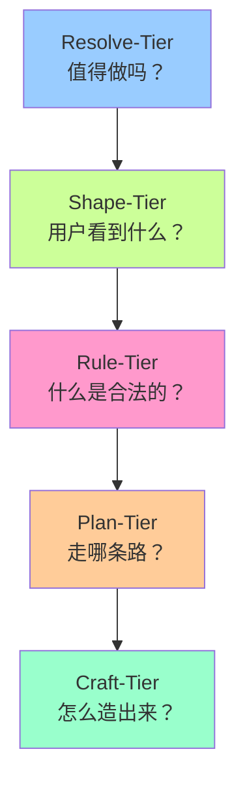

# Artifact-Tiers 框架

> **一句话价值**：系统化地从"为什么做"走到"怎么做出来"，避免在战略未定时争论战术。

---

## 🎯 快速入口

### 根据你的需求选择：

| 你需要... | 推荐阅读 | 预计时间 |
|:----------|:---------|:---------|
| **快速了解价值** | [30 秒版](core-definitions.md#30-秒版) | 30 秒 |
| **掌握核心概念** | [5 分钟版](core-definitions.md#5-分钟版) | 5 分钟 |
| **深度理解理论** | [完整理论](core-definitions.md#完整理论) | 15+ 分钟 |
| **作为开发者应用** | [开发者指南](user-guides/for-developers.md) | 10 分钟 |
| **作为设计师应用** | [设计师指南](user-guides/for-designers.md) | 10 分钟 |
| **作为产品经理应用** | [产品经理指南](user-guides/for-product-managers.md) | 10 分钟 |
| **使用实用工具** | [思维工具](tools/) | 按需 |

---

## 🏗️ 框架概览

Artifact-Tiers 是一个五层认知框架，帮助团队系统化地思考和决策：



### 核心特点

1. **不是线性流程**：可以在任何层级"扎营"深入，也可以"折返"重新审视
2. **认知转化链**：每层都收窄可能性空间，增加确定性
3. **与 Wish 系统协同**：Wish 追踪时间状态，Tier 追踪认知深度
4. **跨层不变量**：确保意图保真、可追溯、关注点正交

---

## 🧭 使用场景

### 当你遇到这些问题时：

| 问题症状 | 可能缺失的 Tier | 解决方案 |
|:---------|:---------------|:---------|
| "频繁变更需求，目标模糊" | Resolve-Tier 不清晰 | 重新澄清价值决心 |
| "验收时发现遗漏场景" | Shape-Tier 边界不完整 | 完善系统边界定义 |
| "实现时发现规则冲突" | Rule-Tier 约束不明确 | 形式化约束和验收标准 |
| "实施中频繁受阻" | Plan-Tier 路径不可行 | 重新评估技术路线 |
| "代码混乱，难以维护" | Craft-Tier 缺乏规范 | 建立实现标准和测试 |

### 典型工作流

1. **畅谈会**：在 Resolve-Tier 澄清价值，创建 Wish
2. **设计工作坊**：在 Shape-Tier 定义边界和契约
3. **规范评审**：在 Rule-Tier 形式化约束和验收标准
4. **技术方案**：在 Plan-Tier 选择路线和评估风险
5. **实现迭代**：在 Craft-Tier 编码、测试、部署

---

## 🛠️ 实用工具

### 立即可用的工具：

| 工具 | 用途 | 链接 |
|:-----|:-----|:-----|
| **层级画布** | 单页可视化，团队对齐认知 | [Tier Canvas](tools/tier-canvas.md) |
| **对话卡片** | 畅谈会聚焦，确保讨论在正确层级 | [Dialogue Cards](tools/tier-dialogue-cards.md) |
| **温度计** | 项目管理成熟度显示 | [Tier Thermometer](tools/tier-thermometer.md) |

### 集成指南：

| 集成 | 说明 | 链接 |
|:-----|:-----|:-----|
| **Wish 系统** | 如何与 Wish 生命周期协同 | [Wish 集成](integrations/wish-lifecycle-axis.md) |
| **相关概念** | Issue、Task、Artifact 的边界 | [概念边界](integrations/related-concepts.md) |

---

## 📚 文档结构

```
artifact-tiers/
├── README.md                    # 你现在在这里
├── core-definitions.md          # 核心定义（SSOT）
├── theory-framework.md          # 完整理论（建设中）
├── user-guides/                 # 用户指南
│   ├── for-developers.md        # 开发者视角
│   ├── for-designers.md         # 设计师视角
│   ├── for-product-managers.md  # 产品经理视角
├── tools/                       # 思维工具
│   ├── tier-canvas.md           # 层级画布
│   ├── tier-dialogue-cards.md   # 对话卡
│   └── tier-thermometer.md      # 温度计
└── integrations/                # 集成指南
    ├── wish-lifecycle-axis.md   # Wish生命周期轴
    └── related-concepts.md      # 相关概念边界
```

---

## 🚀 开始使用

### 第一步：理解核心概念
阅读 [5 分钟版](core-definitions.md#5-分钟版) 掌握基本框架。

### 第二步：选择你的角色
根据你的角色阅读相应的指南：
- 👨‍💻 [开发者指南](user-guides/for-developers.md)
- 🎨 [设计师指南](user-guides/for-designers.md)
- 📊 [产品经理指南](user-guides/for-product-managers.md)

### 第三步：应用工具
下载并使用 [层级画布](tools/tier-canvas.md) 开始你的第一个项目。

### 第四步：深度探索
阅读 [完整理论](core-definitions.md#完整理论) 理解背后的认知科学原理。

---

## 📖 理论演变

### 最新升级（2026-01-02）
基于 Why-Tier → Resolve-Tier 的升华，框架进行了重大理论升级：

1. **认知转化链**：从静态结构到动态认知流动
2. **旅途隐喻**：可重入、可折返的旅程理解
3. **二维模型**：Tier（认知深度）× Wish（时间状态）
4. **跨层不变量**：意图保真、可追溯、正交性维护

### 决策记录
- [2026-01-02 畅谈会](../../meeting/2026-01-02-artifact-tiers-wish-integration-jam.md)
- [2026-01-02 Resolve-Tier 迁移](../../meeting/2026-01-02-resolve-tier-concept-jam.md)

---

## 🤝 贡献与反馈

### 发现问题？
- **术语不一致**：联系 DocOps
- **规范问题**：联系 Craftsman
- **用户体验**：联系 Curator
- **概念深度**：联系 Seeker

### 想要贡献？
1. 阅读 [贡献指南](../../CONTRIBUTING.md)
2. 参与 [畅谈会](../../meeting/)
3. 提交 Pull Request

---

**维护团队**：Seeker, Curator, Craftsman, DocOps, TeamLeader  
**最新版本**：v2.0.0 (2026-01-02)  
**状态**：✅ 生产就绪