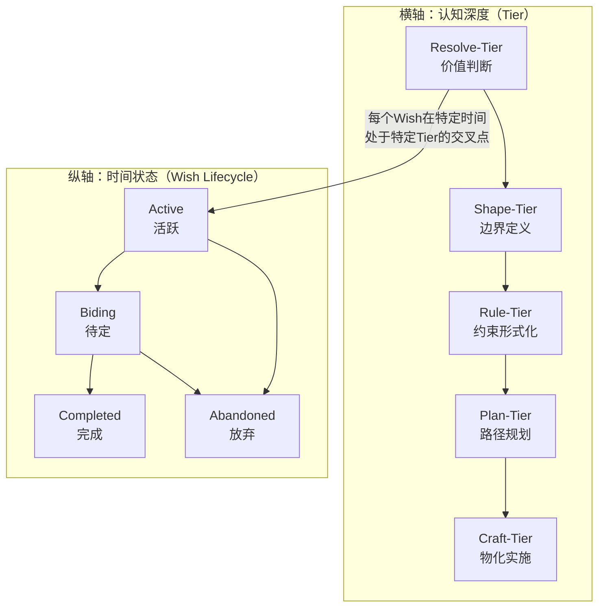

# Artifact-Tiers 核心定义

> **文档性质**: 概念语义 SSOT (Layer 1)
> **版本**: 2.0.0
> **创建日期**: 2026-01-02
> **最后更新**: 2026-01-02
> **说明**: 本文件是 Artifact-Tiers 框架的核心概念定义，其他文档应引用而非复述。

---

## 快速导航

- [30 秒版](#30-秒版) - 电梯演讲
- [5 分钟版](#5-分钟版) - 核心概念
- [完整理论](#完整理论) - 深度理解

---

## 30 秒版

**Artifact-Tiers** 是一个五层认知框架，帮助团队系统化地从"为什么做"走到"怎么做出来"。

| 层级 | 核心问题 | 一句话解释 |
|:-----|:---------|:-----------|
| **Resolve-Tier** | 值得做吗？ | 分析问题价值，做出实施决心 |
| **Shape-Tier** | 用户看到什么？ | 定义系统边界和用户承诺 |
| **Rule-Tier** | 什么是合法的？ | 建立形式化约束和验收标准 |
| **Plan-Tier** | 走哪条路？ | 选择技术路线和实施策略 |
| **Craft-Tier** | 怎么造出来？ | 具体实现、测试和部署 |

**核心价值**：避免在战略未定时争论战术，确保每层决策都有明确产出。

---

## 5 分钟版

### 二维模型：Tier × Wish

Artifact-Tiers 不是孤立的五层结构，而是与 Wish 系统协同工作的二维框架：

### 关键区别

1. **不是另一个分层架构**：Artifact-Tiers 关注**决策类型**，不是代码分层
2. **不是线性流程**：可以在任何层级"扎营"深入，也可以"折返"重新审视
3. **不是官僚阶段**：Tier Gate 是认知成熟度检验，不是审批障碍

### 核心隐喻：认知旅途

把五层级想象成一场**旅途**：
- **Resolve**：决定去哪里（目的地选择）
- **Shape**：规划行程路线（地图绘制）
- **Rule**：准备行李清单（必需品检查）
- **Plan**：选择交通方式（策略选择）
- **Craft**：实际踏上旅途（具体行走）

你可以在任何地方"扎营"深入探索，也可以"折返"重新规划。

---

## 完整理论

### 1. 五层级定义

#### Resolve-Tier（价值层）
- **本质**：价值判断与动机澄清
- **核心问题**：这问题值得解决吗？
- **输入**：开放可能性、问题空间
- **处理**：价值分析、代价评估、战略对齐
- **输出**：带代价的决心、价值主张
- **认知模态**：Judicative（判断性）→ Commissive（承诺性）
- **典型产出**：畅谈会记录、动机文档、Wish 创建

#### Shape-Tier（契约层）
- **本质**：系统边界与用户承诺
- **核心问题**：用户看到什么边界？
- **输入**：Resolve 的决心
- **处理**：边界定义、场景覆盖、无歧义描述
- **输出**：清晰的契约、API 外观、界面规范
- **认知模态**：Commissive（承诺性）→ Descriptive（描述性）
- **典型产出**：API 设计文档、界面规范、契约定义

#### Rule-Tier（约束层）
- **本质**：形式化约束与合规性
- **核心问题**：什么是合法的？
- **输入**：Shape 的边界
- **处理**：约束形式化、矛盾排除、可检验性设计
- **输出**：可检验的规则、验收标准、合规清单
- **认知模态**：Descriptive（描述性）→ Normative（规范性）
- **典型产出**：规范条款、验收标准、检查清单

#### Plan-Tier（策略层）
- **本质**：技术路线与实施方案
- **核心问题**：走哪条路？
- **输入**：Rule 的约束
- **处理**：路径规划、技术选型、风险评估
- **输出**：可执行的策略、架构设计、实施计划
- **认知模态**：Normative（规范性）→ Strategic（策略性）
- **典型产出**：技术方案、架构设计、实施路线图

#### Craft-Tier（物化层）
- **本质**：具体实现与验证
- **核心问题**：怎么造出来？
- **输入**：Plan 的策略
- **处理**：代码实现、测试验证、部署运行
- **输出**：可运行的产物、测试报告、部署配置
- **认知模态**：Strategic（策略性）→ Executable（可执行性）
- **典型产出**：代码库、测试套件、部署指南

### 2. 认知转化链

五层级构成一条**认知转化链**，每层都：
1. **收窄可能性空间**：减少不确定性
2. **增加确定性**：增加可执行性
3. **转化认知模态**：从判断到承诺到描述到规范到策略到执行

这不是瀑布模型，而是**可重入的认知流动**：
- **扎营模式**：在某一层级深入迭代
- **折返模式**：带着新信息重新审视高层
- **并行模式**：多个层级同时推进（有明确依赖管理）

### 3. 跨层不变量

无论在哪一层，都必须维护以下**跨层不变量**：

| 不变量 | 含义 | 违反症状 |
|:-------|:-----|:---------|
| **意图保真度** | 高层意图必须在低层实现中保持 | 实现偏离原始目标 |
| **可追溯性** | 任何 Craft 产物必须能追溯到 Resolve 决心 | 不知道为什么要做这个功能 |
| **正交性维护** | 各层关注点不得静默混合 | 在代码中做架构决策，在规范中讨论实现细节 |

### 4. Tier Gate（层级门槛）

每个层级转换都有**认知成熟度检验点**（不是官僚审批）：

| Gate | 检验问题 | 缺失症状 |
|:-----|:---------|:---------|
| **Resolve → Shape** | 决心是否足够清晰？代价是否明确？ | 频繁变更需求，目标模糊 |
| **Shape → Rule** | 边界是否无歧义？关键场景是否覆盖？ | 验收时发现遗漏场景 |
| **Rule → Plan** | 约束是否可检验？矛盾是否已排除？ | 实现时发现规则冲突 |
| **Plan → Craft** | 路径是否可行？资源是否就绪？ | 实施中频繁受阻 |

### 5. 与 Wish 系统的关系

**Wish 是生命周期轴，不是第六个 Tier**：

1. **二维定位**：每个 Wish 在特定时间处于 `Tier × Lifecycle` 的交叉点
2. **创建时机**：Resolve-Tier 的产出之一是创建或更新 Wish
3. **驱动关系**：Wish 的状态变化触发 Tier 间的移动
4. **追踪机制**：Wish 追踪从 Resolve 到 Craft 的完整价值流

**生命周期状态**：
- **Active**：活跃推进，正在某个 Tier 工作
- **Biding**：战略待机，等待条件成熟
- **Completed**：已完成，所有 Tier 都达到 Craft
- **Abandoned**：已放弃，有明确放弃原因

### 6. 输入输出契约

每层都有明确的**输入契约**和**输出保证**，形成闭合的价值流：

---

## 版本历史

| 版本 | 日期 | 变更说明 |
|:-----|:-----|:---------|
| v2.0.0 | 2026-01-02 | 理论框架升级：认知转化链、二维模型、跨层不变量 |
| v1.5.0 | 2026-01-02 | 新增 Why vs Wish vs Resolve 关系图 |
| v1.4.0 | 2026-01-01 | 新增 Artifact-Tiers（产物层级）框架定义 |
| v1.3.0 | 2025-12-31 | 清理写法规范，添加 Redirect Stub |
| v1.2.0 | 2025-12-31 | 添加三层 SSOT 结构导航提示 |
| v1.1.0 | 2025-12-31 | 新增命名规范章节 |
| v1.0.0 | 2025-12-30 | 初始版本 |

**维护者**：DocOps（术语表维护）
**审计者**：Craftsman（规范一致性）

---

## 相关文档

- [完整理论框架](theory-framework.md) - 深度理论分析
- [用户指南](../user-guides/) - 角色定制化入口
- [思维工具](../tools/) - 实用工具模板
- [集成指南](../integrations/) - 相关概念边界

> **提示**：本文件是核心定义 SSOT。写法规范请查阅 `atelia/docs/spec-conventions.md`，机器可读规则请查阅 `terminology-registry.yaml`。