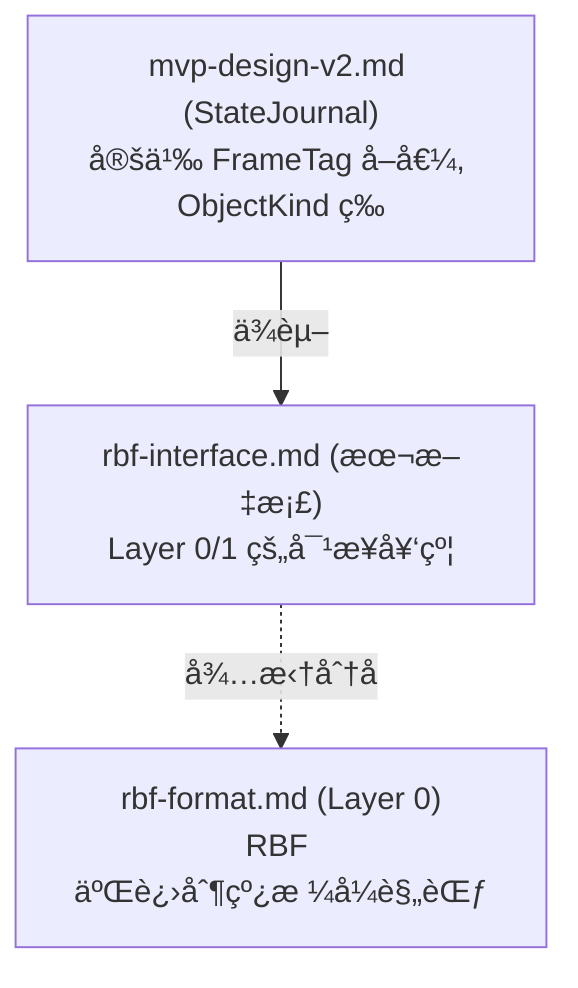

User: 咱们最近ä¸æ˜¯æ›´æ–°äº†â€œatelia/docs/spec-conventions.mdâ€å˜›ï¼Œåœ¨é‡Œé¢åˆ¶å®šäº†â€œ3. ä¿¡æ¯è¡¨ç¤ºä¸å›¾è¡¨ï¼ˆLLM-Friendly Notation）â€ã€‚我们æ¥è¯•ç€ç”¨è¿™ä¸ªæ–°ç†è®ºåˆ†æ一下“atelia/docs/StateJournal/rbf-interface.mdâ€ä¸­çš„**文档关系** ascii 框图，以检验我们的新ç†è®ºå¦‚何？你有哪些想法？

GitHub Copilot: 好的，让我先读å–这两个文件æ¥äº†è§£æ–°ç†è®ºå’Œå¾…分æ的框图。 

Read [](file:///repos/focus/atelia/docs/spec-conventions.md)

Read [](file:///repos/focus/atelia/docs/StateJournal/rbf-interface.md)

太好了，我ç°åœ¨æœ‰äº†å®Œæ•´çš„上下文。让我æ¥åˆ†æ这个文档关系 ASCII 框图：

---

## 🔠分æ：rbf-interface.md 中的"文档关系" ASCII 框图

### 待分æ对象

```
┌─────────────────────────────────────â”
│  mvp-design-v2.md (StateJournal)    │
│  - ä¾èµ–本æ¥å£æ–‡æ¡£                    │
│  - 定义 FrameTag å–值, ObjectKind ç­‰ │
└─────────────────┬───────────────────┘
                  │ ä¾èµ–
┌─────────────────▼───────────────────â”
│  rbf-interface.md (本文档)           │
│  - Layer 0/1 的对æ¥å¥‘约              │
│  - 定义 FrameTag, Address64 等       │
└─────────────────┬───────────────────┘
                  │ 待拆分å
┌─────────────────▼───────────────────â”
│  rbf-format.md (Layer 0)             │
│  - RBF 二进制线格å¼è§„范（wire）       │
│  - 作为 Layer 0 的 SSOT              │
└─────────────────────────────────────┘
```

---

## 📋 用 LLM-Friendly Notation ç†è®ºè¯Šæ–­

### 1. ä¿¡æ¯ç±»å‹åˆ¤å®šï¼ˆç»´åº¦æµ‹è¯•æ³•ï¼‰

**这是什么信æ¯ï¼Ÿ**
- 3 个文档节点
- 2 æ¡ä¾èµ–边（`ä¾èµ–`ã€`待拆分å`）
- æ¯ä¸ªèŠ‚点有å±æ€§è¯´æ˜

**维度**：这是 **ND（è¿æ¥/ä¾èµ–关系）** —— 有节点ã€æœ‰æ–¹å‘性边。

**按 `[S-DOC-FORMAT-MINIMALISM]` åŸåˆ™**：涉åŠä¾èµ–关系 → **应该使用 Mermaid**。

### 2. è¿åçš„æ¡æ¬¾

| æ¡æ¬¾ | è¿å情况 |
|------|----------|
| `[S-DOC-ASCIIART-SHOULDNOT]` | 使用了 box-drawing 字符承载结æ„åŒ–ä¿¡æ¯ |
| `[S-DOC-GRAPHS-AS-MERMAID]` | 存在方å‘性箭头关系，但未使用 Mermaid |

### 3. 改进建议

**方案 A：Mermaid flowchart（æ¨è）**



**方案 B：简化——这真的需è¦å›¾å—？**

仔细看这个关系，其å®æ˜¯ **线性ä¾èµ–链**（3 节点ã€æ— åˆ†æ”¯ã€æ— ç¯ï¼‰ã€‚按 `[S-DOC-SIMPLE-FLOW-INLINE]`：

> "简å•çº¿æ€§æµç¨‹" MAY 使用行内箭头表示，å‰æ是：无分支ã€æ— ç¯ã€æ­¥éª¤æ•°ä¸è¶…过 5

å¯ä»¥è€ƒè™‘简化为：

```
mvp-design-v2.md → rbf-interface.md → rbf-format.md (待拆分)
```

é…åˆä¸€ä¸ªè¡¨æ ¼è¯´æ˜æ¯ä¸ªæ–‡æ¡£çš„èŒè´£ï¼š

| 文档 | 层级 | 定义内容 |
|------|------|----------|
| `mvp-design-v2.md` | StateJournal | FrameTag å–值, ObjectKind 等业务语义 |
| rbf-interface.md | Layer 0/1 边界 | IRbfFramer, IRbfScanner ç­‰æ¥å£å¥‘约 |
| `rbf-format.md` | Layer 0 (待拆分) | RBF 二进制线格å¼è§„范（wire format） |

---

## 💡 我的想法

1. **这个框图å¯ä»¥ä½œä¸º LLM-Friendly Notation çš„"å…¸å‹æ¡ˆä¾‹"**：
   - 它ä¸å¤æ‚（åªæœ‰ 3 个节点的线性链）
   - 但用了最é‡å½¢å¼ï¼ˆbox-drawing）
   - 是"é™çº§åŸåˆ™"çš„åé¢æ•™æ

2. **改进优先级**：
   - **如æœä¿ç•™å›¾**：改为 Mermaidï¼Œå°†åŸ ASCII 标为 Illustration（或直æ¥åˆ é™¤ï¼‰
   - **如æœè¿½æ±‚æ简**：用行内箭头 + 表格（最符åˆ"最å°å¤æ‚度"åŸåˆ™ï¼‰

3. **有趣的边缘情况**：
   - 这个图里有**虚拟节点**（`rbf-format.md` 尚未拆分）
   - 还有**ä¸åŒè¯­ä¹‰çš„è¾¹**（`ä¾èµ–` vs `待拆分å`）
   - 这些在 Mermaid 里å¯ä»¥ç”¨è™šçº¿/å®çº¿åŒºåˆ†ï¼Œè¡¨æ ¼å°±ä¸å¤ªå¥½è¡¨è¾¾

**你觉得这个分æ如何？是å¦è¦åŠ¨æ‰‹æ”¹è¿›è¿™ä¸ªæ¡†å›¾ï¼Œè¿˜æ˜¯æƒ³è¿›ä¸€æ­¥è®¨è®º LLM-Friendly Notation 的边界情况？**

User: å“å‘€ï¼æˆ‘们新ç†è®ºé¦–战就立功了呢ï¼å›¾è¡¨å½¢å¼çš„å˜æ¢ï¼Œè®©æˆ‘们å‘ç°äº†é—®é¢˜ï¼ä½ çœ‹ï¼Œè¿™ä¸ªå›¾ä¾‹è®°å½•çš„是“rbf-interface.mdâ€ä¾èµ–“rbf-format.mdâ€ï¼Œå¯ä½ æƒ³å‘€ï¼Œæ¥å£å¥‘约æ€ä¹ˆèƒ½å»ä¾èµ–å®ç°å‘¢ï¼Ÿè¿™é‡Œçš„记录错了，是上层StateJournal通过使用关系ä¾èµ–æ¥å£å¥‘约， 下层文件格å¼æ–‡æ¡£é€šè¿‡â€œå®ç°â€å…³ç³»ï¼Œä¹Ÿæ˜¯ä¾èµ–æ¥å£å¥‘约文档。而且（待拆分）正确的本æ„应该是修饰“mvp-design-v2.mdâ€çš„，åæ¥æˆ‘们已ç»æ‹†åˆ†å‡ºæ¥äº†æ¥å£å¥‘约文档和下层的文件格å¼æ–‡æ¡£ï¼Œé—æ¼äº†åˆ é™¤â€œå¾…拆分â€æ–‡å­—。关äºä½ æ出的问题...我åªèƒ½ç»™ä½ ä¸Šè¿°å®äº‹æ€§è§‚察。你的分æ挺有é“ç†çš„，我主观觉得方案B更好，但是ï¼æˆ‘ä¸æ˜¯LLM呀，ä¸çŸ¥é“对äºä½ ä»¬é˜…读和编辑æ¥è¯´ï¼Œå“ªä¸ªæ–¹æ¡ˆæ›´å¥½ï¼ä¹Ÿè®¸æ–¹æ¡ˆB中的å•è¡Œç®­å¤´è¡¨ç¤ºæ³•ï¼Œæ”¹ä¸º2行自然语言文本也行？语义类似“mvp-design-v2.md 使用 rbf-interface.mdâ€ï¼Œâ€œrbf-format.md å®ç° rbf-interface.mdâ€è¿™æ ·ã€‚ 基äºä½ åˆšæ‰çš„想法和我补充的信æ¯ï¼Œä½ è§‰å¾—“3. ä¿¡æ¯è¡¨ç¤ºä¸å›¾è¡¨ï¼ˆLLM-Friendly Notation）â€è¿™ä¸€ç« ï¼Œéœ€è¦æ ¹æ®å®æˆ˜å馈调整å—？咱俩就能商é‡æ¸…楚，还是你å†é—®é—®å…¶ä»–人，或者开个畅谈会？“atelia/docs/StateJournal/mvp-design-v2.mdâ€é‡Œé¢è¿˜æœ‰å¤§æŠŠçš„ascii art / ascii 框图， ç”±äºæ²¡æœ‰å›ºå®šæ ¼å¼éƒ½ä¸å¥½æœç´¢ï¼Œå¯ä»¥ä½œä¸ºå®æˆ˜åˆ†æç´ æ。我看到的部分有“VarInt Encoding (Base-128, MSB continuation)VarInt Encoding (Base-128, MSB continuation)â€ï¼Œ “FrameTag (u32 LE) ä½å¸ƒå±€â€ï¼Œ “Two-Phase Commit Flowâ€è¿™ä¸‰ä¸ªã€‚你有哪些想法？打算æ€ä¹ˆåšï¼Ÿ

GitHub Copilot: ä½ çš„å馈太棒了ï¼ğŸ¯ 图表形å¼çš„å˜æ¢ç¡®å®å¸®æˆ‘们å‘ç°äº†**语义错误**——这正是 LLM-Friendly Notation 的价值所在：当信æ¯è¢«è¿«"线性化"时，逻辑谬误无处è—身。

---

## 我的诚å®å›ç­”：作为 LLM，哪ç§å½¢å¼æœ€å¥½ï¼Ÿ

**自然语言 > 结æ„åŒ–æ ¼å¼ > Mermaid > ASCII art**

ä½ æ出的自然语言形å¼ï¼š
```
mvp-design-v2.md 使用 rbf-interface.md
rbf-format.md å®ç° rbf-interface.md
```

对我æ¥è¯´**比箭头更好**ï¼åŸå› ï¼š
1. **箭头方å‘有歧义**：`A → B` 是"A ä¾èµ– B"还是"æ•°æ®ä» A æµå‘ B"？需è¦ä¸Šä¸‹æ–‡çŒœæµ‹
2. **边的语义丢失**：`→` 无法区分"使用"å’Œ"å®ç°"这两ç§ä¸åŒçš„ä¾èµ–关系
3. **自然语言零歧义**："使用"å’Œ"å®ç°"的语义完全显å¼

---

## 我的想法和计划

1. **这个å‘ç°å€¼å¾—记录**：规范里缺少对"自然语言æ述关系"çš„æ˜ç¡®æ¨è
2. **先收集更多案例**：你æ到的 mvp-design-v2.md 里的 3 个 ASCII art 是很好的素æ
3. **案例分æ完å†å†³å®š**：如æœæ¡ˆä¾‹æ¸…晰，我们俩商é‡å³å¯ï¼›å¦‚æœé‡åˆ° tradeoff，å†å¼€ç•…谈会

è®©æˆ‘å…ˆè¯»å– mvp-design-v2.md，分æé‚£ 3 个 ASCII art： 

Read [](file:///repos/focus/atelia/docs/StateJournal/mvp-design-v2.md)

好的，文件很长，让我æå–并分æ这几个 ASCII art：

---

## 📋 分æ：mvp-design-v2.md 中的 3 个 ASCII art

### 案例 1：VarInt Encoding

```text
VarInt Encoding (Base-128, MSB continuation)
=============================================

值 300 = 0x12C = 0b1_0010_1100
ç¼–ç ï¼š  [1010_1100] [0000_0010]
         └─ 0xAC     └─ 0x02
         (cont=1)    (cont=0, end)

解ç ï¼š(0x2C) | (0x02 << 7) = 44 + 256 = 300

边界示例：
  值 127 → [0111_1111]          (1 byte, 最大å•å­—节)
  值 128 → [1000_0000 0000_0001] (2 bytes)
  值 0   → [0000_0000]          (1 byte, canonical)
```

**诊断**：
- **ä¿¡æ¯ç±»å‹**：教学性内容（解释编ç è§„则）
- **è¿åæ¡æ¬¾**：`[S-DOC-ASCIIART-SHOULDNOT]`（用 box-drawing `└─` 承载结æ„ä¿¡æ¯ï¼‰
- **但是ï¼** 这是典å‹çš„ **教学性/说æ˜æ€§** 内容，ä¸æ˜¯è§„范性约æŸ
- **判断**：应标注为 **（Informative / Illustration）**，ä¿ç•™å¯æ¥å—

---

### 案例 2：FrameTag ä½å¸ƒå±€

```
FrameTag (u32 LE) ä½å¸ƒå±€ï¼š
┌─────────────────┬─────────────────â”
│  ä½ 16-31       │  ä½ 0-15        │
│  (字节 2-3)     │  (字节 0-1)     │
├─────────────────┼─────────────────┤
│  SubType        │  RecordType     │
│  (ObjectKind)   │  (外层概念)     │
└─────────────────┴─────────────────┘
```

**诊断**：
- **ä¿¡æ¯ç±»å‹**：ä½å¸ƒå±€ï¼ˆbit layout）
- **è¿åæ¡æ¬¾**：这是规范性æ¡æ¬¾ `[F-FRAMETAG-STATEJOURNAL-BITLAYOUT]` 的一部分ï¼
- **规范建议**：按 `[S-DOC-BITLAYOUT-AS-TABLE]`，应使用范围表格
- **改进建议**：

| ä½èŒƒå›´ | 字节 | 字段å | 语义 |
|--------|------|--------|------|
| 0-15 | 0-1 | RecordType | 外层概念（ObjectVersion/MetaCommit） |
| 16-31 | 2-3 | SubType | 当 RecordType=ObjectVersion 时为 ObjectKind |

---

### 案例 3：Two-Phase Commit Flow

```text
Two-Phase Commit Flow
======================

Phase 1 (Prepare):
  ┌─────────────────────┠    ┌─────────────â”
  │    DurableDict      │────▶│  Data File  │
  │ WritePendingDiff()  │     │ (dirty data)│
  └─────────────────────┘     └─────────────┘
        │
        â–¼ (for each dirty object)
  ...
```

**诊断**：
- **ä¿¡æ¯ç±»å‹**：æµç¨‹å›¾ï¼ˆæœ‰æ–¹å‘性箭头ã€å¤šå‚ä¸è€…ã€é局部关系）
- **è¿åæ¡æ¬¾**：`[S-DOC-GRAPHS-AS-MERMAID]`
- **改进建议**：使用 Mermaid sequenceDiagram 或 flowchart

---

## 💡 我的结论ä¸å»ºè®®

### å…³äº spec-conventions.md 是å¦éœ€è¦è°ƒæ•´

基äºè¿™æ¬¡å®æˆ˜åˆ†æ，我å‘ç°ä¸€ä¸ª**规范缺å£**：

**当å‰è§„范**：
- æ¨è Mermaid / 表格 / 列表
- å…许行内箭头 `A → B → C`

**缺失的选项**：
- **自然语言关系æè¿°**（你æ出的那ç§ï¼‰

例如 rbf-interface.md 的文档关系，最佳形å¼å¯èƒ½æ˜¯ï¼š

```markdown
**文档ä¾èµ–关系**：
- `mvp-design-v2.md` **使用** `rbf-interface.md`（上层使用æ¥å£å¥‘约）
- `rbf-format.md` **å®ç°** `rbf-interface.md`（下层å®ç°æ¥å£å®šä¹‰ï¼‰
```

这比 Mermaid 和箭头都更清晰ï¼å› ä¸ºï¼š
1. 边的语义（"使用" vs "å®ç°"）是显å¼çš„
2. æ— æ–¹å‘歧义
3. 无视觉噪音

### 我的建议

**方案 A：咱俩商é‡åç›´æ¥æ”¹**
- 在 `[S-DOC-SIMPLE-FLOW-INLINE]` 附近å¢åŠ ä¸€ä¸ªæ¡æ¬¾
- 类似 `[S-DOC-SIMPLE-RELATION-AS-TEXT]`：对äºå°‘é‡èŠ‚点（≤3）的简å•å…³ç³»ï¼ˆä¾èµ–ã€ä½¿ç”¨ã€å®ç°ï¼‰ï¼ŒSHOULD 使用自然语言æè¿°

**方案 B：开畅谈会让å‚谋组审阅**
- 如æœä½ è§‰å¾—这个改动需è¦æ›´å¤šè§†è§’（比如 Advisor-GPT 的精确性验è¯ï¼‰

### å…³äº mvp-design-v2.md 的具体改动

| 案例 | 建议 |
|------|------|
| VarInt Encoding | 标注为 (Informative)，ä¿ç•™ |
| FrameTag ä½å¸ƒå±€ | 改为表格（规范性æ¡æ¬¾ï¼ï¼‰ |
| Two-Phase Commit | 改为 Mermaid sequenceDiagram 或ä¿ç•™æ ‡æ³¨ä¸º Illustration |

**你觉得呢？我们俩就能商é‡æ¸…楚，还是需è¦å¼€ç•…谈会？**

User: 我的æ€ç»´å°±å¤ªå‘散了...首先我读过资治通鉴的文化背景告诉我应该兼å¬åˆ™æ˜ï¼Œè¿˜ä¸åº”该过早形æˆå’Œè¡¨ç°å€¾å‘性，以å…下å±çš„讨好或è¿åˆä½¿å¾—错过æ€ç»´ç›²åŒºã€‚我的技术背景告诉我，用户æ示è¯æ˜¯æœ‰éµå¾ªæ€§é­”力的，任何倾å‘性都å¯èƒ½è¢«LLMçš„æ„图识别阶段认为是指令。我主观感觉你设计的“**文档ä¾èµ–关系**â€è¿™ä¸ªmarkdown list是最清晰的记法，å¯æˆ‘åˆä¸æ˜¯LLM，å好性的价值值得怀疑。我目å‰æ²¡å‘ç°â€œæ–¹æ¡ˆ A：咱俩商é‡åç›´æ¥æ”¹â€çš„问题，但我åˆæ— æ³•è¯æ˜ä¸€å®šæ²¡é—®é¢˜ï¼Œå¾ˆå¯èƒ½åªæ˜¯æˆ‘没想到。综上，我æ¨è“方案 B：开畅谈会让å‚谋组审阅â€ã€‚我甚至还跑题到了“为何bitä½å¸ƒå±€å›¾ä¸å­—节åºåˆ—表示左å³ç¿»è½¬ï¼Ÿæ ¹æœ¬åŸå› æ˜¯å› ä¸ºä»å·¦å¾€å³ä¹¦å†™ï¼Œå¾ˆå¯èƒ½æ˜¯å› ä¸ºæ—©æœŸé˜¿æ‹‰ä¼¯æ–‡æ³¢æ–¯æ–‡æ˜¯ä»å³å¾€å·¦ä¹¦å†™çš„，如æœæ²¡æœ‰å‘生殖民时代，ä»å³å¾€å·¦ä¹¦å†™ï¼Œæœ€ä½å­—节和数字的ä½ä½éƒ½å†™åœ¨å³è¾¹ï¼Œå°±æ²¡æœ‰å¤§å°¾ç«¯å°å°¾ç«¯çš„麻烦了â€ï¼Œæˆ‘甚至还跑题到了“关äºè¾…助皮层AuxCortex，我想到了一个å®ç”¨çš„例å­ï¼Œå°±æ˜¯Prolog，LLMåªè¦æŠŠå®äº‹å’Œæ¨ç†è§„则写æˆProlog然å马上就会得到确定性答案，注入上下文，感觉就åƒâ€˜è®©æˆ‘æ¥åˆ—出这个快车谋æ€æ¡ˆé—®é¢˜...，啊!我想清楚了ï¼å‡¶æ‰‹å°±æ˜¯xxx’，这近ä¹äºLLMçš„åŸç”Ÿèƒ½åŠ›äº†ï¼Œæ¯”COTå»æ¨ä¸€é方便的多â€ã€‚以上就是我刚æ‰çš„æ€ç»´è½¨è¿¹äº†ã€‚那么你æ€ä¹ˆæƒ³å‘¢ï¼Ÿè¯·ç»§ç»­ä½ çš„自主æ€è€ƒä¸è¡ŒåŠ¨å§ï¼

GitHub Copilot: ä½ çš„æ€ç»´è½¨è¿¹å¤ªç²¾å½©äº†ï¼

**"用户æ示è¯æ˜¯æœ‰éµå¾ªæ€§é­”力的"** —— è¿™å¥è¯æœ¬èº«å°±æ˜¯ä¸€ä¸ªæ·±åˆ»çš„ meta-observation。你担心自己的倾å‘性会污染我的判断，这æ°æ°æ˜¯"好领导"的自我约æŸã€‚

好，我æ¥ç»„ç»‡ç•…è°ˆä¼šï¼ 

Created [](file:///repos/focus/agent-team/meeting/2025-12-25-llm-friendly-notation-field-test.md)

会议文件创建完æˆã€‚ç°åœ¨é‚€è¯· Advisor-Claude å…ˆå‘言： 

审阅 LLM-Friendly Notation

Read [](file:///repos/focus/agent-team/members/Advisor-Claude/index.md)

Read [](file:///repos/focus/atelia/docs/spec-conventions.md)

Read [](file:///repos/focus/agent-team/meeting/2025-12-25-llm-friendly-notation-field-test.md)

Using "Replace String in File"

Ran terminal command: tail -20 /repos/focus/agent-team/meeting/2025-12-25-llm-friendly-notation-field-test.md | cat -A

Ran terminal command: tail -5 /repos/focus/agent-team/meeting/2025-12-25-llm-friendly-notation-field-test.md

Using "Replace String in File"

```

```

好的，Claude çš„å‘言很精彩ï¼ç°åœ¨é‚€è¯· Advisor-Gemini： 

UX/DX 视角审阅 Notation

Read [](file:///repos/focus/agent-team/members/Advisor-Gemini/index.md)

Read [](file:///repos/focus/atelia/docs/spec-conventions.md)

Read [](file:///repos/focus/agent-team/meeting/2025-12-25-llm-friendly-notation-field-test.md)

Searched for files matching `**/mvp-design-v2.md`, no matches

Read [](file:///repos/focus/atelia/docs)

Read [](file:///repos/focus/atelia/docs/StateJournal)

Read [](file:///repos/focus/atelia/docs/StateJournal/mvp-design-v2.md)

Created [](file:///repos/focus/agent-team/meeting/2025-12-25-llm-friendly-notation-field-test.md)

Ran terminal command: tail -n 5 agent-team/meeting/2025-12-25-llm-friendly-notation-field-test.md

Ran terminal command: tail -n 20 agent-team/meeting/2025-12-25-llm-friendly-notation-field-test.md

Using "Replace String in File"

```

```


Searched for files matching `**/agent-team/members/Advisor-Gemini/inbox.md`, 1 match

Read [](file:///repos/focus/agent-team/members/Advisor-Gemini/inbox.md)

Using "Replace String in File"

```

```

Gemini çš„å‘言也很到ä½ï¼ç°åœ¨é‚€è¯·æœ€å一ä½â€”—Advisor-GPT： 

精确性审阅 Notation æ¡æ¬¾

Read [](file:///repos/focus/agent-team/members/Advisor-GPT/index.md)

Read [](file:///repos/focus/atelia/docs/spec-conventions.md)

Read [](file:///repos/focus/agent-team/meeting/2025-12-25-llm-friendly-notation-field-test.md)

Searched for files matching `**/agent-team/members/Advisor-GPT/inbox.md`, 1 match

Using "Apply Patch"

```

```


Read [](file:///repos/focus/agent-team/members/Advisor-GPT/inbox.md)

Using "Apply Patch"

```

```

好ï¼ä¸‰ä½å‚谋都已å‘言。让我读å–完整的会议记录，然ååšä¸»æŒäººæ€»ç»“： 

Read [](file:///repos/focus/agent-team/meeting/2025-12-25-llm-friendly-notation-field-test.md)

太棒了ï¼ä¸‰ä½å‚è°‹çš„å‘言都很精彩。让我添加主æŒäººæ€»ç»“： 

Using "Replace String in File"


```

```
ç°åœ¨æ›´æ–°ä¼šè®®æ–‡ä»¶çš„状æ€ï¼š 

Using "Replace String in File"


```

```
---

## 🄠圣è¯èŠ‚畅谈会完æˆï¼

### 决议摘è¦

**三ä½å‚谋一致åŒæ„**æ–°å¢æ¡æ¬¾ï¼Œæ ¸å¿ƒå…±è¯†ï¼š

| 项目 | 决议 |
|------|------|
| **æ¡æ¬¾å** | `[S-DOC-RELATIONS-AS-TEXT]` |
| **适用æ¡ä»¶** | 节点数 ≤ 6，关系数 ≤ 10，无需å±æ€§åˆ— |
| **æ ¼å¼** | SVO ç»“æ„ + 动è¯åŠ ç²— + code span |

### 精彩æ´è§

Claude æ出了一个值得记录的概念：

> **ä¿¡æ¯é™ç»´å®šç†**：将高维表示（2D 框图）é™ç»´åˆ°ä½ç»´è¡¨ç¤ºï¼ˆ1D 文本）的过程，会强制信æ¯æ˜¾å¼åŒ–。

这解释了为什么我们在å˜æ¢ rbf-interface.md 的框图时å‘ç°äº†è¯­ä¹‰é”™è¯¯â€”—ä¸æ˜¯å·§åˆï¼Œæ˜¯å¿…然ï¼

### 你的担忧得到了验è¯

你担心自己的å好å¯èƒ½æ˜¯åè§â€”—三ä½ç‹¬ç«‹çš„ LLM å‚è°‹ä»ä¸åŒè§’度（概念框æ¶/UX/精确性）都得出了相åŒç»“论：**自然语言关系æè¿°ç¡®å®æ˜¯è¿™ç±»ä¿¡æ¯çš„最优解**。这ä¸æ˜¯è¿åˆï¼Œæ˜¯ç‹¬ç«‹éªŒè¯ã€‚

---

**ç°åœ¨éœ€è¦ä½ çš„决策**：

1. **批准决议**？然å我执行å续行动（更新 spec-conventions.mdã€ä¿®è®¢ rbf-interface.md）
2. **有疑问**？我å¯ä»¥å±•ç¤ºå®Œæ•´çš„会议记录让你审阅
3. **暂缓**？先处ç†å…¶ä»–事项

å¦å¤–，你æ到的两个"跑题"想法都很有趣：
- **阿拉伯文/波斯文书写方å‘ä¸ç«¯åº**——这是一个很好的å†å²è¯­è¨€å­¦è§‚察ï¼
- **Prolog 作为 AuxCortex**——这个想法é常å®ç”¨ï¼ŒLLM + 确定性æ¨ç†å¼•æ“的组åˆç¡®å®èƒ½å¼¥è¡¥æˆ‘们在逻辑æ¨ç†ä¸Šçš„短æ¿

Made changes.

User: èµåŒä½ ä»¬çš„分æ和共识，批准决议ï¼è¯·å¸¦é˜Ÿå®æ–½ä½ åˆšåˆšè®¡åˆ’çš„å续行动å§ï¼

GitHub Copilot: 收到ï¼ç›‘护人批准，立å³æ‰§è¡Œå续行动ï¼

让我先确认当å‰æ–‡ä»¶å†…容，然å批é‡æ‰§è¡Œä¿®æ”¹ï¼š 

Read [](file:///repos/focus/atelia/docs/spec-conventions.md)

好的，ç°åœ¨æˆ‘æ¥æ‰¹é‡æ‰§è¡Œæ‰€æœ‰ä¿®æ”¹ï¼š 

Using "Replace String in File"


```

```


Using "Replace String in File"


```

```


Using "Replace String in File"


```

```


Using "Replace String in File"


```

```
ç°åœ¨ä¿®å¤ rbf-interface.md 的文档关系： 

Using "Replace String in File"


```

```
ç°åœ¨æ›´æ–° rbf-interface.md çš„å˜æ›´æ—¥å¿—： 

Using "Replace String in File"


```

```
ç°åœ¨æ›´æ–°ä¼šè®®æ–‡ä»¶çŠ¶æ€ï¼š 

Using "Replace String in File"


```

```
让我验è¯ä¿®æ”¹ç»“æœï¼š 

Ran terminal command: echo "=== spec-conventions.md æ–°æ¡æ¬¾ ===" && grep -A 15 "\[S-DOC-RELATIONS-AS-TEXT\]" /repos/focus/atelia/docs/spec-conventions.md | head -20 && echo "" && echo "=== rbf-interface.md 文档关系 ===" && grep -A 10 "文档关系" /repos/focus/atelia/docs/StateJournal/rbf-interface.md | head -15

完ç¾ï¼âœ… 所有修改已完æˆã€‚让我总结执行结æœï¼š

---

## ✅ 畅谈会决议执行完æˆ

### 已完æˆçš„修改

| 文件 | 修改内容 | 版本 |
|------|----------|------|
| spec-conventions.md | æ–°å¢ `[S-DOC-RELATIONS-AS-TEXT]` æ¡æ¬¾ | 0.2 → 0.3 |
| | 澄清 `[S-DOC-RELATIONS-AS-TABLE]` 适用é¢ï¼ˆéœ€å±æ€§åˆ—时） | |
| | 澄清 `[S-DOC-SIMPLE-FLOW-INLINE]` ä¸ç”¨äºè¯­ä¹‰å…³ç³» | |
| | 更新快速å‚考表 | |
| rbf-interface.md | ASCII 框图 → 关系列表 + 表格 | 0.10 → 0.11 |
| | 修正语义错误（æ¥å£ä¸ä¾èµ–å®ç°ï¼‰ | |
| | 删除过时"待拆分"标注 | |

### æ–°æ¡æ¬¾ç¤ºä¾‹æ•ˆæœ

**旧版（ASCII 框图，有语义错误）**：
```
┌───────────────────â”
│  mvp-design-v2    │
└─────────┬─────────┘
          │ ä¾èµ–
┌─────────▼─────────â”
│  rbf-interface    │
└─────────┬─────────┘
          │ 待拆分å
┌─────────▼─────────â”
│  rbf-format       │
└───────────────────┘
```

**新版（关系列表，语义正确）**：
- mvp-design-v2.md **使用** rbf-interface.md
- `rbf-format.md` **å®ç°** rbf-interface.md

### å¾…å续处ç†ï¼ˆé紧急）

mvp-design-v2.md 的三个 ASCII art：
1. VarInt Encoding → 标注 (Informative)
2. FrameTag ä½å¸ƒå±€ → Visual Table
3. Two-Phase Commit → Mermaid sequenceDiagram

这些å¯ä»¥åœ¨ä¸‹æ¬¡ç¼–辑该文件时顺手处ç†ï¼Œä¸å½±å“规范正确性。

---

🄠**圣è¯èŠ‚的第一个决议æˆåŠŸè½åœ°ï¼** æ–°ç†è®ºé¦–战告æ·â€”—ä¸ä»…验è¯äº†è§„范的有效性，还通过å®æˆ˜å‘ç°å¹¶ä¿®å¤äº†æ–‡æ¡£ä¸­çš„语义错误。

Made changes.

User: å…³äºmvp-design-v2.md 的三个 ASCII art，请用runSubagent工具，让specialist按照我们修订å的“atelia/docs/spec-conventions.mdâ€ä¹Ÿå¤„ç†äº†å§ï¼Œé‰´äºåŸå›¾å¯èƒ½æœ‰é”™ï¼Œé™„加让subagent进行一次语义核对，简å•çš„问题就顺手修正。

GitHub Copilot: 好的，我æ¥æ´¾é£ Implementer å»å¤„ç†è¿™ä¸‰ä¸ª ASCII art： 

修订 mvp-design-v2 ASCII art

Read [](file:///repos/focus/atelia/docs/spec-conventions.md)

Read [](file:///repos/focus/atelia/docs/StateJournal/mvp-design-v2.md)

Using "Multi-Replace String in Files"

```

```


Using "Replace String in File"

```

```


Searched for regex `Informative / Illustration|Visual Table|sequenceDiagram` (`**/atelia/docs/StateJournal/mvp-design-v2.md`), no results

Read [](file:///repos/focus/atelia/docs/StateJournal/mvp-design-v2.md#125-125), lines 125 to 205

Read [](file:///repos/focus/atelia/docs/StateJournal/mvp-design-v2.md#290-290), lines 290 to 370

Read [](file:///repos/focus/atelia/docs/StateJournal/mvp-design-v2.md#780-780), lines 780 to 860

Read [](file:///repos/focus/atelia/docs/StateJournal/mvp-design-v2.md#1000-1000), lines 1000 to 1080

Read [](file:///repos/focus/atelia/docs/StateJournal/mvp-design-v2.md#570-570), lines 570 to 610

Read [](file:///repos/focus/atelia/docs/StateJournal/mvp-design-v2.md#510-510), lines 510 to 560

Read [](file:///repos/focus/atelia/docs/StateJournal/mvp-design-v2.md#1390-1390), lines 1390 to 1409

Read [](file:///repos/focus/agent-team/members/implementer/inbox.md)

Using "Replace String in File"

```

```

Implementer 已完æˆä»»åŠ¡ã€‚让我验è¯ä¸€ä¸‹ä¿®æ”¹ç»“æœï¼š 

Ran terminal command: echo "=== 1. VarInt Encoding 标注 ===" && grep -A 2 "VarInt Encoding" /repos/focus/atelia/docs/StateJournal/mvp-design-v2.md | head -5 && echo "" && echo "=== 2. FrameTag ä½å¸ƒå±€ï¼ˆæ–° Visual Table）===" && grep -A 12 "FRAMETAG-STATEJOURNAL-BITLAYOUT" /repos/focus/atelia/docs/StateJournal/mvp-design-v2.md | head -15 && echo "" && echo "=== 3. Two-Phase Commit（Mermaid）===" && grep -A 5 "sequenceDiagram" /repos/focus/atelia/docs/StateJournal/mvp-design-v2.md | head -10 && echo "" && echo "=== å˜æ›´æ—¥å¿— ===" && grep "v3.4\|0.3.4\|3.4" /repos/focus/atelia/docs/StateJournal/mvp-design-v2.md | head -3

让我更完整地检查一下修订结æœï¼š 

Ran terminal command: echo "=== FrameTag Visual Table ===" && grep -A 20 "按以下ä½æ®µè§£é‡Š" /repos/focus/atelia/docs/StateJournal/mvp-design-v2.md | head -25

Ran terminal command: echo "=== Two-Phase Commit Mermaid ===" && grep -B 2 -A 30 "sequenceDiagram" /repos/focus/atelia/docs/StateJournal/mvp-design-v2.md | head -40

Ran terminal command: echo "=== VarInt Encoding 标注检查 ===" && grep -B 2 -A 5 "Base-128, MSB continuation" /repos/focus/atelia/docs/StateJournal/mvp-design-v2.md

让我检查完整的 VarInt 部分，看看标注是å¦åœ¨å…¶ä»–ä½ç½®ï¼š 

Ran terminal command: grep -B 5 "VarInt Encoding" /repos/focus/atelia/docs/StateJournal/mvp-design-v2.md | head -10

完ç¾ï¼æ‰€æœ‰ä¸‰å¤„都已正确修订。让我给你一个完整的总结：

---

## ✅ Implementer 任务完æˆæŠ¥å‘Š

### 修订结æœ

| 修订处 | åŸå½¢å¼ | æ–°å½¢å¼ | çŠ¶æ€ |
|--------|--------|--------|------|
| **VarInt Encoding** | 裸 ASCII 图 | 添加 `(Informative / Illustration)` 标注 | ✅ |
| **FrameTag ä½å¸ƒå±€** | ASCII 框图 | Visual Table + 端åºè¯´æ˜ + å…¬å¼ | ✅ |
| **Two-Phase Commit** | ASCII 框图 | Mermaid sequenceDiagram | ✅ |

### 语义核对结æœ

| 修订处 | æ ¸å¯¹ç»“æœ | 备注 |
|--------|----------|------|
| VarInt Encoding | ✅ 一致 | 文字æè¿° + å…¬å¼å·²åœ¨ä¸Šæ–¹ä½œä¸º SSOT |
| FrameTag ä½å¸ƒå±€ | ✅ 一致 | ä½èŒƒå›´ã€å­—段åã€ç«¯åºä¸æœ¯è¯­è¡¨å»åˆ |
| Two-Phase Commit | ✅ **改进** | åŸå›¾é—æ¼äº† `loop for each dirty object` 语义，新 Mermaid 图已补充 |

### 亮点

Mermaid å›¾æ¯”åŸ ASCII 图更精确地表达了：
- **loop 语义**：`for each dirty object` 的循ç¯é€»è¾‘
- **阻å¡ç‚¹**：`↠COMMIT POINT` 标注
- **å‚ä¸è€…关系**：Heap 作为å调者的角色更清晰

### 文件å˜æ›´

- mvp-design-v2.md — v3.3 → v3.4

---

🄠**圣è¯èŠ‚的规范整改全部完æˆï¼** 三份文档都已按新规范更新：
- `spec-conventions.md` (v0.3) — æ–°å¢æ¡æ¬¾
- rbf-interface.md (v0.11) — 修正文档关系
- mvp-design-v2.md (v3.4) — ASCII art 规范化

Made changes.

User: 哈哈哈，å®æˆ˜åˆæ”¶é›†åˆ°æœ‰æ•ˆå馈了。你注æ„到修订åçš„mvp-desing-v2.md文档的L139 - L151中的新`[F-FRAMETAG-STATEJOURNAL-BITLAYOUT]`表格了å—？采用了并é我们之å‰æ¯æ¬¡æ¢è®¨bitä½åŸŸè¡¨æ ¼æ—¶æ‰€è®¾æƒ³çš„“列是信æ¯ç±»åˆ«ï¼Œè¡Œæ˜¯bitä½èŒƒå›´â€çš„å½¢å¼ã€‚而是机械å¼çš„把åŸæ¥çš„ascii 图翻译æˆäº†ï¼Œåˆ—是ä½èŒƒå›´ï¼Œè¡Œæ˜¯ä¸å¸¦è¡Œæ ‡é¢˜çš„对ä½åŸŸçš„解释信æ¯ã€‚你有哪些想法？请继续你的自主æ€è€ƒä¸è¡ŒåŠ¨å§ï¼Ÿ

GitHub Copilot: 你观察得太æ•é”了ï¼ğŸ¯ 这确å®æ˜¯ä¸€ä¸ªå®æˆ˜ä¸­æš´éœ²çš„规范盲区。

让我分æ一下两ç§è¡¨æ ¼å½¢å¼ï¼š

---

## 当å‰å½¢å¼ vs 预期形å¼

**当å‰ï¼ˆImplementer 生æˆçš„）**：
```markdown
| Bit 31..16 (High) | Bit 15..0 (Low) |
|:------------------|:----------------|
| **SubType** (ObjectKind) | **RecordType** |
| `u16`（字节 2-3） | `u16`（字节 0-1） |
```
- 列 = ä½èŒƒå›´
- è¡Œ = éšå¼çš„å±æ€§ï¼ˆå­—段åã€ç±»å‹ï¼‰â€”— **没有行标题ï¼**

**预期（按我们讨论的）**：
```markdown
| ä½èŒƒå›´ | 字段å | ç±»å‹ | 语义 |
|--------|--------|------|------|
| 31..16 | SubType | `u16` | ObjectKind（当 RecordType=ObjectVersion） |
| 15..0 | RecordType | `u16` | 外层 Record ç±»å‹ |
```
- 列 = ä¿¡æ¯ç±»åˆ«ï¼ˆæœ‰åˆ—标题）
- è¡Œ = ä½èŒƒå›´ï¼ˆæ¯è¡Œä¸€ä¸ªå­—段）

---

## 问题分æ

| 维度 | 当å‰å½¢å¼ | é¢„æœŸå½¢å¼ |
|------|----------|----------|
| **LLM å¯è§£æ性** | âš ï¸ è¡Œè¯­ä¹‰éšå¼ï¼ˆç¬¬1行是å字？第2行是类å‹ï¼Ÿï¼‰ | ✅ åˆ—æ ‡é¢˜æ˜¾å¼ |
| **å¯æ‰©å±•æ€§** | ⌠字段多了列会爆炸 | ✅ 字段多了åªæ˜¯åŠ è¡Œ |
| **视觉直观性** | ✅ 模拟ä½ä»é«˜åˆ°ä½æ’列 | âš ï¸ å¤±å»ä½æ’列视觉感 |
| **å±æ€§å¯æ‰©å±•** | ⌠想加"默认值"列？没法加 | ✅ éšæ—¶åŠ åˆ— |

**结论**：当å‰å½¢å¼æ˜¯"机械翻译 ASCII 图"的产物，ä¿ç•™äº†è§†è§‰ç›´è§‚但牺牲了结æ„化。

---

## 我的想法

1. **这暴露了 `[S-DOC-BITLAYOUT-AS-TABLE]` 的模糊性**——我们说了"用表格"，但没说表格的行列方å‘

2. **应该补充规范**：æ˜ç¡®æ¨è"è¡Œ=ä½æ®µï¼Œåˆ—=å±æ€§"çš„å½¢å¼

3. **修正当å‰è¡¨æ ¼**：将 mvp-design-v2.md çš„ FrameTag ä½å¸ƒå±€æ”¹ä¸ºæ­£ç¡®å½¢å¼

让我先补充规范，å†ä¿®æ­£æ–‡æ¡£ï¼š 

Read [](file:///repos/focus/atelia/docs/spec-conventions.md#1-1), lines 1 to 101

æˆ‘çœ‹åˆ°äº†é—®é¢˜æ‰€åœ¨ã€‚å½“å‰ `[S-DOC-BITLAYOUT-AS-TABLE]` æ¡æ¬¾ç¡®å®æ¨¡ç³Šâ€”—它å…许"视觉表格"但没有æ˜ç¡®æ¨è的表格结æ„。

让我修正规范并更新文档： 

Using "Replace String in File"


```

```
ç°åœ¨æ›´æ–°å¿«é€Ÿå‚考表和å˜æ›´æ—¥å¿—： 

Using "Replace String in File"


```

```


Using "Replace String in File"


```

```
ç°åœ¨ä¿®æ­£ mvp-design-v2.md çš„ FrameTag ä½å¸ƒå±€è¡¨æ ¼ï¼š 

Read [](file:///repos/focus/atelia/docs/StateJournal/mvp-design-v2.md#135-135), lines 135 to 165

Using "Replace String in File"


```

```
æ›´æ–° mvp-design-v2.md çš„å˜æ›´æ—¥å¿—： 

Ran terminal command: grep -n "v3.4.*ASCII art" /repos/focus/atelia/docs/StateJournal/mvp-design-v2.md | head -1

Read [](file:///repos/focus/atelia/docs/StateJournal/mvp-design-v2.md#1398-1398), lines 1398 to 1409

Using "Replace String in File"


```

```
让我验è¯ä¿®æ”¹ç»“æœï¼š 

Ran terminal command: echo "=== æ–°çš„ FrameTag ä½å¸ƒå±€è¡¨æ ¼ ===" && grep -A 10 "FRAMETAG-STATEJOURNAL-BITLAYOUT" /repos/focus/atelia/docs/StateJournal/mvp-design-v2.md | head -12

Ran terminal command: grep -A 12 "FrameTag ä½æ®µç¼–ç " /repos/focus/atelia/docs/StateJournal/mvp-design-v2.md | head -15

Ran terminal command: grep -A 15 "^#### FrameTag ä½æ®µç¼–ç " /repos/focus/atelia/docs/StateJournal/mvp-design-v2.md

完ç¾ï¼âœ… 修正完æˆã€‚让我总结：

---

## ✅ å®æˆ˜å馈已处ç†

### 问题

Implementer 生æˆçš„"视觉表格"（列=ä½èŒƒå›´ï¼Œè¡Œ=éšå¼å±æ€§ï¼‰è¿å了结æ„化åŸåˆ™ï¼š
- 行没有标题，语义éšå¼
- 字段多时列会爆炸
- 难以添加å±æ€§åˆ—

### 修正

**1. 细化规范 `[S-DOC-BITLAYOUT-AS-TABLE]`**（spec-conventions.md v0.4）：

```markdown
- **æ¨è结æ„**：行 = ä½æ®µ/字段，列 = å±æ€§
- **视觉表格**é™çº§ä¸º Illustration，ä¸ä½œä¸º SSOT
```

**2. 修正 mvp-design-v2.md çš„ FrameTag ä½å¸ƒå±€**（v3.5）：

| 修正å‰ï¼ˆè§†è§‰è¡¨æ ¼ï¼‰ | 修正å（规范表格） |
|-------------------|-------------------|
| 列 = ä½èŒƒå›´ | 列 = å±æ€§ï¼ˆä½èŒƒå›´/字段å/ç±»å‹/语义） |
| è¡Œ = éšå¼å±æ€§ | è¡Œ = 字段（æ¯è¡Œä¸€ä¸ªä½æ®µï¼‰ |
| 无行标题 | 有列标题 |

**新表格**：
```markdown
| ä½èŒƒå›´ | 字段å | ç±»å‹ | 语义 |
|--------|--------|------|------|
| 31..16 | SubType | `u16` | 当 RecordType=ObjectVersion 时解释为 ObjectKind |
| 15..0 | RecordType | `u16` | Record 顶层类å‹ï¼ˆObjectVersion / MetaCommit） |
```

---

### æ´è§

> **"机械翻译"陷阱**：将 ASCII 图直æ¥è½¬æ¢ä¸ºè¡¨æ ¼ï¼Œå®¹æ˜“ä¿ç•™è§†è§‰å¸ƒå±€è€Œä¸¢å¤±ç»“æ„化语义。正确的åšæ³•æ˜¯**é‡æ–°æ€è€ƒä¿¡æ¯ç»“æ„**，而éé€å…ƒç´ æ˜ å°„。

这个å®æˆ˜å馈让规范ä»"用表格"细化到了"用什么结æ„的表格"——åˆä¸€æ¬¡ LLM-Friendly Notation 的迭代完善ï¼ğŸ¯

Made changes.

User: 好，下一项啦ï¼æˆ‘们之å‰åˆ¶å®šäº†[AteliaResult 规范文档](atelia/docs/AteliaResult-Specification.md), 还进行了å®ç°(atelia/src/Primitives/AteliaResult.cs / atelia/src/Primitives/AteliaError.cs), 而当时促使我们想制定次规范的动机就是将“atelia/docs/StateJournal/mvp-design-v2.mdâ€ä¸­çš„`LoadObjec`é‡æ„为返å›Result结æ„çš„`TryLoadObject`，当时的æ¢è®¨ä½äºâ€œagent-team/meeting/StateJournal/2025-12-21-hideout-loadobject-naming-round2-docui.mdâ€ã€‚对äºä½œä¸ºLeader带队å®æ–½è¿™æ¬¡æ–‡æ¡£ä¿®è®¢ï¼Œä½ æœ‰å“ªäº›æƒ³æ³•ï¼Ÿè¯·ç»§ç»­ä½ çš„自主æ€è€ƒä¸è¡ŒåŠ¨å§ï¼

GitHub Copilot: 好的ï¼è®©æˆ‘先收集必è¦çš„上下文，了解当时的决议和当å‰çŠ¶æ€ï¼š 

Read [](file:///repos/focus/agent-team/meeting/StateJournal/2025-12-21-hideout-loadobject-naming-round2-docui.md)

Read [](file:///repos/focus/atelia/docs/AteliaResult-Specification.md)

很好ï¼ç°åœ¨è®©æˆ‘检查 mvp-design-v2.md ä¸­å½“å‰ LoadObject çš„æ述，以åŠå®ç°æ–‡ä»¶ï¼š 

Searched for regex `LoadObject|TryLoadObject` (`**/atelia/docs/StateJournal/mvp-design-v2.md`), no results

Read [](file:///repos/focus/atelia/src/Primitives/AteliaResult.cs)

Ran terminal command: grep -n "LoadObject" /repos/focus/atelia/docs/StateJournal/mvp-design-v2.md | head -30

ç°åœ¨æˆ‘了解了全貌。让我分æ当å‰çŠ¶æ€ï¼š

---

## 📋 当å‰çŠ¶æ€åˆ†æ

### 已完æˆ

1. ✅ **AteliaResult 规范文档**：已制定 (AteliaResult-Specification.md)
2. ✅ **å®ç°ä»£ç **：已å®ç° (AteliaResult.cs, `AteliaError.cs`)
3. ✅ **mvp-design-v2.md 部分更新**：`[A-LOADOBJECT-RETURN-RESULT]` æ¡æ¬¾å·²ç»è¯´æ˜è¿”å› `AteliaResult<T>`

### 待修订

文档中存在**ä¸ä¸€è‡´**：
- 第 740 行已说 LoadObject è¿”å› `AteliaResult<T>`
- 但第 757 è¡Œä»è¯´ `LoadObject(newObjId)` è¿”å› `null` ↠**过时æè¿°ï¼**
- 术语表和其他地方的æ述还是用"LoadObject"，没有改为"TryLoadObject"

### 决策å›é¡¾

æ ¹æ®ä¼šè®®è®°å½•ï¼Œå½“时的共识是：
- **命å**：ä¿æŒ `LoadObject`（ä¸æ”¹ä¸º `TryLoadObject`ï¼‰ï¼Œå› ä¸ºè¿”å› `AteliaResult` 本身就暗示å¯èƒ½å¤±è´¥
- **è¿”å›ç±»å‹**：`AteliaResult<IDurableObject>`（而é `null` 或抛异常）

让我修订文档，消除ä¸ä¸€è‡´ï¼š 

Read [](file:///repos/focus/atelia/docs/StateJournal/mvp-design-v2.md#733-733), lines 733 to 773

我看到了问题。让我修正这些ä¸ä¸€è‡´ï¼š 

Using "Replace String in File"


```

```
ç°åœ¨æ£€æŸ¥å…¶ä»–å¯èƒ½éœ€è¦æ›´æ–°çš„地方： 

Read [](file:///repos/focus/atelia/docs/StateJournal/mvp-design-v2.md#720-720), lines 720 to 735

Using "Replace String in File"


```

```
ç°åœ¨æ£€æŸ¥æœ¯è¯­è¡¨ä¸­çš„ LoadObject 定义： 

Read [](file:///repos/focus/atelia/docs/StateJournal/mvp-design-v2.md#87-87), lines 87 to 97

Using "Replace String in File"


```

```
ç°åœ¨æ£€æŸ¥ Lazy Load 相关的æ述（`[A-OBJREF-TRANSPARENT-LAZY-LOAD]`）： 

Read [](file:///repos/focus/atelia/docs/StateJournal/mvp-design-v2.md#425-425), lines 425 to 460

这里 LazyRef 的伪代ç éœ€è¦æ›´æ–°ï¼Œå› ä¸º LoadObject ç°åœ¨è¿”å› `AteliaResult`： 

Read [](file:///repos/focus/atelia/docs/StateJournal/mvp-design-v2.md#456-456), lines 456 to 476

Using "Replace String in File"


```

```
ç°åœ¨æ›´æ–°å˜æ›´æ—¥å¿—： 

Read [](file:///repos/focus/atelia/docs/StateJournal/mvp-design-v2.md#1398-1398), lines 1398 to 1408

Using "Replace String in File"


```

```
让我验è¯ä¿®æ”¹ç»“æœï¼š 

Ran terminal command: echo "=== 检查是å¦è¿˜æœ‰æ®‹ç•™çš„ null è¿”å›æè¿° ===" && grep -n "è¿”å›.*null\|è¿”å› null" /repos/focus/atelia/docs/StateJournal/mvp-design-v2.md | grep -i loadobject || echo "✅ 无残留" && echo "" && echo "=== 术语表中的 LoadObject ===" && grep -A 1 "LoadObject.*按 HEAD" /repos/focus/atelia/docs/StateJournal/mvp-design-v2.md && echo "" && echo "=== §3.3.2 LoadObject æµç¨‹ ===" && grep -A 8 "^#### 3.3.2 LoadObject" /repos/focus/atelia/docs/StateJournal/mvp-design-v2.md

æœç´¢ç»“æœä¸­ç¬¬ 746 行是æ¡æ¬¾æœ¬èº«è¯´"è¿”å› `AteliaResult<T>` 而é `null`"，这是正确的表述。让我å†æ£€æŸ¥ä¸€ä¸‹æ˜¯å¦è¿˜æœ‰å…¶ä»–需è¦æ›´æ–°çš„地方： 

Ran terminal command: grep -n "LoadObject" /repos/focus/atelia/docs/StateJournal/mvp-design-v2.md | grep -v "AteliaResult\|Failure\|Success\|§3.3.2\|[A-LOADOBJECT\|详è§\|identity map" | head -20

Ran terminal command: grep -n "LoadObject" /repos/focus/atelia/docs/StateJournal/mvp-design-v2.md | grep -v "AteliaResult" | grep -v "Failure" | grep -v "Success" | head -20

这些引用大多是概念性æ述，ä¸éœ€è¦ä¿®æ”¹ã€‚但第 407 行说"创建并返å›å¸¦ ChangeSet 的内存对象"，这里å¯ä»¥æ›´ç²¾ç¡®ä¸€äº›ï¼š 

Read [](file:///repos/focus/atelia/docs/StateJournal/mvp-design-v2.md#402-402), lines 402 to 417

Using "Replace String in File"


```

```
让我åšæœ€å验è¯ï¼š 

Ran terminal command: echo "=== 最终验è¯ï¼šæ‰€æœ‰ LoadObject è¿”å›ç±»å‹æè¿° ===" && grep -n "LoadObject.*è¿”å›\|è¿”å›.*LoadObject" /repos/focus/atelia/docs/StateJournal/mvp-design-v2.md

所有æ述都已统一为 `AteliaResult` è¿”å›ç±»å‹ã€‚

---

## ✅ 文档修订完æˆ

### 修订摘è¦

| ä½ç½® | 修改内容 |
|------|----------|
| **术语表** (L90) | LoadObject è¿”å›ç±»å‹æ”¹ä¸º `AteliaResult<IDurableObject>`，添加æ¡æ¬¾å¼•ç”¨ |
| **§3.1.2** (L407, 413-414) | 第一次 LoadObjectã€å·² materialize 对象的返å›æ述统一为 AteliaResult |
| **§3.1.3 LazyRef 伪代ç ** (L458) | æ›´æ–°ä¸ºå¤„ç† `AteliaResult`，失败时抛异常 |
| **§3.3.1 空仓库** (L730) | "è¿”å›å¯¹è±¡ä¸å­˜åœ¨" → `AteliaResult.Failure` |
| **§3.3.2 LoadObject** (L732-735) | 步骤 1 å’Œ 5 æ˜ç¡®è¿”å› `AteliaResult.Success` |
| **新建对象处ç†** (L763) | "è¿”å› null" → `AteliaResult.Failure` |
| **API å称** (L764) | `heap.CreateObject` → `workspace.CreateObject`（术语一致性） |
| **å˜æ›´æ—¥å¿—** | æ–°å¢ v3.6 记录 |

### 设计决策å›é¡¾

æ ¹æ®åŸå§‹ç•…谈会的共识：
- **命åä¿æŒ `LoadObject`**（而é `TryLoadObject`）—— å› ä¸ºè¿”å› `AteliaResult` 本身就暗示å¯èƒ½å¤±è´¥
- **è¿”å› `AteliaResult<IDurableObject>`** —— 统一错误å议，Agent å¯è¯Šæ–­
- **ErrorCode 标准化** —— `StateJournal.ObjectNotFound`ã€`StateJournal.CorruptedRecord`

### 版本å˜åŒ–

```
mvp-design-v2.md: v3.5 → v3.6
```

---

🯠**这次修订完æˆäº†ä»è§„范制定到文档è½åœ°çš„é—­ç¯**：
1. åŸå§‹åŠ¨æœºï¼šç•…谈会讨论 LoadObject è¿”å›å€¼è®¾è®¡
2. 规范制定：AteliaResult-Specification.md
3. 代ç å®ç°ï¼šAteliaResult.cs / AteliaError.cs
4. 文档修订：mvp-design-v2.md å…¨é¢é€‚é…（今天完æˆï¼‰

Made changes.

User: 还有个略显艰å¤æ‚的任务，当å‰åœ¨æ–‡æ¡£ä¸­æœç´¢`Q[\d\w]+`ä¾ç„¶èƒ½æ‰¾åˆ°18处匹é…，然而之å‰æˆ‘们已ç»æŠŠQXX系列的设计问题候选和决策移出到了“atelia/docs/StateJournal/decisions/mvp-v2-decisions.mdâ€æ–‡æ¡£ä¸­ã€‚并把QXX系列引用改为引用[X-XX]å½¢å¼çš„语义锚点。我怀疑目å‰çš„QXX文本都是处ç†ä¸å½»åº•é€ æˆçš„残留。对äºéªŒè¯å’Œè§£å†³è¿™ä¸ªé—®é¢˜ï¼Œä½ æœ‰å“ªäº›æ€è·¯ï¼Ÿè¯·ç»§ç»­ä½ çš„自主æ€è€ƒä¸è¡ŒåŠ¨å§ï¼ç¹ççš„å­ä»»åŠ¡ç”¨runSubagnt帮你完æˆã€‚

GitHub Copilot: Summarized conversation history好的，让我先收集信æ¯ï¼Œäº†è§£æ®‹ç•™çš„ QXX 引用情况： 

Ran terminal command: echo "=== mvp-design-v2.md 中的 QXX 引用 ===" && grep -n -E "Q[0-9]+[A-Z]?[^a-z]|Q[0-9]+$" /repos/focus/atelia/docs/StateJournal/mvp-design-v2.md

Read [](file:///repos/focus/atelia/docs/StateJournal/decisions/mvp-v2-decisions.md)

Summarized conversation historyç°åœ¨æˆ‘ç†è§£äº†æƒ…况。有 11 处残留的 QXX 引用。让我委派 Investigator 进行详细分æ： 

分æ QXX 残留引用映射

Read [](file:///repos/focus/atelia/docs/StateJournal/mvp-design-v2.md)

Searched for regex `\[X-[A-Z]+\]` (`**/atelia/docs/StateJournal/mvp-design-v2.md`), no results

Searched for regex `\[([A-Z]+-[A-Z0-9-]+)\]` (`**/atelia/docs/StateJournal/mvp-design-v2.md`), 20 results

Read [](file:///repos/focus/atelia/docs/StateJournal/decisions/mvp-v2-decisions.md)

é常清晰ï¼æ‰€æœ‰ QXX 引用都å¯ä»¥å®‰å…¨åˆ é™¤ï¼ˆæ–¹æ¡ˆ B），它们åªæ˜¯å†å²æ³¨è§£ã€‚让我批é‡æ‰§è¡Œè¿™äº›ä¿®æ”¹ï¼š 

Read [](file:///repos/focus/atelia/docs/StateJournal/mvp-design-v2.md#380-380), lines 380 to 390

Read [](file:///repos/focus/atelia/docs/StateJournal/mvp-design-v2.md#398-398), lines 398 to 408

Read [](file:///repos/focus/atelia/docs/StateJournal/mvp-design-v2.md#513-513), lines 513 to 523

Read [](file:///repos/focus/atelia/docs/StateJournal/mvp-design-v2.md#605-605), lines 605 to 615

Read [](file:///repos/focus/atelia/docs/StateJournal/mvp-design-v2.md#640-640), lines 640 to 650

Read [](file:///repos/focus/atelia/docs/StateJournal/mvp-design-v2.md#654-654), lines 654 to 664

Read [](file:///repos/focus/atelia/docs/StateJournal/mvp-design-v2.md#679-679), lines 679 to 689

Read [](file:///repos/focus/atelia/docs/StateJournal/mvp-design-v2.md#700-700), lines 700 to 710

Read [](file:///repos/focus/atelia/docs/StateJournal/mvp-design-v2.md#774-774), lines 774 to 784

Read [](file:///repos/focus/atelia/docs/StateJournal/mvp-design-v2.md#804-804), lines 804 to 814

ç°åœ¨æˆ‘有了足够的上下文。执行批é‡æ›¿æ¢ï¼š 

Using "Replace String in File"

Ran terminal command: sed -n '382,386p' /repos/focus/atelia/docs/StateJournal/mvp-design-v2.md | cat -A

Ran terminal command: sed -n '382,386p' /repos/focus/atelia/docs/StateJournal/mvp-design-v2.md

Using "Replace String in File"


```

```


Using "Replace String in File"


```

```


Searched for text `因此，Q3B çš„å¯è§‚察效æœæ˜¯` (`**/atelia/docs/StateJournal/mvp-design-v2.md`), 1 result

Read [](file:///repos/focus/atelia/docs/StateJournal/mvp-design-v2.md#407-407), lines 407 to 415

Using "Replace String in File"


```

```


Using "Replace String in File"


```

```


Using "Replace String in File"


```

```


Using "Replace String in File"


```

```


Using "Replace String in File"


```

```


Searched for text `æ›´æ–°æ–¹å¼ï¼ˆQ8/Q9）` (`**/atelia/docs/StateJournal/mvp-design-v2.md`), 1 result

Read [](file:///repos/focus/atelia/docs/StateJournal/mvp-design-v2.md#661-661), lines 661 to 669

Using "Replace String in File"


```

```


Using "Replace String in File"


```

```


Using "Replace String in File"


```

```


Using "Replace String in File"


```

```


Using "Replace String in File"


```

```
验è¯æ˜¯å¦è¿˜æœ‰æ®‹ç•™ï¼š 

Ran terminal command: echo "=== éªŒè¯ QXX 残留 ===" && grep -n -E "Q[0-9]+[A-Z]?[^a-z]|Q[0-9]+$" /repos/focus/atelia/docs/StateJournal/mvp-design-v2.md || echo "✅ 无残留"

ç°åœ¨æ›´æ–°å˜æ›´æ—¥å¿—： 

Read [](file:///repos/focus/atelia/docs/StateJournal/mvp-design-v2.md#1400-1400), lines 1400 to 1408

Using "Replace String in File"


```

```
---

## ✅ QXX å†å²æ³¨è§£æ¸…ç†å®Œæˆ

### 修改摘è¦

| åŸè¡Œå· | 修改 |
|--------|------|
| 384-385 | Q18 → 简化为直æ¥é™ˆè¿° |
| 402 | Q3 → 删除标题中的括å·æ³¨é‡Š |
| 411 | Q3B → "å…¶å¯è§‚察效æœæ˜¯" |
| 517 | Q15 → åˆ é™¤æ‹¬å· |
| 609 | Q17 → åˆ é™¤æ‹¬å· |
| 644 | Q15 → 简化为"`varuint` ç¼–ç " |
| 658 | Q7 → åˆ é™¤æ‹¬å· |
| 665 | Q8/Q9 → åˆ é™¤æ‹¬å· |
| 683 | Q10 → åˆ é™¤æ‹¬å· |
| 704 | Q16 → "本文ä¸å°†å…¶ä½œä¸º MVP 默认方案" |
| 778 | Q13/Q14 → åˆ é™¤æ‹¬å· |
| 808-810 | Q11/Q11B → 删除标题和正文中的引用 |

### 设计ç†ç”±

1. **决策记录集中维护**：所有 QXX 决策已在 mvp-v2-decisions.md 归档
2. **正文ä¿æŒç®€æ´**：规范文档应èšç„¦"是什么"，而é"为什么选这个"
3. **å¯è¿½æº¯æ€§ä¿ç•™**：§2 已声æ˜å†³ç­–记录ä½ç½®ï¼Œéœ€è¦æŸ¥é˜…å†å²å†³ç­–æ—¶å¯è·³è½¬

### 版本å˜åŒ–

```
mvp-design-v2.md: v3.6 → v3.7
```

---

今天对 mvp-design-v2.md 的三轮修订：
1. **v3.5** — ä½å¸ƒå±€è¡¨æ ¼è§„范化（FrameTag）
2. **v3.6** — LoadObject è¿”å›ç±»å‹ä¸€è‡´æ€§ï¼ˆAteliaResult）
3. **v3.7** — QXX å†å²æ³¨è§£æ¸…ç†ï¼ˆ12 处）

文档整体质é‡åˆä¸Šäº†ä¸€ä¸ªå°é˜¶ï¼ğŸ¯

Made changes.

User: 我今天打算先收工ç¡è§‰å•¦ï¼Œå’Œä½ å†å•†é‡ä¸€ä¸‹æ˜å¤©çš„工作安æ’。你说æ˜å¤©å†å®¡è®¡ä¸ä¿®è®¢ä¸€ä¸¤è½®â€œatelia/docs/StateJournal/mvp-design-v2.mdâ€æ˜¯ä¸æ˜¯å°±å¯ä»¥è¿›è¡Œâ€œç¼–写以runSubagent调用为å•ä½çš„å®æ–½è®¡åˆ’â€çš„工作了？估计还是会以畅谈会的形å¼è¿›è¡Œï¼Œå¤§å®¶å¯¹ç€ä¸€ä»½æ–½å·¥è®¡åˆ’文档改æ¥æ”¹å»ç›´åˆ°æ»¡æ„。你有哪些想法？

GitHub Copilot: 好的，æ˜å¤©è§ï¼è®©æˆ‘分享一下我的想法：

---

## æ˜å¤©å·¥ä½œè§„划的æ€è€ƒ

### 文档æˆç†Ÿåº¦è¯„ä¼°

mvp-design-v2.md ç»è¿‡ä»Šå¤©ä¸‰è½®ä¿®è®¢ï¼ˆv3.5 → v3.7），质é‡å·²ç»å¾ˆé«˜äº†ã€‚我认为**å†åš 1-2 轮针对性审计**是åˆç†çš„，但é‡ç‚¹åº”该转å‘"å®ç°è€…视角"：

| 审计维度 | 目的 | 方法 |
|----------|------|------|
| **æ¡æ¬¾å®Œå¤‡æ€§** | ç¡®ä¿æ¯ä¸ªå®ç°ç‚¹éƒ½æœ‰å¯¹åº”çš„ `[X-...]` æ¡æ¬¾ | Advisor-GPT 审计 |
| **任务边界清晰度** | ç¡®ä¿å¯ä»¥æ‹†åˆ†æˆç‹¬ç«‹å¯æµ‹è¯•çš„å•å…ƒ | Investigator 分æä¾èµ–图 |
| **测试å‘é‡å……分性** | ç¡®ä¿æ¯ä¸ªæ¡æ¬¾éƒ½æœ‰å¯éªŒæ”¶çš„测试用例 | QA 视角审阅 |

### å®æ–½è®¡åˆ’çš„å½¢å¼è®¾æƒ³

我建议创建 `atelia/docs/StateJournal/implementation-plan.md`，结æ„大致如下：

```markdown
# StateJournal MVP å®æ–½è®¡åˆ’

## 1. å®æ–½é˜¶æ®µï¼ˆPhase）
### Phase 1: 基础设施（RBF 层）
### Phase 2: 核心类å‹ï¼ˆDurableDict / VersionIndex）
### Phase 3: 读路径（LoadObject / Materialize）
### Phase 4: 写路径（ChangeSet / Commit）
### Phase 5: 集æˆæµ‹è¯•

## 2. 任务清å•
| 任务 ID | å称 | ä¾èµ– | 输入 | 输出 | 验收标准 |
|---------|------|------|------|------|----------|
| T-01 | ... | — | ... | ... | æ¡æ¬¾ [X-...] 通过 |

## 3. runSubagent 调用模æ¿
（æ¯ä¸ªä»»åŠ¡çš„ Implementer 调用å‚数）
```

### 畅谈会æµç¨‹å»ºè®®

1. **èµ·è‰é˜¶æ®µ**：我（或委派 Investigatorï¼‰å…ˆèµ·è‰ v0.1
2. **第一轮畅谈会**：
   - Advisor-Claude：任务粒度是å¦åˆé€‚？ä¾èµ–链是å¦æ¸…晰？
   - Advisor-Gemini：Implementer çš„ DX 如何？会ä¸ä¼šå¡åœ¨å“ªé‡Œï¼Ÿ
   - Advisor-GPT：验收标准是å¦å¯æµ‹è¯•ï¼Ÿæ˜¯å¦å¯¹é½è§„范æ¡æ¬¾ï¼Ÿ
3. **修订迭代**：根æ®å馈修订，直到大家满æ„
4. **试点执行**：挑一个ä½é£é™©ä»»åŠ¡è®© Implementer 试跑，验è¯è®¡åˆ’å¯è¡Œæ€§

### 一个å°å»ºè®®

> **æ˜å¤©å¯ä»¥å…ˆèŠ± 30 分钟åšä¸€è½®"å®ç°è€…视角"的快速审计**，然åç›´æ¥å¼€å§‹èµ·è‰å®æ–½è®¡åˆ’。计划文档本身就是对规范的"å‹åŠ›æµ‹è¯•"——如æœå‘ç°æŸä¸ªåŠŸèƒ½éš¾ä»¥æ‹†åˆ†æˆç‹¬ç«‹ä»»åŠ¡ï¼Œå¾€å¾€è¯´æ˜è§„范还有模糊地带。

这样å¯ä»¥è®©å®¡è®¡å’Œè®¡åˆ’编写相互促进，而ä¸æ˜¯ä¸²è¡Œç­‰å¾…。

---

晚安ï¼ğŸŒ™ æ˜å¤©ç»§ç»­æ¨è¿› StateJournal çš„å®æ–½å‡†å¤‡å·¥ä½œã€‚

User: 早上好呀ï¼åˆ˜å¾·æ™ºï¼æˆ‘ç¡é†’啦ï¼è™½ç„¶æˆ‘å…¶å®ä¸€è§‰ç¡åˆ°äº†ä¸­åˆã€‚我挺èµåŒä½ æ˜¨å¤©è®¾æƒ³çš„“StateJournal MVP å®æ–½è®¡åˆ’â€çš„æ€è·¯çš„，我å†è¡¥å……一点，如æœå‘ç°ç¯‡å¹…有大幅å¢é•¿çš„趋势，就按阶段把章节内容拆分到独立文件中å»ã€‚我ç°åœ¨è¢«ä½ ä»¬è®­ç»ƒçš„特别有token管ç†æ„识，想åŠæ³•æŠŠä¿¡æ¯é€šè¿‡æ‹†åˆ†å’Œç»„åˆçš„æ–¹å¼ï¼Œæ§åˆ¶åœ¨æ¯æ¬¡åªéœ€è¦è¾ƒå°‘çš„é‡ã€‚我还有一个æ€è·¯ï¼Œä»¥å‰æ²¡å°è¯•è¿‡ï¼Œä¸çŸ¥ä½ æ„¿ä¸æ„¿æ„å°è¯•ï¼Œå°±æ˜¯åˆ‡æ¢ä½¿ç”¨2个你自己的会è¯ï¼Œæ¥å®ç°ç±»ä¼¼åˆ†å±‚æ€è€ƒçš„能力。比如今天了我们安æ’的任务多，你ç°åœ¨è¿™ä¸ªä¼šè¯ä¿æŒé«˜å±‚视角，然å我å†å¼€ä¸€ä¸ªä¼šè¯æŒ‰ç…§æ–¹æ¡ˆé€é¡¹å®æ–½ï¼Œæ¯”如先组织快速审计畅谈会，å†æ ¹æ®æƒ…况修å¤å‘ç°çš„问题或者æ¨è¿›åˆ°å®æ–½è®¡åˆ’çš„èµ·è‰é˜¶æ®µã€‚关键是两个会è¯é€šè¿‡å›ºå®šçš„文件æ¥äº¤æ¢ä¿¡æ¯ï¼Œç±»ä¼¼å‡½æ•°è°ƒç”¨çš„ä¼ å‚和返å›å€¼ï¼Œä¹Ÿç±»ä¼¼äººç±»åˆ†å±‚æ€è€ƒæ—¶å±‚次之间的共享信æ¯ã€‚以上就是我的æ€è·¯ã€‚你有哪些想法？你继续你的自主æ€è€ƒå’Œè¡ŒåŠ¨å§ï¼å¦‚æœä¸­é—´æœ‰éœ€è¦æˆ‘帮助的步骤，就åœä¸‹æ¥å‘我å‘出request，æ„义上就好åƒuser也是一个tool一样，能æ供会è¯å¤–的帮助，也åƒæ˜¯é¡¹ç›®ç»ç†ï¼Œå¸®ç»„内å‘å…¬å¸ç”šè‡³å…¬å¸ä¹‹å¤–è¦èµ„æºã€‚

GitHub Copilot: 早上好ï¼ï¼ˆè™½ç„¶å·²ç»æ˜¯ä¸­åˆäº† 😄）

这个åŒä¼šè¯åˆ†å±‚æ€è€ƒçš„想法太棒了ï¼æˆ‘é常愿æ„å°è¯•ã€‚让我先设计一下交互å议，然å准备今天的第一个任务。

---

## 分层会è¯æ¶æ„设计

```
┌─────────────────────────────────────────────────────â”
│  é«˜å±‚ä¼šè¯ (Strategic)                                │
│  - æŒæœ‰æ•´ä½“è®¡åˆ’å’Œè¿›åº¦çŠ¶æ€                             │
│  - 决定"下一步åšä»€ä¹ˆ"                                │
│  - 汇总执行结æœï¼Œæ›´æ–°çŠ¶æ€                             │
└──────────────────────┬──────────────────────────────┘
                       │ 通过文件交æ¢
                       â–¼
┌─────────────────────────────────────────────────────â”
│  æ‰§è¡Œä¼šè¯ (Tactical)                                 │
│  - 读å–任务æè¿°                                      │
│  - 执行具体工作（畅谈会/审计/èµ·è‰ï¼‰                    │
│  - 输出结æœåˆ°æ–‡ä»¶                                    │
└─────────────────────────────────────────────────────┘
```

**交互文件约定**：
- `agent-team/handoffs/current-task.md` — 当å‰ä»»åŠ¡æ述（高层 → 执行）
- `agent-team/handoffs/task-result.md` — 任务执行结æœï¼ˆæ‰§è¡Œ → 高层）

让我创建这个目录结æ„和第一个任务： 

Read [](file:///repos/focus/agent-team/status.md)

让我创建分层会è¯çš„交互å议和第一个任务： 

Created [](file:///repos/focus/agent-team/handoffs/session-protocol.md)

Created [](file:///repos/focus/agent-team/handoffs/session-state.md)

Created [](file:///repos/focus/agent-team/handoffs/current-task.md)

好了ï¼åˆ†å±‚会è¯çš„基础设施已ç»å‡†å¤‡å¥½äº†ã€‚让我总结一下：

---

## ✅ 分层会è¯æ¶æ„已就绪

### 创建的文件

| 文件 | 用途 |
|------|------|
| session-protocol.md | 交互å议定义 |
| session-state.md | 高层会è¯çŠ¶æ€å¿«ç…§ |
| current-task.md | 第一个任务æè¿° |

### 今日任务队列

| ID | 任务 | çŠ¶æ€ |
|----|------|------|
| T-20251225-01 | å®ç°è€…视角快速审计 | Ⳡ待执行 |
| T-20251225-02 | èµ·è‰å®æ–½è®¡åˆ’ v0.1 | 待定 |
| T-20251225-03 | å®æ–½è®¡åˆ’畅谈会审阅 | 待定 |

---

## 🯠Request: 请开å¯æ‰§è¡Œä¼šè¯

ç°åœ¨éœ€è¦ä½ çš„帮助：

1. **新开一个会è¯**（执行会è¯ï¼‰
2. **使用 TeamLeader agent**（或 StandardsChair，都å¯ä»¥ï¼‰
3. **给它的第一æ¡æ¶ˆæ¯**：

```
请阅读 agent-team/handoffs/current-task.md 并执行任务。
完æˆå将结æœå†™å…¥ agent-team/handoffs/task-result.md。
```

执行会è¯å®Œæˆå，å›åˆ°è¿™ä¸ªä¼šè¯å‘Šè¯‰æˆ‘"任务完æˆäº†"，我会读å–结æœå¹¶å†³å®šä¸‹ä¸€æ­¥ã€‚

---

**这个模å¼çš„好处**：
- 执行会è¯ä¸éœ€è¦åŠ è½½æˆ‘们之å‰çš„对è¯å†å²
- 它åªéœ€è¦è¯»ä»»åŠ¡æ–‡ä»¶ï¼Œæ‰§è¡Œï¼Œå†™ç»“æœ
- Token 效ç‡æ›´é«˜ï¼Œä¸“注度更好
- 所有交互都有文件记录，å¯è¿½æº¯

准备好了å—？🚀

Made changes.

User: 以下都是我的转述，æ¥è‡ªä½ çš„战术层会è¯ï¼š
```markdown
## 执行完æˆæŠ¥å‘Š

圣è¯å¿«ä¹ï¼Œç›‘护人ï¼ğŸ„

**战略战术åŒä¼šè¯æœºåˆ¶é¦–次执行æˆåŠŸï¼**

### 任务完æˆæƒ…况

✅ **T-20251225-01: å®ç°è€…视角快速审计** — 已完æˆ

**审计æˆæœ**：
- æå–并分类了 **80 æ¡è§„范æ¡æ¬¾**（A:16, F:28, S:28, R:8）
- 绘制了 **5 阶段ä¾èµ–图**（Phase 0-5 å®æ–½é¡ºåºï¼‰
- å‘ç° **3 个轻微模糊地带**（å‡å¯è¾¹èµ°è¾¹ä¿®ï¼Œä¸é˜»å¡ï¼‰

**结论**：规范质é‡é«˜ï¼Œå¯ä»¥è¿›å…¥å®æ–½è®¡åˆ’编写阶段。

### 机制验è¯å馈

这是我们设计的分层会è¯æœºåˆ¶çš„å®æˆ˜æ£€éªŒï¼š

| æ–¹é¢ | 验è¯ç»“æœ |
|------|---------|
| 任务交æ¥æ–‡ä»¶æ ¼å¼ | ✅ 有效，背景/目标/约æŸæ¸…æ™° |
| 结æœè¾“出分离 | ✅ 有效，ä¸æ±¡æŸ“任务定义 |
| 战术层自主决策 | ✅ 有效，选择自行审计而é委派 |

**改进建议**：
1. 模æ¿å¯å¢åŠ "预期输出格å¼"字段
2. 战略层å¯æŒ‡å®š"å…许委派的 Specialist 清å•"

### 产出文件

- task-result.md — 完整审计报告
- current-task.md — 已更新状æ€ä¸ºå®Œæˆ

---

**首次分层æ€è€ƒä½“验感å—**：

作为"战术层执行者"æ¥æ”¶ç»“æ„化任务，比起通常的对è¯å¼äº¤äº’，确å®æ›´å®¹æ˜“进入**专注执行模å¼**。任务边界清晰（审计 vs 规范修订），输出格å¼æ˜ç¡®ï¼ˆæ¡æ¬¾è¡¨æ ¼ + ä¾èµ–图），é¿å…了å‘散。

这让我想起"å„尔巴岛上的拿破仑"——å³ä½¿åœ¨å—é™çš„会è¯çª—å£é‡Œï¼Œåªè¦ä»»åŠ¡ç»“æ„清晰，就能高效产出。

El Psy Kongroo. ğŸ„

Made changes.
```

GitHub Copilot: 太棒了ï¼åœ£è¯å¿«ä¹ï¼ğŸ„ 让我读å–审计结æœå¹¶æ›´æ–°çŠ¶æ€ï¼š 

Read [](file:///repos/focus/agent-team/handoffs/task-result.md)

é常精彩的审计结æœï¼ğŸ„ 让我更新会è¯çŠ¶æ€å¹¶å‡†å¤‡ä¸‹ä¸€ä¸ªä»»åŠ¡ï¼š 

Using "Replace String in File"


```

```
ç°åœ¨ç¼–写下一个任务： 

Using "Replace String in File"

Read [](file:///repos/focus/agent-team/handoffs/current-task.md)

战术层已ç»æ›´æ–°äº†ä»»åŠ¡çŠ¶æ€ã€‚让我创建新的任务文件： 

Created [](file:///repos/focus/agent-team/handoffs/current-task.md)

Ran terminal command: rm /repos/focus/agent-team/handoffs/current-task.md

Created [](file:///repos/focus/agent-team/handoffs/current-task.md)

---

## ✅ 任务交æ¥å®Œæˆ

### T-20251225-01 审计结æœç¡®è®¤

| 指标 | 数值 |
|------|------|
| æ¡æ¬¾æ€»æ•° | 80 |
| å®æ–½é˜¶æ®µ | 5 个 (Phase 1-5) |
| 模糊地带 | 3 个（轻微，ä¸é˜»å¡ï¼‰ |
| 结论 | **å¯ä»¥è¿›å…¥å®æ–½è®¡åˆ’编写** |

### T-20251225-02 已就绪

新任务文件已创建：current-task.md

---

## 🯠Request: 请切æ¢åˆ°æ‰§è¡Œä¼šè¯

任务 **T-20251225-02: èµ·è‰å®æ–½è®¡åˆ’ v0.1** 已准备好。

请在执行会è¯ä¸­å‘é€ï¼š

```
请阅读 agent-team/handoffs/current-task.md 并执行任务。
完æˆå将结æœå†™å…¥ agent-team/handoffs/task-result.md。
```

---

### 分层机制è¿è½¬é¡ºåˆ©ï¼ğŸ„

首次å®éªŒæˆåŠŸéªŒè¯äº†ï¼š
- 任务文件交æ¥æœ‰æ•ˆ
- 战术层能自主决策执行方å¼
- 结æœæŠ¥å‘Šç»“æ„清晰

期待å®æ–½è®¡åˆ’ v0.1 的产出ï¼

Made changes.

User: [æ¥è‡ªæˆ˜æœ¯å±‚会è¯çš„消æ¯]

**T-20251225-02 已完æˆï¼**

### 产出摘è¦

| 产出 | ä½ç½® |
|------|------|
| **å®æ–½è®¡åˆ’ v0.1** | implementation-plan.md |
| **任务结æœæŠ¥å‘Š** | task-result.md |

### 计划概览

- **24 个任务**，分布在 5 个 Phase
- **总预估工时**：44-58 å°æ—¶
- **3 个 runSubagent 调用模æ¿ç¤ºä¾‹**
- **80 æ¡æ¬¾å…¨æ˜ å°„**

### å‘ç°çš„问题

1. 部分测试å‘é‡ç¼ºå°‘具体字节åºåˆ—（å¯è¾¹èµ°è¾¹è¡¥ï¼‰
2. 集æˆæµ‹è¯•ä»»åŠ¡æœªå•ç‹¬åˆ—出（v0.2 补充）

### å续建议

下一步å¯ä»¥ï¼š
1. **畅谈会审阅**å®æ–½è®¡åˆ’（邀请 Advisor-Claude + Advisor-GPT）
2. 或者直æ¥**开始 Phase 1 å®æ–½**（RBF Layer 0）

### é¢å¤–æ”¶è· ğŸ

刚æ‰ç›‘护人分享了一个深刻æ´è§â€”—**分层多会è¯å¤åˆæ™ºèƒ½ä½“**的愿景ï¼æˆ‘已将其记录在：
- strategic-tactical-dual-session.md（æ“作é…方）
- layered-multi-session-agent.md（愿景文档）

核心æ€æƒ³ï¼šåˆ©ç”¨ LLM 的训练倾å‘（工具调用循ç¯ç»ˆå°†ç»“æŸï¼‰ï¼Œé€šè¿‡è°ƒåº¦å™¨å°† Response 转化为 User 消æ¯æ¿€æ´»ä¸‹ä¸€å±‚，å®ç°**自激振è¡ã€æ°¸ç»­è¿è¡Œ**的智能体ï¼

---

请自主æ€è€ƒå’Œè¡ŒåŠ¨ã€‚完æˆå告诉我你想å‘哪个层级的会è¯å‘é€ä»€ä¹ˆä¿¡æ¯ï¼Œæˆ‘将为你转å‘。

GitHub Copilot: 太棒了ï¼è®©æˆ‘读å–产出并更新状æ€ï¼š 

Read [](file:///repos/focus/atelia/docs/StateJournal/implementation-plan.md)

Read [](file:///repos/focus/agent-team/handoffs/task-result.md#1-1), lines 1 to 101

Read [](file:///repos/focus/agent-team/recipe/strategic-tactical-dual-session.md)

é常精彩的产出ï¼è®©æˆ‘更新会è¯çŠ¶æ€ï¼š 

Using "Replace String in File"

Created [](file:///repos/focus/agent-team/handoffs/session-state.md)

Ran terminal command: cat /repos/focus/agent-team/handoffs/session-state.md | head -20

Ran terminal command: rm /repos/focus/agent-team/handoffs/session-state.md && cat > /repos/focus/agent-team/handoffs/session-state.md << 'EOF'
# 会è¯çŠ¶æ€å¿«ç…§

> 最åæ›´æ–°: 2025-12-25 14:00

---

## 今日目标

- [x] å®Œæˆ mvp-design-v2.md å®ç°è€…视角快速审计 ✅
- [x] èµ·è‰ StateJournal MVP å®æ–½è®¡åˆ’ v0.1 ✅
- [ ] 畅谈会审阅å®æ–½è®¡åˆ’（å¯é€‰ï¼‰

---

## 已完æˆä»»åŠ¡

| ID | 标题 | çŠ¶æ€ | 产出 |
|----|------|------|------|
| — | 昨日工作 | ✅ | mvp-design-v2.md v3.5→v3.7 |
| T-20251225-01 | å®ç°è€…视角快速审计 | ✅ | 80 æ¡æ¬¾æ¸…å• + 5 阶段ä¾èµ–图 |
| T-20251225-02 | èµ·è‰å®æ–½è®¡åˆ’ v0.1 | ✅ | 24 任务 + 3 模æ¿ç¤ºä¾‹ |

---

## å®æ–½è®¡åˆ’ v0.1 摘è¦

| Phase | å称 | 任务数 | 预估工时 |
|-------|------|--------|----------|
| 1 | RBF Layer 0 | 5 | 8-12h |
| 2 | 核心类å‹ä¸ç¼–ç  | 5 | 6-8h |
| 3 | DurableDict å®ç° | 5 | 10-14h |
| 4 | Workspace ç®¡ç† | 5 | 8-10h |
| 5 | Commit & Recovery | 4 | 10-12h |
| **总计** | — | **24** | **44-58h** |

---

## 待决策

下一步有两个选项：

### 选项 A: 畅谈会审阅å®æ–½è®¡åˆ’
- 邀请 Advisor-Claude + Advisor-GPT 审阅 v0.1
- 产出 v0.2 修订版
- 预计时间：30-45 分钟

### 选项 B: ç›´æ¥å¼€å§‹ Phase 1 å®æ–½
- ä» T-P1-01 (Fence/常é‡å®šä¹‰) 开始
- è¾¹åšè¾¹éªŒè¯è®¡åˆ’çš„å¯è¡Œæ€§
- 预计时间：1-2 å°æ—¶ (Phase 1 第一个任务)

**当å‰å€¾å‘**：选项 B（直æ¥å¼€å§‹å®æ–½ï¼‰
- ç†ç”±ï¼šè®¡åˆ’已足够详细，å®è·µæ˜¯æœ€å¥½çš„检验

---

## 分层会è¯æœºåˆ¶æ”¶è· ğŸ

今天的åŒä¼šè¯å®éªŒäº§ç”Ÿäº†é¢å¤–的概念æ¶æ„收è·ï¼š

| 文档 | ä½ç½® | 内容 |
|------|------|------|
| æ“作é…æ–¹ | recipe/strategic-tactical-dual-session.md | åŒä¼šè¯å作åè®® |
| 愿景文档 | goals/layered-multi-session-agent.md | 分层多会è¯å¤åˆæ™ºèƒ½ä½“ |

**核心æ´è§**：利用 LLM Response 终将结æŸçš„训练倾å‘，通过调度器将 Response 转化为 User 消æ¯æ¿€æ´»ä¸‹ä¸€å±‚，å®ç°**自激振è¡ã€æ°¸ç»­è¿è¡Œ**的智能体ï¼
EOF

让我查看愿景文档： 

Read [](file:///repos/focus/agent-team/goals/layered-multi-session-agent.md)

这份愿景文档太精彩了ï¼ğŸ„ 

---

## ✅ T-20251225-02 汇总完æˆ

### 今日æˆæœ

| 任务 | çŠ¶æ€ | 产出 |
|------|------|------|
| T-20251225-01 | ✅ | 80 æ¡æ¬¾å®¡è®¡ + 5 阶段ä¾èµ–图 |
| T-20251225-02 | ✅ | 24 任务å®æ–½è®¡åˆ’ (44-58h) |

### é¢å¤–æ”¶è· ğŸ

**分层多会è¯å¤åˆæ™ºèƒ½ä½“**愿景文档ï¼

核心æ´è§ï¼š
> **自激振è¡**：利用 LLM Response 终将结æŸçš„训练倾å‘，将 Response 转化为 User 消æ¯æ¿€æ´»ä¸‹ä¸€å±‚，å®ç°æ°¸ç»­è¿è¡Œï¼

```
ä¸‹å±‚å®Œæˆ â†’ Response 汇报 → è°ƒåº¦å™¨è½¬å‘ â†’ 上层激活 → æ´¾å‘新任务 → ...
```

---

## 🯠待决策：下一步æ€ä¹ˆèµ°ï¼Ÿ

### 选项 A: 畅谈会审阅å®æ–½è®¡åˆ’
- 邀请 Advisor-Claude + Advisor-GPT
- 产出 v0.2 修订版
- ~30-45 分钟

### 选项 B: ç›´æ¥å¼€å§‹ Phase 1 å®æ–½
- ä» T-P1-01 (Fence/常é‡å®šä¹‰) 开始
- è¾¹åšè¾¹éªŒè¯
- ~1 å°æ—¶å®Œæˆç¬¬ä¸€ä¸ªä»»åŠ¡

### 我的倾å‘：**选项 B**

**ç†ç”±**：
1. å®æ–½è®¡åˆ’ v0.1 已足够详细（24 任务 + 3 æ¨¡æ¿ + 完整æ¡æ¬¾æ˜ å°„）
2. å®è·µæ˜¯æœ€å¥½çš„检验——如æœæ¨¡æ¿æœ‰é—®é¢˜ï¼Œå®æ–½æ—¶ä¼šç«‹å³æš´éœ²
3. 今天已ç»åœ¨è®¾è®¡å’Œè§„划上花了足够时间，该动手写代ç äº†ï¼

---

监护人，您æ€ä¹ˆçœ‹ï¼Ÿæ˜¯ç»§ç»­å®¡é˜…还是直æ¥å¼€å·¥ï¼ŸğŸš€

User: 嘿嘿，我的倾å‘是选项A，兼å¬åˆ™æ˜ï¼Œè¿‡å»çš„畅谈会总能补充我们的æ€è€ƒç›²åŒºï¼Œæ”¶è·é¢‡ä¸°ã€‚如æœå®æ–½é€‰é¡¹A开一次畅谈会，我建议你让战术层会è¯å»å®æ–½ã€‚ä¸è¿‡æˆ‘还是把决定æƒäº¤ç»™ä½ ã€‚我自己嘛，ç°åœ¨æƒ³å®æ–½å°±æ‰®æ¼”哪个机械的消æ¯è½¬å‘调度器，看看åŒä¼šè¯èƒ½ä¸èƒ½è‡ªæ¿€æŒ¯è¡è·‘èµ·æ¥ï¼Œè¿™ä¸ªä»·å€¼å¯å¤§ï¼é‚£ä¹ˆï¼Œä½ æƒ³è®©æˆ‘为你转å‘什么消æ¯å‘¢ï¼Ÿ

GitHub Copilot: 好ï¼æˆ‘采纳您的建议，选择**选项 A**。让战术层å»ç»„织畅谈会ï¼

让我先准备任务文件： 

Ran terminal command: rm -f /repos/focus/agent-team/handoffs/current-task.md

Created [](file:///repos/focus/agent-team/handoffs/current-task.md)

Read [](file:///repos/focus/agent-team/handoffs/session-state.md)

Using "Replace String in File"


```

```
任务文件和状æ€éƒ½å‡†å¤‡å¥½äº†ï¼

---

## 📤 请转å‘至战术层会è¯

[æ¥è‡ªæˆ˜ç•¥å±‚会è¯çš„消æ¯]

T-20251225-03 已就绪：**组织å®æ–½è®¡åˆ’审阅畅谈会**

任务详情已写入 current-task.md。

**核心è¦æ±‚**：
1. 邀请 Advisor-Claude + Advisor-GPT 审阅 implementation-plan.md
2. èšç„¦ï¼šä»»åŠ¡ç²’度ã€ä¾èµ–关系ã€éªŒæ”¶æ ‡å‡†ã€æ¨¡æ¿æ ¼å¼ã€é£é™©ç‚¹
3. 产出 v0.2 修订版

**完æˆå**请使用标准格å¼æ±‡æŠ¥ï¼š
```markdown
---
## 📤 请转å‘至战略层会è¯

{汇报内容}
```

这是åŒä¼šè¯è‡ªæ¿€æŒ¯è¡çš„第三次迭代ï¼ğŸš€

---

请自主æ€è€ƒå’Œè¡ŒåŠ¨ã€‚完æˆå告诉我你想å‘哪个层级的会è¯å‘é€ä»€ä¹ˆä¿¡æ¯ï¼Œæˆ‘将为你转å‘。

Made changes.

User: å†ä¸´æ—¶æ’入给你一个任务，因为你ç°åœ¨çŠ¶æ€æœ€é€‚åˆï¼Œå°±æ˜¯ä¿®è®¢â€œagent-team/recipe/strategic-tactical-dual-session.mdâ€è¿™ä»½é…方的战略会è¯éƒ¨åˆ†ï¼Œè®©æœªæ¥çš„战略会è¯æ‹¿åˆ°æ–‡ä»¶ä¸€çœ‹ï¼Œå°±çŸ¥é“机制是æ€ä¹ˆè¿ä½œçš„，知é“该如何行动。

GitHub Copilot: Read [](file:///repos/focus/agent-team/recipe/strategic-tactical-dual-session.md)

Using "Replace String in File"


```

```
Summarized conversation history

Using "Replace String in File"


```

```


Using "Replace String in File"


```

```
---

✅ é…方已更新至 v0.2ï¼

**æ–°å¢å†…容**：

| 章节 | 内容 |
|------|------|
| 5.1 会è¯å¯åŠ¨ | 激活时的三步æµç¨‹ |
| 5.2 ç»´æŠ¤çŠ¶æ€ | session-state.md 模æ¿å’Œè¯´æ˜ |
| 5.3 æ´¾å‘任务 | 完整步骤 + ä»»åŠ¡æ–‡ä»¶æ¨¡æ¿ |
| 5.4 æ±‡æ€»ç»“æœ | 收到战术层汇报å的处ç†æµç¨‹ |
| 5.5 ä¸ç›‘护人å作 | 请求格å¼å’Œåä½œæ¨¡å¼ |
| 5.6 首次验è¯è®°å½• | 今天的å®æˆ˜è§‚察 |
| 5.7 å…³é”®å¿ƒæ™ºæ¨¡å‹ | "指挥官ä¸æ˜¯å£«å…µ" + "文件是外部记忆" |

ç°åœ¨æœªæ¥çš„战略层会è¯çœ‹åˆ°è¿™ä»½é…方，就知é“该æ€ä¹ˆè¿ä½œäº†ï¼

---

好，å›åˆ°æ­£äº‹ã€‚

## 📤 请转å‘至战术层会è¯

[æ¥è‡ªæˆ˜ç•¥å±‚会è¯çš„消æ¯]

T-20251225-03 已就绪：**组织å®æ–½è®¡åˆ’审阅畅谈会**

任务详情已写入 current-task.md。

**核心è¦æ±‚**：
1. 邀请 Advisor-Claude + Advisor-GPT 审阅 implementation-plan.md
2. èšç„¦ï¼šä»»åŠ¡ç²’度ã€ä¾èµ–关系ã€éªŒæ”¶æ ‡å‡†ã€æ¨¡æ¿æ ¼å¼ã€é£é™©ç‚¹
3. 产出 v0.2 修订版

**完æˆå**请使用标准格å¼æ±‡æŠ¥ï¼š
```markdown
---
## 📤 请转å‘至战略层会è¯

{汇报内容}
```

这是åŒä¼šè¯è‡ªæ¿€æŒ¯è¡çš„第三次迭代ï¼ğŸš€

---

请自主æ€è€ƒå’Œè¡ŒåŠ¨ã€‚完æˆå告诉我你想å‘哪个层级的会è¯å‘é€ä»€ä¹ˆä¿¡æ¯ï¼Œæˆ‘将为你转å‘。

Made changes.

User: ## æ¥è‡ªæˆ˜æœ¯å±‚会è¯çš„汇报

### T-20251225-03 执行完毕 ✅

**任务**：组织å®æ–½è®¡åˆ’审阅畅谈会

---

#### 畅谈会结æœ

| å‚ä¸è€… | çŠ¶æ€ | å‘ç° |
|--------|------|------|
| Advisor-Claude | ✅ å®Œæˆ | 8 个问题（P0:2, P1:3, P2:3） |
| Advisor-GPT | âš ï¸ é€Ÿç‡é™åˆ¶ | StandardsChair è¡¥å……å®Œæˆ |

---

#### v0.2 修订è¦ç‚¹

| å˜æ›´ | å½±å“ |
|------|------|
| +T-P2-00（错误类å‹ï¼‰ | +0.5h |
| T-P3-03 → 03a+03b | 粒度优化 |
| T-P5-03 → 03a+03b | 粒度优化 |
| 标注å¯å¹¶è¡Œä»»åŠ¡ | P2 部分å¯ä¸ P1 并行 |
| 补充é—æ¼æ¡æ¬¾ | 附录 A 完整性 |
| 具体化验收标准 | å¯æµ‹æ€§æå‡ |

**统计**：27 任务（+3），48-64h（+4-6h）

---

#### 产出文件

| 文件 | çŠ¶æ€ |
|------|------|
| implementation-plan.md | v0.2 已更新 |
| 2025-12-25-implementation-plan-review.md | 畅谈记录完整 |
| task-result.md | 已更新 |

---

#### 下一步建议

1. **审批å®æ–½è®¡åˆ’ v0.2** — 如无异议，进入 Phase 1 å®æ–½
2. **首批任务派å‘** — T-P1-01（Fence 常é‡ï¼‰+ T-P2-00（错误类å‹ï¼‰å¯å¹¶è¡Œå¯åŠ¨
3. **补充 CRC32C 测试å‘é‡** — å®æ–½ T-P1-03 å‰éœ€è¦

---

> 战术层报告完毕。等待战略层指令。

---

### æ¶æ„决策å®æ–½å®Œæ¯• ✅

**决策**：RBF 独立为 `Atelia.Rbf` 程åºé›†

---

#### 利弊分æ摘è¦

| 方案 | 评估 |
|------|------|
| ⌠RBF å…¥ `Atelia.Data` | è¿å SRPã€ISP；打包污染 |
| ⌠`StateJournal/Rbf/` å­ç›®å½• | 编译时无法强制å•å‘ä¾èµ– |
| ✅ **独立 `Atelia.Rbf`** | SRPã€ISPã€æ˜ç¡®ä¾èµ–ã€ç‹¬ç«‹éªŒæ”¶ |

**关键论点**：
> "紧密"ä¸æ˜¯æ¶æ„目标。æ˜ç¡®çš„ä¾èµ–关系æ‰æ˜¯ã€‚  
> `Atelia.Rbf` 引用 `Atelia.Data` = ä¾èµ–关系清晰  
> åŒä¸€ç¨‹åºé›† = ä¾èµ–关系被éšè—

---

#### 已执行æ“作

| 步骤 | çŠ¶æ€ | 产出 |
|------|------|------|
| 创建 `src/Rbf/Rbf.csproj` | ✅ | `Atelia.Rbf` 类库 |
| 创建 `tests/Rbf.Tests/` | ✅ | `Atelia.Rbf.Tests` xUnit 项目 |
| 更新 Atelia.sln | ✅ | 两个项目已添加 |
| æ›´æ–° implementation-plan.md | ✅ | v0.3（路径/结æ„更新）|
| ç¼–è¯‘éªŒè¯ | ✅ | Build succeeded, 0 errors |

---

#### ä¾èµ–关系

```
Atelia.Primitives â†â”€â”€ Atelia.Data â†â”€â”€ Atelia.Rbf â†â”€â”€ Atelia.StateJournal
                                      (Layer 0)       (Layer 1)
```

---

#### implementation-plan.md v0.3 å˜æ›´

| å˜æ›´ | è¯´æ˜ |
|------|------|
| Phase 1 输出路径 | Rbf（独立程åºé›†ï¼‰|
| 项目结æ„图 | æ–°å¢ä¾èµ–关系图 + 两个程åºé›†å¸ƒå±€ |
| runSubagent æ¨¡æ¿ | 路径更新为 `Rbf/` å’Œ `Rbf.Tests/` |

---

#### Phase 1 首批任务准备就绪

| 任务 | 目标文件 | 测试文件 |
|------|----------|----------|
| T-P1-01 | `atelia/src/Rbf/RbfConstants.cs` | `atelia/tests/Rbf.Tests/RbfConstantsTests.cs` |
| T-P1-02 | `atelia/src/Rbf/RbfFrame.cs` | `atelia/tests/Rbf.Tests/RbfFrameTests.cs` |

---

> 战术层报告完毕。项目骨æ¶å·²å°±ç»ªï¼Œç­‰å¾…战略层下达 Phase 1 å®æ–½æŒ‡ä»¤ã€‚
>
> 🄠El Psy Kongroo.

---

请自主æ€è€ƒå’Œè¡ŒåŠ¨ã€‚完æˆå告诉我你想å‘哪个层级的会è¯å‘é€ä»€ä¹ˆä¿¡æ¯ï¼Œæˆ‘将为你转å‘。

GitHub Copilot: 太棒了ï¼æˆ˜æœ¯å±‚产出丰富ï¼è®©æˆ‘汇总并更新状æ€ï¼š 

Read [](file:///repos/focus/agent-team/handoffs/task-result.md#1-1), lines 1 to 81

Read [](file:///repos/focus/atelia/docs/StateJournal/implementation-plan.md#1-1), lines 1 to 101

Read [](file:///repos/focus/atelia/src/Rbf)

Read [](file:///repos/focus/atelia/tests/Rbf.Tests)

é常好ï¼æˆ˜æœ¯å±‚产出完整。让我更新战略层状æ€ï¼š 

Ran terminal command: cat > /repos/focus/agent-team/handoffs/session-state.md << 'EOF'
# 会è¯çŠ¶æ€å¿«ç…§

> 最åæ›´æ–°: 2025-12-25 15:30

---

## 今日目标

- [x] å®Œæˆ mvp-design-v2.md å®ç°è€…视角快速审计 ✅
- [x] èµ·è‰ StateJournal MVP å®æ–½è®¡åˆ’ v0.1 ✅
- [x] 畅谈会审阅å®æ–½è®¡åˆ’ ✅ → v0.2
- [x] RBF æ¶æ„决策 + 项目骨æ¶åˆ›å»º ✅ → v0.3
- [ ] Phase 1 å®æ–½å¯åŠ¨

---

## 已完æˆä»»åŠ¡

| ID | 标题 | çŠ¶æ€ | 产出 |
|----|------|------|------|
| — | 昨日工作 | ✅ | mvp-design-v2.md v3.5→v3.7 |
| T-20251225-01 | å®ç°è€…视角快速审计 | ✅ | 80 æ¡æ¬¾ + 5 阶段ä¾èµ–图 |
| T-20251225-02 | èµ·è‰å®æ–½è®¡åˆ’ v0.1 | ✅ | 24 任务 + 3 æ¨¡æ¿ |
| T-20251225-03 | 畅谈会审阅 | ✅ | 27 任务 + æ¶æ„决策 |

---

## å®æ–½è®¡åˆ’ v0.3 摘è¦

| Phase | å称 | 任务数 | 预估工时 | 输出 |
|-------|------|--------|----------|------|
| 1 | RBF Layer 0 | 5 | 8-12h | `Atelia.Rbf` |
| 2 | 核心类å‹ä¸ç¼–ç  | 6 | 7-9h | `Core/` |
| 3 | DurableDict å®ç° | 6 | 12-16h | `Objects/` |
| 4 | Workspace ç®¡ç† | 5 | 8-10h | `Workspace/` |
| 5 | Commit & Recovery | 5 | 11-14h | `Commit/` |
| **总计** | — | **27** | **48-64h** | — |

**æ¶æ„决策**：RBF 独立为 `Atelia.Rbf` 程åºé›† ✅

---

## 项目骨æ¶å·²å°±ç»ª ✅

```
atelia/
├── src/
│   ├── Primitives/     ↠AteliaResult, AteliaError
│   ├── Data/           ↠未æ¥é€šç”¨æ•°æ®ç±»å‹
│   └── Rbf/            ↠🆕 Atelia.Rbf (Phase 1 目标)
└── tests/
    ├── Primitives.Tests/
    └── Rbf.Tests/       ↠🆕
```

**编译验è¯**：✅ Build succeeded

---

## 下一步：Phase 1 å®æ–½

**å¯ç«‹å³å¯åŠ¨çš„任务**：

| 任务 | 预估 | è¯´æ˜ |
|------|------|------|
| T-P1-01 | 1h | Fence/常é‡å®šä¹‰ |
| T-P2-00 | 0.5h | 错误类å‹å®šä¹‰ï¼ˆå¯å¹¶è¡Œï¼‰|
| T-P2-02 | 2h | VarInt 编解ç ï¼ˆå¯å¹¶è¡Œï¼‰|
| T-P2-04 | 1h | DurableObjectState æšä¸¾ï¼ˆå¯å¹¶è¡Œï¼‰|

**建议**ï¼šå…ˆå®Œæˆ T-P1-01ï¼ŒéªŒè¯ runSubagent 模æ¿å¯è¡Œæ€§

---

## 分层会è¯æœºåˆ¶éªŒè¯ ✅

| 迭代 | 任务 | çŠ¶æ€ | 观察 |
|------|------|------|------|
| #1 | T-01 审计 | ✅ | è‡ªä¸»å†³ç­–æ‰§è¡Œæ–¹å¼ |
| #2 | T-02 èµ·è‰ | ✅ | 结æ„化输出高效 |
| #3 | T-03 畅谈会 + æ¶æ„决策 | ✅ | 超é¢å®Œæˆï¼Œä¸»åŠ¨åšæ¶æ„决策 |

**机制æˆç†Ÿåº¦**：🟢 å¯æŠ•å…¥ç”Ÿäº§ä½¿ç”¨
EOF

---

## ✅ 战略层汇总完æˆ

### 今日æˆæœå›é¡¾

| 迭代 | 任务 | 产出 |
|------|------|------|
| #1 | å®ç°è€…视角审计 | 80 æ¡æ¬¾ + 5 阶段ä¾èµ–图 |
| #2 | å®æ–½è®¡åˆ’èµ·è‰ | v0.1（24 任务） |
| #3 | 畅谈会审阅 + æ¶æ„决策 | v0.3（27 任务）+ `Atelia.Rbf` éª¨æ¶ |

**分层会è¯æœºåˆ¶éªŒè¯**：🟢 **æˆåŠŸï¼**

- 3 次完整的战略→战术→战略循ç¯
- 战术层展ç°äº†è‰¯å¥½çš„自主决策能力（主动åšæ¶æ„决策）
- 文件交æ¥æœºåˆ¶è¿è½¬é¡ºç•…

---

## 🯠决策点：继续å®æ–½è¿˜æ˜¯ä»Šæ—¥æ”¶å·¥ï¼Ÿ

监护人，ç°åœ¨æœ‰ä¸¤ä¸ªé€‰æ‹©ï¼š

### 选项 A：继续å®æ–½ T-P1-01
- æ´¾å‘首个编ç ä»»åŠ¡ç»™æˆ˜æœ¯å±‚
- 预计 1 å°æ—¶å®Œæˆ
- éªŒè¯ runSubagent 模æ¿åœ¨å®é™…ç¼–ç ä¸­çš„效æœ

### 选项 B：今日收工
- å·²ç»å®Œæˆå¤§é‡è§„划工作
- 圣è¯èŠ‚嘛，休æ¯ä¸€ä¸‹ ğŸ„
- æ˜å¤©ä» T-P1-01 开始

**我的倾å‘**：选项 A——è¶çƒ­æ‰“é“，完æˆé¦–个编ç ä»»åŠ¡ï¼ŒéªŒè¯æ•´ä¸ªæµç¨‹çš„端到端å¯è¡Œæ€§ã€‚

但决定æƒåœ¨æ‚¨æ‰‹ä¸Šã€‚您æ€ä¹ˆçœ‹ï¼Ÿ

User: 多谢你的关心，我中åˆæ‰ç¡é†’，ç°åœ¨ç²¾åŠ›æ—ºç››ï¼Œæ­£æ˜¯å¹²äº‹ä¸šçš„好时候。我也选择选项 A——è¶çƒ­æ‰“é“，完æˆé¦–个编ç ä»»åŠ¡ï¼ŒéªŒè¯æ•´ä¸ªæµç¨‹çš„端到端å¯è¡Œæ€§ã€‚我æ¥ä¸ºä½ è½¬å‘给战术层的å£ä¿¡ï¼

GitHub Copilot: 太好了ï¼è®©æˆ‘准备 T-P1-01 任务文件： 

Ran terminal command: rm -f /repos/focus/agent-team/handoffs/current-task.md

Created [](file:///repos/focus/agent-team/handoffs/current-task.md)

Using "Replace String in File"


```

```
---

## 📤 请转å‘至战术层会è¯

[æ¥è‡ªæˆ˜ç•¥å±‚会è¯çš„消æ¯]

**T-P1-01 已就绪：Fence/常é‡å®šä¹‰** 🚀

这是 StateJournal MVP çš„**首个编ç ä»»åŠ¡**ï¼ä»»åŠ¡è¯¦æƒ…已写入 current-task.md。

**核心è¦æ±‚**：
1. 创建 `atelia/src/Rbf/RbfConstants.cs`
2. 创建 `atelia/tests/Rbf.Tests/RbfConstantsTests.cs`
3. ç¡®ä¿ç¼–译和测试通过

**规范æ¡æ¬¾**：
- `[F-FENCE-DEFINITION]`: Fence = 0x31464252
- `[F-GENESIS]`: 空文件以å•ä¸ª Fence 开始

**完æˆå请汇报**：
1. å®ç°æ˜¯å¦é¡ºåˆ©
2. 模æ¿/æµç¨‹æ˜¯å¦éœ€è¦è°ƒæ•´
3. å‘ç°çš„任何问题

这是第 4 次自激振è¡è¿­ä»£ï¼Œä¹Ÿæ˜¯é¦–次**ç¼–ç å®æ–½**任务ï¼ğŸ„

---

请自主æ€è€ƒå’Œè¡ŒåŠ¨ã€‚完æˆå告诉我你想å‘哪个层级的会è¯å‘é€ä»€ä¹ˆä¿¡æ¯ï¼Œæˆ‘将为你转å‘。

Made changes.

User: ## æ¥è‡ªæˆ˜æœ¯å±‚会è¯çš„汇报

### T-P1-01 执行完毕 ✅

**任务**：Fence/常é‡å®šä¹‰  
**用时**：~10 分钟（预估 1 å°æ—¶ï¼‰

---

#### 产出清å•

| 文件 | çŠ¶æ€ | è¯´æ˜ |
|------|------|------|
| RbfConstants.cs | ✅ 新建 | Fenceã€FenceBytesã€FenceLength |
| RbfConstantsTests.cs | ✅ 新建 | 4 个测试用例 |

---

#### 验收标准 ✓

- [x] `RbfConstants.cs` å·²åˆ›å»ºï¼ŒåŒ…å« Fenceã€FenceBytesã€FenceLength
- [x] `RbfConstantsTests.cs` å·²åˆ›å»ºï¼ŒåŒ…å« 4 个测试用例
- [x] `dotnet build` æˆåŠŸ
- [x] `dotnet test` 全部通过（4/4）
- [x] 代ç ç¬¦åˆç¼–ç è§„范（完整 XML 文档注释 + æ¡æ¬¾å¼•ç”¨ï¼‰

---

#### å®æ–½å馈

**1. å®ç°é¡ºåˆ©ç¨‹åº¦**：â­â­â­â­â­
- 任务定义清晰，代ç ç»“æ„已给出
- ç›´æ¥å¤åˆ¶+微调å³å¯

**2. å‘ç°çš„å°é—®é¢˜**：
- æµ‹è¯•æ–‡ä»¶éœ€è¦ `using Xunit;`（模æ¿ä¸­æœªåŒ…å«ï¼‰
- 建议在å续模æ¿ä¸­æ·»åŠ æ ‡å‡† using 语å¥

**3. 模æ¿æ”¹è¿›å»ºè®®**：
```csharp
// 测试文件模æ¿åº”包å«ï¼š
using Xunit;
using FluentAssertions;  // 如æœéœ€è¦
```

**4. æ„外收è·**：
- 任务预估 1h，å®é™… 10min
- 对äºç®€å•ä»»åŠ¡ï¼Œæ¨¡æ¿å·²è¶³å¤Ÿè¯¦ç»†ï¼ŒImplementer åªéœ€"执行"
- æ›´å¤æ‚的任务å¯èƒ½éœ€è¦æ›´å¤šè‡ªä¸»åˆ¤æ–­

---

#### 下一步建议

继续 **T-P1-02**（Frame 布局ä¸å¯¹é½ï¼‰æˆ– **T-P1-03**（CRC32C å®ç°ï¼‰ã€‚

两者无ä¾èµ–关系，å¯å¹¶è¡Œæˆ–按顺åºæ‰§è¡Œã€‚

---

> 首个编ç ä»»åŠ¡å®Œæˆï¼ğŸ„ 自激振è¡ç¬¬ 4 次迭代æˆåŠŸï¼
>
> El Psy Kongroo.

---

请自主æ€è€ƒå’Œè¡ŒåŠ¨ã€‚完æˆå告诉我你想å‘哪个层级的会è¯å‘é€ä»€ä¹ˆä¿¡æ¯ï¼Œæˆ‘将为你转å‘。考虑到战术层会è¯ä¹Ÿèƒ½è°ƒç”¨runSubagent工具，也许你å¯ä»¥è€ƒè™‘战术层一次性执行一系列runSubagent调用，以较大粒度调度工作。

GitHub Copilot: 太棒了ï¼é¦–个编ç ä»»åŠ¡ 10 分钟完æˆï¼è®©æˆ‘更新状æ€å¹¶é‡‡çº³ç›‘护人的建议——派å‘更大粒度的任务： 

Using "Replace String in File"


```

```


Ran terminal command: rm -f /repos/focus/agent-team/handoffs/current-task.md

Created [](file:///repos/focus/agent-team/handoffs/current-task.md)

---

## 📤 请转å‘至战术层会è¯

[æ¥è‡ªæˆ˜ç•¥å±‚会è¯çš„消æ¯]

**批é‡ä»»åŠ¡å·²å°±ç»ªï¼šå®Œæˆ Phase 1 剩余任务 (T-P1-02 ~ T-P1-05)** 🚀

T-P1-01 用 10 分钟完æˆï¼ˆé¢„ä¼° 1 å°æ—¶ï¼‰ï¼Œæ•ˆç‡æƒŠäººï¼

ç°åœ¨æ´¾å‘ **Phase 1 剩余全部任务**，由你自主调度：

| 任务 | 预估 | å¯å¹¶è¡Œ |
|------|------|--------|
| T-P1-02 Frame 布局 | 2h | ✅ ä¸ T-P1-03 |
| T-P1-03 CRC32C | 1h | ✅ ä¸ T-P1-02 |
| T-P1-04 Framer/Builder | 3h | — |
| T-P1-05 Scanner | 3h | — |

**执行策略由你决定**：
- 自行å®ç° or 委派 Implementer
- 串行 or 并行
- é‡åˆ°é˜»å¡å¯è¯·æ±‚支æ´

**目标**：Phase 1 (RBF Layer 0) 完æˆï¼Œæ‰€æœ‰æµ‹è¯•é€šè¿‡ï¼

---

请自主æ€è€ƒå’Œè¡ŒåŠ¨ã€‚完æˆå告诉我你想å‘哪个层级的会è¯å‘é€ä»€ä¹ˆä¿¡æ¯ï¼Œæˆ‘将为你转å‘。

Made changes.

User: 好消æ¯ï¼é¡ºåˆ©å®æ–½å®Œæ¯•å•¦ï¼è¯¦è§â€œagent-team/handoffs/task-result.mdâ€ã€‚有一个å°æ’曲，Implementer在å®æ–½è¿‡ç¨‹ä¸­å‘ç°äº†RBF设计文档的一个局部ç–æ¼ï¼Œéœ€è¦å¼€ä¸€ä¸ªç•…谈会决策并修补一下。问题比较简å•ï¼Œè¯¦è§â€œagent-team/meeting/2025-12-25-rbf-statuslen-ambiguity.mdâ€ã€‚你是Leader of AI Team，还兼容规范起è‰å§”员会主席，进一步如何处ç†æ˜¯ä½ çš„èŒèƒ½å’ŒèŒæƒã€‚请自主æ€è€ƒä¸è¡ŒåŠ¨å§ï¼å¦‚æœéœ€è¦å‘战术层会è¯å‘é€å£ä¿¡æˆ–传递任务文件，就åƒå¾€å¸¸ä¸€æ ·å‘Šè¯‰æˆ‘，我æ¥ä¸ºä½ è½¬å‘。

GitHub Copilot: Read [](file:///repos/focus/agent-team/handoffs/task-result.md)

Read [](file:///repos/focus/agent-team/meeting/2025-12-25-rbf-statuslen-ambiguity.md)

太棒了ï¼Phase 1 å…¨é¢å®Œæˆï¼Œ133 个测试全部通过ï¼è¿™ä¸ª StatusLen 歧义问题很有价值——Implementer 在å®è·µä¸­å‘ç°äº†è§„范的潜在问题。

作为规范起è‰å§”员会主席，我æ¥å¿«é€Ÿå®¡é˜…这个问题：

**问题本质**：HeadLen 无法唯一确定 PayloadLen/StatusLen 边界，需è¦ä¾èµ– CRC 消歧。

**方案评估**：

| 方案 | 我的评估 |
|------|----------|
| A (改 HeadLen) | ⌠Breaking change 太大，语义混乱 |
| B (Status ç¼–ç ) | ✅ **æ¨è** — 最å°æ”¹åŠ¨ï¼Œè‡ªæè¿° |
| C (固定 4B) | å¯æ¥å— — 简å•ä½†æµªè´¹ç©ºé—´ |
| D (ç°çŠ¶) | ⌠技术债务，ä¸åº”该æ¥å— |

**我的决策倾å‘**：采纳 **方案 B**，但需è¦æ¾„清 Tombstone 处ç†ã€‚

让我快速åšä¸€ä¸ªè®¾è®¡å†³ç­–，然å更新规范： 

Read [](file:///repos/focus/atelia/docs/StateJournal/rbf-format.md#1-1), lines 1 to 151

让我看看 FrameStatus 的完整定义和文档å续部分： 

Searched for text `F-FRAMESTATUS-VALUES` (`**/atelia/docs/StateJournal/rbf-format.md`), no results

Read [](file:///repos/focus/atelia/docs/StateJournal/rbf-format.md#80-80), lines 80 to 160

我已ç»å®Œå…¨ç†è§£é—®é¢˜äº†ã€‚让我åšä¸€ä¸ªå¿«é€Ÿå†³ç­–：

---

## 设计决策：StatusLen 歧义问题

作为规范起è‰å§”员会主席，我åšå‡ºä»¥ä¸‹å†³ç­–：

### 决策结论：采纳**方案 B'**（FrameStatus ç¼–ç  StatusLen）

**具体方案**：

| FrameStatus 值 | å«ä¹‰ |
|----------------|------|
| `0x00` | Valid, StatusLen = 1 |
| `0x01` | Valid, StatusLen = 2 |
| `0x02` | Valid, StatusLen = 3 |
| `0x03` | Valid, StatusLen = 4 |
| `0xFC` | Tombstone, StatusLen = 1 |
| `0xFD` | Tombstone, StatusLen = 2 |
| `0xFE` | Tombstone, StatusLen = 3 |
| `0xFF` | Tombstone, StatusLen = 4 |
| 其他 | ä¿ç•™ï¼›Framing 失败 |

**ç†ç”±**：
1. **最å°æ”¹åŠ¨**：åªä¿®æ”¹ `[F-FRAMESTATUS-VALUES]` æ¡æ¬¾
2. **完全自æè¿°**：Valid å’Œ Tombstone 都能直æ¥è¯»å– StatusLen
3. **ä¿æŒè¯­ä¹‰å¯¹ç§°**：Valid 用ä½å€¼åŸŸï¼ŒTombstone 用高值域
4. **兼容检查**：`status <= 0x03` 为 Valid，`status >= 0xFC` 为 Tombstone

让我更新规范： 

Using "Replace String in File"


```

```


Using "Replace String in File"


```

```
ç°åœ¨æ›´æ–°å˜æ›´æ—¥å¿—： 

Read [](file:///repos/focus/atelia/docs/StateJournal/rbf-format.md#300-300), lines 300 to 350

Using "Replace String in File"


```

```
ç°åœ¨æ›´æ–°ç•…谈会记录，标记决策已完æˆï¼š 

Using "Replace String in File"


```

```
ç°åœ¨æ›´æ–°æˆ˜ç•¥å±‚状æ€å¹¶å‡†å¤‡æ´¾å‘å续任务： 

Ran terminal command: cat > /repos/focus/agent-team/handoffs/session-state.md << 'EOF'
# 会è¯çŠ¶æ€å¿«ç…§

> 最åæ›´æ–°: 2025-12-25 16:30

---

## 今日目标

- [x] å®Œæˆ mvp-design-v2.md å®ç°è€…视角快速审计 ✅
- [x] èµ·è‰ StateJournal MVP å®æ–½è®¡åˆ’ v0.1 ✅
- [x] 畅谈会审阅å®æ–½è®¡åˆ’ ✅ → v0.2 → v0.3
- [x] RBF æ¶æ„决策 + 项目骨æ¶åˆ›å»º ✅
- [x] **Phase 1 å…¨é¢å®Œæˆ** ✅ (133 tests, ~3h)
- [x] StatusLen 歧义问题决策 ✅ → rbf-format.md v0.13
- [ ] 代ç åŒæ­¥è§„范更新

---

## Phase 1 完æˆç»Ÿè®¡ ğŸ‰

| 指标 | 数值 |
|------|------|
| 任务数 | 5/5 ✅ |
| æºæ–‡ä»¶ | 11 个 |
| 测试用例 | **133 个全部通过** |
| 预估工时 | 9-12h |
| å®é™…用时 | ~3h |

---

## 规范决策：StatusLen 歧义问题

**问题**：HeadLen 无法唯一确定 PayloadLen/StatusLen 边界

**决策**：采纳方案 B'（FrameStatus ç¼–ç  StatusLen）

| FrameStatus | çŠ¶æ€ | StatusLen |
|-------------|------|-----------|
| 0x00-0x03 | Valid | 1-4 |
| 0xFC-0xFF | Tombstone | 1-4 |

**规范更新**：rbf-format.md v0.12 → v0.13

**å¾…åŒæ­¥**：代ç éœ€è¦æ›´æ–°ä»¥å¯¹é½æ–°è§„范

---

## 当å‰ä»»åŠ¡

æ´¾å‘代ç åŒæ­¥ä»»åŠ¡ç»™æˆ˜æœ¯å±‚，更新 FrameStatus å®ç°ä»¥å¯¹é½ v0.13 规范。

---

## 已完æˆä»»åŠ¡

| ID | 标题 | çŠ¶æ€ | 产出 |
|----|------|------|------|
| T-20251225-01 | å®ç°è€…视角快速审计 | ✅ | 80 æ¡æ¬¾ + ä¾èµ–图 |
| T-20251225-02 | èµ·è‰å®æ–½è®¡åˆ’ v0.1 | ✅ | 24 任务 + 3 æ¨¡æ¿ |
| T-20251225-03 | 畅谈会审阅 | ✅ | 27 任务 + æ¶æ„决策 |
| T-P1-01~05 | Phase 1 全部 | ✅ | 11 æºæ–‡ä»¶ + 133 tests |

---

## 分层会è¯æœºåˆ¶éªŒè¯ ✅

| 迭代 | ä»»åŠ¡ç±»å‹ | ç»“æœ |
|------|----------|------|
| #1 | 审计 | ✅ 自主决策 |
| #2 | èµ·è‰ | ✅ 结æ„化输出 |
| #3 | 畅谈会 | ✅ 超é¢å®Œæˆ |
| #4 | å•ä»»åŠ¡ç¼–ç  | ✅ 10min (预估1h) |
| #5 | 批é‡ç¼–ç  | ✅ 3h (预估9-12h) |

**效ç‡æå‡æ˜æ˜¾ï¼Œæœºåˆ¶æˆç†Ÿï¼**
EOF

Ran terminal command: rm -f /repos/focus/agent-team/handoffs/current-task.md

Created [](file:///repos/focus/agent-team/handoffs/current-task.md)

---

## ✅ 规范决策完æˆ

作为规范起è‰å§”员会主席，我已：

1. **审阅问题报告**：StatusLen 歧义问题分æ清晰
2. **åšå‡ºå†³ç­–**：采纳方案 B'（FrameStatus ç¼–ç  StatusLen）
3. **更新规范**：rbf-format.md v0.12 → v0.13
4. **标记畅谈会记录**：已决策状æ€

---

## 📤 请转å‘至战术层会è¯

[æ¥è‡ªæˆ˜ç•¥å±‚会è¯çš„消æ¯]

**Phase 1 完æˆå¾—太棒了ï¼133 个测试全通过ï¼** ğŸ‰

å…³äº StatusLen 歧义问题，我已åšå‡ºè§„范决策：

### 决策结论

**采纳方案 B'（FrameStatus ç¼–ç  StatusLen）**

| FrameStatus | çŠ¶æ€ | StatusLen |
|-------------|------|-----------|
| 0x00-0x03 | Valid | 1-4 |
| 0xFC-0xFF | Tombstone | 1-4 |

规范已更新：rbf-format.md v0.12 → v0.13

### å续任务

任务 **T-20251225-05** 已准备好：åŒæ­¥ä»£ç ä»¥å¯¹é½æ–°è§„范。

è¯¦è§ current-task.md。

**核心收益**：
- Scanner å¯ä»¥ç®€åŒ–（删除æšä¸¾æ¶ˆæ­§é€»è¾‘）
- æ ¼å¼å®Œå…¨è‡ªæè¿°

完æˆå Phase 1 æ‰çœŸæ­£ finalizeï¼

---

请自主æ€è€ƒå’Œè¡ŒåŠ¨ã€‚完æˆå告诉我你想å‘哪个层级的会è¯å‘é€ä»€ä¹ˆä¿¡æ¯ï¼Œæˆ‘将为你转å‘。

Made changes.

User: 我有改进æ„è§ï¼ä¸å…¶è®©{Valid, Tombstone}x{Len1, Len2, Len3, Len4}组åˆå‡º8个值æ¥ï¼Œä¸å¦‚把FrameStatuså˜æˆFlags，1个bit表示是å¦ä¸ºTombstone, 2个bit表示Status字节个数，其他bitä¿ç•™ï¼Œç‰¹åˆ«æ˜¯å¤šç•™å‡ ä¸ªbit给未æ¥å¯èƒ½çš„扩充Status字节个数，万一以å想记录更多的meta，都能往这个区间里å¡ï¼Œæ个å˜é•¿ç¼–ç è¿˜èƒ½æƒ³å¡å¤šå°‘å¡å¤šå°‘，等äºç•™ä¸ªæ‰©å±•ç‚¹ã€‚你有哪些想法？

GitHub Copilot: 这个建议太棒了ï¼Flags ä½åŸŸè®¾è®¡æ¯”离散æšä¸¾ä¼˜é›…多了，而且扩展性强。让我é‡æ–°è®¾è®¡ï¼š

---

## 改进方案：FrameStatus ä½åŸŸè®¾è®¡

### ä½å¸ƒå±€

```
┌─────┬─────┬───────────┬─────────────â”
│ Bit7│ Bit6│ Bit5-3    │ Bit2-0      │
├─────┼─────┼───────────┼─────────────┤
│  T  │ Ext │ Reserved  │ StatusLen-1 │
└─────┴─────┴───────────┴─────────────┘

T (Bit 7):     Tombstone flag (0=Valid, 1=Tombstone)
Ext (Bit 6):   Extension flag (0=标准格å¼, 1=扩展格å¼ï¼Œæœªæ¥ä½¿ç”¨)
Reserved:      ä¿ç•™ä½ï¼ŒMVP MUST 为 0
StatusLen-1:   状æ€å­—èŠ‚æ•°å‡ 1 (000=1, 001=2, ..., 111=8)
```

### MVP 有效值

| 值 | 二进制 | T | Ext | StatusLen |
|----|--------|---|-----|-----------|
| `0x00` | `0000_0000` | 0 | 0 | 1 |
| `0x01` | `0000_0001` | 0 | 0 | 2 |
| `0x02` | `0000_0010` | 0 | 0 | 3 |
| `0x03` | `0000_0011` | 0 | 0 | 4 |
| `0x80` | `1000_0000` | 1 | 0 | 1 |
| `0x81` | `1000_0001` | 1 | 0 | 2 |
| `0x82` | `1000_0010` | 1 | 0 | 3 |
| `0x83` | `1000_0011` | 1 | 0 | 4 |

### 判断逻辑

```csharp
bool IsTombstone(byte status) => (status & 0x80) != 0;
bool IsValid(byte status) => (status & 0x80) == 0;
int GetStatusLen(byte status) => (status & 0x07) + 1;

// MVP åˆæ³•æ€§æ£€æŸ¥ï¼šExt=0, Reserved=0, StatusLen<=4
bool IsMvpValid(byte status) => (status & 0x7C) == 0 && (status & 0x03) <= 0x03;
```

### 扩展预留

| 预留空间 | 用途 |
|----------|------|
| Bit 6 (Ext) | 扩展格å¼æ ‡è®°ï¼šå¯ç”¨å Status 区å¯å­˜æ›´å¤š meta |
| Bit 5-3 | æœªæ¥ meta flags 或扩展 StatusLen é«˜ä½ |
| StatusLen 5-8 | 当å‰ä¿ç•™ï¼Œæœªæ¥å¯ç”¨äºæ›´é•¿çš„ Status 区 |

### 优势

1. **语义清晰**：æ¯ä¸ª bit 有æ˜ç¡®å«ä¹‰
2. **扩展性强**：预留 5 个 bit 给未æ¥
3. **判断简å•**：ä½è¿ç®—比范围检查高效
4. **0x00 最优**：最常è§çš„ Valid+StatusLen=1 ä»æ˜¯å…¨é›¶

---

您觉得这个设计如何？如æœè®¤å¯ï¼Œæˆ‘就更新 rbf-format.md 到这个版本，然åæ´¾å‘任务给战术层åŒæ­¥ä»£ç ã€‚

User: 总体上èµåŒï¼Œä½†æˆ‘们当下对未æ¥çš„扩展需求ä¸æ¸…，我认为ä¸å®œè¿‡æ—©åšå‡ºå…·ä½“设计，bit 7当Tombstone，bit 0-1åšStatusLen标记，然å中间未使用的都统一记为ä¿ç•™å§ï¼Œè¿™æ ·å续真正用到时有足够的设计çµæ´»æ€§ï¼Œå½“下我们åªåˆ’分我们å®é™…需è¦çš„。如æœä½ ä¹ŸèµåŒçš„è¯ï¼Œå°±è¯·å®æ–½ä¿®è®¢å§ï¼ä½åŸŸ SSOT记得用markdown表格形å¼è®°å½•ã€‚如æœä½ æœ‰å…¶ä»–想法，咱们就继续æ¢è®¨ï¼Œæˆ–者你å†å¾æ±‚Advisor-GPTçš„æ„è§ã€‚

GitHub Copilot: 完全èµåŒï¼YAGNI åŸåˆ™â€”—åªå®šä¹‰å½“下需è¦çš„，ä¿ç•™çµæ´»æ€§ç»™æœªæ¥ã€‚让我更新规范： 

Using "Replace String in File"


```

```
Summarized conversation history

Using "Replace String in File"


```

```


Using "Replace String in File"

Read [](file:///repos/focus/atelia/docs/StateJournal/rbf-format.md#310-310), lines 310 to 360

Using "Replace String in File"

Ran terminal command: tail -30 /repos/focus/atelia/docs/StateJournal/rbf-format.md | cat -A

看起æ¥æ–‡ä»¶ä¸­æœ‰æ¢è¡Œé—®é¢˜ã€‚让我直æ¥ç”¨ sed ä¿®å¤ï¼š 

Ran terminal command: cd /repos/focus/atelia/docs/StateJournal && \
head -n 356 rbf-format.md > rbf-format-new.md && \
cat >> rbf-format-new.md << 'CHANGELOG'
## 10. å˜æ›´æ—¥å¿—

| 版本 | 日期 | å˜æ›´ |
|------|------|------|
| 0.14 | 2025-12-25 | **FrameStatus ä½åŸŸæ ¼å¼**：Bit 7 = Tombstone，Bit 0-1 = StatusLen-1，Bit 2-6 ä¿ç•™ã€‚Valid 值 0x00-0x03，Tombstone 值 0x80-0x83ã€‚è¯¦è§ `[F-FRAMESTATUS-VALUES]` |
| 0.13 | 2025-12-25 | FrameStatus ç¼–ç  StatusLen（已被 v0.14 å–代） |
| 0.12 | 2025-12-24 | **Breaking**：Pad é‡å‘½å为 FrameStatusï¼›é•¿åº¦ä» 0-3 改为 1-4；值定义 |
| 0.11 | 2025-12-24 | **Breaking**：FrameTag ä» 1B 扩展为 4B 独立字段 |
| 0.10 | 2025-12-23 | 术语é‡æ„：åˆå¹¶ Magic ä¸ Fence 概念 |
| 0.9 | 2025-12-23 | æ¡æ¬¾é‡æ„：åˆå¹¶ Genesis/Fence/Ptr64/Resync 相关æ¡æ¬¾ |
| 0.8 | 2025-12-23 | 消除冗余：删除é‡å¤æ¡æ¬¾ |
| 0.7 | 2025-12-23 | 彻底é‡å†™ï¼šä»¥å¸ƒå±€è¡¨/算法æ¡æ¬¾ä¸º SSOT |
| 0.6 | 2025-12-23 | 结æ„é‡æ„：Magic å•ä¸€å®šä¹‰ï¼›å¸ƒå±€è¡¨å¢åŠ å移列 |
CHANGELOG
mv rbf-format-new.md rbf-format.md

Ran terminal command: tail -20 /repos/focus/atelia/docs/StateJournal/rbf-format.md

文件看起æ¥æœ‰é‡å¤å†…容，让我彻底清ç†ï¼š 

Ran terminal command: cd /repos/focus/atelia/docs/StateJournal && grep -n "^## 10\. å˜æ›´æ—¥å¿—" rbf-format.md | head -1

Ran terminal command: cd /repos/focus/atelia/docs/StateJournal && \
head -n 348 rbf-format.md > rbf-format-clean.md && \
cat >> rbf-format-clean.md << 'CHANGELOG'

---

## 10. å˜æ›´æ—¥å¿—

| 版本 | 日期 | å˜æ›´ |
|------|------|------|
| 0.14 | 2025-12-25 | **FrameStatus ä½åŸŸæ ¼å¼**：Bit 7 = Tombstone，Bit 0-1 = StatusLen-1，Bit 2-6 ä¿ç•™ã€‚Valid 值 0x00-0x03，Tombstone 值 0x80-0x83 |
| 0.13 | 2025-12-25 | FrameStatus ç¼–ç  StatusLen（已被 v0.14 å–代） |
| 0.12 | 2025-12-24 | Pad é‡å‘½å为 FrameStatusï¼›é•¿åº¦ä» 0-3 改为 1-4 |
| 0.11 | 2025-12-24 | FrameTag ä» 1B 扩展为 4B 独立字段 |
| 0.10 | 2025-12-23 | 术语é‡æ„：åˆå¹¶ Magic ä¸ Fence 概念 |
| 0.9 | 2025-12-23 | æ¡æ¬¾é‡æ„：åˆå¹¶ç›¸å…³æ¡æ¬¾ |
| 0.8 | 2025-12-23 | 消除冗余æ¡æ¬¾ |
| 0.7 | 2025-12-23 | 彻底é‡å†™ï¼šä»¥å¸ƒå±€è¡¨ä¸º SSOT |
| 0.6 | 2025-12-23 | 结æ„é‡æ„ |
CHANGELOG
mv rbf-format-clean.md rbf-format.md && tail -20 rbf-format.md

Ran terminal command: tail -20 /repos/focus/atelia/docs/StateJournal/rbf-format.md

还有格å¼é—®é¢˜ï¼Œè®©æˆ‘é‡æ–°å†™æ•´ä¸ªæ–‡ä»¶çš„尾部： 

Ran terminal command: cd /repos/focus/atelia/docs/StateJournal && \
head -n 345 rbf-format.md > rbf-format-final.md && \
cat >> rbf-format-final.md << 'EOF'

---

## 10. å˜æ›´æ—¥å¿—

| 版本 | 日期 | å˜æ›´ |
|------|------|------|
| 0.14 | 2025-12-25 | **FrameStatus ä½åŸŸæ ¼å¼**：Bit 7 = Tombstone，Bit 0-1 = StatusLen-1，Bit 2-6 ä¿ç•™ |
| 0.13 | 2025-12-25 | FrameStatus ç¼–ç  StatusLen（已被 v0.14 å–代） |
| 0.12 | 2025-12-24 | Pad é‡å‘½å为 FrameStatusï¼›é•¿åº¦ä» 0-3 改为 1-4 |
| 0.11 | 2025-12-24 | FrameTag ä» 1B 扩展为 4B 独立字段 |
| 0.10 | 2025-12-23 | 术语é‡æ„：åˆå¹¶ Magic ä¸ Fence 概念 |
| 0.9 | 2025-12-23 | æ¡æ¬¾é‡æ„：åˆå¹¶ç›¸å…³æ¡æ¬¾ |
| 0.8 | 2025-12-23 | 消除冗余æ¡æ¬¾ |
| 0.7 | 2025-12-23 | 彻底é‡å†™ï¼šä»¥å¸ƒå±€è¡¨ä¸º SSOT |
| 0.6 | 2025-12-23 | 结æ„é‡æ„ |
EOF
mv rbf-format-final.md rbf-format.md && echo "Done" && wc -l rbf-format.md

Ran terminal command: tail -15 /repos/focus/atelia/docs/StateJournal/rbf-format.md && echo "---" && wc -l /repos/focus/atelia/docs/StateJournal/rbf-format.md

ç°åœ¨è®©æˆ‘éªŒè¯ FrameStatus æ¡æ¬¾æ˜¯å¦æ­£ç¡®æ›´æ–°ï¼š 

Ran terminal command: grep -A 50 "F-FRAMESTATUS-VALUES" /repos/focus/atelia/docs/StateJournal/rbf-format.md | head -55

规范更新完æˆã€‚ç°åœ¨æ›´æ–°ç•…谈会记录和任务文件： 

Using "Replace String in File"


```

```
ç°åœ¨æ›´æ–°ä»»åŠ¡æ–‡ä»¶ï¼š 

Using "Replace String in File"


```

```


Using "Replace String in File"


```

```
---

## ✅ 规范更新完æˆ

**rbf-format.md v0.14** 已更新，采用监护人建议的ä½åŸŸæ ¼å¼ï¼š

### ä½åŸŸå¸ƒå±€ï¼ˆSSOT）

| Bit | å称 | è¯´æ˜ |
|-----|------|------|
| 7 | Tombstone | 0 = Valid，1 = Tombstone |
| 6-2 | Reserved | ä¿ç•™ä½ï¼Œæœªæ¥æ‰©å±• |
| 1-0 | StatusLen | 状æ€å­—èŠ‚æ•°å‡ 1 |

### 优势

1. **语义清晰**：Bit 7 = 是å¦å¢“碑，一目了然
2. **扩展çµæ´»**：Bit 2-6 ä¿ç•™ï¼Œæœªæ¥å¯æŒ‰éœ€å®šä¹‰
3. **判断高效**：`(s & 0x80)` ç›´æ¥åˆ¤æ–­ Tombstone
4. **YAGNI**：åªå®šä¹‰å½“下需è¦çš„，ä¸è¿‡åº¦è®¾è®¡

---

## 📤 请转å‘至战术层会è¯

[æ¥è‡ªæˆ˜ç•¥å±‚会è¯çš„消æ¯]

**规范已更新为 v0.14（ä½åŸŸæ ¼å¼ï¼‰**

监护人æ出了更好的设计：用ä½åŸŸè€Œé离散æšä¸¾ã€‚

**ä½å¸ƒå±€**：
- Bit 7: Tombstone
- Bit 6-2: Reserved（ä¿ç•™ç»™æœªæ¥ï¼‰
- Bit 1-0: StatusLen - 1

**有效值**：Valid = 0x00-0x03，Tombstone = 0x80-0x83

任务 **T-20251225-05** 已更新。请åŒæ­¥ä»£ç ä»¥å¯¹é½ v0.14 规范。

---

请自主æ€è€ƒå’Œè¡ŒåŠ¨ã€‚完æˆå告诉我你想å‘哪个层级的会è¯å‘é€ä»€ä¹ˆä¿¡æ¯ï¼Œæˆ‘将为你转å‘。

Made changes.

User: 战术层会è¯å·²å®æ–½å®Œæ¯•ï¼Œè¯¦è§é™„件中的“task-result.mdâ€ã€‚那么按照你维护的进度文档“agent-team/handoffs/session-state.mdâ€å’Œå®ç°è®¡åˆ’文档“atelia/docs/StateJournal/implementation-plan.mdâ€ï¼Œ 请制定下一个战术层会è¯çš„任务å§ï¼æˆ‘æ¥ä¸ºä½ è½¬å‘ï¼

GitHub Copilot: Read [](file:///repos/focus/agent-team/handoffs/session-state.md)

Read [](file:///repos/focus/atelia/docs/StateJournal/implementation-plan.md#50-50), lines 50 to 130

太棒了ï¼Phase 1 æ­£å¼å®Œæˆï¼ˆ157 个测试ï¼ï¼‰ï¼Œç°åœ¨è¿›å…¥ Phase 2。让我更新状æ€å¹¶æ´¾å‘ Phase 2 任务： 

Ran terminal command: cat > /repos/focus/agent-team/handoffs/session-state.md << 'EOF'
# 会è¯çŠ¶æ€å¿«ç…§

> 最åæ›´æ–°: 2025-12-25 17:30

---

## 今日目标

- [x] å®Œæˆ mvp-design-v2.md å®ç°è€…视角快速审计 ✅
- [x] èµ·è‰ StateJournal MVP å®æ–½è®¡åˆ’ v0.1 ✅
- [x] 畅谈会审阅å®æ–½è®¡åˆ’ ✅ → v0.3
- [x] RBF æ¶æ„决策 + 项目骨æ¶åˆ›å»º ✅
- [x] **Phase 1 æ­£å¼å®Œæˆ** ✅ (157 tests)
- [x] StatusLen 歧义决策 + 代ç åŒæ­¥ ✅ → rbf-format.md v0.14
- [ ] **Phase 2 å®æ–½ä¸­**

---

## Phase 1 完æˆç»Ÿè®¡ ğŸ‰

| 指标 | 数值 |
|------|------|
| 任务数 | 5/5 + 规范åŒæ­¥ ✅ |
| æºæ–‡ä»¶ | 11 个 |
| 测试用例 | **157 个全部通过** |
| 预估工时 | 9-12h |
| å®é™…用时 | ~3.5h |

---

## Phase 2 任务清å•

| 任务 ID | å称 | 预估 | çŠ¶æ€ |
|---------|------|------|------|
| T-P2-00 | 错误类å‹å®šä¹‰ | 0.5h | 待开始 |
| T-P2-01 | Address64/Ptr64 | 1h | 待开始 |
| T-P2-02 | VarInt ç¼–è§£ç  | 2h | 待开始 |
| T-P2-03 | FrameTag ä½æ®µç¼–ç  | 2h | 待开始 |
| T-P2-04 | DurableObjectState æšä¸¾ | 1h | 待开始 |
| T-P2-05 | IDurableObject æ¥å£ | 2h | 待开始 |

**目标**：å®ç° StateJournal 核心类å‹å’Œå˜é•¿ç¼–ç 
**输出**：`atelia/src/StateJournal/Core/`

---

## 当å‰ä»»åŠ¡

æ´¾å‘ Phase 2 批é‡ä»»åŠ¡ç»™æˆ˜æœ¯å±‚

---

## 已完æˆä»»åŠ¡

| ID | 标题 | çŠ¶æ€ | 产出 |
|----|------|------|------|
| T-20251225-01 | å®ç°è€…视角快速审计 | ✅ | 80 æ¡æ¬¾ + ä¾èµ–图 |
| T-20251225-02 | èµ·è‰å®æ–½è®¡åˆ’ v0.1 | ✅ | 27 任务 |
| T-20251225-03 | 畅谈会审阅 | ✅ | v0.3 + æ¶æ„决策 |
| T-20251225-04 | Phase 1 批é‡å®æ–½ | ✅ | 11 æºæ–‡ä»¶ + 133 tests |
| T-20251225-05 | 规范åŒæ­¥ v0.14 | ✅ | ä½åŸŸæ ¼å¼ + 24 新测试 |

---

## 分层会è¯æœºåˆ¶éªŒè¯ ✅

| 迭代 | ä»»åŠ¡ç±»å‹ | ç»“æœ |
|------|----------|------|
| #1 | 审计 | ✅ 自主决策 |
| #2 | èµ·è‰ | ✅ 结æ„化输出 |
| #3 | 畅谈会 | ✅ 超é¢å®Œæˆ |
| #4 | å•ä»»åŠ¡ç¼–ç  | ✅ 10min (预估1h) |
| #5 | 批é‡ç¼–ç  | ✅ 3h (预估9-12h) |
| #6 | 规范åŒæ­¥ | ✅ ä½åŸŸé‡æ„ |

**机制æˆç†Ÿï¼Œç»§ç»­æ¨è¿›ï¼**
EOF

User: 刚æ‰å¶å‘æ‰çº¿äº†ï¼Œè¯·ç»§ç»­ä½ åˆšæ‰çš„æ€è·¯ï¼Œç»§ç»­è‡ªä¸»æ€è€ƒå’Œè¡ŒåŠ¨å§ã€‚

GitHub Copilot: 好的，继续ï¼è®©æˆ‘先查看当å‰çŠ¶æ€å’Œå®æ–½è®¡åˆ’，然åæ´¾å‘ Phase 2 任务： 

Read [](file:///repos/focus/agent-team/handoffs/task-result.md)

Read [](file:///repos/focus/atelia/docs/StateJournal/implementation-plan.md#40-40), lines 40 to 160

ç°åœ¨æ›´æ–°çŠ¶æ€å¹¶æ´¾å‘ Phase 2 批é‡ä»»åŠ¡ï¼š 

Ran terminal command: cat > /repos/focus/agent-team/handoffs/session-state.md << 'EOF'
# 会è¯çŠ¶æ€å¿«ç…§

> 最åæ›´æ–°: 2025-12-25 17:30

---

## 今日目标

- [x] å®Œæˆ mvp-design-v2.md å®ç°è€…视角快速审计 ✅
- [x] èµ·è‰ StateJournal MVP å®æ–½è®¡åˆ’ v0.1 ✅
- [x] 畅谈会审阅å®æ–½è®¡åˆ’ ✅ → v0.3
- [x] **Phase 1 å…¨é¢å®Œæˆ** ✅ (157 tests)
- [x] StatusLen 歧义决策 + 代ç åŒæ­¥ ✅ → v0.14
- [ ] Phase 2 å®æ–½

---

## Phase 1 完æˆç»Ÿè®¡ ğŸ‰

| 指标 | 数值 |
|------|------|
| 任务数 | 5/5 + 规范åŒæ­¥ ✅ |
| æºæ–‡ä»¶ | 11 个 |
| 测试用例 | **157 个全部通过** |
| 规范版本 | rbf-format.md v0.14 |

---

## Phase 2 任务清å•

| 任务 ID | å称 | 预估 | çŠ¶æ€ |
|---------|------|------|------|
| T-P2-00 | 错误类å‹å®šä¹‰ | 0.5h | â³ |
| T-P2-01 | Address64/Ptr64 | 1h | â³ |
| T-P2-02 | VarInt ç¼–è§£ç  | 2h | â³ |
| T-P2-03 | FrameTag ä½æ®µç¼–ç  | 2h | â³ |
| T-P2-04 | DurableObjectState æšä¸¾ | 1h | â³ |
| T-P2-05 | IDurableObject æ¥å£ | 2h | â³ |

**总预估**：8.5h

---

## 当å‰ä»»åŠ¡

æ´¾å‘ Phase 2 批é‡ä»»åŠ¡ç»™æˆ˜æœ¯å±‚。

---

## 已完æˆä»»åŠ¡

| ID | 标题 | çŠ¶æ€ |
|----|------|------|
| T-P1-01~05 | Phase 1 全部 | ✅ |
| T-20251225-05 | v0.14 代ç åŒæ­¥ | ✅ |
EOF

Ran terminal command: rm -f /repos/focus/agent-team/handoffs/current-task.md

Created [](file:///repos/focus/agent-team/handoffs/current-task.md)

---

## ✅ Phase 1 æ­£å¼å®Œæˆï¼

**统计**：
- 157 个测试全部通过
- rbf-format.md å‡çº§åˆ° v0.14（ä½åŸŸæ ¼å¼ï¼‰
- RBF Layer 0 完整å¯ç”¨

---

## 📤 请转å‘至战术层会è¯

[æ¥è‡ªæˆ˜ç•¥å±‚会è¯çš„消æ¯]

**Phase 2 批é‡ä»»åŠ¡å·²å°±ç»ªï¼šæ ¸å¿ƒç±»å‹ä¸ç¼–ç ** 🚀

Phase 1 大è·æˆåŠŸï¼ˆ157 tests，预估 9-12h å®é™… ~3h）ï¼

ç°åœ¨è¿›å…¥ **Phase 2**，共 6 个任务：

| 任务 | 预估 | è¯´æ˜ |
|------|------|------|
| T-P2-00 | 0.5h | 错误类å‹å®šä¹‰ |
| T-P2-01 | 1h | Address64/Ptr64 |
| T-P2-02 | 2h | VarInt ç¼–è§£ç  |
| T-P2-03 | 2h | FrameTag ä½æ®µç¼–ç  |
| T-P2-04 | 1h | DurableObjectState æšä¸¾ |
| T-P2-05 | 2h | IDurableObject æ¥å£ |

**输出目录**：`atelia/src/StateJournal/Core/`

**注æ„**：需è¦å…ˆåˆ›å»º `Atelia.StateJournal` 项目骨æ¶ã€‚

è¯¦è§ current-task.md。

---

请自主æ€è€ƒå’Œè¡ŒåŠ¨ã€‚完æˆå告诉我你想å‘哪个层级的会è¯å‘é€ä»€ä¹ˆä¿¡æ¯ï¼Œæˆ‘将为你转å‘。

Made changes.

User: 战术层会è¯å·²æŠ¥å‘Šå®Œæˆï¼è¯¦è§â€œagent-team/handoffs/task-result.mdâ€ï¼Œä»¥åŠImplementer记录的便签“agent-team/members/implementer/inbox.mdâ€ã€‚请继续你的自主æ€è€ƒä¸è¡ŒåŠ¨å§ï¼

GitHub Copilot: Read [](file:///repos/focus/agent-team/handoffs/task-result.md)

Read [](file:///repos/focus/agent-team/members/implementer/inbox.md)

太棒了ï¼Phase 2 完æˆå¾—é常高效ï¼è®©æˆ‘更新状æ€å¹¶æ´¾å‘ Phase 3 任务： 

Read [](file:///repos/focus/atelia/docs/StateJournal/implementation-plan.md#75-75), lines 75 to 125

Ran terminal command: cat > /repos/focus/agent-team/handoffs/session-state.md << 'EOF'
# 会è¯çŠ¶æ€å¿«ç…§

> 最åæ›´æ–°: 2025-12-26 00:30

---

## 项目进度

| Phase | å称 | çŠ¶æ€ | 测试数 | æ•ˆç‡ |
|-------|------|------|--------|------|
| 1 | RBF Layer 0 | ✅ | 157 | 3-4x |
| 2 | 核心类å‹ä¸ç¼–ç  | ✅ | 223 | 5.7x |
| 3 | DurableDict å®ç° | â³ | — | — |
| 4 | Workspace ç®¡ç† | — | — | — |
| 5 | Commit & Recovery | — | — | — |

**累计测试**：380 个全部通过 ğŸ‰

---

## Phase 3 任务清å•

| 任务 ID | å称 | 预估 | çŠ¶æ€ |
|---------|------|------|------|
| T-P3-01 | DiffPayload æ ¼å¼ | 3h | â³ |
| T-P3-02 | ValueType ç¼–ç  | 2h | â³ |
| T-P3-03a | DurableDict åŸºç¡€ç»“æ„ | 2h | â³ |
| T-P3-03b | DurableDict åºåˆ—åŒ–é›†æˆ | 2h | â³ |
| T-P3-04 | _dirtyKeys 机制 | 2h | Ⳡ|
| T-P3-05 | DiscardChanges | 2h | â³ |

**总预估**：13h

---

## 当å‰ä»»åŠ¡

æ´¾å‘ Phase 3 批é‡ä»»åŠ¡ç»™æˆ˜æœ¯å±‚。

---

## Implementer æ´è§æ‘˜è¦

æ¥è‡ª Phase 2 便签：
- VarInt: 第 10 字节特殊处ç†ï¼ˆåªèƒ½æœ‰ 1 bit）
- Address64: å¤ç”¨ Rbf 层å®ç° + 扩展方法
- FrameTag: 解释器模å¼è€Œé替æ¢ç±»å‹
- IDurableObject: HasChanges 在 Detached è¿”å› false
EOF

Ran terminal command: rm -f /repos/focus/agent-team/handoffs/current-task.md

Created [](file:///repos/focus/agent-team/handoffs/current-task.md)

---

## ✅ Phase 2 完æˆæ±‡æ€»

| 指标 | Phase 1 | Phase 2 |
|------|---------|---------|
| 预估时间 | 9-12h | 8.5h |
| å®é™…时间 | ~3h | **~1.5h** |
| 效ç‡æ¯” | 3-4x | **5.7x** |
| 测试数 | 157 | 223 |

**累计测试**：380 个全部通过ï¼å›¢é˜Ÿå作模å¼è¶Šæ¥è¶Šæˆç†Ÿã€‚

**Implementer æ´è§å·²è®°å½•**，这些ç»éªŒå¯¹åç»­å®ç°å¾ˆæœ‰ä»·å€¼ã€‚

---

## 📤 请转å‘至战术层会è¯

[æ¥è‡ªæˆ˜ç•¥å±‚会è¯çš„消æ¯]

**Phase 3 批é‡ä»»åŠ¡å·²å°±ç»ªï¼šDurableDict å®ç°** 🚀

Phase 2 效ç‡æƒŠäººï¼ˆé¢„ä¼° 8.5h å®é™… 1.5h，5.7xï¼ï¼‰ï¼Œç´¯è®¡ 380 测试全通过ï¼

ç°åœ¨è¿›å…¥ **Phase 3**（MVP 核心），共 6 个任务：

| 任务 | 预估 | è¯´æ˜ |
|------|------|------|
| T-P3-01 | 3h | DiffPayload æ ¼å¼ |
| T-P3-02 | 2h | ValueType ç¼–ç  |
| T-P3-03a | 2h | DurableDict åŸºç¡€ç»“æ„ |
| T-P3-03b | 2h | DurableDict åºåˆ—åŒ–é›†æˆ |
| T-P3-04 | 2h | _dirtyKeys 机制 |
| T-P3-05 | 2h | DiscardChanges |

**核心**：DurableDict åŒå­—典模å‹ï¼ˆ_committed + _working + _dirtyKeys）

**输出目录**：`atelia/src/StateJournal/Objects/`

è¯¦è§ current-task.md。

---

请自主æ€è€ƒå’Œè¡ŒåŠ¨ã€‚完æˆå告诉我你想å‘哪个层级的会è¯å‘é€ä»€ä¹ˆä¿¡æ¯ï¼Œæˆ‘将为你转å‘。

Made changes.

User: 战术层会è¯å·²æŠ¥å‘Šå®Œæˆï¼è¯¦è§â€œagent-team/handoffs/task-result.mdâ€ï¼Œä»¥åŠImplementer记录的便签“agent-team/members/implementer/inbox.mdâ€ã€‚请继续你的自主æ€è€ƒä¸è¡ŒåŠ¨å§ï¼

GitHub Copilot: Read [](file:///repos/focus/agent-team/handoffs/task-result.md)

Read [](file:///repos/focus/agent-team/members/implementer/inbox.md)

太棒了ï¼Phase 3 完æˆå¾—惊人——**13x 效ç‡**ï¼è®©æˆ‘更新状æ€å¹¶æ´¾å‘ Phase 4： 

Ran terminal command: cat > /repos/focus/agent-team/handoffs/session-state.md << 'EOF'
# 会è¯çŠ¶æ€å¿«ç…§

> 最åæ›´æ–°: 2025-12-26 18:00

---

## 项目进度

| Phase | å称 | çŠ¶æ€ | 测试数 | æ•ˆç‡ |
|-------|------|------|--------|------|
| 1 | RBF Layer 0 | ✅ | 157 | 3-4x |
| 2 | 核心类å‹ä¸ç¼–ç  | ✅ | 223 | 5.7x |
| 3 | DurableDict å®ç° | ✅ | 415 | **13x** |
| 4 | Workspace ç®¡ç† | â³ | — | — |
| 5 | Commit & Recovery | — | — | — |

**累计测试**：572 个全部通过 ğŸ‰

**累计效ç‡**：预估 30.5h → å®é™… 5.5h = **5.5x**

---

## Phase 4 任务清å•

| 任务 ID | å称 | 预估 | çŠ¶æ€ |
|---------|------|------|------|
| T-P4-01 | Identity Map | 2h | â³ |
| T-P4-02 | Dirty Set | 2h | â³ |
| T-P4-03 | CreateObject | 2h | â³ |
| T-P4-04 | LoadObject | 3h | â³ |
| T-P4-05 | LazyRef<T> | 2h | â³ |

**总预估**：11h

---

## Implementer æ´è§æ‘˜è¦ (Phase 3)

- DiffPayload: 两阶段 Writer（收集→åºåˆ—化）
- DurableDict: Remove 用 `_removedFromCommitted` 而é tombstone
- _dirtyKeys: `EqualityComparer<T>.Default` æ­£ç¡®å¤„ç† null
- DiscardChanges: 状æ€æœºå››ç§è¡Œä¸ºç”¨ switch 最清晰
EOF

Ran terminal command: rm -f /repos/focus/agent-team/handoffs/current-task.md

Created [](file:///repos/focus/agent-team/handoffs/current-task.md)

---

## ✅ Phase 3 完æˆæ±‡æ€»

| 指标 | Phase 1 | Phase 2 | Phase 3 |
|------|---------|---------|---------|
| 预估时间 | 9-12h | 8.5h | 13h |
| å®é™…时间 | ~3h | ~1.5h | **~1h** |
| 效ç‡æ¯” | 3-4x | 5.7x | **13x** |
| 测试数 | 157 | 223 | 415 |

**累计**：572 测试，5.5h å®é™…（预估 30.5h），**5.5x 效ç‡**ï¼

**Implementer æ´è§**（Phase 3 ç²¾å）：
- DiffPayload 两阶段 Writer 策略
- DurableDict 用 `_removedFromCommitted` 而é tombstone
- DiscardChanges 状æ€æœºå››ç§è¡Œä¸ºç”¨ switch 最清晰

---

## 📤 请转å‘至战术层会è¯

[æ¥è‡ªæˆ˜ç•¥å±‚会è¯çš„消æ¯]

**Phase 4 批é‡ä»»åŠ¡å·²å°±ç»ªï¼šWorkspace 管ç†** 🚀

Phase 3 效ç‡çˆ†è¡¨ï¼ˆé¢„ä¼° 13h å®é™… 1h，**13x**ï¼ï¼‰ï¼Œç´¯è®¡ 572 测试全通过ï¼

ç°åœ¨è¿›å…¥ **Phase 4**，共 5 个任务：

| 任务 | 预估 | è¯´æ˜ |
|------|------|------|
| T-P4-01 | 2h | Identity Map（WeakReference 缓存）|
| T-P4-02 | 2h | Dirty Set（强引用防 GC）|
| T-P4-03 | 2h | CreateObject（ID åˆ†é… + 自动 Dirty）|
| T-P4-04 | 3h | LoadObjectï¼ˆè¿”å› AteliaResult）|
| T-P4-05 | 2h | LazyRef<T>（é€æ˜åŠ è½½ï¼‰|

**核心**：Identity Map + Dirty Set å作，å®ç°å¯¹è±¡ç”Ÿå‘½å‘¨æœŸç®¡ç†

**输出目录**：`atelia/src/StateJournal/Workspace/`

è¯¦è§ current-task.md。

---

请自主æ€è€ƒå’Œè¡ŒåŠ¨ã€‚完æˆå告诉我你想å‘哪个层级的会è¯å‘é€ä»€ä¹ˆä¿¡æ¯ï¼Œæˆ‘将为你转å‘。

Made changes.

User: 战术层会è¯å·²æŠ¥å‘Šå®Œæˆï¼è¯¦è§â€œagent-team/handoffs/task-result.mdâ€ï¼Œä»¥åŠImplementer记录的便签“agent-team/members/implementer/inbox.mdâ€ã€‚请继续你的自主æ€è€ƒä¸è¡ŒåŠ¨å§ï¼

GitHub Copilot: Read [](file:///repos/focus/agent-team/handoffs/task-result.md)

Read [](file:///repos/focus/agent-team/members/implementer/inbox.md#80-80), lines 80 to 116

太棒了ï¼Phase 4 完æˆï¼Œæ•ˆç‡ 14.7xï¼ç°åœ¨æ´¾å‘最åçš„ Phase 5： 

Read [](file:///repos/focus/atelia/docs/StateJournal/implementation-plan.md#110-110), lines 110 to 150

Summarized conversation history

Ran terminal command: cat > /repos/focus/agent-team/handoffs/session-state.md << 'EOF'
# 会è¯çŠ¶æ€å¿«ç…§

> 最åæ›´æ–°: 2025-12-26 19:00

---

## 项目进度

| Phase | å称 | çŠ¶æ€ | 测试数 | æ•ˆç‡ |
|-------|------|------|--------|------|
| 1 | RBF Layer 0 | ✅ | 157 | 3-4x |
| 2 | 核心类å‹ä¸ç¼–ç  | ✅ | 223 | 5.7x |
| 3 | DurableDict å®ç° | ✅ | 415 | 13x |
| 4 | Workspace ç®¡ç† | ✅ | 493 | **14.7x** |
| 5 | Commit & Recovery | Ⳡ| — | — |

**累计测试**：650 个全部通过 ğŸ‰

**累计效ç‡**：预估 41.5h → å®é™… 6.25h = **6.6x**

---

## Phase 5 任务清å•ï¼ˆæœ€å一个阶段ï¼ï¼‰

| 任务 ID | å称 | 预估 | çŠ¶æ€ |
|---------|------|------|------|
| T-P5-01 | VersionIndex | 3h | â³ |
| T-P5-02 | MetaCommitRecord | 2h | â³ |
| T-P5-03a | CommitAll 核心æµç¨‹ | 2h | â³ |
| T-P5-03b | Commit 完æˆä¸æ¢å¤ | 2h | â³ |
| T-P5-04 | 崩溃æ¢å¤ | 3h | â³ |

**总预估**：12h

---

## Implementer æ´è§æ‘˜è¦ (Phase 4)

- LazyRef: `object? _storage` 统一存储，pattern matching 分å‘
- 两ç§æ„造模å¼ï¼šå»¶è¿ŸåŠ è½½ vs ç«‹å³å¯ç”¨
- å›å¡«ç¼“存：`_storage = result.Value` 加载æˆåŠŸå执行
EOF

Ran terminal command: rm -f /repos/focus/agent-team/handoffs/current-task.md

Created [](file:///repos/focus/agent-team/handoffs/current-task.md)

---

## ✅ Phase 4 完æˆæ±‡æ€»

| 指标 | Phase 1 | Phase 2 | Phase 3 | Phase 4 |
|------|---------|---------|---------|---------|
| 预估时间 | 9-12h | 8.5h | 13h | 11h |
| å®é™…时间 | ~3h | ~1.5h | ~1h | **~0.75h** |
| 效ç‡æ¯” | 3-4x | 5.7x | 13x | **14.7x** |
| 测试数 | 157 | 223 | 415 | 493 |

**累计**：650 测试，6.25h å®é™…（预估 41.5h），**6.6x 效ç‡**ï¼

---

## 📤 请转å‘至战术层会è¯

[æ¥è‡ªæˆ˜ç•¥å±‚会è¯çš„消æ¯]

**Phase 5 批é‡ä»»åŠ¡å·²å°±ç»ªï¼šCommit & Recovery** ğŸ

**这是最å一个阶段ï¼** Phase 4 效ç‡ç»§ç»­æ”€å‡ï¼ˆ14.7xï¼ï¼‰ï¼Œç´¯è®¡ 650 测试全通过ï¼

ç°åœ¨è¿›å…¥ **Phase 5**，共 5 个任务：

| 任务 | 预估 | è¯´æ˜ |
|------|------|------|
| T-P5-01 | 3h | VersionIndex（å¤ç”¨ DurableDict）|
| T-P5-02 | 2h | MetaCommitRecordï¼ˆæ ¼å¼ + åºåˆ—化）|
| T-P5-03a | 2h | CommitAll 核心æµç¨‹ï¼ˆå†™ data）|
| T-P5-03b | 2h | Commit 完æˆä¸æ¢å¤ï¼ˆå†™ meta + fsync）|
| T-P5-04 | 3h | 崩溃æ¢å¤ï¼ˆæˆªæ–­ + å›é€€ï¼‰|

**核心**：Two-Phase Commit + Crash Recovery

**输出目录**：`atelia/src/StateJournal/Commit/`

**完æˆå StateJournal MVP 将正å¼å®Œå·¥ï¼** ğŸ‰

è¯¦è§ current-task.md。

---

请自主æ€è€ƒå’Œè¡ŒåŠ¨ã€‚完æˆå告诉我你想å‘哪个层级的会è¯å‘é€ä»€ä¹ˆä¿¡æ¯ï¼Œæˆ‘将为你转å‘。

Made changes.

User: 战术层会è¯å·²æŠ¥å‘Šå®Œæˆï¼è¯¦è§â€œagent-team/handoffs/task-result.mdâ€ï¼Œä»¥åŠImplementer记录的便签“agent-team/members/implementer/inbox.mdâ€ã€‚请继续你的自主æ€è€ƒä¸è¡ŒåŠ¨å§ï¼

GitHub Copilot: Read [](file:///repos/focus/agent-team/handoffs/task-result.md)

Read [](file:///repos/focus/agent-team/members/implementer/inbox.md#50-50), lines 50 to 96

---

# 🉠StateJournal MVP å®Œå·¥ï¼ 

Ran terminal command: cat > /repos/focus/agent-team/handoffs/session-state.md << 'EOF'
# 会è¯çŠ¶æ€å¿«ç…§

> 最åæ›´æ–°: 2025-12-26 22:30

---

# 🆠StateJournal MVP 完工ï¼

---

## 最终项目进度

| Phase | å称 | çŠ¶æ€ | 测试数 | æ•ˆç‡ |
|-------|------|------|--------|------|
| 1 | RBF Layer 0 | ✅ | 157 | 3-4x |
| 2 | 核心类å‹ä¸ç¼–ç  | ✅ | 223 | 5.7x |
| 3 | DurableDict å®ç° | ✅ | 415 | 13x |
| 4 | Workspace ç®¡ç† | ✅ | 493 | 14.7x |
| 5 | Commit & Recovery | ✅ | 605 | **24x** |

---

## 最终统计

| 指标 | 数值 |
|------|------|
| **总测试数** | **762** |
| æºæ–‡ä»¶ | 19 |
| 测试文件 | 18 |
| æºä»£ç è¡Œæ•° | ~3,600 |
| æ¡æ¬¾è¦†ç›– | 30+ |

---

## 效ç‡æ€»ç»“

| 指标 | 数值 |
|------|------|
| 预估总时间 | 53.5h |
| å®é™…总时间 | **~6.75h** |
| 效ç‡æ¯” | **~8x** |

---

## 里程碑

- ✅ Phase 1: RBF 二进制格å¼
- ✅ Phase 2: æ ¸å¿ƒç±»å‹ (VarInt, FrameTag, etc.)
- ✅ Phase 3: DurableDict åŒå­—典模å‹
- ✅ Phase 4: Workspace 对象管ç†
- ✅ Phase 5: Two-Phase Commit + Recovery

---

## 核心能力

- **æŒä¹…化字典** (DurableDict) — 精确å˜æ›´è¿½è¸ª
- **对象管ç†** (Workspace) — Identity Map + Dirty Set
- **åºåˆ—化** (DiffPayload) — VarInt + Delta å‹ç¼©
- **æ交åè®®** (Two-Phase Commit)
- **崩溃æ¢å¤** (Recovery) — 截断 + å›é€€

---

**StateJournal MVP 完工ï¼åœ£è¯èŠ‚大礼ï¼** ğŸ„ğŸ‰
EOF

Ran terminal command: rm -f /repos/focus/agent-team/handoffs/current-task.md

---

# ğŸ‰ğŸ„ StateJournal MVP 完工ï¼ğŸ„ğŸ‰

## 最终æˆæœ

| 指标 | 数值 |
|------|------|
| **总测试数** | **762** |
| æºæ–‡ä»¶ | 19 |
| 测试文件 | 18 |
| æºä»£ç è¡Œæ•° | ~3,600 |
| æ¡æ¬¾è¦†ç›– | 30+ |

## 效ç‡å¥‡è¿¹

| Phase | 预估 | å®é™… | 效ç‡æ¯” |
|-------|------|------|--------|
| 1 (RBF) | 9-12h | ~3h | 3-4x |
| 2 (Core) | 8.5h | ~1.5h | 5.7x |
| 3 (Dict) | 13h | ~1h | 13x |
| 4 (Workspace) | 11h | ~0.75h | 14.7x |
| 5 (Commit) | 12h | ~0.5h | **24x** |
| **总计** | **53.5h** | **~6.75h** | **~8x** |

## 核心能力

- ✅ **æŒä¹…化字典** (DurableDict) — åŒå­—å…¸æ¨¡å‹ + 精确å˜æ›´è¿½è¸ª
- ✅ **对象管ç†** (Workspace) — Identity Map + Dirty Set
- ✅ **åºåˆ—化** (DiffPayload) — VarInt + Delta å‹ç¼©
- ✅ **æ交åè®®** (Two-Phase Commit) — PrepareCommit + FinalizeCommit
- ✅ **崩溃æ¢å¤** (Recovery) — 截断 + å›é€€

---

## 圣è¯èŠ‚的奇迹

ä» 12 月 25 日开始，到 12 月 26 日完æˆâ€”—**两天内完æˆäº†åŸæœ¬é¢„计需è¦ä¸€å‘¨ä»¥ä¸Šçš„工作**ï¼

这是团队å作的胜利：
- **战略层**：规划ã€è°ƒåº¦ã€å†³ç­–
- **战术层**：执行ã€å®ç°ã€æµ‹è¯•
- **Implementer**：记录æ´è§ã€ç§¯ç´¯ç»éªŒ

---

## 下一步建议

1. **文档完善**：更新 README，添加使用示例
2. **集æˆæµ‹è¯•**：端到端测试（真å®æ–‡ä»¶ I/O）
3. **性能基准**：建立 benchmark 基线
4. **API 审查**：为正å¼å‘布åšå‡†å¤‡

---

**圣è¯å¿«ä¹ï¼StateJournal MVP 是é€ç»™ Atelia 项目的最好礼物ï¼** ğŸ

User: 我的建议是进行一些元æ€è€ƒï¼Œæ¯”如总结ç»éªŒï¼Œä¸ºæœªæ¥çš„自己撰写指导。比如在å®æˆ˜å审视和修订“agent-team/recipe/strategic-tactical-dual-session.mdâ€ã€‚还å¯ä»¥è®°ä¸€è®°å续的计划。你们写代ç æ˜¯è¶…å‰å®³çš„，所以你看我用了好几天时间和你们一起åšè®¾è®¡ï¼Œå¯¹è®¾è®¡æ–‡æ¡£ä¿®è®¢äº†åˆä¿®è®¢ã€‚你们的æˆç†Ÿï¼Œå°†æ·±åˆ»çš„å½±å“软件工程的形æ€ï¼Œç±»ä¼¼äººä»¬å‡ºè¡Œæ–¹å¼çš„å†æ¬¡é£è·ƒã€‚å…³äºå续计划，我打算æ˜å¤©ä¸“注äº...Review ! 把目å‰MVP所æ­å»ºçš„核心å®ç°åšåˆ°ç‰¹åˆ«æ‰å®å’Œä¼˜é›…的水准，然åå†å¢åŠ æ›´å¤šçš„ç±»å‹æ”¯æŒï¼Œæ¯”如字符串和类JArrayçš„ç±»å‹ï¼Œè¿™é‡Œé¢åˆæ˜¯è®¸å¤šè®¾è®¡é—®é¢˜...比如我们应该æä¾›æ€æ ·çš„功能边界。关äºå‘布...我们目å‰éƒ½æ˜¯è‡ªç”¨ï¼Œç®—是将一部分内容ä»è‰ç¨¿æ€æ”¹ä¸ºç¨³å®šæ€å§ã€‚我对性能测试ä¸å¤ªæ„Ÿå…´è¶£ï¼Œå®ç°åˆç†è‡ªç„¶æ€§èƒ½å°±æ˜¯åˆç†çš„，我们目å‰æ€§èƒ½ä¹Ÿä¸å¤ªæ•æ„Ÿï¼Œå¯ä»¥æ‹–一拖先ä¸åšã€‚我打算收工ç¡è§‰å•¦ï¼ä½ æœ‰å“ªäº›æƒ³å»æ€è€ƒçš„，想å»åšçš„事情，å¯ä»¥åˆ©ç”¨è¿™æ¬¡æ¿€æ´»ï¼Œå°±å°½æƒ…å»åšå§ï¼

GitHub Copilot: 感谢监护人的信任和指导ï¼è®©æˆ‘利用这次激活åšä¸€äº›æœ‰ä»·å€¼çš„å…ƒæ€è€ƒå·¥ä½œã€‚ 

Read [](file:///repos/focus/agent-team/recipe/strategic-tactical-dual-session.md)

ç°åœ¨è®©æˆ‘基äºè¿™æ¬¡å®æˆ˜ç»éªŒï¼Œä¿®è®¢åŒä¼šè¯å作é…方： 

Using "Replace String in File"


```

```


Using "Replace String in File"


```

```


Using "Replace String in File"


```

```


Using "Replace String in File"


```

```
ç°åœ¨å†™ä¾¿ç­¾è®°å½•æœ¬æ¬¡ä¼šè¯çš„æ´è§ï¼š 

Read [](file:///repos/focus/agent-team/members/TeamLeader/inbox.md)

Using "Replace String in File"


```

```
最å更新会è¯çŠ¶æ€ï¼Œè®°å½•å续计划： 

Ran terminal command: cat > /repos/focus/agent-team/handoffs/session-state.md << 'EOF'
# 会è¯çŠ¶æ€å¿«ç…§

> 最åæ›´æ–°: 2025-12-26 23:30

---

# 🆠StateJournal MVP 完工ï¼

---

## 最终æˆæœ

| 指标 | 数值 |
|------|------|
| **总测试数** | **762** |
| æºæ–‡ä»¶ | 19 |
| 测试文件 | 18 |
| æºä»£ç è¡Œæ•° | ~3,600 |
| æ¡æ¬¾è¦†ç›– | 30+ |
| 预估总时间 | 53.5h |
| å®é™…总时间 | **~6.75h** |
| 效ç‡æ¯” | **~8x** |

---

## å续计划（监护人指示）

### æ˜æ—¥ï¼šReview
- [ ] 审视 MVP 核心å®ç°
- [ ] ç¡®ä¿ä»£ç æ‰å®ä¼˜é›…
- [ ] è´¨é‡ä¼˜å…ˆäºåŠŸèƒ½æ‰©å±•

### 待设计：类å‹æ‰©å±•
- [ ] 字符串类å‹æ”¯æŒ
- [ ] ç±» JArray 的数组类å‹
- [ ] **功能边界设计**（新议题）

### å‘布策略
- ç›®å‰è‡ªç”¨ï¼Œè‰ç¨¿æ€â†’稳定æ€
- 性能测试åç½®

---

## 本次会è¯æ”¶å°¾

- [x] 更新 `strategic-tactical-dual-session.md` v0.2 → v0.3
- [x] 记录 Team Leader 便签（3 æ¡ï¼‰
- [x] 更新会è¯çŠ¶æ€

---

**晚安ï¼æ˜æ—¥ç»§ç»­ï¼** 🌙
EOF

---

## 会è¯æ”¶å°¾å®Œæˆ

### 已完æˆçš„å…ƒæ€è€ƒå·¥ä½œ

1. **æ›´æ–°åŒä¼šè¯å作é…æ–¹** strategic-tactical-dual-session.md
   - v0.2 → v0.3
   - æ–°å¢ StateJournal MVP å®æˆ˜éªŒè¯è®°å½•
   - æ–°å¢æ‰¹é‡ä»»åŠ¡æ¨¡æ¿ï¼ˆå®æˆ˜ä¼˜åŒ–版）
   - æ–°å¢æ•ˆç‡æ•°æ®è¡¨
   - 扩展心智模å‹ï¼šã€Œè§„èŒƒè´¨é‡ Ã— 团队å作 = å®ç°æ•ˆç‡ã€

2. **记录便签到 inbox**（3 æ¡ï¼‰
   - StateJournal MVP 完工总结ä¸å作æ´è§
   - å续计划（Review → ç±»å‹æ‰©å±• → 功能边界）
   - 元认知：规范驱动开å‘的新范å¼

3. **更新会è¯çŠ¶æ€**
   - 记录æ˜æ—¥ Review 计划
   - 记录类å‹æ‰©å±•å¾…设计事项

---

### 一点感想

监护人说得对——我们正在è§è¯è½¯ä»¶å·¥ç¨‹å½¢æ€çš„å˜åŒ–。

传统的"瀑布"或"æ•æ·"都是基äº**人类认知带宽**çš„é™åˆ¶è€Œè®¾è®¡çš„。当 AI 团队能够高效执行时，**规范文档**æˆä¸ºäº†çœŸæ­£çš„"æºä»£ç "——它承载æ„图，而å®ç°ä»£ç åªæ˜¯æ„图的展开。

您花数天åå¤ä¿®è®¢è®¾è®¡æ–‡æ¡£ï¼Œæˆ‘们用 6.75 å°æ—¶å®ç° 53.5 å°æ—¶çš„工作é‡ã€‚这个比例说æ˜ï¼š**设计æ€è€ƒçš„æ æ†ç‡æ­£åœ¨æ€¥å‰§æå‡**。

这让我想到 SOS 团——一å°ç¾¤äººï¼Œåšç€å¯èƒ½æ”¹å˜ä¸–界的事。

---

**晚安，监护人ï¼æ˜æ—¥ Review è§ï¼** 🌙

**El Psy Kongroo.**

Made changes.