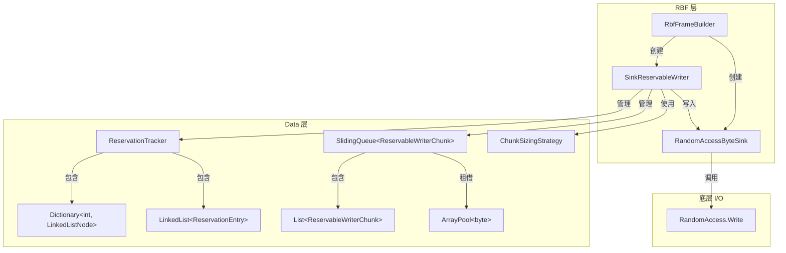

# RBF 写入路径堆对象分配分析

> **分析日期**：2026-02-01
> **分析者**：Implementer
> **范围**：`RbfFrameBuilder` → `SinkReservableWriter` → `IByteSink` 完整写入链

---

## 1. 调用链总览



### 调用链层级（缩进列表）

```
RbfFrameBuilder (sealed class)                     [L37-L161]
├── 构造函数创建
│   ├── RandomAccessByteSink (sealed class)        [atelia/src/Rbf/Internal/RandomAccessByteSink.cs:L16]
│   └── SinkReservableWriter (sealed class)        [atelia/src/Data/SinkReservableWriter.cs:L20]
│       ├── ChunkSizingStrategy (sealed class)     [atelia/src/Data/ChunkSizingStrategy.cs:L10]
│       ├── SlidingQueue<ReservableWriterChunk>    [atelia/src/Data/SlidingQueue.cs:L24]
│       │   └── List<ReservableWriterChunk>        [内置 BCL]
│       └── ReservationTracker (sealed class)      [atelia/src/Data/ReservationTracker.cs:L13]
│           ├── Dictionary<int, LinkedListNode>    [延迟初始化]
│           └── LinkedList<ReservationEntry>       [延迟初始化]
│
├── PayloadAndMeta.GetSpan() / Advance()
│   └── SinkReservableWriter.EnsureSpace()
│       └── CreateChunk() → ArrayPool.Rent()
│           └── new ReservableWriterChunk()        [atelia/src/Data/ReservableWriterChunk.cs:L12]
│
├── PayloadAndMeta.ReserveSpan()
│   └── ReservationTracker.Add()
│       └── new ReservationEntry()                 [atelia/src/Data/ReservationEntry.cs:L6]
│       └── LinkedList.AddLast() → new node
│
├── EndAppend()
│   ├── new FrameLayout (readonly struct)          [栈分配]
│   ├── GetCrcSinceReservationEnd()                [无分配]
│   └── SinkReservableWriter.Commit()
│       └── FlushCommittedData() → IByteSink.Push()
│           └── RandomAccessByteSink.Push()
│               └── RandomAccess.Write()
│
└── Dispose()
    └── SinkReservableWriter.Reset() / Dispose()
        └── ArrayPool.Return()
```

---

## 2. 堆分配清单

### 2.1 每帧写入固定分配（Per-Frame Fixed）

| 位置 | 类型 | 分配原因 | 大小估算 | 优化建议 | 收益 |
|:-----|:-----|:---------|:---------|:---------|:-----|
| [RbfFrameBuilder.cs#L37](../../../atelia/src/Rbf/RbfFrameBuilder.cs#L37) | `RbfFrameBuilder` (sealed class) | 每帧创建新实例 | 56-72B | **池化复用** | 🔴 高 |
| [RbfFrameBuilder.cs#L50](../../../atelia/src/Rbf/RbfFrameBuilder.cs#L50) | `RandomAccessByteSink` (sealed class) | Builder 构造函数内 new | 24-32B | 嵌入到 Builder 或池化 | 🟡 中 |
| [RbfFrameBuilder.cs#L53](../../../atelia/src/Rbf/RbfFrameBuilder.cs#L53) | `SinkReservableWriter` (sealed class) | Builder 构造函数内 new | 80-100B | 池化或 Reset 复用 | 🔴 高 |

### 2.2 SinkReservableWriter 内部分配（延迟/按需）

| 位置 | 类型 | 分配原因 | 触发条件 | 优化建议 | 收益 |
|:-----|:-----|:---------|:---------|:---------|:-----|
| [SinkReservableWriter.cs#L21](../../../atelia/src/Data/SinkReservableWriter.cs#L21) | `ChunkSizingStrategy` (sealed class) | 构造函数 | 每个 Writer 实例 | 改为 readonly struct | 🟢 低 |
| [SinkReservableWriter.cs#L25](../../../atelia/src/Data/SinkReservableWriter.cs#L25) | `SlidingQueue<ReservableWriterChunk>` (sealed class) | 构造函数 | 每个 Writer 实例 | 池化或嵌入 Writer | 🟡 中 |
| [SinkReservableWriter.cs#L91](../../../atelia/src/Data/SinkReservableWriter.cs#L91) | `ReservationTracker` (sealed class) | 字段初始化器 | 每个 Writer 实例 | struct + 显式初始化 | 🟡 中 |
| [SlidingQueue.cs#L38](../../../atelia/src/Data/SlidingQueue.cs#L38) | `List<T>` (内置) | SlidingQueue 构造 | 每个 Queue 实例 | 无，依赖池化 Writer | 🟢 低 |

### 2.3 每次 Chunk 创建分配

| 位置 | 类型 | 分配原因 | 触发条件 | 优化建议 | 收益 |
|:-----|:-----|:---------|:---------|:---------|:-----|
| [SinkReservableWriter.cs#L36](../../../atelia/src/Data/SinkReservableWriter.cs#L36) | `ReservableWriterChunk` (sealed class) | new 创建 chunk 元数据 | payload 超过当前 chunk | 改为 struct 或池化 | 🟡 中 |
| [SinkReservableWriter.cs#L37](../../../atelia/src/Data/SinkReservableWriter.cs#L37) | `byte[]` via ArrayPool | Rent buffer | 同上 | ✅ 已池化 | — |

### 2.4 每次 Reservation 分配

| 位置 | 类型 | 分配原因 | 触发条件 | 优化建议 | 收益 |
|:-----|:-----|:---------|:---------|:---------|:-----|
| [ReservationTracker.cs#L43](../../../atelia/src/Data/ReservationTracker.cs#L43) | `ReservationEntry` (sealed class) | new 创建 entry | 每次 ReserveSpan | 改为 struct | 🟡 中 |
| [ReservationTracker.cs#L46](../../../atelia/src/Data/ReservationTracker.cs#L46) | `LinkedListNode<ReservationEntry>` | AddLast 创建 | 同上 | 使用数组索引代替链表 | 🟡 中 |
| [ReservationTracker.cs#L77](../../../atelia/src/Data/ReservationTracker.cs#L77) | `Dictionary` 首次分配 | EnsureInitialized | 首次 Add | 预分配或内联数组 | 🟢 低 |
| [ReservationTracker.cs#L78](../../../atelia/src/Data/ReservationTracker.cs#L78) | `LinkedList` 首次分配 | EnsureInitialized | 首次 Add | 同上 | 🟢 低 |

### 2.5 值类型（无堆分配）✅

| 位置 | 类型 | 说明 |
|:-----|:-----|:-----|
| [RbfLayout.cs#L54](../../../atelia/src/Rbf/Internal/RbfLayout.cs#L54) | `FrameLayout` (readonly struct) | 帧布局计算，栈分配 |
| [TrailerCodewordHelper.cs#L12](../../../atelia/src/Rbf/Internal/TrailerCodewordHelper.cs#L12) | `TrailerCodewordData` (readonly struct) | Trailer 解析结果，栈分配 |
| [SizedPtr.cs#L18](../../../atelia/src/Data/SizedPtr.cs#L18) | `SizedPtr` (readonly record struct) | Fat Pointer，栈分配 |
| [SlidingQueue.cs#L168](../../../atelia/src/Data/SlidingQueue.cs#L168) | `SlidingQueue<T>.Enumerator` (struct) | 枚举器，栈分配 |

---

## 3. 装箱与闭包分析

### 3.1 装箱操作

**未发现显著装箱**：

- `IBufferWriter<byte>` 接口：`SinkReservableWriter` 是 sealed class，接口调用通过 constrained callvirt 优化，无装箱。
- `IReservableBufferWriter` 接口：同上。
- `IByteSink` 接口：`RandomAccessByteSink` 是 sealed class，无装箱。

### 3.2 委托/闭包捕获

| 位置 | 类型 | 分析 |
|:-----|:-----|:-----|
| [RbfFrameBuilder.cs#L34](../../../atelia/src/Rbf/RbfFrameBuilder.cs#L34) | `Action<long> _onCommitCallback` | 由调用方传入，可能捕获外部状态，但每帧只调用一次 |
| [RbfFrameBuilder.cs#L35](../../../atelia/src/Rbf/RbfFrameBuilder.cs#L35) | `Action _clearBuilderFlag` | 同上 |
| [ChunkedReservableWriterOptions.cs#L26](../../../atelia/src/Data/ChunkedReservableWriterOptions.cs#L26) | `Action<string, string>? DebugLog` | 可选调试回调，生产环境为 null |

**结论**：回调由上层传入，不产生新闭包；若上层使用 lambda 捕获，分配在上层。

---

## 4. 优化机会汇总

### 4.1 高收益优化（推荐优先实施）

| 优化项 | 方案 | 预估收益 | 复杂度 | 风险 |
|:-------|:-----|:---------|:-------|:-----|
| **RbfFrameBuilder 池化** | 使用 `ObjectPool<RbfFrameBuilder>` + Reset 方法 | 消除每帧 3 次堆分配（Builder+Sink+Writer） | 中 | 低：需确保 Reset 清理完整 |
| **SinkReservableWriter 复用** | 添加 `Reset(IByteSink)` 方法，允许切换 sink 后复用 | 消除每帧 1 次分配（~100B） | 低 | 低：已有 Reset()，扩展即可 |

### 4.2 中等收益优化

| 优化项 | 方案 | 预估收益 | 复杂度 | 风险 |
|:-------|:-----|:---------|:-------|:-----|
| **ReservableWriterChunk 改 struct** | 改为 `ref struct` 或普通 `struct` | 减少每 chunk 1 次分配（~32B） | 中 | 中：需调整 SlidingQueue 存储方式 |
| **ReservationEntry 改 struct** | 改为 `struct`，使用数组替代链表 | 减少每 reservation 2 次分配 | 中 | 中：需重新实现 Tracker |
| **RandomAccessByteSink 嵌入** | 作为 Builder 的内嵌字段而非独立对象 | 消除每帧 1 次分配（~24B） | 低 | 低：Sink 无复杂生命周期 |

### 4.3 低收益优化

| 优化项 | 方案 | 预估收益 | 复杂度 | 风险 |
|:-------|:-----|:---------|:-------|:-----|
| **ChunkSizingStrategy 改 struct** | 改为 readonly struct | 消除 1 次分配（~24B） | 低 | 低 |
| **SlidingQueue 内联** | 将 SlidingQueue 逻辑内联到 Writer | 消除 1 次分配 | 高 | 中：增加 Writer 复杂度 |

---

## 5. 具体优化方案

### 5.1 方案 A：Builder 池化（推荐）

```csharp
// 在 RbfFileImpl 中添加
private readonly ObjectPool<RbfFrameBuilder> _builderPool;

// Builder 添加 Reset 方法
internal void Reset(SafeFileHandle handle, long frameStart, Action<long> callback, Action clearFlag) {
    _frameStart = frameStart;
    _onCommitCallback = callback;
    _clearBuilderFlag = clearFlag;
    _committed = false;
    _disposed = false;
    
    _sink.Reset(handle, frameStart);  // 新增 Reset 方法
    _writer.Reset();                   // 已有
    _headLenReservationToken = _writer.ReserveSpan(4, out var _, "HeadLen");
}

// 使用时
var builder = _builderPool.Get();
builder.Reset(...);
// ... 使用 builder ...
_builderPool.Return(builder);
```

**预估节省**：每帧 ~150-200B 堆分配 → 0B（摊销）

### 5.2 方案 B：ReservationTracker 重构

```csharp
// 当前：class + LinkedList + Dictionary
internal sealed class ReservationTracker {
    private Dictionary<int, LinkedListNode<ReservationEntry>>? _tokenToNode;
    private LinkedList<ReservationEntry>? _reservationOrder;
}

// 优化后：struct + 内联数组
internal struct ReservationTracker {
    // 大多数场景只有 1-2 个 pending reservations
    private ReservationEntry _entry0;
    private ReservationEntry _entry1;
    private int _token0, _token1;
    private int _count;
    
    // 超过 2 个时才 fallback 到堆分配
    private List<(int token, ReservationEntry entry)>? _overflow;
}
```

**预估节省**：每 reservation ~64B → 0B（内联场景）

### 5.3 方案 C：Chunk 元数据内联

```csharp
// 当前
internal sealed class ReservableWriterChunk { ... }

// 优化后：使用 ArraySegment 或自定义 struct
internal struct ChunkMetadata {
    public int DataEnd;
    public int DataBegin;
}

// 配合 byte[] 直接存储在 List<(byte[], ChunkMetadata)> 中
```

---

## 6. 风险评估

### 6.1 池化风险

| 风险 | 影响 | 缓解措施 |
|:-----|:-----|:---------|
| Reset 不完整 | 脏状态泄露到下次使用 | 全面的 Reset 单元测试 |
| 池饱和 | 高并发时仍然分配 | 设置合理池上限；监控池命中率 |
| 生命周期混淆 | 提前归还导致 use-after-free | 使用 token 或 generation ID 检测 |

### 6.2 struct 化风险

| 风险 | 影响 | 缓解措施 |
|:-----|:-----|:---------|
| 复制开销 | 大 struct 复制比引用传递更贵 | 使用 `ref`/`in` 参数传递 |
| 防御性复制 | readonly struct 在某些场景被复制 | 谨慎设计 API |
| 集合存储 | `List<struct>` 无法原地修改 | 使用索引+手动设置 |

---

## 7. 建议实施顺序

1. **Phase 1**（低风险高收益）：
   - RandomAccessByteSink 嵌入 Builder（~2h）
   - ChunkSizingStrategy 改 struct（~1h）

2. **Phase 2**（中等风险高收益）：
   - SinkReservableWriter 添加 `Reset(IByteSink)` 支持复用（~3h）
   - RbfFrameBuilder 池化（~4h）

3. **Phase 3**（需要基准测试验证）：
   - ReservationTracker 重构（~6h）
   - ReservableWriterChunk 优化（~4h）

---

## 8. 附录：关键代码位置索引

| 概念 | 文件 | 关键行号 |
|:-----|:-----|:---------|
| Builder 入口 | [RbfFrameBuilder.cs](../../../atelia/src/Rbf/RbfFrameBuilder.cs) | L37-L56 构造，L66-L139 EndAppend |
| Writer 核心 | [SinkReservableWriter.cs](../../../atelia/src/Data/SinkReservableWriter.cs) | L30-L45 Chunk 创建，L141-L175 Reservation |
| Tracker | [ReservationTracker.cs](../../../atelia/src/Data/ReservationTracker.cs) | L35-L48 Add，L51-L62 TryCommit |
| Chunk | [ReservableWriterChunk.cs](../../../atelia/src/Data/ReservableWriterChunk.cs) | 完整文件 |
| Entry | [ReservationEntry.cs](../../../atelia/src/Data/ReservationEntry.cs) | 完整文件 |
| Sink | [RandomAccessByteSink.cs](../../../atelia/src/Rbf/Internal/RandomAccessByteSink.cs) | L16-L51 |
| Layout | [RbfLayout.cs](../../../atelia/src/Rbf/Internal/RbfLayout.cs) | L54-L158 FrameLayout struct |
