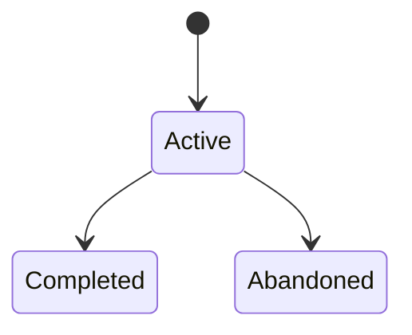

# Wish 系统规范 (Rule-Layer 条款)

> **文档性质**: 规范性 (Normative)
> **版本**: 0.4.0
> **创建日期**: 2025-12-30
> **ParentWish**: [W-0001](../active/wish-0001-wish-system-bootstrap.md)

本文档定义 Wish 系统的 MUST/SHOULD/MAY 条款，是 Wish 系统自身的 Rule-Layer 产物。

## 上位约定

- 本文档遵循上位文档 [Atelia 规范约定](../../atelia/docs/spec-conventions.md)，包括：
  - 规范语言（MUST/SHOULD/MAY）的解释边界
  - 条款编号（Requirement IDs）的命名与前缀分类
  - 文档表示法（避免 ASCII art，优先 Mermaid/表格/列表）

---

## §1 Wish 系统术语

> **术语分层说明**：
> - **本节**：仅定义 Wish 系统特有术语
> - **全局概念**（如 SSOT、五层级方法论）：请查阅 [Atelia 术语表](../../agent-team/wiki/terminology.md)
> - **写法规范**：请查阅 [规范约定](../../atelia/docs/spec-conventions.md) §4

| 术语 | 定义 | 备注 |
|:-----|:-----|:-----|
| **Wish** | 意图载体 + 产物索引的入口节点，承载动机并链接各层级产物 | 核心概念 |
| **WishId** | Wish 的唯一标识符，格式 `W-XXXX` | 如 `W-0001` |
| **Issue** | 问题/阻塞的记录单元，必须关联到层级；通常关联某个 Wish | 孤立 Issue 使用 `RelatedWishId: Orphan` |
| **IssueId** | Issue 的唯一标识符，格式 `I-XXXX` | 如 `I-0001` |
| **RelatedWishId** | Issue 元信息字段，标识关联的 Wish | `Orphan` 表示孤立 Issue |

---

## §2 Wish 文档格式条款

### §2.1 元信息区 (Frontmatter)

- **[F-WISH-FRONTMATTER-REQUIRED]** MUST：每个 Wish 文档必须包含 YAML frontmatter 元信息区。
- **[F-WISH-FRONTMATTER-REQUIRED-FIELDS]** MUST：frontmatter 必须包含以下必填字段：
  - `wishId`: 唯一且稳定的标识符，格式 `W-XXXX`
  - `title`: 标题，长度 ≤ 80 字符
  - `status`: 状态枚举，值为 `Active` | `Completed` | `Abandoned`
  - `owner`: 责任人/角色
  - `created`: 创建日期，格式 `YYYY-MM-DD`
  - `updated`: 最后更新日期，格式 `YYYY-MM-DD`
- **[F-WISH-FRONTMATTER-TAGS-OPTIONAL]** SHOULD：frontmatter 可包含 `tags` 字段用于分类。

### §2.2 内容结构

- **[F-WISH-ONE-LINE-MOTIVATION]** MUST：Wish 文档必须包含"一句话动机"（≤ 50 字）。
- **[F-WISH-GOALS-NONGOALS-SECTION]** MUST：Wish 文档必须包含"目标与边界"章节，明确 Goals 和 Non-Goals。
- **[F-WISH-ACCEPTANCE-SECTION]** MUST：Wish 文档必须包含"验收标准"章节，至少 1 条可判定的验收条件。
- **[F-WISH-LAYER-PROGRESS-TABLE]** MUST：Wish 文档必须包含"层级进度"表格，追踪 Why-Layer 到 Craft-Layer 各层级状态。
- **[F-WISH-LAYER-PROGRESS-LINKS]** MUST：层级进度表格中的产物链接必须指向实际文件或明确标注 `N/A` 及原因。
- **[F-WISH-CHANGELOG-SECTION]** MUST：Wish 文档必须包含"变更日志"章节，记录状态变更历史。

### §2.3 内容边界

- **[S-WISH-NO-RULES-REPEAT]** MUST：Wish 文档不得复述条款正文，只能使用链接引用。
- **[S-WISH-NORMATIVE-SCOPE]** MUST：Wish 中出现的 MUST/SHOULD/MAY 语句只能用于 Wish 系统自身的流程规范，不得用于项目功能规范。
- **[S-WISH-LENGTH-BUDGET]** SHOULD：Wish 文档总长度建议 ≤ 100 行（不含 frontmatter）。

---

## §3 目录与命名条款

### §3.1 目录结构

- **[F-WISH-DIR-EXCLUSIVE]** MUST：Wish 文件必须存放在以下互斥目录之一：
  - `wishes/active/` — 活跃 Wish
  - `wishes/completed/` — 已完成 Wish
  - `wishes/abandoned/` — 已放弃 Wish
- **[F-WISH-DIR-UNIQUE]** MUST：同一 Wish 不得在多个目录同时存在。
- **[S-WISH-STATUS-MATCH-DIR]** MUST：文档内 `status` 字段必须与所在目录一致。

### §3.2 文件命名

- **[F-WISH-FILENAME-SLUG]** MUST：Wish 文件名必须使用稳定 slug 格式：`wish-XXXX-<kebab-case-slug>.md`
  - `XXXX`: 4 位数字序号（如 0001, 0002）
  - `<kebab-case-slug>`: 简短描述性 slug
- **[F-WISH-FILENAME-ID-MATCH]** MUST：文件名中的序号必须与 frontmatter 中的 `wishId` 一致。
- **[S-WISH-FILENAME-STABILITY]** SHOULD：slug 应保持稳定，避免因标题变化而重命名。

---

## §4 index.md 条款

- **[S-WISH-INDEX-DERIVED-VIEW]** MUST：`wishes/index.md` 定义为**派生视图**，可从 `wishes/active/*.md` 等目录扫描重建。
- **[S-WISH-INDEX-SHORTEST-PATHS]** SHOULD：index.md 应提供以下两条最短路径：
  - "我该从哪开始读"（Top-N active wishes）
  - "当前阻塞是什么"（Blocked issues）
- **[S-WISH-INDEX-UPDATE-ON-MOVE]** MUST：修改 Wish 状态/路径时，必须同步更新 index.md。
- **[S-WISH-INDEX-ISSUE-LIST-OPTIONAL]** MAY：Issue 索引可独立为 `wishes/issues.md`，但 index.md 必须链接到它。

---

## §5 Issue 条款

### §5.1 必填字段

- **[F-ISSUE-REQUIRED-FIELDS]** MUST：每个 Issue 必须包含以下字段：
  - `IssueId`: 唯一标识，格式 `I-XXXX`
  - `Status`: 状态枚举 — `Open` | `InProgress` | `Blocked` | `Done` | `Deferred`
  - `Layer`: 所属层级 — `Why-Layer` | `Shape-Layer` | `Rule-Layer` | `Plan-Layer` | `Craft-Layer`
  - `RelatedWishId`: 关联 Wish，孤立 Issue 标记为 `Orphan`
  - `Owner`: 负责人/角色
  - `LastUpdated`: 最后更新日期

### §5.2 条件必填

- **[F-ISSUE-BLOCKED-REQUIRES-REASON]** MUST：当 Status = `Blocked` 时，必须填写 `BlockerReason`。
- **[F-ISSUE-DONE-REQUIRES-VERIFICATION]** MUST：当 Status = `Done` 时，必须写出验证方式。
- **[F-ISSUE-DEFERRED-REQUIRES-HANDOFF]** MUST：当 Status = `Deferred` 时，必须指向承接对象（Wish/里程碑）。

### §5.3 Wish 阻塞联动

- **[S-WISH-BLOCKED-REQUIRES-ISSUE]** MUST：任何 Wish 被标记为阻塞（层级进度中出现 🔴）时，必须存在至少一个关联的 `Status=Blocked` Issue。

---

## §6 状态转换条款

### §6.1 状态机定义

### §6.2 转换条件

- **[S-WISH-ACTIVE-TO-COMPLETED]** MUST：Active → Completed 需满足：
  - 验收标准中全部条件已勾选
  - 所有关联 Issue 处于 `Done` 或 `Deferred` 状态
  - Deferred Issue 必须指向后续承接对象
- **[S-WISH-ACTIVE-TO-ABANDONED]** MUST：Active → Abandoned 需满足：
  - 写明放弃原因（例如：被更高优先级替代、不可行、与方向冲突）
  - 若被替代，必须填写 `SupersededBy` 链接到替代 WishId
- **[S-WISH-REOPEN-SHOULD-NOT]** SHOULD：Completed/Abandoned → Active（复活）默认禁止，建议创建新 Wish 并引用旧 Wish。
- **[S-WISH-REOPEN-REQUIRES-FIELDS]** MAY：若确需复活，必须在 Wish 内追加 `ReopenedOn` 与原因。

### §6.3 更新时机

- **[S-WISH-REVIEW-AFTER-MEETING]** MUST：每次畅谈会/评审会结束时，必须对涉及的 Wish 执行状态/链接验收。
- **[S-WISH-CHANGELOG-ON-STATUS-CHANGE]** MUST：状态变更必须记录到变更日志（Change Log）。

---

## §7 双向链接条款

- **[F-WISH-RELATIVE-LINKS]** MUST：Wish 文档中的层级产物链接必须使用相对路径。
- **[F-ARTIFACT-PARENTWISH-REQUIRED]** MUST：被引用的层级产物文档头部必须包含 `ParentWish: <link>`。
- **[S-WISH-LINK-HEALTH-CHECK]** SHOULD：定期执行链接健康检查（MVP 阶段可人工执行）。

---

## §8 维护预算条款

- **[S-WISH-MAINTENANCE-BUDGET]** SHOULD：Wish 系统维护时间 ≤ 总工作时间的 5%。
- **[S-WISH-ISSUE-COUNT-TRIAGE]** SHOULD：当 Issue 数量 > 20 时触发整理任务。

---

## 旧条款编号映射（DEPRECATED）

> 说明：在本文件早期版本中曾使用 `WS-*` 序号式条款编号。
> 本节仅用于兼容历史引用；规范性语义以正文中新的稳定语义锚点为准。

| 旧 ID（DEPRECATED） | 新 ID（SSOT） |
|---|---|
| `[WS-F-001]` | `[F-WISH-FRONTMATTER-REQUIRED]` |
| `[WS-F-002]` | `[F-WISH-FRONTMATTER-REQUIRED-FIELDS]` |
| `[WS-F-003]` | `[F-WISH-FRONTMATTER-TAGS-OPTIONAL]` |
| `[WS-F-010]` | `[F-WISH-ONE-LINE-MOTIVATION]` |
| `[WS-F-011]` | `[F-WISH-GOALS-NONGOALS-SECTION]` |
| `[WS-F-012]` | `[F-WISH-ACCEPTANCE-SECTION]` |
| `[WS-F-013]` | `[F-WISH-LAYER-PROGRESS-TABLE]` |
| `[WS-F-014]` | `[F-WISH-LAYER-PROGRESS-LINKS]` |
| `[WS-F-015]` | `[F-WISH-CHANGELOG-SECTION]` |
| `[WS-F-020]` | `[S-WISH-NO-RULES-REPEAT]` |
| `[WS-F-021]` | `[S-WISH-NORMATIVE-SCOPE]` |
| `[WS-F-022]` | `[S-WISH-LENGTH-BUDGET]` |
| `[WS-D-001]` | `[F-WISH-DIR-EXCLUSIVE]` |
| `[WS-D-002]` | `[F-WISH-DIR-UNIQUE]` |
| `[WS-D-003]` | `[S-WISH-STATUS-MATCH-DIR]` |
| `[WS-D-010]` | `[F-WISH-FILENAME-SLUG]` |
| `[WS-D-011]` | `[F-WISH-FILENAME-ID-MATCH]` |
| `[WS-D-012]` | `[S-WISH-FILENAME-STABILITY]` |
| `[WS-I-001]` | `[S-WISH-INDEX-DERIVED-VIEW]` |
| `[WS-I-002]` | `[S-WISH-INDEX-SHORTEST-PATHS]` |
| `[WS-I-003]` | `[S-WISH-INDEX-UPDATE-ON-MOVE]` |
| `[WS-I-004]` | `[S-WISH-INDEX-ISSUE-LIST-OPTIONAL]` |
| `[WS-IS-001]` | `[F-ISSUE-REQUIRED-FIELDS]` |
| `[WS-IS-010]` | `[F-ISSUE-BLOCKED-REQUIRES-REASON]` |
| `[WS-IS-011]` | `[F-ISSUE-DONE-REQUIRES-VERIFICATION]` |
| `[WS-IS-012]` | `[F-ISSUE-DEFERRED-REQUIRES-HANDOFF]` |
| `[WS-IS-020]` | `[S-WISH-BLOCKED-REQUIRES-ISSUE]` |
| `[WS-ST-001]` | `[S-WISH-ACTIVE-TO-COMPLETED]` |
| `[WS-ST-002]` | `[S-WISH-ACTIVE-TO-ABANDONED]` |
| `[WS-ST-003]` | `[S-WISH-REOPEN-SHOULD-NOT]` |
| `[WS-ST-004]` | `[S-WISH-REOPEN-REQUIRES-FIELDS]` |
| `[WS-ST-010]` | `[S-WISH-REVIEW-AFTER-MEETING]` |
| `[WS-ST-011]` | `[S-WISH-CHANGELOG-ON-STATUS-CHANGE]` |
| `[WS-LK-001]` | `[F-WISH-RELATIVE-LINKS]` |
| `[WS-LK-002]` | `[F-ARTIFACT-PARENTWISH-REQUIRED]` |
| `[WS-LK-003]` | `[S-WISH-LINK-HEALTH-CHECK]` |
| `[WS-MN-001]` | `[S-WISH-MAINTENANCE-BUDGET]` |
| `[WS-MN-002]` | `[S-WISH-ISSUE-COUNT-TRIAGE]` |

---

## §9 术语演变说明

本规范采用统一术语格式（2025-12-31更新）：

| 层级 | 统一格式 | 语义术语 | 说明 |
|:-----|:---------|:---------|:-----|
| L1 | **Why-Layer** | Why | 价值层 |
| L2 | **Shape-Layer** | Shape | 契约层 |
| L3 | **Rule-Layer** | Rule | 约束层（使用单数） |
| L4 | **Plan-Layer** | Plan | 策略层 |
| L5 | **Craft-Layer** | Craft | 物化层 |

> **历史兼容性**：如遇旧文档使用 L1-L5、What/How/Build 等，请参照上表映射。详细术语定义见 [Atelia 术语表](../../agent-team/wiki/terminology.md)。

---

## 变更历史

| 版本 | 日期 | 作者 | 变更说明 |
|:-----|:-----|:-----|:---------|
| 0.4.0 | 2025-12-31 | DocOps | §1 术语精简：只保留 Wish 特有术语，全局概念引用术语表 |
| 0.3.0 | 2025-12-31 | Team Leader | 术语统一：移除L1-L5，采用Why-Layer等统一格式 |
| 0.2.0 | 2025-12-30 | DocOps | 术语更新：What→Shape, How→Plan, Build→Craft；添加 §9 术语演变说明 |
| 0.1.0 | 2025-12-30 | Implementer | 初始创建，基于畅谈会共识 |
